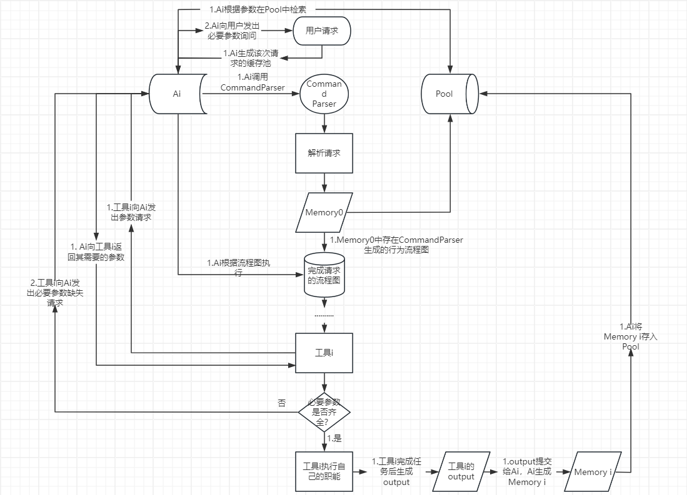

# Agent
可以通过prompt搜索工具，唤醒工具，工具获得参数后执行相应的操作。
## **工具**：
任何工具被调用时都会先从命令文本中检索需要的参数需要的参数，对于没有检索到的参数要分析此时此刻场景—温度、时间等待来得到剩余参数或者使用默认参数

也许需要一个包含该条命令执行过程中输入或生成内容的pool，工具可以从pool中获取需要的参数或者将生成的内容存入pool。

例如：当用户请求“写一个简短故事，并用女声朗读”
1. Ai首先将关键字“简短”、“故事”、“女声”、“朗读”存入pool中。  
2. Ai从tools中调用大模型检索“简短”和“故事”关键字，生成一个简短的故事。  
3. 这个简短的故事作为一个文本数据存入pool中。  
4. Ai从关键字“朗读”可以知道需要调用语音合成工具
5. 语音合成工具从pool中获取故事文本和参数“女声”，进而生成女声朗读的音频文件。  
6. 音频文件作为一个数据存入pool中。  
7. Ai将音频文件作为响应返回给用户。

这里的Ai是指什么呢？一个“首脑”？
pool中的各类数据是否需要打上标签？比如：输入、输出、中间结果？

Ai调用工具时，工具类应该包含一个方法————该方法可以命令Ai从pool中获取工具自己需要的参数。而Ai应该包含一类方法————该方法可以可以接受工具的请求（需要的参数类型和数量），然后再pool池中检索相应数据，再传递给工具。工具收到参数后，执行相应的操作，并将结果存入pool中。

流程图：

用户发出请求 -> Ai生成该次请求的Pool（缓存池？）-> Ai调用命令解析器 -> 命令解析器分析请求 -> 生成Memory0放入Pool，其中包含请求的`理解`和根据请求生成的`行为流程图` -> Ai根据流程图执行 -> Ai调用工具1 -> 工具1向Ai发出`参数请求方法`获取需要的参数 -> Ai收到工具的请求，根据请求内的参数类型向Memory0中的"output"中检索有效信息返回给工具1（若此时Pool中已经存在Memory n，则Ai可以在Pool中的多个Memory中检索工具需要的参数） -> 工具1收到参数，检查是否收到所有必要参数（如果没收到就向Ai发出请求，由Ai向用户发出参数请求） -> 工具1执行其职责，并将结果发送给Ai，Ai将以上步骤作为Memory1放入Pool中 -> Ai根据流程图执行下一步 ···



Pool中的数据应该包含：
```json
    NewPool:{
        Memory0: {
            "tools": CommandParser,
            "input": {"写一个简短故事，并用女声朗读"},
            "output": {
                "Keyword": ["写", "一个", "简短", "故事", "女声", "朗读"]
                "Flowchart": flowchart_command
            }
        }
    
        Memory1: {
            "tool": story_generator,

            # story_generator需要的参数
            "input": {"写", "一个", "简短", "故事"},

            # story_generator的输出
            "output": {"story": "..." }
        }
        Memory2: {
            "tool": voice_synthesizer,

            # voice_synthesizer需要的参数
            "input": {"story": "...", Voice_kind:"女声"},

            # voice_synthesizer的输出
            "output": {"voice": "..." }
        }

        ····
    }
```


```python
class CommandParser:
    def __init__(self):
        # 解析用户请求，生成行为流程图
        pass
```

```python
class Tool:
    def __init__(self):
        # 工具初始化
        # 工具属性, 需要的参数包括必要参数、可选参数和默认参数。
        pass

    def get_params(self):
        # 向Ai发送参数请求
        pass
```


## 拥有长期记忆和短期记忆
可以让LLM将knowledge分成公共知识（已经训练好的，永远记得，初始化好的）和记忆（使用中的，与用户相关的）两个分区（知识库？）。
对于记忆，可以按Token（该thing的关键字）排列成有序队列，为每个Token分配权重，时间越长的Token权重越低，LLM越不容易检索到，时间越短的Token权重越高，LLM越容易检索到。
也可以加入艾宾浩斯记忆曲线，为每个Token分配生命周期，自动更新。

## LLM由被动转向主动
参考计算机轮询技术，LLM每隔一段时间检索list，自我提问需要干什么以及是否需要对用户提出服务（主动的表现）。list可以包含每日时间表，计划等等，通过与用户接触可以自动向自己的list添加mark（包含时间以及其他因素）

## LLM拟人初始化
可以对LLM进行人格初始，参考MBTI，为Agent设置其性格等等，也可以由用户提出某角色，Agent直接检索角色性格进行初始化。

## LLM配置tools访问人类社区
为LLM配置可以访问人类社区（如小红书、哔哩哔哩等等），对于LLM自己无法解决用户问题时，可以通过tools访问社区surf解决方案或者主动发帖求问（需要标注属于Agent的提问，以便人类知道这是Agent提出的），LLM可以将这一行为加入list进行轮询，对帖子的讨论进行遍历获取experience or query。
