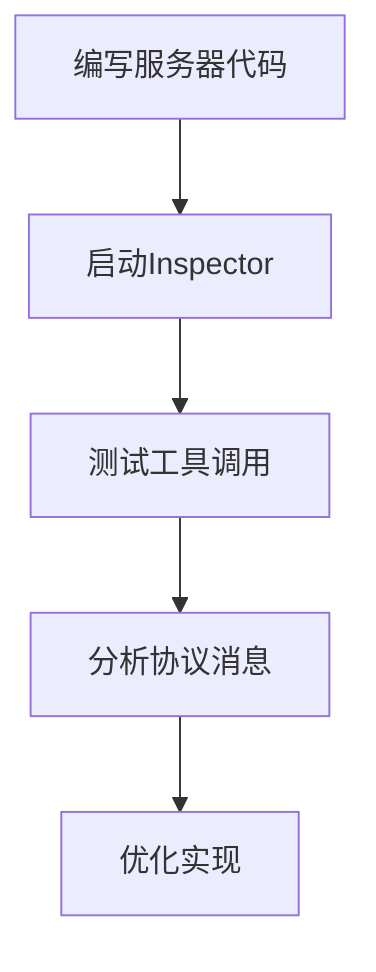
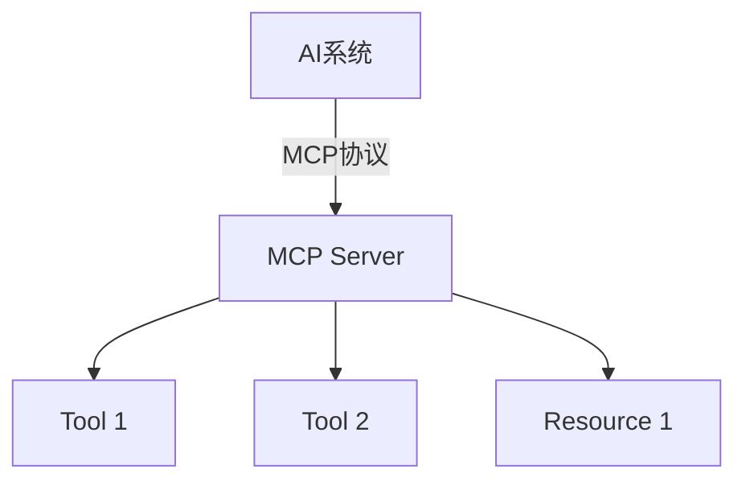
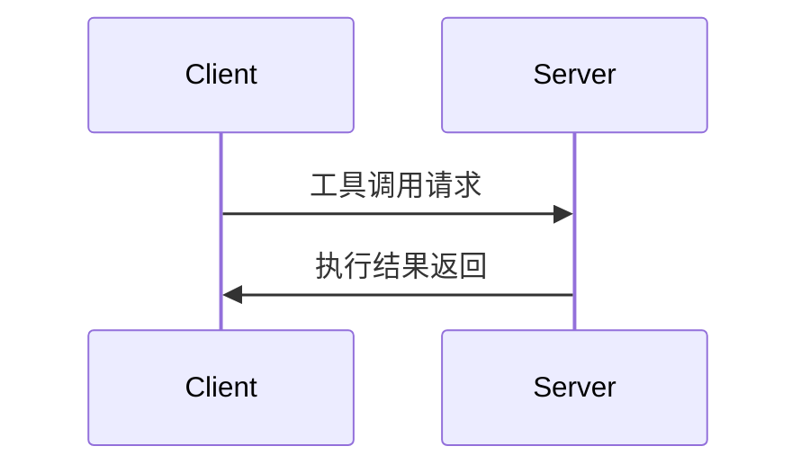

# MCP (Model Context Protocol) 协议详解

## MCP协议概述
MCP(Model Context Protocol)是一种用于AI系统与外部服务通信的协议，它允许AI系统通过标准化的方式访问工具和资源。

## 核心概念

### 工具(Tools)
- 可执行的操作或功能，如API调用、系统命令等
- 每个工具都有明确定义的输入和输出
- 示例：获取天气、发送邮件、查询数据库

### 资源(Resources)
- 系统可访问的静态或动态数据
- 可以是文件、数据库记录、API响应等
- 通过统一资源标识符(URI)访问
- 示例：`weather://beijing/current`表示北京当前天气资源

### MCP Client
- 发起MCP请求的客户端程序
- 负责与MCP Server建立连接
- 发送工具调用请求并处理响应
- 通常集成在AI系统中

### MCP Server
- 提供工具和资源的服务端程序
- 监听并处理来自Client的请求
- 管理工具和资源的生命周期
- 可以同时服务多个Client

## MCP Inspector 使用指南

### 概述
MCP Inspector 是 Model Context Protocol (MCP) 的图形化调试工具，用于开发和测试 MCP 服务器。

### 基本用法

#### 启动方式
```bash
mcp dev server.py  # 开发模式启动
mcp dev server.py --port 8080  # 指定端口
mcp dev server.py --with pandas  # 添加依赖
```

#### 访问地址
默认访问地址：
```
http://localhost:8000
```

### 界面功能解析

#### 1. 左侧面板
- **工具列表**：显示所有注册的 @mcp.tool() 方法
- **资源列表**：显示所有 @mcp.resource() 注册的资源
- **服务器信息**：显示服务器名称/版本等元数据

#### 2. 右侧面板
- **请求/响应区**：
  - 参数输入框
  - 执行按钮
  - 响应结果显示
- **消息监控**：实时显示原始协议消息
- **历史记录**：保存的测试用例

### 核心功能详解

#### 工具测试
1. 在工具列表选择工具
2. 输入 JSON 格式参数：
```json
{"param1": "value1", "param2": 123}
```
3. 点击"Execute"执行
4. 查看返回结果

#### 高级功能
- **消息追踪**：点击"Raw Messages"查看协议细节
- **测试代码生成**：右键工具→"Generate Test Code"
- **性能分析**："Timing"选项卡显示各阶段耗时

### 典型工作流


### 注意事项
1. 确保 Python ≥ 3.8
2. 复杂参数需严格遵循 JSON 格式
3. 网络资源需要正确处理异步

## MCP架构



## MCP Server 安装与连接方式指南

### 安装方式详解

#### 1. uvx安装 (推荐)
```bash
uvx install mcp-server-[服务名]
```
**默认连接协议**: stdio  
**特点**:
- 自动管理依赖和版本
- 内置虚拟环境隔离
- 支持热更新

**配置示例**:
```json
{
  "servers": {
    "time": {
      "command": "uvx",
      "args": ["mcp-server-time"]
    }
  }
}
```

**修改为SSE连接**:
```json
{
  "servers": {
    "time": {
      "command": "uvx",
      "args": ["mcp-server-time"],
      "protocol": "sse",
      "port": 3002
    }
  }
}
```

#### 2. pip安装
```bash
pip install mcp-server-[服务名]
```
**默认连接协议**: stdio  
**特点**:
- 需要手动管理依赖
- 全局或虚拟环境安装

**配置示例**:
```json
{
  "servers": {
    "time": {
      "command": "python",
      "args": ["-m", "mcp_server_time"]
    }
  }
}
```

#### 3. Docker安装
```bash
docker pull mcp/[服务名]
```
**默认连接协议**: SSE (端口8080)  
**特点**:
- 隔离性最好
- 需要Docker环境

**配置示例**:
```json
{
  "servers": {
    "time": {
      "command": "docker",
      "args": ["run", "-p", "3002:8080", "mcp/time"]
    }
  }
}
```

### 连接协议对比

| 协议  | 适用安装方式       | 性能   | 跨主机 | 配置复杂度 |
|-------|------------------|--------|--------|------------|
| stdio | uvx/pip         | 极高   | 不支持 | 简单       |
| SSE   | Docker/手动配置 | 中等   | 支持   | 中等       |
| WS    | 自定义部署       | 高     | 支持   | 复杂       |

### 协议切换指南

#### stdio → SSE
1. 停止当前服务
2. 修改配置文件：
```json
"protocol": "sse",
"port": [自定义端口]
```
3. 添加防火墙规则(如果需要)

#### SSE → stdio
1. 确保客户端和服务在同一主机
2. 修改配置文件：
```json
"protocol": "stdio"
```
3. 移除端口配置

### 调试技巧

1. 检查活动连接：
```bash
uvx inspect mcp-server-[服务名]
```

2. 查看协议类型：
```bash
netstat -ano | findstr [端口]
```

3. 强制使用指定协议运行：
```bash
uvx run mcp-server-time --protocol sse --port 3002
```

### 最佳实践建议

1. 开发环境优先使用uvx+stdio组合
2. 生产环境推荐Docker+SSE组合
3. 跨主机通信必须使用SSE/WS协议
4. 性能敏感场景使用stdio协议

## 构建MCP Server示例

```typescript
#!/usr/bin/env node
import { Server } from '@modelcontextprotocol/sdk/server/index.js';
import { StdioServerTransport } from '@modelcontextprotocol/sdk/server/stdio.js';

class MyMCPServer {
  private server: Server;

  constructor() {
    this.server = new Server(
      { name: 'my-mcp-server', version: '0.1.0' },
      { capabilities: { resources: {}, tools: {} } }
    );

    this.setupToolHandlers();
    
    this.server.onerror = (error) => console.error('[MCP Error]', error);
  }

  private setupToolHandlers() {
    // 示例工具：获取服务器时间
    this.server.setToolHandler('get_time', async () => {
      return {
        content: [{
          type: 'text',
          text: new Date().toISOString()
        }]
      };
    });
  }

  async run() {
    const transport = new StdioServerTransport();
    await this.server.connect(transport);
    console.error('MCP server running');
  }
}

const server = new MyMCPServer();
server.run().catch(console.error);
```

## 构建MCP Client示例

```typescript
import { Client } from '@modelcontextprotocol/sdk/client/index.js';
import { StdioClientTransport } from '@modelcontextprotocol/sdk/client/stdio.js';

async function runClient() {
  const client = new Client();
  const transport = new StdioClientTransport();
  
  await client.connect(transport);
  
  // 调用服务器工具
  const result = await client.callTool('get_time', {});
  console.log('Server time:', result.content[0].text);
  
  await client.disconnect();
}

runClient().catch(console.error);
```

## 工作原理详解

### 通信流程


### 工具调用过程
1. 客户端发送工具名称和参数
2. 服务器查找并执行对应工具
3. 服务器返回执行结果
4. 客户端处理结果

## 实际应用场景

- **数据获取**：通过MCP访问数据库或API
- **系统控制**：执行系统命令或操作
- **扩展能力**：为AI系统添加新功能

## 常见问题解答

**Q: MCP与REST API有什么区别？**
A: MCP是专为AI系统设计的协议，更注重工具和资源的标准化访问。

**Q: 如何保证安全性？**
A: 可以通过TLS加密通信，并实现认证机制。

## 扩展阅读

- [MCP官方文档](https://modelcontextprotocol.org)
- [示例项目仓库](https://github.com/modelcontextprotocol/examples)
