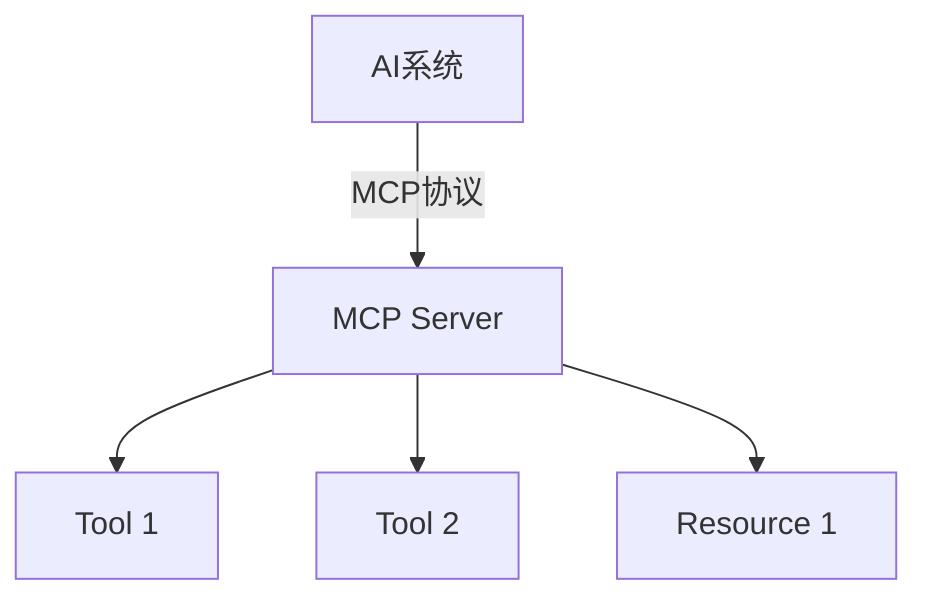
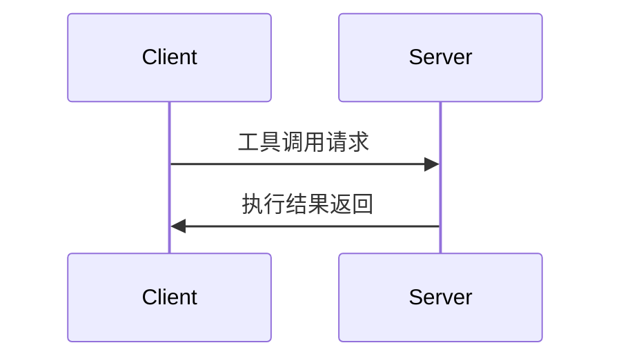

# MCP (Model Context Protocol) 协议详解

## MCP协议概述
MCP(Model Context Protocol)是一种用于AI系统与外部服务通信的协议，它允许AI系统通过标准化的方式访问工具和资源。

## 核心概念

### 工具(Tools)
- 可执行的操作或功能，如API调用、系统命令等
- 每个工具都有明确定义的输入和输出
- 示例：获取天气、发送邮件、查询数据库

### 资源(Resources)
- 系统可访问的静态或动态数据
- 可以是文件、数据库记录、API响应等
- 通过统一资源标识符(URI)访问
- 示例：`weather://beijing/current`表示北京当前天气资源

### MCP Client
- 发起MCP请求的客户端程序
- 负责与MCP Server建立连接
- 发送工具调用请求并处理响应
- 通常集成在AI系统中

### MCP Server
- 提供工具和资源的服务端程序
- 监听并处理来自Client的请求
- 管理工具和资源的生命周期
- 可以同时服务多个Client

## MCP架构



## 构建MCP Server示例

```typescript
#!/usr/bin/env node
import { Server } from '@modelcontextprotocol/sdk/server/index.js';
import { StdioServerTransport } from '@modelcontextprotocol/sdk/server/stdio.js';

class MyMCPServer {
  private server: Server;

  constructor() {
    this.server = new Server(
      { name: 'my-mcp-server', version: '0.1.0' },
      { capabilities: { resources: {}, tools: {} } }
    );

    this.setupToolHandlers();
    
    this.server.onerror = (error) => console.error('[MCP Error]', error);
  }

  private setupToolHandlers() {
    // 示例工具：获取服务器时间
    this.server.setToolHandler('get_time', async () => {
      return {
        content: [{
          type: 'text',
          text: new Date().toISOString()
        }]
      };
    });
  }

  async run() {
    const transport = new StdioServerTransport();
    await this.server.connect(transport);
    console.error('MCP server running');
  }
}

const server = new MyMCPServer();
server.run().catch(console.error);
```

## 构建MCP Client示例

```typescript
import { Client } from '@modelcontextprotocol/sdk/client/index.js';
import { StdioClientTransport } from '@modelcontextprotocol/sdk/client/stdio.js';

async function runClient() {
  const client = new Client();
  const transport = new StdioClientTransport();
  
  await client.connect(transport);
  
  // 调用服务器工具
  const result = await client.callTool('get_time', {});
  console.log('Server time:', result.content[0].text);
  
  await client.disconnect();
}

runClient().catch(console.error);
```

## 工作原理详解

### 通信流程


### 工具调用过程
1. 客户端发送工具名称和参数
2. 服务器查找并执行对应工具
3. 服务器返回执行结果
4. 客户端处理结果

## 实际应用场景

- **数据获取**：通过MCP访问数据库或API
- **系统控制**：执行系统命令或操作
- **扩展能力**：为AI系统添加新功能

## 常见问题解答

**Q: MCP与REST API有什么区别？**
A: MCP是专为AI系统设计的协议，更注重工具和资源的标准化访问。

**Q: 如何保证安全性？**
A: 可以通过TLS加密通信，并实现认证机制。

## 扩展阅读

- [MCP官方文档](https://modelcontextprotocol.org)
- [示例项目仓库](https://github.com/modelcontextprotocol/examples)
