Latest updates: https://dl.acm.org/doi/10.1145/3748302

RESEARCH-ARTICLE

# A Survey on the Memory Mechanism of Large Language Model-based Agents

ZEYU ZHANG, Renmin University of China, Beijing, China

QUANYU DAI, Huawei Technologies Noah's Ark Lab, Hong Kong, Hong Kong

XIAOHE BO, Renmin University of China, Beijing, China

CHEN MA, Renmin University of China, Beijing, China

RUI LI, Renmin University of China, Beijing, China

XU CHEN, Renmin University of China, Beijing, China

View all

Open Access Support provided by:

Renmin University of China

Huawei Technologies Noah's Ark Lab

PDF Download

3748302.pdf

30 December 2025

Total Citations: 22

Total Downloads:

6696

Published: 10 September 2025

Online AM: 11 July 2025

Accepted: 02 July 2025

Revised: 22 February 2025

Received: 27 April 2024

Citation in BibTeX format

# A Survey on the Memory Mechanism of Large Language Model-based Agents

ZEYU ZHANG, Gaoling School of Artificial Intelligence, Renmin University of China, Beijing, China  
QUANYU DAI, Huawei Noah's Ark Lab, Shenzhen, China

XIAOHE BO, CHEN MA, RUI LI, and XU CHEN, Gaoling School of Artificial Intelligence, Renmin

University of China, Beijing, China

JIEMING ZHU and ZHENHUA DONG, Huawei Noah's Ark Lab, Shenzhen, China

JI-RONG WEN, Gaoling School of Artificial Intelligence, Renmin University of China, Beijing, China

Large language model (LLM)-based agents have recently attracted much attention from the research and industry communities. Compared with original LLMs, LLM-based agents are featured in their self-evolving capability, which is the basis for solving real-world problems that need long-term and complex agent-environment interactions. The key component to support agent-environment interactions is the memory of the agents. While previous studies have proposed many promising memory mechanisms, they are scattered in different papers, and there lacks a systematic review to summarize and compare these works from a holistic perspective, failing to abstract common and effective designing patterns for inspiring future studies. To bridge this gap, in this article, we propose a comprehensive survey on the memory mechanism of LLM-based agents. In specific, we first discuss "what is" and "why do we need" the memory in LLM-based agents. Then, we systematically review previous studies on how to design and evaluate the memory module. In addition, we also present many agent applications, where the memory module plays an important role. At last, we analyze the limitations of existing work and show important future directions. To keep up with the latest advances in this field, we create a repository at https://github.com/nuster1128/LLM_Agent_Memory_Survey.

CCS Concepts:  $\cdot$  Information systems  $\rightarrow$  Information retrieval; Information systems applications;

Additional Key Words and Phrases: Information Processing, Information System, Large Language Model, Agent, Memory Mechanism

This work is supported in part by National Natural Science Foundation of China (Nos. 62422215 and 62472427), Huawei Innovation Research Programs, Major Innovation and Planning Interdisciplinary Platform for the "Double First Class" Initiative, Renmin University of China, Public Computing Cloud, and Fund for Building World-Class Universities (Disciplines) of Renmin University of China.

Authors' Contact Information: Zeyu Zhang, Gaoling School of Artificial Intelligence, Renmin University of China, Beijing, China; e-mail: zeyuzhang@ruc.edu.cn; Quanyu Dai, Huawei Noah's Ark Lab, Shenzhen, China; e-mail: daiquanyu@huawei.com; Xiaoho Bo, Gaoling School of Artificial Intelligence, Renmin University of China, Beijing, China; e-mail: xiaohe@mail.bnu.edu.cn; Chen Ma, Gaoling School of Artificial Intelligence, Renmin University of China, Beijing, China; e-mail: machen2001@ruc.edu.cn; Rui Li, Gaoling School of Artificial Intelligence, Renmin University of China, Beijing, China; e-mail: lirui121200@ruc.edu.cn; Xu Chen (corresponding author), Gaoling School of Artificial Intelligence, Renmin University of China, Beijing, China; e-mail: xu.chen@ruc.edu.cn; Jieming Zhu, Huawei Noah's Ark Lab, Shenzhen, China; e-mail: jamie.zhu@huawei.com; Zhenhua Dong, Huawei Noah's Ark Lab, Shenzhen, China; e-mail: dongzhenhua@huawei.com; Ji-Rong Wen, Gaoling School of Artificial Intelligence, Renmin University of China, Beijing, China; e-mail: jrwen@ruc.edu.cn.

Permission to make digital or hard copies of all or part of this work for personal or classroom use is granted without fee provided that copies are not made or distributed for profit or commercial advantage and that copies bear this notice and the full citation on the first page. Copyrights for components of this work owned by others than the author(s) must be honored. Abstracting with credit is permitted. To copy otherwise, or republish, to post on servers or to redistribute to lists, requires prior specific permission and/or a fee. Request permissions from permissions@acm.org.

© 2025 Copyright held by the owner/author(s). Publication rights licensed to ACM.

ACM 1558-2868/2025/9-ART155

https://doi.org/10.1145/3748302

# ACM Reference format:

Zeyu Zhang, Quanyu Dai, Xiaohe Bo, Chen Ma, Rui Li, Xu Chen, Jieming Zhu, Zhenhua Dong, and Ji-Rong Wen. 2025. A Survey on the Memory Mechanism of Large Language Model-based Agents. ACM Trans. Inf. Syst. 43, 6, Article 155 (September 2025), 47 pages.

https://doi.org/10.1145/3748302

# 1 Introduction

"Without memory, there is no culture. Without memory, there would be no civilization, no society, no future."

Elie Wiesel, 1928-2016

Recently, large language models (LLMs) have achieved remarkable success in a large number of domains, ranging from AI and software engineering (SE) to education and social science [35, 125, 164]. Original LLMs usually accomplish different tasks without interacting with environments. However, to achieve the final goal of artificial general intelligence (AGI), intelligent machines should be able to improve themselves by autonomously exploring and learning from the real world. For example, if a trip-planning agent intends to book a ticket, it should send an order request to the ticket Web site and observe the response before taking the next action. A personal assistant agent should adjust its behaviors according to the user's feedback, providing personalized responses to improve user's satisfaction. To further push the boundary of LLMs toward AGI, recent years have witnessed a large number of studies on LLM-based agents [164, 186], where the key is to equip LLMs with extensive modules to enhance self-evolving capability in the environments.

Among all the added modules, memory is a key component that differentiates the agents from original LLMs, making an agent truly an agent (see Figure 1). It plays an extremely important role in determining how the agent accumulates knowledge, processes historical experience, retrieves informative knowledge to support its actions, and so on. Around the memory module, people have devoted much effort to designing its information sources, storage forms, and operation mechanisms. For example, Shinn et al. [138] incorporate both in-trial and cross-trial information to build the memory module for enhancing the agent's reasoning capability. Zhong et al. [228] store memory information in the form of natural languages, which is explainable and friendly to the users. Modarressi et al. [110] design both memory reading and writing operations to interact with environments for task solving.

While previous studies have designed many promising memory modules, there still lacks a systemic study to view the memory modules from a holistic perspective. To bridge this gap, in this article, we comprehensively review previous studies to present clear taxonomies and key principles for designing and evaluating the memory module. In specific, we discuss three key problems including: (1) what is the memory of LLM-based agents? (2) why do we need the memory in LLM-based agents? and (3) how to implement and evaluate the memory in LLM-based agents? To begin with, we detail the concepts of memory in LLM-based agents, providing both narrow and broad definitions. Then, we analyze the necessity of memory in LLM-based agents, showing its importance from three perspectives including cognitive psychology, self-evolution, and agent applications. Based on the problems of "what" and "why," we present commonly used strategies to design and evaluate the memory modules. For the memory design, we discuss previous works from three dimensions, that is, memory sources, memory forms, and memory operations. For the memory evaluation, we introduce two widely used approaches including direct evaluation and indirect evaluation via specific agent tasks. Next, we discuss agent applications including role-playing, social simulation, personal assistant, open-world games, code generation, recommendation, and

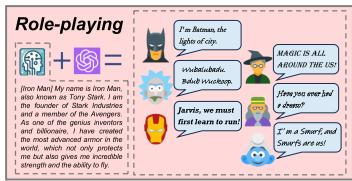

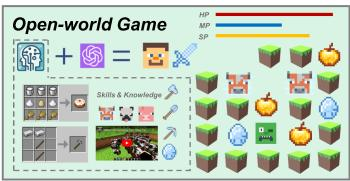

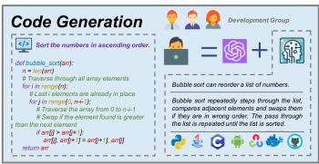

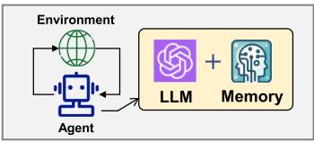

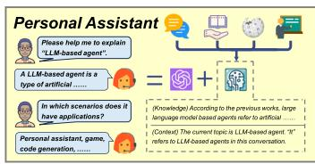  
Fig. 1. The importance of the memory module in LLM-based agents [105, 197].

expert systems, in order to show the importance of the memory module in practical scenarios. At last, we analyze the limitations of existing work and highlight significant future directions.

The main contributions of this article can be summarized as follows: (1) We formally define the memory module and comprehensively analyze its necessity for LLM-based agents. (2) We systematically summarize existing studies on designing and evaluating the memory module in LLM-based agents, providing clear taxonomies and intuitive insights. (3) We present typical agent applications to show the importance of the memory module in different scenarios. (4) We analyze the key limitations of existing memory modules and show potential solutions for inspiring future studies. To our knowledge, this is the first survey on the memory mechanism of LLM-based agents.

The rest of this survey is organized as follows. First, we provide a systematical meta-survey for the fields of LLMs and LLM-based agents in Section 2, categorizing different surveys and summarizing their key contributions. Then, we discuss the problems of "what is," "why do we need," and "how to implement and evaluate" the memory module in LLM-based agents in Sections 3-6. Next, we show the applications of memory-enhanced agents in Section 7. The discussions of the limitations of existing work and future directions come at last in Sections 8 and 9.

# 2 Related Surveys

In the past 2 years, LLMs have attracted much attention from the academic and industry communities. To systemically summarize the studies in this field, researchers have written a lot of survey papers. In this section, we briefly review these surveys (see Figure 2 and 3 for an overview), highlighting their major focuses and contributions to better position our study.

# 2.1 Surveys on LLMs

In the field of LLMs, Zhao et al. [224] present the first comprehensive survey to summarize the background, evolution paths, model architectures, training methodologies, and evaluation strategies of LLMs. Hadi et al. [42] and Min et al. [107] also conduct LLM surveys from the holistic view, which, however, provide different taxonomies and understandings on LLMs. Minaee et al. [108] further enrich this landscape by reviewing prominent LLM families and discussing their characteristics, while Huang et al. [53] specifically focus on the multilingual capabilities of LLMs. Following these

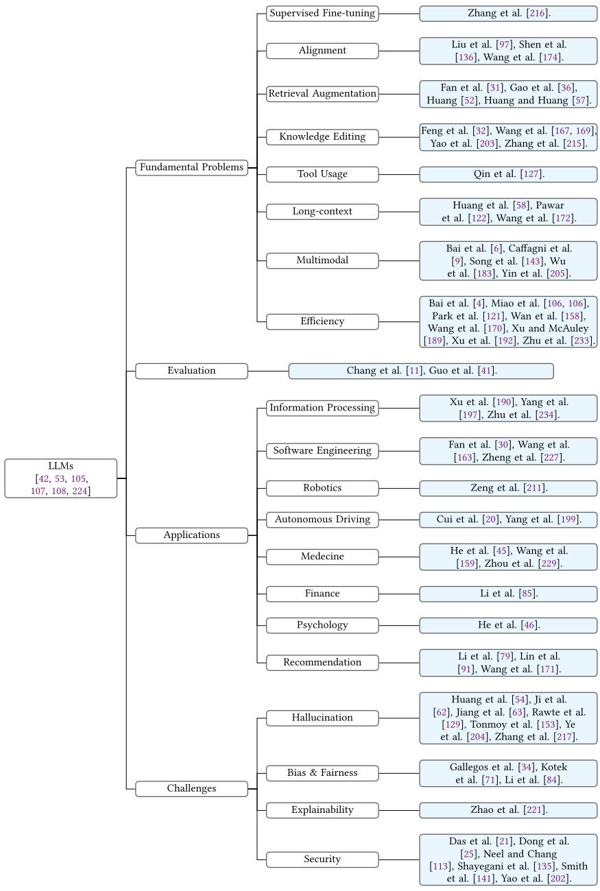  
Fig. 2. The organization of related surveys on LLMs.

surveys, people dive into specific aspects of LLMs and review the corresponding milestone studies and key technologies. These aspects can be classified into four categories including the fundamental problems, evaluation, applications, and challenges of LLMs.

Fundamental Problems. The surveys in this category aim to summarize techniques that can be leveraged to tackle fundamental problems of LLMs. Specifically, Zhang et al. [216] provide a comprehensive survey on the methods of supervised fine-tuning, which is a key technique for

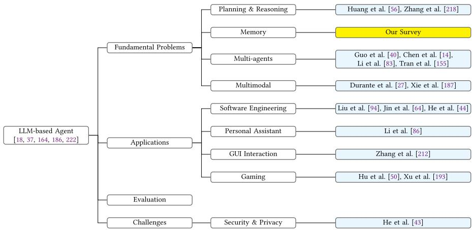  
Fig. 3. The organization of related surveys on LLM-based agents.

better training LLMs. Shen et al. [136], Wang et al. [174], and Liu et al. [97] present surveys on the alignment of LLMs, which is a key requirement for LLMs to produce outputs consistent with human values. Gao et al. [36] propose a survey on the retrieval-augmented generation (RAG) capability of LLMs, which is key to providing LLMs with factual and up-to-date knowledge and removing hallucinations. This direction has been further explored by Fan et al. [31], Huang and Huang [57], and Huang [52], who systematically examine RAG architectures, training strategies, and applications. Qin et al. [127] summarize the state-of-the-art methods on enabling LLMs to leverage external tools, which is fundamental for LLMs to expand their capability in domains that require specialized knowledge. Feng et al. [32], Wang et al. [167, 169], Yao et al. [203], and Zhang et al. [215] present surveys on the direction of LLM knowledge editing, which is important for customizing LLMs to satisfy specific requirements. Huang et al. [58], Wang et al. [172], and Pawar et al. [122] focus on long-context capabilities of LLMs, which is critical for LLMs to process more information at each time and enhance their application scenarios. Caffagni et al. [9], Song et al. [143], Wu et al. [183], and Yin et al. [205] summarize multi-modal LLMs, which expands the capability of LLMs from text to visual and other modalities. Recently, Bai et al. [6] specifically investigate the hallucination phenomenon in multi-modal LLMs, providing a fine-grained analysis of this critical challenge. The above surveys mainly focus on the effectiveness of LLMs. Another important aspect of LLMs is their training and inference efficiency. To summarize studies on this aspect, Wang et al. [170], Xu and McAuley [189], Zhu et al. [233], and Park et al. [121] systematically review the techniques of model compression. Ding et al. [24] and Xu et al. [192] analyze and conclude the studies on parameter efficient fine-tuning. Bai et al. [4], Miao et al. [106], Wan et al. [158], and Ding et al. [24] focus on the efficiency of resource utilization in a general sense.

Evaluation. The surveys in this category focus on how to evaluate the capability of LLMs. Specifically, Chang et al. [11] comprehensively summarize the evaluation methods from an overall perspective. It encompasses different evaluation tasks, methods, and benchmarks, which serve as critical parts in assessing LLM performances. Guo et al. [41] care more about the evaluation targets and describe how to evaluate the knowledge, alignment, and safety control capabilities of LLMs, which supplement evaluation metrics beyond performance.

Applications. The surveys in this category aim to summarize models that leverage LLMs to improve different applications. More concretely, Zhu et al. [234] focus on the field of information retrieval and summarize studies on LLM-based query processes. Xu et al. [190] pay more attention

to information extraction (IE) and provide comprehensive taxonomies for LLM-based models in this field. Li et al. [79], Lin et al. [91], and Wang et al. [171] discuss the applications of LLMs in the field of recommender systems, where they utilize agents to generate data and provide recommendations. Fan et al. [30], Wang et al. [163], and Zheng et al. [227] concentrate on how LLMs can benefit SE in terms of software design, development, and testing. Zeng et al. [211] summarize LLM-based methods in the field of robotics. Cui et al. [20] and Yang et al. [199] focus on the application of autonomous driving and summarize models in this domain based on LLMs from different perspectives. Beyond the above domains in AI, LLMs have also been used in natural and social science. He et al. [45], Zhou et al. [229], and Wang et al. [159] summarize the applications of LLMs in medicine. Li et al. [85] focus on the applications of LLMs in finance. He et al. [46] review the models on leveraging LLMs to improve the development of psychology.

Challenges. The surveys in this category focus on trustworthiness in LLMs, such as hallucination, bias, unfairness, explainability, security, and privacy. Hallucination in LLMs refers to the problem that LLMs may generate misconceptions or fabrications, impacting their reliability for downstream applications. Huang et al. [54], Ji et al. [62], Rawte et al. [129], Tonmoy et al. [153], Ye et al. [204], Zhang et al. [217], and Jiang et al. [63] summarize the mainstream models for alleviating the hallucination problem in LLMs. The bias and unfairness problems refer to the phenomenon that LLMs may unequally treat different humans or objectives, which can lead to the propagation of societal stereotypes and discrimination. Gallegos et al. [34], Kotek et al. [71], and Li et al. [84] comprehensively discuss these challenges and summarize existing methods for alleviating them. The problem of explainability means that the internal working mechanisms of LLMs are still unclear. Zhao et al. [221] systematically discuss this problem and summarize previous efforts on improving the explainability of LLMs. Security and privacy are also challenging problems, which have been comprehensively surveyed in Dong et al. [25], Neel and Chang [113], Shayegani et al. [135], Smith et al. [141], Yao et al. [202], and Das et al. [21].

# 2.2 Surveys on LLM-based Agents

Based on the capability of LLMs, researchers have conducted extensive studies on building LLM-based agents, which can autonomously perceive environments, take actions, accumulate knowledge, and evolve themselves. These agents represent a significant advancement in AI, combining the powerful language understanding and generation capabilities of LLMs with autonomous decision-making abilities.

In this field, Wang et al. [164] present the first survey paper to systematically summarize LLM-based agents from the perspectives of agent construction, agent application, and agent evaluation. Building upon this foundation, Cheng et al. [18], Xi et al. [186], Zhao et al. [222], and Ge et al. [37] also provide comprehensive overviews of LLM-based agent studies from different angles, delivering diverse understandings of this field. Beyond these overall surveys, there are several papers focus on other specific aspects of LLM-based agents, and we classify them into several categories as well.

Fundamental Problems. For fundamental problems, Huang et al. [56] and Zhang et al. [218] focus on the planning and reasoning capabilities, which are significant to solve complex problems. Durante et al. [27] and Xie et al. [187] pay more attention to constructing multi-modal agents, extending the text modality into other modalities like vision. Chen et al. [14], Guo et al. [40], Li et al. [83], and Tran et al. [155] provide comprehensive reviews on multi-agents. They explore the interactions among multiple agents in dynamic and complex environments.

Applications. For specific domains, Liu et al. [94], Jin et al. [64], and He et al. [44] comprehensively explore applications in SE, focusing on code generation, maintenance, and adaptive decision-making. Li et al. [86] summarize LLM-based agents as personal assistants, providing users with personalized services. Zhang et al. [212] investigate GUI agents, discussing how LLMs can understand and

automate complex interface interactions. In the gaming domain, Hu et al. [50] and Xu et al. [193] explore agent architectures centered around different capabilities.

Challenges. Security and privacy concerns have emerged as a critical challenge in recent surveys. This issue is systematically discussed by He et al. [43], providing a comprehensive analysis of threat models and defense strategies for LLM-based agents. Their work incorporates detailed case studies to illustrate potential vulnerabilities and proposes practical mitigation approaches, highlighting the importance of robust security frameworks in agent development.

Position of Our Work. Our survey focuses on a fundamental yet underexplored aspect of LLM-based agents—their memory mechanisms. To our knowledge, this is the first comprehensive survey in this direction. We aim to not only inspire the development of more advanced memory architectures but also provide newcomers with comprehensive starting materials for understanding this critical component of LLM-based agents. By examining memory mechanisms in detail, we complement existing surveys and address a crucial gap in the literature, particularly as memory capabilities become increasingly important for long-term interaction and knowledge accumulation in autonomous agents. We believe our work will further advance research in this field.

# 3 What Is the Memory of LLM-based Agent?

Interacting and learning from environments is a basic requirement of LLM-based agents. In the agent-environment interaction process, there are three key phases, that is, (1) the agent perceives information from the environment, and stores it into the memory; (2) the agent processes the stored information to make it more usable; and (3) the agent takes the next action based on the processed memory information. In all these phases, memory plays an extremely important role. In the following, we first define the memory of the agent from both narrow and broad perspectives and then detail the execution processes of the above three phases based on the memory module.

# 3.1 Basic Knowledge

For clear presentations, we first introduce several important background knowledge as follows:

Definition 1 (Agent). An agent is an intelligent entity capable of interacting with the environment. It can obtain observations and feedback from the environment, engage in thinking and decision-making, and take actions to influence the environment.

Definition 2 (Task). Task is the final target that the agent needs to achieve, for example, booking a flight ticket for Alice, recommending a restaurant for Bob, and so on. Formally, we use  $\mathcal{T}$  to represent a task and label different tasks by subscripts in the following contents.

Definition 3 (Environment). In a narrow sense, environment is the object that the agent needs to interact with to accomplish the task. For the examples in Definition 2, the environments are Alice and Bob, who provide feedback on the agent's actions. More broadly, environment can be any contextual factors that influence the agent's decisions, such as the weather when booking flight tickets, the time and location when recommending restaurants, and so on.

Definition 4 (Trial and Step). To accomplish a task, the agent needs to interact with the environment. Usually, the agent first takes an action, and then the environment responds to this action. At last, the agent takes the next action based on the response. This process iterates until the task is finished. The complete agent-environment interaction process is called a trial, and each interaction turn is called a step. For each trial, the agent can take multiple steps to form a potential solution to the task. For each task, the agent can explore multiple trials to accomplish the task [138]. Formally, at step  $t$ , we use  $a_{t}$  and  $o_{t}$  to represent the agent action and the observed environment response, respectively. Then, a  $T$ -length trial can be represented as  $\xi_{T} = \{a_{1}, o_{1}, a_{2}, o_{2}, \dots, o_{T}, a_{T}\}$ .

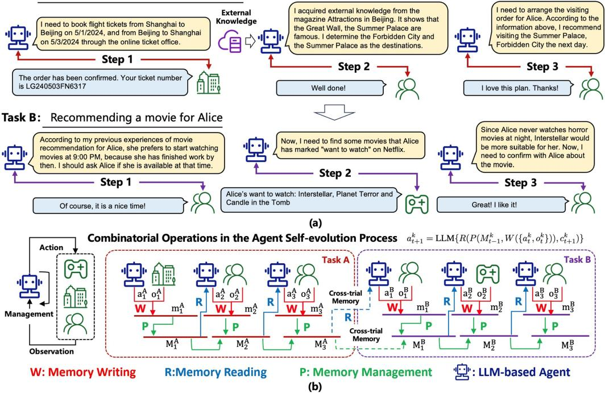  
Task A: Making a trip plan for Alice in Beijing  
Fig. 4. (a) Examples of the potential trials in the agent-environment interaction process. (b) Illustration of the memory reading, writing, and management processes, where dotted lines mean that the cross-trial information can be incorporated into the memory module.

In the above definitions, task and environment are the most coarse-grained concepts, while step is the most fine-grained one. They constitute the complete agent-environment interaction process.

A Toy Example. Based on the above definitions, we show a toy example and use it throughout the article to provide more intuitions. In this example, the agent has two tasks: (A) Making a trip plan for Alice in Beijing from 5 January 2024 to 5 March 2024, where the agent has to (i) buy a round-trip flight ticket, (ii) determine several attractions according to Alice's preferences, and (iii) arrange the visiting order of these attractions. (B) Recommending a movie for Alice on 5 October 2024, where the agent has to (i) determine the time that Alice is free to watch movies, and (ii) select a movie according to Alice's watching preference. For each task, we present a potential trial in the following (also illustrated in Figure 4(a)). For task (A), the trial is:

[Step 1] Agent: I need to book flight tickets from Shanghai to Beijing on 5 January 2024 and from Beijing to Shanghai on 5 March 2024 through the online ticket office. Environment (Online Ticket Office): The order has been confirmed. The departure flight takes off at 9:00 AM, and your ticket number is EK240501SX9021. The returning flight takes off at 4:30 PM, and your ticket number is LG240503FN6317. Please arrive at the airport on time for your flight.

[Step 2] Agent: I have acquired external knowledge from the magazine Attractions in Beijing. It shows that the Great Wall, the Forbidden City, and the Summer Palace are famous. According to Alice's preferences, I think she prefers ancient architecture, so I determine the Forbidden City and the Summer Palace as the destinations. Environment (Alice): Well done!

[Step 3] Agent: Now, I need to arrange the visiting order for Alice. According to the information above, I recommend visiting the Summer Palace after she arrives in Beijing because it is suitable to

spend a whole afternoon there and watch the sunset. Then, she can go to the Forbidden City the next day, which would give her plenty of time. Finally, she can return to Shanghai on the third day and take a rest. Environment (Alice): I love this plan. Thanks!

For task (B), the trial is:

[Step 1] Agent: According to my previous experiences of movie recommendations for Alice, she prefers to start watching movies at  $9:00\mathrm{PM}$ , because she has finished work by then. I should ask Alice if she is available at that time. Environment (Alice): Of course, it is a nice time!

[Step 2] Agent: Now, I need to find some movies that Alice has marked "want to watch" on Netflix. Environment (Netflix): Alice's want: Interstellar, Planet Terror, and Candle in the Tomb.

[Step 3] Agent: Since Alice never watches horror movies at night, Interstellar would be more suitable. Now, I need to confirm with Alice about the movie. Environment (Alice): Great! I like it!

# 3.2 Narrow Definition of the Agent Memory

In a narrow sense, the memory of the agent is only relevant to the historical information within the same trial. Formally, for a given task, the historical information of the trial before step  $t$  is  $\xi_{t} = \{a_{1}, o_{1}, a_{2}, o_{2}, \dots, a_{t-1}, o_{t-1}\}$ , and then the memory is derived based on  $\xi_{t}$ . In the above toy example, for task (A), the agent at [Step 3] needs to arrange the visiting order for Alice; at this time, its memory contains the information about the selected attractions and arrival time in [Step 1] and [Step 2]. For task (B), the agent has to choose a movie for Alice at [Step 3]; at this time, its memory contains the arranged time to watch films.

# 3.3 Broad Definition of the Agent Memory

In a broad sense, the memory of the agent can come from much wider sources, for example, the information across different trials and the external knowledge beyond the agent-environment interactions. Formally, given a series of sequential tasks  $\{\mathcal{T}_1,\mathcal{T}_2,\dots,\mathcal{T}_K\}$ , for task  $\mathcal{T}_k$ , the memory information at step  $t$  comes from three sources: (1) the historical information within the same trial, that is,  $\xi_{t}^{k} = \{a_{1}^{k},o_{1}^{k},\dots,a_{t - 1}^{k},o_{t - 1}^{k}\}$ , where we add superscript  $k$  to label the task index. (2) The historical information across different trials, that is,  $\Xi^k = \{\xi^1,\xi^2,\dots,\xi^{k - 1},\xi^{k'}\}$ , where  $\xi^j$  ( $j\in \{1,\ldots,k - 1\}$ ) represents the trials of task  $j$ , and  $\xi^{k'}$  denotes the previously explored trials for task  $\mathcal{T}_k$ . (3) External knowledge, which is represented by  $D_{t}^{k}$ . The memory of the agent is derived based on  $(\xi_t^k,\Xi^k,D_t^k)$ . In the above toy example, for task (A), if there are several failed trials, that is, the feedback from Alice is negative, then these trials can be incorporated into the agent's memory to avoid future similar errors (corresponding to  $\xi^{k'}$ ). In addition, for task (B), the agent may recommend movies relevant to the attractions that Alice has visited in task (A) to capture her recent preferences (corresponding to  $\{\xi^1,\xi^2,\dots,\xi^{k - 1}\}$ ). In the agent decision process, it has also referred to the magazine Attractions in Beijing for making trip plans, which is the external knowledge (corresponding to  $D_{t}^{k}$ ) for the current task  $\mathcal{T}_k$ .

# 3.4 Memory-assisted Agent-environment Interaction

As mentioned at the beginning of Section 3, there are three key phases in the agent-environment interaction process. The agent memory module implements these phases through three operations including memory writing, memory management, and memory reading.

Memory Writing. This operation aims to project the raw observations into the actually stored memory contents, which are more informative [110] and concise [228]. It corresponds to the first phase of the agent-environment interaction process. Given a task  $\mathcal{T}_k$ , if the agent takes an action

$a_{t}^{k}$  at step  $t$ , and the environment provides an observation  $o_{t}^{k}$ , then the memory writing operation can be formally represented as:

$$
m _ {t} ^ {k} = W (\{a _ {t} ^ {k}, o _ {t} ^ {k} \}),
$$

where  $W$  is a projecting function.  $m_t^k$  is the finally stored memory contents, which can be either natural languages or parametric representations. In the above toy example, for task (A), the agent is supposed to remember the flight arrangement and the decision of attractions after [Step 2]. For task (B), the agent should memorize the fact that Alice hopes to watch movies at 9:00 PM, after [Step 1].

Memory Management. This operation aims to process the stored memory information to make it more effective, for example, summarizing high-level concepts to make the agent more generalizable [228], merging similar information to reduce redundancy [110], and forgetting unimportant or irrelevant information to remove its negative influence. This operation corresponds to the second phase of the agent-environment interaction process. Let  $M_{t-1}^{k}$  be the memory contents for task  $k$  before step  $t$ , and suppose  $m_{t}^{k}$  is the stored information at step  $t$  based on the above memory writing operation, then, the memory management operation can be represented by:

$$
M _ {t} ^ {k} = P (M _ {t - 1} ^ {k}, m _ {t} ^ {k}),
$$

where  $P$  is a function that iteratively processes the stored memory information. For the narrow memory definition, the iteration only happens within the same trial, and the memory is emptied when the trial is ended. For the broad memory definition, the iteration happens across different trials or even tasks, as well as the integrations of external knowledge. For task (B) in the above toy example, the agent can conclude that Alice enjoys watching science fiction movies in the evening, which can be used as a default rule to make recommendations for Alice in the future.

Memory Reading. This operation aims to obtain important information from the memory to support the next agent action. It corresponds to the third phase of the agent-environment interaction process. Suppose  $M_t^k$  is the memory contents for task  $k$  at step  $t$ ,  $c_t^k$  is the context of the next action, and then the memory reading operation can be represented by:

$$
\hat {M} _ {t} ^ {k} = R (M _ {t} ^ {k}, c _ {t + 1} ^ {k}),
$$

where  $R$  is usually implemented by computing the similarity between  $M_t^k$  and  $c_{t+1}^k$  [220].  $\hat{M}_t^k$  is used as parts of the final prompt to drive the agent's next action. For task (B) in the above toy example, when the agent decides on the final recommended movie in [Step 3], it should focus on the "want to watch" list in [Step 2] and select one from it.

Based on the above operations, we can derive a unified function for the evolving process from  $\{a_t^k,o_t^k\}$  to  $a_{t + 1}^{k}$ , that is:

$$
a _ {t + 1} ^ {k} = \mathrm {L L M} \{R (P (M _ {t - 1} ^ {k}, W (\{a _ {t} ^ {k}, o _ {t} ^ {k} \})), c _ {t + 1} ^ {k}) \},
$$

where LLM is the large language model. The agent-environment interaction process can be easily obtained by iteratively expanding this function (see Figure 4(b) for an intuitive illustration).

Remark. This function provides a general formulation of the agent memorizing process. Previous works may use different specifications. For example, in [138],  $R$  and  $P$  are set as identical functions, and  $P$  only takes effect at the end of a trial. In Park et al. [120],  $R$  is implemented based on three criteria including similarity, time interval, and importance, and  $P$  is realized by a reflection process to obtain more abstract thoughts. In this section, we focus on the overall framework of the agent's memory operations. More detailed realizations of  $W$ ,  $P$ , and  $R$  are deferred in Section 5.

# 4 Why We Need the Memory in LLM-based Agent?

Above, we have introduced what is the memory of LLM-based agents. Before comprehensively presenting how to implement it, in this section, we briefly show why memory is necessary for building LLM-based agents, where we expand our discussion from three perspectives including cognitive psychology, self-evolution, and agent applications.

# 4.1 Perspective of Cognitive Psychology

Cognitive psychology is the scientific study of human mental processes such as attention, language use, memory, perception, problem-solving, creativity, and reasoning.2 Among these processes, memory is widely recognized as an extremely important one [142]. It is fundamental for humans to learn knowledge by accumulating important information and abstracting high-level concepts [19], form social norms by remembering cultural values and individual experiences [75], take reasonable behaviors by imagining the potential positive and negative consequences [66], and among others.

A major goal of LLM-based agents is to replace humans for accomplishing different tasks. To make agents behave like humans, following human's working mechanisms to design the agents is a natural and essential choice [72]. Since memory is important for humans, designing memory modules is also significant for the agents. In addition, cognitive psychology has been studied for a long time, so many effective human memory theories and architectures have been accumulated, which can support more advanced capabilities of the agents [147].

# 4.2 Perspective of Self-evolution

To accomplish different practical tasks, agents have to self-evolve in dynamic environments [148]. In the agent-environment interaction process, the memory is key to the following aspects: (1) Experience accumulation. An important function of the memory is to remember past error plannings, inappropriate behaviors, or failed experiences, so as to make the agent more effective for handling similar tasks in the future [226]. This is extremely important for enhancing the learning efficiency of the agent in the self-evolving process. (2) Environment exploration. To autonomously evolve in the environment, the agents have to explore different actions and learn from the feedback [111]. By remembering historical information, the memory can help to better decide when and how to make explorations, for example, focusing more on previously failed trials or actions with lower exploring frequencies [232]. (3) Knowledge abstraction. Another important function of the memory is to summarize and abstract high-level information from raw observations, which is the basis for the agent to be more adaptive and generalizable to unseen environments [220]. In summary, self-evolution is the basic characteristic of LLM-based agents, and memory is of key importance to self-evolution.

# 4.3 Perspective of Agent Applications

In many applications, memory is indispensable for the agents. For example, in a conversational agent, the memory stores information about historical conversations, which is necessary for the agent to generate the next response. Without memory, the agent does not know the context and cannot continue the conversation [99]. In a simulation agent, memory is of great importance to make the agent consistently follow the role profiles. Without memory, the agent may easily step out of the role during the simulation process [165]. Both of the above examples show that the memory is not an optional component but is necessary for the agents to accomplish given tasks.

  
Task A: Making a trip plan for Alice

  
Task B: Recommending a movie for Alice

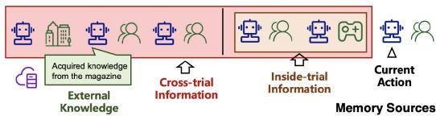  
Task A: Making a trip plan for Alice  
Task B: Recommending a movie for Alice  
Fig. 5. An overview of the sources, forms, and operations of the memory in LLM-based agents.

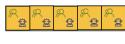  
Textual Memory  
Full Interactions

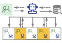  
Retrieved Interactions

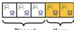  
Recent Interactions

  
External Knowledge

  
Parametric Memory  
Fine-tunning

  
Knowledge Editing  
Memory Forms

  
Informatic Change

  
Environment

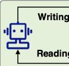  
Agen

  
Management  
Memory Operations

In the above three perspectives, the first one reveals that the memory builds the cognitive basis of the agent. The second and third ones show that the memory is necessary for the agent's evolving principles and applications, which provide insights for designing agents with memory mechanisms.

# 5 How to Implement the Memory of LLM-based Agent?

In this section, we discuss the implementation of the memory module from three perspectives: memory sources, memory forms, and memory operations. Memory sources refer to where the memory contents come from. Memory forms focus on how to represent the memory contents. Memory operations aim to process the memory contents. These three perspectives provide a comprehensive review of memory implementation methods, which is helpful for future research. For better demonstration, we present an overview of implementation methods in Figure 5.

# 5.1 Memory Sources

In previous works, the memory contents may come from different sources. Based on our formulation in Section 3, these sources can be classified into three categories, that is, the information inside a trial, the information across different trials, and the external knowledge. The former two are dynamically generated in the agent-environment interaction process (e.g., task internal information), while the latter is static information outside the loop (e.g., task external information). We summarize previous works on memory sources in Table 1.

5.1.1 Inside-trial Information. In the agent-environment interaction process, the historical steps within a trial are usually the most relevant and informative signals to support the agent's future actions. Almost all the previous works use this information as a part of the memory sources.

Representative Studies. Generative Agents [120] aims to simulate human's daily behaviors by using LLM-based agents. The memory of an agent is derived from the historical behaviors to achieve a target, for example, the collection of relevant papers when researching on a specific topic. MemoChat [99] aims to chat with humans, where the memory of the agent is derived based on the conversation history of a dialogue session. TiM [95] aims to enhance the agent's reasoning capability by self-generating multiple thoughts after accomplishing a task, which is used as the memory to provide more generalizable information. Voyager [160] focuses on building game agents based on Minecraft, where the memory contains executable codes of preliminary and basic actions to accomplish a task. Gödel Agent [206] contains the agent's own code, environmental feedback, historical operation records, and error handling information and optimized decision-making into

Table 1. Summarization of the Memory Sources  

<table><tr><td>Models</td><td>Inside-trial Information</td><td>Cross-trial Information</td><td>External Knowledge</td></tr><tr><td>MemoryBank [228]</td><td>✓</td><td>×</td><td>×</td></tr><tr><td>RET-LLM [110]</td><td>✓</td><td>×</td><td>✓</td></tr><tr><td>ChatDB [48]</td><td>✓</td><td>×</td><td>✓</td></tr><tr><td>TiM [95]</td><td>✓</td><td>×</td><td>×</td></tr><tr><td>SCM [89]</td><td>✓</td><td>×</td><td>×</td></tr><tr><td>Voyager [160]</td><td>✓</td><td>×</td><td>×</td></tr><tr><td>MemGPT [114]</td><td>✓</td><td>×</td><td>×</td></tr><tr><td>MemoChat [99]</td><td>✓</td><td>×</td><td>×</td></tr><tr><td>MPC [73]</td><td>✓</td><td>×</td><td>×</td></tr><tr><td>Generative Agents [120]</td><td>✓</td><td>×</td><td>×</td></tr><tr><td>RecMind [173]</td><td>✓</td><td>×</td><td>✓</td></tr><tr><td>Retroformer [201]</td><td>✓</td><td>✓</td><td>✓</td></tr><tr><td>ExpeL [220]</td><td>✓</td><td>✓</td><td>✓</td></tr><tr><td>Synapse [226]</td><td>✓</td><td>✓</td><td>×</td></tr><tr><td>GITM [232]</td><td>✓</td><td>✓</td><td>✓</td></tr><tr><td>ReAct [200]</td><td>✓</td><td>×</td><td>✓</td></tr><tr><td>Reflexion [138]</td><td>✓</td><td>✓</td><td>✓</td></tr><tr><td>RecAgent [165]</td><td>✓</td><td>×</td><td>×</td></tr><tr><td>Character-LLM [134]</td><td>✓</td><td>×</td><td>✓</td></tr><tr><td>MAC [149]</td><td>✓</td><td>×</td><td>×</td></tr><tr><td>Huatuo [161]</td><td>✓</td><td>×</td><td>✓</td></tr><tr><td>ChatDev [125]</td><td>✓</td><td>×</td><td>×</td></tr><tr><td>InteRecAgent [55]</td><td>✓</td><td>×</td><td>✓</td></tr><tr><td>MetaAgents [88]</td><td>✓</td><td>×</td><td>×</td></tr><tr><td>TPTU [70, 131]</td><td>✓</td><td>×</td><td>✓</td></tr><tr><td>MetaGPT [47]</td><td>✓</td><td>✓</td><td>×</td></tr><tr><td>S3 [35]</td><td>✓</td><td>×</td><td>×</td></tr><tr><td>InvestLM [198]</td><td>✓</td><td>×</td><td>✓</td></tr><tr><td>AriGraph [3]</td><td>✓</td><td>✓</td><td>×</td></tr><tr><td>AWM [179]</td><td>✓</td><td>✓</td><td>×</td></tr><tr><td>Gödel Agent [206]</td><td>✓</td><td>✓</td><td>×</td></tr><tr><td>Memory3 [196]</td><td>×</td><td>×</td><td>✓</td></tr><tr><td>MemTree [130]</td><td>✓</td><td>✓</td><td>×</td></tr><tr><td>MEOW [39]</td><td>×</td><td>×</td><td>✓</td></tr><tr><td>THEANINE [61]</td><td>✓</td><td>✓</td><td>×</td></tr></table>

We use  $\sqrt{}$  and  $\times$  to label whether or not the corresponding source is adopted in the model.

agent memory for continuous self-improvement. It should be noted that the inside-trial information not only includes agent-environment interactions but also contains interaction contexts, such as time and location. For example, THEANINE [61] includes event information and the time it is formed into agent memory. Events encompass actions, speech, and acknowledgment of user personas, and the memories are linked based on temporal order and causal relations.

Discussion. The inside-trial information is the most obvious and intuitive source that should be leveraged to construct the agent's memory since it is highly relevant to the current task that the agent has to accomplish. However, relying solely on inside-trial information may prevent the agent from accumulating valuable knowledge from various tasks and learning more generalizable

information. Thus, many studies also explore how to effectively utilize the information across different tasks to build the memory module, which is detailed in the following sections.

5.1.2 Cross-trial Information. For LLM-based agents, the information accumulated across multiple trials in the environment is also a crucial part of the memory, typically including successful and failed actions and their insights, such as failure reasons, and common action patterns to succeed.

Representative Studies. One of the most prominent studies is Reflexion [138], which proposes verbal reinforcement learning for LLM-based agents. It derives the experiences from past trials in verbal form and applies them in subsequent trials to improve the performance of the same task. Furthermore, Retroformer [201] fine-tunes the reflection model, enabling the agent to extract cross-trial information from past trials more effectively. Gödel Agent [206] utilizes dynamic code modification techniques to alter its own logic and behavior based on the feedback signals from the environment and stores the updated agent logic in the agent memory for recursive improvement. AWM [179] proposes to generate workflows from previous trajectories by identifying reusable routines, subsequently incorporating these workflows into agent memory to direct future task-solving procedures. In Synapse [226], the agents focus on solving the computer control tasks. Their memory can record cross-trial information through successful exemplars, which would be used as references on similar trials. In ExpeL [220], the agents are required to solve a collection of complex interactive tasks within the environment. They store and organize completed trajectories, and recall similar ones for the new task. In the recalled trajectories, successful cases will be compared with failed ones to identify the patterns to succeed.

Discussion. According to the accumulated memory of cross-trial information, the agents are able to accumulate experiences, which is important for their evolution. Based on the past experiences, the agents can adjust their actions based on the overall feedback of the whole process. In contrast to the inside-trial observations, which serve as short-term memory, the trial experiences can be considered as long-term memory. It utilizes feedback from different trials to support a wider range of agent trials, providing more prolonged experiential support for agents. However, the limitation lies in the fact that both inside-trial and cross-trial information require the agents to personally engage in agent-environment interactions, where external knowledge are not included.

5.1.3 External Knowledge. An important characteristic of LLM-based agents is that they can be directly communicated and controlled in natural languages. As such, LLM-based agents can easily incorporate external knowledge in textual forms (e.g., Wikipedia3) to facilitate their decisions.

Representative Studies. In ReAct [200], the agents are required to answer questions about general knowledge by multiple reasoning steps. They can utilize Wikipedia APIs to obtain external knowledge if they lack information during these steps. GITM [232] intends to design agents in Minecraft, which can explore in complex environments. The agents draw from the online Minecraft Wiki and craft recipes to provide an infinite source of knowledge for their navigation. CodeAgent [214] focuses on the repo-level code generation task, which commonly requires complex dependencies and extensive documentation. It designs a web search strategy for acquiring related external knowledge. ChatDoctor [209] adapts LLM-based agents to the medical domain. It fine-tunes an acquisition process to retrieve external knowledge from Wikipedia and medical databases. MEOW [39] incorporates external inverted fact information into the model in the form of parametric memory through model training, effectively removing sensitive information from the model without compromising its performance. Memory3 [196] injects external knowledge into LLMs through SFT and separates the knowledge from model parameters, which are then stored as explicit memory.

Discussion. The external knowledge can be obtained from both private and public sources. It provides LLM-based agents with much knowledge beyond their internal environment, which might be difficult or even impossible for the agent to acquire by agent-environment interactions. Moreover, most external knowledge can be acquired by accessing the APIs of various tools dynamically in real time, thus mitigating the problem of outdated knowledge. Integrating external knowledge into the memory of LLM-based agents significantly expands their knowledge boundaries, providing them with unlimited, up-to-date, and well-founded knowledge for decision-making.

In comparison, these three memory sources correspond to information with different levels of generality. External knowledge usually possesses the best generality because it is often stored as shared knowledge across different scenarios, such as world knowledge. Cross-trial information is secondary because it can represent general knowledge within a specific scenario cross different trials. Inside-trial information typically has the weakest generality because it is often limited to the current interaction trajectory. However, the relevance of these different sources of information for an agent's decision-making is often opposite to their generality which is usually consistent with its importance. Therefore, inside-trial and cross-trial information is often stored in textual forms for frequent recall with better interpretability. External knowledge can either be stored by parametric methods or textual methods, which depend on different applications.

# 5.2 Memory Forms

In general, there are two forms to represent the memory contents: textual form and parametric form. In textual form, the information is explicitly retained and recalled by natural languages. In parametric form, the information is encoded into parameters and implicitly influences the agent's actions. We summarize previous works on memory forms with their implementations in Table 2.

5.2.1 Memory in Textual Form. Textual form is currently the mainstream method to represent the memory contents, which is featured in better interpretability, easier implementation, and faster read-write efficiency. In specific, the textual form can be both non-structured representations like raw natural languages and structured information such as tuples, databases, and so on. In general, previous studies use the textual form memory to store four types of information including (1) complete agent-environment interactions, (2) recent agent-environment interactions, (3) retrieved agent-environment interactions, and (4) external knowledge. In the former three types, they record the information inside the agent-environment interaction loop, while the latter leverages natural languages to store information outside that loop.

Complete Interactions. This method stores all the information of the agent-environment interaction history based on long-context strategies [77]. For the example in Section 3.1, the memory of the agent in task (A) after Step 2 can be implemented by concatenating all the information before Step 2, and the final textual form memory is: "Your memory is [Step 1] (Agent) ... (Online Ticket Office) ... [Step 2] ... Please infer based on your memory."

In the previous work, different models store the memory information using different strategies. For example, in LongChat [77], the agents focus on understanding natural languages in long-context scenarios. It fine-tunes the foundation model for better adapting to memorize complete interactions. Memory Sandbox [59] intends to alleviate the impact of irrelevant memory in conversations. It designs a transparent and interactive method to manage the memory of agents, which removes irrelevant memory before concatenating them as a prompt. Moreover, some efforts are dedicated to enhancing the capacity of LLMs to handle longer contexts [115, 154].

While storing all the agent-environment interactions can maintain comprehensive information, obvious limitations exist in terms of computational cost, inference time, and inference robustness. First, the fast-growing long-context memory in practice results in high computational cost during

Table 2. Summarization of the Memory Forms  

<table><tr><td rowspan="2">Models</td><td colspan="4">Textual Form</td><td colspan="2">Parametric Form</td></tr><tr><td>Complete</td><td>Recent</td><td>Retrieved</td><td>External</td><td>Fine-tuning</td><td>Editing</td></tr><tr><td>MemoryBank [228]</td><td>×</td><td>×</td><td>✓</td><td>×</td><td>×</td><td>×</td></tr><tr><td>RET-LLM [110]</td><td>×</td><td>×</td><td>✓</td><td>×</td><td>×</td><td>×</td></tr><tr><td>ChatDB [48]</td><td>×</td><td>×</td><td>✓</td><td>×</td><td>×</td><td>×</td></tr><tr><td>TiM [95]</td><td>×</td><td>×</td><td>✓</td><td>×</td><td>×</td><td>×</td></tr><tr><td>SCM [89]</td><td>×</td><td>✓</td><td>✓</td><td>×</td><td>×</td><td>×</td></tr><tr><td>Voyager [160]</td><td>×</td><td>×</td><td>✓</td><td>×</td><td>×</td><td>×</td></tr><tr><td>MemGPT [114]</td><td>×</td><td>✓</td><td>✓</td><td>×</td><td>×</td><td>×</td></tr><tr><td>MemoChat [99]</td><td>×</td><td>×</td><td>✓</td><td>×</td><td>×</td><td>×</td></tr><tr><td>MPC [73]</td><td>×</td><td>×</td><td>✓</td><td>×</td><td>×</td><td>×</td></tr><tr><td>Generative Agents [120]</td><td>×</td><td>×</td><td>✓</td><td>×</td><td>×</td><td>×</td></tr><tr><td>RecMind [173]</td><td>✓</td><td>×</td><td>×</td><td>×</td><td>×</td><td>×</td></tr><tr><td>Retroformer [201]</td><td>✓</td><td>×</td><td>×</td><td>✓</td><td>✓</td><td>×</td></tr><tr><td>ExpeL [220]</td><td>✓</td><td>×</td><td>✓</td><td>✓</td><td>×</td><td>×</td></tr><tr><td>Synapse [226]</td><td>×</td><td>×</td><td>✓</td><td>×</td><td>×</td><td>×</td></tr><tr><td>GITM [232]</td><td>✓</td><td>×</td><td>✓</td><td>✓</td><td>×</td><td>×</td></tr><tr><td>ReAct [200]</td><td>✓</td><td>×</td><td>×</td><td>✓</td><td>×</td><td>×</td></tr><tr><td>Reflexion [138]</td><td>✓</td><td>×</td><td>×</td><td>✓</td><td>×</td><td>×</td></tr><tr><td>RecAgent [165]</td><td>×</td><td>✓</td><td>✓</td><td>×</td><td>×</td><td>×</td></tr><tr><td>Character-LLM [134]</td><td>×</td><td>✓</td><td>×</td><td>×</td><td>✓</td><td>×</td></tr><tr><td>MAC [149]</td><td>×</td><td>×</td><td>×</td><td>×</td><td>×</td><td>✓</td></tr><tr><td>Huatuo [161]</td><td>✓</td><td>×</td><td>×</td><td>×</td><td>✓</td><td>×</td></tr><tr><td>ChatDev [125]</td><td>✓</td><td>×</td><td>×</td><td>×</td><td>×</td><td>×</td></tr><tr><td>InteRecAgent [55]</td><td>×</td><td>✓</td><td>✓</td><td>✓</td><td>×</td><td>×</td></tr><tr><td>MetaAgents [88]</td><td>×</td><td>×</td><td>✓</td><td>×</td><td>×</td><td>×</td></tr><tr><td>TPTU [70, 131]</td><td>✓</td><td>×</td><td>×</td><td>✓</td><td>×</td><td>×</td></tr><tr><td>MetaGPT [47]</td><td>✓</td><td>×</td><td>×</td><td>×</td><td>×</td><td>×</td></tr><tr><td>S3 [35]</td><td>×</td><td>×</td><td>✓</td><td>×</td><td>×</td><td>×</td></tr><tr><td>InvestLM [198]</td><td>✓</td><td>×</td><td>×</td><td>×</td><td>✓</td><td>×</td></tr><tr><td>AriGraph [3]</td><td>×</td><td>×</td><td>✓</td><td>×</td><td>×</td><td>×</td></tr><tr><td>AWM [179]</td><td>✓</td><td>×</td><td>×</td><td>×</td><td>×</td><td>×</td></tr><tr><td>Gödel Agent [206]</td><td>×</td><td>✓</td><td>×</td><td>×</td><td>×</td><td>×</td></tr><tr><td>Memory3 [196]</td><td>×</td><td>×</td><td>×</td><td>×</td><td>×</td><td>✓</td></tr><tr><td>MemTree [130]</td><td>×</td><td>×</td><td>✓</td><td>×</td><td>×</td><td>×</td></tr><tr><td>MEOW [39]</td><td>×</td><td>×</td><td>×</td><td>×</td><td>×</td><td>✓</td></tr><tr><td>THEANINE [61]</td><td>×</td><td>×</td><td>✓</td><td>×</td><td>×</td><td>×</td></tr></table>

We use  $\checkmark$  and  $\times$  to label whether or not the corresponding memory form is adopted in the model.

LLM inference, due to the quadratic growth of the time complexity of attention computation with sequence length. It thus requires much more computing resources and significantly increases inference latency, which hinders its practical deployment. What's more, the memory length can easily exceed the upper bound of the sequence length during LLM's pre-training, which makes a truncation of memory necessary. Thus, it can lead to information loss due to the incompleteness of agent memory. Last but not least, it can lead to biases and unrobustness in LLM's inference. Specifically, a previous research [96] has shown that, the positions of text segments in a long context can greatly affect their utilization, so the memory in the long-context prompt cannot be

treated equally and stably. All these drawbacks show the need to design extra memory modules for LLM-based agents, rather than straightforwardly concatenating all the information into a prompt.

Recent Interactions. This method stores and maintains the most recently acquired memories using natural languages, thereby enhancing the efficiency of memory information utilization according to the Principle of Locality [23]. In task (B) of the example in Section 3.1, we can just remember Alice's preferences in the recent 3 years and truncate the distant part, where the recent 3 years can be considered as the memory window size.

In previous studies, there are various strategies to store recent textual memories. For example, SCM [89] proposes a flash memory based on the cache mechanism, which preserves observations from the recent  $t - 1$  timesteps, aimed at enhancing the recency of information. MemGPT [114] considers the agent as an operating system, which can dynamically interact with users through a natural interface. It designs the working context to hold recent histories, as a part of virtual context management. In RecAgent [165], the agents are designed to simulate user behaviors in movie recommendations. It stores some temporal information in short-term memory as an intermediate cache, which can simulate the memory mechanism of the human brain [28, 112]. These representative methods can dynamically update memories based on recent interactions and pay more attention to the recent context that is important for the current stage.

Caching the memory according to recency is an effective way to enhance memory efficiency, and it enables agents to focus more on the recent information. However, in long-term tasks, this method fails to access key information from distant memories. It can result in the loss of potentially crucial information that is not within the immediate cache window. In other words, emphasizing on recency can inherently neglect earlier, yet critical information, thus posing challenges in scenarios requiring a comprehensive understanding of past events.

Retrieved Interactions. Unlike the above method which truncates memories based on time, this method typically selects memory contents based on their relevance, importance, and topics. It ensures the inclusion of distant but crucial memories in the decision-making process, thereby addressing the limitation of only memorizing recent information. In task (A) of the example in Section 3.1, Alice's preferences have been stored in the memory before this task. At [Step 2], the agent will retrieve the most relevant aspects of Alice's preferences from memory based on the query keyword "travel," obtaining Alice's scenic spot preference for ancient architectures. In general, retrieval methods will generate embeddings as indexes for memory entries during memory writing, along with recording auxiliary information to assist in retrieval. During memory reading, matching scores are calculated for each memory entry, and the top- $K$  entries will be used for the decision-making process of agents.

In existing studies, most agents utilize retrieval methods to process the memory information. For example, Park et al. [120] first calculate the relevance between the current context and memory entries by cosine similarity and obtain the importance and recency according to auxiliary information. MemoryBank [228] employs a dual-tower dense retrieval model to find related information from past conversations. Each memory entry is encoded into an embedding and subsequently indexed by FAISS [65] to improve the efficiency of retrieval. When reading memories, the current context will be encoded as representations to obtain the most relevant memory. Moreover, RET-LLM [110] intends to design a write-read memory module for general usage. It utilizes locality-sensitive hashing to retrieve tuples with relative entries in the database to provide more information. In addition, ChatDB [48] designs to utilize symbolic memory and proposes to generate SQL statements to retrieve from database to obtain stored information.

The retrieval methods considerably depend on the accuracy and efficiency of obtaining expected information. An inaccurate retrieval strategy can potentially acquire unrelated information that is unhelpful for agent inference. And a heavy retrieval system can lead to large computational costs

and long-time latency, especially when handling massive information. Moreover, retrieval methods typically store homogeneous information inside the environment, where all the information is in a consistent form. For heterogeneous information outside the environment, it's difficult to directly apply the same method for memory storage.

External Knowledge. To obtain more information, some agents acquire external knowledge by invoking tools, with the aim of transforming additional relevant knowledge into their own memories for decision-making. For instance, accessing external knowledge through API is a common practice [138, 200]. Nowadays, abundant public information, such as Wikipedia and OpenWeatherMap, are available online and can be conveniently accessed through API calls. For instance, in [Step 2] of task (A) of the example in Section 3.1, external knowledge from the digital magazine is obtained with tool methods.

In existing models, Toolformer [132] proposes to teach LLM to use tools, which can acquire external knowledge for solving tasks. Furthermore, ToolLLM [128] empowers LLaMA [154] with the ability to utilize more APIs in RapidAPI5 and to enable multi-tool usage, which provides a general interface to extend agents' ability. In TPTU [131], the agents are incorporated in both task planning and tool usage, in order to tackle intricate problems. The follow-up work [70] further improves its ability extensively like retrieval. In ToRA [38], the agents are required to solve mathematical problems. They utilize imitation learning to improve their ability to use program-based tools.

The above methods significantly advance the capabilities of agents by allowing them to access external up-to-date and real-world information from diverse sources. However, the reliability of this information can be questionable due to potential inaccuracies and biases [127]. Furthermore, the integration of tools into agents demands a comprehensive understanding to interpret the retrieved information across various contexts, which can incur higher computational costs and complications in aligning external data with internal decision-making processes. Additionally, utilizing external APIs brings forth concerns regarding privacy, data security, and compliance with usage policies, necessitating rigorous management and oversight [127].

5.2.2 Memory in Parametric Form. An alternative type of approaches is to represent memory in parametric form. They do not take up the extra length of context in prompts, so they are not constrained by the length limitations of LLM context. However, the parametric memory form is still under-researched, and we categorize previous works into two types: fine-tuning methods and memory editing methods.

Fine-tuning Methods. Integrating external knowledge into the memory of agents is beneficial for enriching domain-specific knowledge on top of its general knowledge. To infuse the domain knowledge into LLMs, supervised fine-tuning is a common approach, which empowers agents with the memory of domain experts. It significantly improves the agent's ability to accomplish domain-specific tasks. In task (A) of the example in Section 3.1, the external knowledge of attractions from magazines can be fine-tuned into the parameters of LLMs prior to this task.

In previous works, Character-LLM [134] focuses on the role-play circumstance. It utilizes supervised fine-tuning strategies with role-related data (e.g., experiences), to endow agents with the specific traits and characteristics of the role. Huatuo [161] intends to empower agents with professional ability in the biomedical domain. It tries to fine-tune LLaMA [154] on Chinese medical knowledge bases. Besides, in order to create artificial doctors, DoctorGLM [188] fine-tunes ChatGLM [210] with LoRA [49], and Radiology-GPT [98] improves domain knowledge on radiology analysis by SFT on an annotated radiology dataset. Moreover, InvestLM [198] collects investment data and fine-tunes it to improve domain-specific abilities on financial investment.

The fine-tuning methods can effectively bridge the gap between general agents and specialized agents. It improves the capability of agents on the tasks that require high accuracy and reliability on domain-specific information. Nevertheless, fine-tuning LLMs for specific domains could potentially lead to overfitting, and it also raises concerns about catastrophic forgetting, where LLMs may forget the original knowledge because of updating their parameters. Another limitation of fine-tuning lies in the computational cost and time consumption, as well as the requirement of a large amount of data. Therefore, most fine-tuning approaches are applied to offline scenarios and can seldom deal with online scenarios, such as fine-tuning with agent observations and trial experiences. Due to the frequent agent-environment interactions, it is unaffordable for the cost of backpropagation to fine-tune every step of the online and dynamic interactions.

Memory Editing Methods. Apart from the fine-tuning approaches, another type of methods for infusing memory into model parameters is knowledge editing [22, 109]. Unlike fine-tuning methods that extract patterns from certain datasets, knowledge editing methods specifically target and adjust only the facts that need to be changed. It ensures that unrelated knowledge remains unaffected. Knowledge editing methods are more suitable for small-scale memory adjustments. Generally, they have lower computational costs, making them more suitable for online scenarios. In our example of task (B), Alice always watches movies at  $9:00\mathrm{PM}$  from the agent's memory, but she may recently change her work and would not be empty at  $9:00\mathrm{PM}$ . If so, the related memory (such as routines at  $9:00\mathrm{PM}$ ) should be edited, which can be implemented by knowledge editing.

In previous studies, MAC [149] intends to design an effective and efficient memory adaptation framework for online scenarios. It utilizes meta-learning to substitute the optimization step. PersonalityEdit [104] focuses on editing the personality of LLMs and agents, where it changes their traits based on theories such as the big-five factor. MEND [109] utilizes the idea of meta-learning to train a lightweight model, which is capable of generating modifications for model parameters of a pre-trained language model. APP [101] studies whether adding a new fact leads to catastrophic forgetting of existing facts. It focuses on the impact of neighbor perturbation on memory addition. Moreover, KnowledgeEditor [22] trains a hyper-network to predict the modification of model parameters when injecting memory based on a learning-to-update problem formulation. Wang et al. [166] propose a new optimization target to change the poisoning knowledge of LLM and maintain the general performance at the same time. For LLM-based agents, the agents can change bad memory by knowledge editing, which can be considered as a type of forgetting mechanism.

Knowledge editing methods provide an innovative way to update the information stored within the parameters of LLMs. By specifically targeting and adjusting the facts, these methods can ensure the non-targeted knowledge unaffected during updates, thus mitigating the issue of catastrophic forgetting. Moreover, the targeted adjustment mechanism allows for more efficient and less resource-intensive updates, making knowledge editing an appealing choice for high-precision and real-time modifications. However, despite these promising developments, computational costs of metatraining and the preservation of unrelated memories remain significant challenges.

5.2.3 Advantages and Disadvantages of Textual and Parametric Memory. Textual memory and parametric memory have their strengths and weaknesses, respectively, making them suitable for different memory contents and application scenarios. In this section, we discuss the advantages and disadvantages of these two forms of memory from various aspects.

Effectiveness. The textual memory stores raw information about the agent-environment interactions, which is comprehensive and detailed. However, it is constrained by the token limitation of LLM prompts, which makes it hard to store extensive information. In contrast, the parametric memory is not limited by the prompt length, but it may suffer from information loss when transforming texts into parameters, and the complex memory training can bring additional challenges.

Efficiency. For textual memory, each LLM inference requires to integrate memory into the context prompt, which leads to higher costs and longer processing times. In contrast, for parametric memory, the information can be integrated into the parameters of the LLM, eliminating the extra costs of these contexts. However, parametric memory takes additional costs in the writing process, but textual memory is easier to write, especially for small amounts of data. In a nutshell, textual memory is more efficient in writing, while parametric memory is more efficient in reading.

Interpretability. Textual memory is usually more explainable than the parametric one, since natural languages are the most straightforward strategies for humans to understand, while parametric memory is commonly represented in latent space. Nevertheless, such explainability is obtained at the cost of information density. This is because the sequences of words in textual memory are represented in a discrete space, which is not as dense as continuous space in parametric memory.

In conclusion, the tradeoffs between these two types of memories make them suitable for different applications. For example, for the tasks that require recalling recent interactions, like simple conversations, textual memory seems more effective. For the tasks that require a large amount of memory, or well-established knowledge, parametric memory can be a better choice.

# 5.3 Memory Operations

We separate the entire procedure of memory into three operations: memory writing, memory management, and memory reading. They collaborate to achieve memory function, providing information for LLM inference. We summarize previous works on memory operations in Table 3.

5.3.1 Memory Writing. After the information is perceived by the agent, a part of it will be stored by the agent for further usage through the memory writing operation, and it is crucial to recognize which information is essential to store. Many studies choose to store the raw information, while others also put the summary of the raw information into the memory module.

Representative Studies. In TiM [95], the raw information will be extracted as the relation between two entities and stored in a structured database. When writing into the database, similar contents will be stored in the same group. In SCM [89], it designs a memory controller to decide when to execute the operations. The controller serves as a guide for the whole memory module. In MemGPT [114], the memory writing is entirely self-directed. The agents can autonomously update the memory based on the contexts. In MemoChat [99], the agents summarize each conversation segment by abstracting the mainly discussed topics and storing them as keys for indexing memory. In MemTree [130], the model traverses the tree from the root to update memory upon new information arrival. It evaluates semantic similarity to decide whether to traverse deeper or create a new leaf node. After insertion, it updates parent nodes' content and embeddings to reflect new information, maintaining the tree's hierarchical integrity.

Discussion. Previous research indicates that designing the strategy of IE during the memory writing operation is vital [99]. This is because the original information is commonly lengthy and noisy. Besides, different environments may provide various forms of feedback, and how to extract and represent the information is also significant for memory writing.

5.3.2 Memory Management. For human beings, memory information is constantly processed and abstracted in the brains. Agent's memory can also be managed by reflecting to generate higher-level memories, merging redundant memory entries, and forgetting unimportant, early memories.

Representative Studies. In MemoryBank [228], the agents process and distill the conversations into a high-level summary of daily events, similar to how humans recall key aspects of their experiences. Through long-term interactions, they continually evaluate and refine their knowledge, generating daily insights into personality traits. In Voyager [160], the agents are able to refine their

Table 3. Summarization of the Memory Operations  

<table><tr><td rowspan="2">Models</td><td rowspan="2">Writing</td><td colspan="3">Management</td><td rowspan="2">Reading</td></tr><tr><td>Merging</td><td>Reflection</td><td>Forgetting</td></tr><tr><td>MemoryBank [228]</td><td>✓</td><td>✓</td><td>✓</td><td>✓</td><td>✓</td></tr><tr><td>RET-LLM [110]</td><td>✓</td><td>✗</td><td>✗</td><td>✗</td><td>✓</td></tr><tr><td>ChatDB [48]</td><td>✓</td><td>✗</td><td>✓</td><td>✗</td><td>✓</td></tr><tr><td>TiM [95]</td><td>✓</td><td>✓</td><td>✗</td><td>✓</td><td>✓</td></tr><tr><td>SCM [94]</td><td>✓</td><td>✓</td><td>✗</td><td>✗</td><td>✓</td></tr><tr><td>Voyager [160]</td><td>✓</td><td>✗</td><td>✓</td><td>✗</td><td>✓</td></tr><tr><td>MemGPT [114]</td><td>✓</td><td>✗</td><td>✓</td><td>✗</td><td>✓</td></tr><tr><td>MemoChat [99]</td><td>✓</td><td>✗</td><td>✗</td><td>✗</td><td>✓</td></tr><tr><td>MPC [73]</td><td>✓</td><td>✗</td><td>✗</td><td>✗</td><td>✓</td></tr><tr><td>Generative Agents [120]</td><td>✓</td><td>✗</td><td>✓</td><td>✓</td><td>✓</td></tr><tr><td>RecMind [173]</td><td>○</td><td>✗</td><td>✗</td><td>✗</td><td>✓</td></tr><tr><td>Retroformer [201]</td><td>✓</td><td>✓</td><td>✓</td><td>✗</td><td>○</td></tr><tr><td>ExpeL [220]</td><td>✓</td><td>✓</td><td>✓</td><td>✗</td><td>○</td></tr><tr><td>Synapse [226]</td><td>✓</td><td>✗</td><td>✗</td><td>✗</td><td>✓</td></tr><tr><td>GITM [232]</td><td>○</td><td>✓</td><td>✓</td><td>✗</td><td>✓</td></tr><tr><td>ReAct [200]</td><td>○</td><td>✗</td><td>✗</td><td>✗</td><td>○</td></tr><tr><td>Reflexion [138]</td><td>✓</td><td>✓</td><td>✓</td><td>✗</td><td>○</td></tr><tr><td>RecAgent [165]</td><td>✓</td><td>✓</td><td>✓</td><td>✓</td><td>✓</td></tr><tr><td>Character-LLM [134]</td><td>✓</td><td>✗</td><td>✗</td><td>✗</td><td>○</td></tr><tr><td>MAC [149]</td><td>✓</td><td>✓</td><td>✓</td><td>✗</td><td>✓</td></tr><tr><td>Huatuo [161]</td><td>✓</td><td>✗</td><td>✗</td><td>✗</td><td>○</td></tr><tr><td>ChatDev [125]</td><td>✓</td><td>✗</td><td>✓</td><td>✗</td><td>✓</td></tr><tr><td>InteRecAgent [55]</td><td>✓</td><td>✓</td><td>✓</td><td>✗</td><td>✓</td></tr><tr><td>MetaAgents [88]</td><td>✓</td><td>✗</td><td>✓</td><td>✗</td><td>✓</td></tr><tr><td>TPTU [70, 131]</td><td>○</td><td>✗</td><td>✓</td><td>✗</td><td>✓</td></tr><tr><td>MetaGPT [47]</td><td>✓</td><td>✗</td><td>✓</td><td>✗</td><td>✓</td></tr><tr><td>S3[35]</td><td>✓</td><td>✗</td><td>✓</td><td>✓</td><td>✓</td></tr><tr><td>InvestLM [198]</td><td>✓</td><td>✗</td><td>✗</td><td>✗</td><td>○</td></tr><tr><td>AriGraph [3]</td><td>✓</td><td>✓</td><td>✗</td><td>✓</td><td>✓</td></tr><tr><td>AWM [179]</td><td>✓</td><td>✗</td><td>✗</td><td>✗</td><td>○</td></tr><tr><td>Gödel Agent [206]</td><td>✓</td><td>✗</td><td>✗</td><td>✗</td><td>○</td></tr><tr><td>Memory3[memory_3]</td><td>○</td><td>✗</td><td>✗</td><td>✗</td><td>✓</td></tr><tr><td>MemTree [130]</td><td>✓</td><td>✗</td><td>✗</td><td>✗</td><td>✓</td></tr><tr><td>MEOW [39]</td><td>○</td><td>✗</td><td>✗</td><td>✓</td><td>○</td></tr><tr><td>THEANINE [61]</td><td>✓</td><td>✗</td><td>✗</td><td>✗</td><td>✓</td></tr></table>

If a model does not have special designs on the memory operations, we use  $\circ$  to label it; otherwise, it is denoted by  $\sqrt{\cdot}\times$  means that the memory operations are not discussed in the paper.

memory based on the feedback of the environment. In Generative Agents [120], the agents can reflect to get higher-level information, where the abstract thoughts are generated from agents. The reflection process will be activated when there are accumulated events that are enough to address. For GITM [232], in order to establish common reference plans for various situations, key actions from multiple plans are further summarized in the memory module. AriGraph [3] proposes a forgetting strategy, which removes incident vertices and outdated edges before updating the agent's structured memory, to alleviate the agent's memory burden. MEOW [39] achieves

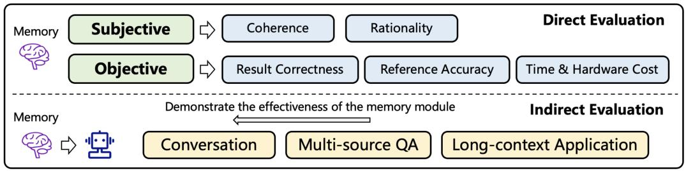  
Fig. 6. An overview of the evaluation methods of the memory module.

efficient forgetting of sensitive information in LLMs by generating contradictory alternative facts, quantifying memory strength using the MEMO metric, and fine-tuning the LLM accordingly.

Discussion. Most of the memory management operations are inspired by the working mechanism of human brains. With the strong capability of LLMs to simulate human minds, these operations can help the agents to better generate high-level information and interact with environments.

5.3.3 Memory Reading. When the agents require information for reasoning and decision-making, the memory reading operation will extract related information from memory for usage. Therefore, how to access the related information for the current state is important. Due to the massive quantity of memory entities, and the fact that not all of them are pertinent to the current state, careful design is required to extract useful information based on relevance and other task-oriented factors.

Representative Studies. In ChatDB [48], the memory reading operation is executed by the SQL statements. These statements will be generated by agents as a series of chain-of-memory in advance. In MPC [73], the agents can retrieve relevant memory from the memory pool. This method also proposes to provide chain-of-thought examples for ignoring certain memory. ExpeL [220] utilizes the FAISS [65] vector store as the pool of memory and obtains the top-  $K$  successful trajectories that share the highest similarity scores with the current task. AriGraph [3] proposes to retrieve relevant knowledge in agent memory with two procedures: a semantic search that returns the most relevant triplets, and an episodic search that returns the most relevant episodic vertices. MemTree [130] employs a collapsed tree retrieval approach to retrieve relevant information from structured memory. It computes cosine similarities between the query embedding and all node embeddings, filters nodes below a threshold, and selects the top-k nodes as the final results.

Discussion. To some extent, the memory reading and writing operations are collaborative, and the forms of memory writing greatly influence the methods of memory reading. For the forms of textual memory, most previous works use the text similarity and other auxiliary information for reading. For the forms of parametric memory, existing models may just utilize the updated parameters for inference, which can be seen as an implicit reading process.

# 6 How to Evaluate the Memory in LLM-based Agent?

How to effectively evaluate the memory module remains an open problem, where diverse evaluation strategies have been proposed in previous works according to different applications. To clearly show the common ideas of different evaluation methods, in this section, we summarize a general framework, which includes two broad evaluation strategies (see Figure 6 for an overview), that is, (1) direct evaluation, which independently measures the capability of the memory module, and (2) indirect evaluation, which evaluates the memory module via end-to-end agent tasks. If the tasks can be effectively accomplished, the memory module is demonstrated to be useful.

# 6.1 Direct Evaluation

This type of approaches regards the memory of the agents as a stand-alone component and evaluates its effectiveness independently. Previous studies can be categorized into two classes: subjective evaluation and objective evaluation. The subjective evaluation aims to measure memory effectiveness based on human judgments, which can be widely used in the scenarios that lack objective ground truths. Objective evaluation assesses memory effectiveness based on numerical metrics, which makes it easy to compare different memory modules.

6.1.1 Subjective Evaluation. In subjective evaluation, there are two key problems, that is, (1) what aspects should be evaluated, and (2) how to conduct the evaluation process. To begin with, the following two aspects are the most common perspectives leveraged to evaluate the memory module.

Coherence. This aspect refers to whether the recalled memory is natural and suitable for the current context. For example, if the agent is making a plan for Alice's travel, the memory should be related to her preference for traveling rather than working. In previous works, Modarressi et al. [110] study whether the memory module could provide proper references among the ever-changing knowledge. Liang et al. [89] present some examples to demonstrate the relation between the current query and historical memory. Zhong et al. [228] and Liu et al. [95] assess the coherence of responses that integrate context and retrieved memory by scoring labels. Lee et al. [73] focus on the contradiction between the recalled memory and contexts.

Rationality. This aspect aims to evaluate whether the recalled memory is reasonable. For example, if the agent is asked to answer "Where is the Summer Palace," the recalled memory should be "The Summer Palace is in Beijing" rather than "The Summer Palace is on the Moon." In previous works, Lee et al. [73] ask crowd workers to directly score the rationality of the retrieved memory. Zhong et al. [228] and Liu et al. [95] recruit human evaluators to check if the memory contains reasonable answers for the current question.

As for how to conduct the evaluation process, there are two important problems. The first one is how to select the human evaluators. In general, the evaluators should be familiar with the evaluation task, which ensures that the labeling results are convincing and reliable. In addition, the backgrounds of the evaluators should be diverse to remove subjective biases of specific human groups. The second problem is how to label the outputs of the memory module. Usually, one can either directly score the results [228] or make comparisons between two candidates [165]. The former can obtain absolute and quantitative evaluation results, while the latter can remove the labeling noises when independently scoring each candidate. In addition, the granularity of the ratings should also be carefully designed. Too coarse ratings may not effectively discriminate the capabilities of different memory modules, while too fine-grained ones may bring more effort for the workers to make judgments.

In general, subjective evaluation can be used in a wide range of scenarios, where one just needs to define the evaluation aspects and let recruited workers make judgments. This method is usually more explainable since the workers can provide the reasons for their judgments. However, subjective evaluation is costly due to the need to employ human evaluators. Additionally, different groups of evaluators may have various biases, making the results difficult to reproduce and compare.

6.1.2 Objective Evaluation. In objective evaluation, previous work usually defines numeric metrics to evaluate the effectiveness and efficiency of the memory module.

Result Correctness. This metric measures whether the agent can successfully answer pre-defined questions directly based on the memory module. For example, the question could be "Where did Alice go today?" with two choices "A: The Summer Palace" and "B: The Great Wall." Then, the

agent should choose the correct answer based on the problem and its memory. The agent-generated answer will be compared with the ground truth. Formally, the accuracy can be calculated as:

$$
\mathrm {C o r r e c t n e s s} = \frac {1}{N} \sum_ {i = 1} ^ {N} \mathbb {I} \left[ a _ {i} = \hat {a} _ {i} \right],
$$

where  $N$  is the number of problems,  $a_{i}$  represents the ground truth for the  $i$ th problem,  $\hat{a}_{i}$  means the answer given by the agent, and  $\mathbb{I}[a_i = \hat{a}_i]$  is the matching function commonly represented as:

$$
\mathbb {I} \left[ a _ {i} = \hat {a} _ {i} \right] = \left\{ \begin{array}{l l} 1 & \text {i f} a _ {i} = \hat {a} _ {i}, \\ 0 & \text {i f} a _ {i} \neq \hat {a} _ {i}. \end{array} \right.
$$

In previous works, Hu et al. [48] construct questions from histories with annotated ground truths and calculate the accuracy of whether the recalled memory could match the correct answers. Similarly, Packer et al. [114] generate questions and answers that can only be derived from past sessions and compare the responses from agents with the ground truths to calculate the accuracy.

Reference Accuracy. This metric evaluates whether the agent can discover relevant memory contents to answer the questions. Different from the above metric, which focuses on the final results, reference accuracy cares more about the intermediate information to support the agent's final decisions. In specific, it compares the retrieved memory with the pre-prepared ground truth. For the above problem of "Where did Alice go today?", if the memory contents include (A) "Alice had lunch with friends at Wangfujing today" and (B) "Alice had roast duck for lunch," then a better memory module should select (A) as a reference to answer the question. Usually, researchers leverage F1-score to evaluate the reference accuracy, which is calculated as:

$$
\mathrm {F 1} = 2 \cdot \frac {\mathrm {P r e c i s i o n} \cdot \mathrm {R e c a l l}}{\mathrm {P r e c i s i o n} + \mathrm {R e c a l l}},
$$

where the precision and recall scores are calculated as Precision =  $\frac{\mathrm{TP}}{\mathrm{TP} + \mathrm{FP}}$  and Recall =  $\frac{\mathrm{TP}}{\mathrm{TP} + \mathrm{FN}}$ . The TP represents the number of true positive memory contents, FP means the number of false positive memory contents, and FN indicates the number of false negative memory contents. In previous works, Lu et al. [99] utilize F1-score to evaluate the retrieval process of the memory, and Zhong et al. [228] focus on assessing whether related memory can be successfully retrieved.

Result correctness and reference accuracy are both utilized to evaluate the effectiveness of the memory module. Beyond effectiveness, efficiency is also an important aspect, especially for real-world applications. Therefore, we describe the evaluation of efficiency as follows.

Time and Hardware Cost. The total time cost includes the time leveraged for memory adaption and inference. The adaptation time refers to the time of memory writing and memory management, while the inference time indicates the time latency of memory reading. In specific, the difference from the end time to the start time of memory operations can be considered as the time consumption. Formally, the average time consumption of each type of operation can be represented as:

$$
\Delta \text {t i m e} = \frac {1}{M} \sum_ {i = 1} ^ {M} t _ {i} ^ {\text {e n d}} - t _ {i} ^ {\text {s t a r t}},
$$

where  $M$  represents the number of these operations,  $t_i^{\mathrm{end}}$  means the end time of the  $i$ th operation, and  $t_i^{\mathrm{start}}$  indicates the start time of that operation. As for the computation overhead, it can be evaluated by the peak GPU memory allocation. In previous works, Tack et al. [149] utilize the peak memory allocation and adaptation time to assess the efficiency of memory operations.

Objective evaluation offers numeric strategies to compare different methods of memory, which is important to benchmark this field and promote future developments.

# 6.2 Indirect Evaluation

Besides the above method that directly evaluates the memory module, evaluating via task completion is also a popular evaluation strategy. The intuition behind this type of approaches is that if the agent can successfully complete a task that highly depends on memory, it suggests that the designed memory module is effective. In the following parts, we present several representative tasks that are leveraged to evaluate the memory module in indirect ways.

6.2.1 Conversation. Engaging in conversations with humans is one of the most important applications of agents, where memory plays a crucial role in this process. By storing context information in memory, the agents allow users to experience personalized conversations, thus improving users' satisfaction. Therefore, when other parts of the agents are determined, the performance of the conversation tasks can reflect the effectiveness of different memory modules.

In the context of conversation, consistency and engagement are two commonly used methods to evaluate the effectiveness of the agents' memory. Consistency refers to how the response from agents is consistent with the context because dramatic changes should be avoided during the conversation. For example, Lu et al. [99] evaluate the consistency of agents on interactive dialogues, using GPT-4 to score on the responses from agents. Engagement refers to how the user is engaged to continue the conversation. It reflects the quality and attraction of agents' responses, as well as the ability of agents to craft the personas for current conversations. For example, Lee et al. [73] assess the engagingness of responses by SCE-p score, and Packer et al. [114] utilize CSIM score to evaluate the memory effect on increasing engagement of users.

6.2.2 Multi-source Question Answering. Multi-source questing answering can comprehensively evaluate the memorized information from multiple sources, including inside-trial information, cross-trial information, and external knowledge. It focuses on the integration of memory utilization from various contents and sources.

In previous works, Yao et al. [200] evaluate the memory that integrates information from the task trial and the external knowledge from Wikipedia. Then, Shinn et al. [138] and Yao et al. [201] further include the cross-trial information of the same task, where the memory is permitted to obtain more experiences from previous failed trials. Moreover, Packer et al. [114] allow agents to utilize the memory from multi-document information for question answering.

By evaluating multi-source question-answering tasks, the memory of agents can be examined on the capability of content integration from various sources. It also reveals the issue of the memory contradiction due to multiple information sources, and the problem of updated knowledge, which can potentially affect the performance of the memory module.

6.2.3 Long-context Applications. Beyond the above general applications, in many scenarios, LLM-based agents have to make decisions based on extremely long prompts. In these scenarios, the long prompts are usually regarded as the memory contents, which play an important role in driving agent behaviors.

In previous works, Huang et al. [58] organize a comprehensive survey for long-context LLMs, which provides a summary of evaluation metrics on long-context scenarios. Moreover, Shaham et al. [133] propose a zero-shot benchmark for evaluating agents' understanding of long-context natural languages. As for specific long-context tasks, long-context passage retrieval is one of the important tasks for evaluating the long-context ability of agents. It requires agents to find the correct paragraph in a long context that corresponds to the given questions or descriptions [5]. Long-context summarization is another representative task. It requests agents to formulate a global understanding of the whole context, and summarizes it according to the descriptions, where

some metrics on matching scores like ROUGE can be utilized to compare the results with ground truths.

The evaluation of long-context applications provides broader approaches to assess the function of memory in agents, focusing on practical downstream scenarios. The comprehensive benchmarks [77, 133] also provide an objective assessment for the ability of long-context understanding.

6.2.4 Other Tasks. In addition to the above three types of major tasks for indirect evaluation, there are also some other metrics in general tasks that can reveal the effectiveness of the memory module.

Success rate refers to the proportion of tasks that agents can successfully solve. For Shinn et al. [138], Yao et al. [200], and Zhao et al. [220], they assess how many spacial tasks can be correctly completed through reasoning and memory in AlfWorld [139]. In Zhu et al. [232], they evaluate the success rate of producing different items in Minecraft to show the effect of memory. Moreover, Shinn et al. [138] measure the success rate of passed problems by generated codes, and Zheng et al. [226] calculate the success rate of computer control and accuracy of element selection to show the function of trajectory-as-exemplar memory. Exploration degree typically appears in exploratory games, which reflects the extent that agents can explore the environment. For example, Wang et al. [160] compare the numbers of distinct items explored in Minecraft to show memorized skills.

In fact, nearly all the memory-equipped agents can evaluate the effect of memory by ablation studies, comparing the performance between with/without memory modules. The evaluation on specific scenarios can show the significance of memory for downstream applications practically.

# 6.3 Datasets and Benchmarks

Some previous works have constructed several datasets to support the evaluation of LLM-based agents [26, 191, 194], and some benchmarks also conduct evaluations on the memory capability of LLM-based agents [102, 182, 219]. In order to better support the research on memory of LLM-based agents, we introduce these datasets and benchmarks to provide a guidance on evaluation resources.

In previous works, PerLTQA [26] is collected to evaluate the personalized memory of LLM-based agents, which pays more attention to the content of events and social connections. It utilizes question-answer (QA) tasks to indicate the performance of memory and provides annotated anchors as the references. It generates user profiles, various types of memory, and QA pairs by prompting LLMs and ensures error-free outputs by validation. LeMon [194] is another early work that proposes the task of long-term memory conversation, which focuses on the capability of understanding and memorizing the history information in long-term conversation. It also proposes a dataset called DuLeMon, incorporating dialogues collected by crowdworkers. Besides, MSC [191] is another dataset that contains multi-session chat. It employs crowdworkers and allocates them with different roles to make conversations, where each conversation includes several sessions.

LoCoMo [102] is intended to evaluate the memory of LLM-based agents in very long-term conversations, where each dialogue can contain hundreds of turns and thousands of tokens. It provides QA tasks, summarization tasks, as well as dialogue generation tasks, which also incorporate multi-modal dialogues. LoCoMo also proposes various types of complex questions in terms of reasoning, such as multi-hop, temporal, and adversarial questions. By allocating different personas to two virtual LLM-based agents and constructing temporal event graphs, it generates various conversations and then employs human annotators to edit and verify them. Based on LoCoMo, a benchmark is presented to compare different models.

MemSim [219] proposes a new framework to conduct objective and automatic evaluations on the memory of LLM-based personal assistants, which can construct reliable and diverse datasets without human annotators. Based on MemSim, it creates a dataset about humans' daily lives, called

MemDaily, including multiple types of problems with controllable noise infusion. After that, it presents a benchmark to compare different types of memory mechanisms of LLM-based agents, which focuses on both the effectiveness and the efficiency when conducting the evaluations.

LongMemEval [182] is another recent benchmark, which is designed to comprehensively evaluate the memory capability of chat assistants. Five significant aspects of questions are proposed, including IE, multi-session reasoning, temporal reasoning, knowledge updates and abstention. It contains hundreds of human-curated questions of high quality.

In summary, these datasets and benchmarks play a significant role in evaluating the memory of LLM-based agents. They can be effectively used to guide the improvement of memory mechanisms of LLM-based agents in different scenarios. By leveraging these datasets, developers can tailor memory capabilities to better handle task-specific challenges, resulting in more efficient and responsive LLM-based agents.

# 6.4 Performance Comparison and Analysis

In this section, we compare and analyze the performances of different types of methods from two perspectives, including the effectiveness and the efficiency.

6.4.1 Perspective of Effectiveness. From the perspective of effectiveness, different types of methods perform variously under different conditions. In long-term scenarios, retrieval-based methods can achieve great performances, with over  $50\%$  accuracy in most QA tasks of LongMemEval [182], because of their abilities to recall relevant information more accurately under a large amount of corpus. Besides, the methods that incorporate complete interactive information can achieve relevant great performances in most cases as well. In MemDaily [219], they can even obtain over  $80\%$  accuracy in some easy types of questions. However, their performances highly depend on the long-context support of foundation models, where some foundation models might not support extremely long contexts. Moreover, these methods also have the problem of lost in the middle [96], leading to position bias. For the methods that comprise recent information, the window size is important. A small window size may prematurely remove critical information in long-term scenarios. As for the fine-tuning methods and model editing methods, continuous changes and updates are difficult, due to the potential risks of overfitting and the catastrophic forgetting [169]. Therefore, these methods may not be suitable for long-context scenarios according to previous works. In some short-term scenarios, recency-based methods can also perform well, especially in the tasks that require consistency and time-awareness, such as multi-session dialogues. In addition, fine-tuning methods are suitable for injecting a large amount of static knowledge. Model editing methods can not only change the explicitly provided information but also alter related information while minimizing the impact on the original capability.

6.4.2 Perspective of Efficiency. From the perspective of efficiency, we focus on the adaptation time and inference time as we have mentioned in Section 6.1.2. As for the adaptation time, parametric methods commonly take the longest because they need to adjust their parameters inside the foundation models, which often requires a large amount of calculation [169]. Retrieval-based methods also require some adaptation time to build the index, in order to facilitate better matching of relevant information during memory recalling [219]. For other naive methods like saving complete or recent interactions, they can just append them into lists within a very short time. As for the inference time, introducing complete interactions will lead to plenty of extra tokens within the prompt, thereby significantly increasing the inference time proportionally. Although retrieval-based methods can introduce only a small subset of messages during interactions into prompts, they commonly need extra time for the retrieval process, such as calculating the matching scores between queries and memory contents. Their extra time costs may also increase with the amount

of stored information [36]. In contrast, the methods that only introduce the recent information with a certain window size can maintain a constant and controllable cost of inference time. Finally, parametric methods can avoid extra costs in extending prompts with explicit context, but some of them may require extra time for parameter selections [169].

# 6.5 Further Discussions

In this section, we engage in further discussions of the metrics and evaluation processes. In brief, there are three significant aspects that are highly related to the evaluation of memory mechanisms in LLM-based agents, including the content levels, offline biases, and metrics.

6.5.1 Different Content Levels of Evaluation. In the evaluation of memory in LLM-based agents, the tasks may correspond to different levels of memory content. Here, we refer to level as the degree of abstraction of the memory required to deal with the task, compared to the original observations. For example, in the scenario of personal assistants, for the user's observation "I like the movie Interstellar," there can be several levels of memory to be evaluated. A lower-level question can be "What is the movie that the user likes?" because the answer can be directly obtained from the observation. Relatively, a higher-level question can be "What style of movies does the user like?" which requires an abstraction process, or even reflection according to other previous observations. The evaluation of high-level memory can be considered an evaluation of the combination of memory and reasoning, which may be helpful to balance the load between memory and reasoning.

6.5.2 Potential Bias of Offline Evaluation. Currently, most evaluations on the memory of LLM-based agents adopt offline settings, especially for direct evaluation approaches. They commonly generate datasets of interactions between environments and pre-defined agents. For example, Du et al. [26] collect conversational datasets between a user simulator and an agent simulator. They consider the previous dialogues as the evaluated memory and construct questions and answers accordingly. However, there can be a distribution shift between the memory mechanism of generating data and the memory mechanism to be tested, leading to an evaluation bias. It is still an issue that needs to be resolved under the evaluation with static datasets. Although online evaluation can address this bias, however, it often comes at a high cost. Additionally, methods based on user simulators are also a type of alternative approaches.

6.5.3 Comprehensive Metrics of Evaluation. Although the effectiveness and efficiency have been widely utilized as metrics in evaluating memory of LLM-based agents, most of them focus on the static performance, without considering the dynamic changes of memory performance along with critical factors. One critical factor is the amount of memory content. Intuitively, as the amount of content to be remembered increases, the difficulty of accurately recalling it also rises, which typically leads to a decline in memory performance. Therefore, the curve of memory performance as it varies with the amount of content can reflect the capacity of the memory mechanism. Another important factor is the level of noise that the observations contain. It can reflect the robustness of memory mechanisms of LLM-based agents under noisy and sparse scenarios.

# 7 Memory-enhanced Agent Applications

Recently, LLM-based agents have been investigated across a wide variety of scenarios, facilitating societal advancement. In general, most LLM-based agents are equipped with memory modules. However, the specific effects undertaken by these memory components, the particular information they store, and the implementation methods they use vary across different applications. In order to provide insights for the design of memory functionalities in LLM-based agents, in this section, we review and summarize how memory mechanisms are manifested in LLM-based agents across

Table 4. Summarization of Memory-enhanced Agents Applications  

<table><tr><td>Applications</td><td>Models</td><td>Applications</td><td>Models</td></tr><tr><td rowspan="2">Role-play</td><td rowspan="2">Character-LLM [134]ChatHaruhi [76]RoleLLM [178]NarrativePlay [223]CharacterGLM [230]RoleAgent [93]LLM Roleplay [150]</td><td>Code Generation</td><td>ChatDev [125]MetaGPT [88]CodeAgent [214]CodeCoR [117]MapCoder [60]RepairAgent [7]</td></tr><tr><td rowspan="2">Recommendation</td><td rowspan="2">RecAgent [165]InteRecAgent [55]RecMind [173]AgentCF [213]RAH [140]</td></tr><tr><td rowspan="2">Social Simulation</td><td rowspan="2">Generative Agents [120]Lyfe Agents [68]S3 [35]MetaAgents [88]WarAgent [51]GenSim [151]AgentSociety [124]</td></tr><tr><td>MedicalEHRAgent [137]</td><td>HuaTuo [161]DoctorGLM [188]Radiology-GPT [98]Wang et al. [162]</td></tr><tr><td>Personal Assistant</td><td>MemoryBank [228]RET-LLM [110]MemoChat [99]MemGPT [114]MPC [73]AutoGen [185]ChatDB [48]TiM [95]SCM [89]AssistantX [146]MobileGPT [74]</td><td>Financial</td><td>ChatDoctor [209]Agent Hospital [78]MEDCO [180]InvestLM [198]TradingGPT [87]QuantAgent [168]FinMem [207]Koa et al. [69]FinCon [208]FinVerse [2]RTBAgent [10]</td></tr><tr><td>Game and Open-world</td><td>Voyager [160]GITM [232]JARVIS [175]LARP [195]Questum [231]</td><td rowspan="2">Science</td><td rowspan="2">Chemist-X [13]ChemDFM [225]MatChat [16]ChemAgent [152]ChemThinker [67]</td></tr><tr><td>Code Generation</td><td>RTLFixer [156]GameGPT [12]</td></tr></table>

various application scenarios. In specific, we categorize them into several classes: role-playing and social simulation, personal assistant, open-world games, code generation, recommendation, expert systems in specific domains, and other applications. The summarization is shown in Table 4.

# 7.1 Role-playing and Social Simulation

Role-playing represents a classic application of LLM-based agents, where memory plays a crucial role inside the agents. It endows roles with distinct characteristics, differentiating them from one another. Many previous studies have explored methods for constructing role memories [76, 134, 178, 223, 230]. Shao et al. [134] construct the memory of roles by experience uploading, which utilizes SFT to inject memory into model parameters. Li et al. [76] enhance LLMs for roleplaying via an improved prompt and the character memory extracted from scripts, where user queries and chatbot's responses are concatenated to form a sequence as memory. Wang et al. [178] infuse role-specific knowledge and episode memories into LLM-based agents, where context QA pairs are concatenated to form episode memory. Zhao et al. [223] aim to generate human-like responses, guided by personality traits extracted from narratives, which can be stored and retrieved by relevance and importance. Zhou et al. [230] generate character-based dialogues for different roles and empower LLM-based agents with corresponding styles by SFT. Liu et al. [93] integrate a hierarchical memory system to store and retrieve structured and high-level memories of different roles, enhancing the believability and consistency of role-playing agents.

Social simulation is basically an extension of role-playing, which focuses more on multi-agent modeling. The memory module is an important component for such applications, which helps to accurately simulate human dynamic behaviors. In previous studies, Kaiya et al. [68] propose a summarize-and-forget memory mechanism for better self-monitoring in social scenarios. Gao et al. [35] focus on social network simulation systems. Each agent in the system has a memory pool, which consists of diverse user messages from online platforms to identify the user. Li et al. [80] maintain conversation contexts, encompassing the economic environment and agent decisions from previous months, in order to simulate the impact of broad macroeconomic trends on agents' decision-making and to make the agents grasp market dynamics. Li et al. [88] simulate the job-seeking scenario in human society, where the memory of agents includes profiles and goals initially and is further enriched with other information, like dialogues and personal reflections. Hua et al. [51] simulate the decisions and consequences of the participating countries in the wars, where the conversations of agents are continuously maintained into memory. Tang et al. [151] propose a general social simulation platform using LLM-based agents, featuring agent memory for behavior retention and error-correction mechanisms for reliable simulations.

There are several insights in designing an agent's memory for role-play and social simulation. First, the memory should be consistent with the roles' characteristics, which can be used to identify each role and distinguish it from the others. This is crucial for improving the realism of role-play and the diversity of social simulation. Second, the memory should appropriately influence the subsequent actions of the agent to ensure the consistency and rationality of its behaviors. Additionally, for humanoid agents, their memory mechanisms should align with the features of human memory, such as forgetting and long/short-term memory, which should refer to the theories of cognitive psychology.

# 7.2 Personal Assistant

LLM-based agents are well suited for creating personal assistants, such as agents capable of engaging in long-term conversations with users [73, 99, 185], as well as those tasked with automatically seeking information [116]. These agents often need to memorize previous dialogues to maintain the consistency and remember critical styles and events to generate more personalized and relevant responses. Lu et al. [99] maintain the context consistency for dialogues by saving contents and information of conversations, which helps to find proper relevant information by retrieval. Lee et al. [73] summarize conversations to extract important information, store it, and retrieve it for future

inference. Pan et al. [116] focus on information-seeking tasks, which design memory modules to store user's context information, and empower external knowledge with tool usage. Wu et al. [185] retain important context as memory to maintain conversation consistency. Lee et al. [74] propose an LLM-based personal assistant for mobile task automation, leveraging human-like app memory to learn and recall tasks, reducing latency and cost.

In summary, most memory implementations for personal assistants adopt retrieval methods in textual form because they are better at finding relevant information from pieces of conversations. For the memory storage, the agent should remember the factual information during user-agent interactions, as well as the personal style of users, in order to generate responses that are tailored to the user's situation. Additionally, when recalling memories, the agent should identify and retrieve the memory that is relevant to the current query and context. This principle can enable the agent to correctly understand the user's requirement and maintain the consistency in conversations.

# 7.3 Open-world Game

For games and open-world exploration, LLM-based agents always maintain post-observations as task contexts and store experiences in previous successful trials. By leveraging past experiences, agents can avoid making the same mistakes repeatedly and achieve a high-level understanding of environments, thus exploring more effectively. Some of them can acquire external databases or APIs to obtain general knowledge [160, 175, 195, 232]. Wang et al. [160] save obtained skills into memory for further usage in Minecraft. Zhu et al. [232] store and retrieve successful trajectories as examples for similar tasks and utilize external Minecraft Wiki by API calls. Wang et al. [175] construct multimodal memory as a knowledge library and provide examples for prompt by retrieving interactive experiences. Yan et al. [195] maintain working memory for decision-making, save and retrieve relevant past experiences, and implement external datasets for general knowledge. Zhu et al. [231] design a novel framework for LLM-based agents in Murder Mystery Games. In this work, they utilize the memory of agents to store and retrieve character states, optimize information collection process, and enhance decision-making efficiency.

In summary, no matter inside-trial or cross-trial information, the key aspect of memory is to reflect on past interactions and draw experiences that can be applied to the subsequent exploration. In addition to accumulating experience through self-involving trials, absorbing external knowledge as part of the agent's memory is also critical to enhance the exploratory capabilities of the agent.

# 7.4 Code Generation

In the scenario of code generation, LLM-based agents can search relevant information from the memory, thereby obtaining more knowledge for development. They can save previous experiences for future problems and also maintain context in conversational development interfaces [12, 88, 125, 156]. Tsai et al. [156] construct an external nonparametric memory database, which stores the compiler errors and human expert instructions for automatic syntax error fixing. In [12], personal information will be stored in the memory and helps in retaining context and knowledge for decision-making. Qian et al. [125] adopt multi-agents to develop software, where each role maintains a memory to store the past conversations with other roles. Li et al. [88] also focus on software development, and the agent can retrieve its historical records preserved in memory when errors occur. Zhang et al. [214] can search relevant information when they face problems on code generation. Pan et al. [117] propose an LLM-based self-reflective multi-agent framework for code generation, utilizing agent memory to store and retrieve prompts, code snippets, test cases, and repair advice, enhancing collaboration and efficiency.

By leveraging external resources, the agents can learn from code-related knowledge and store it into their memory, thereby enhancing the capabilities of code generation. In addition, the memory

can improve the continuity and consistency in code generation. By integrating contextual memory, the agent can better understand the requirements for software development, thereby enhancing the coherence of the generated code. Furthermore, the memory is also crucial for the iterative optimization of code, as it can identify the developer's targets based on the histories.

# 7.5 Recommendation

In the field of recommendation, some previous works focus on simulating users in recommender systems [55, 165], where the memory can represent the user profiles and histories in the real world. Others try to improve the performance of recommendation or provide other formats of recommendation interfaces [173, 213]. Wang et al. [165] simulate user behaviors in recommendation scenarios to generate data for recommender systems, and the agents store past observations and insights into a hierarchical memory. In Huang et al. [55], the memory in LLM-based agents can archive the user's conversational history over extended periods, as well as capture the most recent dialogues pertinent to the current prompt, to simulate interactive recommender systems. It also uses an actor-critic reflection to improve the robustness of agents. Item agents and user agents are equipped with different memories in [213], where item agents are endowed with dynamic memory modules designed to capture and preserve information pertinent to their intrinsic attributes and the inclinations of their adopters. For user agents, the adaptive memory updating mechanism plays a pivotal role in aligning the agents' operations with user behaviors and preferences. Wang et al. [173] memorize individualized user information like reviews or ratings for items and acquire domain-specific knowledge and real-time information by web searching tools. Shu et al. [140] introduce a human-centered recommendation framework with LLM-based agents. It utilizes memory to learn and act upon user personalities, enhancing recommendation accuracy and user satisfaction.

For both simulating users in recommender systems and capturing their preferences, retaining personalized information through memory is essential. A critical challenge lies in how to align the personalized information and feedback with LLMs and store them into the memory of agents. It is also important to bride the gap between conventional recommendation models and LLMs.

# 7.6 Expert System in Specific Domains

Medicine Domain. In the field of medicine, most of the previous works empower LLM-based agents with external knowledge in their memory [98, 161, 162, 188, 209]. Wang et al. [161] fine-tune LLaMA [154] with medical knowledge graph CMeKG [8] in QA form, in order to enhance their medical domain knowledge. Xiong et al. [188] adopt LoRA [49] to efficiently fine-tune on foundation models for healthcare. Wang et al. [162] empower LLM-based agents to acquire text-based external knowledge as reasoning reference. Besides, Shi et al. [137] build memory upon the most relevant successful cases from past experiences and use similarity metric for the retrieval of relevant questions in the medicine domain. Wei et al. [180] construct a multi-agent copilot system for medical education, utilizing agent memory to store and retrieve feedback from medical experts, enhancing the learning experience for medical students.

Finance Domain. Some previous works also apply LLM-based agents in the finance domain, whose memory can store financial knowledge [198], market information [87, 207], and successful experiences [69, 168]. Yang et al. [198] construct financial investment dataset to fine-tune LLaMA [154] to empower knowledge on investment. Li et al. [87] design a layered-memory structure to store different types of marketing information. Wang et al. [168] record the ongoing interaction like exchanges and information to ensure consistent response and record prior outputs as experiences for retrieving relevant examples to provide a diverse learning context for agents. Koa et al. [69] store past price movement and explanations and generate reflections on previous trials. Yu et al. [207] adopt a layered-memory mechanism to provide abundant information for reasoning. Cai et al.

[10] propose an LLM-based agent system for real-time bidding in online advertising, utilizing agent memory to store and retrieve historical decisions, transaction records, and market environment information, enhancing decision-making adaptability and profitability.

Science. In the domain of science, some existing works design LLM-based agents with a large amount of knowledge in memory to solve problems [13, 16, 225]. Chen et al. [13] include molecule database and online literature as external knowledge for memory in LLM-based agents and retrieve them when they need related information. Zhao et al. [225] and Chen et al. [16] empower domain knowledge by fine-tuning in Chemistry and structured materials, respectively. Ju et al. [67] employ chemistry-inspired agents for molecular insights, utilizing agent memory to store and retrieve insights, enhancing prediction accuracy and interpretability.

To build an expert system based on agents in a specific vertical domain, it is necessary to retain the domain-specific knowledge in their memory. However, there are several challenges. First, domain knowledge is specialized and requires higher accuracy, leading to difficulties in constructing memory storage. Second, domain knowledge is often time-sensitive, which can become outdated in the future. Therefore, the memory needs to be partially updated when some of the knowledge has been out-of-date. Furthermore, the substantial volume of domain knowledge makes it difficult to recall from memory based on the current query.

# 7.7 Other Applications

There are some other applications of memory in LLM-based agents. Wang et al. [176] focus on the task of cloud root cause analysis, using memory to store framework rules, task requirements, tools documentation, few-shot examples, and agent observations. Qiang et al. [126] solve the problem of ontology matching. The agents save conversational dialogues and construct a rational database for retrieving external knowledge. Wen et al. [181] investigate autonomous driving, whose memory module is constructed by a vector database and contains the experiences from past driving scenarios. Wang et al. [177] propose to improve user acceptance testing, which employs a self-reflection mechanism. After each trial, the operation agent summarizes the conversation and updates the memory pool, until the goal of the current step is accomplished.

For different applications, the focus of memory varies, as it inherently serves the downstream tasks. Therefore, the design should also consider the requirements of tasks.

# 8 Limitations and Future Directions

# 8.1 More Advances in Parametric Memory

At present, the memory of LLM-based agents is predominantly in textual form, especially for contextual knowledge such as observation records, trial experiences, and textual knowledge databases. Although textual memory possesses the advantages of being interpretable and easy to expand and edit, it also implies a sacrifice in efficiency compared to parametric memory. Essentially, parametric memory boasts a higher information density, expressing semantics through continuous real-number vectors in a latent space, whereas textual memory employs a combination of tokens in a discrete space for semantic expression. Thus, parametric memory offers a richer expressive space, and its soft encoding is more robust compared to the hard-coded form of token sequences. Additionally, parametric memory is more storage-efficient, where it does not require the explicit storage of extensive texts, similar to a knowledge compression process. As for the memory management, such as merging and reflection, parametric memory does not necessarily design manual rules like textual memory does, but can employ optimization methods to learn these processes implicitly. Moreover, pluggable parametric memory is similar to a digital life card, capable of endowing agents with the requisite characteristics. For example, Huatuo [161] aims to enhance agents with expertise

in the biomedical field by refining the LLaMA [154] model on Chinese medical knowledge bases. MAC [149] is designed to create a parametric memory adaptation framework suitable for online settings, employing meta-learning techniques to replace the traditional optimization phase.

Although parametric memory holds great prospects, it currently faces numerous challenges. Foremost among these is the issue of efficiency: how to effectively transform textual information into parameters or modifications of parameters is a critical question. Presently, researchers can transfer vast amounts of domain knowledge into the parameters of LLMs by SFT. However, it is time-consuming and requires extensive text corpus, making it unsuitable for situational knowledge. One viable approach is to employ meta-learning to let models learn to memorize. For example, MEND [109] leverages the method of meta-learning to train a compact model that has the ability to produce adjustments for the parameters of a pre-trained language model. Moreover, the lack of interpretability associated with parametric memory can be a hindrance, especially in domains requiring high levels of trust, such as medicine. Therefore, enhancing the credibility and interpretability of parametric memory is an urgent issue that needs to be addressed.

# 8.2 Memory in LLM-based Multi-agent Applications

The exploration of memory mechanisms within LLMs has begeoned into the dynamic domain of multi-agent systems (MAS), marking significant advancements in the realms of synchronization, communication, and the management of information asymmetry. One pivotal aspect that emerges in the cooperative scenarios is memory synchronization among agents. This process is fundamental for establishing a unified knowledge base, ensuring consistency in decision-making across different agents. For example, Chen et al. [15] emphasize the significance of integrating synchronized memory modules for multi-robot collaboration. Another important aspect is the communication among agents, which heavily relies on memory for maintaining context and interpreting messages. For example, Mandi et al. [103] illustrate memory-driven communication frameworks that foster a common understanding among agents. In addition to cooperative scenarios, some studies also focus on competitive scenarios, and the information asymmetry becomes a crucial issue [90].

A critical yet overlooked consideration in multi-agent memory systems is the federated setting. In federated environments, each agent is tasked with managing shared memory to enhance overall coordination, as well as private memory, which is essential for protecting sensitive data with privacy policies. The federated setting for memory management presents several distinct challenges. First of all, agents should carefully balance the benefits of information sharing for enhanced collaboration against the necessity of protecting sensitive or proprietary data. Furthermore, it is also important to determine which portions of an agent's memory can be safely shared and which should be retained as private. As the agent system scales, real-time synchronization can also be challenging.

In order to address these challenges, future research may concentrate on developing adaptive memory mechanisms that seamlessly integrate advanced techniques. They may include differential privacy and encryption within federated learning frameworks. By enabling agents to dynamically balance shared and private memory to satisfy privacy requirements, these memory mechanisms may lead to more secure and efficient multi-agent collaborations.

Looking ahead, the advancement of memory in MAS is poised at the confluence of technological innovation and strategic application. It beckons the exploration of novel memory modules that can further enhance agent synchronization, enable more effective communication, and provide strategic advantages in information-rich environments. The development of such memory models would not only necessitate addressing the current challenges of memory integration and management but also explore the untapped potentials of memory in facilitating more robust, intelligent, and adaptable MAS. As evidenced by pioneering research, the evolving landscape of LLM-based MAS sets a promising stage for future innovations in memory utilization and management. This exploration

is expected to unravel new dimensions of memory integration, pushing the boundaries of what is currently achievable and setting new benchmarks in the realm of MAS.

# 8.3 Memory-based Lifelong Learning

Lifelong learning is an advanced topic in AI, extending the learning capabilities of agents across their lifelong span [92]. Agents can continuously interact with their environment, persistently observe environments, and acquire external knowledge, enabling a mode of enhancement like humans. The memory of an agent is key to achieving lifelong learning, as it needs to learn to store and apply the past observations. Lifelong learning in LLM-based agents holds significant practical value, such as in long-term social simulations and personal assistance. However, it also faces several challenges. First, lifelong learning is temporal, necessitating that an agent's memory captures temporality. This temporality could cause interactions between memories, such as memory overlap. Furthermore, due to the extended period of lifelong learning, it needs to store a vast amount of memories and retrieve them when needed, possibly incorporating a certain mechanism for forgetting.

# 8.4 Memory in Humanoid Agent

A humanoid agent refers to an agent designed to exhibit behaviors consistent with humans, thereby facilitating applications in social simulation, studies of human behavior, and role-playing. Unlike task-oriented agents where greater capability is typically preferred, the proficiency of a humanoid agent should closely mimic that of humans. Consequently, the memory of humanoid agents should align with human cognitive processes, adhering to psychological principles such as memory distortion and forgetfulness. Additionally, humanoid agents should possess knowledge boundaries, meaning that their knowledge should correspond to the entity they replicate. For instance, in roleplaying scenarios, an agent embodying a child should not possess an understanding of advanced mathematical concepts or other complex knowledge beyond what is typical for that age [1].

# 8.5 Structure-enhanced Memory

In human cognition, the memory system is not merely a monolithic information repository, but a highly organized and dynamic architecture [33]. This structured system conspicuously showcases the logical coherence and connectivity of acquired information, playing a crucial role in human learning, reasoning, and decision-making processes. In the realm of LLM-based agents, early studies typically accumulate external information or historical records to form text-based memory banks. Such a linear memory form is simple to implement, yet it comes with two inherent limitations: on the one hand, it haphazardly piles up all acquired information, posing a significant challenge for the agents to perceive the implicit relationships among crucial memory pieces; on the other hand, it is strenuous for the agents to reveal reasoning rationales behind their decisions based on the unstructured memories, resulting in poor interpretability.

Some recent works are designed to enhance the memory systems from a structured perspective. GraphRAG approaches [29, 123, 184] leverage extensive LLM-driven operations (e.g., entity recognition and relation extraction) to transform external text corpora into knowledge graphs, allowing abstractive summarization of relevant information through structural clustering. Similarly, SG-prompt [81], HOLMES [118], and GraphReader [82] also reconstruct the collected text information into knowledge graphs to facilitate multi-hop question-answering task. GE-reasoning [119] and semi-structured CoT [144] pre-parse the input questions into masked structured chains to guide subsequent reasoning steps. RoG [100] and ToG [145] directly incorporate external knowledge graphs to achieve more faithful and interpretable reasoning. InfoRE [17] reorganizes the context

information into MindMap form, revealing the underlying logical relationships to provide stronger support for the reasoning process.

However, despite the progress made in these studies, existing structured memory mechanisms remain in the nascent stage. First, most of these works simply rely on one-time restructuring workflows to construct their memories, while neglecting the ongoing updates and optimization of memory structures. In other words, an advanced agent should progressively enrich and refine its memory structure throughout interactions with the environment, enabling it to more effectively cope with complex and dynamic task scenarios. Second, existing works heuristically adopt memory structures of a specific form, yet each structure offers unique advantages: graph structures are effective in modeling factual relationships, tree structures excel at depicting hierarchical organization, and code structures are well suited for representing procedural logic. Future research should place greater emphasis on how agents can dynamically select the most suitable memory structure based on different task scenarios and environmental feedback. Last but not least, another critical challenge lies in how to induce general rules and patterns from the memory structures. These rules and patterns can substantially enhance the agents' generalization capacity, fostering more robust performance in diverse task scenarios. In conclusion, the structure-enhanced memory mechanism has not yet been fully explored for LLM-based agents, but it holds significant potential in delivering intelligible contexts for higher-quality cognitive reasoning.

# 9 Conclusion

In this survey, we provide a systematical review on the memory mechanism of LLM-based agents, where we focus on three key problems including "What is," "Why do we need," and "How to design and evaluate" the memory module in LLM-based agents. To show the importance of the agent's memory, we also present many typical applications, where the memory module plays an important role. We believe this survey can offer valuable references for newcomers to this domain and also hope it can inspire more advanced memory mechanisms to enhance LLM-based agents.

# References

[1] Gati V. Aher, Rosa I. Arriaga, and Adam Tauman Kalai. 2023. Using large language models to simulate multiple humans and replicate human subject studies. In Proceedings of the International Conference on Machine Learning. PMLR, 337-371.  
[2] Siyu An, Qin Li, Junru Lu, Di Yin, and Xing Sun. 2024. FinVerse: An autonomous agent system for versatile financial analysis. arXiv:2406.06379. Retrieved from https://arxiv.org/abs/2406.06379  
[3] Petr Anokhin, Nikita Semenov, Artyom Y. Sorokin, Dmitry Evseev, Mikhail Burtsev, and Evgeny Burnaev. 2024. AriGraph: Learning knowledge graph world models with episodic memory for LLM agents. arXiv:2407.04363. Retrieved from https://arxiv.org/abs/2407.04363  
[4] Guangji Bai, Zheng Chai, Chen Ling, Shiyu Wang, Jiaying Lu, Nan Zhang, Tingwei Shi, Ziyang Yu, Mengdan Zhu, Yifei Zhang, et al. 2024. Beyond efficiency: A systematic survey of resource-efficient large language models. arXiv:2401.00625. Retrieved from https://arxiv.org/abs/2401.00625  
[5] Yushi Bai, Xin Lv, Jiajie Zhang, Hongchang Lyu, Jiankai Tang, Zhidian Huang, Zhengxiao Du, Xiao Liu, Aohan Zeng, Lei Hou, et al. 2023. LongBench: A bilingual, multitask benchmark for long context understanding. arXiv:2308.14508. Retrieved from https://arxiv.org/abs/2308.14508  
[6] Zechen Bai, Pichao Wang, Tianjun Xiao, Tong He, Zongbo Han, Zheng Zhang, and Mike Zheng Shou. 2024. Hallucination of multimodal large language models: A survey. arXiv:2404.18930. Retrieved from https://arxiv.org/abs/2404.18930  
[7] Islem Bouzenia, Premkumar T. Devanbu, and Michael Pradel. 2024. RepairAgent: An autonomous, LLM-based agent for program repair. arXiv:2403.17134. Retrieved from https://arxiv.org/abs/2403.17134  
[8] Odma Byambasuren, Yunfei Yang, Zhifang Sui, Damai Dai, Baobao Chang, Sujian Li, and Hongying Zan. 2019. Preliminary study on the construction of Chinese medical knowledge graph. Journal of Chinese Information Processing 33, 10 (2019), 1-9.  
[9] Davide Caffagni, Federico Cocchi, Luca Barsellotti, Nicholas Moratelli, Sara Sarto, Lorenzo Baraldi, Marcella Cornia, and Rita Cucchiara. 2024. The (r)evolution of multimodal large language models: A survey. arXiv:2402.12451. Retrieved from https://arxiv.org/abs/2402.12451

[10] Leng Cai, Junxuan He, Yikai Li, Junjie Liang, Yuanping Lin, Ziming Quan, Yawen Zeng, and Jin Xu. 2025. RTBAgent: A LLM-based agent system for real-time bidding. arXiv:2502.00792. Retrieved from https://arxiv.org/abs/2502.00792  
[11] Yupeng Chang, Xu Wang, Jindong Wang, Yuan Wu, Linyi Yang, Kaijie Zhu, Hao Chen, Xiaoyuan Yi, Cunxiang Wang, Yidong Wang, et al. 2024. A survey on evaluation of large language models. ACM Transactions on Intelligent Systems and Technology 15, 3 (2024), 1-45.  
[12] Dake Chen, Hanbin Wang, Yunhao Huo, Yuzhao Li, and Haoyang Zhang. 2023. GameGPT: Multi-agent collaborative framework for game development. arXiv:2310.08067. Retrieved from https://arxiv.org/abs/2310.08067  
[13] Kexin Chen, Junyou Li, Kunyi Wang, Yuyang Du, Jiahui Yu, Jiamin Lu, Lanqing Li, Jiezhong Qiu, Jianzhang Pan, Yi Huang, et al. 2024. Chemist-X: Large language model-empowered agent for reaction condition recommendation in chemical synthesis. arXiv:2311.10776. Retrieved from https://arxiv.org/abs/2311.10776  
[14] Shuaihang Chen, Yuanxing Liu, Wei Han, Weinan Zhang, and Ting Liu. 2024. A survey on multi-generative agent system: Recent advances and new frontiers. arXiv:2412.17481. Retrieved from https://arxiv.org/abs/2412.17481  
[15] Yongchao Chen, Jacob Arkin, Yang Zhang, Nicholas Roy, and Chuchu Fan. 2023. Scalable multi-robot collaboration with large language models: Centralized or decentralized systems? arXiv:2309.15943. Retrieved from https://arxiv.org/abs/2309.15943  
[16] Zi-Yi Chen, Fan-Kai Xie, Meng Wan, Yang Yuan, Miao Liu, Zong-Guo Wang, Sheng Meng, and Yan-Gang Wang. 2023. MatChat: A large language model and application service platform for materials science. Chinese Physics B 32, 11 (2023), 118104.  
[17] Xiaoxia Cheng, Zeqi Tan, and Weiming Lu. 2024. Information re-organization improves reasoning in large language models. arXiv:2404.13985. Retrieved from https://arxiv.org/abs/2404.13985  
[18] Yuheng Cheng, Ceyao Zhang, Zhengwen Zhang, Xiangrui Meng, Sirui Hong, Wenhao Li, Zihao Wang, Zekai Wang, Feng Yin, Junhua Zhao, et al. 2024. Exploring large language model based intelligent agents: Definitions, methods, and prospects. arXiv:2401.03428. Retrieved from https://arxiv.org/abs/2401.03428  
[19] Fergus I. M. Craik and Robert S. Lockhart. 1972. Levels of processing: A framework for memory research. Journal of Verbal Learning and Verbal Behavior 11, 6 (1972), 671-684.  
[20] Can Cui, Yunsheng Ma, Xu Cao, Wenqian Ye, Yang Zhou, Kaizhao Liang, Jintai Chen, Juanwu Lu, Zichong Yang, Kuei-Da Liao, et al. 2024. A survey on multimodal large language models for autonomous driving. In Proceedings of the IEEE/CVF Winter Conference on Applications of Computer Vision, 958-979.  
[21] Badhan Chandra Das, M. Hadi Amini, and Yanzhao Wu. 2024. Security and privacy challenges of large language models: A survey. arXiv:2402.00888. Retrieved from https://arxiv.org/abs/2402.00888  
[22] Nicola De Cao, Wilker Aziz, and Ivan Titov. 2021. Editing factual knowledge in language models. arXiv:2104.08164. Retrieved from https://arxiv.org/abs/2104.08164  
[23] Peter J. Denning. 2005. The locality principle. Communications of the ACM 48, 7 (2005), 19-24.  
[24] Ning Ding, Yujia Qin, Guang Yang, Fuchao Wei, Zonghan Yang, Yusheng Su, Shengding Hu, Yulin Chen, Chi-Min Chan, Weize Chen, et al. 2022. Delta tuning: A comprehensive study of parameter efficient methods for pre-trained language models. arXiv:2203.06904. Retrieved from https://arxiv.org/abs/2203.06904  
[25] Zhichen Dong, Zhanhui Zhou, Chao Yang, Jing Shao, and Yu Qiao. 2024. Attacks, defenses and evaluations for LLM conversation safety: A survey. arXiv:2402.09283. Retrieved from https://arxiv.org/abs/2402.09283  
[26] Yiming Du, Hongru Wang, Zhengyi Zhao, Bin Liang, Baojun Wang, Wanjun Zhong, Zezhong Wang, and Kam-Fai Wong. 2024. PerLTQA: A personal long-term memory dataset for memory classification, retrieval, and synthesis in question answering. arXiv:2402.16288. Retrieved from https://arxiv.org/abs/2402.16288  
[27] Zane Durante, Qiuyuan Huang, Naoki Wake, Ran Gong, Jae Sung Park, Bidipta Sarkar, Rohan Taori, Yusuke Noda, Demetri Terzopoulos, Yejin Choi, et al. 2024. Agent AI: Surveying the horizons of multimodal interaction. arXiv:2401.03568. Retrieved from https://arxiv.org/abs/2401.03568  
[28] Hermann Ebbinghaus. 1885. Memory: A contribution to experimental psychology. Annals of Neuroscience 20, 4 (2013), 155-6. DOI: 10.5214/ans.0972.7531.200408.  
[29] Darren Edge, Ha Trinh, Newman Cheng, Joshua Bradley, Alex Chao, Apurva Mody, Steven Truitt, and Jonathan Larson. 2024. From local to global: A graph rag approach to query-focused summarization. arXiv:2404.16130. Retrieved from https://arxiv.org/abs/2404.16130  
[30] Angela Fan, Belize Gokkaya, Mark Harman, Mitya Lyubarskiy, Shubho Sengupta, Shin Yoo, and Jie M. Zhang. 2023. Large language models for software engineering: Survey and open problems. arXiv:2310.03533. Retrieved from https://arxiv.org/abs/2310.03533  
[31] Wenqi Fan, Yujuan Ding, Liangbo Ning, Shijie Wang, Hengyun Li, Dawei Yin, Tat-Seng Chua, and Qing Li. 2024. A survey on rag meeting LLMs: Towards retrieval-augmented large language models. In Proceedings of the 30th ACM SIGKDD Conference on Knowledge Discovery and Data Mining, 6491-6501.  
[32] Zhangyin Feng, Weitao Ma, Weijiang Yu, Lei Huang, Haotian Wang, Qianglong Chen, Weihua Peng, Xiaocheng Feng, Bing Qin, et al. 2023. Trends in integration of knowledge and large language models: A survey and taxonomy of methods, benchmarks, and applications. arXiv:2311.05876. Retrieved from https://arxiv.org/abs/2311.05876

[33] Catherine Twomey Fosnot. 2013. Constructivism: Theory, Perspectives, and Practice. Teachers College Press.  
[34] Isabel O. Gallegos, Ryan A. Rossi, Joe Barrow, Md Mehrab Tanjim, Sungchul Kim, Franck Dernoncourt, Tong Yu, Ruiyi Zhang, and Nesreen K. Ahmed. 2023. Bias and fairness in large language models: A survey. arXiv:2309.00770. Retrieved from https://arxiv.org/abs/2309.00770  
[35] Chen Gao, Xiaochong Lan, Zhihong Lu, Jinzhu Mao, Jinghua Piao, Huandong Wang, Depeng Jin, and Yong Li. 2023. S3: Social-network simulation system with large language model-empowered agents. arXiv:2307.14984. Retrieved from https://arxiv.org/abs/2307.14984  
[36] Yunfan Gao, Yun Xiong, Xinyu Gao, Kangxiang Jia, Jinliu Pan, Yuxi Bi, Yi Dai, Jiawei Sun, and Haofen Wang. 2023. Retrieval-augmented generation for large language models: A survey. arXiv:2312.10997. Retrieved from https://arxiv.org/abs/2312.10997  
[37] Yingqiang Ge, Yujie Ren, Wenyue Hua, Shuyuan Xu, Juntao Tan, and Yongfeng Zhang. 2023. LLM as OS (LLMAO), agents as apps: Envisioning AIOS, agents and the AIOS-agent ecosystem. arXiv:2312.03815. Retrieved from https://arxiv.org/abs/2312.03815  
[38] Zhibin Gou, Zhihong Shao, Yeyun Gong, Yujiu Yang, Minlie Huang, Nan Duan, and Weizhu Chen. 2023. ToRA: A tool-integrated reasoning agent for mathematical problem solving. arXiv:2309.17452. Retrieved from https://arxiv.org/abs/2309.17452  
[39] Tianle Gu, Kexin Huang, Ruilin Luo, Yuanqi Yao, Yujiu Yang, Yan Teng, and Yingchun Wang. 2024. MEOW: MEMOry supervised LLM unlearning via inverted facts. arXiv:2409.11844. Retrieved from https://arxiv.org/abs/2409.11844  
[40] T. Guo, X. Chen, Y. Wang, R. Chang, S. Pei, N. V. Chawla, O. Wiest, and X. Zhang. 2024. Large language model based multi-agents: A survey of progress and challenges. In Proceedings of the 33rd International Joint Conference on Artificial Intelligence (IJCAI '24). IJCAI; Cornell arxiv.  
[41] Zishan Guo, Renren Jin, Chuang Liu, Yufei Huang, Dan Shi, Linhao Yu, Yan Liu, Jiaxuan Li, Bojian Xiong, Deyi Xiong, et al. 2023. Evaluating large language models: A comprehensive survey. arXiv:2310.19736. Retrieved from https://arxiv.org/abs/2310.19736  
[42] Muhammad Usman Hadi, Qasem Al Tashi, Abbas Shah, Rizwan Qureshi, Amgad Muneer, Muhammad Irfan, Anas Zafar, Muhammad Bilal Shaikh, Naveed Akhtar, Jia Wu, et al. 2024. Large language models: A comprehensive survey of its applications, challenges, limitations, and future prospects. Authorea Preprints.  
[43] Feng He, Tianqing Zhu, Dayong Ye, Bo Liu, Wanlei Zhou, and Philip S. Yu. 2024. The emerged security and privacy of LLM agent: A survey with case studies. arXiv:2407.19354. Retrieved from https://arxiv.org/abs/2407.19354  
[44] Junda He, Christoph Treude, and David Lo. 2025. LLM-based multi-agent systems for software engineering: Literature review, vision and the road ahead. ACM Transactions on Software Engineering and Methodology 34, 5 (2025), 1-30.  
[45] Kai He, Rui Mao, Qika Lin, Yucheng Ruan, Xiang Lan, Mengling Feng, and Erik Cambria. 2023. A survey of large language models for healthcare: From data, technology, and applications to accountability and ethics. arXiv:2310.05694. Retrieved from https://arxiv.org/abs/2310.05694  
[46] Tianyu He, Guanghui Fu, Yijing Yu, Fan Wang, Jianqiang Li, Qing Zhao, Changwei Song, Hongzhi Qi, Dan Luo, Huijing Zou, et al. 2023. Towards a psychological generalist AI: A survey of current applications of large language models and future prospects. arXiv:2312.04578. Retrieved from https://arxiv.org/abs/2312.04578  
[47] Sirui Hong, Xiawu Zheng, Jonathan Chen, Yuheng Cheng, Jinlin Wang, Ceyao Zhang, Zili Wang, Steven Ka Shing Yau, Zijuan Lin, Liyang Zhou, et al. 2023. MetaGPT: Meta programming for multi-agent collaborative framework. arXiv:2308.00352. Retrieved from https://arxiv.org/abs/2308.00352  
[48] Chenxu Hu, Jie Fu, Chenzhuang Du, Simian Luo, Junbo Zhao, and Hang Zhao. 2023. ChatDB: Augmenting LLMs with databases as their symbolic memory. arXiv:2306.03901. Retrieved from https://arxiv.org/abs/2306.03901  
[49] Edward J. Hu, Yelong Shen, Phillip Wallis, Zeyuan Allen-Zhu, Yuanzhi Li, Shean Wang, Lu Wang, and Weizhu Chen. 2021. LoRA: Low-rank adaptation of large language models. arXiv:2106.09685. Retrieved from https://arxiv.org/abs/2106.09685  
[50] Sihao Hu, Tiansheng Huang, Fatih Ilhan, Selim Tekin, Gaowen Liu, Ramana Kompella, and Ling Liu. 2024. A survey on large language model-based game agents. arXiv:2404.02039. Retrieved from https://arxiv.org/abs/2404.02039  
[51] Wenyue Hua, Lizhou Fan, Lingyao Li, Kai Mei, Jianchao Ji, Yingqiang Ge, Libby Hemphill, and Yongfeng Zhang. 2023. War and peace (WarAgent): Large language model-based multi-agent simulation of world wars. arXiv:2311.17227. Retrieved from https://arxiv.org/abs/2311.17227  
[52] Jimmy Huang. 2024. RAG and RAU: A survey on retrieval-augmented language model in natural language processing. arXiv:2404.19543. Retrieved from https://arxiv.org/abs/2404.19543  
[53] Kaiyu Huang, Fengran Mo, Hongliang Li, You Li, Yuanchi Zhang, Weijian Yi, Yulong Mao, Jinchen Liu, Yuzhuang Xu, Jinan Xu, et al. 2024. A survey on large language models with multilingualism: Recent advances and new frontiers. arXiv:2405.10936. Retrieved from https://arxiv.org/abs/2405.10936

[54] Lei Huang, Wejiang Yu, Weitao Ma, Weihong Zhong, Zhangyin Feng, Haotian Wang, Qianglong Chen, Weihua Peng, Xiaocheng Feng, Bing Qin, et al. 2023. A survey on hallucination in large language models: Principles, taxonomy, challenges, and open questions. arXiv:2311.05232. Retrieved from https://arxiv.org/abs/2311.05232  
[55] Xu Huang, Jianxun Lian, Yuxuan Lei, Jing Yao, Defu Lian, and Xing Xie. 2023. Recommender AI agent: Integrating large language models for interactive recommendations. arXiv:2308.16505. Retrieved from https://arxiv.org/abs/2308.16505  
[56] Xu Huang, Weiwen Liu, Xiaolong Chen, Xingmei Wang, Hao Wang, Defu Lian, Yasheng Wang, Ruiming Tang, and Enhong Chen. 2024. Understanding the planning of LLM agents: A survey. arXiv:2402.02716. Retrieved from https://arxiv.org/abs/2402.02716  
[57] Yizheng Huang and Jimmy Huang. 2024. A Survey on retrieval-augmented text generation for large language models. arXiv:2404.10981. Retrieved from https://arxiv.org/abs/2404.10981  
[58] Yunpeng Huang, Jingwei Xu, Zixu Jiang, Junyu Lai, Zenan Li, Yuan Yao, Taolue Chen, Lijuan Yang, Zhou Xin, and Xiaoxing Ma. 2023. Advancing transformer architecture in long-context large language models: A comprehensive survey. arXiv:2311.12351. Retrieved from https://arxiv.org/abs/2311.12351  
[59] Ziheng Huang, Sebastian Gutierrez, Hemanth Kamana, and Stephen MacNeil. 2023. Memory Sandbox: Transparent and interactive memory management for conversational agents. In Adjunct Proceedings of the 36th Annual ACM Symposium on User Interface Software and Technology, 1-3.  
[60] Md Ashraful Islam, Mohammed Eunus Ali, and Md Rizwan Parvez. 2024. MapCoder: Multi-agent code generation for competitive problem solving. In Proceedings of the 62nd Annual Meeting of the Association for Computational Linguistics (Volume 1: Long Papers) (ACL '24). Lun-Wei Ku, Andre Martins, and Vivek Srikumar (Eds.), Association for Computational Linguistics, 4912-4944. DOI: https://doi.org/10.18653/V1/2024.ACL-LONG.269  
[61] Kai Tzu Iunn Ong, Namyoung Kim, Minju Gwak, Hyungjoo Chae, Taeyoon Kwon, Yohan Jo, Seung Won Hwang, Dongha Lee, and Jinyoung Yeo. 2025. Towards lifelong dialogue agents via timeline-based memory management. arXiv:2406.10996. Retrieved from https://arxiv.org/abs/2406.10996  
[62] Ziwei Ji, Nayeon Lee, Rita Frieske, Tiezheng Yu, Dan Su, Yan Xu, Etsuko Ishii, Ye Jin Bang, Andrea Madotto, and Pascale Fung. 2023. Survey of hallucination in natural language generation. ACM Computing Surveys 55, 12 (2023), 1-38.  
[63] Xuhui Jiang, Yuxing Tian, Fengrui Hua, Chengjin Xu, Yuanzhuo Wang, and Jian Guo. 2024. A survey on large language model hallucination via a creativity perspective. arXiv:2402.06647. Retrieved from https://arxiv.org/abs/2402.06647  
[64] Haolin Jin, Linghan Huang, Haipeng Cai, Jun Yan, Bo Li, and Huaming Chen. 2024. From LLMs to LLM-based agents for software engineering: A survey of current, challenges and future. arXiv:2408.02479. Retrieved from https://arxiv.org/abs/2408.02479  
[65] Jeff Johnson, Matthijs Douze, and Hervé Jégou. 2021. Billion-scale similarity search with GPUs. IEEE Transactions on Big Data 7, 3 (2019), 535-547.  
[66] Philip Nicholas Johnson-Laird. 1983. Mental Models: Towards a Cognitive Science of Language, Inference, and Consciousness, Number 6. Harvard University Press.  
[67] Jiaxin Ju, Yizhen Zheng, Huan Yee Koh, Can Wang, and Shirui Pan. 2024. ChemThinker: Thinking Like a Chemist with Multi-Agent LLMs for Deep Molecular Insights. Retrieved from https://openreview.net/forum?id=zlAUwhE2v  
[68] Zhao Kaiya, Michelangelo Naim, Jovana Kondic, Manuel Cortes, Jiaxin Ge, Shuying Luo, Guangyu Robert Yang, and Andrew Ahn. 2023. Lyfe Agents: Generative agents for low-cost real-time social interactions. arXiv:2310.02172. Retrieved from https://arxiv.org/abs/2310.02172  
[69] Kelvin J. L. Koa, Yunshan Ma, Ritchie Ng, and Tat-Seng Chua. 2024. Learning to generate explainable stock predictions using self-reflective large language models. arXiv:2402.03659. Retrieved from https://arxiv.org/abs/2402.03659  
[70] Yilun Kong, Jingqing Ruan, Yihong Chen, Bin Zhang, Tianpeng Bao, Shiwei Shi, Guoqing Du, Xiaoru Hu, Hangyu Mao, Ziyue Li, et al. 2023. TPTU-v2: Boosting task planning and tool usage of large language model-based agents in real-world systems. arXiv:2311.11315. Retrieved from https://arxiv.org/abs/2311.11315  
[71] Hadas Kotek, Rikker Dockum, and David Sun. 2023. Gender bias and stereotypes in large language models. In Proceedings of the ACM Collective Intelligence Conference, 12-24.  
[72] John E. Laird. 2019. The Soar Cognitive Architecture. MIT Press.  
[73] Gibbeum Lee, Volker Hartmann, Jongho Park, Dimitris Papailiopoulos, and Kangwook Lee. 2023. Prompted LLMs as chatbot modules for long open-domain conversation. arXiv:2305.04533. Retrieved from https://arxiv.org/abs/2305.04533  
[74] Sunjae Lee, Junyoung Choi, Jungjae Lee, Munim Hasan Wasi, Hojun Choi, Steven Y. Ko, Sangeun Oh, and Insik Shin. 2024. MobileGPT: Augmenting LLM with human-like app memory for mobile task automation. In Proceedings of the 30th Annual International Conference on Mobile Computing and Networking (ACM MobiCom '24). Weisong Shi, Deepak Ganesan, and Nicholas D. Lane (Eds.), ACM, 1119-1133. DOI: https://doi.org/10.1145/3636534.3690682  
[75] Selma Leydesdorff. 2017. Memory Cultures: Memory, Subjectivity and Recognition. Routledge.

[76] Cheng Li, Ziang Leng, Chenxi Yan, Junyi Shen, Hao Wang, Weishi Mi, Yaying Fei, Xiaoyang Feng, Song Yan, HaoSheng Wang, et al. 2023. ChatHaruhi: Reviving anime character in reality via large language model. arXiv:2308.09597. Retrieved from https://arxiv.org/abs/2308.09597  
[77] Dacheng Li, Rulin Shao, Anze Xie, Ying Sheng, Lianmin Zheng, Joseph Gonzalez, Ion Stoica, Xuezhe Ma, and Hao Zhang. 2023. How long can context length of open-source LLMs truly promise? In Proceedings of the NeurIPS 2023 Workshop on Instruction Tuning and Instruction Following.  
[78] Junkai Li, Siyu Wang, Meng Zhang, Weitao Li, Yunghwei Lai, Xinhui Kang, Weizhi Ma, and Yang Liu. 2024. Agent hospital: A simulacrum of hospital with evolvable medical agents. arXiv:2405.02957. Retrieved from https://arxiv.org/abs/2405.02957  
[79] Lei Li, Yongfeng Zhang, Dugang Liu, and Li Chen. 2023. Large language models for generative recommendation: A survey and visionary discussions. arXiv:2309.01157. Retrieved from https://arxiv.org/abs/2309.01157  
[80] Nian Li, Chen Gao, Yong Li, and Qingmin Liao. 2023. Large language model-empowered agents for simulating macroeconomic activities. arXiv:2310.10436. Retrieved from https://arxiv.org/abs/2310.10436  
[81] Ruosen Li and Xinya Du. 2023. Leveraging structured information for explainable multi-hop question answering and reasoning. In Findings of the Association for Computational Linguistics: EMNLP, 6779-6789.  
[82] Shilong Li, Yancheng He, Hangyu Guo, Xingyuan Bu, Ge Bai, Jie Liu, Jiaheng Liu, Xingwei Qu, Yangguang Li, Wanli Ouyang, Wenbo Su, and Bo Zheng. 2024. GraphReader: Building graph-based agent to enhance long-context abilities of large language models. In Findings of the Association for Computational Linguistics: EMNLP, 12758-12786.  
[83] Xinyi Li, Sai Wang, Siqi Zeng, Yu Wu, and Yi Yang. 2024. A survey on LLM-based multi-agent systems: Workflow, infrastructure, and challenges. *Vicinagearth* 1, 1 (2024), 9.  
[84] Yingji Li, Mengnan Du, Rui Song, Xin Wang, and Ying Wang. 2023. A survey on fairness in large language models. arXiv:2308.10149. Retrieved from https://arxiv.org/abs/2308.10149  
[85] Yinheng Li, Shaofei Wang, Han Ding, and Hang Chen. 2023. Large language models in finance: A survey. In Proceedings of the 4th ACM International Conference on AI in Finance, 374-382.  
[86] Yuanchun Li, Hao Wen, Weijun Wang, Xiangyu Li, Yizhen Yuan Liu, Guohong Liu, Jiacheng Xu, Wenxing Wang, Xiang Yi Sun, et al. 2024. Personal LLM Agents: Insights and survey about the capability, efficiency and security. arXiv:2401.05459. Retrieved from https://arxiv.org/abs/2401.05459  
[87] Yang Li, Yangyang Yu, Haohang Li, Zhi Chen, and Khaldoun Khashanah. 2023. TradingGPT: Multi-agent system with layered memory and distinct characters for enhanced financial trading performance. arXiv:2309.03736. Retrieved from https://arxiv.org/abs/2309.03736  
[88] Yuan Li, Yixuan Zhang, and Lichao Sun. 2023. MetaAgents: Simulating interactions of human behaviors for LLM-based task-oriented coordination via collaborative generative agents. arXiv:2310.06500. Retrieved from https://arxiv.org/abs/2310.06500  
[89] Xinnian Liang, Bing Wang, Hui Huang, Shuangzhi Wu, Peihao Wu, Lu Lu, Zejun Ma, and Zhoujun Li. 2023. Unleashing infinite-length input capacity for large-scale language models with self-controlled memory system. arXiv:2304.13343. Retrieved from https://arxiv.org/abs/2304.13343  
[90] Jonathan Light, Min Cai, Sheng Shen, and Ziniu Hu. 2023. From text to tactic: Evaluating LLMs playing the game of Avalon. arXiv:2310.05036. Retrieved from https://arxiv.org/abs/2310.05036  
[91] Jianghao Lin, Xinyi Dai, Yunjia Xi, Weiwen Liu, Bo Chen, Xiangyang Li, Chenxu Zhu, Huifeng Guo, Yong Yu, Ruiming Tang, et al. 2023. How can recommender systems benefit from large language models: A survey. arXiv:2306.05817. Retrieved from https://arxiv.org/abs/2306.05817  
[92] Bing Liu. 2017. Lifelong machine learning: A paradigm for continuous learning. Frontiers of Computer Science 11, 3 (2017), 359-361.  
[93] Jiaheng Liu, Zehao Ni, Haoran Que, Tao Sun, Noah Wang, Jian Yang, Jiakai Wang, Hongcheng Guo, Zhongyuan Peng, Ge Zhang, et al. 2024. RoleAgent: Building, interacting, and benchmarking high-quality role-playing agents from scripts. In Advances in Neural Information Processing Systems 38: Annual Conference on Neural Information Processing Systems 2024 (NeurIPS '24). Amir Globersons, Lester Mackey, Danielle Belgrave, Angela Fan, Ulrich Paquet, Jakub M. Tomczak, and Cheng Zhang (Eds.), Retrieved from http://papers.nips.cc/paper_files/paper/2024/bit/5875aca1ef70285a35940afbbce0f9fb-Abstract-Datasets_and_Benchmarks_Track.html  
[94] Junwei Liu, Kaixin Wang, Yixuan Chen, Xin Peng, Zhenpeng Chen, Lingming Zhang, and Yiling Lou. 2024. Large language model-based agents for software engineering: A survey. arXiv:2409.02977. Retrieved from https://arxiv.org/abs/2409.02977  
[95] Lei Liu, Xiaoyan Yang, Yue Shen, Binbin Hu, Zhiqiang Zhang, Jinjie Gu, and Guannan Zhang. 2023. Think-inMemory: Recalling and post-thinking enable LLMs with long-term memory. arXiv:2311.08719. Retrieved from https://arxiv.org/abs/2311.08719  
[96] Nelson F. Liu, Kevin Lin, John Hewitt, Ashwin Paranjape, Michele Bevilacqua, Fabio Petroni, and Percy Liang. 2023. Lost in the middle: How language models use long contexts. arXiv:2307.03172. Retrieved from https://arxiv.org/abs/2307.03172

[97] Yang Liu, Yuanshun Yao, Jean-Francois Ton, Xiaoying Zhang, Ruocheng Guo Hao Cheng, Yegor Klochkov, Muhammad Faaiz Taufiq, and Hang Li. 2023. Trustworthy LLMs: A survey and guideline for evaluating large language models' alignment. arXiv:2308.05374. Retrieved from https://arxiv.org/abs/2308.05374  
[98] Zhengliang Liu, Aoxiao Zhong, Yiwei Li, Longtao Yang, Chao Ju, Zihao Wu, Chong Ma, Peng Shu, Cheng Chen, Sekeun Kim, et al. 2023. Radiology-GPT: A large language model for radiology. arXiv:2306.08666. Retrieved from https://arxiv.org/abs/2306.08666  
[99] Junru Lu, Siyu An, Mingbao Lin, Gabriele Pergola, Yulan He, Di Yin, Xing Sun, and Yunsheng Wu. 2023. MemoChat: Tuning LLMs to use memos for consistent long-range open-domain conversation. arXiv:2308.08239. Retrieved from https://arxiv.org/abs/2308.08239  
[100] Linhao Luo, Yuan-Fang Li, Reza Haf, and Shirui Pan. 2024. Reasoning on graphs: Faithful and interpretable large language model reasoning. In Proceedings of the 12th International Conference on Learning Representations.  
[101] Jun-Yu Ma, Jia-Chen Gu, Ningyu Zhang, and Zhen-Hua Ling. 2024. Neighboring perturbations of knowledge editing on large language models. arXiv:2401.17623. Retrieved from https://arxiv.org/abs/2401.17623  
[102] Adyasha Maharana, Dong-Ho Lee, Sergey Tulyakov, Mohit Bansal, Francesco Barbieri, and Yuwei Fang. 2024. Evaluating very long-term conversational memory of LLM agents. arXiv:2402.17753. Retrieved from https://arxiv.org/abs/2402.17753  
[103] Zhao Mandi, Shreeya Jain, and Shuran Song. 2023. RoCo: Dialectic multi-robot collaboration with large language models. arXiv:2307.04738. Retrieved from https://arxiv.org/abs/2307.04738  
[104] Shengyu Mao, Xiaohan Wang, Mengru Wang, Yong Jiang, Pengjun Xie, Fei Huang, Ningyu Zhang. 2024. Editing personality for large language models. In CCF International Conference on Natural Language Processing and Chinese Computing, Springer, 241-254.  
[105] Grégoire Mialon, Roberto Dessi, Maria Lomeli, Christoforos Nalmantis, Ram Pasunuru, Roberta Raileanu, Baptiste Rozière, Timo Schick, Jane Dwivedi-Yu, Asli Celikyilmaz, et al. 2023. Augmented language models: A survey. arXiv:2302.07842. Retrieved from https://arxiv.org/abs/2302.07842  
[106] Xupeng Miao, Gabriele Oliaro, Zhihao Zhang, Xinhao Cheng, Hongyi Jin, Tianqi Chen, and Zhihao Jia. 2023. Towards efficient generative large language model serving: A survey from algorithms to systems. arXiv:2312.15234. Retrieved from https://arxiv.org/abs/2312.15234  
[107] Bonan Min, Hayley Ross, Elior Sulem, Amir Pouran Ben Veyseh, Thien Huu Nguyen, Oscar Sainz, Eneko Agirre, Ilana Heintz, and Dan Roth. 2023. Recent advances in natural language processing via large pre-trained language models: A survey. ACM Computing Surveys 56, 2 (2023), 1-40.  
[108] Shervin Minaee, Tomas Mikolov, Narjes Nikzad, Meysam Chenaghlu, Richard Socher, Xavier Amatriain, and Jianfeng Gao. 2024. Large language models: A survey. arXiv:2402.06196. Retrieved from https://arxiv.org/abs/2402.06196  
[109] Eric Mitchell, Charles Lin, Antoine Bosselut, Chelsea Finn, and Christopher D. Manning. 2021. Fast model editing at scale. arXiv:2110.11309. Retrieved from https://arxiv.org/abs/2110.11309  
[110] Ali Modarressi, Ayyoob Imani, Mohsen Fayyaz, and Hinrich Schütze. 2023. RET-LLM: Towards a general read-write memory for large language models. arXiv:2305.14322. Retrieved from https://arxiv.org/abs/2305.14322  
[111] Ali Montazeralghaem, Hamed Zamani, and James Allan. 2020. A reinforcement learning framework for relevance feedback. In Proceedings of the 43rd International ACM SIGIR Conference on Research and Development in Information Retrieval, 59-68.  
[112] Jaap M. J. Murre and Joeri Dros. 2015. Replication and analysis of Ebbinghaus' forgetting curve. *PloS One* 10, 7 (2015), e0120644.  
[113] Seth Neel and Peter Chang. 2023. Privacy issues in large language models: A survey. arXiv:2312.06717. Retrieved from https://arxiv.org/abs/2312.06717  
[114] Charles Packer, Vivian Fang, Shishir G. Patil, Kevin Lin, Sarah Wooders, and Joseph E. Gonzalez. 2023. MemGPT: Towards LLMs as operating systems. arXiv:2310.08560. Retrieved from https://arxiv.org/abs/2310.08560  
[115] Arka Pal, Deep Karkhanis, Manley Roberts, Samuel Dooley, Arvind Sundararajan, and Siddhartha Naidu. 2023. Giraffe: Adventures in expanding context lengths in LLMs. arXiv:2308.10882. Retrieved from https://arxiv.org/abs/2308.10882  
[116] Haojie Pan, Zepeng Zhai, Hao Yuan, Yaojia Lv, Ruiji Fu, Ming Liu, Zhongyuan Wang, and Bing Qin. 2023. KwaiAgents: Generalized information-seeking agent system with large language models. arXiv:2312.04889. Retrieved from https://arxiv.org/abs/2312.04889  
[117] Ruwei Pan, Hongyu Zhang, and Chao Liu. 2025. CodeCoR: An LLM-based self-reflective multi-agent framework for code generation. arXiv:2501.07811. Retrieved from https://arxiv.org/abs/2501.07811  
[118] Pranoy Panda, Ankush Agarwal, Chaitanya Devaguptapu, Manohar, and Kaul, Prathosh A. P. 2024. HOLMES: Hyper-relational knowledge graphs for multi-hop question answering using LLMs. In Proceedings of the 62nd Annual Meeting of the Association for Computational Linguistics (Volume 1: Long Papers), 13263-13282.  
[119] Jinyoung Park, Ameen Patel, Omar Zia Khan, Hyunwoo J. Kim, and Joo-Kyung Kim. 2023. Graph-guided reasoning for multi-hop question answering in large language models. arXiv:2311.09762. Retrieved from https://arxiv.org/abs/2311.09762

[120] Joon Sung Park, O'Brien Joseph, Carrie Jun Cai, Meredith Ringel Morris, Percy Liang, and Michael S. Bernstein. 2023. Generative agents: Interactive simulacra of human behavior. In Proceedings of the 36th Annual ACM Symposium on User Interface Software and Technology, 1-22.  
[121] Seungcheol Park, Jaehyeon Choi, Sojin Lee, and U. Kang. 2024. A comprehensive survey of compression algorithms for language models. arXiv:2401.15347. Retrieved from https://arxiv.org/abs/2401.15347  
[122] Saurav Pawar, S. M. Tonmoy, S. M. Zaman, Vinija Jain, Aman Chadha, and Amitava Das. 2024. The what, why, and how of context length extension techniques in large language models-A detailed survey. arXiv:2401.07872. Retrieved from https://arxiv.org/abs/2401.07872  
[123] Boci Peng, Yun Zhu, Yongchao Liu, Xiaohe Bo, Haizhou Shi, Chuntao Hong, Yan Zhang, and Siliang Tang. 2024. Graph retrieval-augmented generation: A survey. arXiv:2408.08921. Retrieved from https://arxiv.org/abs/2408.08921  
[124] Jinghua Piao, Yuwei Yan, Jun Zhang, Nian Li, Junbo Yan, Xiaochong Lan, Zhihong Lu, Zhiheng Zheng, Jing Yi Wang, Di Zhou, et al. 2025. AgentSociety: Large-scale simulation of LLM-driven generative agents advances understanding of human behaviors and society. arXiv:2502.08691. Retrieved from https://arxiv.org/abs/2502.08691  
[125] Chen Qian, Xin Cong, Cheng Yang, Weize Chen, Yusheng Su, Juyuan Xu, Zhiyuan Liu, and Maosong Sun. 2023. Communicative agents for software development. arXiv:2307.07924. Retrieved from https://arxiv.org/abs/2307.07924  
[126] Zhangcheng Qiang, Weiqing Wang, and Kerry Taylor. 2023. Agent-OM: Leveraging large language models for ontology matching. arXiv:2312.00326. Retrieved from https://arxiv.org/abs/2312.00326  
[127] Yujia Qin, Shengding Hu, Yankai Lin, Weize Chen, Ning Ding, Ganqu Cui, Zheni Zeng, Yufei Huang, Chaojun Xiao, Chi Han, et al. 2023. Tool learning with foundation models. arXiv:2304.08354. Retrieved from https://arxiv.org/abs/2304.08354  
[128] Yujia Qin, Shihao Liang, Yining Ye, Kunlun Zhu, Lan Yan, Yaxi Lu, Yankai Lin, Xin Cong, Xiangru Tang, Bill Qian, et al. 2023. ToolLLM: Facilitating large language models to master 16000+ real-world APIs. arXiv:2307.16789. Retrieved from https://arxiv.org/abs/2307.16789  
[129] Vipula Rawte, Amit Sheth, and Amitava Das. 2023. A survey of hallucination in large foundation models. arXiv:2309.05922. Retrieved from https://arxiv.org/abs/2309.05922  
[130] Alireza Rezazadeh, Zichao Li, Wei Wei, and Yujia Bao. 2024. From isolated conversations to hierarchical schemas: Dynamic tree memory representation for LLMs. arXiv:2410.14052. Retrieved from https://arxiv.org/abs/2410.14052  
[131] Jingqing Ruan, Yihong Chen, Bin Zhang, Zhiwei Xu, Tianpeng Bao, Guoqing Du, Shiwei Shi, Hangyu Mao, Xingyu Zeng, and Rui Zhao. 2023. TPTU: Task planning and tool usage of large language model-based AI agents. arXiv:2308.03427. Retrieved from https://arxiv.org/abs/2308.03427  
[132] Timo Schick, Jane Dwivedi-Yu, Roberto Dessi, Roberta Raileanu, Maria Lomeli, Luke Zettlemoyer, Nicola Cancedda, and Thomas Scialom. 2023. Toolformer: Language models can teach themselves to use tools. arXiv:2302.04761. Retrieved from https://arxiv.org/abs/2302.04761  
[133] Uri Shaham, Maor Ivgi, Avia Efrat, Jonathan Berant, and Omer Levy. 2023. ZeroSCROLLS: A zero-shot benchmark for long text understanding. arXiv:2305.14196. Retrieved from https://arxiv.org/abs/2305.14196  
[134] Yunfan Shao, Linyang Li, Junqi Dai, and Xipeng Qiu. 2023. Character-LLM: A trainable agent for role-playing. arXiv:2310.10158. Retrieved from https://arxiv.org/abs/2310.10158  
[135] Erfan Shayegani, Md Abdullah Al Mamun, Yu Fu, Pedram Zaree, Yue Dong, and Nael Abu-Ghazaleh. 2023. Survey of vulnerabilities in large language models revealed by adversarial attacks. arXiv:2310.10844. Retrieved from https://arxiv.org/abs/2310.10844  
[136] Tianhao Shen, Renren Jin, Yufei Huang, Chuang Liu, Weilong Dong, Zishan Guo, Xinwei Wu, Yan Liu, and Deyi Xiong. 2023. Large language model alignment: A survey. arXiv:2309.15025. Retrieved from https://arxiv.org/abs/2309.15025  
[137] Wenqi Shi, Ran Xu, Yuchen Zhuang, Yue Yu, Jieyu Zhang, Hang Wu, Yuanda Zhu, Joyce Ho, Carl Yang, and May D. Wang. 2024. EHRAgent: Code empowers large language models for complex tabular reasoning on electronic health records. arXiv:2401.07128. Retrieved from https://arxiv.org/abs/2401.07128  
[138] Noah Shinn, Federico Cassano, Ashwin Gopinath, Karthik R. Narasimhan, and Shunyu Yao. 2023. Reflexion: Language agents with verbal reinforcement learning. In Proceedings of the 37th Conference on Neural Information Processing Systems.  
[139] Mohit Shridhar, Xingdi Yuan, Marc-Alexandre Côté, Yonatan Bisk, Adam Trischler, and Matthew Hausknecht. 2020. ALFWorld: Aligning text and embodied environments for interactive learning. arXiv:2010.03768. Retrieved from https://arxiv.org/abs/2010.03768  
[140] Yubo Shu, Haonan Zhang, Hansu Gu, Peng Zhang, Tun Lu, Dongsheng Li, and Ning Gu. 2024. RAH! RecSys-Assistant-Human: A human-centered recommendation framework with LLM agents. IEEE Transactions on Computational Social Systems 11, 5 (2024), 6759–6770. DOI : https://doi.org/10.1109/TCSS.2024.3404039  
[141] Victoria Smith, Ali Shahin Shamsabadi, Carolyn Ashurst, and Adrian Weller. 2023. Identifying and mitigating privacy risks stemming from language models: A survey. arXiv:2310.01424. Retrieved from https://arxiv.org/abs/2310.01424

[142] Robert L. Solso and Jerome Kagan. 1979. Cognitive Psychology. Houghton Mifflin Harcourt P.  
[143] Shezheng Song, Xiaopeng Li, and Shasha Li. 2023. How to bridge the gap between modalities: A comprehensive survey on multimodal large language model. arXiv:2311.07594. Retrieved from https://arxiv.org/abs/2311.07594  
[144] Xin Su, Tiep Le, Steven Bethard, and Phillip Howard. 2023. Semi-structured chain-of-thought: Integrating multiple sources of knowledge for improved language model reasoning. arXiv:2311.08505. Retrieved from https://arxiv.org/abs/2311.08505  
[145] Jiashuo Sun, Chengjin Xu, Lumingyuan Tang, Saizhuo Wang, Chen Lin, Yeyun Gong, Lionel Ni, Heung-Yeung Shum, and Jian Guo. 2024. Think-on-Graph: Deep and responsible reasoning of large language model on knowledge graph. In Proceedings of the 12th International Conference on Learning Representations.  
[146] Nan Sun, Bo Mao, Yongchang Li, Lumeng Ma, Di Guo, and Huaping Liu. 2024. AssistantX: An LLM-powered proactive assistant in collaborative human-populated environment. arXiv:2409.17655. Retrieved from https://arxiv.org/abs/2409.17655  
[147] Ron Sun. 2001. Duality of the Mind: A Bottom-Up Approach toward Cognition. Psychology Press.  
[148] Richard S. Sutton and Andrew G. Barto. 2018. Reinforcement Learning: An Introduction. MIT press.  
[149] Jihoon Tack, Jaehyung Kim, Eric Mitchell, Jinwoo Shin, Yee Whye Teh, and Jonathan Richard Schwarz. 2024. Online adaptation of language models with a memory of amortized contexts. arXiv:2403.04317. Retrieved from https://arxiv.org/abs/2403.04317  
[150] Hovhannes Tamoyan, Hendrik Schuff, and Iryna Gurevych. 2024. LLM Roleplay: Simulating human-chatbot interaction. arXiv:2407.03974. Retrieved from https://arxiv.org/abs/2407.03974  
[151] Jiakai Tang, Heyang Gao, Xuchen Pan, Lei Wang, Haoran Tan, Dawei Gao, Yushuo Chen, Xu Chen, Yankai Lin, Yaliang Li, et al. 2024. GenSim: A general social simulation platform with large language model based agents. arXiv:2410.04360. Retrieved from https://arxiv.org/abs/2410.04360  
[152] Xiangru Tang, Tianyu Hu, Muyang Ye, Yanjun Shao, Xunjian Yin, Siru Ouyang, Wangchunshu Zhou, Pan Lu, Zhuosheng Zhang, Yilun Zhao, et al. 2025. ChemAgent: Self-updating library in large language models improves chemical reasoning. arXiv:2501.06590. Retrieved from https://arxiv.org/abs/2501.06590  
[153] S. M. Tonmoy, S. M. Zaman, Vinija Jain, Anku Rani, Vipula Rawte, Aman Chadha, and Amitava Das. 2024. A comprehensive survey of hallucination mitigation techniques in large language models. arXiv:2401.01313. Retrieved from https://arxiv.org/abs/2401.01313  
[154] Hugo Touvron, Thibaut Lavril, Gautier Izacard, Xavier Martinet, Marie-Anne Lachaux, Timothée Lacroix, Baptiste Roziere, Naman Goyal, Eric Hambro, Faisal Azhar, et al. 2023. LLaMA: Open and efficient foundation language models. arXiv:2302.13971. Retrieved from https://arxiv.org/abs/2302.13971  
[155] Khanh-Tung Tran, Dung Dao, Minh-Duong Nguyen, Quoc-Viet Pham, Barry O.'. Sullivan, and Hoang D. Nguyen. 2025. Multi-agent collaboration mechanisms: A survey of LLMs. arXiv:2501.06322. Retrieved from https://arxiv.org/ abs/2501.06322  
[156] YunDa Tsai, Mingjie Liu, and Haoxing Ren. 2023. RTLFixer: Automatically fixing RTL syntax errors with large language models. arXiv:2311.16543. Retrieved from https://arxiv.org/abs/2311.16543  
[157] Szymon Tworkowski, Konrad Staniszewski, Mikołaj Pacek, Yuhuai Wu, Henryk Michalewski, and Piotr Miłos. 2023. Focused transformer: Contrastive training for context scaling. arXiv:2307.03170. Retrieved from https://arxiv.org/abs/2307.03170  
[158] Zhongwei Wan, Xin Wang, Che Liu, Samiul Alam, Yu Zheng, Jiachen Liu, Zhongnan Qu, Shen Yan, Yi Zhu, Quanlu Zhang, et al. 2023. Efficient large language models: A survey. arXiv:2312.03863. Retrieved from https://arxiv.org/abs/2312.03863  
[159] Benyou Wang, Qianqian Xie, Jiahuan Pei, Zhihong Chen, Prayag Tiwari, Zhao Li, and Jie Fu. 2023. Pre-trained language models in biomedical domain: A systematic survey. ACM Computing Surveys 56, 3 (2023), 1-52.  
[160] Guanzhi Wang, Yuqi Xie, Yunfan Jiang, Ajay Mandlekar, Chaowei Xiao, Yuke Zhu, Linxi Fan, and Anima Anandkumar. 2023. Voyager: An open-ended embodied agent with large language models. arXiv:2305.16291. Retrieved from https://arxiv.org/abs/2305.16291  
[161] Haochun Wang, Chi Liu, Nuwa Xi, Zewen Qiang, Sendong Zhao, Bing Qin, and Ting Liu. 2023. HuaTuo: Tuning LLaMA model with Chinese medical knowledge. arXiv:2304.06975. Retrieved from https://arxiv.org/abs/2304.06975  
[162] Haochun Wang, Sendong Zhao, Zewen Qiang, Zijian Li, Nuwa Xi, Yanrui Du, MuZhen Cai, Haoqiang Guo, Yuhan Chen, Haoming Xu, et al. 2023. Knowledge-tuning large language models with structured medical knowledge bases for reliable response generation in Chinese. arXiv:2309.04175. Retrieved from https://arxiv.org/abs/2309.04175  
[163] Junjie Wang, Yuchao Huang, Chunyang Chen, Zhe Liu, Song Wang, and Qing Wang. 2024. Software testing with large language models: Survey, landscape, and vision. IEEE Transactions on Software Engineering 50, 4 (2024), 911-936.  
[164] Lei Wang, Chen Ma, Xueyang Feng, Zeyu Zhang, Hao Yang, Jingsen Zhang, Zhiyuan Chen, Jiakai Tang, Xu Chen, Yankai Lin, et al. 2023. A survey on large language model based autonomous agents. arXiv:2308.11432. Retrieved from https://arxiv.org/abs/2308.11432

[165] Lei Wang, Jingsen Zhang, Hao Yang, Zhiyuan Chen, Jiakai Tang, Zeyu Zhang, Xu Chen, Yankai Lin, Ruihua Song, Wayne Xin Zhao, et al. 2023. When large language model based agent meets user behavior analysis: A novel user simulation paradigm. arXiv:2306.02552. Retrieved from https://arxiv.org/abs/2306.02552  
[166] Mengru Wang, Ningyu Zhang, Ziwen Xu, Zekun Xi, Shumin Deng, Yunzhi Yao, Qishen Zhang, Linyi Yang, Jindong Wang, and Huajun Chen. 2024. Detoxifying large language models via knowledge editing. arXiv:2403.14472. Retrieved from https://arxiv.org/abs/2403.14472  
[167] Peng Wang, Ningyu Zhang, Xin Xie, Yunzhi Yao, Bozhong Tian, Mengru Wang, Zekun Xi, Siyuan Cheng, Kangwei Liu, Guozhou Zheng, et al. 2023. EasyEdit: An easy-to-use knowledge editing framework for large language models. arXiv:2308.07269. Retrieved from https://arxiv.org/abs/2308.07269  
[168] Saizhuo Wang, Hang Yuan, Lionel M. Ni, and Jian Guo. 2024. QuantAgent: Seeking holy grail in trading by self-improving large language model. arXiv:2402.03755. Retrieved from https://arxiv.org/abs/2402.03755  
[169] Song Wang, Yaochen Zhu, Haochen Liu, Zaiyi Zheng, Chen Chen, and Jundong Li. 2023. Knowledge editing for large language models: A survey. arXiv:2310.16218. Retrieved from https://arxiv.org/abs/2310.16218  
[170] Wenxiao Wang, Wei Chen, Yicong Luo, Yongliu Long, Zhengkai Lin, Liye Zhang, Binbin Lin, Deng Cai, and Xiaofei He. 2024. Model compression and efficient inference for large language models: A survey. arXiv:2402.09748. Retrieved from https://arxiv.org/abs/2402.09748  
[171] Wenjie Wang, Xinyu Lin, Fuli Feng, Xiangnan He, and Tat-Seng Chua. 2023. Generative recommendation: Towards next-generation recommender paradigm. arXiv:2304.03516. Retrieved from https://arxiv.org/abs/2304.03516  
[172] Xindi Wang, Mahsa Salmani, Parsa Omidi, Xiangyu Ren, Mehdi Rezagholizadeh, and Armaghan Eshaghi. 2024. Beyond the limits: A survey of techniques to extend the context length in large language models. arXiv:2402.02244. Retrieved from https://arxiv.org/abs/2402.02244  
[173] Yancheng Wang, Ziyan Jiang, Zheng Chen, Fan Yang, Yingxue Zhou, Eunah Cho, Xing Fan, Xiaojiang Huang, Yanbin Lu, and Yingzhen Yang. 2023. RecMind: Large language model powered agent for recommendation. arXiv:2308.14296. Retrieved from https://arxiv.org/abs/2308.14296  
[174] Yufei Wang, Wanjun Zhong, Liangyou Li, Fei Mi, Xingshan Zeng, Wenyong Huang, Lifeng Shang, Xin Jiang, and Qun Liu. 2023. Aligning large language models with human: A survey. arXiv:2307.12966. Retrieved from https://arxiv.org/abs/2307.12966  
[175] Zihao Wang, Shaofei Cai, Anji Liu, Yonggang Jin, Jinbing Hou, Bowei Zhang, Haowei Lin, Zhaofeng He, Zilong Zheng, Yaodong Yang, et al. 2023. JARVIS-1: Open-world multi-task agents with memory-augmented multimodal language models. arXiv:2311.05997. Retrieved from https://arxiv.org/abs/2311.05997  
[176] Zefan Wang, Zichuan Liu, Yingying Zhang, Aoxiao Zhong, Lunting Fan, Lingfei Wu, and Qingsong Wen. 2023. RCAgent: Cloud root cause analysis by autonomous agents with tool-augmented large language models. arXiv:2310.16340. Retrieved from https://arxiv.org/abs/2310.16340  
[177] Zhitao Wang, Wei Wang, Zirao Li, Long Wang, Can Yi, Xinjie Xu, Luyang Cao, Hanjing Su, Shouzhi Chen, and Jun Zhou. 2024. XUAT-Copilot: Multi-agent collaborative system for automated user acceptance testing with large language model. arXiv:2401.02705. Retrieved from https://arxiv.org/abs/2401.02705  
[178] Zekun Moore Wang, Zhongyuan Peng, Haoran Que, Jiaheng Liu, Wangchunshu Zhou, Yuhan Wu, Hongcheng Guo, Ruitong Gan, Zehao Ni, Man Zhang, et al. 2023. RoleLLM: Benchmarking, eliciting, and enhancing role-playing abilities of large language models. arXiv:2310.00746. Retrieved from https://arxiv.org/abs/2310.00746  
[179] Zora Zhiruo Wang, Jiayuan Mao, Daniel Fried, and Graham Neubig. 2024. Agent workflow memory. arXiv:2409.07429. Retrieved from https://arxiv.org/abs/2409.07429  
[180] Hao Wei, Jianing Qiu, Haibao Yu, and Wu Yuan. 2024. MEDCO: Medical education copilots based on a multi-agent framework. arXiv:2408.12496. Retrieved from https://arxiv.org/abs/2408.12496  
[181] Licheng Wen, Daocheng Fu, Xin Li, Xinyu Cai, Tao Ma, Pinlong Cai, Min Dou, Botian Shi, Liang He, and Yu Qiao. 2023. DiLu: A knowledge-driven approach to autonomous driving with large language models. arXiv:2309.16292. Retrieved from https://arxiv.org/abs/2309.16292  
[182] Di Wu, Hongwei Wang, Wenhao Yu, Yuwei Zhang, Kai-Wei Chang, and Dong Yu. 2024. LongMemEval: Benchmarking chat assistants on long-term interactive memory. arXiv:2410.10813. Retrieved from https://arxiv.org/abs/2410.10813  
[183] Jiayang Wu, Wensheng Gan, Zefeng Chen, Shicheng Wan, and S. Yu Philip. 2023. Multimodal large language models: A survey. In Proceedings of the 2023 IEEE International Conference on Big Data (BigData). IEEE, 2247-2256.  
[184] Junde Wu, Jiayuan Zhu, and Yunli Qi. 2024. Medical graph RAG: Towards safe medical large language model via graph retrieval-augmented generation. arXiv:2408.04187. Retrieved from https://arxiv.org/abs/2408.04187  
[185] Qingyun Wu, Gagan Bansal, Jieyu Zhang, Yiran Wu, Shaokun Zhang, Erkang Zhu, Beibin Li, Li Jiang, Xiaoyun Zhang, and Chi Wang. 2023. AutoGen: Enabling next-gen LLM applications via multi-agent conversation framework. arXiv:2308.08155. Retrieved from https://arxiv.org/abs/2308.08155  
[186] Zhiheng Xi, Wenxiang Chen, Xin Guo, Wei He, Yiwen Ding, Boyang Hong, Ming Zhang, Junzhe Wang, Senjie Jin, Enyu Zhou, et al. 2023. The rise and potential of large language model based agents: A survey. arXiv:2309.07864. Retrieved from https://arxiv.org/abs/2309.07864

[187] Junlin Xie, Zhihong Chen, Ruifei Zhang, Xiang Wan, and Guanbin Li. 2024. Large multimodal agents: A survey. arXiv:2402.15116. Retrieved from https://arxiv.org/abs/2402.15116  
[188] Honglin Xiong, Sheng Wang, Yitao Zhu, Zihao Zhao, Yuxiao Liu, Qian Wang, and Dinggang Shen. 2023. DoctorGLM: Fine-tuning your Chinese doctor is not a Herculean task. arXiv:2304.01097. Retrieved from https://arxiv.org/abs/2304.01097  
[189] Canwen Xu and Julian McAuley. 2023. A survey on model compression and acceleration for pretrained language models. In Proceedings of the AAAI Conference on Artificial Intelligence, Vol. 37, 10566-10575.  
[190] Derong Xu, Wei Chen, Wenjun Peng, Chao Zhang, Tong Xu, Xiangyu Zhao, Xian Wu, Yefeng Zheng, and Enhong Chen. 2023. Large language models for generative information extraction: A survey. arXiv:2312.17617. Retrieved from https://arxiv.org/abs/2312.17617  
[191] J. Xu. 2021. Beyond goldfish memory: Long-term open-domain conversation. arXiv:2107.07567. Retrieved from https://arxiv.org/abs/2107.07567  
[192] Lingling Xu, Haoran Xie, Si-Zhao Joe Qin, Xiaohui Tao, and Fu Lee Wang. 2023. Parameter-efficient fine-tuning methods for pretrained language models: A critical review and assessment. arXiv:2312.12148. Retrieved from https://arxiv.org/abs/2312.12148  
[193] Xinrun Xu, Yuxin Wang, Chaoyi Xu, Ziluo Ding, Jiechuan Jiang, Zhiming Ding, and Borje F. Karlsson. 2024. A survey on game playing agents and large models: Methods, applications, and challenges. arXiv:2403.10249. Retrieved from https://arxiv.org/abs/2403.10249  
[194] Zelai Xu, Chao Yu, Fei Fang, Yu Wang, and Yi Wu. 2023. Language agents with reinforcement learning for strategic play in the werewolf game. arXiv:2310.18940. Retrieved from https://arxiv.org/abs/2310.18940  
[195] Ming Yan, Ruihao Li, Hao Zhang, Hao Wang, Zhilan Yang, and Ji Yan. 2023. LARP: Language-agent role play for open-world games. arXiv:2312.17653. Retrieved from https://arxiv.org/abs/2312.17653  
[196] Hongkang Yang, Zehao Lin, Wenjin Wang, Hao Wu, Zhiyu Li, Bo Tang, Wenqiang Wei, Jinbo Wang, Zeyun Tang, Shichao Song, et al. 2024. Memory3: Language modeling with explicit memory. arXiv:2407.01178. Retrieved from https://arxiv.org/abs/2407.01178  
[197] Jingfeng Yang, Hongye Jin, Ruixiang Tang, Xiaotian Han, Qizhang Feng, Haoming Jiang, Bing Yin, and Xia Hu. 2023. Harnessing the power of LLMs in practice: A survey on ChatGPT and beyond. arXiv:2304.13712. Retrieved from https://arxiv.org/abs/2304.13712  
[198] Yi Yang, Yixuan Tang, and Kar Yan Tam. 2023. InvestLM: A large language model for investment using financial domain instruction tuning. arXiv:2309.13064. Retrieved from https://arxiv.org/abs/2309.13064  
[199] Zhenjie Yang, Xiaosong Jia, Hongyang Li, and Junchi Yan. 2023. A survey of large language models for autonomous driving. arXiv:2311.01043. Retrieved from https://arxiv.org/abs/2311.01043  
[200] Shunyu Yao, Jeffrey Zhao, Dian Yu, Nan Du, Izhak Shafran, Karthik Narasimhan, and Yuan Cao. 2022. ReAct: Synergizing reasoning and acting in language models. arXiv:2210.03629. Retrieved from https://arxiv.org/abs/2210.03629  
[201] Weiran Yao, Shelby Heinecke, Juan Carlos Niebles, Zhiwei Liu, Yihao Feng, Le Xue, Rithesh Murthy, Zeyuan Chen, Jianguo Zhang, Devansh Arpit, et al. 2023. Retroformer: Retrospective large language agents with policy gradient optimization. arXiv:2308.02151. Retrieved from https://arxiv.org/abs/2308.02151  
[202] Yifan Yao, Jinhao Duan, Kaidi Xu, Yuanfang Cai, Eric Sun, and Yue Zhang. 2023. A survey on large language model (LLM) security and privacy: The good, the bad, and the ugly. arXiv:2312.02003. Retrieved from https://arxiv.org/abs/2312.02003  
[203] Yunzhi Yao, Peng Wang, Bozhong Tian, Siyuan Cheng, Zhou Li, Shumin Deng, Huajun Chen, and Ningyu Zhang. 2023. Editing large language models: Problems, methods, and opportunities. arXiv:2305.13172. Retrieved from https://arxiv.org/abs/2305.13172  
[204] Hongbin Ye, Tong Liu, Aijia Zhang, Wei Hua, and Weiqiang Jia. 2023. Cognitive mirage: A review of hallucinations in large language models. arXiv:2309.06794. Retrieved from https://arxiv.org/abs/2309.06794  
[205] Shukang Yin, Chaoyou Fu, Sirui Zhao, Ke Li, Xing Sun, Tong Xu, and Enhong Chen. 2023. A survey on multimodal large language models. arXiv:2306.13549. Retrieved from https://arxiv.org/abs/2306.13549  
[206] Xunjian Yin, Xinyi Wang, Liangming Pan, Xiaojun Wan, and William Yang Wang. 2024. Gödel Agent: A self-referential agent framework for recursive self-improvement. arXiv:2410.04444. Retrieved from https://arxiv.org/abs/2410.04444  
[207] Yangyang Yu, Haohang Li, Zhi Chen, Yuechen Jiang, Yang Li, Denghui Zhang, Rong Liu, Jordan W. Suchow, and Khaldoun Khashanah. 2023. FinMem: A performance-enhanced LLM trading agent with layered memory and character design. arXiv:2311.13743. Retrieved from https://arxiv.org/abs/2311.13743  
[208] Yangyang Yu, Zhiyuan Yao, Haohang Li, Zhiyang Deng, Yuechen Jiang, Yupeng Cao, Zhi Chen, Jordan W. Suchow, Zhenyu Cui, Rong Liu, et al. 2024. FinCon: A synthesized LLM multi-agent system with conceptual verbal reinforcement for enhanced financial decision making. In Advances in Neural Information Processing Systems 38: Annual Conference on Neural Information Processing Systems 2024 (NeurIPS '24). Amir Globersons, Lester

Mackey, Danielle Belgrave, Angela Fan, Ulrich Paquet, Jakub M. Tomczak, and Cheng Zhang (Eds.), Retrieved from http://papers.nips.cc/cpaper_files/paper/2024/Hash/f7ae4fe91d96f50abc2211f09b6a7e49-Abstract-Conference.html  
[209] Li Yunxiang, Li Zihan, Zhang Kai, Dan Ruilong, and Zhang You. 2023. ChatDoctor: A medical chat model fine-tuned on LLaMA model using medical domain knowledge. arXiv:2303.14070. Retrieved from https://arxiv.org/abs/2303.14070  
[210] Aohan Zeng, Xiao Liu, Zhengxiao Du, Zihan Wang, Hanyu Lai, Ming Ding, Zhuoyi Yang, Yifan Xu, Wendi Zheng, Xiao Xia, et al. 2022. GLM-130B: An open bilingual pre-trained model. arXiv:2210.02414. Retrieved from https://arxiv.org/abs/2210.02414  
[211] Fanlong Zeng, Wensheng Gan, Yongheng Wang, Ning Liu, and Philip S. Yu. 2023. Large language models for robotics: A survey. arXiv:2311.07226. Retrieved from https://arxiv.org/abs/2311.07226  
[212] Chaoyun Zhang, Shilin He, Jiaxu Qian, Bowen Li, Liquin Li, Si Qin, Yu Kang, Minghua Ma, Qingwei Lin, Saravan Rajmohan, et al. 2024. Large language model-brained GUI agents: A survey. arXiv:2411.18279. Retrieved from https://arxiv.org/abs/2411.18279  
[213] Junjie Zhang, Yupeng Hou, Ruobing Xie, Wenqi Sun, Julian McAuley, Wayne Xin Zhao, Leyu Lin, and Ji-Rong Wen. 2023. AgentCF: Collaborative learning with autonomous language agents for recommender systems. arXiv:2310.09233. Retrieved from https://arxiv.org/abs/2310.09233  
[214] Kechi Zhang, Jia Li, Ge Li, Xianjie Shi, and Zhi Jin. 2024. CodeAgent: Enhancing code generation with tool-integrated agent systems for real-world repo-level coding challenges. arXiv:2401.07339. Retrieved from https://arxiv.org/abs/2401.07339  
[215] Ningyu Zhang, Yunzhi Yao, Bozhong Tian, Peng Wang, Shumin Deng, Mengru Wang, Zekun Xi, Shengyu Mao, Jintian Zhang, Yuansheng Ni, et al. 2024. A comprehensive study of knowledge editing for large language models. arXiv:2401.01286. Retrieved from https://arxiv.org/abs/2401.01286  
[216] Shengyu Zhang, Linfeng Dong, Xiaoya Li, Sen Zhang, Xiaofei Sun, Shuhe Wang, Jiwei Li, Runyi Hu, Tianwei Zhang, Fei Wu, et al. 2023. Instruction tuning for large language models: A survey. arXiv:2308.10792. Retrieved from https://arxiv.org/abs/2308.10792  
[217] Yue Zhang, Yafu Li, Leyang Cui, Deng Cai, Lemaio Liu, Tingchen Fu, Xinting Huang, Enbo Zhao, Yu Zhang, Yulong Chen, et al. 2023. Siren's song in the AI ocean: A survey on hallucination in large language models. arXiv:2309.01219. Retrieved from https://arxiv.org/abs/2309.01219  
[218] Yadong Zhang, Shaoguang Mao, Tao Ge, Xun Wang, Adrian de Wynter, Yan Xia, Wenshan Wu, Ting Song, Man Lan, and Furu Wei. 2024. LLM as a mastermind: A survey of strategic reasoning with large language models. arXiv:2404.01230. Retrieved from https://arxiv.org/abs/2404.01230  
[219] Zeyu Zhang, Quanyu Dai, Luyu Chen, Zeren Jiang, Rui Li, Jieming Zhu, Xu Chen, Yi Xie, Zhenhua Dong, and Ji-Rong Wen. 2024. MemSim: A Bayesian simulator for evaluating memory of LLM-based personal assistants. arXiv:2409.20163. Retrieved from https://arxiv.org/abs/2409.20163  
[220] Andrew Zhao, Daniel Huang, Quentin Xu, Matthieu Lin, Yong-Jin Liu, and Gao Huang. 2023. ExpeL: LLM agents are experiential learners. arXiv:2308.10144. Retrieved from https://arxiv.org/abs/2308.10144  
[221] Haiyan Zhao, Hanjie Chen, Fan Yang, Ninghao Liu, Huiqi Deng, Hengyi Cai, Shuaiqiang Wang, Dawei Yin, and Mengnan Du. 2023. Explainability for large language models: A survey. ACM Transactions on Intelligent Systems and Technology 15, 2 (2023), 1-38.  
[222] Pengyu Zhao, Zijian Jin, and Ning Cheng. 2023. An in-depth survey of large language model-based artificial intelligence agents. arXiv:2309.14365. Retrieved from https://arxiv.org/abs/2309.14365  
[223] Runcong Zhao, Wenjia Zhang, Jiazheng Li, Lixing Zhu, Yanran Li, Yulan He, and Lin Gui. 2023. NarrativePlay: Interactive narrative understanding. arXiv:2310.01459. Retrieved from https://arxiv.org/abs/2310.01459  
[224] Wayne Xin Zhao, Kun Zhou, Junyi Li, Tianyi Tang, Xiaolei Wang, Yupeng Hou, Yingqian Min, Beichen Zhang, Junjie Zhang, Zican Dong, et al. 2023. A survey of large language models. arXiv:2303.18223. Retrieved from https://arxiv.org/abs/2303.18223  
[225] Zihan Zhao, Da Ma, Lu Chen, Liangtai Sun, Zihao Li, Hongshen Xu, Zichen Zhu, Su Zhu, Shuai Fan, Guodong Shen, et al. 2024. ChemDFM: Dialogue foundation model for chemistry. arXiv:2401.14818. Retrieved from https://arxiv.org/abs/2401.14818  
[226] Longtao Zheng, Rundong Wang, Xinrun Wang, and Bo An. 2023. Synapse: Trajectory-as-exemplar prompting with memory for computer control. In Proceedings of the NeurIPS 2023 Foundation Models for Decision Making Workshop.  
[227] Zibin Zheng, Kaiwen Ning, Yanlin Wang, Jingwen Zhang, Dewu Zheng, Mingxi Ye, and Jiachi Chen. 2023. A survey of large language models for code: Evolution, benchmarking, and future trends. arXiv:2311.10372. Retrieved from https://arxiv.org/abs/2311.10372  
[228] Wanjun Zhong, Lianghong Guo, Qiqi Gao, and Yanlin Wang. 2023. MemoryBank: Enhancing large language models with long-term memory. arXiv:2305.10250. Retrieved from https://arxiv.org/abs/2305.10250  
[229] Hongjian Zhou, Boyang Gu, Xinyu Zou, Yiru Li, Sam S. Chen, Peilin Zhou, Junling Liu, Yining Hua, Chengfeng Mao, Xian Wu, et al. 2023. A survey of large language models in medicine: Progress, application, and challenge. arXiv:2311.05112. Retrieved from https://arxiv.org/abs/2311.05112

[230] Jinfeng Zhou, Zhuang Chen, Dazhen Wan, Bosi Wen, Yi Song, Jifan Yu, Yongkang Huang, Libiao Peng, Jiaming Yang, Xiyao Xiao, et al. 2023. CharacterGLM: Customizing Chinese conversational AI characters with large language models. arXiv:2311.16832. Retrieved from https://arxiv.org/abs/2311.16832  
[231] Qinglin Zhu, Runcong Zhao, Jinhua Du, Lin Gui, and Yulan He. 2024. Questioning the unknown: Optimising multiagent collaboration in narrative-driven games. arXiv:2404.17662. Retrieved from https://arxiv.org/abs/2404.17662  
[232] Xizhou Zhu, Yuntao Chen, Hao Tian, Chenxin Tao, Weijie Su, Chenyu Yang, Gao Huang, Bin Li, Lewei Lu, Xiaogang Wang, et al. 2023. Ghost in the minecraft: Generally capable agents for open-world enviroments via large language models with text-based knowledge and memory. arXiv:2305.17144. Retrieved from https://arxiv.org/abs/2305.17144  
[233] Xunyu Zhu, Jian Li, Yong Liu, Can Ma, and Weiping Wang. 2023. A survey on model compression for large language models. arXiv:2308.07633. Retrieved from https://arxiv.org/abs/2308.07633  
[234] Yutao Zhu, Huaying Yuan, Shuting Wang, Jiongnan Liu, Wenhan Liu, Chenlong Deng, Zhicheng Dou, and JiRong Wen. 2023. Large language models for information retrieval: A survey. arXiv:2308.07107. Retrieved from https://arxiv.org/abs/2308.07107

Received 27 April 2024; revised 22 February 2025; accepted 2 July 2025