# Efficient Memory Management for Large Language Model Serving with PagedAttention

Woosuk Kwon $^{1,*}$  Zhuohan Li $^{1,*}$  Siyuan Zhuang $^{1}$  Ying Sheng $^{1,2}$  Lianmin Zheng $^{1}$  Cody Hao Yu $^{3}$  Joseph E. Gonzalez $^{1}$  Hao Zhang $^{4}$  Ion Stoica $^{1}$

$^{1}$ UC Berkeley 2Stanford University 3Independent Researcher 4UC San Diego

# 摘要

大型语言模型（LLM）的高吞吐量服务需要一次批处理足够多的请求。然而，现有系统面临困难，因为每个请求的键值缓存（KV cache）内存巨大且动态增长和收缩。当管理效率低下时，这种内存会因碎片化和冗余复制而显著浪费，限制批处理大小。为解决此问题，我们提出PagedAttention，一种受经典虚拟内存和操作系统分页技术启发的注意力算法。在此基础上，我们构建了vLLM，一个LLM服务系统，实现（1）KV cache内存接近零浪费和（2）在请求内部和跨请求灵活共享KV cache以进一步减少内存使用。我们的评估表明，与最先进的系统（如FasterTransformer和Orca）相比，在相同延迟水平下，vLLM将流行LLM的吞吐量提高了  $2 - 4 \times$ 。改进在更长序列、更大模型和更复杂解码算法的情况下更为显著。vLLM的源代码公开在https://github.com/vllm-project/vllm。

# 1 引言

GPT [5, 37]和PaLM [9]等大型语言模型（LLM）的出现使得编程助手[6, 18]和通用聊天机器人[19, 35]等新应用成为可能，这些应用正开始深刻影响我们的工作和日常生活。许多云公司[34, 44]正竞相将这些应用作为托管服务提供。然而，运行这些应用非常昂贵，需要大量硬件加速器如GPU。根据最近的估计，处理一个LLM请求的成本可能是传统关键词查询的  $10 \times$  [43]。考虑到这些高成本，提高吞吐量——从而降低每个请求的成本——对于LLM服务系统变得更为重要。

在LLM的核心是自回归Transformer模型[53]。该模型基于输入（提示）和其迄今为止生成的输出令牌序列，逐个生成单词（令牌）。对于每个请求，这个昂贵的过程重复进行，直到模型输出终止令牌。这种顺序生成过程使工作负载受内存限制，未充分利用GPU的计算能力，并限制服务吞吐量。

通过将多个请求一起批处理可以提高吞吐量。然而，要在一个批次中处理许多请求，每个请求的内存空间需要高效管理。例如，图1（左）说明了在具有40GB RAM的NVIDIA A100 GPU上，一个13B参数LLM的内存分布。大约  $65\%$  的内存分配给模型权重，这些权重在服务期间保持静态。接近  $30\%$  的内存用于存储请求的动态状态。对于Transformer，这些状态包括与注意力机制相关的键和值张量，通常称为KV cache [41]，它代表早期令牌的上下文，用于在序列中生成新的输出令牌。剩余的小百分比内存用于其他数据，包括激活——评估LLM时创建的临时张量。由于模型权重是恒定的，而激活仅占用GPU内存的一小部分，KV cache的管理方式对于确定最大批处理大小至关重要。当管理效率低下时，KV cache内存会显著限制批处理大小，从而限制LLM的吞吐量，如图1（右）所示。

在本文中，我们观察到现有的LLM服务系统[31, 60]在高效管理KV cache内存方面存在不足。这主要是因为它们将请求的KV cache存储在连续的内存空间中，因为大多数深度学习框架[33, 39]要求张量存储在连续内存中。然而，与传统的深度学习工作负载中的张量不同，KV cache具有独特的特性：它随着模型生成新令牌而动态增长和收缩，并且其生命周期和长度是事先未知的。这些特性使现有系统的方法在两方面显著低效：

首先，现有系统[31, 60]遭受内部和外部内存碎片。为了将请求的KV cache存储在连续空间中，它们预分配一个具有请求最大长度（例如2048个令牌）的连续内存块。这可能导致严重的内部碎片，因为请求的实际长度可能远短于其最大长度（例如图11）。此外，即使事先知道实际长度，预分配仍然低效：由于整个块在请求的生命周期内被保留，其他较短的请求无法使用当前未使用的该块任何部分。此外，由于每个请求的预分配大小可能不同，外部内存碎片也可能很严重。事实上，我们在图2中的分析结果显示，现有系统中只有  $20.4\% - 38.2\%$  的KV cache内存用于存储实际的令牌状态。

其次，现有系统无法利用内存共享的机会。LLM服务通常使用高级解码算法，如并行采样和波束搜索，这些算法为每个请求生成多个输出。在这些场景中，请求包含多个序列，这些序列可以部分共享它们的KV cache。然而，在现有系统中，由于序列的KV cache存储在单独的连续空间中，内存共享是不可能的。

为了解决上述限制，我们提出PagedAttention，一种受操作系统（OS）内存碎片和共享解决方案启发的注意力算法：带有分页的虚拟内存。PagedAttention将请求的KV cache划分为块，每个块可以包含固定数量令牌的注意力键和值。在PagedAttention中，KV cache的块不一定存储在连续空间中。因此，我们可以像OS的虚拟内存那样更灵活地管理KV cache：可以将块视为页面，令牌视为字节，请求视为进程。这种设计通过使用相对较小的块并按需分配它们来减轻内部碎片。此外，它消除了外部碎片，因为所有块具有相同的大小。最后，它支持在块粒度上跨相同请求的不同序列甚至跨不同请求的内存共享。

在这项工作中，我们在PagedAttention之上构建了vLLM，一个高吞吐量的分布式LLM服务引擎，实现KV cache内存接近零浪费。vLLM使用块级内存管理和抢占式请求调度，这些都与PagedAttention协同设计。vLLM支持流行的LLM，如GPT [5]、OPT [62]和LLaMA [52]，具有不同大小，包括超出单个GPU内存容量的模型。我们在各种模型和工作负载上的评估表明，与最先进的系统[31, 60]相比，vLLM将LLM服务吞吐量提高了  $2 - 4 \times$ ，完全不影响模型准确性。改进在更长序列、更大模型和更复杂解码算法的情况下更为显著（§4.3）。总之，我们做出以下贡献：

- 我们识别了服务LLM中的内存分配挑战，并量化了它们对服务性能的影响。  
- 我们提出PagedAttention，一种在非连续分页内存中存储KV cache的注意力算法，灵感来自OS中的虚拟内存和分页。  
- 我们设计并实现了vLLM，一个构建在PagedAttention之上的分布式LLM服务引擎。  
- 我们在各种场景下评估vLLM，并证明其大幅优于先前的最先进解决方案，如FasterTransformer [31]和Orca [60]。

# 2 背景

在本节中，我们描述典型LLM的生成和服务过程，以及LLM服务中使用的迭代级调度。

# 2.1 基于Transformer的大型语言模型

语言建模的任务是对令牌列表  $(x_{1},\ldots ,x_{n})$  的概率进行建模。由于语言具有自然的顺序排序，通常将整个序列的联合概率分解为条件概率的乘积（也称为自回归分解[3]）：

$$
P (x) = P \left(x _ {1}\right) \cdot P \left(x _ {2} \mid x _ {1}\right) \dots P \left(x _ {n} \mid x _ {1}, \dots , x _ {n - 1}\right). \tag {1}
$$

Transformer [53]已成为大规模建模上述概率的事实标准架构。基于Transformer的语言模型最重要的组件是其自注意力层。对于输入隐藏状态序列  $(x_{1},\ldots ,x_{n})\in \mathbb{R}^{n\times d}$ ，自注意力层首先对每个位置  $i$  应用线性变换以获得查询、键和值向量：

$$
q _ {i} = W _ {q} x _ {i}, k _ {i} = W _ {k} x _ {i}, v _ {i} = W _ {v} x _ {i}. \tag {2}
$$

然后，自注意力层通过将一个位置的查询向量与其之前的所有键向量相乘来计算注意力分数  $a_{ij}$ ，并将输出  $o_i$  计算为值向量的加权平均：

$$
a _ {i j} = \frac {\exp \left(q _ {i} ^ {\top} k _ {j} / \sqrt {d}\right)}{\sum_ {t = 1} ^ {i} \exp \left(q _ {i} ^ {\top} k _ {t} / \sqrt {d}\right)}, o _ {i} = \sum_ {j = 1} ^ {i} a _ {i j} v _ {j}. \tag {3}
$$

除了公式4中的计算外，Transformer模型中的所有其他组件，包括嵌入层、前馈层、层归一化[2]、残差连接[22]、输出logit计算以及公式2中的查询、键和值变换，都以  $y_{i} = f(x_{i})$  的形式独立地逐位置应用。

# 2.2 LLM服务与自回归生成

训练完成后，LLM通常作为条件生成服务部署（例如，补全API [34]或聊天机器人[19, 35]）。对LLM服务的请求提供输入提示令牌列表  $(x_{1},\ldots ,x_{n})$ ，LLM服务根据公式1生成输出令牌列表  $(x_{n + 1},\ldots ,x_{n + T})$ 。我们将提示和输出列表的连接称为序列。

由于公式1中的分解，LLM只能逐个采样和生成新令牌，每个新令牌的生成过程取决于该序列中的所有先前令牌，特别是它们的键和值向量。在这个顺序生成过程中，现有令牌的键和值向量通常被缓存以生成未来令牌，称为KV cache。请注意，一个令牌的KV cache取决于其所有先前令牌。这意味着出现在序列中不同位置的同一令牌的KV cache将是不同的。

给定一个请求提示，LLM服务中的生成计算可以分为两个阶段：

提示阶段将整个用户提示  $(x_{1},\ldots ,x_{n})$  作为输入，并计算第一个新令牌的概率  $P(x_{n + 1}\mid x_1,\dots,x_n)$ 。在此过程中，还生成键向量  $k_{1},\ldots ,k_{n}$  和值向量  $v_{1},\ldots ,v_{n}$ 。由于提示令牌  $x_{1},\ldots ,x_{n}$  都是已知的，提示阶段的计算可以使用矩阵-矩阵乘法操作并行化。因此，这个阶段可以高效利用GPU固有的并行性。

自回归生成阶段顺序生成剩余的新令牌。在迭代  $t$  时，模型将一个令牌  $x_{n + t}$  作为输入，并使用键向量  $k_1, \ldots, k_{n + t}$  和值向量  $v_1, \ldots, v_{n + t}$  计算概率  $P(x_{n + t + 1} \mid x_1, \ldots, x_{n + t})$ 。请注意，位置1到  $n + t - 1$  的键和值向量在先前迭代中被缓存，只有新的键和值向量  $k_{n + t}$  和  $v_{n + t}$  在此迭代中计算。当序列达到最大长度（由用户指定或受LLM限制）或发出序列结束（<eos>）令牌时，此阶段完成。由于数据依赖性，不同迭代的计算无法并行化，并且通常使用矩阵-向量乘法，效率较低。因此，这个阶段严重未充分利用GPU计算并变得受内存限制，占单个请求延迟的大部分。

# 2.3 LLM的批处理技术

通过批处理多个请求可以提高服务LLM的计算利用率。因为请求共享相同的模型权重，移动权重的开销在批次中的请求之间分摊，当批处理大小足够大时，可以被计算开销所掩盖。然而，对LLM服务的请求进行批处理并非易事，原因有二。首先，请求可能在不同时间到达。一个简单的批处理策略要么让较早的请求等待较晚的请求，要么延迟传入的请求直到较早的请求完成，导致显著的排队延迟。其次，请求的输入和输出长度可能差异很大（图11）。一种直接的批处理技术会将请求的输入和输出填充到相同长度，浪费GPU计算和内存。

为了解决这个问题，提出了细粒度批处理机制，如蜂窝批处理[16]和迭代级调度[60]。与在请求级别工作的传统方法不同，这些技术在迭代级别操作。每次迭代后，完成的请求从批次中移除，并添加新的请求。因此，新请求可以在等待单个迭代后处理，而不必等待整个批次完成。此外，使用特殊的GPU内核，这些技术消除了填充输入和输出的需要。通过减少排队延迟和填充的低效率，细粒度批处理机制显著提高了LLM服务的吞吐量。

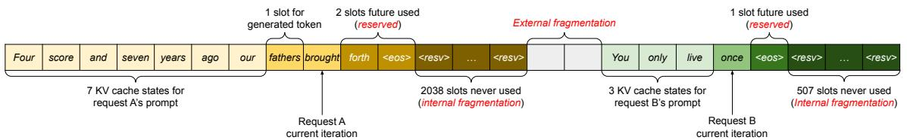  
图3. 现有系统中的KV cache内存管理。存在三种类型的内存浪费——保留、内部碎片和外部碎片——阻止其他请求装入内存。每个内存槽中的令牌代表其KV cache。注意相同令牌在不同位置时可能有不同的KV cache。

# 3 LLM服务中的内存挑战

尽管细粒度批处理减少了计算的浪费，并使请求能够以更灵活的方式进行批处理，但可以一起批处理的请求数量仍然受到GPU内存容量的限制，特别是分配给存储KV cache的空间。换句话说，服务系统的吞吐量受内存限制。克服这种内存限制需要解决内存管理中的以下挑战：

巨大的KV cache。KV cache大小随请求数量迅速增长。例如，对于13B参数的OPT模型[62]，单个令牌的KV cache需要800 KB的空间，计算为2（键和值向量）  $\times$  5120（隐藏状态大小）  $\times$  40（层数）  $\times$  2（每个FP16的字节数）。由于OPT可以生成长达2048个令牌的序列，存储一个请求的KV cache所需的内存可能高达1.6 GB。当前的GPU内存容量为几十GB。即使将所有可用内存都分配给KV cache，也只能容纳几十个请求。此外，低效的内存管理会进一步减少批处理大小，如图2所示。另外，根据当前趋势，GPU的计算速度增长快于内存容量[17]。例如，从NVIDIA A100到H100，FLOPS增加了超过  $2\mathrm{x}$ ，但GPU内存最大保持在80GB。因此，我们相信内存将成为一个日益显著的瓶颈。

复杂的解码算法。LLM服务为用户提供一系列解码算法选择，每种算法对内存管理复杂性有不同的影响。例如，当用户从单个输入提示请求多个随机样本时，这是程序建议[18]中的典型用例，提示部分的KV cache（在我们的实验中占KV cache内存的  $12\%$ ，§6.3）可以共享以最小化内存使用。另一方面，自回归生成阶段的KV cache应保持未共享，因为不同的样本结果及其对上下文和位置的依赖性。KV cache共享的程度取决于所使用的特定解码算法。在更复杂的算法如波束搜索[49]中，不同的请求波束可以共享其KV cache的更大一部分（最多可节省  $55\%$  内存，见§6.3），并且共享模式随着解码过程的推进而演变。

未知输入和输出长度的调度。对LLM服务的请求在其输入和输出长度上表现出变异性。这要求内存管理系统适应广泛的提示长度。此外，随着请求的输出长度在解码过程中增长，其KV cache所需的内存也会扩展，并可能耗尽传入请求或现有提示的持续生成可用内存。系统需要做出调度决策，例如删除或将一些请求的KV cache从GPU内存中换出。

# 3.1 现有系统中的内存管理

由于当前深度学习框架[33, 39]中的大多数算子要求张量存储在连续内存中，先前的LLM服务系统[31, 60]也将一个请求的KV cache存储为跨不同位置的连续张量。由于LLM输出长度的不可预测性，它们根据请求的最大可能序列长度静态分配一块内存，而不考虑请求的实际输入或最终输出长度。

图3说明了两个请求：请求A的最大可能序列长度为2048，请求B的最大为512。现有系统中的块预分配方案有三个主要的内存浪费来源：为未来令牌保留的槽、由于为潜在最大序列长度过度配置导致的内部碎片，以及来自像伙伴分配器这样的内存分配器的外部碎片。外部碎片将永远不会用于生成的令牌，这在服务请求之前就知道。内部碎片也保持未使用，但这仅在请求完成采样后才实现。它们都是纯粹的内存浪费。尽管保留的内存最终被使用，但为整个请求的持续时间保留这个空间，尤其是当保留空间很大时，占用了本可以用于处理其他请求的空间。我们在图2中可视化了实验中内存浪费的平均百分比，揭示先前系统中的实际有效内存可能低至  $20.4\%$ 。

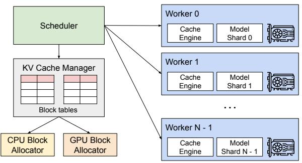  
图4. vLLM系统概述。

尽管压缩[54]已被提出作为碎片的潜在解决方案，但在性能敏感的LLM服务系统中执行压缩是不切实际的，因为KV cache巨大。即使使用压缩，每个请求预分配的块空间也阻止了现有内存管理系统中解码算法特定的内存共享。

# 4 方法

在这项工作中，我们开发了一种新的注意力算法PagedAttention，并构建了一个LLM服务引擎vLLM，以解决§3中概述的挑战。vLLM的架构如图4所示。vLLM采用集中式调度器来协调分布式GPU工作器的执行。KV cache管理器以分页方式有效管理KV cache，由PagedAttention实现。具体来说，KV cache管理器通过集中式调度器发送的指令管理GPU工作器上的物理KV cache内存。

接下来，我们在§4.1中描述PagedAttention算法。在此基础上，我们分别在§4.2中展示KV cache管理器的设计，以及在§4.3中展示它如何促进PagedAttention。然后，我们展示这种设计如何促进各种解码方法的有效内存管理（§4.4）并处理可变长度的输入和输出序列（§4.5）。最后，我们展示vLLM的系统设计如何在分布式设置中工作（§4.6）。

# 4.1 PagedAttention

为了解决§3中的内存挑战，我们引入PagedAttention，一种受操作系统经典分页思想[25]启发的注意力算法。与传统的注意力算法不同，PagedAttention允许将连续的键和值存储在非连续的内存空间中。具体来说，PagedAttention将每个序列的KV cache划分为KV块。每个块包含固定数量令牌的键和值向量，我们将其表示为KV块大小  $(B)$ 。表示键块  $K_{j} = (k_{(j - 1)B + 1},\ldots ,k_{jB})$  和值块  $V_{j} = (v_{(j - 1)B + 1},\dots ,v_{jB})$ 。公式4中的注意力计算可以转换为以下分块计算：

$$
A _ {i j} = \frac {\exp \left(q _ {i} ^ {\top} K _ {j} / \sqrt {d}\right)}{\sum_ {t = 1} ^ {\lceil i / B \rceil} \exp \left(q _ {i} ^ {\top} K _ {t} \mathbf {1} / \sqrt {d}\right)}, o _ {i} = \sum_ {j = 1} ^ {\lceil i / B \rceil} V _ {j} A _ {i j} ^ {\top}, \tag {4}
$$

其中  $A_{ij} = (a_{i,(j-1)B+1}, \ldots, a_{i,jB})$  是第  $j$  个KV块上的注意力分数行向量。

在注意力计算期间，PagedAttention内核单独识别和获取不同的KV块。我们在图5中展示PagedAttention的示例：键和值向量分布在三个块中，这三个块在物理内存上不连续。每次，内核将查询令牌（“forth”）的查询向量  $q_{i}$  和一个块中的键向量  $K_{j}$ （例如，块0的“Four score and seven”的键向量）相乘，以计算注意力分数  $A_{ij}$ ，随后将  $A_{ij}$  与一个块中的值向量  $V_{j}$  相乘以得出最终的注意力输出  $o_{i}$ 。

总之，PagedAttention算法允许KV块存储在非连续的物理内存中，这使得vLLM中能够进行更灵活的分页内存管理。

# 4.2 KV Cache管理器

vLLM内存管理器背后的关键思想类似于操作系统中的虚拟内存[25]。操作系统将内存划分为固定大小的页面，并将用户程序的逻辑页面映射到物理页面。连续的逻辑页面可以对应非连续的物理内存页面，使用户程序能够像访问连续内存一样访问内存。此外，物理内存空间不需要事先完全保留，使操作系统能够根据需要动态分配物理页面。vLLM使用虚拟内存背后的思想来管理LLM服务中的KV cache。通过PagedAttention实现，我们将KV cache组织为固定大小的KV块，就像虚拟内存中的页面一样。

请求的KV cache表示为一系列逻辑KV块，随着新令牌及其KV cache的生成从左到右填充。最后一个KV块的未填充位置为未来的生成保留。在GPU工作器上，块引擎分配一块连续的GPU DRAM，并将其划分为物理KV块（这在CPU RAM上也是如此，用于交换；见§4.5）。KV块管理器还维护块表——每个请求的逻辑和物理KV块之间的映射。每个块表条目记录逻辑块对应的物理块以及填充位置的数量。分离逻辑和物理KV块使vLLM能够动态增长KV cache内存，而无需事先为所有位置保留，这消除了现有系统中的大部分内存浪费，如图2所示。

# 4.3 使用PagedAttention和vLLM进行解码

接下来，我们通过一个示例（如图6所示）演示vLLM如何在单个输入序列的解码过程中执行PagedAttention和管理内存：① 与操作系统的虚拟内存一样，vLLM最初不需要为最大可能的生成序列长度保留内存。相反，它仅保留必要的KV块以容纳提示计算期间生成的KV cache。在这种情况下，提示有7个令牌，因此vLLM将前2个逻辑KV块（0和1）映射到2个物理KV块（分别为7和1）。在预取步骤中，vLLM使用传统的自注意力算法（例如[13]）生成提示和第一个输出令牌的KV cache。vLLM然后将前4个令牌的KV cache存储在逻辑块0中，接下来的3个令牌存储在逻辑块1中。剩余的槽为后续的自回归生成阶段保留。② 在第一个自回归解码步骤中，vLLM使用物理块7和1上的PagedAttention算法生成新令牌。由于最后一个逻辑块中还有一个可用槽，新生成的KV cache存储在那里，并更新块表的#filled记录。③ 在第二个解码步骤中，由于最后一个逻辑块已满，vLLM将新生成的KV cache存储在新的逻辑块中；vLLM为其分配一个新的物理块（物理块3），并将此映射存储在块表中。

全局而言，对于每个解码迭代，vLLM首先选择一组候选序列进行批处理（更多细节见§4.5），并为新需要的逻辑块分配物理块。然后，vLLM将当前迭代的所有输入令牌（即提示阶段请求的所有令牌和生成阶段请求的最新令牌）连接为一个序列，并馈送到LLM中。在LLM计算期间，vLLM使用PagedAttention内核访问以逻辑KV块形式存储的先前KV cache，并将新生成的KV cache保存到物理KV块中。在一个KV块内存储多个令牌（块大小  $>1$ ）使PagedAttention内核能够并行处理更多位置的KV cache，从而提高硬件利用率和减少延迟。然而，更大的块大小也会增加内存碎片。我们在§7.2中研究块大小的影响。

再次，随着更多令牌及其KV cache的生成，vLLM动态地将新的物理块分配给逻辑块。由于所有块从左到右填充，并且只有当所有先前的块都已满时才分配新的物理块，vLLM将一个请求的所有内存浪费限制在一个块内，因此可以有效地利用所有内存，如图2所示。这允许更多请求装入内存进行批处理——从而提高吞吐量。一旦请求完成其生成，其KV块可以被释放以存储其他请求的KV cache。在图7中，我们展示了vLLM管理两个序列内存的示例。两个序列的逻辑块映射到GPU工作器中块引擎保留的空间内的不同物理块。两个序列的相邻逻辑块不需要在物理GPU内存中连续，物理块的空间可以被两个序列有效利用。

# 4.4 其他解码场景的应用

$\S 4.3$  展示了PagedAttention和vLLM如何处理基本解码算法，例如贪婪解码和采样，这些算法将一个用户提示作为输入并生成单个输出序列。在许多成功的LLM应用[18, 34]中，LLM服务必须提供更复杂的解码场景，这些场景表现出复杂的访问模式和更多的内存共享机会。我们在本节展示vLLM在它们身上的普遍适用性。

并行采样。在基于LLM的程序助手[6, 18]中，LLM为单个输入提示生成多个采样输出；用户可以从各种候选中选择最喜欢的输出。到目前为止，我们隐式假设一个请求生成单个序列。在本文的剩余部分，我们假设更一般的情况，即一个请求生成多个序列。在并行采样中，一个请求包括共享相同输入提示的多个样本，允许提示的KV cache也共享。通过其PagedAttention和分页内存管理，vLLM可以轻松实现这种共享并节省内存。

图8显示了两个输出的并行解码示例。由于两个输出共享相同的提示，我们仅在提示阶段为提示状态保留一个副本的空间；两个序列提示的逻辑块都映射到相同的物理块：两个序列的逻辑块0和1分别映射到物理块7和1。由于单个物理块可以映射到多个逻辑块，我们为每个物理块引入一个引用计数。在这种情况下，物理块7和1的引用计数均为2。在生成阶段，两个输出采样不同的输出令牌，需要单独的KV cache存储。vLLM在块粒度上为需要被多个序列修改的物理块实现写时复制机制，类似于OS虚拟内存中的写时复制技术（例如，在fork进程时）。具体来说，在图8中，当样本A1需要写入其最后一个逻辑块（逻辑块1）时，vLLM识别到相应物理块（物理块1）的引用计数大于1；它分配一个新的物理块（物理块3），指示块引擎从物理块1复制信息，并将引用计数减少到1。接下来，当样本A2写入物理块1时，引用计数已减少到1；因此A2直接将其新生成的KV cache写入物理块1。

总之，vLLM实现了跨多个输出样本共享大部分用于存储提示KV cache的空间，除了最后的逻辑块，该块由写时复制机制管理。通过在多个样本之间共享物理块，可以大大减少内存使用，特别是对于长输入提示。

波束搜索。在LLM任务如机器翻译[59]中，用户期望LLM输出最合适的  $k$  个翻译。波束搜索[49]被广泛用于从LLM解码最可能的输出序列，因为它减轻了完全遍历样本空间的计算复杂性。该算法依赖于波束宽度参数  $k$ ，它决定每一步保留的顶级候选数量。在解码过程中，波束搜索通过考虑所有可能的令牌来扩展波束中的每个候选序列，使用LLM计算它们各自的概率，并保留  $k \cdot |V|$  个候选中的前  $k$  个最可能序列，其中  $|V|$  是词汇表大小。

与并行解码不同，波束搜索不仅促进初始提示块的共享，还促进不同候选之间其他块的共享，并且随着解码过程的推进，共享模式动态变化，类似于OS中由复合fork创建的进程树。图9显示了vLLM如何管理波束搜索示例的KV块，其中  $k = 4$ 。在虚线所示的迭代之前，每个候选序列已使用了4个完整的逻辑块。所有波束候选共享第一个块0（即提示）。候选3从第二个块开始与其他候选分叉。候选0-2共享前3个块，在第四块分叉。在后续迭代中，前4个最可能的候选都源自候选1和2。由于原始候选0和3不再属于顶级候选，它们的逻辑块被释放，相应物理块的引用计数减少。vLLM释放所有引用计数达到0的物理块（块2、4、5、8）。然后，vLLM分配新的物理块（块9-12）来存储来自新候选的新KV cache。现在，所有候选共享块0、1、3；候选0和1共享块6，候选2和3进一步共享块7。

先前的LLM服务系统需要频繁地在波束候选之间复制KV cache。例如，在图9所示的情况下，在虚线之后，候选3需要复制候选2的大部分KV cache以继续生成。vLLM的物理块共享显著减少了这种频繁的内存复制开销。在vLLM中，不同波束候选的大多数块可以共享。写时复制机制仅当新生成的令牌位于旧的共享块内时应用，如在并行解码中。这仅涉及复制一个块的数据。

共享前缀。通常，LLM用户提供（长）任务描述，包括指令和示例输入输出，也称为系统提示[36]。该描述与实际任务输入连接形成请求的提示。LLM基于完整提示生成输出。图10显示了一个示例。此外，可以通过提示工程进一步调整共享前缀，以提高下游任务的准确性[26, 27]。

对于这种类型的应用，许多用户提示共享一个前缀，因此LLM服务提供商可以预先存储前缀的KV cache，以减少花费在前缀上的冗余计算。在vLLM中，这可以通过为LLM服务提供商预定义的一组共享前缀保留一组物理块来方便地实现，就像OS处理进程间的共享库一样。具有共享前缀的用户输入提示可以简单地将其逻辑块映射到缓存的物理块（最后一块标记为写时复制）。提示阶段计算只需要在用户的任务输入上执行。

混合解码方法。前面讨论的解码方法表现出多样的内存共享和访问模式。尽管如此，vLLM促进了同时处理具有不同解码偏好的请求，而现有系统无法高效做到这一点。这是因为vLLM通过一个将逻辑块转换为物理块的公共映射层隐藏了不同序列之间的复杂内存共享。LLM及其执行内核只看到每个序列的物理块ID列表，不需要处理跨序列的共享模式。与现有系统相比，这种方法拓宽了具有不同采样要求的请求的批处理机会，最终提高了系统的整体吞吐量。

# 4.5 调度和抢占

当请求流量超过系统容量时，vLLM必须优先处理一部分请求。在vLLM中，我们对所有请求采用先到先服务（FCFS）调度策略，确保公平性并防止饥饿。当vLLM需要抢占请求时，它确保最先到达的请求首先被服务，最新的请求首先被抢占。

LLM服务面临一个独特的挑战：LLM的输入提示长度可能差异很大，并且输出长度是事先未知的，取决于输入提示和模型。随着请求数量及其输出的增长，vLLM可能会耗尽GPU的物理块来存储新生成的KV cache。在此背景下，vLLM需要回答两个经典问题：（1）应该驱逐哪些块？（2）如果需要再次使用，如何恢复被驱逐的块？通常，驱逐策略使用启发式方法来预测哪个块将在未来最远的时间被访问并驱逐该块。由于在我们的情况下我们知道一个序列的所有块是一起访问的，我们实现了一种全有或全无的驱逐策略，即要么驱逐一个序列的所有块，要么一个都不驱逐。此外，一个请求内的多个序列（例如，一个波束搜索请求中的波束候选）作为序列组进行组调度。一个序列组内的序列总是被一起抢占或重新调度，因为这些序列之间可能存在内存共享。为了回答如何恢复被驱逐块的第二个问题，我们考虑两种技术：

交换。这是大多数虚拟内存实现使用的经典技术，将驱逐的页面复制到磁盘上的交换空间。在我们的情况下，我们将驱逐的块复制到CPU内存。如图4所示，除了GPU块分配器，vLLM还包括一个CPU块分配器来管理交换到CPU RAM的物理块。当vLLM为新令牌耗尽空闲物理块时，它选择一组序列进行驱逐，并将它们的KV cache传输到CPU。一旦它抢占一个序列并驱逐其块，vLLM停止接受新请求，直到所有被抢占的序列完成。一旦请求完成，其块从内存中释放，被抢占序列的块被带回以继续处理该序列。请注意，通过这种设计，交换到CPU RAM的块数永远不会超过GPU RAM中的总物理块数，因此CPU RAM上的交换空间受限于为KV cache分配的GPU内存。

全局而言，对于每个解码迭代，vLLM首先选择一组候选序列进行批处理（更多细节见§4.5），并为新需要的逻辑块分配物理块。然后，vLLM将当前迭代的所有输入令牌（即提示阶段请求的所有令牌和生成阶段请求的最新令牌）连接为一个序列，并馈送到LLM中。在LLM计算期间，vLLM使用PagedAttention内核访问以逻辑KV块形式存储的先前KV cache，并将新生成的KV cache保存到物理KV块中。在一个KV块内存储多个令牌（块大小 $>1$ ）使PagedAttention内核能够并行处理更多位置的KV cache，从而提高硬件利用率和减少延迟。然而，更大的块大小也会增加内存碎片。我们在§7.2中研究块大小的影响。

再次，随着更多令牌及其KV cache的生成，vLLM动态地将新的物理块分配给逻辑块。由于所有块从左到右填充，并且只有当所有先前的块都已满时才分配新的物理块，vLLM将一个请求的所有内存浪费限制在一个块内，因此可以有效地利用所有内存，如图2所示。这允许更多请求装入内存进行批处理——从而提高吞吐量。一旦请求完成其生成，其KV块可以被释放以存储其他请求的KV cache。在图7中，我们展示了vLLM管理两个序列内存的示例。两个序列的逻辑块映射到GPU工作器中块引擎保留的空间内的不同物理块。两个序列的相邻逻辑块不需要在物理GPU内存中连续，物理块的空间可以被两个序列有效利用。

# 4.4 其他解码场景的应用

$\S 4.3$ 展示了PagedAttention和vLLM如何处理基本解码算法，例如贪婪解码和采样，这些算法将一个用户提示作为输入并生成单个输出序列。在许多成功的LLM应用[18, 34]中，LLM服务必须提供更复杂的解码场景，这些场景表现出复杂的访问模式和更多的内存共享机会。我们在本节展示vLLM在它们身上的普遍适用性。

并行采样。在基于LLM的程序助手[6, 18]中，LLM为单个输入提示生成多个采样输出；用户可以从各种候选中选择最喜欢的输出。到目前为止，我们隐式假设一个请求生成单个序列。在本文的剩余部分，我们假设更一般的情况，即一个请求生成多个序列。在并行采样中，一个请求包括共享相同输入提示的多个样本，允许提示的KV cache也共享。通过其PagedAttention和分页内存管理，vLLM可以轻松实现这种共享并节省内存。

图8显示了两个输出的并行解码示例。由于两个输出共享相同的提示，我们仅在提示阶段为提示状态保留一个副本的空间；两个序列提示的逻辑块都映射到相同的物理块：两个序列的逻辑块0和1分别映射到物理块7和1。由于单个物理块可以映射到多个逻辑块，我们为每个物理块引入一个引用计数。在这种情况下，物理块7和1的引用计数均为2。在生成阶段，两个输出采样不同的输出令牌，需要单独的KV cache存储。vLLM在块粒度上为需要被多个序列修改的物理块实现写时复制机制，类似于OS虚拟内存中的写时复制技术（例如，在fork进程时）。具体来说，在图8中，当样本A1需要写入其最后一个逻辑块（逻辑块1）时，vLLM识别到相应物理块（物理块1）的引用计数大于1；它分配一个新的物理块（物理块3），指示块引擎从物理块1复制信息，并将引用计数减少到1。接下来，当样本A2写入物理块1时，引用计数已减少到1；因此A2直接将其新生成的KV cache写入物理块1。

总之，vLLM实现了跨多个输出样本共享大部分用于存储提示KV cache的空间，除了最后的逻辑块，该块由写时复制机制管理。通过在多个样本之间共享物理块，可以大大减少内存使用，特别是对于长输入提示。

波束搜索。在LLM任务如机器翻译[59]中，用户期望LLM输出最合适的 $k$ 个翻译。波束搜索[49]被广泛用于从LLM解码最可能的输出序列，因为它减轻了完全遍历样本空间的计算复杂性。该算法依赖于波束宽度参数 $k$ ，它决定每一步保留的顶级候选数量。在解码过程中，波束搜索通过考虑所有可能的令牌来扩展波束中的每个候选序列，使用LLM计算它们各自的概率，并保留 $k \cdot |V|$ 个候选中的前 $k$ 个最可能序列，其中 $|V|$ 是词汇表大小。

与并行解码不同，波束搜索不仅促进初始提示块的共享，还促进不同候选之间其他块的共享，并且随着解码过程的推进，共享模式动态变化，类似于OS中由复合fork创建的进程树。图9显示了vLLM如何管理波束搜索示例的KV块，其中 $k = 4$ 。在虚线所示的迭代之前，每个候选序列已使用了4个完整的逻辑块。所有波束候选共享第一个块0（即提示）。候选3从第二个块开始与其他候选分叉。候选0-2共享前3个块，在第四块分叉。在后续迭代中，前4个最可能的候选都源自候选1和2。由于原始候选0和3不再属于顶级候选，它们的逻辑块被释放，相应物理块的引用计数减少。vLLM释放所有引用计数达到0的物理块（块2、4、5、8）。然后，vLLM分配新的物理块（块9-12）来存储来自新候选的新KV cache。现在，所有候选共享块0、1、3；候选0和1共享块6，候选2和3进一步共享块7。

先前的LLM服务系统需要频繁地在波束候选之间复制KV cache。例如，在图9所示的情况下，在虚线之后，候选3需要复制候选2的大部分KV cache以继续生成。vLLM的物理块共享显著减少了这种频繁的内存复制开销。在vLLM中，不同波束候选的大多数块可以共享。写时复制机制仅当新生成的令牌位于旧的共享块内时应用，如在并行解码中。这仅涉及复制一个块的数据。

共享前缀。通常，LLM用户提供（长）任务描述，包括指令和示例输入输出，也称为系统提示[36]。该描述与实际任务输入连接形成请求的提示。LLM基于完整提示生成输出。图10显示了一个示例。此外，可以通过提示工程进一步调整共享前缀，以提高下游任务的准确性[26, 27]。

对于这种类型的应用，许多用户提示共享一个前缀，因此LLM服务提供商可以预先存储前缀的KV cache，以减少花费在前缀上的冗余计算。在vLLM中，这可以通过为LLM服务提供商预定义的一组共享前缀保留一组物理块来方便地实现，就像OS处理进程间的共享库一样。具有共享前缀的用户输入提示可以简单地将其逻辑块映射到缓存的物理块（最后一块标记为写时复制）。提示阶段计算只需要在用户的任务输入上执行。

混合解码方法。前面讨论的解码方法表现出多样的内存共享和访问模式。尽管如此，vLLM促进了同时处理具有不同解码偏好的请求，而现有系统无法高效做到这一点。这是因为vLLM通过一个将逻辑块转换为物理块的公共映射层隐藏了不同序列之间的复杂内存共享。LLM及其执行内核只看到每个序列的物理块ID列表，不需要处理跨序列的共享模式。与现有系统相比，这种方法拓宽了具有不同采样要求的请求的批处理机会，最终提高了系统的整体吞吐量。

# 4.5 调度和抢占

当请求流量超过系统容量时，vLLM必须优先处理一部分请求。在vLLM中，我们对所有请求采用先到先服务（FCFS）调度策略，确保公平性并防止饥饿。当vLLM需要抢占请求时，它确保最先到达的请求首先被服务，最新的请求首先被抢占。

LLM服务面临一个独特的挑战：LLM的输入提示长度可能差异很大，并且输出长度是事先未知的，取决于输入提示和模型。随着请求数量及其输出的增长，vLLM可能会耗尽GPU的物理块来存储新生成的KV cache。在此背景下，vLLM需要回答两个经典问题：（1）应该驱逐哪些块？（2）如果需要再次使用，如何恢复被驱逐的块？通常，驱逐策略使用启发式方法来预测哪个块将在未来最远的时间被访问并驱逐该块。由于在我们的情况下我们知道一个序列的所有块是一起访问的，我们实现了一种全有或全无的驱逐策略，即要么驱逐一个序列的所有块，要么一个都不驱逐。此外，一个请求内的多个序列（例如，一个波束搜索请求中的波束候选）作为序列组进行组调度。一个序列组内的序列总是被一起抢占或重新调度，因为这些序列之间可能存在内存共享。为了回答如何恢复被驱逐块的第二个问题，我们考虑两种技术：

交换。这是大多数虚拟内存实现使用的经典技术，将驱逐的页面复制到磁盘上的交换空间。在我们的情况下，我们将驱逐的块复制到CPU内存。如图4所示，除了GPU块分配器，vLLM还包括一个CPU块分配器来管理交换到CPU RAM的物理块。当vLLM为新令牌耗尽空闲物理块时，它选择一组序列进行驱逐，并将它们的KV cache传输到CPU。一旦它抢占一个序列并驱逐其块，vLLM停止接受新请求，直到所有被抢占的序列完成。一旦请求完成，其块从内存中释放，被抢占序列的块被带回以继续处理该序列。请注意，通过这种设计，交换到CPU RAM的块数永远不会超过GPU RAM中的总物理块数，因此CPU RAM上的交换空间受限于为KV cache分配的GPU内存。

重新计算。在这种情况下，当被抢占的序列重新调度时，我们简单地重新计算KV cache。请注意，重新计算的延迟可能显著低于原始延迟，因为在解码时生成的令牌可以与原始用户提示连接作为新提示——它们在所有位置的KV cache可以在一个提示阶段迭代中生成。

交换和重新计算的性能取决于CPU RAM和GPU内存之间的带宽以及GPU的计算能力。我们在§7.3中检查交换和重新计算的速度。

# 4.6 分布式执行

许多LLM的参数大小超过了单个GPU的容量[5, 9]。因此，有必要将它们分区到分布式GPU上并以模型并行的方式执行[28, 63]。这需要一个能够处理分布式内存的内存管理器。vLLM通过支持Transformers上广泛使用的Megatron-LM风格张量模型并行策略[47]，在分布式设置中有效。该策略遵循SPMD（单程序多数据）执行计划，其中线性层被分区

表1. 模型大小和服务器配置。  

<table><tr><td>模型大小</td><td>13B</td><td>66B</td><td>175B</td></tr><tr><td>GPU</td><td>A100</td><td>4×A100</td><td>8×A100-80GB</td></tr><tr><td>总GPU内存</td><td>40 GB</td><td>160 GB</td><td>640 GB</td></tr><tr><td>参数大小</td><td>26 GB</td><td>132 GB</td><td>346 GB</td></tr><tr><td>KV cache内存</td><td>12 GB</td><td>21 GB</td><td>264 GB</td></tr><tr><td>最大KV cache槽数</td><td>15.7K</td><td>9.7K</td><td>60.1K</td></tr></table>

以执行分块矩阵乘法，并且GPU通过allreduce操作不断同步中间结果。具体来说，注意力算子按注意力头维度分割，每个SPMD进程负责多头注意力中的一部分注意力头。

我们观察到，即使使用模型并行执行，每个模型分片仍然处理相同的输入令牌集，因此需要相同位置的KV cache。因此，vLLM在集中式调度器中包含一个单一的KV cache管理器，如图4所示。不同的GPU工作器共享该管理器，以及从逻辑块到物理块的映射。这种公共映射允许GPU工作器使用调度器为每个输入请求提供的物理块执行模型。虽然每个GPU工作器具有相同的物理块ID，但一个工作器仅存储其对应注意力头的KV cache的一部分。

在每个步骤中，调度器首先为批次中每个请求准备包含输入令牌ID的消息，以及每个请求的块表。接下来，调度器将此控制消息广播到GPU工作器。然后，GPU工作器开始使用输入令牌ID执行模型。在注意力层中，GPU工作器根据控制消息中的块表读取KV cache。在执行过程中，GPU工作器使用all-reduce通信原语同步中间结果，无需调度器的协调，如[47]所述。最后，GPU工作器将此迭代的采样令牌发送回调度器。总之，GPU工作器无需在内存管理上同步，因为它们只需要在每个解码迭代开始时接收所有内存管理信息以及步骤输入。

# 5 实现

vLLM是一个具有FastAPI [15]前端和基于GPU的推理引擎的端到端服务系统。前端扩展了OpenAI API [34]接口，允许用户为每个请求自定义采样参数，例如最大序列长度和波束宽度  $k$ 。vLLM引擎用8.5K行Python和2K行C++/CUDA代码编写。我们使用Python开发控制相关组件，包括调度器和块管理器，同时为关键操作（如PagedAttention）开发自定义CUDA内核。对于模型执行器，我们使用

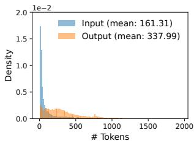  
(a) ShareGPT

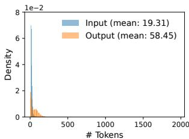  
(b) Alpaca  
图11. (a) ShareGPT和(b) Alpaca数据集的输入和输出长度分布。

PyTorch [39]和Transformers [58]实现流行的LLM，如GPT [5]、OPT [62]和LLaMA [52]。我们使用NCCL [32]在分布式GPU工作器之间进行张量通信。

# 5.1 内核级优化

由于PagedAttention引入了现有系统未高效支持的内存访问模式，我们开发了几个GPU内核来优化它。(1) 融合的reshape和块写入。在每个Transformer层中，新的KV cache被分割成块，reshape为针对块读取优化的内存布局，然后保存在块表指定的位置。为了最小化内核启动开销，我们将它们融合到单个内核中。(2) 融合块读取和注意力。我们调整FasterTransformer [31]中的注意力内核，使其根据块表读取KV cache并即时执行注意力操作。为了确保合并的内存访问，我们分配一个GPU warp来读取每个块。此外，我们增加了对请求批次内可变序列长度的支持。(3) 融合的块复制。写时复制机制发出的块复制操作可能在不连续的块上运行。如果我们使用CUDAMemcpyAsync API，这可能导致大量小数据移动的调用。为了减轻开销，我们实现了一个内核，将不同块的复制操作批处理到单个内核启动中。

# 5.2 支持各种解码算法

vLLM使用三个关键方法实现各种解码算法：fork、append和free。fork方法从现有序列创建新序列。append方法将新令牌附加到序列。最后，free方法删除序列。例如，在并行采样中，vLLM使用fork方法从单个输入序列创建多个输出序列。然后它在每次迭代中使用append向这些序列添加新令牌，并使用free删除满足停止条件的序列。相同的策略也应用于vLLM中的波束搜索和前缀共享。我们相信未来的解码算法也可以通过组合这些方法来支持。

# 6 评估

在本节中，我们在各种工作负载下评估vLLM的性能。

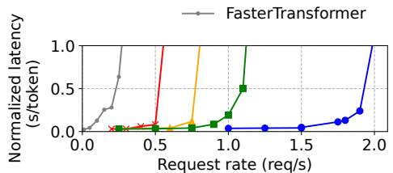  
(a) OPT-13B, 1 GPU, ShareGPT

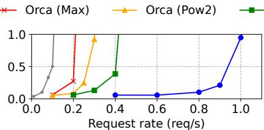  
(b) OPT-66B, 4 GPUs, ShareGPT

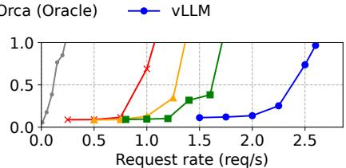  
(c) OPT-175B, 8 GPUs, ShareGPT

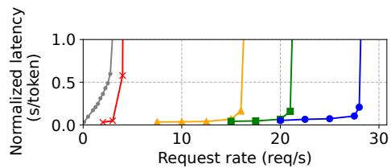  
(d) OPT-13B, 1 GPU, Alpaca

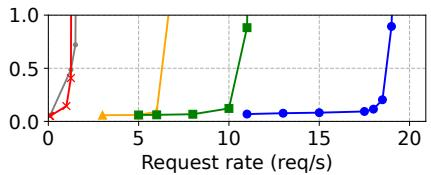  
(e) OPT-66B, 4 GPUs, Alpaca

  
(f) OPT-175B, 8 GPUs, Alpaca

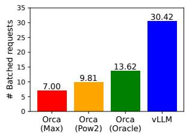  
(a) ShareGPT  
图13. 为ShareGPT (2 reqs/s)和Alpaca (30 reqs/s)追踪服务OPT-13B时的平均批处理请求数。

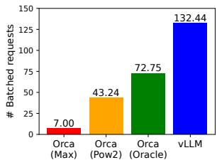  
图12. 在ShareGPT和Alpaca数据集上使用OPT模型的单序列生成  
(b) Alpaca

# 6.1 实验设置

模型和服务器配置。我们使用13B、66B和175B参数的OPT [62]模型和13B参数的LLaMA [52]进行评估。13B和66B是LLM的流行大小，如LLM排行榜[38]所示，而175B是著名的GPT-3 [5]模型的大小。对于我们所有的实验，我们使用Google Cloud Platform上带有NVIDIA A100 GPU的A2实例。详细的模型大小和服务器配置如表1所示。

工作负载。我们基于ShareGPT [51]和Alpaca [50]数据集合成工作负载，这些数据集包含真实LLM服务的输入和输出文本。ShareGPT数据集是用户与ChatGPT [35]分享的对话集合。Alpaca数据集是由GPT-3.5使用self-instruct [57]生成的指令数据集。我们对数据集进行令牌化，并使用其输入和输出长度合成客户端请求。如图11所示，ShareGPT数据集的输入提示平均比Alpaca数据集长  $8.4 \times$ ，输出平均长  $5.8 \times$ ，方差更高。由于这些数据集不包含时间戳，我们使用泊松分布以不同的请求率生成请求到达时间。

基线1: FasterTransformer。FasterTransformer [31]是一个针对延迟高度优化的分布式推理引擎。由于FasterTransformer没有自己的调度器，我们实现了一个具有动态批处理机制的自定义调度器，类似于现有的服务系统如Triton [30]。具体来说，我们根据GPU内存容量为每个实验设置尽可能大的最大批处理大小  $B$ 。调度器获取最多  $B$  个最早到达的请求，并将批次发送到FasterTransformer进行处理。

基线2: Orca。Orca [60]是一个针对吞吐量优化的最先进LLM服务系统。由于Orca不公开可用，我们实现了自己的Orca版本。我们假设Orca使用伙伴分配算法来确定存储KV cache的内存地址。我们基于其过度保留请求输出空间的程度实现了三个版本的Orca：

- Orca (Oracle)。我们假设系统知道请求将实际生成的输出长度。这显示了Orca的上限性能，在实践中是不可行的。  
- Orca (Pow2)。我们假设系统最多过度保留  $2 \times$  的输出空间。例如，如果真实输出长度为25，则为输出保留32个位置。  
- Orca (Max)。我们假设系统始终为模型的最大序列长度保留空间，即2048个令牌。

关键指标。我们关注服务吞吐量。具体来说，使用不同请求率的工作负载，我们测量系统的归一化延迟，即每个请求的端到端延迟除以其输出长度的平均值，如Orca [60]所述。一个高吞吐量的服务系统应在高请求率下保持较低的归一化延迟。对于大多数实验，我们使用1小时追踪评估系统。作为例外，由于成本限制，我们对OPT-175B模型使用15分钟追踪。

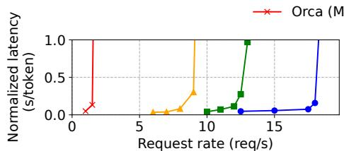  
(a) 并行生成（并行大小  $= 2$ ）

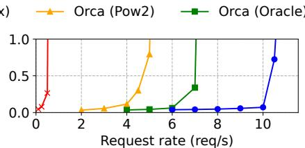  
(b) 并行生成（并行大小  $= 4$ ）

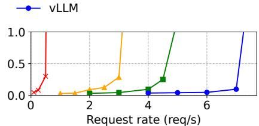  
(c) 并行生成（并行大小  $= 6$ ）

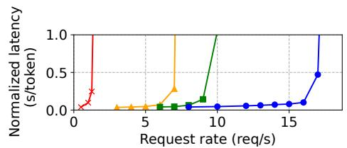  
(d) 波束搜索（波束宽度  $= 2$ ）

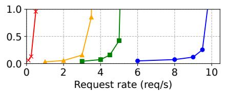  
(e) 波束搜索（波束宽度  $= 4$ ）

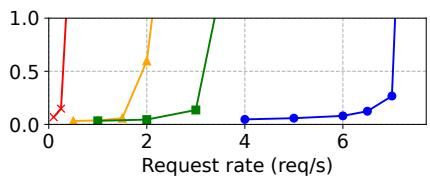  
(f) 波束搜索（波束宽度  $= 6$ ）

# 6.2 基本采样

我们在三个模型和两个数据集上使用基本采样（每个请求一个样本）评估vLLM的性能。图12的第一行显示了ShareGPT数据集上的结果。曲线说明随着请求率的增加，延迟最初以渐进的步伐增加，然后突然爆发。这可以归因于当请求率超过服务系统的容量时，队列长度继续无限增长，请求的延迟也随之增加。

在ShareGPT数据集上，vLLM可以维持比Orca (Oracle)高  $1.7 \times -2.7 \times$ 的请求率，比Orca (Max)高  $2.7 \times -8 \times$ 的请求率，同时保持类似的延迟。这是因为vLLM的PagedAttention可以有效地管理内存使用，从而比Orca能够批处理更多请求。例如，如图13a所示，对于OPT-13B，vLLM同时处理的请求比Orca (Oracle)多  $2.2 \times$ ，比Orca (Max)多  $4.3 \times$ 。与FasterTransformer相比，vLLM可以维持高达  $22 \times$ 的请求率，因为FasterTransformer不使用细粒度调度机制，并且像Orca (Max)一样低效地管理内存。

图12的第二行和图13b显示了Alpaca数据集上的结果，其趋势与ShareGPT数据集类似。一个例外是图12 (f)，其中vLLM相对于Orca (Oracle)和Orca (Pow2)的优势不那么明显。这是因为OPT-175B的模型和服务器配置（表1）允许大量GPU内存空间用于存储KV cache，而Alpaca数据集具有短序列。在此设置中，尽管内存管理效率低下，Orca (Oracle)和Orca (Pow2)也可以批处理大量请求。因此，系统的性能变得受计算限制而非内存限制。

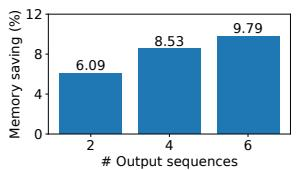  
图14. 在Alpaca数据集上使用OPT-13B进行并行生成和波束搜索。  
(a) 并行采样  
图15. 当为Alpaca追踪服务OPT-13B时，通过共享KV块实现的平均内存节省量。

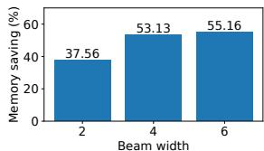  
(b) 波束搜索

# 6.3 并行采样和波束搜索

我们使用两种流行的采样方法评估PagedAttention中内存共享的有效性：并行采样和波束搜索。在并行采样中，请求中的所有并行序列可以共享提示的KV cache。如图14的第一行所示，随着采样序列数量的增加，vLLM相对于Orca基线的改进更大。类似地，图14的第二行显示了不同波束宽度的波束搜索结果。由于波束搜索允许更多共享，vLLM展示了更大的性能优势。vLLM相对于Orca (Oracle)在OPT-13B和Alpaca数据集上的改进从基本采样中的  $1.3 \times$ 增加到波束搜索宽度为6时的  $2.3 \times$ 。

图15绘制了内存节省量，通过共享节省的块数除以未共享的总块数计算。我们在并行采样上显示  $6.1\% - 9.8\%$ 的内存节省，在波束搜索上显示  $37.6\% - 55.2\%$ 的内存节省。在相同实验中使用ShareGPT数据集，我们在并行采样上看到  $16.2\% - 30.5\%$ 的内存节省，在波束搜索上看到  $44.3\% - 66.3\%$ 的内存节省。

# 6.4 共享前缀

我们探索了vLLM在如图10所示的前缀在不同输入提示之间共享的情况下的有效性。对于模型，我们使用多语言的LLaMA-13B [52]。对于工作负载，我们使用WMT16 [4]英德翻译数据集，并合成两个包含指令和一些翻译示例的前缀。第一个前缀包含一个示例（即单样本），而另一个前缀包含5个示例（即少样本）。如图16 (a)所示，当共享单样本前缀时，vLLM实现了比Orca (Oracle)高  $1.67 \times$ 的吞吐量。此外，当共享更多示例时（图16 (b)），vLLM实现了比Orca (Oracle)高  $3.58 \times$ 的吞吐量。

# 6.5 聊天机器人

聊天机器人[8, 19, 35]是LLM最重要的应用之一。为了实现聊天机器人，我们让模型通过将聊天历史和最后一个用户查询连接到提示中来生成响应。我们使用ShareGPT数据集合成聊天历史和用户查询。由于OPT-13B模型的上下文长度有限，我们将提示截断到最后1024个令牌，并让模型最多生成1024个令牌。我们不存储不同对话轮次之间的KV cache，因为这样做会占用对话轮次之间其他请求的空间。

图17显示，vLLM可以维持比三个Orca基线高  $2 \times$ 的请求率。由于ShareGPT数据集包含许多长对话，大多数请求的输入提示有1024个令牌。由于伙伴分配算法，Orca基线为请求输出保留1024个令牌的空间，无论它们如何预测输出长度。因此，三个Orca基线行为相似。相比之下，vLLM可以有效地

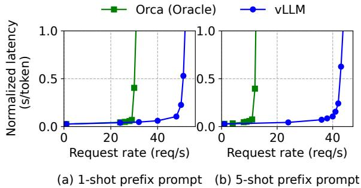  
图16. 输入提示共享共同前缀的翻译工作负载。前缀包括(a) 1个示例，80个令牌或(b) 5个示例，341个令牌。

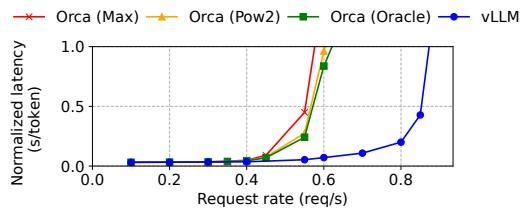  
图17. 聊天机器人工作负载的性能。

处理长提示，因为PagedAttention解决了内存碎片化和保留的问题。

# 7 消融研究

在本节中，我们研究vLLM的各个方面，并通过消融实验评估我们的设计选择。

# 7.1 内核微基准测试

PagedAttention中的动态块映射影响涉及存储KV cache的GPU操作的性能，即块读/写和注意力。与现有系统相比，我们的GPU内核（§5）涉及访问块表、执行额外分支和处理可变序列长度的额外开销。如图18a所示，与高度优化的FasterTransformer实现相比，这导致注意力内核延迟高  $20 - 26\%$ 。我们认为开销很小，因为它只影响注意力算子而不影响模型中的其他算子，如Linear。尽管存在开销，但PagedAttention使vLLM在端到端性能上显著优于FasterTransformer（§6）。

# 7.2 块大小的影响

块大小的选择可能对vLLM的性能产生重大影响。如果块大小太小，vLLM可能无法充分利用GPU的并行性来读取和处理KV cache。如果块大小太大，内部碎片增加，共享概率降低。

在图18b中，我们使用固定请求率下的ShareGPT和Alpaca追踪以及基本采样，评估了具有不同块大小的vLLM的性能。在ShareGPT追踪中，块大小从16到128导致最佳性能。在Alpaca追踪中，虽然块大小16和32效果良好，但更大的块大小会显著降低性能，因为序列变得比块大小短。在实践中，我们发现块大小16足够大以有效利用GPU，并且足够小以避免在大多数工作负载中出现显著的内部碎片。因此，vLLM将其默认块大小设置为16。

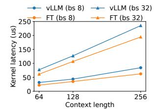  
(a) 注意力内核的延迟。

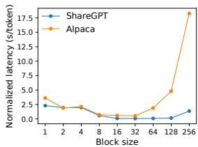  
(b) 不同块大小下的端到端延迟。  
图18. 消融实验。

# 7.3 重新计算与交换的比较

vLLM支持重新计算和交换作为其恢复机制。为了理解两种方法之间的权衡，我们评估了它们的端到端性能，并微基准测试了它们的开销，如图19所示。我们的结果显示，交换在小块大小时会产生过多的开销。这是因为小块大小通常导致CPU和GPU之间大量的小数据传输，这限制了有效的PCIe带宽。相比之下，重新计算的开销在不同块大小下保持不变，因为重新计算不使用KV块。因此，当块大小较小时，重新计算更高效，而当块大小较大时，交换更高效，尽管重新计算的开销从不高于交换延迟的  $20\%$ 。对于中等块大小从16到64，两种方法表现出相当的端到端性能。

# 8 讨论

将虚拟内存和分页技术应用于其他GPU工作负载。虚拟内存和分页的思想对于管理LLM服务中的KV cache是有效的，因为工作负载需要动态内存分配（因为输出长度事先未知），并且其性能受GPU内存容量的限制。然而，这通常不适用于每个GPU工作负载。例如，在DNN训练中，张量形状通常是静态的，因此可以提前优化内存分配。另一个例子是，在服务不是LLM的DNN时，内存效率的提高可能不会导致任何性能改进，因为性能主要受计算限制。在这种情况下，引入vLLM的技术可能反而会由于内存间接寻址和非连续块内存的额外开销而降低性能。然而，我们很高兴看到vLLM的技术被应用于具有类似于LLM服务特性的其他工作负载。

在应用虚拟内存和分页时的LLM特定优化。vLLM通过利用特定于应用程序的语义重新解释并增强了虚拟内存和分页的思想。一个例子是vLLM的全有或全无的换出策略，该策略利用了一个事实：处理请求需要其所有对应的令牌状态存储在GPU内存中。另一个例子是用于恢复驱逐块的重新计算方法，这在操作系统中是不可行的。此外，vLLM通过将内存访问操作的GPU内核与其他操作（如注意力）的内核融合，减轻了分页中内存间接寻址的开销。

# 9 相关工作

通用模型服务系统。模型服务近年来一直是活跃的研究领域，许多系统被提出来解决深度学习模型部署的各个方面。Clipper [11]、TensorFlow Serving [33]、Nexus [45]、InferLine [10]和Clockwork [20]是一些早期的通用模型服务系统。它们研究用于服务单个或多个模型的批处理、缓存、放置和调度。最近，DVABatch [12]引入了多入口多出口批处理。REEF [21]和Shepherd [61]提出了服务中的抢占。AlpaServe [28]利用模型并行实现统计多路复用。然而，这些通用系统未能考虑LLM推理的自回归特性和令牌状态，导致优化机会的缺失。

专门用于Transformer的服务系统。由于Transformer架构的重要性，已经开发了许多专门用于它的服务系统。这些系统利用GPU内核优化[1, 29, 31, 56]、高级批处理机制[14, 60]、模型并行[1, 41, 60]和参数共享[64]来实现高效服务。其中，Orca [60]与我们的方法最相关。

与Orca的比较。Orca [60]中的迭代级调度和vLLM中的PagedAttention是互补的技术：虽然两个系统都旨在提高GPU利用率，从而提高LLM服务的吞吐量，但Orca通过调度和交错请求来实现，以便可以并行处理更多请求，而vLLM通过增加内存利用率来实现，以便更多请求的工作集可以装入内存。通过减少内存碎片和启用共享，vLLM在批次中并行运行更多请求，并实现比Orca快  $2 - 4 \times$ 的速度。实际上，像Orca中那样对请求进行细粒度调度和交错使内存管理更具挑战性，使得vLLM中提出的技术更加关键。

内存优化。加速器的计算能力和内存容量之间不断扩大的差距使得内存成为训练和推理的瓶颈。交换[23, 42, 55]、重新计算[7, 24]及其组合[40]已被用于减少训练的峰值内存。值得注意的是，FlexGen [46]研究了如何在有限的GPU内存下为LLM推理交换权重和令牌状态，但它不针对在线服务设置。OLLA [48]优化张量的生命周期和位置以减少碎片，但它不做细粒度的块级管理或在线服务。FlashAttention [13]应用平铺和内核优化以减少注意力计算的峰值内存并减少I/O成本。本文在在线服务的背景下引入了块级内存管理的新思想。

# 10 结论

本文提出了PagedAttention，一种新的注意力算法，允许注意力键和值存储在非连续的分页内存中，并介绍了vLLM，一个通过PagedAttention实现高效内存管理的高吞吐量LLM服务系统。受操作系统启发，我们展示了如何将现有技术（如虚拟内存和写时复制）进行调整，以高效管理KV cache并处理LLM服务中的各种解码算法。我们的实验表明，vLLM实现了比最先进系统高  $2 - 4\times$ 的吞吐量改进。

# 致谢

我们要感谢Xiaoxuan Liu、Zhifeng Chen、Yanping Huang、匿名SOSP审稿人以及我们的指导者Lidong Zhou的深刻反馈。这项研究部分得到了Andreessen Horowitz、Anyscale、Astronomer、Google、IBM、Intel、Lacework、Microsoft、Mohamed Bin Zayed University of Artificial Intelligence、Samsung SDS、Uber和VMware的资助。

# 参考文献

[1] Reza Yazdani Aminabadi, Samyam Rajbhandari, Minjia Zhang, Ammar Ahmad Awan, Cheng Li, Du Li, Elton Zheng, Jeff Rasley, Shaden Smith, Olatunjri Ruwase, et al. 2022. DeepSpeed Inference: Enabling Efficient Inference of Transformer Models at Unprecedented Scale. arXiv预印本 arXiv:2207.00032 (2022)。  
[2] Jimmy Lei Ba, Jamie Ryan Kiros, and Geoffrey E Hinton. 2016. Layer normalization. arXiv预印本 arXiv:1607.06450 (2016)。  
[3] Yoshua Bengio, Réjean Ducharme, and Pascal Vincent. 2000. A neural probabilistic language model. 神经信息处理系统进展 13 (2000)。  
[4] Ond rej Bojar, Rajen Chatterjee, Christian Federmann, Yvette Graham, Barry Haddow, Matthias Huck, Antonio Jimeno Yepes, Philipp Koehn, Varvara Logacheva, Christof Monz, Matteo Negri, Aurelie Neveol, Mariana Neves, Martin Popel, Matt Post, Raphael Rubino, Carolina Scarton, Lucia Specia, Marco Turchi, Karin Verspoor, and Marcos Zampieri. 2016. Findings of the 2016 Conference on Machine Translation. 在首届机器翻译会议论文集中。计算语言学协会，柏林，德国，131-198。http://www.aclweb.org/anthology/W/W16/W16-2301  
[5] Tom Brown, Benjamin Mann, Nick Ryder, Melanie Subbiah, Jared D Kaplan, Prafulla Dhariwal, Arvind Neelakantan, Pranav Shyam, Girish Sastry, Amanda Askell, et al. 2020. Language models are few-shot learners. 神经信息处理系统进展 33 (2020), 1877-1901。  
[6] Mark Chen, Jerry Tworek, Heewoo Jun, Qiming Yuan, Henrique Ponde de Oliveira Pinto, Jared Kaplan, Harri Edwards, Yuri Burda, Nicholas Joseph, Greg Brockman, et al. 2021. Evaluating large language models trained on code. arXiv预印本 arXiv:2107.03374 (2021)。  
[7] Tianqi Chen, Bing Xu, Chiyuan Zhang, and Carlos Guestrin. 2016. Training deep nets with sublinear memory cost. arXiv预印本 arXiv:1604.06174 (2016)。  
[8] Wei-Lin Chiang, Zhuohan Li, Zi Lin, Ying Sheng, Zhanghao Wu, Hao Zhang, Lianmin Zheng, Siyuan Zhuang, Yonghao Zhuang, Joseph E. Gonzalez, Ion Stoica, and Eric P. Xing. 2023. Vicuna: An Open-Source Chatbot Impressing GPT-4 with  $90\%$ * ChatGPT Quality. https://lmsys.org/blog/2023-03-30-vicuna/  
[9] Aakanksha Chowdhery, Sharan Narang, Jacob Devlin, Maarten Bosma, Gaurav Mishra, Adam Roberts, Paul Barham, Hyung Won Chung, Charles Sutton, Sebastian Gehrmann, et al. 2022. Palm: Scaling language modeling with pathways. arXiv预印本 arXiv:2204.02311 (2022)。  
[10] Daniel Crankshaw, Gur-Eyal Sela, Xiangxi Mo, Corey Zumar, Ion Stoica, Joseph Gonzalez, and Alexey Tumanov. 2020. InferLine: latency-aware provisioning and scaling for prediction serving pipelines. 在第11届ACM云计算研讨会论文集中。477-491。  
[11] Daniel Crankshaw, Xin Wang, Guilio Zhou, Michael J Franklin, Joseph E Gonzalez, and Ion Stoica. 2017. Clipper: A Low-Latency Online Prediction Serving System. 在第14届USENIX网络系统设计与实现研讨会（NSDI 17）上。613-627。  
[12] Weihao Cui, Han Zhao, Quan Chen, Hao Wei, Zirui Li, Deze Zeng, Chao Li, and Minyi Guo. 2022. DVABatch: Diversity-aware Multi-Entry Multi-Exit Batching for Efficient Processing of DNN Services on GPUs. 在2022 USENIX年度技术会议（USENIX ATC 22）上。183-198。  
[13] Tri Dao, Dan Fu, Stefano Ermon, Atri Rudra, and Christopher Ré. 2022. Flashattention: Fast and memory-efficient exact attention with io-awareness. 神经信息处理系统进展 35 (2022), 16344-16359。  
[14] Jiarui Fang, Yang Yu, Chengduo Zhao, and Jie Zhou. 2021. Turbo Transformers: an efficient GPU serving system for transformer models. 在第26届ACM SIGPLAN并行编程原理与实践研讨会论文集中。389-402。  
[15] FastAPI. 2023. FastAPI. https://github.com/tiangolo/fastapi。  
[16] Pin Gao, Lingfan Yu, Yongwei Wu, and Jinyang Li. 2018. Low latency rnn inference with cellular batching. 在第13届EuroSys会议论文集中。1-15。  
[17] Amir Gholami, Zhewei Yao, Sehoon Kim, Michael W Mahoney, and Kurt Keutzer. 2021. ai and memory wall. *RiseLab Medium Post* 1 (2021), 6。  
[18] Github. 2022. https://github.com/features/copilot  
[19] Google. 2023. https://bard.google.com/  
[20] Arpan Gujarati, Reza Karimi, Safya Alzayat, Wei Hao, Antoine Kaufmann, Ymir Vigfusson, and Jonathan Mace. 2020. Serving {DNNs} like Clockwork: Performance Predictability from the Bottom Up. 在第14届USENIX操作系统设计与实现研讨会（OSDI 20）上。443-462。  
[21] Mingcong Han, Hanze Zhang, Rong Chen, and Haibo Chen. 2022. Microsecond-scale Preemption for Concurrent {GPU-accelerated} {DNN} Inferences. 在第16届USENIX操作系统设计与实现研讨会（OSDI 22）上。539-558。  
[22] Kaiming He, Xiangyu Zhang, Shaoqing Ren, and Jian Sun. 2016. Deep residual learning for image recognition. 在IEEE计算机视觉与模式识别会议论文集中。770-778。  
[23] Chien-Chin Huang, Gu Jin, and Jinyang Li. 2020. Swapadvisor: Pushing deep learning beyond thegpu memory limit via smart swapping. 在第25届国际编程语言与操作系统架构支持会议论文集中。1341-1355。  
[24] Paras Jain, Ajay Jain, Aniruddha Nrusimha, Amir Gholami, Pieter Abbeel, Joseph Gonzalez, Kurt Keutzer, and Ion Stoica. 2020. Checkmate: Breaking the memory wall with optimal tensor rematerialization。机器学习与系统进展 2 (2020), 497-511。  
[25] Tom Kilburn, David BG Edwards, Michael J Lanigan, and Frank H Sumner. 1962. One-level storage system. IRE电子计算机汇刊 2 (1962), 223-235。  
[26] Brian Lester, Rami Al-Rfou, and Noah Constant. 2021. The power of scale for parameter-efficient prompt tuning. arXiv预印本 arXiv:2104.08691 (2021)。  
[27] Xiang Lisa Li and Percy Liang. 2021. Prefix-tuning: Optimizing continuous prompts for generation. arXiv预印本 arXiv:2101.00190 (2021)。  
[28] Zhuohan Li, Lianmin Zheng, Yinmin Zhong, Vincent Liu, Ying Sheng, Xin Jin, Yanping Huang, Zhifeng Chen, Hao Zhang, Joseph E Gonzalez, et al. 2023. AlpaServe: Statistical Multiplexing with Model Parallelism for Deep Learning Serving. arXiv预印本 arXiv:2302.11665 (2023)。  
[29] Lingxiao Ma, Zhiqiang Xie, Zhi Yang, Jilong Xue, Youshan Miao, Wei Cui, Wenxiang Hu, Fan Yang, Lintao Zhang, and Lidong Zhou. 2020. Rammer: Enabling holistic deep learning compiler optimizations with rtasks. 在第14届USENIX操作系统设计与实现会议论文集中。881-897。  
[30] NVIDIA. [n.d.]. Triton Inference Server. https://developer.nvidia.com/nvidia-triton-inference-server。  
[31] NVIDIA. 2023. FasterTransformer. https://github.com/NVIDIA/FasterTransformer。  
[32] NVIDIA. 2023. NCCL: The NVIDIA Collective Communication Library. https://developer.nvidia.com/nccl。  
[33] Christopher Olston, Noah Fiedel, Kiril Gorovoy, Jeremiah Harmsen, Li Lao, Fangwei Li, Vinu Rajashekhar, Sukriti Ramesh, and Jordan Soyke. 2017. Tensorflow-serving: Flexible, high-performance ml serving. arXiv预印本 arXiv:1712.06139 (2017)。  
[34] OpenAI. 2020. https://openai.com/blog/openai-api  
[35] OpenAI. 2022. https://openai.com/blog/chatgpt  
[36] OpenAI. 2023. https://openai.com/blog/custom-instructions-for-chatgpt  
[37] OpenAI. 2023. GPT-4 Technical Report. arXiv:2303.08774 [cs.CL]  
[38] LMSYS ORG. 2023. Chatbot Arena Leaderboard Week 8: Introducing MT-Bench and Vicuna-33B. https://lmsys.org/blog/2023-06-22-leaderboard/。  
[39] Adam Paszke, Sam Gross, Francisco Massa, Adam Lerer, James Bradbury, Gregory Chanan, Trevor Killeen, Zeming Lin, Natalia Gimelshein, Luca Antiga, et al. 2019. Pytorch: An imperative style, high-performance deep learning library. 神经信息处理系统进展 32 (2019)。  
[40] Shishir G Patil, Paras Jain, Prabal Dutta, Ion Stoica, and Joseph Gonzalez. 2022. POET: Training Neural Networks on Tiny Devices with Integrated Rematerialization and Paging. 在国际机器学习会议上。PMLR, 17573-17583。  
[41] Reiner Pope, Sholto Douglas, Aakanksha Chowdhery, Jacob Devlin, James Bradbury, Anselm Levskaya, Jonathan Heek, Kefan Xiao, Shivani Agrawal, and Jeff Dean. 2022. Efficiently Scaling Transformer Inference. arXiv预印本 arXiv:2211.05102 (2022)。  
[42] Jie Ren, Samyam Rajbhandari, Reza Yazdani Aminabadi, Olatunj Ruwase, Shuangyan Yang, Minjia Zhang, Dong Li, and Yuxiong He. 2021. ZeRO-Offload: Democratizing Billion-Scale Model Training.. 在USENIX年度技术会议上。551-564。  
[43] Reuters. 2023. https://www.reuters.com/technology/tech-giants-ai-like-bing-bard-poses-billion-dollar-search-problem-2023-02-22/  
[44] Amazon Web Services. 2023. https://aws.amazon.com/bedrock/  
[45] Haichen Shen, Lequn Chen, Yuchen Jin, Liangyu Zhao, Bingyu Kong, Matthai Philipose, Arvind Krishnamurthy, and Ravi Sundaram. 2019. Nexus: A GPU cluster engine for accelerating DNN-based video analysis. 在第27届ACM操作系统原理研讨会论文集中。322-337。  
[46] Ying Sheng, Lianmin Zheng, Binhang Yuan, Zhuohan Li, Max Ryabinin, Daniel Y Fu, Zhiqiang Xie, Beidi Chen, Clark Barrett, Joseph E Gonzalez, et al. 2023. High-throughput Generative Inference of Large Language Models with a Single GPU. arXiv预印本 arXiv:2303.06865 (2023)。  
[47] Mohammad Shoeybi, Mostofa Patwary, Raul Puri, Patrick LeGresley, Jared Casper, and Bryan Catanzaro. 2019. Megatron-lm: Training multi-billion parameter language models using model parallelism. arXiv预印本 arXiv:1909.08053 (2019)。  
[48] Benoit Steiner, Mostafa Elhoushi, Jacob Kahn, and James Hegarty. 2022. OLLA: Optimizing the Lifetime and Location of Arrays to Reduce the Memory Usage of Neural Networks. (2022)。https://doi.org/10.48550/arXiv.2210.12924  
[49] Ilya Sutskever, Oriol Vinyals, and Quoc V Le. 2014. Sequence to sequence learning with neural networks. 神经信息处理系统进展 27 (2014)。  
[50] Rohan Taori, Ishaan Gulrajani, Tianyi Zhang, Yann Dubois, Xuechen Li, Carlos Guestrin, Percy Liang, and Tatsunori B. Hashimoto. 2023. Stanford Alpaca: An Instruction-following LLaMA model. https://github.com/tatsu-lab/stanford_alpaca。  
[51] ShareGPT Team. 2023. https://sharegpt.com/  
[52] Hugo Touvron, Thibaut Lavril, Gautier Izacard, Xavier Martinet, Marie-Anne Lachaux, Timothée Lacroix, Baptiste Roziere, Naman Goyal, Eric Hambro, Faisal Azhar, et al. 2023. Llama: Open and efficient foundation language models. arXiv预印本 arXiv:2302.13971 (2023)。  
[53] Ashish Vaswani, Noam Shazeer, Niki Parmar, Jakob Uszkoreit, Llion Jones, Aidan N Gomez, Lukasz Kaiser, and Illia Polosukhin. 2017. Attention is all you need. 神经信息处理系统进展 30 (2017)。  
[54] Jing Wang, Youyou Lu, Qing Wang, Minhui Xie, Keji Huang, and Jiwu Shu. 2022. Pacman: An Efficient Compaction Approach for {Log-Structured} {Key-Value} Store on Persistent Memory. 在2022 USENIX年度技术会议（USENIX ATC 22）上。773-788。  
[55] Linnan Wang, Jinmian Ye, Yiyang Zhao, Wei Wu, Ang Li, Shuaiwen Leon Song, Zenglin Xu, and Tim Kraska. 2018. Superneurons: Dynamic GPU memory management for training deep neural networks. 在第23届ACM SIGPLAN并行编程原理与实践研讨会论文集中。41-53。  
[56] Xiaohui Wang, Ying Xiong, Yang Wei, Mingxuan Wang, and Lei Li. 2021. LightSeq: A High Performance Inference Library for Transformers. 在2021年北美计算语言学协会会议：人类语言技术：行业论文论文集中。113-120。  
[57] Yizhong Wang, Yeganeh Kordi, Swaroop Mishra, Alisa Liu, Noah A Smith, Daniel Khashabi, and Hannaneh Hajishirzi. 2022. Self-Instruct: Aligning Language Model with Self Generated Instructions. arXiv预印本 arXiv:2212.10560 (2022)。  
[58] Thomas Wolf, Lysandre Debut, Victor Sanh, Julien Chaumont, Clement Delangue, Anthony Moi, Pierrick Cistac, Tim Rault, Rémi Louf, Morgan Funtowicz, et al. 2020. Transformers: State-of-the-art natural language processing. 在2020年自然语言处理经验方法会议：系统演示论文集中。38-45。  
[59] Yonghui Wu, Mike Schuster, Zhifeng Chen, Quoc V Le, Mohammad Norouzi, Wolfgang Macherey, Yuan Cao, Qin Gao, Klaus Macherey, et al. 2016. Google's neural machine translation system: Bridging the gap between human and machine translation. arXiv预印本 arXiv:1609.08144 (2016)。  
[60] Gyeong-In Yu, Joo Seong Jeong, Geon-Woo Kim, Soojeong Kim, and Byung-Gon Chun. 2022. Orca: A Distributed Serving System for {Transformer-Based} Generative Models. 在第16届USENIX操作系统设计与实现研讨会（OSDI 22）上。521-538。  
[61] Hong Zhang, Yupeng Tang, Anurag Khandelwal, and Ion Stoica. 2023. SHEPHERD: Serving DNNs in the Wild. 在第20届USENIX网络系统设计与实现研讨会（NSDI 23）上。USENIX协会，波士顿，马萨诸塞州，787-808。https://www.usenix.org/conference/nsdi23/presentation/zhang-hong

[62] Susan Zhang, Stephen Roller, Naman Goyal, Mikel Artetxe, Moya Chen, Shuohui Chen, Christopher Dewan, Mona Diab, Xian Li, Xi Victoria Lin, et al. 2022. Opt: Open pre-trained transformer language models. arXiv预印本 arXiv:2205.01068 (2022)。  
[63] Lianmin Zheng, Zhuohan Li, Hao Zhang, Yonghao Zhuang, Zhifeng Chen, Yanping Huang, Yida Wang, Yuanzhong Xu, Danyang Zhuo, Eric P Xing, et al. 2022. Alpa: Automating Inter-and Intra-Operator Parallelism for Distributed Deep Learning. 在第16届USENIX操作系统设计与实现研讨会（OSDI 22），559-578。  
[64] Zhe Zhou, Xuechao Wei, Jiejing Zhang, and Guangyu Sun. 2022. PetS: A Unified Framework for Parameter-Efficient Transformers Serving. 在2022 USENIX年度技术会议（USENIX ATC 22）上。489-504。
