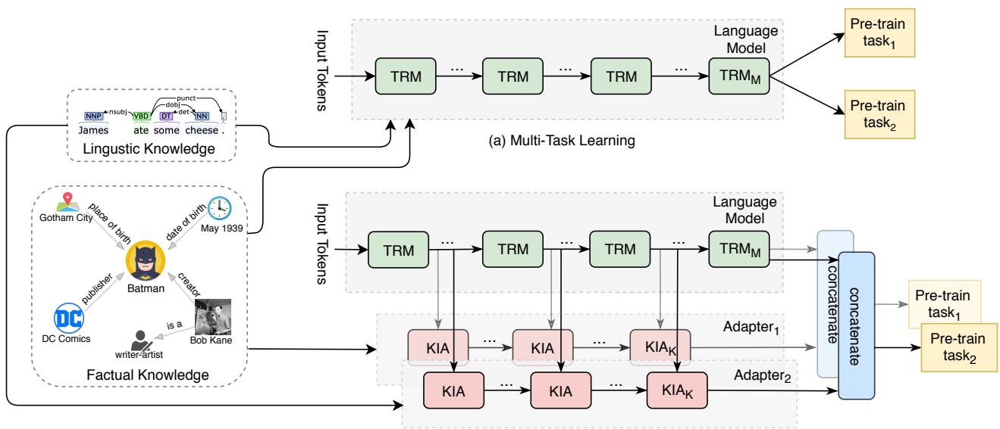
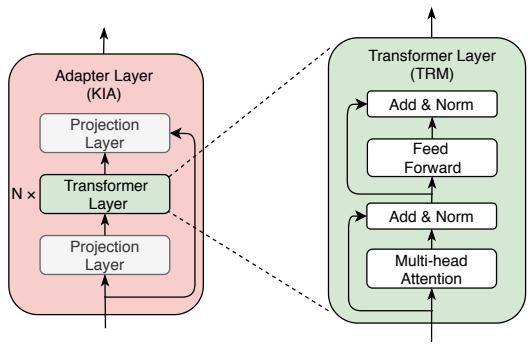

# K-ADAPTER: 通过适配器向预训练模型注入知识

Ruize Wang  $^{*1}$  Duyu Tang  $^{2}$  Nan Duan  $^{2}$  Zhongyu Wei  $^{3}$  Xuanjing Huang  $^{4}$  Jianshu ji  $^{5}$  Cuihong Cao  $^{5}$  Daxin Jiang  $^{6}$  Ming Zhou  $^{2}$

# 摘要

我们研究了向BERT和RoBERTa等大型预训练模型注入知识的问题。现有方法在注入知识时通常会更新预训练模型的原始参数。然而，当注入多种知识时，这些方法可能会遭受灾难性遗忘。为了解决这个问题，我们提出了K-ADAPTER，它保持预训练模型的原始参数固定，并支持持续的知识注入。以RoBERTa作为预训练模型，K-ADAPTER为每种注入的知识配备一个神经适配器，就像连接到RoBERTa的插件。不同适配器之间没有信息流动，因此不同适配器可以以分布式方式高效训练。我们注入了两种知识，包括从Wikipedia和Wikidata自动对齐的文本三元组中获取的事实知识，以及从依存解析中获取的语言学知识。在三个知识驱动任务（总共六个数据集）上的结果，包括关系分类、实体类型识别和问答，表明每个适配器都能提升性能，而两个适配器的组合能带来进一步的提升。探针实验进一步表明，K-ADAPTER比RoBERTa捕获了更丰富的事实和常识知识。

# 1. 引言

语言表示模型通过（掩码）语言建模等无监督目标在大规模文本语料库上进行预训练，如BERT（Devlin等人，2019）、GPT（Radford等人，2018；2019）、XLNet（Yang等人，2019）、RoBERTa（Liu等人，2019）和T5（Raffel等人，2019），在各种NLP下游任务上取得了最先进的性能。

尽管这些大型预训练模型在实证研究中取得了巨大成功，但最近的研究表明，以这种无监督方式学习的模型难以捕获丰富的知识。例如，Poerner等人（2019）指出，虽然语言模型在推理实体名称的表面形式方面表现良好，但未能捕获丰富的事实知识。Kassner & Schütze（2019）观察到BERT大多没有学习否定词（如“not”）的含义。Talmor等人（2019）发现语言模型在八个需要比较、合取和组合等符号操作的推理任务中的一半上完全失败。这些观察结果促使我们研究向BERT和RoBERTa等预训练模型注入知识的问题。

最近，一些工作致力于探索向预训练语言模型注入知识（Zhang等人，2019；Lauscher等人，2019；Levine等人，2019；Peters等人，2019；He等人，2020；Xiong等人，2020）。大多数先前的工作（如表1所示）通过知识驱动的目标增强标准的语言建模目标，并以多任务学习的方式更新模型参数。尽管这些方法通过更新预训练模型在下游任务上获得了更好的性能，但它们无法进行持续学习（Kirkpatrick等人，2017）。当我们想要注入多种新知识时，模型参数需要重新训练，这可能导致先前注入的知识被灾难性遗忘。同时，得到的预训练模型产生纠缠的表示，当注入多种知识时，很难研究每种知识的效果。

在本文中，我们提出了K-ADAPTER，一种灵活而简单的方法，用于向大型预训练模型注入知识。K-ADAPTER具有吸引人的特性，包括支持持续知识注入和产生解耦的表示。它保持预训练模型的原始表示不变，并为不同类型的注入知识输出不同的表示。这是通过集成紧凑的神经模型（本文称为适配器）实现的。适配器是特定于知识的模型，插在预训练模型的外部，其输入是预训练模型中间层的输出隐藏状态。

表1. 我们的方法（K-ADAPTER）与先前向BERT注入知识的工作的比较。  

<table><tr><td>模型</td><td>知识来源</td><td>目标</td><td>训练时BERT固定？</td><td>支持持续知识注入？</td></tr><tr><td>ERNIE (Zhang et al., 2019)</td><td>Wikipedia, WikiData</td><td>实体链接</td><td>否</td><td>否</td></tr><tr><td>LIBERT (Lauscher et al., 2019)</td><td>WordNet</td><td>同义词预测，上下位词预测</td><td>从头训练</td><td>否</td></tr><tr><td>SenseBERT (Levine et al., 2019)</td><td>WordNet</td><td>词超义预测</td><td>从头训练</td><td>否</td></tr><tr><td>KnowBERT (Peters et al., 2019)</td><td>Wordnet, Wikipedia, CrossWikis</td><td>实体链接，上位词链接</td><td>否</td><td>否</td></tr><tr><td>WKLM (Xiong et al., 2020)</td><td>WikiPedia, WikiData</td><td>替换实体检测</td><td>否</td><td>否</td></tr><tr><td>BERT-MK (He et al., 2020)</td><td>统一医学语言系统</td><td>区分真实与虚假事实</td><td>否</td><td>否</td></tr><tr><td>K-Adapter (本文工作)</td><td>Wikipedia, Wikidata, 依存解析器</td><td>谓词预测，依存关系预测</td><td>是</td><td>是</td></tr></table>

预训练模型。在本文中，我们以RoBERTa（Liu等人，2019）为基础预训练模型，并集成两种类型的知识，包括通过将Wikipedia文本与Wikidata三元组对齐获得的事实知识，以及通过对网络文本应用现成的依存解析器获得的语言学知识。在预训练阶段，我们分别在关系分类任务和依存关系预测任务上独立训练两个适配器，同时保持RoBERTa的原始参数冻结。由于适配器相比RoBERTa具有少得多的可训练参数，训练过程是内存高效的。

我们在六个基准数据集上进行了广泛的实验，涵盖三个知识驱动任务，即关系分类、实体类型识别和问答。实验表明，K-ADAPTER始终优于RoBERTa，并在五个数据集上取得了最先进的性能，在CosmosQA上与SOTA性能相当。我们进一步在LAMA（Poerner等人，2019）和LAMA-UHN（Petroni等人，2019）上进行了探针实验，证明K-ADAPTER比RoBERTa捕获了更丰富的事实和常识知识。

本文的贡献总结如下：

- 我们提出了K-ADAPTER，一种灵活的方法，支持向大型预训练模型（如本文中的RoBERTa）持续注入知识。  
- 我们注入了事实知识和语言学知识，并表明两种知识的适配器在下游任务上表现良好。  
- 通过在三个下游任务上微调参数，K-ADAPTER取得了最先进或相当的性能，并且在探针实验上比RoBERTa捕获了更丰富的事实和常识知识。

# 2. 相关工作

我们的工作与向BERT等预训练模型注入知识的领域相关。如表1所述，先前的工作主要在知识来源和用于训练的目标上有所不同。

ERNIE（Zhang等人，2019）向BERT注入知识图谱。他们将Wikipedia句子中的实体与WikiData中的事实三元组对齐，并丢弃实体少于三个的句子。在训练过程中，输入包括句子和链接的事实，知识感知的学习目标是预测正确的令牌-实体对齐。实体嵌入通过在WikiData中的事实三元组上通过TransE（Bordes等人，2013）训练。LIBERT（Lauscher等人，2019）注入WordNet中具有同义词和上下位词关系的词对。模型以由特殊令牌分隔的一对词作为输入，并通过二元分类问题进行优化，预测输入是否持有特定关系。SenseBERT（Levine等人，2019）考虑词超义知识。它通过预测输入中被掩码词的超义来注入知识，其中候选词是名词和动词，真实标签来自WordNet。KnowBERT（Peters等人，2019）使用知识注意力和重新上下文化将知识库整合到BERT中，其中知识来自WordNet中的同义词集-同义词集和词元-词元关系，以及Wikipedia中的实体链接信息。如果实体链接监督可用，则模型通过额外的知识感知对数似然或最大间隔目标进行学习。WKLM（Xiong等人，2020）也使用来自Wikipedia的文档与来自WikiData的事实三元组对齐。它将原始文档中的实体提及替换为同类型的其他实体的名称。模型被训练以区分正确的实体提及与随机选择的提及。BERT-MK（He等人，2020）整合了

  
(b) K-Adapter

  
图1. (a) 预训练语言模型通过多任务学习注入多种知识。当注入新知识时，模型参数需要重新训练，可能导致灾难性遗忘。(b) 我们的K-ADAPTER通过在不同预训练任务上独立训练适配器来注入多种知识，支持持续知识注入。当我们注入新知识时，现有的特定知识适配器不会受到影响。KIA表示适配器层，TRM表示transformer层，两者如图2所示。  
图2. 适配器层的结构（左）。适配器层由两个投影层和  $N = 2$  个transformer层组成，以及两个投影层之间的跳跃连接。

来自知识图的事实三元组。对于每个实体，它从知识图上的邻居中采样传入和传出实例，并替换头或尾实体以创建负实例。模型被学习以区分真实和虚假事实。

如表1所示，我们的模型（K-ADAPTER）在三个方面与先前的研究不同。首先，我们同时考虑事实相关目标（即谓词/关系预测）和语言学相关目标（即依存关系预测）。其次，BERT的原始参数在知识注入过程中被固定。第三，我们的方法支持持续学习，这意味着不同适配器的学习不纠缠。这种灵活性使我们能够高效地独立注入不同类型的知识，并在不丢失先前注入知识的情况下注入更多类型的知识。

# 3. K-ADAPTER

如图1(a)所示，大多数先前工作通过注入知识并通过多任务学习更新模型参数来增强预训练语言模型。无论这些不同版本的知识注入方法采用何种多任务学习，一个未充分研究的常见问题是先前知识的灾难性遗忘。为了强调这一点，我们提出了K-ADAPTER，如图1(b)所示，其中多种知识被单独注入到不同的紧凑神经模型（即本文中的适配器）中，而不是直接注入到预训练模型中。它保持预训练模型的原始表示固定，并支持持续知识注入，即将每种知识注入到相应的特定知识适配器中，并产生解耦的表示。具体来说，适配器是特定于知识的模型（参数较少），插在预训练模型的外部，其输入是预训练模型中间层的输出隐藏状态。我们在不同的预训练任务上独立预训练每个适配器以注入不同知识，同时预训练模型的原始参数被冻结。在本文中，我们利用RoBERTa（Liu等人，2019）作为

预训练模型，主要注入事实知识和语言学知识，使用两种适配器，即事实适配器和语言学适配器，它们分别在关系分类任务和依存关系预测任务上进行预训练。我们将在以下章节中首先描述适配器的结构，然后介绍预训练特定知识适配器的过程。

# 3.1. 适配器结构

实现适配器的方法有很多（Rebuffi等人，2017；Houlsby等人，2019）。在本文中，我们提出了一种不同的适配器结构，如图2所示，作为特定知识适配器。每个适配器模型由  $K$  个适配器层组成，这些层包含  $N$  个transformer（Vaswani等人，2017）层和两个投影层。在两个投影层之间应用跳跃连接。具体来说，对于每个适配器模型，我们将适配器层插入预训练模型的不同transformer层之间。我们将预训练模型的transformer层的输出隐藏特征与前一个适配器层的输出特征连接起来，作为当前适配器层的输入特征。对于每个特定知识适配器，我们使用预训练模型的最后一个隐藏特征和适配器的最后一个隐藏特征的连接作为该适配器模型的最终输出特征。

在预训练过程中，我们在不同的预训练任务上独立训练每个特定知识适配器。对于各种下游任务，K-ADAPTER可以采用与RoBERTa和BERT类似的微调过程。当仅采用一个特定知识适配器时，我们可以将该适配器模型的最终输出特征作为下游任务特定层的输入。当采用多个特定知识适配器时，我们将不同适配器模型的输出特征连接起来，作为下游任务特定层的输入。

# 3.2. 预训练设置

更具体地说，我们在所有实验中使用Huggingface的RoBERTa  $LARGE$  $(\mathrm{L} = 24$  $\mathrm{H} = 1024$  A=16,355M params) 实现作为预训练模型。对于每个适配器层，我们将transformer层的数量表示为  $N$ ，transformer层的隐藏维度表示为  $H_{A}$ ，transformer层的自注意力头数表示为  $A_{A}$ ，下投影层的隐藏维度表示为  $H_{d}$ ，上投影层的隐藏维度表示为  $H_{u}$ 。具体来说，我们有以下适配器大小：  $N = 2$  $H_{A} = 768$  $A_{A} = 12$  $H_{u} = 1024$  和  $H_{d} = 768$  适配器层插入的RoBERTa层是  $\{0,11,23\}$ ，不同的适配器层不共享参数。因此，每个适配器模型的总参数约为  $42\mathrm{M}$ ，

这比  $\mathrm{RoBERTa}_{LARGE}$  小得多，使训练过程内存高效。然后我们将在下面描述如何将不同知识注入到特定知识适配器中。

# 3.3. 事实适配器

事实知识可以描述为与事实相关或包含事实的基本信息。在本工作中，我们从自然语言中实体之间的关系获取事实知识。我们从T-REx（ElSahar等人，2018）中提取了一个子数据集T-REx-rc，这是一个大规模对齐数据集，介于Wikipedia摘要和Wikidata三元组之间，包含685个唯一关系。具体来说，T-REx-rc仅包含关系表面形式出现的句子，然后我们丢弃所有实体对少于50个的关系，收集了430个关系和550万句子。为了注入事实知识，我们提出在T-REx-rc数据集上使用关系分类任务预训练一个称为facAdapter的特定知识适配器。该任务要求模型基于上下文对给定实体对的关系标签进行分类。具体来说，我们使用RoBERTa的最后一个隐藏特征和facAdapter的最后一个隐藏特征的连接作为输入表示，然后对给定实体的输入表示应用池化层，然后将两个实体表示连接起来以执行关系分类。RoBERTa在训练期间固定，facAdapter的参数可训练并随机初始化。事实适配器的更多训练细节可以在补充材料中找到。

# 3.4. 语言学适配器

语言学知识隐含在自然语言文本中，例如句法和语义信息。在本工作中，我们从自然语言文本中词之间的依存关系获取语言学知识。我们构建了一个用于训练语言学适配器的数据集。我们在Book Corpus（Zhu等人，2015）的一部分上运行Standford Parser $^2$ （Chen & Manning，2014）的现成依存解析器，包含100万个示例。为了注入语言学知识，我们在依存关系预测任务上预训练另一个称为linAdapter的特定知识适配器。该任务旨在预测给定句子中每个令牌的父索引。类似于训练facAdapter，我们使用RoBERTa的最后一个隐藏特征和linAdapter的最后一个隐藏特征的连接作为输入表示，然后对每个令牌的输入表示应用线性层以执行分类。RoBERTa在训练期间固定，linAdapter的参数可训练并随机初始化。我们在补充材料中描述了语言学适配器的训练细节。

表2. 在两个实体类型识别数据集OpenEntity和FIGER上的结果。  

<table><tr><td rowspan="2">模型</td><td colspan="3">OpenEntity</td><td colspan="3">FIGER</td></tr><tr><td>P</td><td>R</td><td>F1</td><td>Acc</td><td>Ma-F1</td><td>Mi-F1</td></tr><tr><td>NFGEC (Shimaoka et al., 2016)</td><td>68.80</td><td>53.30</td><td>60.10</td><td>55.60</td><td>75.15</td><td>71.73</td></tr><tr><td>BERT-base (Zhang et al., 2019)</td><td>76.37</td><td>70.96</td><td>73.56</td><td>52.04</td><td>75.16</td><td>71.63</td></tr><tr><td>ERNIE (Zhang et al., 2019)</td><td>78.42</td><td>72.90</td><td>75.56</td><td>57.19</td><td>75.61</td><td>73.39</td></tr><tr><td>KnowBERT (Peters et al., 2019)</td><td>78.60</td><td>73.70</td><td>76.10</td><td>-</td><td>-</td><td>-</td></tr><tr><td>KEPLER (Wang et al., 2019)</td><td>77.20</td><td>74.20</td><td>75.70</td><td>-</td><td>-</td><td>-</td></tr><tr><td>WKLM (Xiong et al., 2020)</td><td>-</td><td>-</td><td>-</td><td>60.21</td><td>81.99</td><td>77.00</td></tr><tr><td>RoBERTa</td><td>77.55</td><td>74.95</td><td>76.23</td><td>56.31</td><td>82.43</td><td>77.83</td></tr><tr><td>RoBERTa + multitask</td><td>77.96</td><td>76.00</td><td>76.97</td><td>59.86</td><td>84.45</td><td>78.84</td></tr><tr><td>K-ADAPTER (F+L)</td><td>79.25</td><td>75.00</td><td>77.06</td><td>61.81</td><td>84.87</td><td>80.54</td></tr><tr><td>K-ADAPTER (F)</td><td>79.30</td><td>75.84</td><td>77.53</td><td>59.50</td><td>84.52</td><td>80.42</td></tr><tr><td>K-ADAPTER (L)</td><td>80.01</td><td>74.00</td><td>76.89</td><td>61.10</td><td>83.61</td><td>79.18</td></tr></table>

# 4. 实验

我们在三个下游任务上评估K-ADAPTER，即关系分类、实体类型识别和问答。此外，我们进行了探针实验，以检查模型学习事实知识的能力。K-Adapter  $(\mathrm{F} + \mathrm{L})$ 、K-Adapter (F)和K-Adapter (L)的符号分别表示由事实适配器和语言学适配器组成、仅事实适配器和仅语言学适配器的模型。实验的实施细节在补充材料中。

# 4.1. 实体类型识别

我们在细粒度实体类型识别任务上进行了实验，该任务旨在预测给定实体及其上下文的类型。对于此任务，我们在Open Entity（Choi等人，2018）和FIGER（Ling等人，2015）上评估模型，遵循与Zhang等人（2019）相同的分割设置。数据集的统计信息在补充材料中显示。为了微调模型进行实体类型识别，我们通过在某些实体前后添加特殊令牌“@”来修改输入令牌序列，然后采用第一个“@”特殊令牌表示来执行分类。为了与先前工作（Shimaoka等人，2016；Zhang等人，2019；Peters等人，2019；Wang等人，2019）在Open Entity数据集上的性能进行比较，我们使用宽松的微观精确率、召回率和F1评估模型，并采用微观F1分数作为最终指标来表示模型性能。对于FIGER数据集，我们采用严格准确率、宽松宏F1、宽松微F1分数进行评估，遵循先前工作中使用的相同评估标准。

基线 NFGEC（Shimaoka等人，2016）使用递归神经网络构建上下文表示，并采用注意力机制关注相关表达。KEPLER（Wang等人，2019）通过知识嵌入目标的监督将事实知识整合到预训练模型中。他们提出将实体的文本描述编码为其实体嵌入，然后联合学习知识嵌入和语言表示。RoBERTa+multitask是我们的RoBERTa模型，通过多任务学习（如图1(a)所示）在两个预训练任务（即关系分类和依存关系预测）上注入多种知识进行预训练。其他基线模型，如BERT-base（Zhang等人，2019）、ERNIE（Zhang等人，2019）、KnowBERT（Peters等人，2019）和WKLM（Xiong等人，2020）在第2节中描述。

结果与讨论 Open Entity和FIGER上的结果如表2所示。我们的K-ADAPTER  $(\mathrm{F} + \mathrm{L})$  在这两个数据集上实现了一致的改进。对于Open Entity数据集，我们的RoBERTa取得了比其他基线模型更好的结果。K-ADAPTER  $(\mathrm{F} + \mathrm{L})$  比RoBERTa提高了  $0.83\%$  F1和  $1.7\%$  精确率，这意味着事实知识和语言学知识有助于更准确地预测类型。对于FIGER数据集，FIGER涵盖更多实体类型，因此比Open Entity更细粒度。与WKLM相比，我们的K-ADAPTER  $(\mathrm{F} + \mathrm{L})$  将宏F1提高了  $2.88\%$ ，微F1提高了  $2.54\%$ ，严格准确率提高了  $1.60\%$ 。这表明K-ADAPTER  $(\mathrm{F} + \mathrm{L})$  有益于细粒度实体类型识别。

# 4.2. 问答

我们在两个问答任务上进行了实验，即常识问答和开放域问答。常识问答旨在回答具有常识性的问题。我们采用CosmosQA（Huang等人，2019）来评估模型。CosmosQA需要基于常识的阅读理解，以多项选择题的形式呈现。为了微调模型进行CosmosQA，对于每个答案，输入令牌序列修改为“<SEP>上下文

表3. 在三个问答数据集上的结果，包括：CosmosQA、SearchQA和Quasar-T。  

<table><tr><td rowspan="2">模型</td><td colspan="2">SearchQA</td><td colspan="2">Quasar-T</td><td>CosmosQA</td></tr><tr><td>EM</td><td>F1</td><td>EM</td><td>F1</td><td>准确率</td></tr><tr><td>BiDAF (Seo et al., 2016)</td><td>28.60</td><td>34.60</td><td>25.90</td><td>28.50</td><td>-</td></tr><tr><td>AQA (Buck et al., 2018)</td><td>40.50</td><td>47.40</td><td>-</td><td>-</td><td>-</td></tr><tr><td>R^3 (Wang et al., 2017a)</td><td>49.00</td><td>55.30</td><td>35.30</td><td>41.70</td><td>-</td></tr><tr><td>DSQA (Lin et al., 2018)</td><td>49.00</td><td>55.30</td><td>42.30</td<td>49.30</td><td>-</td></tr><tr><td>Evidence Agg. (Wang et al., 2018)</td><td>57.00</td><td>63.20</td><td>42.30</td><td>49.60</td><td>-</td></tr><tr><td>BERT (Xiong et al., 2020)</td><td>57.10</td><td>61.90</td><td>40.40</td><td>46.10</td><td>-</td></tr><tr><td>WKLM (Xiong et al., 2020)</td><td>58.70</td><td>63.30</td><td>43.70</td><td>49.90</td><td>-</td></tr><tr><td>WKLM + Ranking (Xiong et al., 2020)</td><td>61.70</td><td>66.70</td><td>45.80</td><td>52.20</td><td>-</td></tr><tr><td>BERT-FT_RACE+SWAG (Huang et al., 2019)</td><td>-</td><td>-</td><td>-</td><td>-</td><td>68.70</td></tr><tr><td>RoBERTa</td><td>59.01</td><td>65.62</td><td>40.83</td><td>48.84</td><td>80.59</td></tr><tr><td>RoBERTa + multitask</td><td>59.92</td><td>66.67</td><td>44.62</td><td>51.17</td><td>81.19</td></tr><tr><td>K-ADAPTER (F+L)</td><td>61.96</td><td>67.31</td><td>45.69</td><td>52.48</td><td>81.83</td></tr><tr><td>K-ADAPTER (F)</td><td>61.85</td><td>67.17</td><td>46.75</td><td>53.27</td><td>80.93</td></tr><tr><td>K-ADAPTER (L)</td><td>61.15</td><td>66.82</td><td>45.66</td><td>52.39</td><td>80.76</td></tr></table>

</SEP>问题</SEP>答案</SEP>”，然后采用第一个令牌的表示来执行分类，并为该答案获得一个分数。在获得四个分数后，选择分数最高的答案。我们报告从排行榜获得的准确率分数。开放域问答旨在使用外部资源（如文档集合和网页）回答开放域问题。我们在两个公共开放域QA数据集上评估模型，即QuasarT（Dhingra等人，2017）和SearchQA（Dunn等人，2017）。这些数据集的统计信息在补充材料中显示。具体来说，我们首先使用信息检索系统从外部资源中检索与问题相关的段落，然后通过阅读理解技术从这些检索到的段落中提取答案。遵循先前工作（Lin等人，2018），我们使用Wang等人（2017b）为这两个数据集提供的检索段落。为了微调模型进行此任务，输入令牌序列修改为“<SEP>问题</SEP>段落</SEP>”。我们在模型的最后一个隐藏特征上应用线性层来预测答案跨度的起始和结束位置。我们采用两个指标评估模型，包括精确匹配（EM）和宽松F1分数。

基线 BERT-FT $_{RACE+SWAG}$ （Huang等人，2019）是依次在RACE和SWAG数据集上微调的BERT模型，用于知识迁移。BiDAF（Seo等人，2016）是一个带有双向注意力网络的阅读理解模型。AQA（Buck等人，2018）是一个强化系统，学习重写问题并聚合由重写问题生成的答案。  $\mathbf{R}^{\wedge}3$  （Wang等人，2017a）是一个强化模型，利用排序器选择最置信的段落来训练阅读理解模型。Evidence Agg.（Wang等人，2018）提出利用来自多个段落的聚合证据，通过重新排序器更好地确定答案。BERT（Xiong等人，2020）是Xiong等人（2020）为开放域QA重新实现的BERT。WKLM（Xiong等人，2020）在第2节中描述，用作阅读器模型以阅读多个段落来预测单个答案。WKLM + Ranking（Xiong等人，2020）是一个WKLM段落阅读器加上一个基于BERT的段落排序器，使用远程监督数据为每个段落分配相关性分数。

结果与讨论 CosmosQA上的结果如表3所示。与BERT-FT $_{RACE+SWAG}$  相比，我们的RoBERTa显著提高了  $11.89\%$  的准确率。CosmosQA将阅读理解与常识推理相结合，需要对更复杂、多样和更长的上下文进行上下文常识推理。与RoBERTa相比，K-ADAPTER  $(\mathrm{F} + \mathrm{L})$  进一步提高了  $1.24\%$  的准确率，这表明K-ADAPTER可以获得更好的常识推理能力。此外，消融的K-ADAPTER模型，即K-ADAPTER (F)和K-ADAPTER (L)的性能明显优于RoBERTa，但略低于RoBERTa+multitask。值得注意的是，K-ADAPTER  $(\mathrm{F} + \mathrm{L})$  相比RoBERTa+multitask有明显的改进。这表明多个特定知识适配器的组合可以实现更好的性能。

开放域QA的结果如表3所示。我们的K-ADAPTER模型在这两个数据集上取得了比其他基线更好的结果。这表明我们的K-ADAPTER模型可以充分利用注入的知识，从而有益于理解检索到的段落来回答问题。具体来说，在

SearchQA上，我们的K-ADAPTER  $(\mathrm{F} + \mathrm{L})$  相比不使用排序分数的WKLM，显著提高了  $4.01\%$  F1分数，甚至比WKLM+Ranking略有提高。值得注意的是，K-ADAPTER模型不考虑每个检索段落的置信度，而WKLM+Ranking利用基于BERT的排序器的排序分数。在Quasar-T数据集上，我们的K-ADAPTER  $(\mathrm{F} + \mathrm{L})$  也以  $2.58\%$  F1分数优于WKLM，并略优于WKLM+Ranking。

# 4.3. 关系分类

关系分类旨在确定给定句子中两个实体之间的正确关系。我们在大规模关系分类数据集TACRED（Zhang等人，2017）上微调并比较我们的模型与几种基线方法，该数据集涵盖42种关系类型，包含106,264个句子。数据集的统计信息在补充材料中显示。为了微调模型进行关系分类，我们通过在第一实体前后添加特殊令牌“@”，在第二实体前后添加“#”来修改输入令牌序列。然后第一个特殊令牌“@”和“#”的令牌表示被连接起来以执行关系分类。我们使用微观精确率、召回率和F1评估模型，并采用微观F1分数作为指标来表示模型性能，如先前工作所示。

基线 C-GCN（Zhang等人，2018）在依存树结构上使用图卷积网络（GCNs）为关系分类建模依存树。BERT-large（Baldini Soares等人，2019）是Baldini Soares等人（2019）的基线BERT-large模型，用于在TACRED上执行任务特定微调。BERT+MTB（Baldini Soares等人，2019）是一种无需知识库或人工标注监督的关系表示训练方法，通过匹配空白（MTB）。其他基线模型，如BERT-base（Zhang等人，2019）、ERNIE（Zhang等人，2019）、KnowBERT（Peters等人，2019）、KEPLER（Wang等人，2019）和RoBERTa+multitask在第2节和4.1节中描述。

结果与讨论 表4显示了不同模型在TACRED上的性能。结果表明K-ADAPTER模型显著优于所有基线，这直接证明我们的模型有益于关系分类。具体来说，(1) K-ADAPTER模型优于我们的RoBERTa，这证明了通过适配器向预训练模型注入知识的有效性。(2) K-ADAPTER模型相比学习纠缠知识的RoBERTa+multitask获得了更多改进。这直接证明以K-ADAPTER方式单独注入知识有助于模型充分利用

表4. 在TACRED关系分类数据集上的结果。  

<table><tr><td>模型</td><td>P</td><td>R</td><td>F1</td></tr><tr><td>C-GCN (Zhang et al., 2018)</td><td>69.90</td><td>63.30</td><td>66.40</td></tr><tr><td>BERT-base (Zhang et al., 2019)</td><td>67.23</td><td>64.81</td><td>66.00</td></tr><tr><td>ERNIE (Zhang et al., 2019)</td><td>69.97</td><td>66.08</td><td>67.97</td></tr><tr><td>BERT-large (Baldini Soares et al., 2019)</td><td>-</td><td>-</td><td>70.10</td></tr><tr><td>BERT+MTB (Baldini Soares et al., 2019)</td><td>-</td><td>-</td><td>71.50</td></tr><tr><td>KnowBERT (Peters et al., 2019)</td><td>71.60</td><td>71.40</td><td>71.50</td></tr><tr><td>KEPLER (Wang et al., 2019)</td><td>70.43</td><td>73.02</td><td>71.70</td></tr><tr><td>RoBERTa</td><td>70.17</td><td>72.36</td><td>71.25</td></tr><tr><td>RoBERTa + multitask</td><td>70.18</td><td>73.11</td><td>71.62</td></tr><tr><td>K-ADAPTER (F+L)</td><td>70.05</td><td>73.92</td><td>71.93</td></tr><tr><td>K-ADAPTER (F)</td><td>69.39</td><td>74.59</td><td>71.89</td></tr><tr><td>K-ADAPTER (L)</td><td>68.85</td><td>75.37</td><td>71.96</td></tr></table>

知识。(3) K-ADAPTER (L)在所有K-ADAPTER模型中取得了最佳性能。这表明语言学知识在TACRED数据集上更有用。

# 4.4. 探针实验

尽管我们的K-ADAPTER模型在几个知识驱动的下游任务上表现优异，但它并没有直接提供关于我们的模型是否注入了更丰富的事实和常识知识的见解。因此，我们利用LAMA（LLanguage Model Analysis）探针（Petroni等人，2019）来检查记忆事实知识的能力。具体来说，LAMA探针任务旨在回答关于关系事实的完形填空式问题，例如“Simon Bowman was born in [MASK]”。该任务要求语言模型预测一个有限词汇表上的分布来替换[MASK]。我们报告关系上宏平均的均值精确率一  $(\mathrm{P}@\mathrm{1})$ 。

设置 我们考虑几种语言模型，包括：ELMo（Peters等人，2018）、ELMo5.5B（Peters等人，2018）、Transformer-XL（Dai等人，2019）、BERTLarge和RoBERTaLarge。我们关注LAMA-GoogleRE和LAMA-T-REx数据集，这些数据集针对事实知识。我们还在LAMA-UHN（Poerner等人，2019）上进行了探针实验，这是LAMA-Google-RE和LAMA-T-REx的一个更事实的子集，通过过滤掉仅从实体名称就能轻松回答的查询。不同模型有不同的词汇表大小。为了进行更公平的比较实验，我们采用词汇表的交集，并让每个语言模型仅对这个词汇表中的令牌进行排名，遵循Petroni等人（2019）。为简单起见，我们仅比较注入了事实知识的K-APDATER (F)与其他基线模型。

结果与讨论 LAMA和LAMA-UHN数据集上的结果如表5所示。令人惊讶的是  $\mathrm{BERT}_{\text{LARGE}}$  的性能优于RoBERTa $_{\text{LARGE}}$ 。

表5. 在LAMA和LAMA-UHN上跨Google-RE和T-REx语料库的P@1。  

<table><tr><td rowspan="2">语料库</td><td colspan="6">模型</td></tr><tr><td>ELMo</td><td>ELMo5.5B</td><td>TransformerXL</td><td>BERT-large</td><td>RoBERTaLARGE</td><td>K-APDATER</td></tr><tr><td>LAMA-Google-RE</td><td>2.2</td><td>3.1</td><td>1.8</td><td>12.1</td><td>4.8</td><td>7.0</td></tr><tr><td>LAMA-UHN-Google-RE</td><td>2.3</td><td>2.7</td><td>1.3</td><td>6.5</td><td>2.5</td><td>3.7</td></tr><tr><td>LAMA-T-REx</td><td>0.2</td><td>0.3</td><td>19.5</td><td>33.9</td><td>27.1</td><td>29.1</td></tr><tr><td>LAMA-UHN-T-REx</td><td>0.2</td><td>0.2</td><td>12.6</td><td>26.2</td><td>20.1</td><td>23.0</td></tr></table>

表6. RoBERTa  ${}_{LARGE}$  和K-ADAPTER的生成示例。最后一列报告排名最高的预测令牌。正确的预测以粗体显示。  

<table><tr><td>查询</td><td>答案</td><td>模型</td><td>生成</td></tr><tr><td rowspan="2">The official language of Mauritius is [MASK].</td><td rowspan="2">English</td><td>RoBERTa</td><td>French, English, Dutch, Arabic, Portuguese, Spanish</td></tr><tr><td>K-ADAPTER</td><td>English, French, Dutch, Arabic, Portuguese, Spanish</td></tr><tr><td rowspan="2">The native language of Mammootty is [MASK].</td><td rowspan="2">Malayalam</td><td>RoBERTa</td><td>English, Tamil, Hindi, Sanskrit, Arabic, Chinese, spoken</td></tr><tr><td>K-ADAPTER</td><td>Malayalam, Tamil, Hindi, Mandarin, English, Thai</td></tr><tr><td rowspan="2">Birds have [MASK].</td><td rowspan="2">feathers</td><td>RoBERTa</td><td>flown, feathers, babies, noticed, gone, changed, come</td></tr><tr><td>K-ADAPTER</td><td>feelings, feathers, brains, names, souls, eyes, wings</td></tr><tr><td rowspan="2">Ravens can [MASK].</td><td rowspan="2">fly</td><td>RoBERTa</td><td>win, play, score, lose, run, drink, fly, roll, wait, ide</td></tr><tr><td>K-ADAPTER</td><td>fly, swim, sing, shoot, kill, go, fish, drink, die, roll</td></tr><tr><td rowspan="2">Sometimes virus causes [MASK].</td><td rowspan="2">infection</td><td>RoBERTa</td><td>cancer, death, illness, blindness, paralysis, infection</td></tr><tr><td>K-ADAPTER</td><td>cancer, illness, death, infection, disease, problems, pain</td></tr><tr><td rowspan="2">Sunshine Coast, British Columbia is located in [MASK].</td><td rowspan="2">Canada</td><td>RoBERTa</td><td>Florida, California, Texas, Hawaii, Mexico, Arizona</td></tr><tr><td>K-ADAPTER</td><td>Canada, Vancouver, Victoria, BC, Australia, California</td></tr><tr><td rowspan="2">iPod Touch is produced by [MASK].</td><td rowspan="2">Apple</td><td>RoBERTa</td><td>Apple, Samsung, Qualcomm, LG, Microsoft, HTC</td></tr><tr><td>K-ADAPTER</td><td>Apple, HTC, Samsung, Motorola, Intel, Sony</td></tr></table>

有一个可能的原因：BERT使用字符级BPE（Gage，1994）词汇表，而RoBERTa考虑字节级BPE词汇表。这一发现表明，虽然使用字节可以学习一个能够编码任何文本而不引入“未知”令牌的子词词汇表，但它可能间接损害模型学习事实知识的能力，例如，一些专有名词可能被分成字节。因此在接下来的实验中，我们不将BERT考虑在内。

K-ADAPTER以巨大优势优于其他模型（除了BERT）。在LAMA数据集上，与RoBERTaLARGE相比，K-ADAPTER在Google-RE和T-REx上分别获得了  $2.2\%$  和  $1.2\%$  的P@1改进。此外，与RoBERTaLARGE相比，K-ADAPTER在LAMA-UHN上仍然取得了更好的结果。这些结果表明K-ADAPTER比RoBERTa捕获了更丰富的事实和常识知识。此外，表6显示了RoBERTaLARGE和K-ADAPTER为LAMA查询生成的几个示例。从这些示例中，我们可以发现K-ADAPTER预测的

对象更准确。

# 5. 结论

在本文中，我们提出了一种灵活而简单的方法，称为K-ADAPTER，用于向大型预训练模型注入知识。K-ADAPTER保持预训练模型的原始参数不变，并支持持续知识注入，即新注入的知识不会影响为旧知识学习的参数。具体来说，事实知识和语言学知识通过两种适配器注入到RoBERTa中，这两种适配器分别在关系分类任务和依存关系预测任务上进行预训练。在三个知识驱动的下游任务上的广泛实验表明，每个适配器的性能都实现了显著提升，并且组合使用时效果更好。探针实验进一步表明，K-ADAPTER比RoBERTa捕获了更丰富的事实和常识知识。

# 参考文献

Baldini Soares, L., FitzGerald, N., Ling, J., and Kwiatkowski, T. Matching the Blanks: Distributional Similarity for Relation Learning. In ACL, pp. 2895-2905, 2019.  
Bordes, A., Usunier, N., Garcia-Duran, A., Weston, J., and Yakhnenko, O. Translating embeddings for modeling multi-relational data. In NIPS, pp. 2787-2795, 2013.  
Buck, C., Bulian, J., Ciaramita, M., Gesmundo, A., Houlsby, N., Gajewski, W., and Wang, W. Ask the Right Questions: Active Question Reformulation with Reinforcement Learning. In ICLR, 2018.  
Chen, D. and Manning, C. D. A fast and accurate dependency parser using neural networks. In EMNLP, pp. 740-750, 2014.  
Choi, E., Levy, O., Choi, Y., and Zettlemoyer, L. Ultra-fine entity typing. In ACL, pp. 87-96, 2018.  
Dai, Z., Yang, Z., Yang, Y., Carbonell, J., Le, Q. V., and Salakhutdinov, R. Transformer-xl: Attentive language models beyond a fixed-length context. In ACL, pp. 2978-2988, 2019.  
Devlin, J., Chang, M.-W., Lee, K., and Toutanova, K. Bert: Pre-training of deep bidirectional transformers for language understanding. In *NAACL*, pp. 4171-4186, 2019.  
Dhingra, B., Mazaitis, K., and Cohen, W. W. Quasar: Datasets for question answering by search and reading. In arXiv preprint arXiv:1707.03904, 2017.  
Dunn, M., Sagun, L., Higgins, M., Güney, V. U., Cirik, V., and Cho, K. SearchQA: A New Q&A Dataset Augmented with Context from a Search Engine. In *ArXiv preprint arXiv*: 1704.05179, 2017.  
ElSahar, H., Vougiouklis, P., Remaci, A., Gravier, C., Hare, J. S., Laforest, F., and Simperl, E. T-REx: A Large Scale Alignment of Natural Language with Knowledge Base Triples. In LREC, 2018.  
Gage, P. A new algorithm for data compression. The C Users Journal, 12(2):23-38, 1994.  
He, B., Zhou, D., Xiao, J., Liu, Q., Yuan, N. J., Xu, T., et al. Integrating Graph Contextualized Knowledge into Pre-trained Language Models. In AAAI, 2020.  
Houlsby, N., Giurgiu, A., Jastrzebski, S., Morrone, B., De Laroussilhe, Q., Gesmundo, A., Attariyan, M., and Gelly, S. Parameter-Efficient Transfer Learning for NLP. In ICML, pp. 2790-2799, 2019.

Huang, L., Bras, R. L., Bhagavatula, C., and Choi, Y. Cosmos QA: Machine reading comprehension with contextual commonsense reasoning. In EMNLP, pp. 2391-2401, 2019.  
Kassner, N. and Schütze, H. Negated LAMA: Birds cannot fly. arXiv preprint arXiv:1911.03343, 2019.  
Kirkpatrick, J., Pascanu, R., Rabinowitz, N., Veness, J., Desjardins, G., Rusu, A. A., Milan, K., Quan, J., Ramalho, T., Grabska-Barwinska, A., and et al. Overcoming catastrophic forgetting in neural networks. Proceedings of the National Academy of Sciences, 114(13):35213526, Mar 2017. ISSN 1091-6490. doi: 10.1073/pnas.1611835114.  
Lauscher, A., Vulic, I., Ponti, E. M., Korhonen, A., and Glavaš, G. Informing unsupervised pretraining with external linguistic knowledge. arXiv preprint arXiv:1909.02339, 2019.  
Levine, Y., Lenz, B., Dagan, O., Padnos, D., Sharir, O., Shalev-Shwartz, S., Shashua, A., and Shoham, Y. Sensebert: Driving some sense into bert. arXiv preprint arXiv:1908.05646, 2019.  
Lin, Y., Ji, H., Liu, Z., and Sun, M. Denoising distantly supervised open-domain question answering. In ACL, pp. 1736-1745, 2018.  
Ling, X., Singh, S., and Weld, D. S. Design challenges for entity linking. TACL, 3:315-328, 2015.  
Liu, Y., Ott, M., Goyal, N., Du, J., Joshi, M., Chen, D., Levy, O., Lewis, M., Zettlemoyer, L., and Stoyanov, V. Roberta: A robustly optimized bert pretraining approach. arXiv preprint arXiv:1907.11692, 2019.  
Peters, M. E., Neumann, M., Iyyer, M., Gardner, M., Clark, C., Lee, K., and Zettlemoyer, L. Deep contextualized word representations. In *NAACL*, pp. 2227-2237, 2018.  
Peters, M. E., Neumann, M., Logan, I., Robert, L., Schwartz, R., Joshi, V., Singh, S., and Smith, N. A. Knowledge enhanced contextual word representations. In EMNLP, pp. 43-54, 2019.  
Petroni, F., Rocktäschel, T., Lewis, P., Bakhtin, A., Wu, Y., Miller, A. H., and Riedel, S. Language Models as Knowledge Bases? In EMNLP, pp. 2463-2473, 2019.  
Poerner, N., Waltinger, U., and Schütze, H. BERT is Not a Knowledge Base (Yet): Factual Knowledge vs. Name-Based Reasoning in Unsupervised QA. arXiv preprint arXiv:1911.03681, 2019.  
Radford, A., Narasimhan, K., Salimans, T., and Sutskever, I. Improving language understanding by generative pretraining. OpenAI Blog, 2018.

Radford, A., Wu, J., Child, R., Luan, D., Amodei, D., and Sutskever, I. Language models are unsupervised multitask learners. OpenAI Blog, 1(8), 2019.  
Raffel, C., Shazeer, N., Roberts, A., Lee, K., Narang, S., Matena, M., Zhou, Y., Li, W., and Liu, P. J. Exploring the limits of transfer learning with a unified text-to-text transformer. arXiv preprint arXiv:1910.10683, 2019.  
Rebuffi, S.-A., Bilen, H., and Vedaldi, A. Learning multiple visual domains with residual adapters. In NeurIPS, pp. 506-516, 2017.  
Seo, M., Kembhavi, A., Farhadi, A., and Hajishirzi, H. Bidirectional Attention Flow for Machine Comprehension. ArXiv, abs/1611.01603, 2016.  
Shimaoka, S., Stenetorp, P., Inui, K., and Riedel, S. An attentive neural architecture for fine-grained entity type classification. In Proceedings of the 5th Workshop on Automated Knowledge Base Construction(AKBC), pp. 69-74, 2016.  
Talmor, A., Elazar, Y., Goldberg, Y., and Berant, J. oLmpics- On what Language Model Pre-training Captures. arXiv preprint arXiv:1912.13283, 2019.  
Vaswani, A., Shazeer, N., Parmar, N., Uszkoreit, J., Jones, L., Gomez, A. N., Kaiser, L., and Polosukhin, I. Attention is all you need. In NeurIPS, pp. 5998-6008, 2017.  
Wang, S., Yu, M., Guo, X., Wang, Z., Klinger, T., Zhang, W., Chang, S., Tesauro, G., Zhou, B., and Jiang, J. Reinforced reader-ranker for open-domain question answering. arXiv preprint arXiv:1709.00023, 2017a.  
Wang, S., Yu, M., Jiang, J., Zhang, W., Guo, X., Chang, S., Wang, Z., Klinger, T., Tesauro, G., and Campbell, M. Evidence aggregation for answer re-ranking in open-domain question answering. In ICLR, 2018.  
Wang, W., Yang, N., Wei, F., Chang, B., and Zhou, M. Gated self-matching networks for reading comprehension and question answering. In ACL, pp. 189-198, 2017b.  
Wang, X., Gao, T., Zhu, Z., Liu, Z., Li, J., and Tang, J. KEPLER: A Unified Model for Knowledge Embedding and Pre-trained Language Representation. arXiv preprint arXiv:1911.06136, 2019.  
Xiong, W., Du, J., Wang, W. Y., and Stoyanov, V. Pretrained Encyclopedia: Weakly Supervised Knowledge-Pretrained Language Model. In ICLR, 2020.  
Yang, Z., Dai, Z., Yang, Y., Carbonell, J., Salakhutdinov, R., and Le, Q. V. XLNet: Generalized Autoregressive Pretraining for Language Understanding. arXiv preprint arXiv:1906.08237, 2019.

Zhang, Y., Zhong, V., Chen, D., Angeli, G., and Manning, C. D. Position-aware Attention and Supervised Data Improve Slot Filling. In EMNLP, pp. 35-45, 2017.  
Zhang, Y., Qi, P., and Manning, C. D. Graph Convolution over Pruned Dependency Trees Improves Relation Extraction. In EMNLP, pp. 2205-2215, 2018.  
Zhang, Z., Han, X., Liu, Z., Jiang, X., Sun, M., and Liu, Q. ERNIE: Enhanced Language Representation with Informative Entities. In ACL, pp. 1441-1451, 2019.  
Zhu, Y., Kiros, R., Zemel, R., Salakhutdinov, R., Urtasun, R., Torralba, A., and Fidler, S. Aligning Books and Movies: Towards Story-Like Visual Explanations by Watching Movies and Reading Books. In ICCV, pp. 19-27, 2015.

# 补充材料

# A. 预训练细节

# A.1. 事实适配器

预训练模型在训练期间固定，事实适配器的参数可训练并随机初始化。模型使用交叉熵损失训练。为了加速训练过程，我们将最大序列长度设置为64，因为T-REx-rc的平均序列长度仅为22.8。我们使用128的批次大小训练模型5个周期。我们使用AdamW优化模型，初始学习率为2e-5。我们使用4个16G NVIDIA V100 GPU训练模型。

# A.2. 语言学适配器

与事实适配器的训练过程相同，预训练模型在训练期间固定，语言学适配器的参数可训练并随机初始化。模型使用BCEWithLogits损失训练。我们将最大序列长度设置为128。我们使用256的批次大小训练模型10个周期。我们使用AdamW，初始学习率为1e-5。我们使用4个16G NVIDIA V100 GPU训练模型。

# B. 数据集统计

在表7中，我们展示了一个关系分类数据集TACRED，以及两个实体类型识别数据集OpenEntity和FIGER的统计信息。在表8中，我们展示了一个常识QA数据集CosmosQA和两个开放域QA数据集SearchQA和Quasar-T的统计信息。

表7. 关系分类数据集TACRED和实体类型识别数据集（即Open Entity和FIGER）的统计信息。  

<table><tr><td>数据集</td><td>训练集</td><td>开发集</td><td>测试集</td><td>关系/类型数</td></tr><tr><td>TACRED</td><td>68,124</td><td>22,631</td><td>15,509</td><td>42</td></tr><tr><td>Open Entity</td><td>2,000</td><td>2,000</td><td>2,000</td><td>6</td></tr><tr><td>FIGER</td><td>2,000,000</td><td>10,000</td><td>563</td><td>113</td></tr></table>

表8. 问答数据集（即CosmosQA、SearchQA和Quasar-T）的统计信息。  

<table><tr><td>数据集</td><td>训练集</td><td>开发集</td><td>测试集</td></tr><tr><td>CosmosQA</td><td>25,588</td><td>3,000</td><td>7,000</td></tr><tr><td>SearchQA</td><td>99,811</td><td>13,893</td><td>27,247</td></tr><tr><td>Quasar-T</td><td>28,496</td><td>3,000</td><td>3,000</td></tr></table>

# C. 微调细节和超参数

我们使用Huggingface3实现实验。对于所有微调实验，我们使用AdamW作为优化器。适配器的参数在微调过程中固定，RoBERTa的参数可训练并从Huggingface检查点初始化。我们在验证集上选择最佳超参数。对于所有实验，我们将随机种子设置为42以确保可重复性。

# C.1. 实体类型识别

对于Open Entity数据集，我们将最大序列长度设置为256，并从以下超参数中选择：批次大小：  $\{4, 8\}$ ，学习率：  $\{2e-5, 1e-5, 5e-6\}$  和热身步数：  $\{0, 200, 500, 1000, 1200\}$ 。对于K-ADAPTER (F)，最佳性能在批次大小=4，学习率=5e-6，热身=500时实现（在单个16G P100上运行约2小时获得最佳结果）。对于K-ADAPTER (L)，最佳性能在批次大小=4，学习率=5e-6，热身=1000时实现（在单个16G P100上运行约2小时获得最佳结果）。对于K-ADAPTER (F+L)，最佳性能在批次大小=4，学习率=5e-6，热身=1000时实现（在单个16G P100上运行约3小时获得最佳结果）。对于FIGER数据集，我们在4个16G P100上运行3个周期，将最大序列长度设置为256，并从以下超参数中选择：批次大小：  $\{64, 512, 2048\}$ ，学习率：  $\{2e-5, 1e-5, 5e-6\}$  和热身步数：  $\{0, 200, 500, 1000, 1200\}$ 。对于K-ADAPTER (F)，最佳性能在批次大小=2048，学习率=5e-6，热身=500时实现。对于K-ADAPTER (L)，最佳性能在批次大小=2048，学习率=5e-6，热身=200时实现。对于K-ADAPTER (F+L)，最佳性能在批次大小=2048，学习率=5e-6，热身=1000时实现。

# C.2. 问答

对于CosmosQA数据集，我们在单个16G P100上运行3个周期，将最大序列长度设置为256，并从以下超参数中选择：批次大小：{16, 32, 64, 128}，学习率：{2e-5, 1e-5, 5e-6}和热身步数：{0, 200, 500, 800, 1000}。对于K-ADAPTER (F+L)及其消融模型，最佳性能在批次大小=64，学习率=1e-5，热身=0时实现（约8小时获得最佳结果）。

对于SearchQA数据集，我们在单个16G P100上运行2个周期，将最大序列长度设置为128，并从以下超参数中选择：批次大小：  $\{2,4,8,16\}$ ，学习率：  $\{5e - 5,2e - 5,1e - 5,5e - 6\}$  和热身步数：  $\{0,500,1000\}$ 。对于K-ADAPTER (F+L)及其消融模型，最佳性能在批次大小=8，学习率=5e-6，热身=0时实现。对于Quasar-T数据集，我们在单个16G P100上运行5个周期，将

最大序列长度设置为256，并从以下超参数中选择：批次大小：  $\{2,4,8,16\}$ ，学习率：  $\{5e - 5, 2e - 5, 1e - 5, 5e - 6\}$  和热身步数：  $\{0,500,1000\}$ 。对于K-ADAPTER (F+L)及其消融模型，最佳性能在批次大小=16，学习率=1e-5，热身=0时实现。

# C.3. 关系分类

对于TACRED数据集，我们在4个16G P100上运行5个周期，将最大序列长度设置为184，并从以下超参数中选择：批次大小：  $\{4,8,16,32\}$ ，学习率：  $\{2e - 5,1e - 5,5e - 6,1e - 6\}$  和热身步数：  $\{0,200,500,800,1000,1200\}$ 。对于K-ADAPTER (F)，最佳性能在批次大小  $= 32$ ，学习率  $= 1e - 5$ ，热身  $= 500$  时实现。对于K-ADAPTER (L)，最佳性能在批次大小  $= 32$ ，学习率  $= 1e - 5$ ，热身  $= 200$  时实现。对于K-ADAPTER (F+L)，最佳性能在批次大小  $= 32$ ，学习率  $= 5e - 6$ ，热身  $= 1000$  时实现。

# D. 探针实验

我们使用LAMA4实现探针实验。LAMA探针旨在回答关于关系事实的完形填空式问题，例如“Simon Bowman was born in [MASK]”。该任务要求语言模型预测一个有限词汇表上的分布来替换[MASK]。当我们向特定知识适配器注入知识时，我们不改变预训练模型的原始参数，因此不采用掩码语言模型（MLM）作为预训练任务。因此，在进行探针实验之前，我们需要添加并训练一个线性层作为mlm层来预测[MASK]实体。具体来说，我们固定K-ADAPTER的所有参数，仅使用掩码语言模型（MLM）损失更新mlm层的参数。我们使用原始的WikiText-2数据集（181M）。我们在单个16G P100上训练mlm层2个周期。我们将最大序列长度设置为512，批次大小设置为1024，热身步数设置为0。
