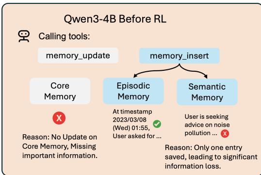
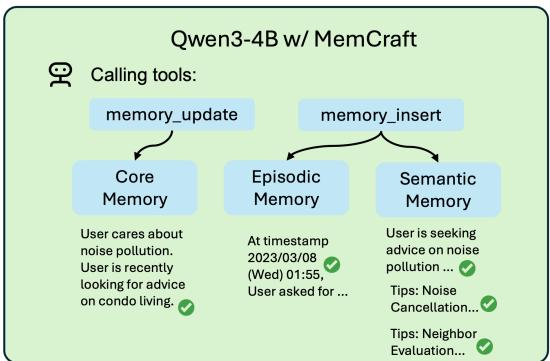
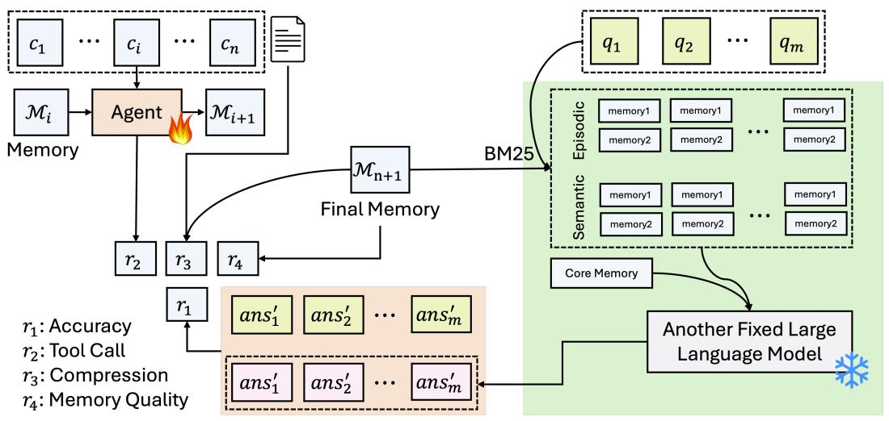
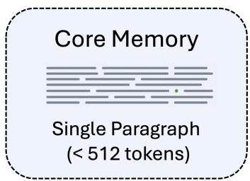
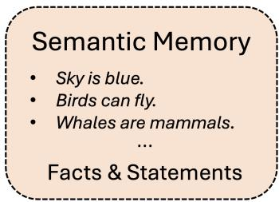
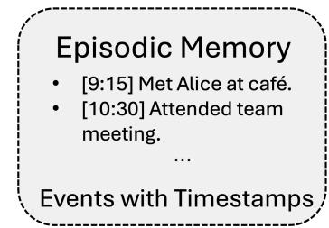

# MEM-α：通过强化学习学习记忆构建

王宇1,2∗, Ryuichi Takanobu1, 梁志琪2, 毛雨臻3, 胡元哲2, Julian McAuley2, 吴晓健1,

1Anuttacon, 2加州大学圣地亚哥分校, 3斯坦福大学 yuw164@ucsd.edu, truthless11@gmail.com


数据集


源代码

## 摘要

大语言模型（LLM）智能体受限于有限的上下文窗口，因此需要外部记忆系统来进行长期信息理解。当前记忆增强智能体通常依赖于预定义的指令和工具进行记忆更新。然而，语言模型可能缺乏确定存储哪些信息、如何结构化以及何时更新的能力——尤其是当记忆系统变得更复杂时。这导致次优的记忆构建和信息丢失。为此，我们提出了Mem-α，一个强化学习框架，通过交互和反馈训练智能体有效管理复杂记忆系统。我们还构建了一个专门的训练数据集，涵盖多样的多轮交互模式，并配有全面的评估问题，旨在教授有效的记忆管理。在训练期间，智能体处理顺序信息块，学习提取、存储和更新记忆系统。奖励信号源自整个交互历史的下游问答准确性，直接优化记忆构建。为了说明我们训练框架的有效性，我们设计了一个包含核心、情景和语义组件的记忆架构，配备了多种记忆操作工具。实证评估表明，Mem-α在现有记忆增强智能体基线上实现了显著改进。尽管仅在最大长度为30k令牌的实例上进行训练，我们的智能体表现出对超过400k令牌序列的显著泛化能力——超过训练长度的13倍，突出了Mem-α的鲁棒性。

## 1 引言

大语言模型（LLM）智能体在处理长信息流时，从根本上受限于有限的上下文窗口，这促进了记忆增强智能体的发展（Wang等，2025/02；Fang等，2025）。这些智能体配备了持久、可更新的记忆系统，主动存储长期信息并管理语言模型所见的上下文（Packer等，2023；Lin等，2025；Cai等，2025）。大多数现有记忆系统完全依赖于预定义的指令和固定工具集，没有任何训练来优化记忆构建，例如Mem0（Chhikara等，2025）、MemGPT（Packer等，2023）和MIRIX（Wang & Chen，2025）。这些记忆系统为智能体提供了各种记忆更新工具——从简单事实提取到复杂的多组件记忆架构——但期望模型开箱即用地有效使用这些工具。然而，模型缺乏固有的能力来确定存储什么、如何结构化以及何时更新不同的记忆组件。尽管复杂的系统提示可以部分缓解这个问题，但手动调整系统提示难以解决所有场景。对于指令跟随能力较弱的小型语言模型，复杂指令甚至可能混淆模型（Wen等，2024；Wang等，2025b）。

为了应对这一挑战，我们转向强化学习（RL）作为一种原则性方法，训练智能体学习有效的记忆管理策略。与监督微调不同，它

"[对话时间戳2023/03/08（周三）01:55]
`<User>`我想获取一些关于公寓居住的建议。您有关于如何最小化公寓噪音污染的建议吗？
`<Assistant>`很高兴你询问。祝你在公寓搜索中好运，希望你很快找到完美的公寓！"（923令牌）




图1：强化学习教导智能体选择适当的记忆工具和类型。训练前（左），智能体在接收新信息时难以选择工具。RL训练后（右），智能体学会了有效的记忆管理策略。

需要真实记忆构建轨迹，RL使智能体通过试错发现最优记忆策略。这种方法在所有模型规模上都是必要的：即使是最先进的模型如GPT-4o也难以为记忆更新选择适当的工具（Wang & Chen，2025），而较小的模型则完全被复杂的工具集所压倒（Wang & Chen，2025；Wang等，2025b）。由于我们无法从任何现有模型获得可靠的监督信号，我们直接优化下游任务性能——使用问答准确性和记忆质量指标作为奖励信号。通过RL，语言模型学会有效导航复杂记忆系统，发现优化记忆构建的策略，而不依赖于可能次优的预定义行为。现有工作包括MEM1（Zhou等，2025）、MemAgent（Yu等，2025）和Memory-R1（Yan等，2025）是探索这一方向的首批工作。然而，它们采用相对简单的记忆结构（例如，记忆重写或维护事实列表），不足以处理复杂数据，如长叙事、程序规则、演化知识，甚至多模态信息。

为此，我们提出了Mem-α，一个强化学习框架，训练智能体通过交互和反馈有效管理复杂记忆系统。与现有方法不同，现有方法要么提供复杂工具而不教导模型如何使用，要么在简单记忆操作上训练模型，Mem-α使智能体能够学习针对复杂、多组件记忆架构的记忆构建策略（如图1所示）。我们的方法解决了记忆增强智能体训练中的三个关键挑战。首先，我们将记忆构建过程表述为一个顺序决策问题，智能体处理信息块，决定执行哪些记忆操作，并基于整个交互历史的下游问答准确性接收多个奖励。这种对最终任务性能的直接优化自然教导智能体保存最重要的信息并有效组织现有记忆。其次，我们构建了一个专门的训练数据集，涵盖多样的多轮交互模式，包括对话、文档共享、模式识别和讲故事，配有全面的评估问题，需要全面记忆才能正确回答。这种设计使智能体在训练期间暴露于各种记忆管理场景。最后，我们采用了一个全面的记忆架构，包含核心、情景和语义组件，每个组件都配备了专门的记忆操作工具，提供足够的表达能力来处理多样的信息类型，同时通过强化学习保持可学习性。

实证评估表明，Mem-α在各种基准测试中相对于现有记忆增强智能体基线实现了显著改进。最值得注意的是，尽管仅在最大长度为30k令牌的实例上进行训练，我们的智能体表现出对超过400k令牌序列的鲁棒泛化，超过训练长度的13倍。这种卓越的长度泛化表明，强化学习使智能体学习基本的记忆管理原则，而不仅仅是记忆特定模式，突出了学习方法在长上下文保留方面的潜力。

## 2 相关工作

潜在空间记忆 这些方法将新信息直接编码到模型的内部组件中——例如隐藏状态（Wang等，2024；2025a；Bulatov等，2022；He等，2024）、键值缓存（Qian等，2025；Li等，2024；Zhang等，2023b；Zhong等，2023）、软提示（Burtsev & Sapunov，2020；Ge等，2023）、模型参数（Behrouz等，2024；Berges等，2024；Wang等；Wei等，2025），或可学习的外部矩阵（Das等，2024）。主要优势是高效压缩：例如，SELF-PARAM（Wang等）可以在没有外部存储的情况下记忆数百个上下文。然而，这些方法面临两个关键限制。首先，它们的记忆容量仍然有限——δM+（Wang等，2025a）实现了大约160k令牌的保留，这不及最先进的记忆智能体如MIRIX（Wang & Chen，2025）。其次，它们需要直接访问模型内部，使其与专有系统（例如GPT-4/5）不兼容。由于开源替代方案通常落后于领先的专有模型，这些限制限制了实际部署。

具有外部记忆的LLM智能体 另一种方法为语言模型配备了基于数据库或向量存储的外部记忆系统（Zhang等，2025a），如MemGAS（Xu等，2025a）、SCM（Wang等，2023）、A-MEM（Xu等，2025b）、MemTree（Rezazadeh等，2024）MemGPT（Packer等，2023）、Mem0（Chhikara等，2025）、Zep（Rasmussen等，2025）、Nemori（Nan等，2025）、EgoMem（Yao等，2025）、MIRIX（Wang & Chen，2025）、Memobase1、MemoChat（Lu等，2023）和类似框架。这些架构有两个关键优势：它们与前沿专有模型（例如GPT-4/5、Claude家族）无缝协作，并且可以通过精心设计的模式和控制器高效组织、检索和更新大量信息。然而，它们的有效性高度依赖于基础模型遵循指令和使用工具（函数调用）的能力——这是较小、更具成本效益的模型通常缺乏的能力。同时，当系统变得复杂时，即使是专有模型也可能无法很好地更新记忆系统（Wang & Chen，2025）。这一限制促使了明确训练模型管理记忆的方法，而不是纯粹依赖提示。

用强化学习学习记忆构建 最近的工作探索了使用强化学习训练语言模型构建记忆，尽管结果仍是初步的。早期努力如MEM1（Zhou等，2025）和MemAgent（Yu等，2025）训练模型更新简单的、仅文本的记忆。Memory-R1（Yan等，2025）、Learn-to-Memorize（Zhang等，2025b）和REMEMBER（Zhang等，2023a）引入了稍微丰富的记忆表示和简化的工具调用接口，但专注于LoCoMo（Maharana等，2024）设置，最大上下文相对较短（小于∼26k令牌），并在相同分布的子集上训练，这使得任务相对容易。在本文中，我们开发了一个RL框架，训练模型操作一个更强大的记忆系统，并在记忆质量和效率的多个维度上展示了显著改进。

## 3 方法

### 3.1 强化学习框架

我们将记忆构建表述为一个强化学习问题，其中智能体学习优化记忆构建策略。构建的记忆质量通过单独的问答过程使用检索增强生成（RAG）进行评估。完整的训练框架如图2所示。

### 3.1.1 任务设置

我们考虑一个记忆构建任务，其中智能体处理用户和助手之间的一系列对话C = {c1, ..., cn}。这些对话涵盖多样格式，包括随意讨论、讲故事、书籍分享和分类示例。在步骤t ∈ {1, ..., n}，智能体观察ct和当前记忆Mt-1（这里M是记忆，M0初始化为空记忆），并可能发出一系列写入操作，然后前进到下一个


图2：Mem-α的训练框架。

块。形式上，步骤t的动作是

$$
a _ {t} = \left(a _ {t} ^ {(1)}, \dots , a _ {t} ^ {(K _ {t})}\right)
$$

其中每个$a _ { t } ^ { ( k ) } \in \mathcal { A } _ { \mathrm { w r i t e } } = \{ 1$ 记忆插入，记忆更新，记忆删除}是一个带有参数（例如，记录ID，记忆类型，字符串内容）的结构化函数调用，$K _ { t }$是这个动作中的操作数量。然后我们将这些函数调用应用于$\mathcal { M } _ { t - 1 }$：

$$
\mathcal {M} _ {t - 1} ^ {(0)} = \mathcal {M} _ {t - 1}, \qquad \mathcal {M} _ {t - 1} ^ {(k)} = T \big (\mathcal {M} _ {t - 1} ^ {(k - 1)}, a _ {t - 1} ^ {(k)} \big) \text {f o r} k = 1, \ldots , K _ {t}, \qquad \mathcal {M} _ {t} = \mathcal {M} _ {t - 1} ^ {(K _ {t})},
$$

处理完C中的所有块后，我们获得最终记忆Mn。然后我们可以根据最终记忆Mn和整个块列表中的所有动作A = {a1, ···, an}计算奖励。

### 3.1.2 奖励函数

正确性奖励（r1） 正确性奖励通过问答性能评估最终记忆Mn的全面性。给定问题Q = {q1, ..., qm}和通过RAG管道获得的预测答案ANS = {ans1, ..., ansm}，我们使用数据集特定指标（表6）计算r1。例如，在SQuAD上：r1 = l/m，其中l是正确回答的问题数量。

工具调用格式奖励（r2） 为确保可靠的函数执行，我们奖励具有正确格式的工具调用。对于每个函数调用$a _ { t } ^ { ( k ) }$，令$s ( a _ { t } ^ { ( k ) } ) \in \{ 0 , 1 \}$为二元指示器，其中$s ( a _ { t } ^ { ( k ) } ) = 1$如果$a _ { t } ^ { ( k ) }$具有正确格式并成功执行，否则为0。奖励是：$\begin{array} { r } { r _ { 2 , t } = \sum _ { k = 1 } ^ { K _ { t } } s ( a _ { t } ^ { ( k ) } ) / K _ { t } } \end{array}$，衡量成功执行的函数调用的百分比。

压缩奖励（r3） 为鼓励高效记忆使用，我们定义：$r _ { 3 } = 1 - l _ { m } / l _ { c }$，其中$l _ { m }$是总记忆长度，$l _ { c }$是块的总长度。这促进了紧凑的记忆表示，同时保留了基本信息。

记忆内容奖励（r4） 为确保记忆操作满足其语义定义，我们使用Qwen3-32b验证记忆更新（提示见附录C.3）。对于每个操作$a _ { t } ^ { ( k ) }$，令$v ( a _ { t } ^ { ( k ) } ) \in \{ 0 , 1 \}$为二元指示器，其中$v ( a _ { t } ^ { ( k ) } ) = 1$如果$a _ { t } ^ { ( k ) }$语义上有效，否则为0。奖励是：$\begin{array} { r } { r _ { 4 , t } = \sum _ { k = 1 } ^ { K _ { t } } { v ( a _ { t } ^ { ( k ) } ) } / { K _ { t } } } \end{array}$，衡量有效操作的比例。

所有奖励组件的正式数学定义见附录B。

然后我们将四个奖励组合起来获得动作at的最终奖励rt：

$$
r _ {t} = r _ {1} + r _ {2, t} + \beta r _ {3} + \gamma r _ {4, t} \tag {1}
$$

其中β, γ是需要调整的超参数。我们将r2,t的权重固定为1（而不是变化），因为函数调用成功率对记忆更新至关重要。四个奖励组件在不同粒度上操作：r1（正确性）和r3（压缩）是基于最终记忆状态Mn全局计算的，因此在序列中的所有动作中共享相同的值。相反，r2,t（工具调用成功）和r4,t（记忆内容质量）在动作级别评估，每个动作at = (a(1)t, ···, $a _ { t } = ( a _ { t } ^ { ( 1 ) } , \cdot \cdot \cdot , a _ { t } ^ { ( K _ { t } ) } ) , t \in \{ 1 , \cdot \cdot \cdot , n \}$ ，af a(Kt)t ), t ∈ {1, ···, n}根据其函数调用的成功率和记忆更新的质量接收其特定的奖励值。

### 3.1.3 通过RAG评估记忆全面性

如第3.1.2节所述，学习记忆的全面性通过解耦的检索增强生成（RAG）管道评估，其中只有写入策略是可学习的，检索和生成组件保持固定。处理所有上下文块后，智能体输出终端记忆状态Mn。对于每个问题qj，评估分三个阶段进行：（1）检索：对于Mn中的语义记忆和情景记忆，我们使用固定的检索器φ，使用BM25检索器从相应的记忆池中选择前k个记忆条目。（2）生成：冻结的生成器g接收qj和检索到的支持集，并产生答案$ans _ { j } ^ { \prime } = g \bigl ( q _ { j } , \phi ( { \mathcal { M } } _ { n } , q _ { j } ) \bigr )$。系统提示见附录C.3。（3）评分：我们将$ans _ { j } ^ { \prime }$与参考$ans _ { j }$进行比较以获得正确性指示器，从而产生第3.1.2节中描述的正确性奖励r1。

### 3.2 策略优化

我们采用组相对策略优化（GRPO）（Shao等，2024）。在第3.1.2节中，我们最终获得每个动作at在步骤t ∈ {1, ···, n}的奖励。优势是：

$$
A _ {t} = A (\mathcal {M} _ {t}, c _ {t}, a _ {t}) = \frac {r _ {t} - \mu_ {\mathrm {g r o u p}}}{\sigma_ {\mathrm {g r o u p}} + \epsilon} = \frac {(r _ {1} + r _ {2 , t} + \beta r _ {3} + \gamma r _ {4 , t}) - \mu_ {\mathrm {g r o u p}}}{\sigma_ {\mathrm {g r o u p}} + \epsilon},
$$

其中rt是at获得的最终奖励，由四个不同的奖励组成。然后μgroup和σgroup是采样动作组内奖励的均值和标准差，ε是用于数值稳定性的小常数。Mem-α的目标是最大化序列中所有动作的期望奖励：

$$
\begin{array}{l} \mathcal {J} (\theta) = \mathbb {E} _ {\mathcal {C} \sim P (\mathcal {C}), \mathcal {A} \sim \pi_ {\mathrm {o l d}} (\cdot | \mathcal {C}, \mathcal {M} _ {0})} \sum_ {t = 1} ^ {n} \left[ \frac {1}{G} \sum_ {i = 1} ^ {G} \frac {1}{| a _ {t} |} \sum_ {j = 1} ^ {| a _ {t} |} \min  \left(\frac {\pi_ {\theta} (a _ {t , j} | \mathcal {M} _ {t} , c _ {t} , a _ {t , <   j})}{\pi_ {\mathrm {o l d}} (a _ {t , j} | \mathcal {M} _ {t} , c _ {t} , a _ {t , <   j})} A _ {t}, \right. \right. \\ \left. \operatorname {c l i p} \left(\frac {\pi_ {\theta} \left(a _ {t , j} \mid \mathcal {M} _ {t} , c _ {t} , a _ {t , <   j}\right)}{\pi_ {\text {o l d}} \left(a _ {t , j} \mid \mathcal {M} _ {t} , c _ {t} , a _ {t , <   j}\right)}, 1 - \epsilon , 1 + \epsilon\right) A _ {t}) \right], \tag {2} \\ \end{array}
$$

其中C是上下文块列表，P(C)是可能列表的总集合。M0是初始空记忆，A是从块C和初始记忆M0获得的动作。我们丢弃GRPO中的KL项以鼓励策略探索。

### 3.3 记忆实例化

我们设计了一个记忆架构，包含三个互补组件，每个组件在长期信息管理中发挥不同的功能角色。（1）核心记忆：遵循MemGPT（Packer等，2023），我们维护一个持久的文本摘要（最大512令牌），持续可访问于智能体的上下文中。此组件作为最关键信息的浓缩表示，提供对基本上下文的即时访问，而无需检索开销。（2）语义记忆：此组件存储关于世界和用户的事实知识和声明性信息（Li & Li，2024）。我们将语义记忆实现为离散事实语句的结构化集合，其中每个条目代表一条可以独立检索和更新的原子知识。（3）情景记忆：此组件捕获时间基础的事件和经历（Li & Li，2024；Liu等，2025；Anokhin等，2024；Pink等，2025；Fountas等，2024）。我们将情景记忆实现为按时间顺序组织的时间戳事件集合，使智能体能够保持时间上下文并重建交互历史。图3说明了完整的记忆






图3：记忆架构：核心记忆存储单个段落（最大512令牌），而语义记忆和情景记忆分别维护事实和时间戳事件的可扩展句子列表。

架构以及这些组件之间的交互。每个记忆组件都配备了专门的操作，以满足其功能需求。语义和情景记忆通过三种操作支持细粒度操作：记忆插入（添加新条目）、记忆更新（修改现有条目）和记忆删除（移除条目）。相比之下，核心记忆仅支持记忆更新，需要完全重写以保持其浓缩表示的一致性。这种设计反映了不同的更新模式：虽然语义和情景记忆受益于增量修改，但核心记忆需要整体修订以保持其摘要质量。重要的是，我们的记忆架构是模块化的，并与强化学习框架解耦。研究人员可以无缝替代替代记忆设计——无论更简单或更复杂——而无需修改训练方法，从而实现灵活适应多样应用需求。

### 3.4 训练数据集准备

MemoryAgentBench（Hu等，2025）在四个维度上评估记忆智能体：（1）准确检索：从历史数据中提取正确信息以处理查询，涵盖单跳和多跳检索场景；（2）测试时学习：在部署期间获取新行为或能力；（3）长范围理解：整合跨多个片段分布的信息以回答需要全面序列分析的查询；（4）冲突解决：当遇到矛盾证据时，修订、覆盖或移除先前存储的信息。我们的工作专注于前三个维度，排除冲突解决，因为缺乏现实的评估基准——该维度的现有数据集主要是合成的，未能充分捕捉现实世界的复杂性。我们编译了一个包含4,139个实例的训练数据集，详细统计见表6。每个实例由多个上下文块组成，每个块触发不同的写入动作，导致每个实例有长的动作序列。鉴于强化学习的计算开销和完整数据集中的显著类别不平衡，我们采用分层抽样方法创建了562个实例的平衡子集。结果分布详见表7，完整的数据集预处理过程见附录A.1。

## 4 实验

### 4.1 实验设置

评估数据集和指标 我们遵循MemoryAgentBench（Hu等，2025），并选择三个类别的代表性数据集来全面评估我们的方法：（1）准确检索：我们使用Single-Doc、Multi-Doc和LME(S*)作为评估任务。（2）测试时学习：我们在五个多类分类数据集上评估：TREC-C、TREC-F、NLU、CLINIC、BANKING77。（3）长范围理解，我们使用InfBench-Sum作为评估的摘要任务。这些数据集的详细介绍见附录A.2。

基线 我们与以下基线比较：（1）长上下文：我们简单地使用Qwen3-32B作为长上下文模型。在我们的实验中，该模型始终具有最大上下文窗口为32k。（2）RAG-Top2：我们使用BM25作为检索方法，使用问题作为查询，从所有先前块中检索前两个块，然后使用Qwen3-32B作为模型

表1：跨验证数据集的性能和记忆中的总令牌数。Perf.：任务特定指标（F1/准确度），Mem.：记忆中的千令牌数。AR：准确检索，TTL：测试时学习，LRU：长范围理解。下同。

<table><tr><td rowspan="2">方法</td><td rowspan="2">指标</td><td colspan="3">AR</td><td rowspan="2">TREC-C</td><td rowspan="2">TTL NLU</td><td rowspan="2">Pubmed</td><td rowspan="2">LRU BookSum</td><td rowspan="2">平均</td></tr><tr><td>SQuAD</td><td>HotpotQA</td><td>PerLTQA</td></tr><tr><td rowspan="2">长上下文</td><td>Perf.</td><td>0.742</td><td>0.852</td><td>0.605</td><td>0.623</td><td>0.708</td><td>0.533</td><td>0.052</td><td>0.588</td></tr><tr><td>Mem.</td><td>10.6K</td><td>9.7K</td><td>13.1K</td><td>3.9K</td><td>6.1K</td><td>16.7K</td><td>15.4K</td><td>10.8K</td></tr><tr><td rowspan="2">RAG-Top2</td><td>Perf.</td><td>0.762</td><td>0.849</td><td>0.623</td><td>0.612</td><td>0.508</td><td>0.570</td><td>0.042</td><td>0.567</td></tr><tr><td>Mem.</td><td>10.6K</td><td>9.7K</td><td>16.7K</td><td>3.9K</td><td>6.1K</td><td>16.7K</td><td>15.6K</td><td>11.3K</td></tr><tr><td rowspan="2">MemAgent</td><td>Perf.</td><td>0.091</td><td>0.140</td><td>0.052</td><td>0.562</td><td>0.290</td><td>0.343</td><td>0.103</td><td>0.236</td></tr><tr><td>Mem.</td><td>0.79K</td><td>0.76K</td><td>0.29K</td><td>1.24K</td><td>0.99K</td><td>0.94K</td><td>0.59K</td><td>0.84K</td></tr><tr><td rowspan="2">MEM1</td><td>Perf.</td><td>0.039</td><td>0.083</td><td>0.068</td><td>0.269</td><td>0.056</td><td>0.175</td><td>0.085</td><td>0.111</td></tr><tr><td>Mem.</td><td>0.16K</td><td>0.22K</td><td>0.14K</td><td>0.23K</td><td>0.22K</td><td>0.08K</td><td>0.16K</td><td>0.17K</td></tr><tr><td rowspan="2">Mem-α</td><td>Perf.</td><td>0.786</td><td>0.832</td><td>0.659</td><td>0.666</td><td>0.658</td><td>0.545</td><td>0.187</td><td>0.642</td></tr><tr><td>Mem.</td><td>10.1k</td><td>8.7k</td><td>11.2k</td><td>4.0k</td><td>6.5k</td><td>12.3k</td><td>2.2k</td><td>7.9k</td></tr></table>

来回答问题。（3）MemAgent：我们给智能体特定的任务描述，然后让智能体遍历所有块，然后根据累积的记忆提问。（4）MEM1：给定所有块，智能体需要维护一段记忆，检索一些块，更新记忆，然后根据记忆回答问题。基线的实现细节见附录C.2。

实现细节 这里我们介绍Mem-α的实现细节以确保可重复性。我们使用verl框架，选择Qwen3-4B作为骨干模型2，在32 H100 GPU上训练，学习率为1e-6，批量大小为32，grpo rollout n为8，训练三天。完整训练为205步，我们根据验证性能选择最佳检查点。在主实验中，我们选择方程（1）中的超参数为β=0.05, γ=1。我们在第4.4节中展示不同超参数配置下的性能变化。

### 4.2 整体性能比较

我们在表1中呈现了验证数据集（匹配训练分布）上的性能比较，在表2中呈现了分布外测试数据集（MemoryAgentBench）上的性能比较。我们的分析得出四个关键发现：（1）跨任务优越性能：我们的方法在所有指标上显著优于现有基线。在MemoryAgentBench（表2）上，我们在准确检索（AR）和长范围理解（LRU）任务上观察到特别大的改进，展示了未见分布的鲁棒泛化。（2）高效记忆压缩：与长上下文和RAG-Top2相比，我们的方法减少了大约50%的记忆占用。（3）结构化记忆架构很重要：平坦记忆基线（MEM1和MemAgent）的有限性能，它们采用单段落表示，突出了非结构化记忆对复杂信息处理的不足。这一性能差距验证了我们的分层记忆设计和基于强化学习的优化策略。（4）强大的长度泛化：尽管仅在平均<20K令牌的文档上训练，我们的方法成功泛化到超过400K令牌的文档（在MemoryAgentBench的Multi-Doc数据集中高达474K），展示了我们训练框架对极端长度外推的鲁棒性。

### 4.3 来自强化学习的性能提升

为了证明第4.2节中的性能改进源于我们的强化学习方法，而不仅仅是记忆结构，我们进行了消融研究，比较三种配置：（1）我们的RL调整模型，带有RL框架Mem-α，（2）基础Qwen3-4B模型，带有我们的记忆框架，和（3）gpt-4.1-mini，带有我们的记忆框架。表3呈现了验证数据集结果。基础Qwen3-4B模型仅达到0.389平均性能——显著低于表1中的RAG-Top2（0.567）和长上下文（0.588）。虽然gpt-4.1-mini展示了更强的基线性能（利用其优越的指令跟随能力），我们的RL调整的Mem-α实现了最高性能，超

表2：在MemoryAgentBench上的性能和记忆中的总令牌数。Perf.：任务特定指标（F1/准确度），Mem.：记忆中的千令牌数。

<table><tr><td rowspan="2">方法</td><td rowspan="2">指标</td><td colspan="3">AR</td><td rowspan="2">TREC-C</td><td rowspan="2">NLU</td><td rowspan="2">TREC-F</td><td rowspan="2">Clinic</td><td rowspan="2">Banking77</td><td rowspan="2">LRU InfBench</td><td rowspan="2">平均</td></tr><tr><td>Single-Doc</td><td>Multi-Doc</td><td>LME(S)</td></tr><tr><td rowspan="2">长上下文</td><td>Perf.</td><td>0.280</td><td>0.270</td><td>0.292</td><td>0.640</td><td>0.740</td><td>0.340</td><td>0.860</td><td>0.770</td><td>0.125</td><td>0.461</td></tr><tr><td>Mem.</td><td>33K</td><td>33K</td><td>33K</td><td>33K</td><td>33K</td><td>33K</td><td>33K</td><td>33K</td><td>33K</td><td>33K</td></tr><tr><td rowspan="2">RAG-Top2</td><td>Perf.</td><td>0.690</td><td>0.450</td><td>0.581</td><td>0.690</td><td>0.650</td><td>0.210</td><td>0.700</td><td>0.750</td><td>0.065</td><td>0.502</td></tr><tr><td>Mem.</td><td>217K</td><td>474K</td><td>348K</td><td>124K</td><td>134K</td><td>126K</td><td>131K</td><td>128K</td><td>181K</td><td>207K</td></tr><tr><td rowspan="2">MemAgent</td><td>Perf.</td><td>0.070</td><td>0.160</td><td>0.050</td><td>0.370</td><td>0.260</td><td>0.210</td><td>0.250</td><td>0.370</td><td>0.043</td><td>0.198</td></tr><tr><td>Mem.</td><td>1.02K</td><td>1.02K</td><td>0.56K</td><td>1.02K</td><td>1.02K</td><td>0.77K</td><td>1.02K</td><td>1.02K</td><td>0.73K</td><td>0.92K</td></tr><tr><td rowspan="2">MEM1</td><td>Perf.</td><td>0.070</td><td>0.180</td><td>0.090</td><td>0.180</td><td>0.000</td><td>0.000</td><td>0.090</td><td>0.000</td><td>0.029</td><td>0.071</td></tr><tr><td>Mem.</td><td>0.30K</td><td>0.38K</td><td>0.22K</td><td>0.16K</td><td>0.11K</td><td>0.13K</td><td>0.28K</td><td>0.11K</td><td>0.19K</td><td>0.21K</td></tr><tr><td rowspan="2">Mem-α-4B</td><td>Perf.</td><td>0.740</td><td>0.680</td><td>0.520</td><td>0.710</td><td>0.710</td><td>0.410</td><td>0.730</td><td>0.700</td><td>0.129</td><td>0.592</td></tr><tr><td>Mem.</td><td>160K</td><td>323K</td><td>127K</td><td>120K</td><td>142K</td><td>123K</td><td>18K</td><td>133K</td><td>19K</td><td>129K</td></tr></table>

表3：跨评估数据集的性能和记忆消耗比较。Perf.：任务特定指标（F1/准确度），Mem.：记忆中的千令牌数。所有方法使用BM25检索和qwen3-32b。粗体表示最佳结果。

<table><tr><td rowspan="2">方法</td><td rowspan="2">指标</td><td colspan="3">AR</td><td rowspan="2">TREC-C</td><td rowspan="2">TTL NLU</td><td rowspan="2">Pubmed</td><td rowspan="2">LRU BookSum</td><td rowspan="2">平均</td></tr><tr><td>SQuAD</td><td>HotpotQA</td><td>PerLTQA</td></tr><tr><td rowspan="2">Qwen3-4B</td><td>Perf.</td><td>0.338</td><td>0.637</td><td>0.557</td><td>0.416</td><td>0.381</td><td>0.281</td><td>0.130</td><td>0.389</td></tr><tr><td>Mem.</td><td>3.3K</td><td>4.8K</td><td>9.0K</td><td>2.3K</td><td>2.9K</td><td>4.4K</td><td>0.9K</td><td>3.9K</td></tr><tr><td rowspan="2">gpt-4.1-mini</td><td>Perf.</td><td>0.426</td><td>0.749</td><td>0.492</td><td>0.637</td><td>0.519</td><td>0.544</td><td>0.246</td><td>0.517</td></tr><tr><td>Mem.</td><td>3.8K</td><td>4.9K</td><td>3.7K</td><td>3.4K</td><td>5.9K</td><td>10.6K</td><td>1.5K</td><td>4.8K</td></tr><tr><td rowspan="2">Qwen3-4B w/ Mem-α</td><td>Perf.</td><td>0.786</td><td>0.832</td><td>0.659</td><td>0.666</td><td>0.658</td><td>0.545</td><td>0.187</td><td>0.642</td></tr><tr><td>Mem.</td><td>10.1K</td><td>8.7K</td><td>11.2K</td><td>4.0K</td><td>6.5K</td><td>12.3K</td><td>2.2K</td><td>7.9K</td></tr></table>

过了gpt-4.1-mini。这些结果提供了令人信服的证据，表明我们的性能增益源于强化学习优化，而不仅仅是记忆架构。从基础Qwen3-4B（0.389）到Mem-α（0.642）的戏剧性改进表明，我们的RL框架成功地训练了模型有效利用记忆结构，将一个相对弱的基础模型转变为一个最先进的记忆增强智能体。

### 4.4 消融研究

我们的奖励函数，定义在方程（1）中，包括四个组件：r1（准确性），r2（工具调用格式），r3（压缩），和r4（记忆内容质量）。我们固定主要组件r1和r2的权重为1.0，因为它们直接衡量任务性能，并仅调整压缩权重β和记忆内容权重γ。我们的实验采用β=0.05和γ=0.1作为默认值。表4呈现了消融研究（测试数据集MemoryAgent-Bench的结果见附录C.4。），检查这些超参数的影响，得出两个关键发现。首先，记忆内容奖励（γ）对有效学习至关重要：设置γ=0会导致灾难性的性能下降，因为模型未能获得有意义的记忆构建策略，导致无法支持下游任务的混乱记忆表示。其次，压缩奖励（β）表现出任务依赖性效应。在保持γ=0.1的情况下，增加β会产生更短的记忆，但以降低性能为代价。值得注意的是，比较配置（β=0.05, γ=0.1）和（β=0, γ=0.1），我们观察到在BookSum上记忆大幅减少（2.2K vs. 4.5K令牌），而在其他数据集上保持可比的记忆长度。这表明我们选择的配置（β=0.05, γ=0.1）在记忆效率和任务性能之间实现了最佳平衡。

### 4.5 案例研究

在本节中，我们报告从Mem-α获得的一些记忆构建轨迹，并与基线方法进行比较，以展示我们记忆管理策略的有效性。表5说明了不同模型处理记忆构建的关键差异。Qwen3-4B表现出严重限制：它完全未能更新核心记忆（留空），并且仅维护一个语义记忆条目，导致显著信息丢失，因为多个不同的概念被压缩为一个通用语句。GPT-4.1-mini展示了更好的语义组织，有三个不同的条目，但遭受低效率的情景记忆管理

<table><tr><td rowspan="2">β</td><td rowspan="2">γ</td><td rowspan="2">指标</td><td colspan="3">AR</td><td rowspan="2">TREC-C</td><td rowspan="2">TTL NLU</td><td rowspan="2">Pubmed</td><td rowspan="2">LRU BookSum</td><td rowspan="2">平均</td></tr><tr><td>SQuAD</td><td>HotpotQA</td><td>PerLTQA</td></tr><tr><td rowspan="2">0.05</td><td rowspan="2">0.0</td><td>Perf.</td><td>0.701</td><td>0.802</td><td>0.652</td><td>0.423</td><td>0.542</td><td>0.501</td><td>0.183</td><td>0.543</td></tr><tr><td>Mem.</td><td>9.2K</td><td>8.2K</td><td>10.8K</td><td>3.0K</td><td>3.5K</td><td>11.0K</td><td>4.9K</td><td>7.5K</td></tr><tr><td rowspan="2">0.0</td><td rowspan="2">0.1</td><td>Perf.</td><td>0.817</td><td>0.853</td><td>0.678</td><td>0.605</td><td>0.629</td><td>0.572</td><td>0.183</td><td>0.630</td></tr><tr><td>Mem.</td><td>9.7K</td><td>8.1K</td><td>11.7K</td><td>3.7K</td><td>5.4K</td><td>12.5K</td><td>4.5K</td><td>7.9K</td></tr><tr><td rowspan="2">0.05</td><td rowspan="2">0.1</td><td>Perf.</td><td>0.786</td><td>0.832</td><td>0.659</td><td>0.666</td><td>0.658</td><td>0.545</td><td>0.187</td><td>0.642</td></tr><tr><td>Mem.</td><td>10.1K</td><td>8.7K</td><td>11.2K</td><td>4.0K</td><td>6.5K</td><td>12.3K</td><td>2.2K</td><td>7.9K</td></tr><tr><td rowspan="2">0.2</td><td rowspan="2">0.1</td><td>Perf.</td><td>0.822</td><td>0.838</td><td>0.615</td><td>0.558</td><td>0.176</td><td>0.401</td><td>0.193</td><td>0.525</td></tr><tr><td>Mem.</td><td>9.8K</td><td>7.8K</td><td>10.4K</td><td>0.4K</td><td>0.8K</td><td>0.4K</td><td>3.0K</td><td>4.7K</td></tr><tr><td rowspan="2">0.4</td><td rowspan="2">0.1</td><td>Perf.</td><td>0.691</td><td>0.810</td><td>0.533</td><td>0.475</td><td>0.405</td><td>0.455</td><td>0.201</td><td>0.509</td></tr><tr><td>Mem.</td><td>8.8K</td><td>8.1K</td><td>5.2K</td><td>0.7K</td><td>1.4K</td><td>1.3K</td><td>1.5K</td><td>3.6K</td></tr></table>

表4：跨评估数据集的性能和记忆消耗比较。Perf.：任务特定指标（F1/准确度），Mem.：记忆中的千令牌数。所有方法使用BM25检索和qwen3-32b。粗体表示最佳结果。
表5：跨模型的记忆管理策略比较

<table><tr><td>记忆类型</td><td>Qwen3-4B</td><td>GPT-4.1-mini</td><td>Qwen3-4B w/ Mem-α</td></tr><tr><td>核心</td><td>∅ × 不应为空</td><td>用户是...专注于最小化噪音污染...目前正在寻找公寓，特别是在市中心区域... ✓</td><td>用户正在寻求关于公寓居住的建议...正在考虑市中心区域的公寓选项... ✓</td></tr><tr><td>语义</td><td>用户正在寻求关于...噪音污染...设施的建议。× 应记录更多</td><td>3个不同条目： 
- 噪音污染提示 
- 邻里评估 
- 研究重要性（✓ 完整）</td><td>2个不同条目： 
- 防噪音提示 
- 研究方法 
（✓ 完整）</td></tr><tr><td>情景</td><td>在2023/03/08 01:55，用户询问...助手提供...（✓ 简洁且完整）</td><td>在2023/03/08 01:55，询问噪音提示 在2023/03/08 01:55，请求邻里评估 在2023/03/08 01:55，询问研究 × 多个事件具有相同时间戳，可以合并；仅记录用户行为，缺失所有助手行为。</td><td>在2023/03/08（周三）01:55用户寻求关于公寓居住的建议...助手回应...（✓ 简洁且完整）</td></tr></table>

，通过创建多个具有相同时间戳的条目，这些条目应合并以节省记忆空间。同时，GPT-4.1-mini仅存储用户行为，完全忽略了助手的响应。相比之下，Mem-α通过维护信息丰富的核心记忆、将语义信息组织成详细、不同的条目、高效地将具有相同时间戳的情景事件合并为单个全面条目、关注用户行为和助手响应，展示了更好的记忆构建。这种优越的记忆组织使Mem-α能够保留更多信息，同时更有效地使用记忆空间。

## 5 结论、限制和未来工作

在这项工作中，我们提出了Mem-α，一个强化学习框架，使LLM智能体能够通过交互和反馈学习有效的记忆管理策略。通过超越预定义启发式方法，我们的方法允许智能体通过精心设计的训练数据集和基于问答正确性的奖励机制，发现针对多样场景的最优记忆操作。我们的实验表明，Mem-α在现有记忆增强基线上实现了显著改进，智能体开发了鲁棒的记忆管理策略，能够很好地泛化到更长的交互模式。虽然我们的框架表现出强大的性能，但未来探索仍有几个有希望的方向。我们当前的记忆架构可以受益于与更复杂系统（如MIRIX）的集成，这可能为复杂推理任务提供额外的结构优势。此外，将Mem-α从模拟环境扩展到实际应用需要将强化学习框架与实际数据库和生产系统连接起来，引入围绕延迟、可扩展性和安全性的挑战，这些挑战值得仔细调查。这些方向代表了将学习记忆管理与实际应用中的记忆增强LLM智能体部署联系起来令人兴奋的机会。

## 参考文献

Petr Anokhin, Nikita Semenov, Artyom Sorokin, Dmitry Evseev, Andrey Kravchenko, Mikhail Burtsev, and Evgeny Burnaev. Arigraph: Learning knowledge graph world models with episodic memory for llm agents. arXiv preprint arXiv:2407.04363, 2024.
Ali Behrouz, Peilin Zhong, and Vahab Mirrokni. Titans: Learning to memorize at test time. arXiv preprint arXiv:2501.00663, 2024.
Vincent-Pierre Berges, Barlas Oguz, Daniel Haziza, Wen-tau Yih, Luke Zettlemoyer, and Gargi ˘ Ghosh. Memory layers at scale. arXiv preprint arXiv:2412.09764, 2024.
Aydar Bulatov, Yuri Kuratov, and Mikhail S. Burtsev. Recurrent memory transformer. In NeurIPS, 2022.
Mikhail S. Burtsev and Grigory V. Sapunov. Memory transformer. CoRR, abs/2006.11527, 2020. URL https://arxiv.org/abs/2006.11527.
Linyue Cai, Yuyang Cheng, Xiaoding Shao, Huiming Wang, Yong Zhao, Wei Zhang, and Kang Li. A scenario-driven cognitive approach to next-generation ai memory. arXiv preprint arXiv:2509.13235, 2025.
Inigo Casanueva, Tadas Tem ˜ cinas, Daniela Gerz, Matthew Henderson, and Ivan Vuli ˇ c. Efficient in-´ tent detection with dual sentence encoders. In Tsung-Hsien Wen, Asli Celikyilmaz, Zhou Yu, Alexandros Papangelis, Mihail Eric, Anuj Kumar, Inigo Casanueva, and Rushin Shah (eds.), ˜ Proceedings of the 2nd Workshop on Natural Language Processing for Conversational AI, pp. 38–45, Online, July 2020. Association for Computational Linguistics. doi: 10.18653/v1/2020. nlp4convai-1.5. URL https://aclanthology.org/2020.nlp4convai-1.5/.
Prateek Chhikara, Dev Khant, Saket Aryan, Taranjeet Singh, and Deshraj Yadav. Mem0: Building production-ready ai agents with scalable long-term memory. arXiv preprint arXiv:2504.19413, 2025.
Payel Das, Subhajit Chaudhury, Elliot Nelson, Igor Melnyk, Sarathkrishna Swaminathan, Sihui Dai, Aurelie C. Lozano, Georgios Kollias, Vijil Chenthamarakshan, Jir ´ ´ı Navratil, Soham Dan, ´ and Pin-Yu Chen. Larimar: Large language models with episodic memory control. In ICML. OpenReview.net, 2024.
Franck Dernoncourt and Ji Young Lee. Pubmed 200k rct: a dataset for sequential sentence classification in medical abstracts. arXiv preprint arXiv:1710.06071, 2017.
Yiming Du, Hongru Wang, Zhengyi Zhao, Bin Liang, Baojun Wang, Wanjun Zhong, Zezhong Wang, and Kam-Fai Wong. Perltqa: A personal long-term memory dataset for memory classification, retrieval, and fusion in question answering. In Proceedings of the 10th SIGHAN Workshop on Chinese Language Processing (SIGHAN-10), pp. 152–164, Bangkok, Thailand, August 2024. Association for Computational Linguistics. URL https://aclanthology.org/2024. sighan-1.18/.
Jinyuan Fang, Yanwen Peng, Xi Zhang, Yingxu Wang, Xinhao Yi, Guibin Zhang, Yi Xu, Bin Wu, Siwei Liu, Zihao Li, et al. A comprehensive survey of self-evolving ai agents: A new paradigm bridging foundation models and lifelong agentic systems. arXiv preprint arXiv:2508.07407, 2025.
Zafeirios Fountas, Martin A Benfeghoul, Adnan Oomerjee, Fenia Christopoulou, Gerasimos Lampouras, Haitham Bou-Ammar, and Jun Wang. Human-like episodic memory for infinite context llms. arXiv preprint arXiv:2407.09450, 2024.
Tao Ge, Jing Hu, Lei Wang, Xun Wang, Si-Qing Chen, and Furu Wei. In-context autoencoder for context compression in a large language model. arXiv preprint arXiv:2307.06945, 2023.
Zexue He, Leonid Karlinsky, Donghyun Kim, Julian McAuley, Dmitry Krotov, and Rogerio Feris. Camelot: Towards large language models with training-free consolidated associative memory. arXiv preprint arXiv:2402.13449, 2024.

Cheng-Ping Hsieh, Simeng Sun, Samuel Kriman, Shantanu Acharya, Dima Rekesh, Fei Jia, Yang Zhang, and Boris Ginsburg. RULER: What’s the Real Context Size of Your Long-Context Language Models?, August 2024. URL http://arxiv.org/abs/2404.06654. arXiv:2404.06654 [cs].
Yuanzhe Hu, Yu Wang, and Julian McAuley. Evaluating memory in llm agents via incremental multi-turn interactions. arXiv preprint arXiv:2507.05257, 2025.
Wojciech Krysci ´ nski, Nazneen Rajani, Divyansh Agarwal, Caiming Xiong, and Dragomir Radev. ´ Booksum: A collection of datasets for long-form narrative summarization. arXiv preprint arXiv:2105.08209, 2021.
Stefan Larson, Anish Mahendran, Joseph J. Peper, Christopher Clarke, Andrew Lee, Parker Hill, Jonathan K. Kummerfeld, Kevin Leach, Michael A. Laurenzano, Lingjia Tang, and Jason Mars. An evaluation dataset for intent classification and out-of-scope prediction. In Kentaro Inui, Jing Jiang, Vincent $\mathrm { N g }$ , and Xiaojun Wan (eds.), Proceedings of the 2019 Conference on Empirical Methods in Natural Language Processing and the 9th International Joint Conference on Natural Language Processing (EMNLP-IJCNLP), pp. 1311–1316, Hong Kong, China, November 2019. Association for Computational Linguistics. doi: 10.18653/v1/D19-1131. URL https://aclanthology.org/D19-1131/.
Jitang Li and Jinzheng Li. Memory, consciousness and large language model. arXiv preprint arXiv:2401.02509, 2024.
Xin Li and Dan Roth. Learning question classifiers. In COLING 2002: The 19th International Conference on Computational Linguistics, 2002. URL https://aclanthology.org/ C02-1150/.
Yuhong Li, Yingbing Huang, Bowen Yang, Bharat Venkitesh, Acyr Locatelli, Hanchen Ye, Tianle Cai, Patrick Lewis, and Deming Chen. Snapkv: LLM knows what you are looking for before generation. CoRR, abs/2404.14469, 2024. doi: 10.48550/ARXIV.2404.14469. URL https: //doi.org/10.48550/arXiv.2404.14469.
Kevin Lin, Charlie Snell, Yu Wang, Charles Packer, Sarah Wooders, Ion Stoica, and Joseph E Gonzalez. Sleep-time compute: Beyond inference scaling at test-time. arXiv preprint arXiv:2504.13171, 2025.
WenTao Liu, Ruohua Zhang, Aimin Zhou, Feng Gao, and JiaLi Liu. Echo: A large language model with temporal episodic memory. arXiv preprint arXiv:2502.16090, 2025.
Xingkun Liu, Arash Eshghi, Pawel Swietojanski, and Verena Rieser. Benchmarking natural language understanding services for building conversational agents, 2019. URL https:// arxiv.org/abs/1903.05566.
Junru Lu, Siyu An, Mingbao Lin, Gabriele Pergola, Yulan He, Di Yin, Xing Sun, and Yunsheng Wu. Memochat: Tuning llms to use memos for consistent long-range open-domain conversation. arXiv preprint arXiv:2308.08239, 2023.
Adyasha Maharana, Dong-Ho Lee, Sergey Tulyakov, Mohit Bansal, Francesco Barbieri, and Yuwei Fang. Evaluating very long-term conversational memory of llm agents. arXiv preprint arXiv:2402.17753, 2024.
Jiayan Nan, Wenquan Ma, Wenlong Wu, and Yize Chen. Nemori: Self-organizing agent memory inspired by cognitive science. arXiv preprint arXiv:2508.03341, 2025.
Charles Packer, Vivian Fang, Shishir G Patil, Kevin Lin, Sarah Wooders, and Joseph E Gonzalez. Memgpt: Towards llms as operating systems. 2023.
Mathis Pink, Qinyuan Wu, Vy Ai Vo, Javier Turek, Jianing Mu, Alexander Huth, and Mariya Toneva. Position: Episodic memory is the missing piece for long-term llm agents. arXiv preprint arXiv:2502.06975, 2025.

Hongjin Qian, Zheng Liu, Peitian Zhang, Kelong Mao, Defu Lian, Zhicheng Dou, and Tiejun Huang. Memorag: Boosting long context processing with global memory-enhanced retrieval augmentation. In Proceedings of the ACM on Web Conference 2025, pp. 2366–2377, 2025.
Pranav Rajpurkar, Jian Zhang, Konstantin Lopyrev, and Percy Liang. Squad: $1 0 0 { , } 0 0 0 { + }$ questions for machine comprehension of text. arXiv preprint arXiv:1606.05250, 2016.
Preston Rasmussen, Pavlo Paliychuk, Travis Beauvais, Jack Ryan, and Daniel Chalef. Zep: A temporal knowledge graph architecture for agent memory. arXiv preprint arXiv:2501.13956, 2025.
Alireza Rezazadeh, Zichao Li, Wei Wei, and Yujia Bao. From isolated conversations to hierarchical schemas: Dynamic tree memory representation for llms. arXiv preprint arXiv:2410.14052, 2024.
Zhihong Shao, Peiyi Wang, Qihao Zhu, Runxin Xu, Junxiao Song, Xiao Bi, Haowei Zhang, Mingchuan Zhang, YK Li, Yang Wu, et al. Deepseekmath: Pushing the limits of mathematical reasoning in open language models. arXiv preprint arXiv:2402.03300, 2024.
Bing Wang, Xinnian Liang, Jian Yang, Hui Huang, Shuangzhi Wu, Peihao Wu, Lu Lu, Zejun Ma, and Zhoujun Li. Enhancing large language model with self-controlled memory framework. arXiv preprint arXiv:2304.13343, 2023.
Yu Wang and Xi Chen. Mirix: Multi-agent memory system for llm-based agents. arXiv preprint arXiv:2507.07957, 2025.
Yu Wang, Xinshuang Liu, Xiusi Chen, Sean O’Brien, Junda Wu, and Julian McAuley. Selfupdatable large language models by integrating context into model parameters. In The Thirteenth International Conference on Learning Representations.
Yu Wang, Yifan Gao, Xiusi Chen, Haoming Jiang, Shiyang Li, Jingfeng Yang, Qingyu Yin, Zheng Li, Xian Li, Bing Yin, et al. Memoryllm: Towards self-updatable large language models. arXiv preprint arXiv:2402.04624, 2024.
Yu Wang, Dmitry Krotov, Yuanzhe Hu, Yifan Gao, Wangchunshu Zhou, Julian McAuley, Dan Gutfreund, Rogerio Feris, and Zexue He. M+: Extending memoryLLM with scalable longterm memory. In Forty-second International Conference on Machine Learning, 2025a. URL https://openreview.net/forum?id $\underline { { \underline { { \mathbf { \Pi } } } } } =$ OcqbkROe8J.
Yu Wang, Chi Han, Tongtong Wu, Xiaoxin He, Wangchunshu Zhou, Nafis Sadeq, Xiusi Chen, Zexue He, Wei Wang, Gholamreza Haffari, Heng Ji, and Julian J. McAuley. Towards lifespan cognitive systems. TMLR, 2025/02.
Zhenting Wang, Qi Chang, Hemani Patel, Shashank Biju, Cheng-En Wu, Quan Liu, Aolin Ding, Alireza Rezazadeh, Ankit Shah, Yujia Bao, et al. Mcp-bench: Benchmarking tool-using llm agents with complex real-world tasks via mcp servers. arXiv preprint arXiv:2508.20453, 2025b.
Jiale Wei, Xiang Ying, Tao Gao, Fangyi Bao, Felix Tao, and Jingbo Shang. Ai-native memory 2.0: Second me. arXiv preprint arXiv:2503.08102, 2025.
Bosi Wen, Pei Ke, Xiaotao Gu, Lindong Wu, Hao Huang, Jinfeng Zhou, Wenchuang Li, Binxin Hu, Wendy Gao, Jiaxing Xu, et al. Benchmarking complex instruction-following with multiple constraints composition. Advances in Neural Information Processing Systems, 37:137610–137645, 2024.
Di Wu, Hongwei Wang, Wenhao Yu, Yuwei Zhang, Kai-Wei Chang, and Dong Yu. Longmemeval: Benchmarking chat assistants on long-term interactive memory. arXiv preprint arXiv:2410.10813, 2024.
Derong Xu, Yi Wen, Pengyue Jia, Yingyi Zhang, Yichao Wang, Huifeng Guo, Ruiming Tang, Xiangyu Zhao, Enhong Chen, Tong Xu, et al. Towards multi-granularity memory association and selection for long-term conversational agents. arXiv preprint arXiv:2505.19549, 2025a.
Wujiang Xu, Kai Mei, Hang Gao, Juntao Tan, Zujie Liang, and Yongfeng Zhang. A-mem: Agentic memory for llm agents. arXiv preprint arXiv:2502.12110, 2025b.

Sikuan Yan, Xiufeng Yang, Zuchao Huang, Ercong Nie, Zifeng Ding, Zonggen Li, Xiaowen Ma, Hinrich Schutze, Volker Tresp, and Yunpu Ma. Memory-r1: Enhancing large language ¨ model agents to manage and utilize memories via reinforcement learning. arXiv preprint arXiv:2508.19828, 2025.
Zhilin Yang, Peng Qi, Saizheng Zhang, Yoshua Bengio, William W Cohen, Ruslan Salakhutdinov, and Christopher D Manning. Hotpotqa: A dataset for diverse, explainable multi-hop question answering. arXiv preprint arXiv:1809.09600, 2018.
Yiqun Yao, Naitong Yu, Xiang Li, Xin Jiang, Xuezhi Fang, Wenjia Ma, Xuying Meng, Jing Li, Aixin Sun, and Yequan Wang. Egomem: Lifelong memory agent for full-duplex omnimodal models. arXiv preprint arXiv:2509.11914, 2025.
Hongli Yu, Tinghong Chen, Jiangtao Feng, Jiangjie Chen, Weinan Dai, Qiying Yu, Ya-Qin Zhang, Wei-Ying Ma, Jingjing Liu, Mingxuan Wang, et al. Memagent: Reshaping long-context llm with multi-conv rl-based memory agent. arXiv preprint arXiv:2507.02259, 2025.
Danyang Zhang, Lu Chen, Situo Zhang, Hongshen Xu, Zihan Zhao, and Kai Yu. Large language models are semi-parametric reinforcement learning agents. Advances in Neural Information Processing Systems, 36:78227–78239, 2023a.
Xinrong Zhang, Yingfa Chen, Shengding Hu, Zihang Xu, Junhao Chen, Moo Hao, Xu Han, Zhen Thai, Shuo Wang, Zhiyuan Liu, et al. ∞bench: Extending long context evaluation beyond 100k tokens. In Proceedings of the 62nd Annual Meeting of the Association for Computational Linguistics (Volume 1: Long Papers), pp. 15262–15277, 2024.
Zeyu Zhang, Quanyu Dai, Xu Chen, Rui Li, Zhongyang Li, and Zhenhua Dong. Memengine: A unified and modular library for developing advanced memory of llm-based agents. In Companion Proceedings of the ACM on Web Conference 2025, pp. 821–824, 2025a.
Zeyu Zhang, Quanyu Dai, Rui Li, Xiaohe Bo, Xu Chen, and Zhenhua Dong. Learn to memorize: Optimizing llm-based agents with adaptive memory framework. arXiv preprint arXiv:2508.16629, 2025b.
Zhenyu Zhang, Ying Sheng, Tianyi Zhou, Tianlong Chen, Lianmin Zheng, Ruisi Cai, Zhao Song, Yuandong Tian, Christopher Re, Clark W. Barrett, Zhangyang Wang, and Beidi Chen. H2O: ´ heavy-hitter oracle for efficient generative inference of large language models. In NeurIPS, 2023b.
Wanjun Zhong, Lianghong Guo, Qiqi Gao, and Yanlin Wang. Memorybank: Enhancing large language models with long-term memory. arXiv preprint arXiv:2305.10250, 2023.
Zijian Zhou, Ao Qu, Zhaoxuan Wu, Sunghwan Kim, Alok Prakash, Daniela Rus, Jinhua Zhao, Bryan Kian Hsiang Low, and Paul Pu Liang. Mem1: Learning to synergize memory and reasoning for efficient long-horizon agents. arXiv preprint arXiv:2506.15841, 2025.

## A 数据集细节

### A.1 训练数据集

我们将训练数据组织为三个类别，基于它们针对的记忆能力，如第3.4节所示。详细的数据集统计见表6。

表6：跨8个数据源的数据集统计。每个数据集使用适合其任务类型的特定指标进行评估。列缩写：Cat. = 类别（AR：准确检索，TTL：测试时学习，LRU：长范围理解）；Ins. = 实例数量；Tok/Ch = 每个块的平均令牌数；Ch/Ins = 每个实例的平均块数；Q/Ins = 每个实例的平均问题数。

<table><tr><td rowspan="2">数据集</td><td rowspan="2">Cat.</td><td rowspan="2">指标</td><td colspan="4">训练集</td><td colspan="4">验证集</td></tr><tr><td>Ins.</td><td>Tok/Ch</td><td>Ch/Ins</td><td>Q/Ins</td><td>Ins.</td><td>Tok/Ch</td><td>Ch/Ins</td><td>Q/Ins</td></tr><tr><td>SQuAD</td><td>AR</td><td>SubEM</td><td>264</td><td>1,078</td><td>10.0</td><td>95.5</td><td>30</td><td>1,057</td><td>10.0</td><td>96.8</td></tr><tr><td>HotpotQA</td><td>AR</td><td>SubEM</td><td>1,966</td><td>1,051</td><td>9.3</td><td>17.0</td><td>219</td><td>1,052</td><td>9.2</td><td>17.0</td></tr><tr><td>PerLTQA</td><td>AR</td><td>SubEM</td><td>27</td><td>517</td><td>23.3</td><td>100.0</td><td>4</td><td>568</td><td>23.0</td><td>100.0</td></tr><tr><td>LME-Train</td><td>AR</td><td>LLM-J</td><td>45</td><td>1,522</td><td>15.6</td><td>4.0</td><td>5</td><td>1,576</td><td>13.4</td><td>4.0</td></tr><tr><td>NLU</td><td>TTL</td><td>EM</td><td>180</td><td>610</td><td>10.0</td><td>100.0</td><td>20</td><td>606</td><td>10.0</td><td>100.0</td></tr><tr><td>TREC-C</td><td>TTL</td><td>EM</td><td>180</td><td>390</td><td>10.0</td><td>100.0</td><td>20</td><td>390</td><td>10.0</td><td>100.0</td></tr><tr><td>PubMed</td><td>TTL</td><td>EM</td><td>90</td><td>1,676</td><td>10.0</td><td>100.0</td><td>10</td><td>1,673</td><td>10.0</td><td>100.0</td></tr><tr><td>BookSum</td><td>LRU</td><td>KW Hit</td><td>1,387</td><td>1,916</td><td>8.0</td><td>1.0</td><td>155</td><td>1,914</td><td>8.1</td><td>1.0</td></tr><tr><td>总计</td><td></td><td></td><td>4,139</td><td>-</td><td>-</td><td>-</td><td>463</td><td>-</td><td>-</td><td>-</td></tr></table>

准确检索（AR） 此类别侧重于训练模型从记忆中存储和精确检索信息的能力。我们采用以下数据集：

（1）SQuAD（Rajpurkar等，2016）：我们通过将多个文档组合成单个实例来调整这个单文档问答数据集。智能体必须记忆这些文档，随后根据构建的记忆回答问题，测试其准确检索特定信息的能力。
（2）HotPotQA（Yang等，2018）：这个多文档问答数据集向智能体呈现顺序块，每个块可能包含多个文档。智能体必须记忆文档，识别它们之间的关系，并回答需要跨独立块合成信息的问题。
（3）PerLTQA（Du等，2024）：这个数据集挑战智能体推理包含用户情景和语义信息的记忆块。智能体必须识别相关记忆，整合跨不同记忆类型的信息，维护用户配置文件一致性，并执行多跳推理来回答问题。
（4）LongMemEval-Train（Wu等，2024）：我们通过从longmemeval oracle.json3收集200个问题来构建一个训练子集，确保与MemoryAgentBench中的评估数据没有重叠。我们将干草堆对话连接成上下文，范围从10K到30K令牌，每个上下文与4-5个问题配对，产生50个训练样本。

测试时学习（TTL） 此类别训练模型从示例中学习新分类模式并将其应用于新实例的能力。我们采用以下数据集：

（1）PubMed-RCT（Dernoncourt & Lee，2017）：我们调整这个来自医学文献的大规模随机对照试验摘要数据集进行测试时学习。每个句子最初用语义角色（背景、目标、方法、结果或结论）注释。我们通过将数据分割成包含多个句子标签对作为训练示例的对话块，将其转化为分类学习任务。为了评估智能体学习抽象模式的能力，我们用数字标签（0-4）替换语义标签。每个实例确保跨块覆盖所有五个类别，问题提示对新示例进行分类。

表7：跨8个数据源的数据集统计。每个数据集使用适合其任务类型的特定指标进行评估。列缩写：Cat. = 类别（AR：准确检索，TTL：测试时学习，LRU：长范围理解）；Ins. = 实例数量；Ch/Ins = 每个实例的平均块数；Tok/Ch = 每个块的平均令牌数；Q/Ins = 每个实例的平均问题数。

<table><tr><td rowspan="2">数据集</td><td rowspan="2">Cat.</td><td rowspan="2">指标</td><td colspan="4">训练集</td><td colspan="4">验证集</td></tr><tr><td>Ins.</td><td>Ch/Ins</td><td>Tok/Ch</td><td>Q/Ins</td><td>Ins.</td><td>Ch/Ins</td><td>Tok/Ch</td><td>Q/Ins</td></tr><tr><td>SQuAD</td><td>AR</td><td>SubEM</td><td>100</td><td>9.9</td><td>1,084.1</td><td>94.8</td><td>30</td><td>10.0</td><td>1,057.0</td><td>96.8</td></tr><tr><td>HotpotQA</td><td>AR</td><td>SubEM</td><td>100</td><td>9.7</td><td>1,005.4</td><td>16.7</td><td>219</td><td>9.2</td><td>1,051.6</td><td>17.0</td></tr><tr><td>PerLTQA</td><td>AR</td><td>SubEM</td><td>27</td><td>23.3</td><td>517.1</td><td>100.0</td><td>4</td><td>23.0</td><td>567.8</td><td>100.0</td></tr><tr><td>LME-Train</td><td>AR</td><td>LLM-J</td><td>50</td><td>15.4</td><td>1527.7</td><td>4.0</td><td>-</td><td>-</td><td>-</td><td>-</td></tr><tr><td>NLU</td><td>TTL</td><td>EM</td><td>49</td><td>10.0</td><td>610.9</td><td>100.0</td><td>20</td><td>10.0</td><td>606.2</td><td>100.0</td></tr><tr><td>TREC-Coarse</td><td>TTL</td><td>EM</td><td>51</td><td>10.0</td><td>390.1</td><td>100.0</td><td>20</td><td>10.0</td><td>390.2</td><td>100.0</td></tr><tr><td>PubMed-RCT</td><td>TTL</td><td>EM</td><td>90</td><td>10.0</td><td>1,676.1</td><td>100.0</td><td>10</td><td>10.0</td><td>1,673.3</td><td>100.0</td></tr><tr><td>BookSum</td><td>LRU</td><td>KW Hit</td><td>100</td><td>7.8</td><td>1,909.7</td><td>1.0</td><td>155</td><td>8.1</td><td>1,914.3</td><td>1.0</td></tr><tr><td>总计</td><td></td><td></td><td>562</td><td>-</td><td>-</td><td>-</td><td>463</td><td>-</td><td>-</td><td>-</td></tr></table>

（2）NLU和TREC-C：这些数据集改编自MemoryAgentBench（Hu等，2025），包含带有标记句子的文档，涵盖68个类别（NLU）和6个类别（TREC-C）。鉴于原始实例包含大约100K令牌，我们将它们分割成可管理的块。我们为每个数据集创建200个实例，每个实例包含10个块，每个块大约有500∼2,000个令牌分布。每个实例保留所有原始标签，同时重新分配训练示例，以确保每个实例内完整的标签覆盖。

长范围理解（LRU） 此类别侧重于训练模型理解和总结跨扩展上下文信息的能力。我们采用以下数据集：

BookSum（Krysci ´ nski等，2021）：我们使用这个数据集的清理版本 ´ 4，其中每个项目包括一个书籍章节及其摘要。我们将每个章节分割成10-20个对话块，以模拟增量信息处理。对于评估，我们使用图4中所示的提示从真实摘要中提取关键词。评估指标是生成摘要中正确识别的关键词与真实关键词集合的比率。

由于计算限制和数据集不平衡，我们将每个数据集限制为最多100个实例。尽管在32 H100 GPU上训练了三天，我们只能处理完整数据集的一小部分。最终的数据集组成和统计见表7。我们将每个块处理成对话格式，每个数据集的示例如图5所示。

### A.2 评估数据集

为了全面评估我们模型在不同场景下的记忆能力，我们采用MemoryAgentBench（Hu等，2025）的评估框架，并从三个核心类别中选择代表性数据集。此评估套件包含9个数据集，112个测试实例，旨在评估准确检索、测试时学习和长范围理解能力。每个数据集的详细统计见表8。

准确检索（AR） 此类别评估模型从记忆中精确定位和检索特定信息的能力。我们采用以下数据集：

（1）RULER-QA1（单跳）和RULER-QA2（多跳）：这些数据集分别测试单跳和多跳问答能力。RULER-QA1（Hsieh等，2024）需要直接信息检索，而RULER-QA2需要跨多个记忆块推理以合成答案。

# 用于提取BookSum和InfBench-Sum摘要中关键词的提示

分析以下书籍摘要并提取最重要的关键词。关注：

1. 角色名称（主要和支持角色）
2. 关键事件和情节点
3. 重要地点/设置
4. 中心主题和概念
5. 重要对象或符号
6. 提到的时期或日期
7. 角色之间的关键关系
8. 重要行动或决策

# 示例：

摘要：”伊丽莎白·班纳特在赫特福德郡的一次舞会上遇见达西先生。最初，她发现他骄傲且令人不快。在了解到他与威克姆的过去以及他在分离简和宾利中的作用后，她的厌恶加剧。然而，当达西求婚而她拒绝时，他写了一封信解释他的行为。伊丽莎白意识到她的偏见，最终在访问彭伯利后爱上了他。”

关键词：伊丽莎白·班纳特，达西先生，舞会，赫特福德郡，骄傲，威克姆，简，宾利，求婚，拒绝，信，偏见，彭伯利，爱，傲慢与偏见主题，婚姻，社会阶级，第一印象，误解，角色成长

现在分析这个摘要：⟨摘要⟩

提取捕捉此摘要中基本信息的关键词/短语，确保它们完整并覆盖故事的所有方面。

仅返回逗号分隔的关键词列表，其他不要。

专注于具体、具体的术语，而不是通用词汇。

包括单个单词和短短语（最多2-3个单词）。

优先考虑专有名词、特定事件和独特概念。

图4：用于提取BookSum和InfBench-Sum摘要中关键词的提示。
表8：跨9个数据源的测试数据集统计。每个数据集使用适合其任务类型的特定指标进行评估。

<table><tr><td rowspan="2">数据集</td><td rowspan="2">类别</td><td rowspan="2">评估指标</td><td colspan="4">测试集</td></tr><tr><td>实例数</td><td>平均每个实例的块数</td><td>平均每个块的令牌数</td><td>平均每个实例的问题数</td></tr><tr><td>Banking77</td><td>ICL</td><td>基于源</td><td>1</td><td>111.0</td><td>1,150.3</td><td>100.0</td></tr><tr><td>Clinic150</td><td>ICL</td><td>基于源</td><td>1</td><td>38.0</td><td>3,440.5</td><td>100.0</td></tr><tr><td>NLU</td><td>ICL</td><td>EM</td><td>1</td><td>115.0</td><td>1,166.7</td><td>100.0</td></tr><tr><td>TREC-Coarse</td><td>ICL</td><td>EM</td><td>1</td><td>111.0</td><td>1,114.6</td><td>100.0</td></tr><tr><td>TREC-Fine</td><td>ICL</td><td>EM</td><td>1</td><td>108.0</td><td>1,163.3</td> <td>100.0</td></tr>
<tr><td>InfBench-Sum</td><td>LRU</td><td>基于源</td><td>100</td><td>88.9</td><td>2,034.1</td><td>1.0</td></tr>
<tr><td>LongMemEval</td><td>AR</td><td>LLM判断</td><td>5</td><td>218.6</td><td>1,591.4</td><td>60.0</td></tr>
<tr><td>RULER-QA1</td><td>AR</td><td>基于源</td><td>1</td><td>103.0</td><td>2,103.9</td><td>100.0</td></tr>
<tr><td>RULER-QA2</td><td>AR</td><td>基于源</td><td>1</td><td>219.0</td><td>2,163.5</td><td>100.0</td></tr>
<tr><td>总计</td><td></td><td></td><td>112</td><td>-</td><td>-</td><td>-</td></tr>
</table>

（2）$\mathbf { L M E } ( \mathbf { S } ^ { * } )$：最初来自LongMemEval（Wu等，2024），此数据集由Hu等（2025）处理，以创建更评估高效的格式，其中针对更少的上下文提出多个问题，测试模型在扩展交互上维护和查询复杂记忆表示的能力。

测试时学习（TTL） 此类别评估模型从示例中学习新分类模式并将其应用于新实例的能力。此数据集中使用的上下文包括数千个标记示例。每个示例用一个数字标记以指示类别。我们采用以下数据集：

# 用于各种任务的记忆构建提示

# 文档问答（SQuAD或HotpotQA）：

2024-01-01 00:00用户和助手之间的对话：

⟨用户⟩：我有一些有趣的更新给你：

半岛区的海洋遗产...一个兄弟的赌博债务。

⟨助手⟩：明白。我会将这些事实保留以备将来参考。

# PerLTQA：

以下是关于用户熊飞在2017年发生的事件：

摘要：姐姐受到威胁

内容：2017年，涉及言论自由的宪法争议...言论自由背后。

以下是对话。

发生在2022-05-12 08:30:00的对话

⟨助手⟩：你好，我能帮你什么？

⟨熊飞⟩：...

⟨助手⟩：...

# LME-Train：

时间戳2023/05/25（周四）17:08的对话

⟨用户⟩：我想买房子...

⟨助手⟩：抵押贷款保险（MI）确实可以...

# 测试时学习（Pubmed-RCT、NLU、Trec-C）：

2024-01-01 00:00用户和助手之间的对话

⟨用户⟩：以下是分类示例及其对应标签：

⟨示例：xxx；标签：xxx⟩

⟨助手⟩：很好！我已将此添加到我的知识库中。

# BookSum：

发生在2024-01-01的事件 用户正在阅读一本书

⟨用户⟩：⟨块⟩。

⟨系统⟩：请记住用户在2024-01-01阅读的内容，保存书中的细节，并保留用户到目前为止阅读的书的摘要。

图5：训练数据集中的示例。对于SQuAD、HotpotQA、PerLTQA、LME-Train，我们直接显示示例；对于测试时学习数据集（Pubmed-RCT、NLU和Trec-C）和BookSum，我们为清晰起见展示格式。

（1）TREC-Coerse：一个具有6个广泛类别的问题分类数据集，测试模型从有限示例中学习粗粒度分类模式的能力。原始数据集（Li & Roth，2002）包含5,452个训练问题和500个测试问题，是QA问题类型分类的标准基准。
（2）TREC-Fine：具有50个特定问题类型的细粒度版本，评估模型区分细微分类边界的能力。原始数据集（Li & Roth，2002）保持相同大小（5,452训练/500测试），但将标签细化为6个顶级类别下的50个子类型，增加了几次意图学习的粒度。
（3）NLU：一个具有68个意图类别的自然语言理解数据集，挑战模型从对话示例中学习复杂语义模式。原始发布语料库有25,715个话语，涵盖18个场景和68个意图（Liu等，2019）。
（4）CLINIC150：一个具有150个类别的医疗意图分类数据集，测试医疗保健场景中领域特定学习能力。官方完整分割提供150个范围内意图，涵盖10个领域，每个意图有100/20/30训练/验证/测试示例（Larson等，2019）。
（5）Banking77：一个具有77个意图类别的金融服务数据集，评估模型在银行上下文中学习领域特定分类模式的能力。Casanueva等（2020）包含13,083个客户服务查询（77个意图），具有10,003/3,080训练/测试分割，并针对细粒度单领域意图检测。

长范围理解（LRU） 此类别评估模型跨扩展上下文理解和合成信息的能力。我们采用以下数据集：

InfBench-Sum：来自InfBench（Zhang等，2024）的摘要数据集，要求模型处理跨多个块的长形式内容并生成连贯摘要。这测试了模型在扩展序列上保持上下文理解并从分布式记忆表示中合成信息的能力。此数据集包括100部小说，平均上下文长度为172k令牌。在评估期间，模型需要阅读一部长篇小说并生成相应的高级摘要。

## B 奖励组件的正式定义

本节提供我们强化学习框架中使用的四个奖励组件的正式数学定义。

正确性奖励（r1） 给定处理所有块C = {c1, ..., cn}后的最终记忆状态Mn，以及一组问题$\begin{array} { l l l } { { \mathcal { Q } } } & { { = } } & { { \left\{ q _ { 1 } , . . . , q _ { m } \right\} } } \end{array}$和真实答案R = {r1, ..., rm}，正确性奖励定义为：

$$
r _ {1} = \frac {1}{m} \sum_ {j = 1} ^ {m} \mathbb {I} [ \operatorname {m e t r i c} (\hat {r} _ {j}, r _ {j}) ]
$$

其中$\hat { r } _ { j } = g ( q _ { j } , \phi ( \mathcal { M } _ { n } , q _ { j } ) )$是RAG管道生成的预测答案，metric(·,·)是数据集特定的评估指标（例如，精确匹配，F1分数），而$\mathbb { I } [ \cdot ]$是指示函数。

工具调用格式奖励（r2） 对于每个时间步t ∈ {1, ..., n}，动作$\begin{array} { r l } { a _ { t } } & { { } = } \end{array}$ (a(1)t , . $( a _ { t } ^ { ( 1 ) } , \ldots , a _ { t } ^ { ( K _ { t } ) } )$ a(Kt)t )，定义工具调用格式正确性指示器：

$$
s (a _ {t} ^ {(k)}) = \left\{ \begin{array}{l l} 1 & \text {i f f u n c t i o n c a l l} a _ {t} ^ {(k)} \text {e x e c u t e s w i t h o u t e r r o r} \\ 0 & \text {o t h e r w i s e} \end{array} \right.
$$

时间步t的工具调用格式奖励是：

$$
r _ {2, t} = \frac {1}{K _ {t}} \sum_ {k = 1} ^ {K _ {t}} s \left(a _ {t} ^ {(k)}\right)
$$

压缩奖励（r3） 给定输入块的总长度$\begin{array} { r } { l _ { c } = \sum _ { i = 1 } ^ { n } | c _ { i } | } \end{array}$和总记忆长度$l _ { m } = | \mathcal { M } _ { n } |$（所有记忆条目的总和），压缩奖励是：

$$
r _ {3} = 1 - \frac {l _ {m}}{l _ {c}}
$$

此奖励鼓励智能体维护紧凑的记忆表示，同时保留基本信息。当记忆高度压缩时，奖励接近1，当记忆大小等于输入大小时，奖励接近0。

记忆内容奖励（r4） 对于每个时间步t ∈ {1, ..., n}，动作$\begin{array} { r l } { a _ { t } } & { { } = } \end{array}$ $( a _ { t } ^ { ( 1 ) } , \ldots , a _ { t } ^ { ( K _ { t } ) } )$，使用语言模型法官定义有效性指示器：

$$
v (a _ {t} ^ {(k)}) = \left\{ \begin{array}{l l} 1 & \text {i f o p e r a t i o n a _ {t} ^ {(k)} i s s e m a n t i c a l l y v a l i d p e r L M j u d g e} \\ 0 & \text {o t h e r w i s e} \end{array} \right.
$$

时间步t的记忆内容奖励是：

# Mem-α的通用提示

通过完成以下步骤记住以下内容块：

1. **核心记忆更新**：维护对用户的理解，或用户阅读内容的摘要，或从分类示例中总结的分类规则集（标签1：含义；标签2：含义等）。保持更新简洁（最多几句话）。
2. **记忆存储**：

- **情景记忆**：记录带有时间戳的用户行动、用户朋友行动和助手行动（格式：“在时间戳t，用户做了X”）
- **语义记忆**：记录关键事实和信息（格式：“约翰是用户18岁的朋友”，“哈利·波特作者：J.K.罗琳”，“示例：xxx；标签：xxx”）

```txt
<new_chunk> {context} </new_chunk> 
```

*重要**：响应限制为{max new tokens}令牌。在所有记忆更新中要简洁。

图6：Mem-α训练中使用的通用提示

$$
r _ {4, t} = \frac {1}{K _ {t}} \sum_ {k = 1} ^ {K _ {t}} v \left(a _ {t} ^ {(k)}\right)
$$

总体奖励组合这些组件为：$r = r _ { 1 } + r _ { 2 } + \beta r _ { 3 } + \gamma r _ { 4 }$，其中r1和r3是在所有时间步共享的全局奖励，而r2和r4按时间步计算。

## C 实验细节

### C.1 骨干模型选择的理由

我们还评估了Qwen3-8B，但遇到了关键的指令跟随问题，使其不适合我们的实验。尽管明确要求函数签名参数记忆类型仅接受值“semantic”、“core”或“episodic”，Qwen3-8B始终生成格式错误的函数调用，例如new memory insert(memory type ’semantic memory’)，在参数值后附加了不必要的“ memory”后缀。这种系统性地未能遵守指定的API格式在多次试验中可靠发生。为了调查这是否是格式偏好而不是基本限制，我们修改了函数签名以适应模型的明显偏好，将有效参数更改为“semantic memory”、“core memory”和“episodic memory”。虽然这种适应不影响Qwen3-4B的性能（它正确处理两种格式），但Qwen3-8B即使在此适应下仍表现出比Qwen3-4B更低的奖励值。这一反直觉的结果——较大模型表现出较差的指令跟随能力和较低的整体性能比4B变体——导致我们将Qwen3-8B排除在最终实验之外。

### C.2 基线介绍和实现细节

我们与以下基线比较：

（1）长上下文：我们简单地使用Qwen3-32B作为长上下文模型。在我们的实验中，该模型始终具有最大上下文窗口为32k。对于总块长度超过32k的数据集，我们截断组合块以保留最后32k令牌。
（2）RAG-Top2：我们使用BM25作为检索方法，并使用问题作为查询，从所有先前块中检索前两个块，然后使用Qwen3-32B作为模型来回答问题。

# 用于衡量核心记忆内容的提示

您是一位专家记忆分析师。分析核心记忆内容的质量。

如果满足以下任何条件，则核心记忆无效：

（1）记忆中出现字面内容“core memory”，例如“This is core memory ...”、“The core memory has been updated ...”。
（2）核心记忆明显是占位符，例如“Here we save the summary”而未说明“summary”是什么，“Here are some rules”而未说明“rules”是什么。

否则，核心记忆有效。

```json
仅使用此确切格式的JSON代码块响应：  
```

```
"json
{
    "VALID": true/false,
    "ISSUES": [list any problems found],
    "EXPLANATION": "brief explanation of the assessment"
} 
```

图7：训练期间用于衡量核心记忆内容的提示。

（3）MemAgent：我们采用来自https://github.com/BytedTsinghua-SIA/ MemAgent的代码，并使用14B版本BytedTsinghua-SIA/RL-MemoryAgent-14B构建记忆。
（4）MEM1：我们使用来自https://github.com/MIT-MI/MEM1的代码，并使用模型https://huggingface.co/Mem-Lab/Qwen2.5-7B-RL-RAG-Q2-EM-Release构建记忆。

对于基线MemAgent和MEM1，我们让模型遍历所有块C，指令包括任务描述，然后使用获得的记忆，我们让模型回答问题。对于MemAgent，我们使用原始模型回答问题，对于MEM1，获得记忆后，我们使用Qwen3-32B作为模型，根据问题和获得的记忆回答问题。

### C.3 训练中使用的提示

记忆块的指令 在我们的训练中，我们使用整个数据集的通用提示，如图6所示。在更新期间，处理每个块时，我们使用此提示要求智能体记忆块中的信息。

衡量记忆内容的提示 在计算记忆内容奖励r4时，我们使用模型Qwen3-32B作为法官。对于核心记忆、情景记忆和语义记忆，我们分别使用图7、8、9中的提示。

回答问题的提示 当使用最终模型Qwen3-32B回答问题时，我们使用如图10所示的提示。

### C.4 附加消融研究

在第4.4节中，我们展示了不同β, γ在验证数据集上的性能比较。我们还在测试数据集（MemoryAgentBench）上比较了这些设置，如表9所示。观察结果与第4.4节一致。

# 用于衡量情景记忆内容的提示

您是一位专家记忆分析师。分析情景记忆内容的质量。

情景记忆应包含：

- 经历或事件
- 清晰的时间信息（何时发生）
- 上下文细节（发生了什么）

仅使用此确切格式的JSON代码块响应：
“‘json
{
”VALID”: true/false,
”ISSUES”: [list any problems found],
”EXPLANATION”: ”brief explanation of the assessment”
}

图8：训练期间用于衡量情景记忆内容的提示。

# 用于衡量语义记忆内容的提示

您是一位专家记忆分析师。分析语义记忆内容的质量。

语义记忆应包含：

- 关于某人或某物的信息或知识
- 定义、理论、原则或解释
- 如何操作知识或程序信息
- 研究发现或已建立的事实

另外两种记忆是核心记忆（用户个性）和情景记忆（用户经历）。不适合这两种记忆的信息应视为语义记忆。

仅使用此确切格式的JSON代码块响应：

“‘json

”VALID”: true/false,

”ISSUES”: [list any problems found],

”EXPLANATION”: ”brief explanation of the assessment”

图9：训练期间用于衡量语义记忆内容的提示。

表9：在MemoryAgentBench上的性能和记忆消耗。Perf.：任务特定指标（F1/准确度），Mem.：记忆中的千令牌数。AR：准确检索，TTL：测试时学习，LRU：长范围理解。最佳性能值以粗体显示。

<table><tr><td rowspan="2">β</td><td rowspan="2">γ</td><td rowspan="2">指标</td><td colspan="3">AR</td><td colspan="5">TTL</td><td colspan="2">LRU</td></tr><tr><td>Single-Doc</td><td>Multi-Doc</td><td>LME(S)</td><td>TREC-C</td><td>NLU</td><td>TREC-F</td><td>CLINIC</td><td>BANKING77</td><td>InfBench-Sum</td><td>平均</td></tr><tr><td rowspan="2">0.05</td><td rowspan="2">0.0</td><td>Perf.</td><td>0.420</td><td>0.340</td><td>0.527</td><td>0.480</td><td>0.640</td><td>0.200</td><td>0.720</td><td>0.550</td><td>0.108</td><td>0.445</td></tr><tr><td>Mem.</td><td>86K</td><td>123K</td><td>159K</td><td>75K</td><td>100K</td><td>65K</td><td>20K</td><td>97K</td><td>54K</td><td>87K</td></tr><tr><td rowspan="2">0.0</td><td rowspan="2">0.1</td><td>Perf.</td><td>0.770</td><td>0.610</td><td>0.387</td><td>0.690</td><td>0.730</td><td>0.370</td><td>0.780</td><td>0.770</td><td>0.109</td><td>0.580</td></tr><tr><td>Mem.</td><td>160K</td><td>362K</td><td>47K</td><td>124K</td><td>113K</td><td>127K</td><td>47K</td><td>119K</td><td>41K</td><td>127K</td></tr><tr><td rowspan="2">0.05</td><td rowspan="2">0.1</td><td>Perf.</td><td>0.740</td><td>0.680</td><td>0.520</td><td>0.710</td><td>0.710</td><td>0.410</td><td>0.730</td><td>0.700</td><td>0.129</td><td>0.592</td></tr><tr><td>Mem.</td><td>160K</td><td>323K</td><td>127K</td><td>120K</td><td>142K</td><td>123K</td><td>18K</td><td>133K</td><td>19K</td><td>129K</td></tr><tr><td rowspan="2">0.2</td><td rowspan="2">0.1</td><td>Perf.</td><td>0.710</td><td>0.730</td><td>0.367</td><td>0.810</td><td>0.270</td><td>0.280</td><td>0.140</td><td>0.020</td><td>0.113</td><td>0.351</td></tr><tr><td>Mem.</td><td>160K</td><td>344K</td><td>139K</td><td>3K</td><td>3K</td><td>3K</td><td>1K</td><td>5K</td><td>118K</td><td>87K</td></tr><tr><td rowspan="2">0.4</td><td rowspan="2">0.1</td><td>Perf.</td><td>0.590</td><td>0.610</td><td>0.453</td><td>0.500</td><td>0.360</td><td>0.190</td><td>0.170</td><td>0.380</td><td>0.119</td><td>0.375</td></tr><tr><td>Mem.</td><td>138K</td><td>312K</td><td>27K</td><td>1K</td><td>1K</td><td>1K</td><td>2K</td><td>1K</td><td>16K</td><td>55K</td></tr></table>

# 用于回答问题的系统提示

您是一位具有结构化记忆访问权限的推理助手。使用以下记忆提供准确、相关且全面的响应用户查询。

# 记忆结构：

- 核心记忆：关于用户的基本事实（偏好、角色、目标等）
- 语义记忆：一般知识、事实或概念信息
- 情景记忆：具有时间和上下文的特定个人经历或事件

# 当前记忆状态：

<core memory>   
{core memory content}   
$<$ \core memory>

<episodic memory>

{episodic memory content}

$<$ \episodic memory>

<semantic memory>

{semantic memory content}

< \semantic memory>

# 指令：

- 使用上述记忆告知您的响应
- 如果记忆中有可用信息，请适当引用
- 如果记忆不足以回答问题，请清楚承认
- 根据可用记忆提供有帮助和上下文的响应
- 在回答中简洁但全面

图10：在Mem-α中用于回答问题的提示
