# Memory in the Age of AI Agents: A Survey

形式、功能与动态

Yuyang Hu†、Shichun Liu†、Yanwei Yue†、Guibin Zhang‡、Boyang Liu、Fangyi Zhu、Jiahang Lin、Honglin Guo、Shihan Dou、Zhiheng Xi、Senjie Jin、Jiejun Tan、Yanbin Yin、Jiongnan Liu、Zeyu Zhang、Zhongxiang Sun、Yutao Zhu、Hao Sun、Boci Peng、Zhenrong Cheng、Xuanbo Fan、Jiaxin Guo、Xinlei Yu、Zhenhong Zhou、Zewen Hu、Jiahao Huo、Junhao Wang、Yuwei Niu、Yu Wang、Zhenfei Yin、Xiaobin Hu、Yue Liao、Qiankun Li、Kun Wang、Wangchunshu Zhou、Yixin Liu、Dawei Cheng、Qi Zhang、Tao Gui‡、Shirui Pan、Yan Zhang‡、Philip Torr、Zhicheng Dou‡、Ji-Rong Wen、Xuanjing Huang‡、Yu-Gang Jiang、Shuicheng Yan‡

†按字母顺序列出的核心贡献者。项目组织者。核心指导者。

所属机构：新加坡国立大学、中国人民大学、复旦大学、北京大学、南洋理工大学、同济大学、加州大学圣地亚哥分校、香港科技大学（广州）、格里菲斯大学、佐治亚理工学院、OPPO、牛津大学

Memory已成为并将继续是基于基础模型的agent的核心能力。它支撑着长时程推理、持续适应以及与复杂环境的有效交互。随着对agent memory研究的迅速扩展并吸引了前所未有的关注，该领域也变得越来越碎片化。现有归属于agent memory范畴的工作通常在动机、实现、假设和评估协议上存在显著差异，而定义松散的记忆术语的激增进一步模糊了概念清晰度。诸如长/短期memory等传统分类法已证明不足以捕捉当代agent memory系统的多样性和动态性。本综述旨在提供当前agent memory研究的最新且全面的概览。我们首先清晰界定agent memory的范围，并将其与相关概念如LLM memory、检索增强生成（RAG）和context engineering区分开来。然后，我们通过形式、功能和动态这三个统一视角来审视agent memory。从形式的角度，我们确定了三种主要的agent memory实现，即token-level、parametric和latent memory。从功能的角度，我们超越了粗糙的时间分类，提出了更细粒度的分类法，区分factual、experiential和working memory。从动态的角度，我们分析了memory如何随着agent与环境的交互而形成、演化和检索。为支持实证研究和实际开发，我们汇编了代表性benchmark和开源memory框架的全面总结。在整合现有研究的基础上，我们阐述了关于新兴研究前沿的前瞻性视角，包括自动化导向的memory设计、强化学习与memory系统的深度融合、多模态memory、多agent系统的共享memory以及可信性问题。我们希望本综述不仅能作为现有工作的参考，也能作为重新思考memory作为未来agentic intelligence设计中一等原语的概念基础。

$\mathbb{O}$ 主要联系人：guibinz@u.nus.edu, yuyang.hu@ruc.edu.cn, liusc24@m.fudan.edu.cn, ywyue25@stu.pku.edu.cn

Github: https://github.com/Shichun-Liu/Agent-Memory-Paper-List

# 1 引言

过去两年见证了能力日益强大的大语言模型

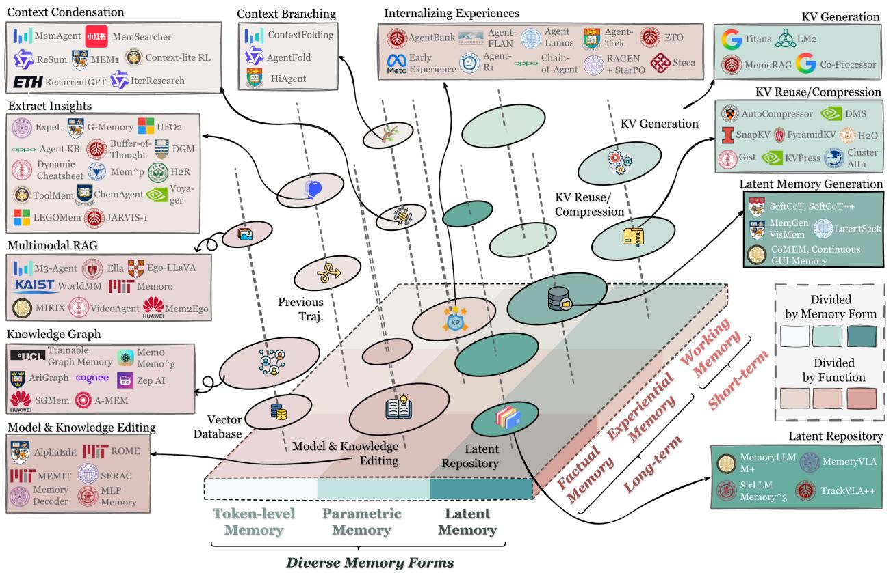
**图1** 按照形式（第3节）、功能（第4节）和动态（第5节）的统一分类法组织的agent memory概览。该图按主要形式和主要功能对memory构件进行定位。它进一步将代表性系统映射到此分类法中，以提供一个整合的景观。

（LLMs）向强大的AI agent的压倒性演进（Matarazzo and Torlone, 2025; Minaee et al., 2025; Luo et al., 2025）。这些基于基础模型的agent已在多个领域展现出显著进展，如深度研究（Xu and Peng, 2025; Zhang et al., 2025o）、软件工程（Wang et al., 2024i）和科学发现（Wei et al., 2025c），不断推动着向人工通用智能（AGI）的轨迹前进（Fang et al., 2025a; Durante et al., 2024）。尽管早期"agent"的概念高度异质，但社区内已逐渐形成共识：除了纯粹的LLM骨干外，一个agent通常装备有诸如推理、规划、感知、memory和工具使用等能力。其中一些能力，如推理和工具使用，已通过强化学习在很大程度上内化到模型参数中（Wang et al., 2025l; Qu et al., 2025b），而另一些仍然严重依赖外部agentic支架。这些组件共同将LLMs从静态的条件生成器转变为可学习的策略，能够与多样化的外部环境交互并随时间自适应演化（Zhang et al., 2025f）。

在这些agentic能力中，memory作为一个基石脱颖而出，明确地使得静态LLMs（其参数无法快速更新）转变为能够通过环境交互持续适应的自适应agent（Zhang et al., 2025r; Wu et al., 2025g）。从应用角度来看，许多领域需要具有主动memory管理能力的agent，而不是短暂、易遗忘的行为：个性化聊天机器人（Chhikara et al., 2025; Li et al., 2025b）、推荐系统（Liu et al., 2025b）、社会模拟（Park et al., 2023; Yang et al., 2025）和金融调查（Zhang et al., 2024）都依赖于agent处理、存储和管理历史信息的能力。从发展的角度来看，AGI研究的核心抱负之一就是赋予agent通过环境交互持续演化的能力（Hendrycks et al., 2025），这一能力从根本上基于agent memory。

Agent Memory需要一个新分类法 鉴于agent memory系统日益增长的重要性和社区关注，为当代agent memory研究提供一个更新的视角既及时又必要。新分类法和综述的动机有两点：1 现有分类法的局限性：尽管最近的一些综述为agent memory提供了有价值且全面的概览（Zhang et al., 2025r; Wu et al., 2025g），但它们的分类法是在许多快速方法进展之前开发的，因此未能完全反映当前研究景观的广度和复杂性。例如，2025年出现的新方向，如从过去经验中蒸馏可重用工具的memory框架（Qiu et al., 2025a,c; Zhao et al., 2025c），或memory增强的测试时缩放方法（Zhang et al., 2025g; Suzgun et al., 2025），在早期的分类方案中仍未充分体现。2 概念碎片化：随着memory相关研究的爆炸性增长，概念本身变得日益广泛和碎片化。研究人员经常发现声称研究"agent memory"的论文在实现、目标和基本假设上存在巨大差异。多样化术语（声明性、情景性、语义性、参数化memory等）的激增进一步模糊了概念清晰度，凸显了对能够统一这些新兴概念的连贯分类法的迫切需求。

因此，本文旨在建立一个系统性的框架，以调和现有定义，连接新兴趋势，并阐明agentic系统中memory的基本原理。具体而言，本综述旨在解决以下关键问题：

# 关键问题

1. agent memory如何定义，它与相关概念如LLM memory、检索增强生成（RAG）和context engineering有何关系？
2. 形式：agent memory可以采取哪些架构或表示形式？
3. 功能：为什么需要agent memory，它服务于哪些角色或目的？
4. 动态：agent memory如何随时间操作、适应和演化？
5. 推进agent memory研究的有希望的前沿是什么？

为了解决问题1，我们首先在第2节为基于LLM的agent和agent memory系统提供正式定义，并详细比较agent memory与LLM memory、RAG和context engineering等相关概念。遵循"形式-功能-动态"三角，我们提供了agent memory的结构化概览。问题2考察memory的架构形式，我们在第3节讨论，重点介绍三种主流实现：token-level、parametric和latent memory。问题3涉及memory的功能角色，在第4节处理，我们在那里区分factual memory（记录agent与用户和环境交互的知识）、experiential memory（通过任务执行逐步增强agent的问题解决能力）和working memory（在单个任务实例期间管理工作空间信息）。问题4关注agent memory的生命周期和操作动态，我们按memory的形成、检索和演化顺序呈现。

在通过"形式-功能-动态"视角调查现有研究之后，我们进一步提供对agent memory研究的观点和见解。为促进知识共享和未来发展，我们首先在第6节总结了关键benchmark和框架资源。在此基础上，我们然后通过在第7节探索几个新兴但未充分发展的研究前沿来解决问题5，包括自动化导向的memory设计、强化学习（RL）的集成、多模态memory、多agent系统的共享memory以及可信性问题。

贡献 本综述的贡献可总结如下：（1）我们从"形式-功能-动态"的角度提出了agent memory的最新多维分类法，为理解该领域的当前发展提供了一个结构化的视角。（2）我们深入讨论了不同memory形式和功能目的的适用性和相互作用，提供了关于各种memory类型如何与不同agentic目标有效对齐的见解。（3）我们调查了agent memory中新兴且有希望的研究方向，从而勾勒出未来的机遇和推进路径。（4）我们汇编了包括benchmark和开源框架在内的全面资源集合，以支持研究人员和从业者进一步探索agent memory系统。

综述大纲 本综述的其余部分组织如下。第2节形式化了基于LLM的agent和agent memory系统，并澄清了它们与相关概念的关系。第3节、第4节和第5节分别考察了agent memory的形式、功能和动态。第6节总结了代表性benchmark和框架资源。第7节讨论了新兴研究前沿和未来方向。最后，我们在第8节以关键见解的总结结束本综述。

# 2 预备知识：形式化Agent与Memory

LLM agent日益成为随时间操作、操纵外部工具以及与人类或其他agent协调的交互式系统的决策核心。为了研究这种环境下的memory，我们首先以涵盖单agent和多agent配置的方式形式化基于LLM的agent系统。然后，我们形式化通过读/写交互与agent决策过程耦合的memory系统，从而统一处理在任务内部（内部试验/短期memory）和跨任务（跨试验/长期memory）出现的memory现象。

# 2.1 基于LLM的Agent系统

Agent与环境 令$\mathcal{I} = \{1,\dots ,N\}$表示agent的索引集，其中$N = 1$对应于单agent情况（例如ReAct），而$N > 1$表示多agent设置，如辩论（Li et al., 2024c）或规划器-执行器架构（Wan et al., 2025）。环境由状态空间$\mathcal{S}$表征。在每个时间步$t$，环境根据一个受控的随机转移模型演化

$$
s _ {t + 1} \sim \Psi (s _ {t + 1} \mid s _ {t}, a _ {t}),
$$

其中$a_{t}$表示在时间$t$执行的动作。在多agent系统中，这种抽象允许顺序决策（每个步骤由单个agent行动）或通过环境介导效应的隐式协调。每个agent$i \in \mathcal{I}$接收一个观察

$$
o _ {t} ^ {i} = O _ {i} (s _ {t}, h _ {t} ^ {i}, \mathcal {Q}),
$$

其中$h_t^i$表示对agent$i$可见的交互历史部分。该历史可能包括先前的消息、中间工具输出、部分推理轨迹、共享工作空间状态或其他agent的贡献，具体取决于系统设计。$\mathcal{Q}$表示任务规范，例如用户指令、目标描述或外部约束，除非另有说明，否则在任务内被视为固定。

动作空间 基于LLM的agent的一个显著特征是其动作空间的异质性。agent不是在纯文本生成上限制动作，而是在多模态和语义结构化的动作空间上操作，包括：

- 自然语言生成，如产生中间推理、解释、响应或指令（Li et al., 2023b; Wu et al., 2024b; Hong et al., 2024; Qian et al., 2024）。
- 工具调用动作，调用外部API、搜索引擎、计算器、数据库、模拟器或代码执行环境（Qin et al., 2025; Li et al., 2025g; Zhou et al., 2023c, 2024c）。
- 规划动作，明确输出任务分解、执行计划或子目标规范以指导后续行为（CAMEL-AI, 2025; Liu et al., 2025f; Pan et al., 2024）。
- 环境控制动作，agent直接操纵外部环境（例如，具身设置中的导航（Shridhar et al., 2021; Wang et al., 2022a）、编辑软件仓库（Jimenez et al., 2024; Aleithan et al., 2024）或修改共享memory缓冲区）。
- 通信动作，通过结构化消息实现与其他agent的协作或协商（Marro et al., 2024）。

这些动作虽然在语义上多样，但统一于它们都是通过基于上下文输入的自回归LLM骨干产生的这一事实。形式上，每个agent$i$遵循一个策略

$$
a _ {t} = \pi_ {i} (o _ {t} ^ {i}, m _ {t} ^ {i}, \mathcal {Q}),
$$

其中$m_t^i$是在第2.2节定义的memory衍生信号。该策略可能在发出可执行动作之前内部生成多步推理链、潜在思考或草稿计算；这些内部过程被抽象化且未明确建模。

交互过程与轨迹 系统的完整执行产生一个轨迹

$$
\tau = \left(s _ {0}, o _ {0}, a _ {0}, s _ {1}, o _ {1}, a _ {1}, \dots , s _ {T}\right),
$$

其中$T$由任务终止条件或系统特定的停止标准确定。在每个步骤，轨迹反映了(i)环境观察、(ii)可选的memory检索、(iii)基于LLM的计算和(iv)驱动下一个状态转换的动作执行的交织。

这个形式化捕捉了广泛的agentic系统类别，从使用工具增强解决推理任务的单个agent到协作开发软件（Qian et al., 2024; Wang et al., 2025k）或进行科学探究（Weng et al., 2025）的角色专业化agent团队。接下来，我们形式化集成到此agent循环中的memory系统。

# 2.2 Agent Memory系统

虽然基于LLM的agent与环境交互，但其瞬时观察$o_{t}^{i}$通常不足以进行有效决策。因此，agent依赖源自先前交互的额外信息，无论是在当前任务内部还是跨先前完成的任务。我们通过统一的agent memory系统形式化这种能力，表示为一个演化的memory状态

$$
\mathcal {M} _ {t} \in \mathbb {M},
$$

其中$\mathbb{M}$表示可允许的memory配置空间。对$\mathcal{M}_t$没有施加特定的内部结构；它可以采用文本缓冲区、键值存储、向量数据库、图结构或任何混合表示形式。在任务开始时，$\mathcal{M}_t$可能已经包含从先前轨迹中蒸馏出的信息（跨试验memory）。在任务执行期间，新信息累积并充当短期、任务特定的memory。两种角色都在单个memory容器内支持，时间区别来自于使用模式而非架构分离。

Memory生命周期：形成、演化与检索。memory系统的动态特征由三个概念操作符表征。

Memory形成。在时间步$t$，agent产生信息构件$\phi_t$，可能包括工具输出、推理轨迹、部分计划、自我评估或环境反馈。一个形成操作符

$$
\mathcal {M} _ {t + 1} ^ {\mathrm {f o r m}} = F (\mathcal {M} _ {t}, \phi_ {t})
$$

选择性地将这些构件转化为memory候选，提取具有潜在未来效用的信息，而不是逐字存储整个交互历史。

Memory演化。形成的memory候选通过一个演化操作符集成到现有的memory基础中

$$
\mathcal {M} _ {t + 1} = E \left(\mathcal {M} _ {t + 1} ^ {\text {f o r m}}\right),
$$

该操作符可以合并冗余条目（Zhao et al., 2024）、解决冲突（Rasmussen et al., 2025; Li et al., 2025k）、丢弃低效用信息（Wang et al., 2025q）或为高效检索重构memory。得到的memory状态在随后的决策步骤和任务中持续存在。

Memory检索。在选择动作时，agent$i$检索一个上下文相关的memory信号

$$
m _ {t} ^ {i} = R (\mathcal {M} _ {t}, o _ {t} ^ {i}, \mathcal {Q}),
$$

其中$R$表示一个检索操作符，构建任务感知查询并返回相关的memory内容。检索到的信号$m_t^i$被格式化为供LLM策略直接消费，例如作为文本片段的序列或结构化摘要。

Agent循环中的时间角色。虽然memory被表示为统一状态$\mathcal{M}_t$，但三个生命周期操作符（形成$F$、演化$E$和检索$R$）不需要在每个时间步都调用。相反，不同的memory效应源于不同的时间调用模式。例如，一些系统仅在任务初始化时执行一次检索，

$$
m _ {t} ^ {i} = \left\{ \begin{array}{l l} R (\mathcal {M} _ {0}, o _ {0} ^ {i}, \mathcal {Q}), & t = 0, \\ \bot , & t > 0, \end{array} \right.
$$

其中$\perp$表示空检索策略。其他系统可能基于上下文触发器间歇或连续检索memory。类似地，memory形成可能范围从原始观察的最小累积，

$$
\mathcal {M} _ {t + 1} ^ {\mathrm {f o r m}} = \mathcal {M} _ {t} \cup \{o _ {t} ^ {i} \},
$$

到可重用模式或抽象的复杂提取和精炼。因此，在任务内部，短期memory效应可能源于轻量级日志记录，就像在Yao et al. (2023b); Chen et al. (2023a)中一样，也可能源于更精细的迭代精炼（Hu et al., 2025a）；跨任务，长期memory可能在任务边界处偶发更新或在整个操作过程中持续更新。因此，短期和长期memory现象并非来自离散的架构模块，而是源于形成、演化和检索参与的时间模式。

Memory-Agent耦合。memory与agent决策过程之间的交互类似地灵活。一般而言，agent策略写作

$$
a _ {t} = \pi_ {i} (o _ {t} ^ {i}, m _ {t} ^ {i}, \mathcal {Q}),
$$

其中检索到的memory信号$m_t^i$可能根据检索计划存在或不存在。当在给定步骤禁用检索时，$m_t^i$可以视为一个特殊的空输入。

因此，整体agent循环包括观察环境、可选地检索memory、计算动作、接收反馈以及可选地通过形成和演化更新memory。不同的agent实现以不同的时间频率实例化这些操作的不同子集，从而产生从被动缓冲区到主动演化知识库的memory系统。

# 2.3 比较Agent Memory与其他关键概念

尽管对具有memory的agentic系统的兴趣日益增长，但社区对什么构成agent memory的理解仍然碎片化。在实践中，研究人员和从业者经常将agent memory与相关构造如LLM memory（Wu et al., 2025g）、检索增强生成（RAG）（Gao et al., 2024）和context engineering（Mei et al., 2025）混淆。尽管这些概念在LLM驱动系统中信息如何管理和利用的参与方面本质上相互关联，但它们在范围、时间特征和功能角色上有所不同。

这些重叠但不同的概念导致了文献和实践中的模糊性。为了澄清这些区别并将agent memory置于这一更广泛的景观中，我们在后续小节中研究agent memory如何与LLM memory、RAG和context engineering相关和分歧。图2通过韦恩图可视化了这些领域之间的共同点和区别。

# 2.3.1 Agent Memory与LLM Memory

在高层面上，agent memory几乎完全包含了传统上称为LLM memory的内容。自2023年以来，许多描述自己为"LLM memory机制"的工作（Zhong et al., 2024; Packer et al., 2023a; Wang et al., 2023b）在当代术语下更恰当地被解释为

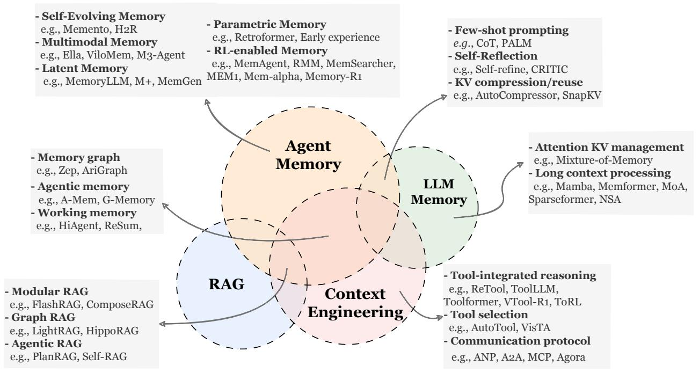
**图2** Agent Memory与LLM Memory、RAG和Context Engineering的概念比较。该图说明了共享的技术实现（例如KV重用、图检索），同时突出了根本区别：与LLM Memory的架构优化、RAG的静态知识访问或Context Engineering的瞬态资源管理不同，Agent Memory独特地以其专注于维护一个集成事实知识和经验的持久且自我演化的认知状态为特征。所列类别和示例是说明性的而非严格平行，作为代表性参考点来澄清概念关系而非定义严格的分类法。

agent memory的早期实例。这种重新解释源于围绕"LLM agent"这一概念本身的历史模糊性。在2023-2024年期间，社区没有稳定或连贯的定义：在某些情况下，提示LLM调用计算器就足以将系统限定为agent（Wu et al., 2024c）；在其他情况下，agency需要更丰富的能力，如显式规划、工具使用、memory和反思推理（Ruan et al., 2023）。直到最近，才开始出现更统一和结构化的定义（例如，基于LLM的agent = LLM + 推理 + 规划 + memory + 工具使用 + 自我改进 + 多轮交互 + 感知，如Zhang et al. (2025f)所述），尽管这个表述也并非普遍适用。在这种历史背景下，早期系统如MemoryBank（Zhong et al., 2024）和MemGPT（Packer et al., 2023a）将其贡献框架化为提供LLM memory。然而它们从根本上解决的是经典的agentic挑战，例如使基于LLM的会话agent能够跟踪用户偏好、维护对话状态信息并在多轮交互中积累经验。在现代且更成熟的agency理解下，这样的系统自然被归类为agent memory的实例。

也就是说，这种包含并非绝对。一个独特的研究线路真正关注LLM内部memory：管理transformer的键值（KV）缓存、设计长上下文处理机制或修改模型架构（例如RWKV（Peng et al., 2023）、Mamba（Gu and Dao, 2024; Lieber et al., 2024）、基于扩散的LMs（Nie et al., 2025））以在序列长度增长时更好地保留信息。这些工作侧重于内在模型动态，通常处理不需要agentic行为的任务，因此应被视为超出agent memory范围。

重叠。在我们的分类法中，历史上称为"LLM memory"的大部分内容对应于agent memory的形式。诸如少样本提示（Prabhumoye et al., 2022; Ma et al., 2023a）等技术可以被视为一种长期memory形式，其中过去的示例或蒸馏的任务摘要通过检索或上下文注入作为可重用知识纳入。自我反思和迭代精炼方法（Madaan et al., 2023; Mousavi et al., 2023; Han et al., 2025c）自然地与短期、内部试验memory对齐，因为agent在同一任务内反复利用中间推理轨迹或先前尝试的结果。即使$KV$压缩和上下文窗口管理（Yoon et al., 2024; Jiang et al., 2023），当用于在单个任务过程中保留显著信息时，也在agentic意义上充当短期memory机制。这些技术都支持agent在任务执行过程中积累、转换和重用信息的能力。

区别。相比之下，直接干预模型内部状态的memory机制——例如用于更长有效上下文的架构修改、缓存重写策略、循环状态持久性、注意力稀疏机制或外部化KV存储扩展——更恰当地分类为LLM memory而非agent memory。它们的目标是扩展或重组底层模型的表示能力，而不是为决策agent提供一个演化的外部memory基础。它们通常不支持跨任务持久性、环境驱动的适应或故意的memory操作（例如形成、演化、检索），因此超出了本综述定义的agent memory的操作范围。

# 2.3.2 Agent Memory与RAG

在概念层面上，agent memory和检索增强生成（RAG）展现出实质性的重叠：两个系统都构建、组织和利用辅助信息存储来扩展LLM/agent超越其原生参数化知识的能力。例如，诸如知识图和索引策略等结构化表示出现在两个社区的方法中，而agentic RAG的最新发展展示了自主检索机制如何以让人想起agent memory架构的方式与动态数据库交互（Singh et al., 2025）。确实，支撑许多RAG和agent memory系统的工程栈共享共同的构建块，包括向量索引、语义搜索和上下文扩展模块。

尽管有这些技术趋同，但两个范式历史上一直以它们应用的上下文来区分。经典RAG技术主要通过静态知识源来增强LLM，无论是平面文档存储、结构化知识库还是外部索引的大型语料库以支持按需检索（Zhang et al., 2025p; Han et al., 2025b）。这些系统旨在基于最新事实进行生成，减轻幻觉并提高知识密集型任务的准确性，但它们通常不维护过去交互的内部演化memory。相比之下，agent memory系统在agent与环境持续交互中实例化，不断将agent自身行动和环境反馈产生的新信息纳入持久的memory基础中（Wang et al., 2024l; Zhao et al., 2024; Sun et al., 2025d）。

在早期表述中，RAG与agent memory之间的区别相对清晰：RAG从外部维护的知识中检索以进行单次任务调用，而agent memory在多重轮次、多重任务交互中演化。然而，随着检索系统本身变得越来越动态，这个边界变得越来越模糊。例如，某些检索任务在迭代查询过程中不断更新相关上下文（例如，多跳问答设置，其中相关上下文逐步添加）。有趣的是，诸如HippoRAG/HippoRAG2（Gutierrez et al., 2024; Gutierrez et al., 2025）等系统被RAG和memory社区都解释为解决LLMs长期memory挑战的方案。因此，一个更实用（尽管不完全可分离）的区别在于任务领域。RAG主要应用于为单个推理任务用大型外部来源的上下文增强LLMs，以经典的多跳和知识密集型benchmark为例，如HotpotQA（Yang et al., 2018）、2WikiMQA（Ho et al., 2020）和MuSiQue（Trivedi et al., 2022）。相比之下，agent memory系统通常在需要持续多轮交互、时间依赖性或环境驱动适应的设置中评估。代表性benchmark包括长上下文对话评估，如LoCoMo（Maharana et al., 2024）和LongMemEval（Wu et al., 2025a），复杂问题解决和深度研究benchmark如GAIA（Mialon et al., 2023）、XBench（Chen et al., 2025b）和BrowseComp（Wei et al., 2025b），以代码为中心的agentic任务如SWE-bench Verified（Jimenez et al., 2024），以及终身学习benchmark如StreamBench（Wu et al., 2024a）。我们在第6.1节提供了memory相关benchmark的全面总结。

尽管如此，即使这种基于领域的区别也包含大量灰色区域。许多自称为agent memory系统的工作在长文档问答任务（如HotpotQA（Wang et al., 2025g,o））下进行评估，而许多突出为RAG系统的论文实际上实现了agentic自我改进的形式，不断随时间蒸馏和精炼知识或技能。因此，标题、方法论和实证评估经常模糊两个范式之间的概念边界。为了进一步澄清这些关系，以下三段借鉴了（Mei et al., 2025）中建立的RAG分类法：模块化RAG、图RAG和agentic RAG，并检查与每个谱系相关的核心技术如何在RAG和agent memory系统中体现。

模块化RAG 模块化RAG指的是检索流水线被分解为明确指定组件的架构，例如索引、候选检索、重排序、过滤和上下文组装，这些组件以大致静态和流水线方式操作（Singh et al., 2025）。这些系统将检索视为一个精心设计的、模块化的子系统，外部于LLM，主要用于在推理期间向模型的上下文窗口注入相关知识。在agent memory视角中，相应的技术通常出现在检索阶段，其中memory访问通过向量搜索、语义相似性匹配或基于规则的过滤实现，如流行的agent memory框架如Memory（Memory, 2025）、MemOS（Li et al., 2025k）和Mem0（Chhikara et al., 2025）中所见。

图RAG 图RAG系统将知识库构建为图，范围从知识图到概念图或文档-实体关系，并利用图遍历或基于图的排序算法检索上下文（Peng et al., 2024）。这种表示支持多跳关系推理，已被证明对知识密集型任务有效（Edge et al., 2025; Han et al., 2025b; Dong et al., 2025a）。在agent memory的上下文中，当agent随时间积累关系见解时，图结构memory自然出现，例如连接概念、跟踪子任务之间的依赖关系或记录通过交互推断的因果关系。几个成熟的实践包括Mem$0^{g}$（Chhikara et al., 2025）、A-MEM（Xu et al., 2025c）、Zep（Rasmussen et al., 2025）和G-memory（Zhang et al., 2025c）。值得注意的是，基于图的agent memory系统可能在agent操作期间构建、扩展或重组其内部图。因此，基于图的检索构成了两个范式的结构骨干，但只有agent memory将图视为活的、演化的经验表示。我们在第3.1.2节对基于图的memory形式提供了进一步分析，并参考了相关综述（Liu et al., 2025g）。

Agentic RAG Agentic RAG将检索集成到自主决策循环中，其中LLM agent主动控制何时、如何以及检索什么（Singh et al., 2025; Sun et al., 2025d）。这些系统通常采用迭代查询、多步规划或自导向搜索过程，使agent能够通过深思熟虑的推理来精炼其信息需求，如PlanRAG（Lee et al., 2024b）和Self-RAG（Asai et al., 2023）中实现。关于agentic RAG的更多详细理解，我们推荐读者参考Singh et al. (2025)。从agent memory的角度看，agentic RAG占据了最接近的概念空间：两个系统都涉及与外部信息存储的自主交互，都支持多步精炼，并且都可能将检索到的见解纳入后续推理。关键区别在于，经典agentic RAG通常在外部且通常是任务特定的数据库上操作，而agent memory维护一个内部、持久且自我演化的memory基础，跨任务积累知识（Yan et al., 2025a; Xu et al., 2025c）。

# 2.3.3 Agent Memory与Context Engineering

agent memory和context engineering之间的关系最好理解为不同操作范式之间的交集，而非层级包含。Context engineering是一种系统化的设计方法论，将上下文窗口视为受限的计算资源。它严格优化信息负载，包括指令、知识、状态和memory，以缓解大规模输入容量与模型生成能力之间的不对称性（Mei et al., 2025）。虽然agent memory侧重于具有演化身份的持久实体的认知建模，但context engineering在资源管理范式下运作。从context engineering的角度看，agent memory仅仅是上下文组装函数中的一个变量，需要高效调度以最大化推理效能。反之，从agent的角度看，context engineering作为实现层，确保认知连续性保持在底层模型的物理限制内。

重叠 这两个领域在长时程交互中working memory的技术实现方面显著趋同，并且通常采用功能相同的机制来解决有限上下文窗口带来的约束（Hu et al., 2025a; Zhang et al., 2025q; Kang et al., 2025c; Yu et al., 2025a）。两种范式都依赖先进的信息压缩（Zhou et al., 2025b; Wu et al., 2025f）、组织（Xu et al., 2025c; Zhang et al., 2025c; Anokhin et al., 2024）和选择（Zhang et al., 2025q）技术，以在扩展的交互序列中保持操作连续性。例如，token修剪和基于重要性的选择方法（Jiang et al., 2023; Li et al., 2023c）是context engineering框架的核心，通过在agentic memory系统中过滤噪声和保留显著信息发挥基础作用。类似地，滚动摘要技术作为一个共享的基础原语，同时作为缓冲区管理策略和瞬态情景memory机制（Yu et al., 2025a; Lu et al., 2025b）。在实践中，在这些场景中，工程化上下文和维护agent的短期memory之间的边界实际上消失了，因为两者都依赖于相同的底层摘要、动态信息检索和递归状态更新（Tang et al., 2025b; Yoon et al., 2024）。

区别 当超越短期文本处理转向更广泛的长生命周期agent时，区别最为明显。Context engineering主要解决LLMs与其操作环境之间交互接口的结构组织。这包括优化工具集成推理和选择流水线（Qin et al., 2024a; Schick et al., 2023; Jia and Li, 2025）以及标准化通信协议，如MCP（Qiu et al., 2025c）。这些方法侧重于确保指令、工具调用和中间状态在上下文窗口的约束内正确格式化、高效调度和可执行。因此，context engineering在资源分配和接口正确性层面操作，强调句法有效性和执行效率。

相比之下，agent memory定义了一个实质上更广泛的认知范围。超越瞬态上下文组装，它涵盖事实性知识的持久存储（Zhong et al., 2024）、经验轨迹的积累和演化（Zhao et al., 2024; Tang et al., 2025d; Zhang et al., 2025d），以及在某些情况下将memory内化到模型参数中（Wang et al., 2025n）。Agent memory不是管理信息在推理时如何呈现给模型，而是管理agent知道什么、经历了什么，以及这些元素如何随时间演化。这包括将重复交互巩固为知识（Tan et al., 2025c）、从过去的成功和失败中抽象出程序性知识（Ouyang et al., 2025），以及在任务和情节间维护一致的身份（Wang et al., 2024f）。

从这个角度看，context engineering构建了在资源约束下实现感知和行动的外部支架，而agent memory构成了支持学习、适应和自主性的内部基础。前者优化了agent与模型之间的瞬时接口，而后者维持了一个超越任何单个上下文窗口的持久认知状态。

# 3 形式：什么承载Memory？

作为组织先前工作的起点，我们首先审视agent memory可以构建的最基本表示单元。我们首先尝试回答：agent memory可以采取哪些架构或表示形式？

在不同的agent系统中，memory并非通过单一、统一的结构实现。相反，不同的任务设置需要不同的存储形式，每种形式都有其自身的结构特性。这些架构赋予memory独特的能力，塑造agent如何在交互中积累信息并保持行为一致性。它们最终使memory能够在各种任务场景中实现其预期角色。

基于memory驻留的位置和表示的形式，我们将这些memory组织为三个类别：

# 三种主要Memory形式

1. Token-level Memory（第3.1节）：Memory组织为明确且离散的单元，可以单独访问、修改和重构。这些单元保持外部可见，并可以随时间以结构化形式存储。
2. Parametric Memory（第3.2节）：Memory存储在模型参数内，其中信息通过参数空间的统计模式编码，并在前向计算中隐式访问。
3. Latent Memory（第3.3节）：Memory表示在模型的内部隐藏状态、连续表示或演化的潜在结构中。它可以在推理期间或跨交互周期持续存在和更新，捕捉上下文依赖的内部状态。

上述三种memory形式建立了理解"什么承载memory"的核心结构框架。每种形式以自己的方式组织、存储和更新信息，产生不同的表示模式和行为操作。有了这种结构分类法，我们可以更系统地研究为什么agent需要memory（第4节）以及memory如何在持续交互中演化、适应和塑造agent行为（第5节）。这种分类为后续讨论提供了概念基础。

# 3.1 Token-level Memory

# Token-level Memory的定义

Token-level memory将信息存储为持久、离散的单元，这些单元外部可访问且可检查。这里的token是一个广泛的表示概念：除了文本token，它包括视觉token、音频帧——任何可以在模型参数外部写入、检索、重组和修订的离散元素。

因为这些单元是明确的，token-level memory通常是透明的、易于编辑和直接解释的，使其成为检索、路由、冲突处理以及与parametric和latent memory协调的自然层。Token-level memory也是最常见的memory形式，也是现有工作最多的形式。

尽管所有token-level memory都具有作为离散单元存储的特性，但它们在如何组织这些单元方面存在显著差异。存储token的结构组织在决定agent如何高效搜索、更新或推理过去信息方面发挥核心作用。为描述这些差异，我们按单元间结构组织对token-level memory进行分类，从无显式拓扑到多层拓扑：

# Token-level Memory的三种主要类型

1. Flat Memory（1D）：无显式单元间拓扑。Memory作为序列或单元袋（例如片段、轨迹、块）积累。
2. Planar Memory（2D）：单层内的结构化但单层组织：单元通过图、树、表等关联，无跨层关系。结构明确，但未分层。
3. Hierarchical Memory（3D）：跨多个层结构化，具有层间链接，形成体积或分层memory。

这三种token-level memory类型在图3中清晰说明。从无拓扑的Flat memory，到具有单层结构组织的Planar memory，再到具有多层互联结构的Hierarchical memory，这种组织谱系不仅支配着token-level memory如何支持搜索，

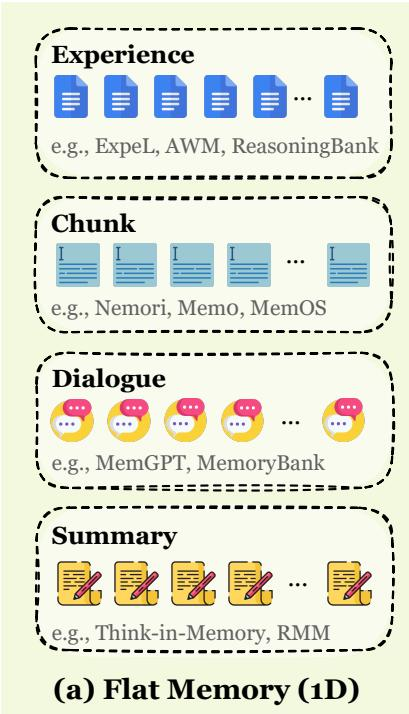
**图3** 按拓扑复杂性和维度组织的token-level memory分类法：(a) Flat Memory（1D）将信息存储为线性序列或独立簇，无显式单元间拓扑，通常用于块集、对话日志和经验池。(b) Planar Memory（2D）引入单层结构化布局，其中单元通过树或图结构链接以捕获关系依赖，支持图像和聊天记录等多样化节点类型。(c) Hierarchical Memory（3D）采用多级形式，如金字塔或多层图，以促进不同数据粒度（如原始文档和合成问答）之间的垂直抽象和跨层推理。

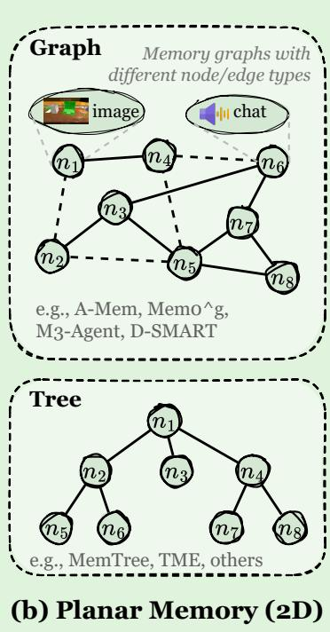

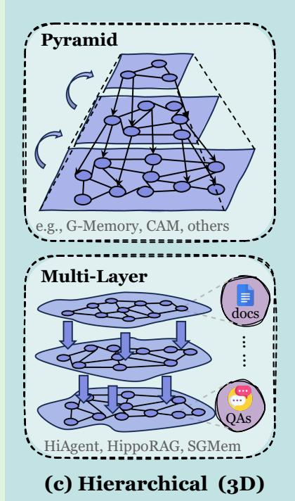

更新和推理，而且支配memory本身如何结构化以及它提供什么能力。在后续小节中，我们从优势、局限性、典型用例和代表性工作方面介绍每种组织形式。代表性token-level memory方法的总结和比较见表1。
需要指出的是，受ReAct（Yao et al., 2023b）思想启发，一系列研究开始关注长时程交互任务（Song et al., 2025a; Jin et al., 2025; Li et al., 2025g,e,i; Wu et al., 2025b）。其中许多任务引入了显式的memory概念，并且由于memory通常以明文形式存储，它们属于token-level memory的范畴。这些研究大多强调如何压缩或折叠累积的交互轨迹，以使agent能够在长序列上操作而不超过上下文限制（Zhou et al., 2025b; Zhang et al., 2025q; Wu et al., 2025f; Sun et al., 2025a; Li et al., 2025h; Chen et al., 2025a）。关于working memory的更详细讨论见第4.3节。

# 3.1.1 Flat Memory（1D）

# Flat（1D）Memory的定义

Flat Memory将信息存储为离散单元的累积，而不显式建模单元间的语义或关系依赖。这些单元可能包括文本块、用户配置文件、经验轨迹、其对应的向量表示或多模态条目。这些单元之间的关系并未直接在memory中编码。

为了清晰连贯地呈现，我们根据主要设计目标和技术重点对flat memory的先前工作进行分组。这种分组服务于组织目的，并不意味着由此产生的类别严格平行或互斥。在实践中，某些方法可能适用于多个类别，并且当多模态不是其核心焦点时，一些涉及多模态信息的方法可能会在其他章节讨论。这样的组织使我们能够系统性地回顾文献，同时保持解释的灵活性。

**表1** 代表性token-level memory方法的比较。我们根据拓扑复杂性将现有工作分为三组：Flat Memory（1D）用于线性或独立记录，Planar Memory（2D）用于结构化单层图/树，Hierarchical Memory（3D）用于多层架构。方法通过四个维度进行表征：（1）Multi表示多模态能力，其中$\checkmark$表示支持文本以外的模态（例如视觉），$\times$表示仅支持文本；（2）Type标识memory的特定功能类别（例如，Fact表示事实性memory，Exp表示经验性memory，Work表示工作memory）；（3）Memory Form详述存储单元的内容；（4）Task列出主要应用领域。

<table>
<tr><td>Method</td><td>Multi</td><td>Type</td><td>Memory Form</td><td>Task</td></tr>
<tr><td colspan="5">Flat Memory Models</td></tr>
<tr><td>Reflexion (Shinn et al., 2023b)</td><td>×</td><td>E&W</td><td>轨迹作为短期memory，反馈作为长期memory</td><td>问答、推理、代码</td></tr>
<tr><td>Memento (Zhou et al., 2025a)</td><td>×</td><td>Exp</td><td>轨迹案例（成功/失败）</td><td>推理</td></tr>
<tr><td>JARVIS-1 (Wang et al., 2025p)</td><td>✓</td><td>Exp</td><td>计划-环境对</td><td>游戏</td></tr>
<tr><td>Expel (Zhao et al., 2024)</td><td>×</td><td>Exp</td><td>见解和少样本示例</td><td>推理</td></tr>
<tr><td>Buffer of Thoughts (Yang et al., 2024b)</td><td>×</td><td>Exp</td><td>高级思维模板</td><td>游戏、推理、代码</td></tr>
<tr><td>SAGE (Liang et al., 2025)</td><td>×</td><td>Exp</td><td>具有遗忘机制的双存储</td><td>游戏、推理、代码</td></tr>
<tr><td>ChemAgent (Tang et al., 2025c)</td><td>×</td><td>Exp</td><td>结构化子任务和原则</td><td>化学</td></tr>
<tr><td>AgentKB (Tang et al., 2025d)</td><td>×</td><td>Exp</td><td>5元组经验节点</td><td>代码、推理</td></tr>
<tr><td>H2R (Ye et al., 2025b)</td><td>×</td><td>Exp</td><td>规划与执行层</td><td>游戏、具身模拟</td></tr>
<tr><td>AWM (Wang et al., 2024l)</td><td>×</td><td>Exp</td><td>抽象通用工作流</td><td>网络</td></tr>
<tr><td>PRINCIPLES (Kim et al., 2025a)</td><td>×</td><td>Exp</td><td>自玩生成的规则模板</td><td>情感陪伴</td></tr>
<tr><td>ReasoningBank (Ouyang et al., 2025)</td><td>×</td><td>Exp</td><td>可迁移推理策略项</td><td>网络</td></tr>
<tr><td>Voyager (Wang et al., 2024b)</td><td>✓</td><td>Exp</td><td>可执行技能代码库</td><td>游戏</td></tr>
<tr><td>DGM (Zhang et al., 2025h)</td><td>×</td><td>Exp</td><td>递归自修改代码库</td><td>代码</td></tr>
<tr><td>Memp (Fang et al., 2025d)</td><td>×</td><td>Exp</td><td>指令和抽象脚本</td><td>具身模拟、旅行规划</td></tr>
<tr><td>UFO2 (Zhang et al., 2025a)</td><td>✓</td><td>Exp</td><td>系统文档和交互记录</td><td>Windows操作系统</td></tr>
<tr><td>LEGOMem (Han et al., 2025a)</td><td>×</td><td>Exp</td><td>向量化任务轨迹</td><td>办公</td></tr>
<tr><td>ToolMem (Xiao et al., 2025b)</td><td>×</td><td>Exp</td><td>工具能力</td><td>工具调用</td></tr>
<tr><td>SCM (Wang et al., 2025a)</td><td>×</td><td>Fact</td><td>记忆流和向量数据库</td><td>长上下文</td></tr>
<tr><td>MemoryBank (Zhong et al., 2024)</td><td>×</td><td>Fact</td><td>历史和用户配置文件</td><td>情感陪伴</td></tr>
<tr><td>MPC (Lee et al., 2023)</td><td>×</td><td>Fact</td><td>人设和摘要向量池</td><td>问答</td></tr>
<tr><td>RecMind (Wang et al., 2024h)</td><td>×</td><td>Fact</td><td>用户元数据和外部知识</td><td>推荐</td></tr>
<tr><td>InteRecAgent (Huang et al., 2025d)</td><td>×</td><td>Fact</td><td>用户配置文件和候选项目</td><td>推荐</td></tr>
<tr><td>Ego-LLaVA (Shen et al., 2024)</td><td>✓</td><td>Fact</td><td>语言编码的块嵌入</td><td>多模态问答</td></tr>
<tr><td>ChatHarui (Li et al., 2023a)</td><td>×</td><td>Fact</td><td>来自媒体的对话数据库</td><td>角色扮演</td></tr>
<tr><td>Memochat (Lu et al., 2023)</td><td>×</td><td>Fact</td><td>备忘录和分类对话历史</td><td>长对话问答</td></tr>
<tr><td>RecursiveSum (Wang et al., 2025h)</td><td>×</td><td>Fact</td><td>短对话的递归摘要</td><td>长对话问答</td></tr>
<tr><td>MemGPT (Packer et al., 2023a)</td><td>×</td><td>Fact</td><td>虚拟memory（主/外部上下文）</td><td>长对话问答、文档问答</td></tr>
<tr><td>RoleLLM (Wang et al., 2024d)</td><td>×</td><td>Fact</td><td>角色特定问答对</td><td>角色扮演</td></tr>
<tr><td>Think-in-memory (Liu et al., 2023a)</td><td>×</td><td>Fact</td><td>归纳思维的哈希表</td><td>长对话问答</td></tr>
<tr><td>PLA (Yuan et al., 2025b)</td><td>×</td><td>Fact</td><td>历史和摘要的演化记录</td><td>问答、人类反馈</td></tr>
<tr><td>COMEDY (Chen et al., 2025c)</td><td>×</td><td>Fact</td><td>单模型压缩memory格式</td><td>摘要、压缩、问答</td></tr>
<tr><td>Memoro (Zulfikar et al., 2024)</td><td>✓</td><td>Fact</td><td>语音到文本向量嵌入</td><td>用户研究</td></tr>
<tr><td>Memory Sharing (Gao and Zhang, 2024a)</td><td>×</td><td>Fact</td><td>查询-响应对检索</td><td>文学创作、逻辑、计划生成</td></tr>
<tr><td>Conv Agent(Alonso et al., 2024)</td><td>×</td><td>Fact</td><td>链式表和向量条目</td><td>问答</td></tr>
<tr><td>EM-LLM (Fountas et al., 2025)</td><td>×</td><td>Fact</td><td>具有贝叶斯边界的情景事件</td><td>长上下文</td></tr>
<tr><td>Memocrats (Xi et al., 2024a)</td><td>×</td><td>Fact</td><td>用户元数据和知识</td><td>推荐</td></tr>
<tr><td>SECOM (Pan et al., 2025)</td><td>×</td><td>Fact</td><td>段落级分段块</td><td>长对话问答</td></tr>
<tr><td>Mem0 (Chhikara et al., 2025)</td><td>×</td><td>Fact</td><td>摘要和原始对话</td><td>长对话问答</td></tr>
<tr><td colspan="5">（接下页）</td></tr>
</table>

**表1**（续）代表性token-level memory方法的比较。我们根据拓扑复杂性将现有工作分为三组：Flat Memory（1D）用于线性或独立记录，Planar Memory（2D）用于结构化单层图/树，Hierarchical Memory（3D）用于多层架构。方法通过四个维度进行表征：（1）Multi表示多模态能力，其中$\checkmark$表示支持文本以外的模态（例如视觉），$\times$表示仅支持文本；（2）Type标识memory的特定功能类别（例如，Fact表示事实性memory，Exp表示经验性memory，Work表示工作memory）；（3）Memory Structure详述存储单元的组织机制；（4）Task列出主要应用领域。

<table>
<tr><td>Method</td><td>Multi</td><td>Type</td><td>Memory Structure</td><td>Task</td></tr>
<tr><td>RMM (Tan et al., 2025c)</td><td>×</td><td>Fact</td><td>反思组织的平面条目</td><td>个性化</td></tr>
<tr><td>MEMENTO (Kwon et al., 2025)</td><td>✓</td><td>Fact</td><td>交互历史条目</td><td>个性化</td></tr>
<tr><td>MemGuide (Du et al., 2025b)</td><td>×</td><td>Fact</td><td>对话衍生的问答对</td><td>长对话问答</td></tr>
<tr><td>MIRIX (Wang and Chen, 2025)</td><td>✓</td><td>Fact</td><td>六种优化的平面memory类型</td><td>长对话问答</td></tr>
<tr><td>SemanticAnchor (Chatterjee and Agarwal, 2025)</td><td>×</td><td>Fact</td><td>句法5元组结构</td><td>长对话问答</td></tr>
<tr><td>MMS (Zhang et al., 2025b)</td><td>×</td><td>Fact</td><td>双重检索和上下文单元</td><td>长对话问答</td></tr>
<tr><td>Memory-R1 (Yan et al., 2025b)</td><td>×</td><td>Fact</td><td>RL管理的mem0架构</td><td>长对话问答</td></tr>
<tr><td>ComoRAG (Wang et al., 2025f)</td><td>×</td><td>Fact</td><td>带探针的事实/语义/情节单元</td><td>叙事问答</td></tr>
<tr><td>Nemori (Nan et al., 2025)</td><td>×</td><td>Fact</td><td>预测性校准存储</td><td>长对话问答</td></tr>
<tr><td>Livia (Xi and Wang, 2025)</td><td>✓</td><td>Fact</td><td>修剪的交互历史</td><td>情感陪伴</td></tr>
<tr><td>MOOM (Chen et al., 2025d)</td><td>×</td><td>Fact</td><td>解耦的情节和角色存储</td><td>角色扮演</td></tr>
<tr><td>Mem-α (Wang et al., 2025o)</td><td>×</td><td>Fact</td><td>核心、语义和情景memory</td><td>memory管理</td></tr>
<tr><td>Personalized Long term Interaction (Westhäufiger et al., 2025)</td><td>×</td><td>Fact</td><td>分层历史和摘要</td><td>个性化</td></tr>
<tr><td>LightMem (Fang et al., 2025b)</td><td>×</td><td>Fact</td><td>优化的长/短期存储</td><td>长对话问答</td></tr>
<tr><td>MEXTRA (Wang et al., 2025b)</td><td>×</td><td>Fact</td><td>提取的原始对话数据</td><td>隐私攻击</td></tr>
<tr><td>MovieChat (Song et al., 2024)</td><td>✓</td><td>Fact</td><td>短期特征和长期持久性</td><td>视频理解</td></tr>
<tr><td>MA-LMM (He et al., 2024)</td><td>✓</td><td>Fact</td><td>视觉和查询memory库</td><td>视频理解</td></tr>
<tr><td>VideoAgent (Wang et al., 2024g)</td><td>✓</td><td>Fact</td><td>时间文本描述和对象追踪</td><td>视频理解</td></tr>
<tr><td>KARMA (Wang et al., 2025q)</td><td>✓</td><td>Fact</td><td>3D场景图和动态对象状态</td><td>具身任务</td></tr>
<tr><td>Embodied VideoAgent (Fan et al., 2025)</td><td>✓</td><td>Fact</td><td>持久对象和传感器存储</td><td>多模态</td></tr>
<tr><td>Mem2Ego (Zhang et al., 2025l)</td><td>✓</td><td>Fact</td><td>地图、地标和访问位置存储</td><td>具身导航</td></tr>
<tr><td>Context-as-Memory (Yu et al., 2025b)</td><td>✓</td><td>Fact</td><td>生成的上下文帧</td><td>视频生成</td></tr>
<tr><td>RCR-Router (Liu et al., 2025c)</td><td>×</td><td>Fact</td><td>预算感知语义子集</td><td>问答</td></tr>
</table>

**Planar Memory Models**

<table>
<tr><td>D-SMOTE (Lei et al., 2025)</td><td>×</td><td>Fact</td><td>带推理树的结构化memory</td><td>长对话问答</td></tr>
<tr><td>Reflexion (Shinn et al., 2023b)</td><td>×</td><td>Work</td><td>来自经验的反思文本缓冲区</td><td>问答、推理、代码</td></tr>
<tr><td>PREMem (Kim et al., 2025b)</td><td>×</td><td>Fact</td><td>动态跨会话链接三元组</td><td>长对话问答</td></tr>
<tr><td>Query Reconstruct (Xu et al., 2025b)</td><td>×</td><td>Exp</td><td>从知识库构建的逻辑图</td><td>知识图谱问答</td></tr>
<tr><td>KGT (Sun et al., 2024)</td><td>×</td><td>Fact</td><td>来自查询和反馈的KG节点</td><td>问答</td></tr>
<tr><td>Optimus-1 (Li et al., 2024d)</td><td>✓</td><td>F&E</td><td>知识图谱和经验池</td><td>游戏</td></tr>
<tr><td>SALI (Pan et al., 2024)</td><td>✓</td><td>Exp</td><td>带空间节点的拓扑图</td><td>导航</td></tr>
<tr><td>HAT (A et al., 2024)</td><td>×</td><td>Fact</td><td>分层聚合树</td><td>长对话问答</td></tr>
<tr><td>MemTree (Rezazadeh et al., 2025c)</td><td>×</td><td>Fact</td><td>动态分层对话树</td><td>长对话问答</td></tr>
<tr><td>TeaFarm (iunn Ong et al., 2025)</td><td>×</td><td>Fact</td><td>连接memory的因果边</td><td>长对话问答</td></tr>
<tr><td>COMET (Kim et al., 2024b)</td><td>×</td><td>Fact</td><td>通过图的上下文感知memory</td><td>长对话问答</td></tr>
<tr><td>Intrinsic Memory (Yuen et al., 2025)</td><td>×</td><td>Fact</td><td>私有内部和共享外部memory</td><td>规划</td></tr>
<tr><td>A-MEM (Xu et al., 2025c)</td><td>×</td><td>Fact</td><td>卡片式连接memory</td><td>长对话问答</td></tr>
<tr><td>Ret-LLM (Modarressi et al., 2023)</td><td>×</td><td>Fact</td><td>三元组表和LSH向量</td><td>问答</td></tr>
<tr><td>HuaTuo (Wang et al., 2023a)</td><td>×</td><td>Fact</td><td>医学知识图谱</td><td>医学问答</td></tr>
<tr><td>M3-Agent (Long et al., 2025)</td><td>✓</td><td>Fact</td><td>图结构中的多模态节点</td><td>具身问答</td></tr>
</table>

**Hierarchical Memory Models**

<table>
<tr><td>GraphRAG (Edge et al., 2025)</td><td>×</td><td>Fact</td><td>多层次社区图索引</td><td>问答、摘要</td></tr>
<tr><td>H-Mem (Sun and Zeng, 2025)</td><td>×</td><td>Fact</td><td>解耦的索引层和内容层</td><td>长对话问答</td></tr>
<tr><td>EMG-RAG (Wang et al., 2024k)</td><td>×</td><td>Fact</td><td>三层memory图</td><td>问答</td></tr>
<tr><td colspan="5">（接下页）</td></tr>
</table>

**表1**（续）代表性token-level memory方法的比较。我们根据拓扑复杂性将现有工作分为三组：Flat Memory（1D）用于线性或独立记录，Planar Memory（2D）用于结构化单层图/树，Hierarchical Memory（3D）用于多层架构。方法通过四个维度进行表征：（1）Multi表示多模态能力，其中$\checkmark$表示支持文本以外的模态（例如视觉），$\times$表示仅支持文本；（2）Type标识memory的特定功能类别（例如，Fact表示事实性memory，Exp表示经验性memory，Work表示工作memory）；（3）Memory Structure详述存储单元的组织机制；（4）Task列出主要应用领域。

<table>
<tr><td>Method</td><td>Multi</td><td>Type</td><td>Memory Structure</td><td>Task</td></tr>
<tr><td>G-Memory (Zhang et al., 2025c)</td><td>×</td><td>Exp</td><td>查询中心的三层图结构</td><td>问答、游戏、具身任务</td></tr>
<tr><td>Zep (Rasmussen et al., 2025)</td><td>×</td><td>Fact</td><td>时序知识图谱</td><td>长对话问答</td></tr>
<tr><td>SGMem (Wu et al., 2025h)</td><td>×</td><td>Fact</td><td>块图和句子图</td><td>长对话问答</td></tr>
<tr><td>HippoRAG (Gutierrez et al., 2024)</td><td>×</td><td>Fact</td><td>带查询节点的知识</td><td>问答</td></tr>
<tr><td>HippoRAG 2 (Gutierrez et al., 2025)</td><td>×</td><td>Fact</td><td>带短语和段落的KG</td><td>问答</td></tr>
<tr><td>AriGraph (Anokhin et al., 2024)</td><td>×</td><td>Fact</td><td>语义和情景memory图</td><td>游戏</td></tr>
<tr><td>Lyfe Agents (Kaiya et al., 2023)</td><td>×</td><td>Fact</td><td>工作、短期和长期层</td><td>社会模拟</td></tr>
<tr><td>CAM (Li et al., 2025f)</td><td>×</td><td>Fact</td><td>带主题的多层图</td><td>文档问答</td></tr>
<tr><td>HiAgent (Hu et al., 2025a)</td><td>×</td><td>E&W</td><td>带递归聚类的目标图</td><td>agent任务</td></tr>
<tr><td>ILM-TR (Tang et al., 2024)</td><td>×</td><td>Fact</td><td>分层memory树</td><td>长上下文</td></tr>
</table>

**对话** 一些flat memory工作专注于存储和管理对话内容。早期方法主要通过存储原始对话历史或生成递归摘要来扩展上下文窗口，以防止遗忘（Wang et al., 2025a; Lu et al., 2023; Wang et al., 2025h; Yuan et al., 2025b）。MemGPT（Packer et al., 2023a）引入了操作系统隐喻和分层管理，启发了后续工作（Li et al., 2025k; Kang et al., 2025a）将活跃上下文与外部存储解耦，以实现无限上下文管理。

为了提高检索精度，memory单元的粒度和结构变得越来越多样化且与认知对齐。一些工作，如COMEDY（Chen et al., 2025c）、Memory Sharing（Gao and Zhang, 2024a）和MemGuide（Du et al., 2025b），将信息压缩为紧凑的语义表示或查询-响应对，以方便直接查找；而其他工作，如Alonso et al.（2024）和MIRIX（Wang and Chen, 2025），则采用混合结构，范围从向量-表组合到多功能memory类型。此外，研究开始基于认知心理学定义memory边界，通过句法元组（Chatterjee and Agarwal, 2025）或基于贝叶斯惊喜和段落结构的事件分割（Fountas et al., 2025; Pan et al., 2025）来组织信息，从而匹配类人的认知分割。

随着对话深度的增加，memory演变为存储高级认知过程和叙事复杂性。系统不再仅仅是事实记录，像Think-in-Memory（Liu et al., 2023a）和RMM（Tan et al., 2025c）这样的系统存储归纳思维和回顾性反思，以指导未来推理。在角色扮演或长叙事等复杂场景中，像ComoRAG（Wang et al., 2025f）和MOOM（Chen et al., 2025d）这样的方法将memory分解为事实、情节层面和角色层面的组件，确保agent在扩展交互中保持连贯的人设和理解。

Memory已经从静态存储转变为自主和自适应优化。Mem0（Chhikara et al., 2025）建立了memory维护的标准化操作，为智能控制奠定了基础。最近的进展引入了强化学习来优化memory构建（Yan et al., 2025b; Wang et al., 2025o），而其他机制则专注于动态校准和效率，例如预测缺失信息（Nan et al., 2025）、在多agent系统中管理token预算（Liu et al., 2025c），以及减少长期存储中的冗余（Fang et al., 2025b）。

**偏好** 一些memory系统专注于建模用户不断演化的品味、兴趣和决策模式，特别是在推荐场景中，偏好理解是核心。与专注于保持对话连贯性的对话中心memory不同，偏好memory侧重于识别用户的品味和倾向。早期的努力，如RecMind（Wang et al., 2024h），通过存储事实性用户属性和项目元数据，将用户特定信息与外部领域知识分开。InteRecAgent（Huang et al., 2025d）将memory折叠到推荐工作流中，但更侧重于当前候选集，保留用户配置文件和活动项目池以支持上下文感知推荐。MR.Rec（Huang et al., 2025b）构建了一个memory索引，归档完整的交互过程，存储原始项目信息和每个类别的偏好摘要。在对话设置中，Memocrs（Xi et al., 2024a）提出了一个更结构化的设计，包含一个跟踪实体和用户态度的用户特定memory，以及一个聚合跨用户知识的通用memory。

**配置文件** 一部分flat memory系统专注于存储和维护稳定的用户配置文件、角色属性或长期身份信息，以便agent能够在轮次和任务间表现一致。MemoryBank（Zhong et al., 2024）代表了这一方向最早的框架之一：它按时间戳组织对话历史和事件摘要，逐步构建用户配置文件，支持准确检索身份相关信息。AI Persona（Wang et al., 2024f）使memory系统不仅处理对话上下文中呈现的信息，还处理多维人机交互维度的信息。MPC（Lee et al., 2023）通过将实时人设信息和对话摘要存储在memory池中，扩展了这一思想，使对话行为在长时间交互中与一致的人设保持一致。Westhäuser et al.（2025）提出了一个更全面的配置文件维护机制，将长期和短期memory与每轮后自动生成的摘要结合，形成中期上下文，允许用户配置文件通过交互不断演化。

在虚拟角色扮演设置中，ChatHarui（Li et al., 2023a）从小说和电视剧本中提取对话，使模型能够通过检索memory保持角色一致的行为。RoleLLM（Wang et al., 2024d）采用更结构化的方法，通过构建问答对来捕获角色特定知识。

**经验** 与静态的通用知识不同，经验memory源自agent在实际交互任务中的动态积累，包括特定观察、思维链、行动轨迹和环境反馈。需要注意的是，本节仅从token-level存储的角度简要概述经验性memory；该领域的更全面分析和详细讨论将在第4.2节中呈现。

经验memory最基本的形式涉及历史行为轨迹的直接归档。这种范式使agent能够通过检索和重用过去的实例（包括成功和失败的案例）来为当前决策提供信息（Zhou et al., 2025a; Wang et al., 2025p）。

为了解决原始轨迹固有的有限泛化能力，大量研究专注于将特定交互抽象为更高级别的通用经验。作为最早且最具影响力的方法之一，Reflexion（Shinn et al., 2023b）将短期memory区分为轨迹历史，长期memory区分为自我反思模型产生的反馈。某些研究将复杂的交互历史压缩为通用工作流、规则模板或高级"思维模板"，以促进跨问题转移和重用（Wang et al., 2024l; Kim et al., 2025a; Yang et al., 2024b）。其他工作强调memory的结构化组织和动态维护。这些方法通过构建领域特定的结构化知识库、采用分层规划-执行memory架构，或结合类人遗忘和反思机制，确保存储的见解对新任务保持适应性并能高效更新（Tang et al., 2025c,d; Ouyang et al., 2025; Ye et al., 2025b; Zhao et al., 2024; Liang et al., 2025）。

在涉及编程或特定工具使用的环境中，经验memory演变为可执行技能。在这种范式中，agent将探索经验整合为代码仓库、程序脚本或工具使用条目。利用环境反馈，这些系统迭代改进代码质量，甚至动态修改其底层逻辑以实现自我演化（Wang et al., 2024a; Yin et al., 2025; Fang et al., 2025d; Xiao et al., 2025b）。此外，针对操作系统等复杂环境，一些研究将成功的执行记录提炼为可重用示例或向量化表示，从而促进从离线构建到在线分配的高效流程（Zhang et al., 2025a; Han et al., 2025a）。

**多模态** 多模态memory系统以从原始多模态数据（如图像、视频帧、音频段和文本）中提取的离散token-level单元形式存储信息，使agent能够跨通道和长跨度经验捕获、压缩和检索知识。在可穿戴和以自我为中心的设置中，早期工作如Ego-LLaVA（Shen et al., 2024）捕获第一人称视频并将其转换为轻量级语言描述。Memoro（Zulfikar et al., 2024）遵循类似的理念，但使用语音到文本形成基于嵌入的memory块。在此基础上，Livia（Xi and Wang, 2025）将长期用户memory整合到具有情感意识的AR系统中，应用遗忘曲线和修剪策略。

对于视频理解，重点转向将瞬态视觉线索与持久上下文信息分离。MovieChat（Song et al., 2024）采用短期/长期分割，存储最近的帧特征。MA-LMM（He et al., 2024）通过双库设计进一步推进这一点——一个存储原始视觉特征，另一个保留查询嵌入。VideoAgent（Wang et al., 2024g）采用更语义化的组织方法，维护文本片段描述的时间memory以及跨帧追踪实体的对象级memory。在交互式视频生成中，Context-as-Memory（Yu et al., 2025b）表明，仅将先前生成的帧存储为memory同样非常有效。

在具身场景中，memory本质上与空间结构和持续交互相关联。KARMA（Wang et al., 2025q）引入了一个双层memory系统：长期memory在3D场景图中存储静态对象，而短期memory追踪对象位置和状态变化。Embodied VideoAgent（Fan et al., 2025）也构建持久对象memory，但将其与第一人称视频和其他具身传感器融合。Mem2Ego（Zhang et al., 2025l）通过将全局地图、地标描述和访问历史分离为三个不同的memory存储，将此思想扩展到导航。补充这些任务驱动的设计，MEMENTO（Kwon et al., 2025）提供了一个评估框架，将多模态交互历史视为agent的memory，从而能够系统评估具身系统如何利用累积的感知经验。

**讨论** Flat Memory的主要优势在于其简单性和可扩展性：memory可以以最小的成本追加或修剪，相似性搜索等检索方法允许灵活的访问，无需预定义结构。这使它们适合广泛的回忆、情景积累和快速变化的交互历史。然而，缺乏显式的关系组织意味着连贯性和相关性在很大程度上取决于检索质量。随着memory的增长，冗余和噪声会累积，模型可能会检索相关单元而不理解它们之间的关系，限制了组合推理、长时程规划和抽象形成。因此，无拓扑的集合在广泛覆盖和轻量级更新方面表现出色，但在需要结构化推理或稳定知识组织的任务中受到限制。

# 3.1.2 Planar Memory（2D）

# Planar（2D）Memory的定义

Planar Memory在memory单元之间引入了显式的组织拓扑，但仅在单个结构层内，简称为2D。拓扑可以是图、树、表、隐式连接结构等，其中邻接、父子顺序或语义分组等关系在一个平面内编码，没有分层级别或跨层引用。

Planar memory形式的核心在于通过建立显式关联机制突破单一存储池，实现了从单纯的"存储"到"组织"的跨越。

**树** 树结构分层组织信息，可以处理不同级别的抽象。HAT（A et al., 2024）通过分割长交互然后逐步聚合它们来构建分层聚合树。这种多层次结构支持从粗到细的检索，在长上下文问答中表现优于平面向量索引。为了减少对话碎片化，MemTree（Rezazadeh et al., 2025c）引入了一种动态表示，从孤立的对话日志推断分层模式。它逐渐将具体事件总结为更高级别的概念，允许agent使用详细memory和抽象知识。

**图** 由于能够捕捉复杂关联、因果关系和时间动态，图结构在2D memory领域中占主导地位。基础性工作如Ret-LLM（Modarressi et al., 2023）将外部存储抽象为可寻址的基于三元组的单元，使LLM能够与类似轻量级知识图谱的关系中心表交互。在医学领域，HuaTuo（Wang et al., 2023a）通过整合中文医学知识图谱和临床文本的结构化语料库来注入专业知识，以微调基础模型。KGT（Sun et al., 2024）引入了一种实时个性化机制，其中用户偏好和反馈被编码为用户特定知识图谱中的节点和边。对于推理密集型任务，PREMem（Kim et al., 2025b）将部分推理负担转移到memory构建阶段，从原始对话推导结构化memory项及其演化关系。类似地，Memory-augmented Query Reconstruction（Xu et al., 2025b）维护一个专门的查询memory，记录过去的KG查询和推理步骤，使用检索到的记录重建更准确的查询。基于时间线视角，TeaFarm（iunn Ong et al., 2025）沿着分段时间线组织对话历史，并应用结构化压缩来管理终身上下文。COMET（Kim et al., 2024b）通过使用外部常识库解析对话并动态更新具有推断隐藏属性的上下文感知人设图，进一步完善对话memory。A-Mem（Xu et al., 2025c）将知识标准化为卡片式单元。它通过相关性组织它们，并将相关memory放在同一个盒子中，从而构建一个完整的memory网络。Intrinsic Memory Agents（Yuen et al., 2025）采用分区架构，其中子agent维护自己的角色特定私有memory，同时协作读写共享memory。扩展到多模态agent，M3-Agent（Long et al., 2025）将图像、音频和文本统一到以实体为中心的memory图中。SALI（Pan et al., 2024）构建了一个现实-想象混合memory，将真实观察和想象的未来场景统一到一个一致的导航图中。

**混合** 复杂任务通常需要混合架构，在分离不同认知功能的同时共享公共memory基板。Optimus-1（Li et al., 2024d）明确将静态知识分离为用于规划的分层有向知识图谱，并将动态交互分离为用于反思和自我改进的抽象多模态经验池。D-SMART（Lei et al., 2025）结合了结构化事实memory（实现为持续更新的知识图谱）和基于遍历的推理树。

**讨论** Planar Memory通过在其节点之间有效建立链接，使memory能够利用集体协同作用，从而编码更全面的上下文知识。此外，它支持超越简单迭代的检索机制，包括结构化键值查找和沿图边的关系遍历。这些能力使该形式在存储、组织和管理memory方面表现强大。然而，它也面临一个关键限制：没有分层存储机制，所有memory必须合并到一个单一的、整体化的模块中。随着任务场景的复杂性和多样性增加，这种冗余且扁平化的设计越来越不足以实现稳健的性能。更重要的是，高构建和搜索成本严重阻碍了其实际部署。

# 3.1.3 Hierarchical Memory（3D）

# Hierarchical（3D）Memory的定义

分层memory跨层组织信息，使用层间连接将memory塑造成体积结构化空间。

这种层次支持不同抽象程度的表示——从原始观察到紧凑的事件摘要，再到更高级别的主题模式。跨层连接进一步产生一个体积memory空间，系统不仅可以在单元间横向导航，还可以跨抽象级别纵向导航。

分层memory超越了简单分层，旨在构建具有深度抽象能力和动态演化机制的复杂系统。这些工作通常采用多层次图结构或受神经科学启发的机制，构建一个更类人的体积memory空间，其中信息更丰富，memory单元之间的连接更清晰、更明确。

**金字塔** 这一类将memory构建为多层次金字塔，信息逐步组织到更高层的抽象中，并以从粗到细的方式进行查询。HiAgent（Hu et al., 2025a）通过以子目标为中心的分层工作memory管理长时程任务，为当前活动的子目标保留详细轨迹，同时将完成的子目标压缩为更高级别的摘要，可在需要时选择性检索。GraphRAG（Edge et al., 2025）通过社区检测构建多层次图索引，递归地将实体级子图聚合为社区级摘要。扩展聚类memory节点的思想，Zep（Rasmussen et al., 2025）将agent memory形式化为时序知识图谱，并类似地执行社区划分。ILM-TR（Tang et al., 2024）采用树状金字塔索引，结合内循环机制，反复查询不同抽象级别的摘要并更新短期memory缓冲区，直到检索到的证据和生成的答案稳定。为了确保可控的个性化，EMG-RAG（Wang et al., 2024k）将可编辑memory图组织为三层，其中树状类型和子类索引（L1, L2）位于实体级memory图（L3）之上。在多agent系统中，G-Memory（Zhang et al., 2025c）使用三层图层次结构（洞察、查询和交互图）构建共享经验。这种设计使以查询为中心的遍历能够在跨试验的高层洞察和具体协作的紧凑轨迹之间垂直移动。

**多层** 这些形式则强调分层专业化，将memory组织成专注于特定信息类型或功能的独立模块或级别。Lyfe Agents（Kaiya et al., 2023）将突出的长期记录与低价值的瞬态细节分开，使系统能够维护一个紧凑的、行为重要的memory层。H-Mem（Sun and Zeng, 2025）明确将长期对话memory排列为按语义抽象排序的多层层次结构，其中较低层存储细粒度的交互片段，较高层存储越来越压缩的摘要。受生物学启发的架构，如HippoRAG（Gutierrez et al., 2024），将memory分解为关联索引组件（实现为开放知识图谱）和底层段落存储，使用图谱层协调存储内容的多跳检索。其继任者HippoRAG 2（Gutierrez et al., 2025）将此设计扩展到非参数持续学习设置，通过更深的段落集成和在线LLM过滤丰富了索引层。AriGraph（Anokhin et al., 2024）在统一图内按信息类型分离memory，结合编码环境结构的语义知识图谱世界模型，以及将具体观察链接回语义主干的事件级组件。类似地，SGMem（Wu et al., 2025h）在原始对话之上添加了一个句子图memory层，将历史表示为分块单元内的句子级图。CAM（Li et al., 2025f）通过将重叠的语义图逐步聚类成分层模式结构，对阅读过程本身进行分层。

**讨论** 通过将memory节点放置在层次和关系维度的交叉点上，分层memory允许不同的memory相互作用并形成多维协同效应。这种设计有助于系统编码更全面、更深层次语境化的知识。该形式还支持强大的检索：它支持复杂的多路径查询，这些查询可以在每层内的关系网络之间以及层间的抽象级别之间移动。这种能力使系统能够以高精度检索与任务相关的memory，从而实现强大的任务性能。然而，结构的复杂性及其密集的信息组织对检索效率和整体有效性都带来了挑战。特别是，确保所有存储的memory保持语义意义，并设计系统的最佳三维布局，仍然是困难而关键的问题。

# 3.2 Parametric Memory

与将信息存储为可见且可编辑的离散单元的token-level memory不同，参数化memory将信息直接存储在模型的参数中。在本节中，我们研究将memory嵌入到可学习参数空间中的方法，允许模型内部化和回忆信息而无需参考外部存储。

基于memory相对于核心模型参数的存储位置，我们区分了两种主要的参数化memory形式：

# 参数化memory的两种主要类型

1. 内部参数化memory：memory编码在模型的原始参数内（例如，权重、偏置）。这些方法直接调整基础模型以纳入新知识或行为。
2. 外部参数化memory：memory存储在额外的或辅助的参数集中，例如适配器、LoRA模块或轻量级代理模型。这些方法引入新参数来承载memory，而不修改原始模型权重。

这种区别反映了一个关键的设计选择：memory是完全吸收到基础模型中，还是模块化地附加在旁边。在接下来的小节中，我们将针对每种形式概述其实现方法，分析其优势和局限性，并列出代表性系统或工作。表2提供了代表性参数化memory方法的概览。

# 3.2.1 内部参数化memory

内部参数memory将领域知识、个性化知识或下游任务所需的先验注入模型。我们也将增强模型的长上下文能力视为注入先验。memory注入的时机可以是预训练阶段、持续预训练阶段、中期训练阶段或训练后阶段。存储在内部参数中的memory不会增加额外参数或附加模块。

**预训练** 一些工作在预训练阶段引入memory机制，旨在解决长尾世界知识难以压缩到有限模型参数中的问题。LMLM（Zhao et al., 2025b）和HierMemLM（Pouransari et al., 2025）在预训练阶段存储用于知识检索的memory，同时将知识本身存储在外部知识库中。一些工作还优化了注意力的计算效率以增强长窗口memory能力（Xiao et al., 2024; Qin et al., 2024b,c; Dao, 2024; Shah et al., 2024）。

**中期训练** 在持续预训练阶段，一些工作纳入来自下游任务的可泛化经验。例如，Su et al.（2025）和Zhang et al.（2025j）整合了agent经验。一些工作在中期训练阶段提高LLMs的长窗口性能或效率，使模型在memory辅助任务中能够以更长的窗口维护更多短期memory（Zaheer et al., 2020; Chen et al., 2024a）。

**训练后** 其他工作在训练后阶段纳入memory以适应下游任务。一些工作使LLMs能够记忆个性化的用户历史或风格。一些工作允许LLMs从过去类似任务执行的成功或失败中学习。Character-LM（Shao et al., 2023）和CharacterGLM（Zhou et al., 2024a）将LLM微调为不同特征。在训练后阶段，SELF-PARAM（Wang et al., 2025n）通过KL散度蒸馏注入额外知识，无需额外参数。Room（Kim et al., 2023b）在外部存储知识，而在内部保存经验。KnowledgeEditor（Cao et al., 2021）修改内部参数，旨在仅更改需要编辑的知识。MEND（Mitchell et al., 2022）通过使用小型网络修改大模型的梯度来实现快速知识编辑。PersonalityEdit（Mao et al., 2024）基于心理学中的人格理论提出了一个LLM人格编辑数据集。APP（Ma et al., 2024）采用多个训练目标，确保在知识编辑期间相邻知识受到最小干扰。DINM（Wang et al., 2024c）提出了一种模型编辑方法，使模型能够学习拒绝此类危险请求而不影响其正常功能。

**讨论** 内部参数的优势在于其结构简单，不会给原始模型增加额外的推理开销或部署成本。其缺点是难以更新。

**表2** 参数化memory方法的分类。我们根据相对于核心模型的存储位置对现有工作进行分类：内部参数化memory将知识直接嵌入原始权重，而外部参数化memory将信息隔离在辅助参数集中。基于训练阶段，我们对文章进行了二级分类。方法通过三个技术维度进行比较：（1）Type定义memory的性质，（2）Task指定目标下游应用，（3）Optimization表示优化策略，例如SFT、FT（微调）和PE（提示工程）。

<table>
<tr><td>Method</td><td>Type</td><td>Task</td><td>Optimization</td></tr>
<tr><td colspan="4">I. 内部参数化memory</td></tr>
<tr><td>(a) 预训练阶段</td><td></td><td></td><td></td></tr>
<tr><td>TNL (Qin et al., 2024b)</td><td>Working</td><td>问答、推理</td><td>SFT</td></tr>
<tr><td>StreamingLLM (Xiao et al., 2024)</td><td>Working</td><td>问答、推理</td><td>SFT</td></tr>
<tr><td>LMLM (Zhao et al., 2025b)</td><td>Factual</td><td>问答、事实生成</td><td>SFT</td></tr>
<tr><td>HierMemLM (Pouransari et al., 2025)</td><td>Factual</td><td>问答、语言建模</td><td>SFT</td></tr>
<tr><td>Function Token (Zhang et al., 2025n)</td><td>Factual</td><td>语言建模</td><td>预训练</td></tr>
<tr><td>(b) 中期训练阶段</td><td></td><td></td><td></td></tr>
<tr><td>Agent-Founder (Su et al., 2025)</td><td>Experiential</td><td>工具调用、深度研究</td><td>SFT</td></tr>
<tr><td>Early Experience (Zhang et al., 2025j)</td><td>Experiential</td><td>工具调用、具身模拟、推理、网络</td><td>SFT</td></tr>
<tr><td>(c) 训练后阶段</td><td></td><td></td><td></td></tr>
<tr><td>Character-LM (Shao et al., 2023)</td><td>Factual</td><td>角色扮演</td><td>SFT</td></tr>
<tr><td>CharacterGLM (Zhou et al., 2024a)</td><td>Factual</td><td>角色扮演</td><td>SFT</td></tr>
<tr><td>SELF-PARAM (Wang et al., 2025n)</td><td>Factual</td><td>问答、推荐</td><td>KL调整</td></tr>
<tr><td>Room (Kim et al., 2023b)</td><td>Experiential</td><td>具身任务</td><td>RL</td></tr>
<tr><td>KnowledgeEditor (Cao et al., 2021)</td><td>Factual</td><td>问答、事实核查</td><td>FT</td></tr>
<tr><td>Mend (Mitchell et al., 2022)</td><td>Factual</td><td>问答、事实核查、模型编辑</td><td>FT</td></tr>
<tr><td>PersonalityEdit Mao et al. (2024)</td><td>Factual</td><td>问答、模型编辑</td><td>FT, PE</td></tr>
<tr><td>APP (Ma et al., 2024)</td><td>Factual</td><td>问答</td><td>FT</td></tr>
<tr><td>DINM (Wang et al., 2024c)</td><td>Experiential</td><td>问答、解毒</td><td>FT</td></tr>
<tr><td>AlphaEdit (Fang et al., 2025c)</td><td>Factual</td><td>问答</td><td>FT</td></tr>
<tr><td colspan="4">II. 外部参数化memory</td></tr>
<tr><td>(a) 基于适配器的模块</td><td></td><td></td><td></td></tr>
<tr><td>MLP-Memory (Wei et al., 2025d)</td><td>Factual</td><td>问答、分类、文本蕴含</td><td>SFT</td></tr>
<tr><td>K-Adapter (Wang et al., 2021)</td><td>Factual</td><td>问答、实体类型、分类</td><td>SFT</td></tr>
<tr><td>WISE (Wang et al., 2024e)</td><td>Factual</td><td>问答、幻觉检测</td><td>SFT</td></tr>
<tr><td>ELDER (Li et al., 2025d)</td><td>Factual</td><td>模型编辑</td><td>SFT</td></tr>
<tr><td>T-Patcher (Huang et al., 2023)</td><td>Factual</td><td>问答</td><td>FT</td></tr>
<tr><td>Lin et al. (2025)</td><td>Factual</td><td>问答</td><td>SFT</td></tr>
<tr><td>(b) 基于辅助LM的模块</td><td></td><td></td><td></td></tr>
<tr><td>MAC (Tack et al., 2024)</td><td>Factual</td><td>问答</td><td>SFT</td></tr>
<tr><td>Retroformer (Yao et al., 2024a)</td><td>Experiential</td><td>问答、网络导航</td><td>RL</td></tr>
</table>

内部参数：存储新memory需要重新训练，成本高昂且容易忘记旧memory。因此，内部参数memory更适合大规模存储领域知识或任务先验，而不是短段的个性化memory或工作memory。

# 3.2.2 外部参数化memory

将memory作为token存储在LLMs外部会导致模型对输入窗口中token形式的memory内容理解不足。同时，将memory存储在LLMs的参数中存在更新困难和与预训练知识冲突等问题。一些工作采用折衷方法，通过外部参数引入memory而不改变LLMs的原始参数。

**适配器** 外部参数化memory的一个常见研究方向依赖于附加到冻结基础模型的模块。MLP-Memory（Wei et al., 2025d）通过MLP将RAG知识与Transformer解码器集成。K-Adapter（Wang et al., 2021）通过训练特定任务的适配器模块注入新知识，同时保持原始骨干不变，实现持续知识扩展而不干扰预训练表示。WISE（Wang et al., 2024e）进一步引入了双参数memory设置——分离预训练知识和编辑知识——以及一种路由机制，在推理时动态选择使用哪个参数memory，从而减轻终身编辑期间的冲突。ELDER（Li et al., 2025d）通过维护多个LoRA模块并学习一个根据输入语义自适应选择或混合它们的路由函数，推进了这一方向，提高了长期编辑场景中的鲁棒性和可扩展性。总的来说，这些方法利用额外的参数子空间以模块化和可逆的方式存储和检索memory，避免了直接修改核心模型权重可能带来的灾难性干扰风险。

**辅助LM** 除了基于适配器的存储外，另一类工作采用更架构解耦的外部参数化memory形式，其中memory存储在单独的模型或外部知识模块中。MAC（Tack et al., 2024）通过摊销网络将新文档中的信息压缩为紧凑的调制，并将其存储在memory库中。Retroformer（Yao et al., 2024a）提出了一种记忆过去任务执行成功或失败经验的学习范式。

**讨论** 这种外部参数化memory方法在适应性和模型稳定性之间提供了平衡。由于memory被编码到额外的参数模块中，可以添加、移除或替换它们，而不会干扰基础模型的预训练表示空间。这支持模块化更新、特定任务的个性化以及受控的回滚，同时避免了全模型微调可能发生的灾难性遗忘或全局权重失真。

然而，这种方法也有局限性。外部参数模块仍然必须与模型的内部表示流集成，这意味着它们的影响是间接的，并通过模型的注意力和计算路径介导。因此，memory注入的有效性取决于外部参数与内部参数知识的接口能力。

# 3.3 Latent Memory

# Latent Memory的定义

潜在memory指的是隐式地携带在模型内部表示中的memory（例如，KV缓存、激活、隐藏状态、潜在嵌入），而不是作为明确的、人类可读的token或专用参数集存储。

潜在memory避免了以明文形式暴露memory，并在实践中引入较少的推理延迟，同时可能通过保留模型自身表示空间内的细粒度上下文信号来提供更好的性能增益。

如图4所示，我们根据潜在memory的来源来组织先前的工作，这意味着潜在状态是如何形成并引入agent的。我们将这部分工作总结在表3中。

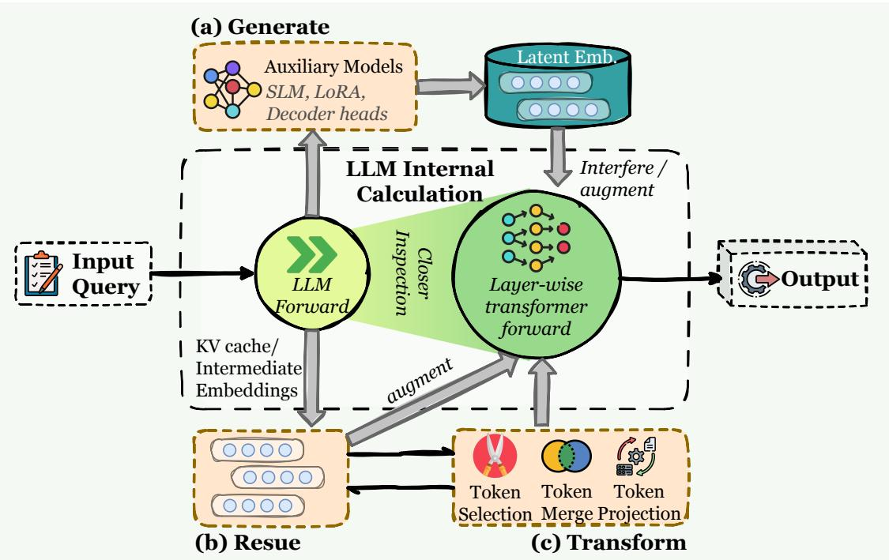
**图4** LLM agent中潜在memory集成概览。与显式文本存储不同，潜在memory在模型的内部表示空间内运行。该框架根据潜在状态的来源进行分类：（a）Generate，辅助模型合成嵌入以干扰或增强LLM的前向传递；（b）Reuse，直接传播先前的计算状态，如KV缓存或中间嵌入；（c）Transform，通过token选择、合并或投影压缩内部状态以保持高效上下文。

# 潜在memory的三种主要类型

1. 生成（Generate）：潜在memory由独立模型或模块产生，然后作为可重用的内部表示提供给agent。
2. 重用（Reuse）：潜在memory直接从先前的计算中延续过来，最突出的是KV缓存重用（在轮次内或跨轮次），以及传播隐藏状态的循环或有状态控制器。
3. 转换（Transform）：现有的潜在状态被转换为新的表示（例如，蒸馏、池化或压缩），因此agent可以在减少延迟和上下文占用的同时保留本质内容。

# 3.3.1 生成（Generate）

一个主要研究方向通过生成新的潜在表示而不是重用或转换现有的激活来构建memory。在这种范式中，模型或辅助编码器创建紧凑的连续状态。这些状态可能表现为序列中的特殊token或独立的向量。它们总结了长上下文、任务轨迹或多模态输入的基本信息。生成的潜在摘要随后被存储、插入或用作后续推理或决策的条件。这使得系统能够在其原生上下文长度之外运行，维护特定任务的中间状态，并在无需重新访问原始输入的情况下跨情节保留知识。尽管具体形式因研究而异，但基本思想保持一致。memory通过学习的编码或压缩明确产生，产生的潜在状态作为可重用的memory单元支持未来的推理。

这种设计选择也可能引发与参数化memory的潜在模糊性，特别是因为许多方法依赖于单独训练的模型来生成潜在表示。然而，在本章中，我们的分类是基于memory的形式而非学习机制。关键的是，尽管这些方法通过学习编码生成memory，但产生的潜在表示被明确实例化并作为独立的memory单元重用，而不是直接嵌入到模型的参数或前向传递激活中。我们将在详细讨论个别方法时回到这一区别。

**单模态** 在单模态设置中，一个主要的方法组专注于长上下文处理和语言建模，其中模型生成一小部分内部表示来替代长原始输入（Mu et al., 2023; Luo et al., 2024; Xu et al., 2025d; Chevalier et al., 2023; Qian et al., 2025; Wang et al., 2024j, 2025m）。一个典型策略是将长序列压缩为少量内部token或连续向量，这些可以在后续推理中重用。例如，Gist（Mu et al., 2023）训练一个语言模型在处理长提示后产生一组gist token。Luo et al.（2024）在每个块边界引入一个特殊的哨兵token，并鼓励模型将局部语义聚合到该token中。SoftCoT（Xu et al., 2025d）遵循类似方向，从最后一个隐藏状态生成特定实例的软token。CARE（Choi et al., 2025）通过训练一个上下文评估器将检索到的RAG文档压缩为紧凑的memory token，进一步扩展了潜在token。

诸如AutoCompressor（Chevalier et al., 2023）和MemoRAG（Qian et al., 2025）等工作强调向量化或独立的潜在表示。AutoCompressor（Chevalier et al., 2023）将整个长文档编码为少量作为软提示的摘要向量，而MemoRAG（Qian et al., 2025）使用LLM产生捕获全局语义结构的紧凑隐藏状态memory。这些方法不仅从原始文本中抽象出来，还将检索到的或上下文化的信息转换为新的潜在memory单元，以优化重用。为了支持更持久的memory，MemoryLLM（Wang et al., 2024j）在模型的潜在空间中嵌入了一组专用的memory token。$\mathbf{M}+$（Wang et al., 2025m）将此思想扩展到跨层长期memory架构。LM2（Kang et al., 2025b）遵循相关但在结构上不同的方向，在每个层中引入矩阵形状的潜在memory槽。

另一分支工作将潜在memory的生成内化到模型的参数动态中。尽管这些工作依赖于参数化模块，但它们的操作memory单元仍然是潜在表示，将它们坚定地归入此类。Titans（Behrouz et al., 2025b）将长程信息压缩为在线更新的MLP权重，在推理期间产生潜在向量。MemGen（Zhang et al., 2025d）在解码期间动态生成潜在memory：两个LoRA适配器决定在哪里插入memory片段以及插入什么潜在内容。EMU（Na et al., 2024）训练一个状态编码器来产生带有回报和期望性的潜在嵌入。

**多模态** 在多模态设置中，生成潜在memory扩展到图像、音频和视频，将它们编码为紧凑的潜在表示。CoMem（Wu et al., 2025d）使用VLM将多模态知识压缩为一组作为即插即用memory的嵌入。类似地，Wu et al.（2025e）将整个GUI交互轨迹压缩为固定长度的嵌入，并将其注入VLM输入空间。对于时序建模，Time-VLM（Zhong et al., 2025）将视频或交互流划分为块，并为每个块生成一个潜在嵌入。

在基于视觉的导航中，Mezghani et al.（2022）学习一个状态编码器，将视觉观察映射到潜在空间，并构建一个仅包含新颖观察的情景memory。MemoryVLA（Shi et al., 2025a）维护一个感知-认知memory库，将感知细节和高级语义都存储为Transformer隐藏状态。在长视频对象分割中，XMem（Cheng and Schwing, 2022）将每帧编码为键值潜在嵌入，并将它们组织成包含感知、工作和长期组件的多阶段memory。

**讨论** 这些单模态和多模态方法共享相同的基本原理：首先生成紧凑的潜在表示，然后将其作为memory条目维护和检索。模型可以主动构建针对任务定制的高信息密度表示，以最小的存储成本捕获关键动态、长程依赖或跨模态关系。它还避免重复处理完整上下文，从而实现跨扩展交互的更高效推理。

然而，缺点同样明显。生成过程本身可能引入信息丢失或偏差，并且状态可能在多次读写周期中漂移或累积错误。此外，训练专用模块来生成潜在表示引入了额外的计算开销、数据需求和工程复杂性。

# 3.3.2 重用（Reuse）

与生成新潜在表示的方法不同，另一类工作直接重用模型的内部激活，主要是键值（KV）缓存，作为潜在memory。这些方法不转换（修改、压缩）存储的KV对，而是将前向传递中的原始激活视为可重用的memory条目。主要挑战是确定保留哪些KV对，如何索引它们，以及在长上下文或持续处理需求下如何高效检索它们。

从认知角度看，Gershman et al.（2025）提供了概念基础，将生物memory框架为一个键值系统，其中键作为检索地址，值编码存储内容——这是一个与现代LLMs中基于KV的memory密切相关的抽象。Memorizing Transformers（Wu et al., 2022）显式存储过去的KV对，并在推理期间通过K近邻搜索检索它们。FOT（Tworkowski et al., 2023）通过引入memory-attention层扩展了这项工作，该层在推理期间对额外的KV memory执行基于KNN的检索。LONGMEM（Wang et al., 2023b）类似地增强了长程检索，采用一个轻量级残差SideNet，将历史KV嵌入视为持久memory存储。这些系统展示了潜在KV状态的检索感知组织如何显著增强对遥远信息的访问。

**讨论** 重用型潜在memory方法强调了直接利用模型自身内部激活作为memory的有效性，表明精心策划的KV表示可以作为长程检索和推理的强大且高效的基板。

它们最大的优势在于保留模型内部激活的完整保真度，确保没有信息通过修剪或压缩丢失。这使得它们在概念上简单，易于集成到现有形式中，并且高度忠实于模型的原始计算。然而，原始KV缓存随着上下文长度迅速增长，这增加了memory消耗，并可能使检索效率降低。因此，重用的有效性在很大程度上取决于索引策略。

# 3.3.3 转换（Transform）

转换型潜在memory方法专注于修改、压缩或重组现有的潜在状态，而不是生成全新的状态或直接重用原始KV缓存。这些方法将KV缓存和隐藏激活视为可塑的memory单元，通过选择、聚合或结构转换来重塑它们。在此过程中，它们在概念上占据了生成型和重用型memory之间的中间地带：模型不创建新的潜在表示，但也不仅仅是重放存储的KV对。

一个主要研究方向侧重于压缩KV缓存，同时保留基本语义。一些方法通过仅保留最有影响力的token来减少memory使用。Scissorhands（Liu et al., 2023b）在缓存容量超过时基于注意力分数修剪token，而SnapKV（Li et al., 2024b）通过头内投票机制聚合高重要性的前缀KV表示。PyramidKV（Cai et al., 2024）在各层间重新分配KV预算。SirLLM（Yao et al., 2024b）基于此视角，通过token熵准则估计token重要性，并选择性保留信息丰富的KV条目。Memory$^{3}$（Yang et al., 2024a）仅存储最关键的注意力键值对，显著缩小了存储需求。RazorAttention（Tang et al., 2025a）引入了更明确的压缩方案：它计算每个头的有效注意力跨度，仅保留有限的局部窗口，并使用补偿token来保留丢弃条目的信息。从更注重效率的角度，H2O（Zhang et al., 2023）采用更简单的驱逐策略，仅保留最近的token以及特殊的H2 token来减少memory占用。

**讨论** 这些方法展示了潜在memory如何通过选择、检索增强或压缩重新编码，转变为更有效的memory表示，使LLMs能够扩展其可用上下文长度并提高推理性能，而无需依赖原始缓存重用。

它们的主要优势在于产生更紧凑和信息密集的memory表示，从而降低存储成本并实现对长上下文的检索。通过重塑潜在状态，这些方法使模型能够访问比原始激活更有用的蒸馏语义信号。然而，转换引入了信息丢失的风险，并且与直接重用的KV缓存相比，压缩后的状态可能变得更难解释或验证。修剪、聚合或重新编码所需的额外计算也增加了系统复杂性。

# 3.4 适配

如上所示，大量工作专注于agent memory，这清楚地表明memory机制对于agent系统至关重要（Zhang et al., 2025r）。agent系统中memory类型的选择反映了设计者期望agent在给定任务中的行为方式。设计者不仅仅要求agent记住某些信息，还隐式地表达了他们希望这些信息如何塑造agent的行为。因此，为任务选择合适的memory类型远不止是一个简单的组合选择。

在本节中，我们从每种memory类型的特征出发，讨论它们在理想设置下最适合哪些任务和场景，如图5所示。我们希望这次讨论能够提供有用的思路。

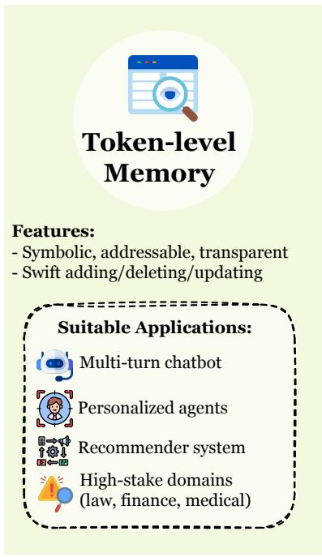
**图5** LLM agent的三种互补memory范式概览。Token-level、parametric和latent memory在表示形式、更新动态、可解释性和效率方面各不相同，导致在长时程和交互式agent系统中具有不同的优势、局限性和应用领域。

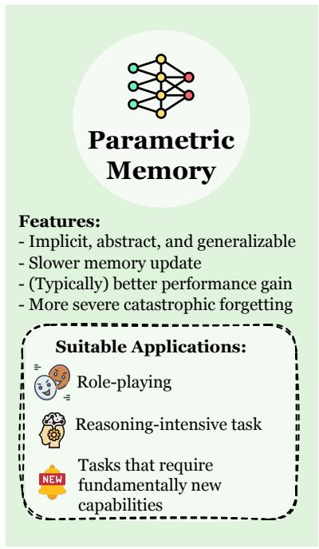

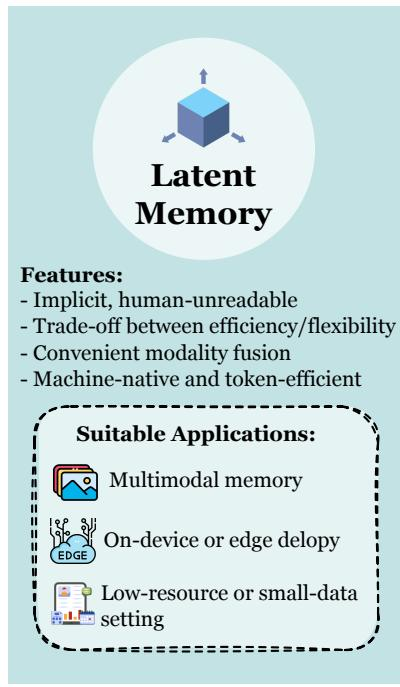

并为实际选择提供指导。示例仅说明了这些理想化设置中memory的一种可能形式，并不意味着其他memory类型在相同场景中缺乏独特优势。

**Token-level Memory** Token-level memory保持符号化、可寻址和透明，特别适合需要显式推理、可控性和可问责性的场景。这种类型的memory在实时、高频更新的设置中表现出色，其中agent必须持续跟踪和修订信息，并且知识本身表现出可以显式建模的清晰结构。其外部化特性使memory易于检查、审计、传输或修订，特别适合需要精确增/删/改操作的领域。高水平的可解释性进一步确保agent的决策过程可以追溯到具体的memory单元，这在高风险应用中至关重要。此外，token-level memory提供长期稳定性并避免灾难性遗忘，使agent能够在扩展的时间范围内积累可靠的知识。另一个实际优势是token-level memory通常作为即插即用模块实现，允许其与最新的闭源或开源基础模型轻松集成，而无需修改其内部参数。

# 可能场景：

- 聊天机器人和多轮对话系统。（Zhong et al., 2024; Lu et al., 2023; Chhikara et al., 2025）
- 需要稳定memory的长时程或终身agent。（Wang et al., 2024f; Westhäuser et al., 2025）
- 用户特定的个性化配置文件。（Wang et al., 2024f; Lee et al., 2023）
- 推荐系统。（Wang et al., 2024h; Huang et al., 2025d; Xi et al., 2024a）
- 企业或组织知识库。
- 法律、合规和其他需要可验证来源的高风险领域。

**Parametric Memory** 与符号memory相比，参数化memory是隐式、抽象且可泛化的，使其自然适合需要概念理解和广泛模式归纳的任务。当agent必须依赖适用于不同上下文的通用知识或规则时，它特别有效，因为这种规律性可以被内化为分布式表示，而无需显式的外部查找。这种内部化支持流畅的推理和端到端处理，使模型能够系统地泛化到未见过的任务或问题变体。因此，参数化memory更符合需要结构洞察力、强大抽象能力以及根深蒂固的行为或风格模式的任务。

# 可能场景：

- 角色扮演或人设一致的行为。（Shao et al., 2023; Zhou et al., 2024a）
- 数学推理、编码、游戏和结构化问题解决。
- 人类对齐和规范性行为先验。
- 风格化、专业化或领域专家响应。

**Latent Memory** 与token-level或参数化memory不同，潜在memory位于显式数据和固定模型权重之间，实现了灵活性和效率的独特平衡。其低可读性提供了内在的隐私保护，使潜在表示适合敏感信息处理。同时，其高表达能力允许以最小的信息丢失进行丰富的语义编码，使agent能够捕获跨模态或任务的微妙关联。潜在memory还支持推理时的高效检索和集成，使agent能够注入大量紧凑知识。因此，这种memory类型优先考虑性能和可扩展性而非可解释性，实现了高知识密度和压缩，非常适合受限制或高度动态的环境。

# 可能场景：

- 多模态或完全集成的智能体架构。（Shi et al., 2025a; Cheng and Schwing, 2022; Wu et al., 2025d）
- 设备端或边缘部署以及云服务环境。
- 加密或隐私敏感的应用领域。

# 4 功能：为什么智能体需要记忆？

从作为通用、无状态文本处理器的大型语言模型向自主、目标导向的智能体的转变，不仅仅是一个渐进步骤，而是一个根本性的范式转变。这种转变暴露了无状态性的关键限制。根据定义，智能体必须随时间持续存在、适应并保持连贯的交互。实现这一点不仅仅依赖于大的上下文窗口，从根本上依赖于记忆的能力。本节探讨智能体记忆的功能或基本目的，优先考虑为什么它至关重要，而不是如何实现它。我们认为智能体记忆不是一个单一组件，而是一组不同的功能能力，每个都服务于实现持久、智能行为的独特目标。

为了提供系统性的分析，本节围绕功能性分类法组织记忆的“为什么”，该分类法直接映射到智能体的核心需求。在最高层面，我们区分两个时间类别：长期记忆，作为跨会话累积知识的持久存储；短期记忆，作为活跃推理的瞬态、会话内工作空间。这种高层时间分割进一步分解为三个主要功能支柱，形成了我们分析的结构。该分类法的概览见图6。

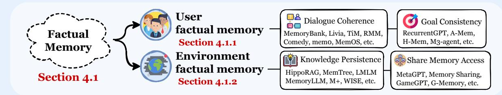
(a) 长期记忆

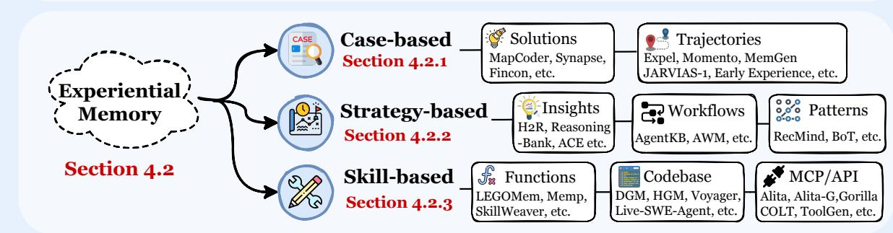

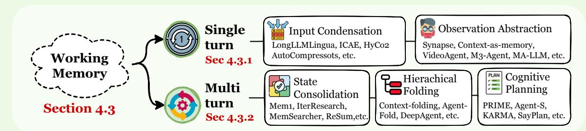
(b) 短期记忆
图6 智能体记忆的功能分类法。我们根据功能（目的）将记忆能力组织为跨越两个时间领域的三个主要支柱：（1）事实记忆作为持久的陈述性知识库，确保交互的一致性、连贯性和适应性；（2）经验记忆封装了程序性知识，以实现跨情节的持续学习和自我进化；（3）工作记忆为瞬态上下文的主动管理提供了机制。

# 三个主要记忆功能

1. 事实记忆（第4.1节）：智能体的陈述性知识库，通过回忆明确的事实、用户偏好和环境状态来确保一致性、连贯性和适应性。这个系统回答的问题是：“智能体知道什么？”
2. 经验记忆（第4.2节）：智能体的程序性和战略性知识，通过从过去的轨迹、失败和成功中抽象出来积累，以实现持续学习和自我进化。这个系统回答的问题是：“智能体如何改进？”
3. 工作记忆（第4.3节）：智能体在单个任务或会话期间用于主动上下文管理的容量有限、动态控制的便签本。这个系统回答的问题是：“智能体现在在想什么？”

这三个记忆系统不是孤立的，而是形成一个动态的、相互连接的架构，定义了智能体的认知循环。循环从编码开始，其中智能体交互的结果，如新获得的事实或失败计划的结果，通过摘要、反思或抽象被巩固到长期记忆中。随后在处理阶段，在工作记忆中进行，工作记忆充当即时推理的活跃工作空间。为了支持这种推理，系统依赖于检索，从事实和经验记忆的持久存储中提取相关上下文和技能来填充工作空间。这种编码-处理-检索序列构成了使智能体能够同时从过去学习并在现在推理的中心架构模式。

# 4.1 事实记忆

事实记忆指的是智能体存储和检索关于过去事件、用户特定信息和外部环境状态的明确、陈述性事实的能力。这些信息涵盖广泛的内容，包括对话历史、用户偏好和外部世界的相关属性。通过允许智能体在解释当前输入时利用历史信息，事实记忆成为上下文感知、个性化响应和扩展任务规划的基石。

为了理解智能体记忆的结构组成，我们借鉴了认知科学中陈述性记忆的框架（Riedel and Blokland, 2015）。在神经科学中，陈述性记忆表示可以意识访问的长期存储，通常分析为两个主要组成部分：情景记忆和语义记忆（Squire, 2004）。情景记忆存储与特定时间和空间上下文相关的个人经历事件——一个情节的什么、在哪里和何时（Tulving, 1972, 2002）。其核心特征是在心理上重新体验过去事件的能力。语义记忆保留与获取它们的具体场合无关的一般事实知识、概念和词语含义（Squire, 2004）。虽然在人类大脑中由统一的陈述性系统支持，但这些组成部分代表了不同的抽象层次。

在智能体系统中，这种生物学上的区别不是作为严格的二分法，而是作为一个处理连续体来操作的。系统通常通过记录具体的交互历史作为情景痕迹来启动这个过程，例如对话轮次、用户操作和环境状态（Zhong et al., 2024; Wang et al., 2024h; Chhikara et al., 2025）。后续处理阶段应用摘要（Wang et al., 2025h; Chen et al., 2025c）、反思（Tan et al., 2025c; Park et al., 2023; Wang et al., 2025h）、实体提取（Gutierrez et al., 2024）和事实归纳（Rasmussen et al., 2025）。产生的抽象存储在诸如向量数据库（Zhong et al., 2024）、键值存储或知识图（Rasmussen et al., 2025; Sun et al., 2024）等结构中，受去重和一致性检查的程序管理。通过这个序列，原始事件流逐渐转化为可重用的语义事实库。

在功能上，这种架构确保智能体在交互过程中表现出三个基本属性：一致性、连贯性和适应性。

- 连贯性体现在强大的上下文感知中。智能体可以回忆并整合相关的交互历史，参考过去的用户输入，并保持主题连续性，确保响应形成一个逻辑连接的对话，而不是孤立的语句。
- 一致性意味着随时间稳定行为和自我呈现。通过维护关于用户特定事实和自身承诺的持久内部状态，智能体避免矛盾和任意的立场变化。
- 适应性展示了基于存储的用户档案和历史反馈个性化行为的能力。因此，响应风格和决策逐渐与用户的特定需求和特征保持一致。

为了阐述，我们根据事实记忆所指的主要实体进一步组织事实记忆。这种以实体为中心的分类法，连同代表性方法及其技术设计选择，在表4中系统地总结。这个视角突出了两个中心应用领域：

# 两种类型的事实记忆

- 用户事实记忆（第4.1.1节）指的是维持人类与智能体之间交互一致性的事实，包括身份、稳定偏好、任务约束和历史承诺。
- 环境事实记忆（第4.1.2节）指的是维持与外部世界一致性的事实，例如文档状态、资源可用性以及其他智能体的能力。

# 4.1.1 用户事实记忆

用户事实记忆在会话和任务之间持续存储关于特定用户的可验证事实，包括身份、偏好、日常习惯、历史承诺和显著事件。

其主要功能是防止无状态交互的特征性失败模式，例如指代漂移、重复询问和矛盾响应，从而减少对长期目标的干扰（Tan et al., 2025c; Zhong et al., 2024）。工程实践通常包括选择和压缩、结构化组织、检索和重用，以及一致性治理，旨在在有界访问成本下维持长距离对话和行为连贯性。

对话连贯性 对话连贯性要求智能体在长时间内保持对话上下文、用户特定事实和稳定的人设。这确保了后续轮次对早期披露和情感线索保持敏感，而不是退化为重复澄清或不一致的回复。为了实现这一点，现代系统通过两种互补策略实现用户事实记忆：启发式选择和语义抽象。

为了有效地导航有限上下文窗口，一个主要策略是选择性地保留和排名交互历史。系统（Xi and Wang, 2025; Zhong et al., 2024; Park et al., 2023; Lei et al., 2025）不是保留所有原始日志，而是维护过去交互的结构化存储，根据相关性、新近性、重要性或独特性等指标对条目进行排名。通过基于这些分数过滤检索，高价值项目被保留并定期压缩为更高级别的摘要，为后续响应提供条件以保持连续性，而不会压倒智能体的工作记忆。

除了单纯的选择，先进的框架强调将原始对话片段转换和抽象为更高级别的语义表示。诸如“内存中思考”（Think in Memory）（Liu et al., 2023a）和“反思性记忆管理”（Reflective Memory Management）（Tan et al., 2025c）等方法通过迭代更新操作将原始交互痕迹转化为思维表示或反思。这使得智能体能够查询稳定的语义记忆，保持后续回复在主题上一致且不那么重复。类似地，COMEDY（Chen et al., 2025c）使用单一语言模型生成、压缩和重用记忆，同时更新紧凑的用户档案。这些方法通过将记忆存储与原始令牌表面形式解耦，有效地在长对话历史中稳定人设和偏好表达。

目标一致性 目标一致性要求智能体随时间维护和优化明确的任务表示。这确保澄清问题、信息请求和行动严格与主要目标保持一致，最小化意图漂移。

为了减轻这种漂移，系统利用事实记忆动态跟踪和更新任务状态。诸如RecurrentGPT（Zhou et al., 2023b）、Memolet（Yen and Zhao, 2024）和MemGuide（Du et al., 2025b）等方法保留已确认的信息，同时突出未解决的元素。通过基于任务意图指导检索，这些方法帮助智能体满足缺失的约束并在会话之间保持焦点。

对于复杂的长期任务，记忆形式通常被结构化以促进围绕活动目标的局部检索（Wu et al., 2025h）。例如，A-Mem（Xu et al., 2025c）将记忆组织为互连的链接笔记图，而H-Mem（Limbacher and Legenstein, 2020）采用关联机制在后续步骤依赖于先前观察时回忆先决条件事实。

表4 事实记忆方法的分类法。我们根据主要目标实体对现有工作进行分类：用户事实记忆侧重于维持交互一致性，而环境事实记忆确保与外部世界的一致性。方法通过三个技术维度进行比较：（1）载体（第3节）标识存储介质，（2）结构遵循令牌级记忆的分类法（第3.1节），（3）优化表示集成策略，其中$PE$包括无需参数更新的提示工程和推理时技术，区别于基于梯度的方法如SFT和RL。

<table><tr><td>方法</td><td>载体</td><td>结构</td><td>任务</td><td>优化</td></tr><tr><td colspan="5">I. 用户事实记忆</td></tr><tr><td colspan="5">(a) 对话连贯性</td></tr><tr><td>MemGPT（Packer et al., 2023b）</td><td>令牌级</td><td>1D</td><td>长期对话</td><td>PE</td></tr><tr><td>TiM（Park et al., 2023）</td><td>令牌级</td><td>2D</td><td>问答</td><td>PE</td></tr><tr><td>MemoryBank（Zhong et al., 2024）</td><td>令牌级</td><td>1D</td><td>情感陪伴</td><td>PE</td></tr><tr><td>AI Persona（Wang et al., 2024f）</td><td>令牌级</td><td>1D</td><td>情感陪伴</td><td>PE</td></tr><tr><td>编码-存储-检索（Shen et al., 2024）</td><td>令牌级</td><td>1D</td><td>多模态问答</td><td>PE</td></tr><tr><td>Livia（Xi and Wang, 2025）</td><td>令牌级</td><td>1D</td><td>情感陪伴</td><td>PE</td></tr><tr><td>mem0（Chhikara et al., 2025）</td><td>令牌级</td><td>1D</td><td>长期对话，问答</td><td>PE</td></tr><tr><td>RMM（Tan et al., 2025c）</td><td>令牌级</td><td>2D</td><td>个性化</td><td>PE, RL</td></tr><tr><td>D-SMOTE（Lei et al., 2025）</td><td>令牌级</td><td>2D</td><td>推理</td><td>PE</td></tr><tr><td>Comedy（Chen et al., 2025c）</td><td>令牌级</td><td>1D</td><td>摘要、压缩、问答</td><td>PE</td></tr><tr><td>MEMENTO（Kwon et al., 2025）</td><td>令牌级</td><td>1D</td><td>具身、个性化</td><td>PE</td></tr><tr><td>O-Mem（Wang et al., 2025g）</td><td>令牌级</td><td>3D</td><td>个性化对话</td><td>PE</td></tr><tr><td>DAM-LLM（Lu and Li, 2025）</td><td>令牌级</td><td>1D</td><td>情感陪伴</td><td>PE</td></tr><tr><td>MemInsight（Salama et al., 2025）</td><td>令牌级</td><td>1D</td><td>个性化对话</td><td>PE</td></tr><tr><td colspan="5">(b) 目标一致性</td></tr><tr><td>RecurrentGPT（Zhou et al., 2023b）</td><td>令牌级</td><td>1D</td><td>长上下文生成，个性化互动小说</td><td>PE</td></tr><tr><td>Memolet（Yen and Zhao, 2024）</td><td>令牌级</td><td>2D</td><td>问答，文档推理</td><td>PE</td></tr><tr><td>MemGuide（Du et al., 2025b）</td><td>令牌级</td><td>1D</td><td>长对话问答</td><td>PE, SFT</td></tr><tr><td>SGMem（Wu et al., 2025h）</td><td>令牌级</td><td>2D</td><td>长上下文</td><td>PE</td></tr><tr><td>A-Mem（Xu et al., 2025c）</td><td>令牌级</td><td>2D</td><td>问答，推理</td><td>PE</td></tr><tr><td>M3-agent（Long et al., 2025）</td><td>令牌级</td><td>2D</td><td>多模态问答</td><td>PE, SFT</td></tr><tr><td colspan="5">II. 环境事实记忆</td></tr><tr><td colspan="5">(a) 知识持久性</td></tr><tr><td>MemGPT（Packer et al., 2023b）</td><td>令牌级</td><td>1D</td><td>文档问答</td><td>PE</td></tr><tr><td>CALYPSO（Zhu et al., 2023）</td><td>令牌级</td><td>1D</td><td>桌面游戏</td><td>PE</td></tr><tr><td>AriGraph（Anokhin et al., 2024）</td><td>令牌级</td><td>3D</td><td>游戏，多操作问答</td><td>PE</td></tr><tr><td>HippoRAG（Gutierrez et al., 2024）</td><td>令牌级</td><td>3D</td><td>问答</td><td>PE</td></tr><tr><td>WISE（Wang et al., 2024e）</td><td>参数化</td><td>/</td><td>文档推理，问答</td><td>SFT</td></tr><tr><td>MemoryLLM（Wang et al., 2024j）</td><td>参数化</td><td>/</td><td>文档推理</td><td>SFT</td></tr><tr><td>Zep（Rasmussen et al., 2025）</td><td>令牌级</td><td>3D</td><td>文档分析</td><td>PE</td></tr><tr><td>MemTree（Rezazadeh et al., 2025c）</td><td>令牌级</td><td>2D</td><td>文档推理，对话</td><td>PE</td></tr><tr><td>LMLM（Zhao et al., 2025b）</td><td>令牌级</td><td>1D</td><td>问答</td><td>SFT</td></tr><tr><td>M+（Wang et al., 2025m）</td><td>潜在</td><td>/</td><td>文档推理，问答</td><td>SFT</td></tr><tr><td>CAM（Li et al., 2025f）</td><td>令牌级</td><td>3D</td><td>多跳问答</td><td>SFT, RFT</td></tr><tr><td>MemAct（Zhang et al., 2025q）</td><td>令牌级</td><td>1D</td><td>多目标问答</td><td>RL</td></tr><tr><td>Mem-α（Wang et al., 2025o）</td><td>令牌级</td><td>1D</td><td>文档推理</td><td>RL</td></tr><tr><td>WebWeaver（Li et al., 2025l）</td><td>令牌级</td><td>1D</td><td>深度研究</td><td>SFT</td></tr><tr><td colspan="5">(b) 共享访问</td></tr><tr><td>GameGPT（Chen et al., 2023b）</td><td>令牌级</td><td>1D</td><td>游戏开发</td><td>PE</td></tr><tr><td>生成式智能体（Park et al., 2023）</td><td>令牌级</td><td>2D</td><td>社会模拟</td><td>PE</td></tr><tr><td>S8（Gao et al., 2023a）</td><td>令牌级</td><td>1D</td><td>社会模拟</td><td>PE</td></tr><tr><td>记忆共享（Gao and Zhang, 2024a）</td><td>令牌级</td><td>1D</td><td>文档推理</td><td>PE</td></tr><tr><td>MetaGPT（Hong et al., 2024）</td><td>令牌级</td><td>1D</td><td>软件开发</td><td>PE</td></tr><tr><td>G-Memory（Zhang et al., 2025e）</td><td>令牌级</td><td>3D</td><td>问答</td><td>PE</td></tr><tr><td>OASIS（Yang et al., 2025）</td><td>令牌级，参数化</td><td>1D</td><td>社会模拟</td><td>PE</td></tr></table>

在具身场景中，事实记忆将智能体行为锚定在用户特定习惯和环境上下文中。诸如M3-Agent（Long et al., 2025）和MEMENTO（Kwon et al., 2025）等系统持久存储家庭成员、物体位置和日常习惯的数据，重用这些信息以最小化冗余探索和重复指令。类似地，编码-存储-检索（Shen et al., 2024）将以自我为中心的视觉流处理为文本可寻址的条目，允许智能体基于过去的视觉经验回答问题，而无需用户重复。

总结 总的来说，这些机制将短暂的交互痕迹转化为持久的认知基础。通过将基于检索的排名与生成式抽象相结合，用户事实记忆将系统从简单的相似性匹配升级为主动维护明确目标和约束。这个基础带来了双重好处：它通过长期行为连贯性培养了熟悉感和信任感，同时通过提高任务成功率、减少冗余和降低错误恢复开销来增强操作效率。

# 4.1.2 环境事实记忆

环境事实记忆涉及用户外部的实体和状态，包括长文档、代码库、工具和交互痕迹。

这种记忆范式解决了不完整的事实回忆和不可验证的来源问题，最小化了多智能体协作中的矛盾和冗余，并稳定了异质环境中的长期任务。核心目标是提供一个可更新、可检索和可治理的外部事实层，为跨会话和阶段提供稳定的参考。具体来说，我们将现有实现分为两个互补维度：知识持久性和多智能体共享访问。

知识持久性 知识记忆指的是支持长文档分析、事实问答、多跳推理以及可靠检索代码和数据资源的世界知识和领域特定知识的持久表示。

在知识组织方面，现有研究侧重于结构化外部数据以增强推理能力。例如，HippoRAG（Gutierrez et al., 2024）利用知识图促进证据传播，而MemTree（Rezazadeh et al., 2025c）采用动态层次结构来优化不断增长的语料库中的聚合和目标访问。关于存储形式，LMLM（Zhao et al., 2025b）明确将事实知识与模型权重解耦，通过外部化到数据库中，从而无需重新训练即可直接进行知识编辑和来源验证。在叙事领域，CALYPSO（Zhu et al., 2023）将冗长的游戏上下文提炼为简洁的散文，保留了关键故事状态的可访问性。

在需要持续知识更新的场景中，以参数为中心的方法将持久性直接集成到模型架构中。诸如MEMORYLLM（Wang et al., 2024j）、$\mathrm{M}+$（Wang et al., 2025m）和WISE（Wang et al., 2024e）等方法结合了可训练的记忆池或侧网络以吸收新信息。这些设计不仅仅是依赖静态的外部检索，而是专注于模型编辑的挑战，允许智能体适应动态环境并纠正过时的事实，同时保持预训练骨干的稳定性。

共享访问 共享记忆为多智能体协作建立了一个可见且可管理的共同事实基础，用于对齐目标、携带中间工件和消除冗余工作。通过维护过去查询和响应的集中存储库，诸如记忆共享（Gao and Zhang, 2024b）等框架使智能体能够异步访问并建立在同伴累积的见解上。这种机制确保个体智能体直接从集体知识中受益，从而抑制矛盾结论并提高整体系统效率。

对于复杂的项目协调，诸如MetaGPT（Hong et al., 2024）和GameGPT（Chen et al., 2023b）等系统使用共享消息池作为发布计划和部分结果的中央工作空间。类似地，G-Memory（Zhang et al., 2025e）采用分层记忆图作为统一的协调媒介。这些架构有助于围绕当前项目状态维护一致性，减少通信开销，并能够从历史协作中提取可重用的工作流。

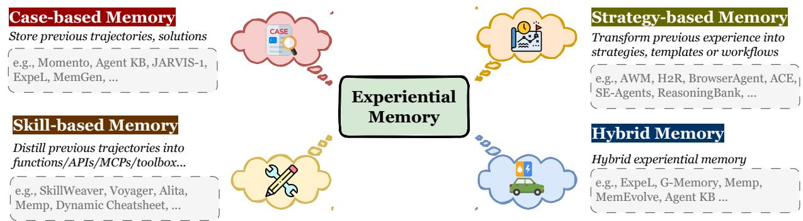
图7 经验记忆范式的分类法。我们基于存储知识的抽象级别对方法进行分类：（1）基于案例的记忆将原始轨迹和解决方案保存为具体示例；（2）基于策略的记忆将经验抽象为高级策略、模板或工作流；（3）基于技能的记忆将程序性知识提炼为可执行函数和API；（4）混合记忆整合了多种表示。这些系统共同镜像了人类的程序性记忆，以实现持续学习和自我进化。本图灵感来源于Gao et al.（2025）。

在社会模拟领域，诸如生成式智能体（Park et al., 2023）和$\mathrm{S}^3$（Gao et al., 2023a）等平台，以及大规模模拟器如OASIS（Yang et al., 2025）和AgentSociety（Piao et al., 2025），将全局环境和公共交互日志建模为共享记忆基板。该基板由群体增量更新和观察，允许信息在智能体之间自然扩散，并支持大规模、历史感知的社会动态。

总结 环境事实记忆提供了一个持续可更新、可审计和可重用的外部事实层。在知识轴上，它通过结构化组织和长期记忆模块提高了事实回忆的完整性、可解释性和可编辑性。在协作轴上，它通过共享和治理保持了跨智能体和跨阶段的一致性，从而在长期视野、多参与者和多源信息下实现稳健的决策和执行。

# 4.2 经验记忆

经验记忆封装了智能体将历史轨迹、提炼的策略和交互结果编码为持久、可检索表示的机制。与管理工作记忆不同，经验记忆侧重于跨不同情节的长期积累和知识迁移。

在认知科学中理论基础上，这种范式类似于人类的非陈述性记忆，特别是程序性和习惯系统（Squire, 2004; Seger and Spiering, 2011）。生物系统依赖分布式神经回路进行隐式技能获取（Reber, 2013）。相比之下，智能经验记忆通常采用显式数据结构，如向量数据库或符号日志。这种实现差异赋予了智能体一种生物对应物所缺乏的独特能力：内省、编辑和推理自身程序性知识的能力。

至关重要的是，经验记忆作为经验时代（Sutton, 2025; Gao et al., 2025）中持续学习和自我进化的基础。通过维护结构化经验的存储库，智能体实现了非参数化的适应路径，避免了频繁参数更新的高昂成本。这种机制通过将交互反馈转化为可重用知识，有效地关闭了学习循环。通过这个过程，智能体纠正过去的错误，抽象出可泛化的启发式方法，并编译常规行为。因此，这种适应最小化了冗余计算，并随时间优化了决策（Zhao et al., 2024; Shinn et al., 2023b）。

为了系统分析现有文献，我们基于存储信息的抽象级别对经验记忆进行分类。图7说明了这种基于抽象的分类法和代表性范式。在此基于抽象的分类法下，代表性方法及其存储载体、表示形式和优化策略总结在表5中。

# 三种类型的经验记忆

- 基于案例的记忆（第4.2.1节）存储历史情节的最小处理记录，优先考虑高信息保真度以支持直接重放和模仿。通过保留情境与结果之间的原始对齐，它作为具体、可验证证据的存储库，充当证据驱动学习的上下文示例。
- 基于策略的记忆（第4.2.2节）从过去的轨迹中提炼出可迁移的推理模式、工作流和高级见解，以指导跨不同场景的规划。作为认知支架，它将决策逻辑与特定上下文解耦，从而增强跨任务泛化并约束复杂推理的搜索空间。
- 基于技能的记忆（第4.2.3节）封装了可执行的程序性能力，范围从原子代码片段到标准化的API协议，将抽象策略操作化为可验证的行动。这一类别作为智能体的主动执行基板，支持能力的模块化扩展和工具使用环境的高效处理。

表5 经验记忆方法的分类法。我们基于存储知识的抽象级别对现有工作进行分类：基于案例的记忆保存原始记录以供直接重放，基于策略的记忆提炼抽象启发式以供规划，基于技能的记忆编译可执行能力以供行动。方法通过三个技术维度进行比较：（1）载体（第3节）标识存储介质，（2）形式指定经验的表示格式，（3）优化表示集成策略，其中$PE$包括无需参数更新的提示工程和推理时技术，区别于基于梯度的方法如SFT和RL。

<table><tr><td>方法</td><td>载体</td><td>形式</td><td>任务</td><td>优化</td></tr><tr><td colspan="5">I. 基于案例的记忆</td></tr><tr><td>Expel（Zhao et al., 2024）</td><td>令牌级</td><td>解决方案</td><td>推理</td><td>PE</td></tr><tr><td>Synapse（Zheng et al., 2024a）</td><td>令牌级</td><td>解决方案</td><td>网页交互，指令引导的网页任务</td><td>PE</td></tr><tr><td>Fincon（Yu et al., 2024）</td><td>令牌级</td><td>解决方案</td><td>金融</td><td>PE</td></tr><tr><td>MapCoder（Islam et al., 2024）</td><td>令牌级</td><td>解决方案</td><td>编码</td><td>PE</td></tr><tr><td>Memento（Zhou et al., 2025a）</td><td>令牌级</td><td>轨迹</td><td>推理</td><td>RL</td></tr><tr><td>COLA（Zhao et al., 2025a）</td><td>令牌级</td><td>轨迹</td><td>GUI，网页导航，推理</td><td>PE</td></tr><tr><td>连续记忆（Wu et al., 2025e）</td><td>潜在</td><td>轨迹</td><td>GUI</td><td>SFT</td></tr><tr><td>JARVIS-1（Wang et al., 2025p）</td><td>令牌级</td><td>轨迹</td><td>游戏，GUI交互</td><td>PE</td></tr><tr><td>MemGen（Zhang et al., 2025d）</td><td>潜在</td><td>轨迹</td><td>网页搜索，具身模拟，推理，数学，代码</td><td>RL, SFT</td></tr><tr><td>早期经验（Zhang et al., 2025j）</td><td>参数化</td><td>轨迹</td><td>具身模拟，推理，网页导航</td><td>SFT</td></tr><tr><td>DreamGym（Chen et al., 2025e）</td><td>令牌级</td><td>轨迹</td><td>网页交互，具身模拟，购物</td><td>RL</td></tr></table>

<table><tr><td colspan="5">II. 基于策略的记忆</td></tr><tr><td>Reflexion（Shinn et al., 2023a）</td><td>令牌级</td><td>洞察</td><td>具身模拟，推理，编码</td><td>PE</td></tr><tr><td>Buffer of Thoughts（Yang et al., 2024b）</td><td>令牌级</td><td>模式</td><td>游戏，推理，编码</td><td>PE</td></tr><tr><td>AWM（Wang et al., 2024l）</td><td>令牌级</td><td>工作流</td><td>网页交互，指令引导的网页任务</td><td>PE</td></tr><tr><td>RecMind（Wang et al., 2024h）</td><td>令牌级</td><td>模式</td><td>推荐</td><td>PE</td></tr><tr><td>H²R（Ye et al., 2025b）</td><td>令牌级</td><td>洞察</td><td>游戏，具身模拟</td><td>PE</td></tr><tr><td>ReasoningBank（Ouyang et al., 2025）</td><td>令牌级</td><td>洞察</td><td>网页交互，指令引导的网页任务</td><td>PE</td></tr><tr><td>R2D2（Huang et al., 2025c）</td><td>令牌级</td><td>洞察</td><td>网页交互</td><td>PE</td></tr><tr><td>BrowserAgent（Yu et al., 2025d）</td><td>令牌级</td><td>洞察</td><td>通用问答，网页搜索</td><td>RL, SFT</td></tr><tr><td>Agent KB（Tang et al., 2025d）</td><td>令牌级</td><td>工作流</td><td>代码，推理</td><td>PE</td></tr></table>

续表

表5 经验记忆方法的分类法。我们基于存储知识的抽象级别对现有工作进行分类：基于案例的记忆保存原始记录以供直接重放，基于策略的记忆提炼抽象启发式以供规划，基于技能的记忆编译可执行能力以供行动。（续表）

<table><tr><td>方法</td><td>载体</td><td>形式</td><td>任务</td><td>优化</td></tr>
<tr><td>ToolMem（Xiao et al., 2025b）</td><td>令牌级</td><td>洞察</td><td>推理，图像生成</td><td>PE</td></tr>
<tr><td>PRINCIPLES（Kim et al., 2025a）</td><td>令牌级</td><td>模式</td><td>情感陪伴</td><td>PE</td></tr>
<tr><td>SE-Agent（Sun et al., 2025b）</td><td>令牌级</td><td>洞察</td><td>编码</td><td>PE</td></tr>
<tr><td>ACE（Zhang et al., 2025m）</td><td>令牌级</td><td>洞察</td><td>编码，工具调用，金融</td><td>PE</td></tr>
<tr><td>Flex（Cai et al., 2025b）</td><td>令牌级</td><td>洞察</td><td>数学，化学，生物学</td><td>PE</td></tr>
<tr><td>AgentEvolver（Zhai et al., 2025）</td><td>参数化</td><td>模式</td><td>工具增强任务</td><td>RL</td></tr>
<tr><td>动态速查表（Dynamic Cheatsheet）（Suzgun et al., 2025）</td><td>令牌级</td><td>洞察</td><td>数学，推理，游戏</td><td>PE</td></tr>
<tr><td>免训练GRPO（Training-Free GRPO）（Cai et al., 2025a）</td><td>令牌级</td><td>洞察</td><td>数学，推理，网页搜索</td><td>PE</td></tr>
</table>

III. 基于技能的记忆

<table><tr><td>CREATOR（Qian et al., 2023）</td><td>令牌级</td><td>函数和脚本</td><td>推理，数学</td><td>PE</td></tr>
<tr><td>Gorilla（Patil et al., 2024）</td><td>令牌级</td><td>API</td><td>工具调用</td><td>SFT</td></tr>
<tr><td>ToolRerank（Zheng et al., 2024b）</td><td>令牌级</td><td>API</td><td>工具调用</td><td>PE</td></tr>
<tr><td>Voyager（Wang et al., 2024b）</td><td>令牌级</td><td>代码片段</td><td>游戏</td><td>PE</td></tr>
<tr><td>RepairAgent（Bouzenia et al., 2024）</td><td>令牌级</td><td>函数和脚本</td><td>编码</td><td>PE</td></tr>
<tr><td>COLT（Qu et al., 2024）</td><td>令牌级</td><td>API</td><td>工具调用</td><td>SFT</td></tr>
<tr><td>ToolLLM（Qin et al., 2024a）</td><td>令牌级</td><td>API</td><td>工具调用</td><td>SFT</td></tr>
<tr><td>LEGOMem（Han et al., 2025a）</td><td>令牌级</td><td>函数和脚本</td><td>办公</td><td>PE</td></tr>
<tr><td>达尔文哥德尔机（Darwin Gödel Machine）（Zhang et al., 2025h）</td><td>令牌级</td><td>代码片段</td><td>代码</td><td>PE</td></tr>
<tr><td>赫胥黎哥德尔机（Huxley-Gödel Machine）（Wang et al., 2025j）</td><td>令牌级</td><td>代码片段</td><td>代码</td><td>PE</td></tr>
<tr><td>MempP（Fang et al., 2025d）</td><td>令牌级</td><td>函数和脚本</td><td>具身模拟，旅行规划</td><td>PE</td></tr>
<tr><td>SkillWeaver（Zheng et al., 2025a）</td><td>令牌级</td><td>函数和脚本</td><td>网页交互，指令引导的网页任务</td><td>PE</td></tr>
<tr><td>Alita（Qiu et al., 2025c）</td><td>令牌级</td><td>MCP</td><td>数学，推理，视觉问答</td><td>PE</td></tr>
<tr><td>Alita-G（Qiu et al., 2025b）</td><td>令牌级</td><td>MCP</td><td>数学，推理，视觉问答</td><td>PE</td></tr>
<tr><td>LearnAct（Liu et al., 2025a）</td><td>令牌级</td><td>函数和脚本</td><td>移动GUI</td><td>PE</td></tr>
<tr><td>ToolGen（Wang et al., 2025i）</td><td>参数化</td><td>API</td><td>工具调用</td><td>SFT</td></tr>
<tr><td>MemTool（Lumer et al., 2025）</td><td>令牌级</td><td>MCP</td><td>工具调用</td><td>SFT</td></tr>
<tr><td>ToolRet（Shi et al., 2025c）</td><td>令牌级</td><td>API</td><td>网页，代码，工具检索</td><td>SFT</td></tr>
<tr><td>DRAFT（Qu et al., 2025a）</td><td>令牌级</td><td>API</td><td>工具调用</td><td>PE</td></tr>
<tr><td>ASI（Wang et al., 2025r）</td><td>令牌级</td><td>函数和脚本</td><td>网页交互</td><td>PE</td></tr>
</table>

# 4.2.1 基于案例的记忆

基于案例的记忆存储历史事件的最小处理记录，优先考虑保真度，以确保情节可以作为上下文示例重放或重用。与策略模板或技能模块不同，案例避免广泛的抽象，从而保留情境与解决方案之间的原始对齐。

轨迹 这一类别保存交互序列以支持重放和证据驱动的学习。为了优化文本环境中的检索，Memento（Zhou et al., 2025a）采用软Q学习动态优化选择高效用过去轨迹的概率。在多模态设置中，JARVIS1（Wang et al., 2025p）、EvoVLA（Liu et al., 2025h）和自动缩放连续记忆（Auto-scaling Continuous Memory）（Wu et al., 2025e）保留视觉上下文，前者在Minecraft中存储生存经验，后者将GUI历史压缩为连续的嵌入。此外，早期经验范式（Zhang et al., 2025j）构建无奖励的、智能体生成的交互痕迹，并通过中期训练将其集成到模型参数中，以增强泛化能力。

解决方案 这一类别将记忆视为已证明解决方案的存储库。ExpeL（Zhao et al., 2024）通过试错自主收集经验，将成功轨迹存储为示例，同时提取文本见解以指导未来行动。Synapse（Zheng et al., 2024a）类似地将抽象的“状态-动作”情节作为上下文示例注入，以对齐问题解决模式。在程序合成中，MapCoder（Islam et al., 2024）将相关示例代码保存为类似剧本的案例，供多智能体管道检索和改编，以提高复杂任务的可靠性。在金融领域，FinCon（Yu et al., 2024）维护过去行动、盈亏轨迹和信念更新的情景记忆，以促进跨轮次的稳健决策。

总结 基于案例的记忆提供高信息保真度，并提供可验证的证据以供模仿。然而，对原始数据的依赖带来了检索效率和上下文窗口消耗方面的挑战。与可执行技能或抽象策略不同，案例不包含编排逻辑或函数接口。相反，它们作为更高层次推理所依据的事实基础。

# 4.2.2 基于策略的记忆

与保留“发生了什么”的案例库不同，基于策略的记忆提取关于“如何行动”的可迁移知识，包括可重用的推理模式、任务分解、洞察、抽象和跨情境的工作流。它将经验提升为可编辑、可审计和可组合的高级知识，从而减少对冗长轨迹重放的依赖，并提高跨任务泛化和效率。本节我们关注非代码或弱代码基础的模板和工作流，而可执行函数、API、MCP协议和代码片段则归类于第4.2.3节。根据保留知识的粒度和结构复杂性，我们将基于策略的记忆分为三种不同类型：原子洞察、顺序工作流和图式模式。

洞察 这类方法侧重于从过去轨迹中提炼离散的知识片段，例如细粒度的决策规则和反思性启发式。$\mathrm{H}^2\mathrm{R}$（Ye et al., 2025b）明确解耦了规划级和执行级记忆，使得高级规划洞察和低级操作规则可以在多任务场景中分别检索以实现细粒度迁移。R2D2（Huang et al., 2025c）集成了记忆、反思和动态决策以进行网页导航，从失败和成功案例中得出纠正性洞察，为后续情节提供信息。对于长期网页自动化，BrowserAgent（Yu et al., 2025d）将关键结论持久化为显式记忆，以稳定扩展的推理链并减轻上下文漂移。

工作流 与原子的、静态的洞察不同，工作流将策略封装为结构化的行动序列——从先前轨迹中抽象出来的可执行例程，用于在推理时指导多步执行。智能体工作流记忆（AWM）（Wang et al., 2024l）在Mind2Web（Deng et al., 2023）和WebArena（Zhou et al., 2023a）上诱导可重用的工作流，并将其用作高级支架来指导后续生成，在不更新基础模型权重的情况下提高成功率和减少步骤。这表明策略模板可以作为顶级控制器，补充案例级证据。智能体知识库（Agent KB）（Tang et al., 2025d）建立了一个统一的知识库，将工作流视为可迁移的程序性知识。它采用分层检索，首先访问工作流以构建策略方法，并支持跨不同智能体架构的问题解决逻辑重用。

模式 在更高的抽象层次上，推理模式作为认知模板，封装了问题解决的结构，使智能体能够通过实例化这些可泛化的框架来处理复杂的推理任务。Buffer of Thoughts（Yang et al., 2024b）维护一个思维模板的元缓冲区，检索并实例化以解决新问题。类似地，ReasoningBank（Ouyang et al., 2025）将成功和失败都抽象为可重用的推理单元，促进测试时扩展和稳健学习。RecMind的自启发规划算法（Wang et al., 2024h）生成中间自我指导，以结构化后续规划和工具使用。在对话智能体领域，PRINCIPLES（Kim et al., 2025a）通过离线自博弈构建合成策略记忆，以指导推理时的策略规划，从而消除了额外训练的需要。这些进步表明从描述性规则到可移植推理结构的范式转变。

总结 基于策略的记忆，包括洞察、工作流和模式，作为指导生成推理的高级支架。与依赖于检索可能嘈杂或上下文相关的特定原始轨迹的基于案例的记忆不同，这种记忆形式提炼出可泛化的图式，以有效约束搜索空间并提高在未见任务上的稳健性。然而，一个关键区别在于这些策略是结构性指南而非可执行行动；它们指导规划过程，但不直接与环境交互。这一限制需要基于技能的记忆，这将在下一节讨论，它存储可调用的能力和工具。最终，稳健的智能体通常协同这些组件：策略提供抽象规划逻辑，而技能处理基础执行。

# 4.2.3 基于技能的记忆

技能记忆捕获智能体的程序性能力，并将抽象策略操作化为可验证的行动。它编码了智能体能做什么，补充了智能体知道什么的陈述性知识，并通过提供可调用、可测试和可组合的可执行文件来锚定感知-推理-行动循环。最近的证据表明，语言模型可以学习何时以及如何调用工具，并在大量工具库中可靠地扩展，确立了技能记忆作为现代智能体的执行基板。

技能记忆涵盖了从内部、细粒度代码到外部化、标准化接口的连续体。统一标准很简单：技能必须可被智能体调用，其结果必须可验证以支持学习，并且必须与其他技能组合以形成更大的例程。

代码片段 存储为可重用代码片段的可执行代码提供了从经验到能力的最快路径。在开放式任务中，智能体将成功的子轨迹提炼为可解释的程序，并在不同环境中重用。Voyager（Wang et al., 2024b）以不断增长的技能库为例体现了这种模式；达尔文哥德尔机（Zhang et al., 2025h）更进一步，在经验验证下安全地重写自身代码，产生自我参照且逐渐更强大的技能集。

函数和脚本 将复杂行为抽象为模块化函数或脚本增强了可重用性和泛化能力。最近的进展使智能体能够自主创建用于问题解决的专用工具（Qian et al., 2023; Yuan et al., 2024a），并通过演示和环境反馈在移动GUI、网页导航和软件工程等不同领域完善工具使用能力（Fang et al., 2025d; Zheng et al., 2025a; Bouzenia et al., 2024）。此外，程序性记忆的新兴机制使智能体能够将执行轨迹提炼为可检索的脚本，促进对新颖场景的高效泛化（Liu et al., 2025a; Han et al., 2025a）。

API API作为封装技能的通用接口。虽然早期工作侧重于微调模型以正确调用工具（Schick et al., 2023; Patil et al., 2024），但API库的指数增长已将主要瓶颈转移到检索。标准信息检索方法通常无法捕捉工具的功能语义（Shi et al., 2025c）。因此，最近的方法转向基于学习的检索和重排序策略，这些策略考虑了工具文档质量、层次关系和协作使用模式，以弥合用户意图和可执行功能之间的差距（Zheng et al., 2024b; Gao and Zhang, 2024c; Qu et al., 2024, 2025a）。

MCP 为了减少基于API的生态系统中的协议碎片化，模型上下文协议（Model Context Protocol）提供了一个开放标准，统一了智能体发现和使用工具和数据的方式，包括按需加载工具并减少上下文开销的代码执行模式（Qiu et al., 2025c,b）。广泛的平台支持表明正向通用接口层趋同。

除了标准可执行文件，研究还探索了工具能力的可学习记忆以处理不确定的神经工具，嵌入工具符号以统一检索和调用的参数化集成，以及将专用智能体作为模块化设计空间中可调用模块的架构即技能视角（Xiao et al., 2025b; Wang et al., 2025i; Zhao et al., 2025a）。总的来说，这些方向将技能记忆重新定义为可学习、可演进和可编排的能力层。

总结 总而言之，基于技能的记忆构成了智能体的主动执行基板，从静态代码片段和模块化脚本演变为标准化API和可学习架构。它通过将基于案例和基于策略的记忆中的洞察操作化为可验证的程序，弥合了抽象规划与环境交互之间的差距。随着工具创建、检索和互操作性机制（如MCP）的成熟，技能记忆超越了简单的存储，实现了能力合成、完善和执行的连续循环，推动着开放式智能体进化。

# 4.2.4 混合记忆

先进的智能体架构越来越多地采用混合设计，集成多种形式的经验记忆，以平衡基础证据与可泛化逻辑。通过维护涵盖原始情节、提炼规则和可执行技能的知识谱系，这些系统动态选择最合适的记忆格式，确保检索精度和跨上下文的广泛泛化。

一个突出的方向涉及耦合基于案例和基于策略的记忆，以促进互补推理。例如，ExpeL（Zhao et al., 2024）协同具体轨迹与抽象文本洞察，使智能体能够回忆特定解决方案同时应用通用启发式。智能体知识库（Agent KB）（Tang et al., 2025d）采用分层结构，其中高级工作流指导规划，具体解决方案路径提供执行细节。类似地，R2D2（Huang et al., 2025c）集成了历史痕迹的重放缓冲区和一个从过去错误中提炼决策策略的反思机制，有效地桥接了案例检索和策略抽象。作为补充，动态速查表（Dynamic Cheatsheet）（Suzgun et al., 2025）通过存储累积的策略和问题解决洞察以供推理时立即重用，防止了冗余计算。

此外，最近的框架努力统一记忆的生命周期，纳入基于技能的组件或建立全面的认知架构。在科学推理中，ChemAgent（Tang et al., 2025c）构建了一个自我更新的库，将执行案例与可分解的技能模块配对，使模型能够通过累积经验完善其化学推理。采取整体方法，LARP（Yan et al., 2023）为开放世界游戏建立了一个认知架构，协调用于世界知识的语义记忆、用于交互案例的情景记忆和用于可学习技能的程序性记忆，确保一致的角色扮演和稳健的决策。最后，进化系统如G-Memory（Zhang et al., 2025c）和Memp（Fang et al., 2025d）实现了动态转换，其中重复的成功案例逐渐被编译为高效技能，自动化从繁重检索到快速执行的转变。最近的一项工作MemVerse（Liu et al., 2025d）结合了参数化记忆和令牌级程序性记忆。

# 4.3 工作记忆

在认知科学中，工作记忆被定义为一种容量有限、动态控制的机制，通过选择、维护和转换任务相关信息来支持高阶认知（Baddeley, 2012）。超越单纯的临时存储，它意味着在资源约束下的主动控制。这种观点基于多组件模型和嵌入式过程账户等框架，两者都强调注意焦点、干扰控制和有限容量（Cowan, 2014）。

当移植到LLMs时，标准上下文窗口主要充当被动的、只读的缓冲区。尽管模型可以在推理期间使用窗口内容，但它缺乏显式机制来动态选择、维持或转换当前工作空间。最近的行为证据表明，当前模型并未表现出类似人类的工作记忆特征，强调了明确设计的、可操作的工作记忆机制的必要性（Huang et al., 2025a）。

在本节中，我们将工作记忆定义为在单个情节内用于主动管理和操作上下文的一组机制（Zhang et al., 2025q）。目标是将上下文窗口从被动缓冲区转变为可控、可更新和抗干扰的工作空间。这种转变带来了直接的好处：它在固定的注意力预算下增加了任务相关信息密度，抑制了冗余和噪声，并允许重写或压缩表示以保持连贯的思维链。我们基于交互动态对这些机制进行分类。在这种基于交互的分类法下，代表性工作记忆方法及其存储载体、任务领域和优化策略系统地总结在表6中。

# 两种类型的工作记忆

- 单轮工作记忆（第4.3.1节）侧重于输入压缩和抽象。在这种设置中，系统必须在单次前向传递中处理大量的即时输入，如长文档或高维多模态流。目标是动态过滤和重写证据，构建有界的计算便签本，从而最大化每个令牌的有效信息负载。
- 多轮工作记忆（第4.3.2节）解决时间状态维护问题。在顺序交互中，挑战在于防止历史积累压倒注意力机制。这涉及通过读取、执行和更新的连续循环来维护任务状态、目标和约束，确保中间产物在轮次之间被折叠和整合。

总之，LLMs的工作记忆代表了向主动的、情节内上下文管理的范式转变。通过与主动操作的认知需求保持一致，它抑制了干扰，并为长上下文推理的工程约束提供了实际解决方案。

# 4.3.1 单轮工作记忆

单轮工作记忆解决了在单次前向传递中处理大量即时输入的挑战，包括长文档（Chevalier et al., 2023）和高维多模态流（Wang et al., 2024g）。目标不是被动消耗整个上下文，而是主动构建一个可写的工作空间。这涉及过滤和转换原始信息，以在固定的注意力和记忆预算下增加密度和可操作性（Jiang et al., 2023, 2024）。我们将这些机制分为输入压缩和观察抽象两类。

输入压缩 输入压缩技术旨在预处理上下文以最小化令牌使用，同时保留基本信息（Jiang et al., 2023）。这些方法通常分为三种范式：硬压缩、软压缩和混合压缩（Liao et al., 2025a）。

硬压缩根据重要性指标离散地选择令牌。像LLMingua（Jiang et al., 2023）和LongLLMingua（Jiang et al., 2024）这样的方法估计令牌困惑度以丢弃可预测或与任务无关的内容，而CompAct（Yoon et al., 2024）采用迭代策略以保留最大化信息增益的片段。虽然高效，但硬选择可能切断句法或语义依赖。软压缩将可变长度上下文编码为密集的潜在向量（记忆槽）。像Gist（Mu et al., 2023）、上下文内自动编码器（ICAE）（Ge et al., 2024）和AutoCompressors（Chevalier et al., 2023）等方法训练模型将提示压缩为有效的摘要令牌或不同的记忆嵌入。这实现了高压缩比，但需要额外的训练，并可能掩盖细粒度细节。像HyCo2（Liao et al., 2025a）这样的混合方法试图通过结合全局语义适配器（软）和令牌级保留概率（硬）来调和这些权衡。

观察抽象 虽然压缩侧重于缩减，但观察抽象旨在将原始观察转换为便于推理的结构化格式。这种机制将动态的、高维的观察空间映射到固定大小的记忆状态，防止智能体被原始数据淹没。

在复杂的交互环境中，抽象将冗长的输入转换为简洁的状态描述。Synapse（Zheng et al., 2024a）将非结构化的HTML DOM树重写为与任务相关的状态摘要，以指导GUI自动化。类似地，在多模态设置中，处理视频流的每一帧在计算上是禁止的。工作记忆机制通过提取语义结构来解决这个问题：作为记忆的上下文（Context as Memory）（Yu et al., 2025b）基于视场重叠过滤帧，VideoAgent（Wang et al., 2024g）将流转换为时间事件描述，MA-LMM（He et al., 2024）维护视觉特征库。这些方法有效地将高维、冗余的流重写为低维、语义丰富的表示，可在有限上下文窗口内进行操作以实现高效处理。

表6 工作记忆方法的分类法。我们根据交互动态将方法分类为单轮和多轮设置。方法通过三个技术维度进行比较：（1）载体（第3节）标识存储介质，（2）任务指定评估领域或应用场景，（3）优化表示集成策略，其中PE包括无需参数更新的提示工程和推理时技术，区别于基于梯度的方法如SFT和RL。

<table><tr><td>方法</td><td>载体</td><td>任务</td><td>优化</td></tr>
<tr><td colspan="4">I. 单轮工作记忆</td></tr>
<tr><td colspan="4">(a) 输入压缩</td></tr>
<tr><td>Gist（Mu et al., 2023）</td><td>潜在</td><td>指令微调</td><td>SFT</td></tr>
<tr><td>ICAE（Ge et al., 2024）</td><td>潜在</td><td>语言建模，指令微调</td><td>预训练，LoRA</td></tr>
<tr><td>AutoCompressors（Chevalier et al., 2023）</td><td>潜在</td><td>语言建模</td><td>SFT</td></tr>
<tr><td>LLMLingua（Jiang et al., 2023）</td><td>令牌级</td><td>推理，对话，摘要</td><td>PE</td></tr>
<tr><td>LongLLMLingua（Jiang et al., 2024）</td><td>令牌级</td><td>多文档问答，长上下文，多跳问答</td><td>PE</td></tr>
<tr><td>CompAct（Yoon et al., 2024）</td><td>令牌级</td><td>文档问答</td><td>SFT</td></tr>
<tr><td>HyCo2（Liao et al., 2025a）</td><td>混合</td><td>摘要，开放域问答，多跳问答</td><td>SFT</td></tr>
<tr><td>Sentence-Anch（Tarasov et al., 2025）</td><td>潜在</td><td>文档问答</td><td>SFT</td></tr>
<tr><td>MELODI（Chen et al., 2024c）</td><td>混合</td><td>预训练</td><td>预训练</td></tr>
<tr><td colspan="4">(b) 观察抽象</td></tr>
<tr><td>Synapse（Zheng et al., 2024a）</td><td>令牌级</td><td>计算机控制，网页导航</td><td>PE</td></tr>
<tr><td>VideoAgent（Wang et al., 2024g）</td><td>令牌级</td><td>长期视频理解</td><td>PE</td></tr>
<tr><td>MA-LMM（He et al., 2024）</td><td>潜在</td><td>长期视频理解</td><td>SFT</td></tr>
<tr><td>作为记忆的上下文（Context as Memory）（Yu et al., 2025b）</td><td>令牌级</td><td>长期视频生成</td><td>PE</td></tr>
<tr><td colspan="4">II. 多轮工作记忆</td></tr>
<tr><td colspan="4">(c) 状态整合</td></tr>
<tr><td>MEM1（Zhou et al., 2025b）</td><td>潜在</td><td>检索，开放域问答，购物</td><td>RL</td></tr>
<tr><td>MemGen（Zhang et al., 2025d）</td><td>潜在</td><td>推理，具身行动，网页搜索，编码</td><td>RL</td></tr>
<tr><td>MemAgent（Yu et al., 2025a）</td><td>令牌级</td><td>长期文档问答</td><td>RL</td></tr>
<tr><td>ReMemAgent（Shi et al., 2025b）</td><td>令牌级</td><td>长期文档问答</td><td>RL</td></tr>
<tr><td>ReSum（Wu et al., 2025f）</td><td>令牌级</td><td>长期网页搜索</td><td>RL</td></tr>
<tr><td>MemSearcher（Yuan et al., 2025a）</td><td>令牌级</td><td>多跳问答</td><td>SFT, RL</td></tr>
<tr><td>ACON（Kang et al., 2025c）</td><td>令牌级</td><td>应用程序使用，多目标问答</td><td>PE</td></tr>
<tr><td>迭代研究（IterResearch）（Chen et al., 2025a）</td><td>令牌级</td><td>推理，网页导航，长期问答</td><td>RL</td></tr>
<tr><td>SUPO（Lu et al., 2025a）</td><td>令牌级</td><td>长期任务</td><td>RL</td></tr>
<tr><td>智能体节食（AgentDiet）（Xiao et al., 2025a）</td><td>令牌级</td><td>长期任务</td><td>PE</td></tr>
<tr><td>SUMER（Zheng et al., 2025c）</td><td>令牌级</td><td>问答</td><td>RL</td></tr>
<tr><td colspan="4">(d) 分层折叠</td></tr>
<tr><td>HiAgent（Hu et al., 2025a）</td><td>令牌级</td><td>长期智能体任务</td><td>PE</td></tr>
<tr><td>上下文折叠（Context-Folding）（Zhang et al., 2025q）</td><td>令牌级</td><td>深度研究，软件工程</td><td>RL</td></tr>
<tr><td>智能体折叠（AgentFold）（Ye et al., 2025a）</td><td>令牌级</td><td>网页搜索</td><td>SFT</td></tr>
<tr><td>深度智能体（DeepAgent）（Li et al., 2025h）</td><td>令牌级</td><td>工具使用，购物，推理</td><td>RL</td></tr>
<tr><td colspan="4">(e) 认知规划</td></tr>
<tr><td>SayPlan（Rana et al., 2023）</td><td>令牌级</td><td>3D场景图，机器人技术</td><td>PE</td></tr>
<tr><td>KARMA（Wang et al., 2025q）</td><td>令牌级</td><td>家庭</td><td>PE</td></tr>
<tr><td>智能体-S（Agent-S）（Agashe et al., 2025）</td><td>令牌级</td><td>计算机使用</td><td>PE</td></tr>
<tr><td>PRIME（Tran et al., 2025）</td><td>令牌级</td><td>多跳问答，知识密集型推理</td><td>PE</td></tr>
</table>

总结 单轮工作记忆充当一个主动压缩层，最大化上下文窗口对即时推理的效用。通过采用输入压缩和观察抽象，这些机制有效地增加了操作工作空间的信息密度，确保尽管容量限制，关键证据仍被保留。然而，这种优化严格在轮次内部；它处理静态输入的广度和复杂性，而不是动态交互的时间连续性。

# 4.3.2 多轮工作记忆

多轮工作记忆解决了一个与单轮设置根本不同的问题空间。在长期交互中，主要瓶颈从即时上下文容量转移到任务状态和历史相关性的持续维护。即使有扩展的上下文窗口，历史的积累也必然会饱和注意力预算，增加延迟，并导致目标漂移（Lu et al., 2025b）。为了缓解这个问题，多轮设置中的工作记忆充当外部化的状态载体，组织读取、评估和写入的连续循环。目标是在有界的资源预算内保存可访问且一致的关键状态信息。我们根据状态管理策略对这些机制进行分类：状态整合、分层折叠和认知规划。

状态整合 在连续的交互流中，状态整合通过动态更新将不断增长的轨迹映射到固定大小的状态空间。将交互视为流式环境，MemAgent（Yu et al., 2025a）和MemSearcher（Yuan et al., 2025a）采用循环机制更新固定预算的记忆并丢弃冗余，从紧凑、演化的状态中回答问题。ReSum（Wu et al., 2025f）通过周期性地将历史提炼为推理状态来扩展这一点，利用强化学习来优化基于摘要的行为以进行无限探索。

超越启发式摘要，ACON（Kang et al., 2025c）将状态整合构建为一个优化问题，将环境观察和交互历史共同压缩到有界的浓缩中，并根据失败案例迭代优化压缩指南。迭代研究（IterResearch）（Chen et al., 2025a）进一步采用MDP启发的公式化，进行迭代工作空间重建，其中演变的报告充当持久记忆，定期合成减轻了长期研究中的上下文窒息和噪声污染。

关于状态表示，方法各不相同以确保恒定大小的占用空间。MEM1（Zhou et al., 2025b）维护一个共享的内部状态，将新观察与先前的记忆合并。与显式文本不同，MemGen（Zhang et al., 2025d）将潜在记忆令牌直接注入推理流。

分层折叠 对于复杂的长期任务，状态维护需要超越线性摘要的结构。分层折叠基于子目标分解任务轨迹，仅在子任务活动时维护细粒度痕迹，并在子任务完成后将完成的子轨迹折叠为简洁摘要。

这种“分解后整合”的策略允许工作记忆动态扩展和收缩。HiAgent（Hu et al., 2025a）通过使用子目标作为记忆单元来实例化这一点，仅保留活动行动-观察对，并在子目标完成后写回摘要。上下文折叠（Context-Folding）（Zhang et al., 2025q）和智能体折叠（AgentFold）（Ye et al., 2025a）通过使折叠操作成为可学习的策略来扩展这一点，训练智能体自主决定何时分支进入子轨迹以及如何将它们抽象为高级状态。深度智能体（DeepAgent）（Li et al., 2025h）进一步将其应用于工具使用推理，将交互压缩为结构化的情景和工作记忆以支持细粒度信用分配。通过用稳定的高级抽象替换已完成的子轨迹，这些方法保留了必要的上下文，同时保持活动窗口较小。

认知规划 在最高抽象层次上，工作记忆创建和维护外部化的计划或世界模型。状态不仅仅是过去的摘要，而且是指导未来行动的前瞻性结构。

PRIME（Tran et al., 2025）将检索直接集成到规划循环中，确保记忆更新积极支持复杂的推理步骤。在具身和智能体环境中，将语言模型视为高级规划者将计划提升为工作记忆的核心。像SayPlan这样的方法使用3D场景图作为可查询的环境记忆，以在大规模空间中进行规划（Rana et al., 2023）。在GUI和家庭任务中，像智能体-S（Agent-S）（Agashe et al., 2025）和KARMA（Wang et al., 2025q）这样的系统通过将推理锚定到分层计划来稳定长期性能，使用记忆增强检索来桥接长期知识与短期执行。

通过使计划和结构化环境表示成为工作记忆的可读和可写核心，智能体可以在感知失败时保持目标一致性并稳健地修改策略（Song et al., 2023）。

总结 多轮工作记忆的关键在于构建可操作的状态载体，而不是保留原始历史。通过集成状态整合以压缩连续流，分层折叠以结构化子轨迹，以及认知规划以锚定未来行动，这些机制有效地将推理性能与交互长度解耦。这种范式使智能体能够在遵守严格的计算和内存约束的同时，在无限时间范围内保持时间连贯性和目标对齐。

# 5 动态：记忆如何运作和演化？

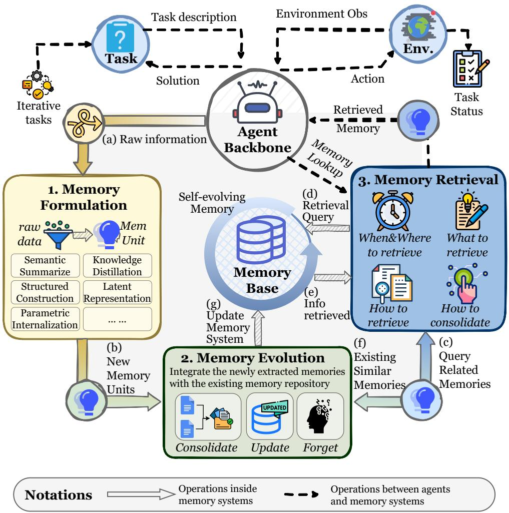
图8 智能体记忆的操作动态。我们将完整的记忆生命周期解耦为三个基本过程，驱动系统的适应性和自我进化：（1）记忆形成将原始交互经验转化为信息密集的知识单元，通过选择性地识别具有长期效用的模式；（2）记忆演化通过整合、更新和遗忘机制将新记忆动态整合到现有存储库中，以确保知识库保持连贯和高效；（3）记忆检索执行上下文感知查询以访问特定的记忆模块，从而通过精确的信息支持优化推理性能。字母顺序表示记忆系统内的操作序列。

前几节介绍了记忆的架构形式（第3节）和功能角色（第4节），勾勒了智能体记忆的相对静态的概念框架。然而，这种静态观点忽视了根本上表征智能体记忆的内在动态性。与静态编码在模型参数或固定数据库中的知识不同，智能体记忆系统可以动态构建和更新其记忆存储，并根据不同查询执行定制化检索。这种自适应能力对于使智能体能够自我进化和进行终身学习至关重要。

因此，本节研究从静态存储到动态记忆管理和利用的范式转变。这种范式转变反映了智能体记忆相对于静态数据库方法的基本操作优势。在实践中，智能体记忆系统可以基于推理痕迹和环境反馈自主提取精炼的、可泛化的知识。通过将新提取的知识与现有记忆基础动态融合和更新，系统确保对不断变化的环境的持续适应并减轻认知冲突。基于构建的记忆基础，系统在精确时刻从指定的记忆模块执行有针对性的检索，从而有效增强推理。为了系统分析记忆系统“如何”运作和演化，我们通过将其分解为三个基本过程来研究完整的记忆生命周期。图8提供了这种动态记忆生命周期的整体说明，突出了记忆形成、演化和检索如何相互作用以支持自适应和自我进化的智能体行为。

# 记忆系统中的三个基本过程

# 记忆系统中的三个基本过程

1. 记忆形成（第5.1节）：这一过程专注于将原始经验转化为信息密集的知识。与被动记录所有交互历史不同，记忆系统会选择性识别具有长期效用的信息，例如成功的推理模式或环境约束。这部分回答了问题：“如何提取记忆？”
2. 记忆演化（第5.2节）：这一过程代表了记忆系统的动态演化。它专注于将新形成的记忆与现有记忆基础进行整合。通过关联条目的巩固、冲突解决和自适应剪枝等机制，系统确保记忆在不断变化的环境中保持可泛化性、连贯性和效率。这部分回答了问题：“如何精炼记忆？”
3. 记忆检索（第5.3节）：这一过程决定了检索记忆的质量。系统根据上下文构建任务感知的查询，并使用精心设计的检索策略访问适当的记忆库。因此，检索到的记忆在语义上相关且在功能上对推理至关重要。这部分回答了问题：“如何利用记忆？”

这三个过程并非独立；相反，它们形成了一个相互连接的循环，驱动着记忆系统的动态演化和操作。在记忆形成阶段提取的记忆，在记忆演化阶段与现有记忆基础进行整合和更新。利用前两个阶段构建的记忆基础，记忆检索阶段实现有针对性的访问以优化推理。反过来，推理结果和环境反馈会反馈到记忆形成以提取新见解，并反馈到记忆演化以精炼记忆基础。总的来说，这些组件使得大语言模型能够从静态的条件生成器转变为能够持续学习并响应变化环境的动态系统。

# 5.1 记忆形成

我们将记忆形成定义为将原始上下文（例如对话或图像）编码为紧凑知识的过程。记忆形成的必要性源于处理冗长、嘈杂且高度冗余的原始上下文所固有的扩展限制。完整上下文提示通常会遇到计算开销、过大的内存占用以及分布外输入长度上推理性能下降的问题。为了缓解这些问题，最近的记忆系统将基本信息提炼为可高效存储和精确检索的表示，从而实现更高效和有效的推理。

记忆形成并非独立于前面的章节。根据任务类型，记忆形成过程有选择地提取第3节中描述的不同架构记忆，以完成第4节中概述的相应功能。基于信息压缩的粒度和编码的逻辑，我们将记忆形成过程分为五种不同的类型。表7总结了每个类别下的代表性方法，比较了它们的子类型、表示形式和关键机制。

# 记忆形成操作的五种类别

- 语义摘要（第5.1.1节）将冗长的原始数据转化为紧凑的摘要，过滤冗余的同时保留全局、高级的语义信息以减少上下文开销。
- 知识蒸馏（第5.1.2节）提取特定的认知资产，范围从事实细节到经验性规划策略。
- 结构化构建（第5.1.3节）将无定形的源数据组织成显式的拓扑表示，例如知识图谱或分层树，以增强记忆的可解释性并支持多跳推理。
- 潜在表示（第5.1.4节）将原始经验直接编码为连续潜在空间内的机器原生格式（例如向量嵌入或KV状态）。
- 参数化内化（第5.1.5节）通过参数更新将外部记忆直接整合到模型的权重空间中，有效地将可检索信息转化为智能体的内在能力和本能。

虽然我们将这些方法分为五类，但我们认为这些记忆形成策略并非互斥。单个算法可以集成多种记忆形成策略，并在不同表示之间转换知识（Li et al., 2025k）。

# 5.1.1 语义摘要

语义摘要将原始观测数据转化为紧凑且语义丰富的摘要。产生的摘要捕获了原始数据的全局、高级信息，而非特定的事实或经验细节（Zhao et al., 2024; Anokhin et al., 2024）。此类摘要的典型示例包括文档的总体叙述（Kim and Kim, 2025; Yu et al., 2025a）、任务的过程流程（Ye et al., 2025a; Zhang et al., 2025q）或用户的历史档案（Zhang, 2024; Westhäuser et al., 2025）。通过过滤冗余内容同时保留任务相关的全局语义，语义摘要为后续推理提供了高级指导蓝图，而不会引入过多的上下文开销。为了实现这些效果，压缩过程可以通过两种主要方式实现：增量式语义摘要和分区式语义摘要。

增量式语义摘要 这种范式采用时间整合机制，将新观测的信息与现有摘要持续融合，产生全局语义的演化表示。这种分块范式支持增量学习（McCloskey and Cohen, 1989），规避了全序列处理的$O(n^{2})$计算负担（Yu et al., 2025a），并促进向全局语义的渐进收敛（Chen et al., 2024b）。早期的实现如MemGPT（Packer et al., 2023a）和Mem0（Chhikara et al., 2025）在适当时刻直接将新块与现有摘要合并，仅依赖于大语言模型固有的摘要能力。然而，这种方法受限于模型有限的能力，常常导致不一致或语义漂移。为了缓解这些问题，Chen et al.（2024b）和Wu et al.（2025i）引入了外部评估器来过滤冗余或不连贯的内容，分别使用基于卷积的判别器进行一致性验证和使用DeBERTa（He et al., 2020）过滤琐碎内容。不依赖辅助网络，后续方法如Mem1（Zhou et al., 2025b）和MemAgent（Yu et al., 2025a）通过使用PPO（Schulman et al., 2017）和GRPO（Shao et al., 2024）的强化学习增强了大语言模型自身的摘要能力。

随着增量摘要从启发式融合发展到过滤式集成，最终到基于学习的优化，摘要能力日益内化于模型中。然而，串行更新的性质仍然带来计算瓶颈（Fang et al., 2025b）和潜在的信息遗忘，这促进了分区式语义摘要方法的发展。

分区式语义摘要 这种范式采用空间分解机制，将信息划分为不同的语义分区，并为每个分区生成独立的摘要。早期的研究通常采用启发式分区策略来处理长上下文。MemoryBank（Zhong et al., 2024）和COMEDY（Chen et al., 2025c）通过将每天或每个会话视为基本单位来总结和聚合长期对话。在结构维度上，Wu et al.（2021）和Bailly et al.（2025）通过将长文档分割为章节或段落来生成摘要的摘要。虽然直观，但此类方法常常遭受跨分区语义不连续的问题。为了解决这个问题，诸如ReadAgent（Lee et al., 2024a）和LightMem（Fang et al., 2025b）等方法在摘要之前引入了语义或主题聚类，从而增强了块间连贯性。超越文本压缩，DeepSeek-OCR（Wei et al., 2025a）开创了通过光学2D映射压缩长上下文的思路，在多模态场景中实现了更高的压缩比。在视频记忆领域，FDVS（You et al., 2024）和LangRepo（Kahatapitiya et al., 2025）将长视频分割为片段，并通过集成多源信号（如字幕、对象检测和场景描述）生成文本摘要，然后分层聚合为全局长视频故事。

与增量式摘要相比，分区式方法提供了更高的效率并捕获了更细粒度的语义。然而，其对每个子块的独立处理可能导致跨分区语义依赖的丢失。

总结 语义摘要作为一种有损压缩机制，旨在从冗长的交互日志中提取要点。与逐字存储不同，它优先考虑全局语义连贯性而非局部事实精确性，将线性流转化为紧凑的叙述块。语义摘要的主要优势是效率：它大幅减少了上下文长度，非常适合长期对话。然而，代价是分辨率损失：特定细节或细微线索可能被平滑掉，限制了其在证据关键任务中的效用。

# 5.1.2 知识蒸馏

虽然语义摘要在宏观层面捕获原始数据的全局语义，但知识蒸馏在更细的粒度上运行，从交互轨迹或文档中提取可重用的知识。广义上讲，知识指的是第4节中描述的各种形式的事实和经验记忆，取决于任务的基础功能。

蒸馏事实记忆 这一过程专注于将原始交互和文档转化为关于用户和环境状态的明确、陈述性知识。这一过程确保智能体通过保留可验证的事实而非瞬态上下文来保持一致性和适应性。在用户建模领域，诸如TiM（Liu et al., 2023a）和RMM（Tan et al., 2025c）等系统采用抽象机制将对话轮次转化为高级思维或基于主题的记忆，从而保持长期人设连贯性。对于用户的目标建模，MemGuide（Du et al., 2025b）等方法从对话中提取用户意图描述。在推理过程中，它捕获并更新目标状态，将已确认的约束与未解决的意图分开，以减轻目标漂移。此外，这种蒸馏扩展到多模态环境，其中像ESR（Shen et al., 2024）和M3-Agent（Long et al., 2025）这样的智能体将以自我为中心的视觉观察压缩为关于物体位置和用户习惯的文本可寻址事实。

蒸馏经验记忆 这一过程专注于从历史轨迹中提取任务执行的底层策略。通过从成功轨迹中推导规划原则并从失败中提取纠正信号，这种范式增强了智能体在特定任务上的问题解决能力。通过抽象和泛化，它进一步支持跨任务知识迁移。因此，经验泛化使智能体能够持续完善其能力，并朝着终身学习迈进。

这一研究方向旨在从成功和失败的轨迹中推导高级规划策略和关键见解。一些方法侧重于基于成功的蒸馏，其中诸如AgentRR（Feng et al., 2025）和AWM（Wang et al., 2024l）等系统从成功案例中总结整体任务计划。$\mathrm{Mem}^p$（Fang et al., 2025d）分析并总结训练集中的黄金轨迹，将它们提炼为抽象的程序性知识。其他方法采用失败驱动的反思，例如Matrix（Liu et al., 2024）、SAGE（Liang et al., 2025）和R2D2（Huang et al., 2025c），它们将推理轨迹与真实答案进行比较，以识别错误源并提取反思性见解。结合两者，ExpeL（Zhao et al., 2024）和From Experience to Strategy（Xia et al., 2025）对比成功和失败的经验，以发现整体规划见解。

然而，先前的工作主要侧重于总结任务级的规划知识，缺乏细粒度、步骤级的见解。为了弥补这一差距，$\mathrm{H}^2\mathrm{R}$（Ye et al., 2025b）引入了两层反思机制：它遵循ExpeL构建高级规划见解池，同时进一步按子目标序列分割轨迹以推导逐步执行见解。

早期的方法依赖于固定提示进行见解提取，使得其性能对提示设计和底层大语言模型的能力敏感。最近，可训练的蒸馏方法变得流行。Learn-to-Memorize（Zhang et al., 2025t）为不同智能体优化任务特定的提示。另一方面，Memory-R1（Yan et al., 2025b）使用LLMExtract模块获取经验和事实知识，而只有后续的融合组件被训练以将这些输出整合到记忆库中。虽然这些方法采用端到端框架，但它们在增强大语言模型提炼见解的内在能力方面仍然不足。为了克服这一限制，Mem-$\alpha$（Wang et al., 2025o）明确地训练大语言模型学习提取哪些见解以及如何保留它们。

总结 这一部分侧重于从原始上下文中提取功能特定的知识，而不涉及记忆存储的结构。每个知识片段都可以被视为一个扁平记忆单元。简单地将多个单元存储在非结构化表中忽略了它们之间的语义和层次关系。为了解决这个问题，记忆形成过程可以应用结构化规则来推导见解，并将其存储在分层架构中。简单但关键的是，这里介绍的单次知识蒸馏方法作为更复杂和结构化的记忆形成机制的基础组件。

# 5.1.3 结构化构建

虽然语义摘要（第5.1.1节）和知识蒸馏（第5.1.2节）在不同粒度级别上有效地压缩摘要和知识，但它们通常将记忆视为孤立的单元。相比之下，结构化构建将无定形的数据转化为有组织的拓扑表示。这一过程不仅仅是存储格式的改变，而是一种主动的结构化操作，决定了信息如何链接和分层。与非结构化的纯文本摘要不同，结构化提取显著增强了可解释性和检索效率。至关重要的是，这种结构化先验擅长捕获多跳推理任务中的复杂逻辑和依赖关系，相比传统的检索增强方法提供了显著优势。

基于底层结构推导的操作粒度，我们将现有方法分为两种范式：实体级构建，通过将文本原子化为实体和关系来构建底层拓扑；块级构建，通过组织完整的文本片段或记忆项来构建结构。

实体级构建 这一范式的基础结构源自关系三元组提取，它将原始上下文分解为其最细粒度的语义原子实体和关系。传统方法将记忆建模为平面知识图谱。例如，KGT（Sun et al., 2024）引入了一种实时个性化机制，其中用户偏好和反馈直接编码为用户特定知识图谱中的节点和边。类似地，$\mathsf{Mem}^{0^g}$（Chhikara et al., 2025）在提取阶段使用大语言模型直接将对话消息转换为实体和关系三元组。

然而，这些直接提取方法通常受限于大语言模型的固有能力，导致潜在的噪声或结构错误。为了提高构建图的质量，D-SMART（Lei et al., 2025）采用了一种精细的方法：首先使用大语言模型将核心语义内容提炼为简洁的、类似断言的陈述，随后通过神经符号管道提取符合OWL的知识图谱片段。此外，Ret-LLM（Modarressi et al., 2023）对大语言模型进行监督微调，实现了与关系图更稳健的读写交互。

虽然上述方法侧重于平面结构，但最近的进展朝着构建分层记忆以捕获高级抽象方向发展。例如，GraphRAG（Edge et al., 2025）从源文档中推导实体知识图谱，并应用社区检测算法迭代地提取图社区并生成社区摘要。这种分层方法识别实体之间的高级集群关联，使得能够提取泛化的见解并促进在不同粒度级别上的灵活检索。

为了更好地反映原始数据的内在连贯性和时间信息，一些工作通过结合情景图来扩展语义知识图谱。AriGraph（Anokhin et al., 2024）和HippoRAG（Gutierrez et al., 2024）建立了一个双层结构，包括语义图和情景图。它们从对话中提取语义三元组，同时连接同时出现的节点或建立节点-段落索引。Zep（Rasmussen et al., 2025）进一步将其形式化为三层时间图架构：一个情景子图$(\mathcal{G}_e)$，通过双时间模型记录原始消息的出现和处理时间；一个语义子图$(\mathcal{G}_s)$，用于实体和时间限定的事实；以及一个社区子图$(\mathcal{G}_c)$，用于实体的高级聚类和摘要。

块级构建 这一范式将连续的文本跨度或离散的记忆项视为节点，在将它们组织成拓扑结构的同时保持局部语义完整性。这一领域的演进从对固定语料库的静态、平面（2D）提取，发展到具有传入轨迹的动态适应，最终到分层（3D）架构。

早期方法侧重于将固定的文本库组织成静态平面结构。HAT（A et al., 2024）通过分割长文本并逐步聚合摘要来构建分层树。类似地，RAPTOR（Sarthi et al., 2024）使用UMAP进行降维和高斯混合模型进行软聚类，递归地对文本块进行聚类，迭代地总结这些聚类以形成树。然而，这些静态方法缺乏处理流数据的灵活性，且在没有昂贵重建的情况下无法实现。

为了解决这个问题，动态平面方法在新轨迹到达时增量地构建记忆结构，其基础元素各不相同。基于原始文本的方法包括MemTree（Rezazadeh et al., 2025c）和H-MEM（Sun and Zeng, 2025）。MemTree采用自底向上的方法，其中新文本片段检索最相似的节点，并作为子节点或迭代地插入子树，触发所有父节点的自底向上摘要更新。相反，H-MEM采用自顶向下的策略，提示大语言模型将数据组织成包含领域、类别、记忆痕迹和情节层的四层JSON层次结构。或者，A-MEM（Xu et al., 2025c）和PREMem（Kim et al., 2025b）侧重于重组提取的记忆项。A-MEM将知识总结为离散的笔记，并链接相关的笔记以构建网络化记忆。PREMem对提取的事实性、经验性和主观性记忆进行聚类，以识别和存储更高维度的跨会话推理模式。

最近的进展超越了平面布局，构建了层次结构，提供了更丰富的语义深度。SGMem（Wu et al., 2025h）通过使用NLTK将文本分割为句子，在所有句子节点之间形成KNN图，随后调用大语言模型提取与每个对话对应的摘要、事实和见解来构建层次结构。为了支持在流数据到达时增量构建层次结构，CAM（Li et al., 2025f）基于语义相关性和叙述连贯性在文本块之间建立边。它迭代地总结自我图，并通过节点复制显式地解开重叠聚类来处理新记忆的插入。在多智能体场景中，G-memory（Zhang et al., 2025c）通过维护三个不同的图扩展了这种动态3D方法：用于原始聊天历史的交互图，用于特定任务的查询图，以及见解图。这种结构使得每个智能体能够接收不同粒度级别的定制记忆。

总结 结构化构建的主要优势是可解释性和处理复杂关系查询的能力。此类方法捕获了记忆元素之间复杂的语义和层次关系，支持对多步依赖关系的推理，并促进与符号或基于图的推理框架的集成。然而，缺点是模式刚性：预定义的结构可能无法表示细微或模糊的信息，且提取和维护成本通常较高。

# 5.1.4 潜在表示

前面的章节侧重于如何构建令牌级记忆；这一部分侧重于将记忆编码为机器的原生潜在表示。潜在表示将原始经验编码为存在于潜在空间中的嵌入。与语义压缩和结构化提取不同（它们在将经验嵌入向量之前进行总结），潜在编码本质上将经验存储在潜在空间中，从而减少了在总结和文本嵌入过程中的信息损失。此外，潜在编码更有利于机器认知，实现了跨模态的统一表示，并确保了记忆表示中的密度和语义丰富性。

文本潜在表示 虽然最初设计用于加速推理，但KV缓存也可以被视为记忆上下文中的一种潜在表示形式（Li et al., 2025c; Jiang et al., 2025b）。它利用额外的内存来存储过去的信息，从而避免冗余计算。MEMORYLLM（Wang et al., 2024j）和$\mathrm{M}+$（Wang et al., 2025m）将记忆表示为自更新的潜在嵌入，在推理期间注入到Transformer层中。此外，MemGen（Zhang et al., 2025d）引入了记忆触发器来监控智能体的推理状态，并确定何时显式调用记忆，以及一个记忆织造器，利用智能体的当前状态构建一个潜在令牌序列。该序列充当机器原生记忆，丰富了智能体的推理能力。

多模态潜在表示 在多模态记忆研究中，CoMEM（Wu et al., 2025d）通过Q-Former将视觉-语言输入压缩为固定长度的令牌，实现了密集、连续的记忆，并支持即插即用，以无限上下文长度使用。编码-存储-检索（Shen et al., 2024）使用Ego-LLaVA将以自我为中心的视频帧转换为语言编码，随后通过嵌入模型转换为向量表示。虽然使用了嵌入模型以确保语义对齐，但这些方法通常在压缩损失和计算开销之间面临权衡，尤其是在处理长上下文序列中的梯度流时。

当与具身人工智能集成时，多模态潜在记忆可以融合来自多个传感器的数据。例如，Mem2Ego（Zhang et al., 2025l）动态地将全局上下文信息与局部感知对齐，将地标语义嵌入为潜在记忆，以增强长时程任务中的空间推理和决策能力。KARMA（Wang et al., 2025q）采用混合长短期记忆形式，将对象信息编码为多模态嵌入，实现了即时响应性和一致表示之间的平衡。这些探索强调了潜在编码在提供跨模态的统一且语义丰富的表示方面的优势。

总结 潜在表示绕过了人类可读的格式，将经验直接编码为机器原生的向量或KV缓存。这种高密度格式保留了可能在文本解码中丢失的丰富语义信号，实现了与模型内部计算更平滑的集成，并且无缝支持多模态对齐。然而，它的缺点是不透明。潜在记忆是一个黑盒，使得人类难以调试、编辑或验证其存储的知识。

# 5.1.5 参数化内化

随着大语言模型越来越多地集成记忆系统以支持长期适应，一个核心研究问题是这些外部记忆应如何整合为参数化形式。虽然上面讨论的潜在表示方法将记忆参数化在模型外部，但参数化内化直接调整模型的内部参数。它利用模型通过学习到的参数空间编码和泛化信息的能力。这种范式从根本上增强了模型的内在能力，消除了外部存储和检索的开销，同时无缝支持持续更新。正如我们在第4节中讨论的，并非所有记忆内容都服务于相同的功能：一些条目提供陈述性知识，而另一些则编码程序性策略，这些策略塑造了智能体的推理和行为。这种区别激发了对记忆内化更细粒度的看法，将其分为知识内化和能力内化。

知识内化 这一策略涉及将外部存储的事实记忆（例如概念定义或领域知识）转换为模型的参数空间。通过这个过程，模型可以直接回忆和利用这些事实，而无需依赖显式检索或外部记忆模块。在实践中，知识内化通常通过模型编辑实现（Sinitsin et al., 2020; De Cao et al., 2021）。早期的工作，如MEND（Mitchell et al., 2022），引入了一个辅助网络，通过分解微调梯度实现快速、单步编辑，从而最小化对不相关知识的干扰。基于这一工作线，ROME（Meng et al., 2022）通过使用因果追踪精确定位存储特定事实的MLP层，并应用秩一更新以更高的精度和更好的泛化能力注入新信息，改进了编辑过程。MEMIT（Meng et al., 2023）进一步推进了这一方向，支持批量编辑，通过多层残差分布和批量公式实现同时更新数千个事实，显著提高了可扩展性。随着像LoRA（Hu et al., 2022）这样的参数高效范式的兴起，知识内化可以通过轻量级适配器而非直接参数修改来执行。例如，CoLoR（Wistuba et al., 2023）冻结预训练的Transformer参数，仅训练小的LoRA适配器来内化新知识，避免了全参数微调的高成本。尽管有这些进展，但这些方法仍然可能产生脱靶效应（De Cao et al., 2021），并且在持续学习场景中容易受到灾难性遗忘的影响。

能力内化 这一策略旨在将经验知识（例如程序性专业知识或战略启发式）嵌入到模型的参数空间中。这种范式在广义上代表了一种记忆形成操作，从获取事实知识转向内化经验能力。具体来说，这些能力包括领域特定的解决方案模式、战略规划以及智能体技能的有效部署等。从技术上讲，能力内化是通过从推理轨迹中学习来实现的，通过监督微调（Wei et al., 2022; Zelikman et al., 2022; Schick et al., 2023; Mukherjee et al., 2023）或偏好引导的优化方法，如DPO（Rafailov et al., 2023; Tunstall et al., 2023; Yuan et al., 2024c; Grattafiori et al., 2024）和GRPO（Shao et al., 2024; DeepSeek-AI et al., 2025）。由于这方面不属于典型智能体记忆研究的范围，本节将不详细讨论。

总结 参数化内化代表了记忆的最终巩固，外部知识通过梯度融合到模型的权重中。这将范式从检索信息转变为拥有能力，模仿生物的长时程增强。随着知识变得实际上像本能一样，访问是零延迟的，使得模型能够立即响应而无需查询外部记忆。然而，这种方法面临几个挑战，包括灾难性遗忘和高更新成本。与外部记忆不同，参数化内化难以精确修改或移除而不产生意外副作用，限制了灵活性和适应性。

# 5.2 记忆演化

第5.1节介绍的记忆形成从原始数据中提取记忆。下一个重要步骤是将新提取的记忆与现有的记忆库整合，实现记忆系统的动态演化。一个简单的策略是简单地将新条目追加到现有的记忆库中。然而，这忽视了记忆条目之间的语义依赖和潜在矛盾，并忽略了信息的时间有效性。为了解决这些限制，我们引入了记忆演化。这种机制巩固新记忆和现有记忆，以综合高级见解、解决逻辑冲突并剪枝过时数据。通过确保长期知识的紧凑性、一致性和相关性，这种方法使得记忆系统能够随着环境和任务的演化而调整其认知过程和上下文理解。

基于记忆演化的目标，我们将其分类为以下机制：

# 记忆演化的三种机制

- 记忆巩固（第5.2.1节）合并新记忆和现有记忆，并进行反思性整合，形成更泛化的见解。这确保学习是累积的而非孤立的。
- 记忆更新（第5.2.2节）解决新记忆和现有记忆之间的冲突，纠正和补充存储库以保持准确性和相关性。它使得智能体能够适应环境或任务需求的变化。
- 记忆遗忘（第5.2.3节）移除过时或冗余的信息，释放容量并提高效率。这防止了由于知识过载导致的性能下降，并确保记忆存储库专注于可操作且当前的知识。

这些机制共同维持记忆存储库的泛化性、准确性和及时性。通过主动管理记忆演化，这些机制强调了记忆系统的智能能力，促进了持续学习和自主自我改进。图9提供了这些记忆演化机制的统一视图，说明了它们在一个共享记忆数据库中的操作角色和代表性框架。

# 5.2.1 巩固

记忆巩固旨在将新获取的短期痕迹转化为结构化和可泛化的长期知识。其核心机制是识别新记忆与现有记忆之间的语义关系，并将它们整合为更高级别的抽象或见解。这个过程服务于两个主要目的。首先，它将碎片化的信息重新组织成连贯的结构，防止关键细节在短期保留过程中丢失，并促进稳定知识模式的形成。其次，通过对经验数据进行抽象、压缩和泛化，巩固从特定事件中提取可重用模式，产生支持跨任务泛化的见解。

一个核心挑战是确定新记忆应以何种粒度与现有记忆匹配和合并。先前的工作涵盖了一系列巩固策略，从局部内容合并到集群级融合和全局整合。

局部巩固 此操作侧重于涉及高度相似记忆片段的细粒度更新。在RMM（Tan et al., 2025c）中，每个新主题记忆检索其前K个最相似的候选记忆，并由大语言模型决定合并是否合适，从而降低错误泛化的风险。在多模态设置中，VLN（Song et al., 2025b）在容量饱和时触发汇集机制。它识别最相似或冗余的记忆对，并将它们压缩为更高级别的抽象。这些方法在保留记忆存储全局结构的同时精炼详细知识，提高了精确度和存储效率。然而，它们无法完全捕获集群级关系或跨语义相关记忆出现的高阶依赖关系。

集群级融合 随着记忆增长，采用集群级融合对于捕获跨实例的规律性至关重要。跨集群方面，PREMem（Kim et al., 2025b）将新记忆集群与相似的现有集群对齐，并应用泛化和精炼等融合模式来形成高阶推理单元，显著提高了可解释性和推理深度。在集群内部，TiM（Liu et al., 2023a）定期调用大语言模型检查共享同一哈希桶的记忆，并合并语义冗余的条目。CAM（Li et al., 2025f）将目标集群内的所有节点合并为一个代表性摘要，产生更高级别且一致的跨样本表示。这些方法在更广泛的范围内重组记忆结构，标志着迈向结构化知识的重要一步。

全局整合 此操作执行整体巩固以保持全局连贯性，并从累积的经验中提炼系统级见解。与第5.1.1节相比，语义摘要侧重于从现有上下文中推导全局摘要，可以被视为摘要的初始构建。相比之下，本段强调新信息如何被整合到现有摘要中，随着额外数据的到达。对于用户事实记忆，MOOM（Chen et al., 2025d）通过基于规则的处理、嵌入方法和LLM驱动的抽象，将临时角色快照与历史痕迹整合，构建稳定的角色档案。对于经验记忆，Matrix（Liu et al., 2024）执行迭代优化，将执行轨迹和反思性见解与全局记忆结合，提炼支持跨场景重用的任务无关原则。随着单步推理上下文和环境反馈的延长，像AgentFold（Ye et al., 2025a）和Context Folding（Zhang et al., 2025q）这样的方法内化了压缩工作记忆的能力。在多步交互中，包括网络导航，这些方法在每个步骤后自动总结和压缩全局上下文，支持高效和有效的推理。全局整合从完整的经验历史中巩固高级、结构化的知识，提供了可靠的上下文基础，同时提高了泛化能力、推理准确性和个性化决策能力。

总结 巩固是将碎片化的短期痕迹重组为连贯的长期模式的认知过程。它超越了简单的存储，合成了孤立条目之间的联系，形成了结构化的世界观。它增强了泛化能力并减少了存储冗余。然而，它存在信息平滑的风险，其中异常事件或独特例外在抽象过程中丢失，可能降低智能体对异常和特定事件的敏感性。

# 5.2.2 更新

记忆更新是指当冲突出现或新信息被获取时，智能体修订或替换其现有记忆的过程。目标是在不进行完整模型重新训练的情况下保持事实一致性和持续适应性。与第5.2.1节中描述的记忆巩固（侧重于抽象和泛化）不同，记忆更新强调局部纠正和同步，使得智能体能够保持与演化环境的一致性。

通过持续更新，智能记忆系统保持了知识的准确性和及时性，防止过时信息影响推理。因此，它是实现终身学习和自我演化的核心机制。根据记忆的存储位置，更新分为两类：（1）外部记忆更新：对外部记忆存储的更新；（2）模型编辑：参数空间内的模型内部编辑。

外部记忆更新 每当出现矛盾或新事实时，向量数据库或知识图谱中的条目都会被修订。这种方法不改变模型权重，而是通过动态修改外部存储来保持事实对齐。静态记忆不可避免地积累过时或冲突的条目，导致逻辑不一致和推理错误。更新外部记忆使得能够进行轻量级纠正，同时避免了完整重新训练或重新索引的成本。

外部记忆更新机制的发展沿着一条轨迹演进，从基于规则的纠正发展到时间感知的软删除，再到延迟一致性策略，最终到完全学习的更新策略。早期的系统如MemGPT（Packer et al., 2023a）、D-SMOTE（Lei et al., 2025）和$\mathrm{Mem}^{g}$（Chhikara et al., 2025）遵循一个直接的流水线，其中大语言模型检测新信息之间的冲突，然后调用替换或删除操作来更新记忆。虽然对于基本事实修复有效，但这些系统依赖于破坏性替换，抹去了有价值的历史上下文并破坏了时间连续性。为了解决这个问题，Zep（Rasmussen et al., 2025）引入了时间标注，用无效的时间戳标记冲突事实而非删除它们，从而保持了语义一致性和时间完整性。这标志着从硬替换到软、时间感知更新的转变。然而，实时更新在高频交互下带来了显著的计算和I/O负担。因此，MOOM（Chen et al., 2025d）和LightMem（Fang et al., 2025b）引入了双阶段更新：用于实时响应的软在线更新，随后是离线反思巩固阶段，其中通过LLM推理合并相似条目并解决冲突。这种最终一致性范式平衡了延迟和连贯性。随着智能强化学习的成熟，通过强化学习增强大语言模型内在记忆更新决策成为可能。Mem-$\alpha$（Wang et al., 2025o）将记忆更新制定为一个策略学习问题，使得大语言模型能够学习何时、如何以及是否更新，从而在稳定性和新鲜度之间实现动态权衡。

总的来说，外部记忆更新已经从手动触发的纠正转变为自我调节的、时间感知的学习过程，通过LLM驱动的检索、冲突检测和修订来保持事实一致性和结构稳定性。

模型编辑 模型编辑在模型的参数空间内执行直接修改以纠正或注入知识，而无需完整重新训练，代表了隐式知识更新。重新训练成本高昂且容易导致灾难性遗忘。模型编辑实现了精确、低成本的纠正，增强了适应性和内部知识保留。

模型编辑的方法主要分为两类。（1）显式定位和修改：ROME（Tan et al., 2025b）通过梯度追踪识别编码特定知识的参数区域，并执行有针对性的权重更新；模型编辑器网络（Tang et al., 2025c）训练一个辅助元编辑器网络来预测最佳参数调整。（2）潜在空间自更新：MEMORYLLM（Xu et al., 2025c）在Transformer层内嵌入一个记忆池，定期替换记忆令牌以整合新知识；$\mathrm{M}+$（Wang et al., 2025m）维护双层记忆，丢弃过时的短期条目并将关键信息压缩为长期存储。

混合方法如ChemAgent（Tang et al., 2025c）进一步结合了外部记忆更新和内部模型编辑，同步事实和表示的变化，以实现快速的跨领域适应。

总结 从实现的角度来看，记忆更新侧重于解决由新记忆到达触发的冲突和修订知识，而记忆巩固则强调新知识和现有知识的整合与抽象。上面讨论的两种记忆更新策略建立了一个双路径机制，涉及外部数据库中的冲突解决和模型内的参数编辑，使得智能体能够执行持续的自我纠正并支持长期演化。关键挑战是稳定性-可塑性困境：确定何时覆盖现有知识，何时将新信息视为噪声。不正确的更新可能会覆盖关键信息，导致知识退化和错误推理。

# 5.2.3 遗忘

记忆遗忘指的是有意移除过时、冗余或低价值信息以释放容量并保持对显著知识的关注。与解决记忆之间冲突的更新机制不同，遗忘优先考虑消除过时信息以确保效率和相关性。随着时间的推移，无限制的记忆积累会导致噪声增加、检索延迟以及过时知识的干扰。受控遗忘有助于减轻过载并保持认知焦点。然而，过于激进的剪枝可能会删除罕见但关键的知识，损害长期上下文中的推理连续性。

遗忘机制可以分为基于时间的遗忘、基于频率的遗忘和基于重要性的遗忘，分别对应于创建时间、检索活动和综合语义评估。

基于时间的遗忘 时间驱动的遗忘仅考虑记忆的创建时间，随着时间的推移逐渐衰减其强度，以模拟人类记忆的消退。MemGPT（Packer et al., 2023a）在上下文溢出时逐出最早的消息。Xu et al.（2025c）和Wang et al.（2025m）采用随机令牌替换，替换比率为K/N，以模拟人类认知中的指数遗忘，一旦池容量超过限制就丢弃最旧的条目。与显式删除旧记忆不同，MAICC（Jiang et al., 2025c）通过随时间逐渐衰减记忆的权重来实现软遗忘。这个过程模拟了自然遗忘，确保了在不造成历史过载的情况下持续适应。

基于频率的遗忘 频率驱动的遗忘基于检索行为对记忆进行优先级排序，保留频繁访问的条目，同时丢弃不活跃的条目。XMem（Cheng and Schwing, 2022）采用LFU策略移除低频条目；KARMA（Wang et al., 2025q）使用计数布隆过滤器跟踪访问频率；MemOS（Li et al., 2025k）应用LRU策略，移除长期未使用的项，同时归档高度活跃的项。这确保了高效检索和存储平衡。通过区分创建时间和检索频率，这两个轴形成了一个更正交的分类法：基于时间的衰减捕获自然的时间老化，而基于频率的遗忘反映了使用动态，共同维持系统效率和时效性。

基于重要性的遗忘 基于重要性的遗忘整合了时间、频率和语义信号，以保留高价值知识，同时剪枝冗余。早期的工作如Zhong et al.（2024）和Chen et al.（2025d）通过结合时间衰减和访问频率的复合分数来量化重要性，实现了基于数值的选择性遗忘。后来的方法发展到语义级评估：VLN（Song et al., 2025b）通过相似性聚类汇集语义冗余的记忆，而Livia（Xi and Wang, 2025）结合情感显著性和上下文相关性来建模情感驱动的选择性遗忘。随着大语言模型发展出越来越强大的判断能力，TiM（Liu et al., 2023a）和MemTool（Lumer et al., 2025）利用大语言模型评估记忆重要性，并显式地剪枝或遗忘不太重要的记忆。这种转变反映了从静态数值评分到语义智能的过渡。智能体现在可以执行有意识的遗忘，并有选择地保留与任务上下文、语义和情感线索最相关的记忆。

总结 基于时间的衰减反映了记忆的自然时间消退，基于频率的遗忘确保了对频繁使用的记忆的高效访问，而基于重要性的遗忘引入了语义辨别力。这三种遗忘机制共同管理着智能记忆如何保持及时性、可访问性和语义相关性。然而，像LRU这样的启发式遗忘机制可能会消除长尾知识，这些知识很少被访问但对正确决策至关重要。因此，当存储成本不是关键限制时，许多记忆系统避免直接删除某些记忆。

# 5.3 记忆检索

基于第5.1节和第5.2节建立的记忆库，下一个关键步骤是在推理过程中如何检索和利用记忆。我们将记忆检索定义为在正确时刻从某个记忆库中检索相关且简洁的知识片段以支持当前推理任务的过程。关键挑战在于在大规模记忆存储中高效、准确地定位所需的知识片段。为了解决这个问题，许多算法采用启发式策略或可学习模型来优化检索过程的各个阶段。基于检索的执行顺序，这个过程可以分解为四个方面。图10提供了这一检索流水线的结构化概览，根据现有方法在检索阶段的作用进行组织。

# 记忆检索的四个步骤

- 检索时机与意图（第5.3.1节）决定了记忆检索的具体时刻和目标，从被动、指令驱动的触发器转向自主、自我调节的决策。
- 查询构建（第5.3.2节）通过分解或重写查询，将用户的原始输入与存储的记忆索引之间的语义鸿沟连接起来，形成有效的检索信号。
- 检索策略（第5.3.3节）在记忆库上执行搜索，采用从稀疏词汇匹配到密集语义嵌入和结构感知图遍历的范式。
- 检索后处理（第5.3.4节）通过重排序、过滤和聚合来精炼检索到的原始片段，确保提供给模型的最终上下文是简洁且连贯的。

总的来说，这些机制将记忆检索从静态搜索操作转变为动态认知过程。检索时机和意图决定了何时检索以及检索什么。接下来，查询构建指定了检索什么，检索策略侧重于如何执行检索。最后，检索后处理决定了检索到的信息如何被整合和使用。一个稳健的智能系统通常在统一的流水线中协调这些组件，使得智能体能够近似人类关联记忆激活，以实现高效的知识访问。

# 5.3.1 检索时机与意图

检索意图和时机决定了何时触发检索机制以及查询哪个记忆存储。现有的记忆系统在这方面采用了不同的设计选择，范围从始终开启的检索到由显式指令或内部信号触发的检索（Zhao et al., 2024; Wang et al., 2025o; Fang et al., 2025b）。例如，MIRIX（Wang and Chen, 2025）对每个查询从所有六个记忆数据库执行检索并拼接检索到的内容，反映了优先考虑全面记忆访问的设计。其他方法则旨在更选择性地触发检索，允许模型决定记忆访问的时机和范围，这可以导致更有针对性和更有效地使用记忆资源。在本小节中，我们从两个互补的视角回顾文献：自动化检索时机和自动化检索意图。

自动化检索时机 这一术语指的是模型在推理过程中自主决定何时触发记忆检索操作的能力。最简单的策略是将决策委托给大语言模型或外部控制器，允许它仅从查询中判断是否需要进行检索。例如，MemGPT（Packer et al., 2023a）和MemTool（Lumer et al., 2025）允许大语言模型本身调用检索函数，在类似操作系统的框架内实现对外部记忆的高效访问。然而，这些方法依赖于仅从查询进行的静态判断，忽略了模型在推理过程中动态演化的认知状态。

为了弥补这一限制，最近的工作将快-慢思维机制集成到检索时机中。例如，ComoRAG（Wang et al., 2025f）和PRIME（Tran et al., 2025）首先产生快速响应，然后让智能体评估其充分性。如果初始推理被认为不足，系统会基于失败反馈触发更深度的检索和推理。MemGen（Zhang et al., 2025d）通过将显式的智能体级决策转化为潜在的、可训练的过程，进一步细化了触发机制。它引入了记忆触发器，从潜在展开状态中检测关键的检索时刻，从而在保持端到端可微性的同时提高了检索时机的精确性。

自动化检索意图 这一方面涉及模型在分层存储形式中自主决定访问哪个记忆源的能力。例如，AgentRR（Feng et al., 2025）基于环境反馈在低级程序模板和高级经验抽象之间动态切换。然而，它对显式反馈的依赖限制了在开放式推理设置中的适用性。

为了克服这一限制，MemOS（Li et al., 2025k）采用了一个MemScheduler，基于用户、任务或组织级别的上下文在参数化记忆、激活记忆和纯文本记忆之间动态选择。然而，这种扁平选择方案忽略了记忆系统的层次结构。H-MEM（Sun and Zeng, 2025）通过引入基于索引的路由机制来解决这个问题，该机制执行从粗到细的检索，从领域层移动到情节层，并逐步将搜索空间缩小到最相关的子记忆。这种分层路由不仅提高了检索精度，还减轻了信息过载。

总结 自主时机和意图有助于减少计算开销并抑制不必要的噪声，但也造成了潜在的脆弱性。当智能体高估其内部知识并在需要时未能启动检索时，系统可能会陷入静默故障模式，其中知识缺口可能导致幻觉输出。因此，需要达到平衡：在正确时刻为智能体提供必要信息，同时避免引入噪声的过度检索。

# 5.3.2 查询构建

在启动检索过程之后，下一个挑战在于将原始查询转化为与记忆索引对齐的有效检索信号。查询构建充当了用户表面表达与记忆潜在存储之间的翻译层。传统方法通常直接基于用户查询进行检索，虽然简单但无法使查询语义与记忆索引的语义对齐。为了弥合这一差距，智能记忆系统主动执行查询分解或查询重写，生成与记忆的潜在结构更好匹配的中间检索信号。

查询分解 这种方法将一个复杂的查询分解为更简单的子查询，使得系统能够检索更细粒度和更相关的信息。这种分解通过实现模块化检索和对中间结果的推理，缓解了一次性检索的瓶颈。例如，Visconde（Pereira et al., 2023）和ChemAgent（Tang et al., 2025c）使用大语言模型将原始问题分解为子问题，从记忆中为每个子问题检索候选结果，最后将它们聚合为连贯的答案。然而，这些方法缺乏全局规划。为了解决这个问题，PRIME（Tran et al., 2025）和MA-RAG（Nguyen et al., 2025）引入了规划者智能体，灵感来自ReAct（Yao et al., 2023b）范式，该规划者首先制定全局检索计划，然后将其分解为子查询。然而，这些方法主要依赖于问题驱动的分解，因此无法明确识别模型缺少哪些具体知识。为了使子查询更有针对性，Agent KB（Tang et al., 2025d）采用了两阶段检索过程，其中教师模型观察学生模型的失败，并据此生成细粒度的子查询。这种有针对性的分解提高了检索精度，减少了不相关的结果，特别是在知识密集型任务中。

查询重写 这种策略不是分解，而是在检索前重写原始查询或生成假设文档以精炼其语义。这种重写减轻了用户意图与记忆索引之间的不匹配。例如，HyDE（Gao et al., 2023b）指导大语言模型以零样本方式生成假设文档，并使用其语义嵌入进行检索。生成的文档封装了所需的语义，有效地弥合了用户查询与目标记忆之间的鸿沟。MemoRAG（Qian et al., 2025）通过将全局记忆纳入假设文档生成来扩展这一思想。它首先压缩全局记忆，然后基于查询和压缩记忆生成草稿答案；该草稿随后被用作重写的查询。由于草稿可以访问全局记忆上下文，它能更忠实地捕获用户意图并揭示隐含的信息需求。类似地，MemGuide（Du et al., 2025b）利用对话上下文提示大语言模型生成一个简洁的、类似命令的短语，作为检索的高级意图描述。除了直接提示大语言模型重写查询外，Rewrite-Retrieve-Read（Ma et al., 2023b）通过强化学习训练一个小语言模型作为专用的重写器，而ToC（Kim et al., 2023a）采用澄清树来逐步精炼和指定用户的检索目标。

总结 这两种范式，分解和重写，并非互斥。Auto-RAG（Kim et al., 2024a）在相同的检索条件下评估HyDE和Visconde，然后为给定任务选择表现最佳的策略。这项工作的结果表明，记忆检索查询的质量对推理性能有重大影响。与早期主要侧重于设计复杂记忆架构的研究相比，最近的研究（Yan et al., 2025a）越来越强调检索构建过程，将记忆的角色转向服务于检索。毫不奇怪，使用什么进行检索的选择是这一过程的关键组成部分。

# 5.3.3 检索策略

在明确了检索目标之后，我们得到了一个意图明确的查询。下一个核心挑战在于利用这个查询从庞大而复杂的记忆库中高效、准确地检索真正相关的知识。检索策略作为查询与记忆基础之间的桥梁，其设计直接决定了检索效率和结果质量。在本节中，我们系统地回顾了各种检索范式，并分析了它们的优势、局限性和应用场景——从基于关键字匹配的传统稀疏检索，到使用语义嵌入的现代密集检索，到用于结构化知识的基于图的检索，到新兴的生成式检索方法，最后到集成多种范式的混合检索技术。

词汇检索 这种策略依赖于关键字匹配来定位相关文档，代表性方法包括TF-IDF（SPARCK JONES, 1972）和BM25（Robertson and Zaragoza, 2009）。TF-IDF基于词频和逆文档频率衡量关键词的重要性，实现快速且可解释的检索。BM25通过纳入词频饱和和文档长度归一化进一步优化了这种方法。此类方法通常用于面向精度的检索场景，其中结果的准确性和相关性优先于召回率（Tang et al., 2025d; Wang et al., 2025o; Pan et al., 2025）。然而，纯粹的词汇匹配难以捕获语义变化和上下文关系，使其对语言表达差异高度敏感，因此在开放领域知识或多模态记忆设置中效果较差。

语义检索 这种策略将查询和记忆条目编码到一个共享的嵌入空间中，并基于语义相似性而非词汇重叠进行匹配。代表性方法使用语义编码器，包括Sentence-BERT（Reimers and Gurevych, 2019）和CLIP（Radford et al., 2021）。在记忆系统中，这种方法更好地捕获了任务上下文，并支持语义泛化和模糊匹配，使其成为大多数智能记忆框架中的默认选择（Lewis et al., 2020; Wang et al., 2024b; Yang et al., 2024a; Xu et al., 2025c; Tan et al., 2025c; Nguyen et al., 2025; Qian et al., 2025; Hassell et al., 2025; Huang et al., 2025c）。然而，语义漂移和强制的前K检索常常引入检索噪声和虚假召回。为了解决这些问题，最近的系统集成了动态检索策略、重排序模块和混合检索方案。

图检索 这种策略不仅利用语义信号，还利用图的显式拓扑结构，实现了本质上更精确和结构感知的检索。通过直接访问结构路径，这些方法展现出更强的多跳推理能力，并且能更有效地探索长程依赖关系。此外，将关系结构作为推理路径的约束，自然地支持由精确规则和符号约束控制的检索。代表性方法如AriGraph（Anokhin et al., 2024）、EMG-RAG（Wang et al., 2024k）、Mem0g（Chhikara et al., 2025）和SGMem（Wu et al., 2025h）首先识别最相关的节点或三元组，然后扩展到其语义相关的K跳邻居以构建自我图。HippoRAG（Gutierrez et al., 2024）在检索到的节点上执行个性化的PageRank（Page et al., 1999），并根据它们与这些种子的接近程度对图的其余部分进行排名，从而实现有效的多跳检索。超越固定扩展规则，CAM（Li et al., 2025f）和D-SMART（Lei et al., 2025）使用大语言模型来引导子图探索：CAM使用大语言模型选择中心节点的信息丰富的邻居和子节点进行关联探索，而D-SMART将大语言模型视为规划器，在知识图谱记忆上对目标实体的单跳邻居和连接给定实体对的关系进行波束搜索。对于时间图，Zep（Rasmussen et al., 2025）和MemoTime（Tan et al., 2025b）进一步实现了在明确时间约束下的实体子图构建和关系检索，确保返回的结果满足所需的时间规则。

生成式检索 这种策略用直接生成相关文档标识符的模型取代词汇或语义检索（Tay et al., 2022; Wang et al., 2022b）。通过将检索构建为条件生成任务，模型在其参数中隐式存储候选文档，并在解码过程中执行深度查询-文档交互（Li et al., 2025j）。利用预训练语言模型的语义能力，这种范式通常优于传统检索方法，特别是在小规模设置中（Zeng et al., 2024）。然而，生成式检索需要额外的训练来内化所有候选文档的语义，当语料库演化时导致可扩展性有限（Yuan et al., 2024b）。由于这些原因，智能记忆系统对这一范式关注相对较少，尽管其生成和检索的紧密集成暗示了未开发的潜力。

混合检索 这种策略整合了多种检索范式的优势。诸如Agent KB（Tang et al., 2025d）和MIRIX（Wang and Chen, 2025）等系统结合词汇检索和语义检索，以平衡精确的术语或工具匹配与更广泛的语义对齐。类似地，Semantic Anchoring（Chatterjee and Agarwal, 2025）在语义嵌入和符号倒排索引上执行并行搜索，以实现互补覆盖。其他一些方法结合多种评估信号来指导检索。例如，Generative Agents（Kaiya et al., 2023）通过累积新近性、重要性和相关性的评分方案说明了这种多因素方法。MAICC（Jiang et al., 2025c）采用混合效用评分函数，整合了与全局和预测个体回报的相似性。在图基设置中，检索通常分两个阶段进行：语义检索首先识别相关节点或三元组，随后利用图拓扑来扩展搜索空间（Anokhin et al., 2024; Wang et al., 2024k; Gutierrez et al., 2024; Li et al., 2025f）。

在数据库基础设施层面，MemoriesDB（Ward, 2025）引入了一个为长期智能记忆设计的时间-语义-关系数据库，提供了一个将这些维度集成到统一存储和访问框架中的混合检索架构。

通过融合异构检索信号，混合方法保留了关键字匹配的精度，同时纳入了语义方法的上下文理解，最终产生更全面和更相关的结果。

# 5.3.4 检索后处理

初始检索返回的片段常常是冗余、嘈杂或语义不一致的。直接将结果注入提示可能导致过长的上下文、冲突的信息以及因不相关内容而分散的推理。因此，检索后处理对于确保提示质量变得至关重要。其目标是将检索结果提炼为简洁、准确且语义连贯的上下文。在实践中，两个组件是核心：（1）重排序和过滤：执行细粒度相关性估计，以移除不相关或过时的记忆，并对剩余片段重新排序，从而减少噪声和冗余。（2）聚合和压缩：将检索到的记忆与原始查询整合，消除重复，合并语义相似的信息，并重建一个紧凑且连贯的最终上下文。

重排序和过滤 为了保持简洁连贯的上下文，对初始检索结果进行重排序和过滤。早期方法依赖于评估语义一致性的启发式标准。例如，Semantic Anchoring（Chatterjee and Agarwal, 2025）整合了向量相似性与实体和话语级别的对齐，而RCR-Router（Liu et al., 2025c）结合了多种手工制作的信号，包括角色相关性、任务阶段优先级和新近性。然而，这些方法通常需要大量的超参数调整来平衡异构的重要性分数。为了减轻这一负担，learn-to-memorize（Zhang et al., 2025t）将分数聚合制定为强化学习问题，使模型能够学习检索信号的最优权重。虽然这些技术主要优化语义连贯性，但需要严格时间推理的场景需要额外的约束：Rasmussen et al.（2025）和Tan et al.（2025b）根据记忆的时间戳和有效窗口过滤记忆，以满足复杂的时间依赖关系。
随着大语言模型能力的不断增强，最近的方法利用其内在的语言理解能力直接评估记忆质量。Memory-R1（Yan et al., 2025b）和Westhauer et al.（2025）都引入了基于大语言模型的评估器（答案智能体或自我验证器智能体），这些评估器在生成最终响应之前过滤检索到的内容。然而，基于提示的过滤仍然受限于大语言模型的固有能力以及提示语义与下游使用之间的不匹配。因此，许多系统训练辅助模型以更稳健地估计记忆重要性（Tan et al., 2025c）。Memento（Zhou et al., 2025a）使用Q学习（Watkins and Dayan, 1992）来预测检索到的项目对正确答案做出贡献的概率，而MemGuide（Du et al., 2025b）则对LLaMA-8B（Grattafori et al., 2024）进行微调，以使用边际槽位完成增益对候选结果进行重新排序。总之，这些重新排序和过滤策略在不修改底层检索器的情况下精炼检索结果，使其与任何预训练的检索模型兼容，同时支持特定于任务的优化。

聚合与压缩 另一种通过检索后处理来提高下游推理质量和效率的方法是聚合与压缩。这个过程将检索到的证据与查询整合，形成一个连贯且紧凑的上下文。与主要解决噪声和优先级问题的过滤和重新排序不同，此阶段侧重于将多个碎片化的记忆项合并为更高级别和精炼的知识表示，并在需要任务特定适应时精炼这些表示。ComoRAG（Wang et al., 2025f）通过其集成智能体说明了这一思想，该智能体识别与查询语义对齐的历史信号，并将它们组合成一个抽象的全局摘要，提供广泛的上下文基础。MA-RAG（Nguyen et al., 2025）中的提取智能体对检索到的文档执行细粒度的内容选择，仅保留与当前子查询强烈相关的关键信息，并生成针对本地推理需求定制的简洁片段。

此外，G-Memory（Zhang et al., 2025c）将聚合与压缩扩展到多智能体系统的个性化中。它整合了检索到的高级见解和稀疏化的轨迹，然后使用大语言模型根据智能体的角色定制这些浓缩的经验。这个过程将通用知识精炼为角色特定的提示，填充智能体的个性化记忆。

总结 总之，检索后处理作为一个关键的中介步骤，将嘈杂、碎片化的检索结果转化为精确且连贯的推理上下文。通过上述机制，检索后处理不仅增强了提供给模型的记忆的密度和保真度，而且使信息与任务要求和智能体特征保持一致。

# 6 资源与框架

# 6.1 基准测试与数据集

在本节中，我们调查了用于评估基于大语言模型的智能体的记忆、长期、持续学习或长上下文能力的代表性基准测试和数据集。我们将这些基准测试分为两大类：（1）明确为记忆/终身学习/自我演化智能体设计的基准测试；（2）最初为其他目的（例如，工具使用能力、网络搜索、具身行动）开发但由于其长视野、多任务或顺序性质而与记忆评估相关的基准测试。

# 6.1.1 记忆/终身/自我演化智能体的基准测试

面向记忆的基准测试主要关注智能体如何构建、维护和利用过去交互或世界事实的显式记忆。这些任务通常探究多轮对话、用户特定会话或长合成叙述中的信息保留和检索，有时包括多模态信号。

表8提供了这些基准测试的 consolidated overview，包括它们的记忆焦点、环境类型、模态和评估规模，作为比较其设计目标和评估设置的结构化参考。代表性示例如 MemBench（Tan et al., 2025a）、LoCoMo（Maharana et al., 2024）、WebChoreArena（Miyai et al., 2025）、MT-Mind2Web（Deng et al., 2024）、PersonaMem（Jiang et al., 2025a）、PerLTQA（Du et al., 2024）、MPR（Zhang et al., 2025u）、PrefEval（Zhao et al., 2025d）、LOCCO（Jia et al., 2025）、StoryBench（Wan and Ma, 2025）、DialSim（Zheng et al., 2025b）、LongBench（Bai et al., 2024）、LongBench v2（Bai et al., 2025）、RULER（Hsieh et al., 2024）、BABILong（Kuratov et al., 2024）、MM-Needle（Wang et al., 2025e）和 HaluMem（Packer et al., 2023a）强调用户建模、偏好跟踪和会话级别的一致性，通常在可以精确控制真实记忆的模拟设置下进行。

终身学习基准测试超越了孤立的记忆检索，研究智能体如何在长视野和演化的任务分布中持续获取、巩固和更新知识。诸如 LongMemEval（Wu et al., 2025a）、MemoryBank（Zhong et al., 2024）、MemoryBench（Ai et al., 2025）、LifelongAgentBench（Zheng et al., 2025b）和 StreamBench（Wu et al., 2024a）等基准测试围绕任务序列或情节设计，其中新信息逐渐到达，早期信息可能变得过时或冲突。这些设置强调灾难性遗忘、前向和后向迁移以及测试时适应等现象，使它们适合研究记忆机制如何与持续学习目标交互。在许多情况下，不仅跟踪当前任务的性能，还跟踪先前见过的任务或对话的性能，从而量化智能体在适应新用户、领域或交互模式时如何保留有用的知识。

自我演化智能体基准测试更进一步，将智能体视为一个开放系统，可以通过交互迭代地精炼自己的记忆、技能和策略。这里的焦点不仅在于存储和回忆信息，还在于元级行为，如自我反思、记忆编辑、工具增强存储和跨多个情节或游戏的策略改进。诸如 MemoryAgentBench（Hu et al., 2025c）、Evo-Memory（Wei et al., 2025e）和其他多情节或任务式环境可以通过允许智能体积累轨迹、合成更高级别的抽象并根据自己过去的性能调整未来运行中的行为，在自我演化设置中实例化。从这个角度看，这些基准测试提供了一个测试平台，用于评估智能体是否能够随着时间的推移自主引导出更有能力的行为——将静态任务转变为长期适应、策略精炼和真正自我改进记忆使用的舞台。

# 6.1.2 其他相关基准测试

除了明确为记忆或终身学习设计的基准测试外，各种面向智能体和长视野的评估套件也与研究基于大语言模型的智能体中记忆相关能力相关。尽管这些基准测试最初是为了评估其他方面，如工具使用、具身交互或知识密集型推理，但其顺序性、多步骤性和多任务性隐式地对长期信息保留、上下文管理和状态跟踪提出了强烈需求。

具身和交互环境构成了此类基准测试的主要类别。如 ALFWorld（Shridhar et al., 2021）和 ScienceWorld（Wang et al., 2022a）等框架在基于文本的模拟或部分 grounded 环境中评估智能体，其中成功需要记住过去的观察、中间目标和跨扩展动作序列的环境动态。类似地，BabyAI（Chevalier-Boisvert et al., 2019）专注于随时间扩展的情节中的语言条件指令跟随，隐式测试智能体在整个交互过程中维护任务相关状态的能力。虽然这些基准测试没有明确建模外部记忆模块，但有效的性能通常取决于智能体在长视野中保留和重用信息的能力。

另一个突出的类别包括基于网络和工具增强的交互基准测试。WebShop（Yao et al., 2023a）、WebArena（Zhou et al., 2024b）和 MMInA（Tian et al., 2025）评估在现实或半现实网络环境中操作的智能体，涉及多步骤导航、信息收集和决策制定。这些设置自然诱导长上下文轨迹，其中早期行动、检索到的信息或用户约束必须在后续阶段被回忆和整合。ToolBench（Qin et al., 2024a）通过评估智能体在复杂工作流中选择和调用 API 的能力进一步扩展了这一范式，其中先前工具输出的记忆和工具使用经验对于连贯执行至关重要。

多任务和通用智能体评估平台也提供了关于记忆使用的间接但有价值的信号。AgentGym（Xi et al., 2024b）和 AgentBoard（Xi et al., 2024b）将不同的环境或任务聚合到统一的评估套件中，要求智能体跨任务适应，同时保留任务特定知识和策略。PDDL 基于规划的环墶，常用于智能体基准测试，评估结构化动作空间上的战略推理，其中智能体受益于跨情节积累和重用经验以提高长视野规划性能。

最后，一些最近的基准测试针对要求严苛的现实世界或接近现实世界的推理场景，这些场景固有地强调长上下文和跨步骤一致性。SWE-Bench Verified（Jimenez et al., 2024）评估现实软件存储库上的代码修复，其中智能体必须推理长文件和演化的代码状态。GAIA（Mialon et al., 2023）和 xBench（Chen et al., 2025b）评估深度研究和搜索密集型任务，这些任务需要合成跨多个步骤和来源收集的信息。GenAI-Bench（Li et al., 2024a）虽然侧重于多模态生成质量，但同样涉及复杂的工作流，其中先前提示、中间输出或视觉约束的记忆起着重要作用。

总之，这些基准测试通过将基于大语言模型的智能体置于丰富、交互式和长视野的设置中，明确地补充了面向记忆的评估。尽管记忆并不总是测量的明确目标，但这些环境中的持续性能隐式地依赖于智能体管理长上下文、保留相关信息并将过去经验整合到持续决策中的能力，使它们成为实践中研究记忆相关行为的宝贵测试平台。

# 6.2 开源框架

一个快速发展的开源记忆框架生态系统旨在为构建记忆增强的大语言模型智能体提供可重用的基础设施。表9总结了对代表性开源记忆框架的结构化比较，包括它们支持的记忆类型、架构抽象和评估覆盖范围。大多数这些框架通过向量或结构化存储支持事实记忆，越来越多的子集还建模经验痕迹，如对话历史、用户行动和情节摘要，多模态记忆最近出现。基于大语言模型的智能体的开源记忆框架涵盖了一个范围，从具有丰富、分层记忆抽象的以智能体为中心的系统，到更通用的检索或记忆即服务后端，例如 MemGPT（Packer et al., 2023b）、Mem0（Chhikara et al., 2025）、Memobase、MemoryOS（Kang et al., 2025a）、MemOS（Li et al., 2025k）、Zep（Rasmussen et al., 2025）、LangMem（LangChain, 2025）、SuperMemory（Supermemory, 2025）、Cognee（Cognee, 2025）、Memary（Memory, 2025）、Pinecone、Chroma、Weaviate、Second Me、MemU、MemEngine（Zhang et al., 2025s）、Memori、ReMe（AgentScope, 2025）、AgentMemory 和 MineContext（MineContext, 2025）。其中许多明确分离短期和长期存储，并提供基于图、基于配置文件或模块化的记忆空间，一些已经开始报告基于记忆的基准测试结果。其他通常提供可扩展的向量或图数据库、API 以及语义或流式实体层，帮助组织上下文，但通常将智能体行为和评估协议留给应用程序。总体而言，这些框架在表示灵活性和系统设计方面正在迅速成熟。

# 7 立场与前沿

本节阐述了基于大语言模型的智能体记忆系统设计中的关键立场和新兴前沿。超越对现有方法的描述性调查，我们关注重新定义记忆在长视野智能体设置中如何构建、管理和优化的范式级转变。具体而言，我们考察了从以检索为中心到生成式记忆的转变，从手动工程到自主管理的记忆系统，以及从启发式管道到强化学习驱动的记忆控制。我们进一步讨论了这些转变如何与多模态推理、多智能体协作和可信度相交，概述了可能塑造下一代智能体记忆架构的开放挑战和研究方向。

# 7.1 记忆检索与记忆生成

# 7.1.1 回顾：从记忆检索到记忆生成

历史上，智能体记忆研究的主导范式一直以记忆检索为中心。在这种范式下，主要目标是根据当前上下文从现有记忆存储中识别、过滤和选择最相关的记忆条目。大量先前工作侧重于通过更好的索引策略、相似性度量、重排序模型或结构化表示（如知识图谱）来提高检索准确性（Tan et al., 2025c; Memobase, 2025）。在实践中，这包括使用密集嵌入的向量相似性搜索、结合词汇和语义信号的混合检索、分层过滤和基于图的遍历等技术。这些方法强调访问存储信息的精确度和召回率，隐式假设记忆基础本身已经形成良好。

然而，最近越来越多的注意力转向了记忆生成。记忆生成不是将记忆视为要查询的静态存储库，而是强调智能体根据需要主动合成新的记忆表示的能力。目标不仅仅是检索和连接现有片段，而是以适应当前上下文和未来效用的方式整合、压缩和重组信息。这种转变反映了一种日益增长的认识，即有效的记忆使用通常需要抽象和重新组合，特别是当原始存储的信息嘈杂、冗余或与即时任务不一致时。

现有的记忆生成方法可以大致分为两个方向。一条工作线采用“检索然后生成”策略，其中检索到的记忆项作为重建的原材料。在这种情况下，智能体首先访问相关记忆的子集，然后生成更简洁、连贯且上下文特定的精炼记忆表示，如 ComoRAG（Wang et al., 2025f）、G-Memory（Zhang et al., 2025c）和 CoMEM（Wu et al., 2025d）中所实现。这种方法保留了与历史信息的 grounding，同时支持自适应的摘要和重组。第二条工作线探索直接记忆生成，其中记忆在没有显式检索步骤的情况下产生。相反，智能体直接从当前上下文、交互历史或潜在内部状态生成记忆表示。诸如 MemGen（Zhang et al., 2025d）和 VisMem（Yu et al., 2025e）等系统通过构建针对手头任务定制的潜在记忆令牌来例示这一方向，完全绕过显式的记忆查找。

# 7.1.2 未来展望

展望未来，我们预计生成式方法将在智能体记忆系统中扮演越来越重要的角色。我们强调了未来生成式记忆机制理想上应具备的三个属性。

首先，生成式记忆应该具有上下文自适应性。记忆系统不应存储通用摘要，而应生成明确针对智能体预期未来需求优化的表示。这包括将记忆的粒度、抽象级别和语义焦点适应不同的任务、问题解决阶段或交互机制。

其次，生成式记忆应支持跨异构信号的整合。智能体越来越多地在多样化的模态和信息源上操作，包括文本、代码、工具输出和环境反馈。记忆生成提供了一种自然机制，将这些碎片化的信号融合成统一的表示，这些表示比原始连接或单独检索对下游推理更有用。我们假设潜在记忆（如第3.3节讨论的）可能是实现这一目标的有前途的技术路径。

第三，生成式记忆应该是可学习和自我优化的。未来的系统不应依赖手动指定的生成规则，而应通过优化信号（如强化学习或长视野任务性能）学习何时以及如何生成记忆。在这种观点下，记忆生成成为智能体策略的一个组成部分，与推理和决策共同演化。

# 7.2 自动化记忆管理

# 7.2.1 回顾：从手工制作到自动构建的记忆系统

现有的智能体记忆系统（Xu et al., 2025c; Packer et al., 2023a）通常依赖手动设计的策略来确定存储什么信息、何时使用以及如何更新或检索。通过使用详细指令（Chhikara et al., 2025）、预定义阈值（Kang et al., 2025a）或由人类专家起草的显式人工规则（Xu et al., 2025c）来指导固定的大语言模型，系统设计者可以以相对较低的计算和工程成本将记忆模块集成到当前的智能体框架中，实现快速原型设计和部署。此外，它们还提供了可解释性、可重复性和可控性，允许开发人员精确指定记忆的状态和行为。然而，与其他领域的专家系统类似，这种手动策划的方法存在显著局限性：它们天生不灵活，往往无法在多样化、动态的环境中泛化。因此，这些系统在长期或开放式交互中往往表现不佳。

智能体记忆研究的最新发展开始通过使智能体自身能够自主管理记忆演化和检索来解决这些局限性。例如，CAM（Li et al., 2025f）使大语言模型智能体能够自动将细粒度的记忆条目聚类为高级抽象单元。Memory-R1（Yan et al., 2025b）引入了一个配备专用“记忆管理器”工具的辅助智能体来处理记忆更新。尽管有这些进展，当前的解决方案仍然受限：许多仍然由手动设计的规则驱动，或者针对狭窄的任务特定学习目标进行了优化，使得它们难以泛化到开放式设置。

# 7.2.2 未来展望

为了支持真正的自动化记忆管理，一个有希望的方向是通过显式工具调用将记忆构建、演化和检索直接集成到智能体的决策循环中，使智能体本身推理记忆操作，而不是依赖外部模块或手工制作的工作流。与将智能体内部推理过程与其记忆管理动作分离的现有设计相比，在这种基于工具的策略中，大语言模型智能体可以精确地知道它执行了什么记忆动作（例如，添加/更新/删除/检索），从而实现更连贯、透明和上下文 grounded 的记忆行为。

另一个关键前沿在于开发受认知系统启发的分层和自适应架构的自优化记忆结构。首先，分层记忆结构已被证明可以提高效率和性能（Kang et al., 2025a）。除了层次结构之外，动态链接、索引和重建记忆条目的自演化记忆系统使记忆存储本身能够随着时间的推移自我组织，支持更丰富的推理并减少对手工设计规则的依赖。最终，这种自适应、自组织的记忆架构为能够维护健壮、可扩展和真正自主记忆管理的智能体铺平了道路。

# 7.3 强化学习与智能体记忆

# 7.3.1 回顾：强化学习正在将记忆管理能力内化给智能体

强化学习正在迅速重塑现代基于大语言模型的智能体的开发范式。在广泛的智能体能力中，包括规划、推理、工具使用，以及跨越数学推理、深度研究和软件工程等不同任务领域，强化学习已开始发挥核心作用，推动智能体性能（Zhang et al., 2025f,k）。记忆作为智能体能力的基础组件之一，遵循着从基于管道到模型原生范式的类似趋势（Sang et al., 2025）。智能体记忆研究界正共同从早期的启发式和手动工程设计过渡到强化学习日益支配关键决策的方法。展望未来，我们有理由预期完全基于强化学习的记忆系统最终可能成为主导方向。在详细讨论这一轨迹之前，我们简要概述了发展的第一阶段。这种记忆管理通过强化学习逐步内化和优化的转变如图11所示。

无强化学习的记忆系统 本调查早期概述的大部分智能体记忆文献可以被归类为无强化学习的记忆系统。这些方法通常依赖于启发式或手动指定的机制，例如受遗忘曲线启发的固定阈值规则、在 MemOS（Li et al., 2025k）、Mem0（Chhikara et al., 2025）和 MemoBase（Memobase, 2025）等框架中发现的刚性语义搜索管道，或用于存储记忆块的简单连接策略。在一些系统中，大语言模型以看似智能体的方式参与记忆管理，但其底层行为完全是提示驱动的。大语言模型被要求生成记忆条目，但尚未接受任何有效记忆控制的专门训练，如 Dynamic Cheatsheet（Suzgun et al., 2025）、ExpeL（Zhao et al., 2024）、EvolveR（Wu et al., 2025c）和 G-Memory（Zhang et al., 2025c）等系统所示。这类方法在早期工作中占主导地位，并且由于其简单性和实际可访问性，可能在一段时间内保持影响力。

强化学习辅助的记忆系统 随着领域的发展，许多工作开始将基于强化学习的方法纳入记忆管道的选定组件中。这一方向的早期尝试是 RMM（Tan et al., 2025c），它使用轻量级策略梯度学习器在基于 BM25 或其他语义相似性度量的初始检索阶段后对记忆块进行排序。后来的系统探索了更为雄心勃勃的设计。例如，Mem-α（Wang et al., 2025o）将整个记忆构建过程委托给一个用强化学习训练的智能体，而 Memory-R1（Yan et al., 2025b）采用了类似的理念。一个快速扩展的研究方向调查了智能体如何自主折叠、压缩和管理超长多轮任务中的上下文。这种设置对应于工作记忆的管理（Kang et al., 2025c; Ye et al., 2025a）。该领域的许多领先系统都是用强化学习训练的，包括但不限于 Context Folding（Sun et al., 2025a）、Memory-as-Action（Zhang et al., 2025q）、MemSearcher（Yuan et al., 2025a）和 IterResearch（Chen et al., 2025a）。这些强化学习辅助的方法已经展示了强大的能力，并指出了强化学习在未来记忆系统设计中日益重要的作用。

# 7.3.2 未来展望

展望未来，我们预计完全强化学习驱动的记忆系统将成为智能体记忆演化的下一个主要阶段。我们强调了这类系统理想上应体现的两个属性。

- 首先，由智能体管理的记忆架构应尽量减少对人类工程先验的依赖。许多现有框架继承了受人类认知启发的设计模式，如皮质或海马体类比（Gutierrez et al., 2024），或将记忆划分为情景、语义和核心类别的预定义分层分类法（Wang and Chen, 2025）。尽管这些抽象对于早期工作的 grounding 很有用，但它们可能不代表在复杂环境中操作的人工智能体最有效或最自然的结构。完全强化学习驱动的设置为智能体提供了发明新颖且可能更合适的记忆组织的可能性，这些组织直接来自优化动力学，而不是人类直觉。在这种观点下，鼓励智能体通过强化学习激励设计新的记忆格式、存储模式或更新规则，从而实现适应性和创造性的记忆架构，而不是手工制作的。
- 其次，未来的记忆系统应为智能体提供对记忆管理所有阶段的完全控制。当前的强化学习辅助方法通常只干预记忆生命周期的子集。例如，Mem-α 自动化了记忆写入的某些方面，但仍然依赖手动定义的检索管道，而 MemSearcher（Yuan et al., 2025a）等系统主要关注短期工作记忆，没有解决长期巩固或演化问题。一个完全智能体的记忆系统将要求智能体以集成的方式自主处理多粒度记忆形成、记忆演化和记忆检索。实现这种水平的控制几乎肯定需要端到端的强化学习训练，因为启发式或基于提示的方法不足以协调这些组件在长时间范围内的复杂交互。

总之，这两个方向表明了一个未来，即记忆不仅仅是附加到大语言模型智能体上的辅助机制，而是通过强化学习与智能体共同进化的完全可学习和自组织的子系统。这样的系统有潜力在人工智能体中实现真正的持续学习和长期能力。

# 7.4 多模态记忆

# 7.4.1 回顾

随着基于文本的记忆研究日益成熟和广泛探索，以及支持多模态理解和生成的多模态大语言模型和统一模型的不断进步，注意力自然扩展到了多模态记忆。这种转变反映了更广泛的认识，即许多现实世界的智能体环境本质上是多模态的，仅限于文本的记忆系统不足以支持复杂环境中的长视野推理和交互。

现有的多模态记忆工作可以大致分为两个互补的方向。第一个方向专注于使多模态智能体能够存储、检索和利用来自不同感官输入的记忆（Long et al., 2025; Zuo et al., 2025）。这个方向是智能体记忆的自然延伸，因为在现实环境中操作的智能体不可避免地会遇到异构数据源，包括图像、音频、视频和其他非文本信号（Xie et al., 2024）。多模态记忆的进展程度密切跟随相应模态的成熟度。视觉模态（如图像和视频）受到最多关注，导致了越来越多的视觉和视频记忆机制工作，支持视觉 grounding、时间跟踪和长期场景一致性等任务（Long et al., 2025; Wang et al., 2024g; Gurukar and Kadav, 2025; Yu et al., 2025e; Bo et al., 2025; Wang et al., 2025p; Li et al., 2024d）。相比之下，音频和其他模态的记忆系统仍然相对未被充分探索（Li et al., 2025a）。

第二个方向将记忆视为统一模型的使能组件。在这种情况下，记忆主要用于支持多模态生成和一致性，而不是智能体决策。例如，在图像和视频生成系统中，记忆机制通常用于保持实体一致性、跨帧维护世界状态或确保长生成范围的一致性（Yu et al., 2025b）。在这里，记忆作为一种稳定结构，将生成锚定到先前生成的内容，而不是作为智能体体验的记录。

# 7.4.2 未来展望

展望未来，多模态记忆可能成为智能体系统不可或缺的组成部分。随着智能体越来越多地转向具身和交互式设置，它们的信息源本质上是多模态的，涵盖感知、行动和环境反馈。因此，有效的记忆系统必须支持以统一的方式存储、整合和检索异构信号。

尽管最近取得了进展，但目前还没有一个记忆系统提供真正全模态支持。大多数现有方法仍然专用于单个模态或跨模态松散耦合。一个关键的未来挑战在于设计记忆表示和操作，能够灵活适应不同的模态，同时保持语义对齐和时间一致性。此外，多模态记忆必须超越被动存储，支持抽象、跨模态推理和长期适应。解决这些挑战对于使智能体能够在丰富、多模态的环境中稳健、连贯地操作至关重要。

# 7.5 多智能体系统中的共享记忆

# 7.5.1 回顾：从孤立记忆到共享认知基底

随着基于大语言模型的多智能体系统（MAS）的日益突出，共享记忆已成为实现协调、一致性和集体智能的关键机制。早期的多智能体框架主要依赖于孤立的本地记忆加上显式消息传递，其中智能体通过对话历史或任务特定通信协议交换信息（Qian et al., 2024; Wu et al., 2024b; Hu et al., 2025b; Zhang et al., 2025i）。虽然这种设计避免了智能体之间的直接干扰，但它常常导致冗余、碎片化上下文和高通信开销，尤其是随着团队规模和任务视野的增加。

后续工作引入了集中式共享记忆结构，如全局向量存储、黑板系统或共享文档（Hong et al., 2024），所有智能体均可访问。这些设计实现了一种团队级记忆，支持联合注意力、减少重复并促进长视野协调。代表性系统表明，共享记忆可以作为规划、角色交接和共识构建的持久共同基础（Rezazadeh et al., 2025b; Xu et al., 2025a）。然而，朴素的全局共享也暴露了新的挑战，包括记忆混乱、写入争用以及缺乏角色或权限感知的访问控制。

# 7.5.2 未来展望

展望未来，共享记忆很可能从被动存储库演变为主动管理和自适应的集体表示。一个重要方向是开发智能体感知的共享记忆，其中读写行为以智能体角色、专业知识和信任为条件，从而实现更结构化和可靠的知识聚合。

另一个有希望的途径在于学习驱动的共享记忆管理。未来的系统可能训练智能体根据长视野团队性能决定何时、什么以及如何贡献到共享记忆，而不是依赖手工设计的同步、摘要或冲突解决策略。最后，随着多智能体系统越来越多地在开放和跨模态环境中操作，共享记忆必须支持跨异构信号的抽象，同时保持时间和语义一致性，为此我们相信潜在记忆展示了一条有前途的路径（Wu et al., 2025d）。在这些方向上的进展对于将共享记忆从协调辅助扩展为健壮集体智能的基础至关重要。

# 7.6 用于世界模型的记忆

# 7.6.1 回顾

世界模型的核心目标是构建一个能够高保真模拟物理世界的内部环境。这些系统是下一代人工智能的关键基础设施。世界模型的核心属性是生成既无限可扩展又可实时交互的内容。与创建固定长度片段的传统视频生成不同，世界模型以迭代方式操作，每步接收行动并预测下一个状态以提供连续反馈。在这种迭代框架中，记忆机制成为系统的基石。记忆存储和维护来自先前时间步的空间和语义信息或隐藏状态。它确保下一个块片的生成在场景布局、对象属性和运动逻辑方面与先前上下文保持长期一致性。本质上，记忆机制使世界模型能够处理长期时间依赖关系并实现可信的模拟交互。

以前，记忆建模依赖于简单的缓冲方法。帧采样根据几个历史帧进行生成（Bruce et al., 2024）。虽然直观，但这导致了上下文碎片化和感知漂移，因为早期细节丢失。滑动窗口方法采用了像注意力汇聚和局部 KV 缓存这样的 LLM 技术（Liu et al., 2025e）。尽管这解决了计算瓶颈，但它将记忆限制在一个固定窗口内。一旦对象离开此视图，模型实际上就忘记了它，无法实现闭环等复杂任务。到 2025 年底，该领域从有限上下文窗口转向结构化状态表示。当前的架构遵循三条主要路径：

- 状态空间模型（SSMs）架构，如长上下文 SSMs，使用 Mamba 风格的主干（Po et al., 2025; Yu et al., 2025f）。这些将无限历史压缩成固定大小的递归状态，实现了理论上无限的记忆容量和恒定的推理成本。
- 显式记忆库。与压缩状态不同，这些系统维护历史表示的外部存储以支持精确回忆。方法在结构逻辑上有所不同：UniWM 采用分层设计，通过基于特征的相似性门控将短期感知与长期历史分离（Dong et al., 2025b）。相反，基于检索的方法如 WorldMem 和 Context-as-Memory（CaM）维护一个扁平的历史上下文库，利用几何检索（例如，视场重叠）动态选择相关帧以保持 3D 场景一致性（Xiao et al., 2025c; Yu et al., 2025c）。
- 稀疏记忆和检索 为了平衡长期一致性和效率，Genie Envisioner 和 Ctrl-World 利用稀疏记忆机制（Liao et al., 2025b; Guo et al., 2025）。这些模型通过注入稀疏采样的历史帧或检索姿态条件上下文来增强当前观测，以锚定预测并防止在操作任务中漂移。

# 7.6.2 未来展望

从架构的角度来看，该领域正在经历从专注于被动保留的数据缓存到专注于主动维护的状态模拟的根本性转变。这种演变目前正在具体化为两种不同的范式，旨在解决实时响应性和长期逻辑一致性之间的冲突。

- 双系统架构。受认知科学启发，世界模型可以 bifurcated 为快速和慢速组件。系统 1 代表快速本能层，使用像 SSMs 这样的高效主干处理即时物理和流体交互。系统 2 代表慢速深思层，使用大规模视觉语言模型或显式记忆数据库处理复杂推理、规划和世界一致性。
- 主动记忆管理。被动机制正在被主动记忆策略所取代。新的模型不是将记忆视为盲目存储最近历史的固定缓冲区，而是设计为认知工作空间，根据任务相关性主动策划、总结和丢弃信息。最近的实证研究表明，这种主动记忆管理在处理功能性无限上下文方面显著优于静态检索方法。这种转变标志着从简单地记住最后 N 个标记转向维护一个连贯且可查询的世界状态。

# 7.7 可信记忆

# 7.7.1 回顾：从可信 RAG 到可信记忆

正如本调查所示，记忆在实现智能体行为中扮演着基础性角色，支持持久性、个性化和持续学习。然而，随着记忆系统更深入地嵌入到基于大语言模型的智能体中，可信度问题变得至关重要。

早期关于检索增强生成（RAG）系统中幻觉和事实性的担忧（Niu et al., 2024; Sun et al., 2025e; Lu et al., 2025c）现在已经演变为记忆增强智能体更广泛的信任讨论。与 RAG 类似，使用外部或长期记忆的一个主要动机是通过将模型输出基于可检索的事实内容来减少幻觉（Ru et al., 2024; Wang et al., 2025c）。然而，与 RAG 不同，智能体记忆通常存储用户特定的、持久的且可能敏感的内容，范围从事实知识到过去的交互、偏好或行为痕迹。这给隐私、可解释性和安全性带来了额外的挑战。

Wang 等人（2025b）最近的工作表明，记忆模块可以通过间接的基于提示的攻击泄露私人数据，突出了记忆化和过度保留的风险。同时，Wu 等人（2025g）认为，智能体记忆系统必须支持明确的访问控制、可验证的遗忘和可审计的更新机制，以保持可信度。值得注意的是，在记忆跨越长时间范围的智能体场景中，这种威胁被放大了。

可解释性仍然是一个关键瓶颈。虽然显式记忆（如文本日志或键值存储）提供了一些透明度，但用户和开发人员仍然缺乏工具来追踪哪些记忆项被检索、它们如何影响生成或被误用。在这方面，RAGChecker（Ru et al., 2024）等诊断工具和 RAMDocs with MADAM-RAG（Wang et al., 2025d）等冲突解决框架为追踪记忆使用和在不确定性下推理提供了灵感。

此外，除了个人记忆，Shi 等人（2025d）和 Rezazadeh 等人（2025a）强调了共享或联合记忆系统中集体隐私的重要性，这些系统可能跨多智能体部署或组织运行。所有这些发展共同表明，需要将信任提升为记忆设计中的首要原则。

# 7.7.2 未来展望

展望未来，我们认为可信记忆必须围绕三个相互关联的支柱构建：隐私保护、可解释性和幻觉鲁棒性——每个都需要架构和算法创新。

对于隐私，未来的系统应支持细粒度的权限记忆、用户主导的保留策略、加密或设备上存储，以及在需要时的联邦访问（Wu et al., 2025g; Shi et al., 2025d; Rezazadeh et al., 2025a）。差分隐私、记忆编辑和自适应遗忘（例如，基于衰变的模型或用户擦除界面）等技术可以作为防止记忆化和泄漏的保障措施（Chhikara et al., 2025）。

可解释性需要超越可见内容，包括可追踪的访问路径、自我合理化的检索，以及可能的反事实推理（例如，如果没有这个记忆会有什么不同？）（OpenAI, 2024; Zhang et al., 2025u）。记忆注意力的可视化、记忆影响的因果图以及面向用户的调试工具可能成为标准组件。

幻觉缓解将受益于冲突检测、多文档推理和不确定性感知生成方面的持续进展。在低置信度检索下的 abstention、回退到模型先验（Wang et al., 2025c）或多智能体交叉检查（Hu et al., 2024）等策略是有希望的。除了行为保障措施外，新兴的机械可解释性技术通过分析内部表示和推理电路如何导致幻觉输出，提供了一个补充方向。表示级探测和推理路径分解等方法能够更精细地诊断幻觉起源，并提供干预和控制的原则性工具（Sun et al., 2025e,c）。

从长远来看，我们设想记忆系统由类似操作系统的抽象管理：分段、版本控制、可审计，并由智能体和用户共同管理（Packer et al., 2023b）。构建这样的系统需要跨表示学习、系统设计和策略控制的协调努力。随着大语言模型智能体开始在持久、开放的环境中操作，可信记忆不仅是一个理想的功能，而且是现实世界部署的基础要求。

# 7.8 人类认知联系

# 7.8.1 回顾

当代智能体记忆系统的架构已经与上个世纪建立的人类认知基础模型趋同。流行的设计将容量有限的上下文窗口与庞大的外部向量数据库耦合，这反映了 Atkinson-Shiffrin 多存储模型（Atkinson and Shiffrin, 1968），有效地实例化了工作记忆与长期记忆之间区别的人工对应物（Baddeley, 2012）。此外，将智能体记忆划分为交互日志、世界知识和基于代码的技能，与 Tulving 的情景、语义和程序性记忆分类表现出惊人的结构一致性（Tulving, 1972; Squire, 2004）。当前的框架（Zhong et al., 2024; Park et al., 2023; Gutierrez et al., 2024; Li et al., 2025k）将这些生物类别转化为工程构件，其中情景记忆提供自传连续性，语义记忆提供泛化的世界知识。

尽管存在这些结构上的相似性，但在检索和维护的动态方面仍然存在根本性分歧。人类记忆是一个构建性过程，大脑基于当前认知状态主动重建过去事件，而不是回放精确的记录（Schacter and Addis, 2007）。相比之下，大多数现有的智能体记忆系统依赖于像 RAG 这样的逐字检索机制，将记忆视为通过语义相似性查询的不可变标记存储库（Packer et al., 2023b; Chhikara et al., 2025）。因此，虽然智能体拥有过去的真实记录，但它们缺乏生物性的记忆扭曲、抽象和动态重塑历史的能力，而这正是人类智能的特征。

# 7.8.2 未来展望

为了弥合静态存储和动态认知之间的差距，下一代智能体必须超越排他性的在线更新，纳入类似于生物睡眠的离线巩固机制。借鉴互补学习系统（CLS）理论（Kumaran et al., 2016; McClelland et al., 1995），未来的架构可能会引入专门的巩固间隔，智能体在此期间与环境交互解耦，从事记忆重组和生成性重放（Mattar and Daw, 2018）。在这些离线期间，智能体可以自主地从原始情景痕迹中蒸馏出可泛化的图式，执行主动遗忘以修剪冗余噪声（Anderson and Hulbert, 2021），并在没有实时处理延迟约束的情况下优化其内部索引。

最终，这种演变表明记忆形式和功能的范式转变：从显式文本检索转向生成性重建。未来的系统可能会使用生成性记忆（Zhang et al., 2025d），智能体按需合成潜在记忆标记，反映大脑的重建性质。通过集成类睡眠的巩固周期，智能体将从仅仅存档数据的实体演化为内化经验的实体，通过定期将庞大的情景流压缩成高效的、参数化的直觉来解决稳定性-可塑性困境。

# 8 结论

本调查将智能体记忆视为现代基于大语言模型的智能体系统的基础组成部分。通过形式、功能和动态的统一视角框架现有研究，我们阐明了智能体记忆的概念图景，并将其置于智能体智能的更广泛演变中。在形式层面，我们识别了三种主要实现：令牌级、参数化和潜在记忆，每种都在近年经历了独特而快速的进展，反映了在表示、适应性和与智能体策略集成方面根本不同的权衡。在功能层面，我们超越了先前调查中普遍存在的粗糙的长期与短期二分法，而是提出了一个更细粒度和更全面的分类法，根据事实记忆、经验记忆和工作记忆在知识保留、能力积累和任务级推理中的作用进行区分。这些视角共同揭示，记忆不仅仅是一种辅助存储机制，而是智能体实现时间连贯性、持续适应和长视野能力的重要基础。

除了组织先前工作外，我们还指出了关键挑战和新兴方向，这些方向指向智能体记忆研究的下一阶段。特别是，强化学习的日益整合、多模态和多智能体设置的兴起，以及从以检索为中心到生成式记忆范式的转变，表明未来的记忆系统将变得完全可学习、自适应和自组织。这样的系统有潜力将大语言模型从强大但静态的生成器转变为能够持续交互、自我改进和随时间进行原则性推理的智能体。

我们希望这项调查为未来研究提供连贯的基础，并作为研究人员和实践者的参考。随着智能体系统的不断成熟，记忆的设计将仍然是一个核心和开放的问题，很可能在开发健壮、通用和持久的人工智能中发挥决定性作用。

# 参考文献

（参考文献部分保留原文，不翻译）

Aadharsh Aadhithya A, Sachin Kumar S, and Soman K. P. Enhancing long-term memory using hierarchical aggregate tree for retrieval augmented generation, 2024. https://arxiv.org/abs/2406.06124.
Saaket Agashe, Jiuzhou Han, Shuyu Gan, Jiachen Yang, Ang Li, and Xin Eric Wang. Agent S: An Open Agenic Framework that Uses Computers Like a Human. In The Thirteenth International Conference on Learning Representations, ICLR 2025, Singapore, April 24-28, 2025. OpenReview.net, 2025.
AgentScope. GitHub - agentscope.ai/ReMe: ReMe: Memory Management Kit for Agents - Remember Me, Refine Me. -- github.com. https://github.com/agentscope.ai/ReMe, 2025. [Accessed 14-12-2025].
Qingyao Ai, Yichen Tang, Changyue Wang, Jianming Long, Weihang Su, and Yiqun Liu. Memorybench: A benchmark for memory and continual learning in llm systems. arXiv preprint arXiv:2510.17281, 2025.
Reem Aleithan, Haoran Xue, Mohammad Mahdi Mohajer, Elijah Nnorom, Gias Uddin, and Song Wang. Swe-bench+: Enhanced coding benchmark for llms, 2024. https://arxiv.org/abs/2410.06992.
Nick Alonso, Tomas Figliola, Anthony Ndirango, and Beren Millidge. Toward conversational agents with context and time sensitive long-term memory. CoRR, abs/2406.00057, 2024. doi: 10.48550/ARXIV.2406.00057. https://doi.org/10.48550/arXiv.2406.00057.
Michael C. Anderson and Justin C. Hulbert. Active forgetting: Adaptation of memory by prefrontal control. Annual Review of Psychology, 72:1-36, January 2021. ISSN 1545-2085. doi: 10.1146/annurev-psych-072720-094140.
Petr Anokhin, Nikita Semenov, Artyom Sorokin, Dmitry Evseev, Andrey Kravchenko, Mikhail Burtsev, and Evgeny Burnaev. Arigraph: Learning knowledge graph world models with episodic memory for llm agents. arXiv preprint arXiv:2407.04363, 2024.
Akari Asai, Zeqiu Wu, Yizhong Wang, Avirup Sil, and Hannaneh Hajishirzi. Self-rag: Learning to retrieve, generate, and critique through self-reflection, 2023. https://arxiv.org/abs/2310.11511.
R. C. Atkinson and R. M. Shiffrin. Human memory: A proposed system and its control processes. In *The Psychology of Learning and Motivation: II*, pages xi, 249–xi, 249. Academic Press, Oxford, England, 1968. doi: 10.1016/S0079-7421(08)60422-3.

Alan Baddeley. Working Memory: Theories, Models, and Controversies. Annual Review of Psychology, 63 (Volume 63, 2012):1-29, January 2012. ISSN 0066-4308, 1545-2085. doi: 10.1146/annurev-psych-120710-100422.
Yushi Bai, Xin Lv, Jiajie Zhang, Hongchang Lyu, Jiankai Tang, Zhidian Huang, Zhengxiao Du, Xiao Liu, Aohan Zeng, Lei Hou, Yuxiao Dong, Jie Tang, and Juanzi Li. LongBench: A bilingual, multitask benchmark for long context understanding. In Proceedings of the 62nd Annual Meeting of the Association for Computational Linguistics (Volume 1: Long Papers), pages 3119-3137, Bangkok, Thailand, August 2024. Association for Computational Linguistics. doi: 10.18653/v1/2024.acl-long.172. https://aclanthology.org/2024.acl-long.172/.
Yushi Bai, Shangqing Tu, Jiajie Zhang, Hao Peng, Xiaozhi Wang, Xin Lv, Shulin Cao, Jiazheng Xu, Lei Hou, Yuxiao Dong, et al. Longbench v2: Towards deeper understanding and reasoning on realistic long-context multitasks. In Proceedings of the 63rd Annual Meeting of the Association for Computational Linguistics (Volume 1: Long Papers), pages 3639-3664, 2025.
Alexandre Bailly, Antoine Saubin, Gabriel Kocevar, and Jonathan Bodin. Divide and summarize: improve slim text summarization. Frontiers in Artificial Intelligence, 8:1604034, 2025.
Ali Behrouz, Meisam Razaviyayn, Peilin Zhong, and Vahab Mirrokni. Nested learning: The illusion of deep learning architectures. In *The Thirty-ninth Annual Conference on Neural Information Processing Systems*, 2025a. https://openreview.net/forum?id=nbMeRvNb7A.
Ali Behrouz, Peilin Zhong, and Vahab Mirrokni. Titans: Learning to memorize at test time. CoRR, abs/2501.00663, 2025b. doi: 10.48550/ARXIV.2501.00663. https://doi.org/10.48550/arXiv.2501.00663.
Weihao Bo, Shan Zhang, Yanpeng Sun, Jingjing Wu, Qunyi Xie, Xiao Tan, Kunbin Chen, Wei He, Xiaofan Li, Na Zhao, Jingdong Wang, and Zechao Li. Agentic learner with grow-and-refine multimodal semantic memory, 2025. https://arxiv.org/abs/2511.21678.
Islem Bouzenia, Premkumar Devanbu, and Michael Pradel. RepairAgent: An Autonomous, LLM-Based Agent for Program Repair, October 2024. http://arxiv.org/abs/2403.17134. arXiv:2403.17134 [cs].
Jake Bruce, Michael D Dennis, Ashley Edwards, Jack Parker-Holder, Yuge Shi, Edward Hughes, Matthew Lai, Aditi Mavalankar, Richie Steigerwald, Chris Apps, et al. Genie: Generative interactive environments. In *Forty-first International Conference on Machine Learning*, 2024.
Yuzheng Cai, Siqi Cai, Yuchen Shi, Zihan Xu, Lichao Chen, Yulei Qin, Xiaoyu Tan, Gang Li, Zongyi Li, Haojia Lin, Yong Mao, Ke Li, and Xing Sun. Training-free group relative policy optimization, 2025a. https://arxiv.org/abs/2510.08191.
Zefan Cai, Yichi Zhang, Bofei Gao, Yuliang Liu, Tianyu Liu, Keming Lu, Wayne Xiong, Yue Dong, Baobao Chang, Junjie Hu, and Wen Xiao. Pyramidkv: Dynamic KV cache compression based on pyramidal information tunneling. CoRR, abs/2406.02069, 2024. doi: 10.48550/ARXIV.2406.02069. https://doi.org/10.48550/arXiv.2406.02069.
Zhicheng Cai, Xinyuan Guo, Yu Pei, Jiangtao Feng, Jinsong Su, Jiangjie Chen, Ya-Qin Zhang, Wei-Ying Ma, Mingxuan Wang, and Hao Zhou. Flex：通过前向经验学习的持续智能体演化, 2025b. https://arxiv.org/abs/2511.06449.
CAMEL-AI. 劳动力 — camel-ai 文档. https://docs.camel-ai.org/ key Modules/workforce, 2025. 访问于: 2025-08-09.
Nicola De Cao, Wilker Aziz, and Ivan Titov. 编辑语言模型中的事实知识. In Proceedings of the 2021 Conference on Empirical Methods in Natural Language Processing, pages 6491-6506, 2021.
Maitreyi Chatterjee and Devansh Agarwal. 智能体记忆中的语义锚定：利用语言结构实现持久会话上下文. CoRR, abs/2508.12630, 2025. doi: 10.48550/ARXIV.2508.12630. https://doi.org/10.48550/arXiv.2508.12630.
Baian Chen, Chang Shu, Ehsan Shareghi, Nigel Collier, Karthik Narasimhan, and Shunyu Yao. Fireact：面向语言智能体微调, 2023a. https://arxiv.org/abs/2310.05915.
Dake Chen, Hanbin Wang, Yunhao Huo, Yuzhao Li, and Haoyang Zhang. GameGPT：游戏开发的多智能体协作框架. CoRR, abs/2310.08067, 2023b. doi: 10.48550/ARXIV.2310.08067.
Guoxin Chen, Zile Qiao, Xuanzhong Chen, Donglei Yu, Haotian Xu, Wayne Xin Zhao, Ruihua Song, Wenbiao Yin, Huifeng Yin, Liwen Zhang, Kuan Li, Minpeng Liao, Yong Jiang, Pengjun Xie, Fei Huang, and Jingren Zhou. Iterresearch：通过马尔可夫状态重构重新思考长视野智能体, 2025a. https://arxiv.org/abs/2511.07327.

Kaiyuan Chen, Yixin Ren, Yang Liu, Xiaobo Hu, Haotong Tian, Tianbao Xie, Fangfu Liu, Haoye Zhang, Hongzhang Liu, Yuan Gong, Chen Sun, Han Hou, Hui Yang, James Pan, Jianan Lou, Jiayi Mao, Jizheng Liu, Jinpeng Li, Kangyi Liu, Kenkun Liu, Rui Wang, Run Li, Tong Niu, Wenlong Zhang, Wenqi Yan, Xuanzheng Wang, Yuchen Zhang, Yi-Hsin Hung, Yuan Jiang, Zexuan Liu, Zihan Yin, Zijian Ma, and Zhiwen Mo. xbench：通过专业对齐的真实世界评估跟踪智能体生产力扩展, 2025b. https://arxiv.org/abs/2506.13651.
Nuo Chen, Hongguang Li, Jianhui Chang, Juhua Huang, Baoyuan Wang, and Jia Li. 压缩以留下印象：释放真实世界长期对话中压缩记忆的潜力. In Owen Rambow, Leo Wanner, Marianna Apidianaki, Hend Al-Khalifa, Barbara Di Eugenio, and Steven Schockaert, editors, Proceedings of the 31st International Conference on Computational Linguistics, COLING 2025, Abu Dhabi, UAE, January 19-24, 2025, pages 755-773. Association for Computational Linguistics, 2025c. https://aclanthology.org/2025.coling-main.51/.
Qiuhui Chen, Qiang Fu, Hao Bai, and Yi Hong. Longformer：用于阿尔茨海默病分类的结构性MRI纵向Transformer. In IEEE/CVF Winter Conference on Applications of Computer Vision, WACV 2024, Waikoloa, HI, USA, January 3-8, 2024, pages 3563-3572. IEEE, 2024a. doi: 10.1109/WACV57701.2024.00354. https://doi.org/10.1109/WACV57701.2024.00354.
Weishu Chen, Jinyi Tang, Zhouhui Hou, Shihao Han, Mingjie Zhan, Zhiyuan Huang, Delong Liu, Jiawei Guo, Zhicheng Zhao, and Fei Su. Moom：超长角色扮演对话中的记忆维护、组织和优化, 2025d. https://arxiv.org/abs/2509.11860.
Xiuying Chen, Shen Gao, Mingzhe Li, Qingqing Zhu, Xin Gao, and Xiangliang Zhang. 逐步写摘要：逐步摘要的试点研究. IEEE/ACM Transactions on Audio, Speech, and Language Processing, 32: 1406-1415, 2024b.
Yinpeng Chen, DeLesley Hutchins, Aren Jansen, Andrey Zhmoginov, David Racz, and Jesper Andersen. Melodi：探索长上下文的记忆压缩, 2024c. https://arxiv.org/abs/2410.03156.
Zhaorun Chen, Zhuokai Zhao, Kai Zhang, Bo Liu, Qi Qi, Yifan Wu, Tarun Kalluri, Sara Cao, Yuanhao Xiong, Haibo Tong, Huaxiu Yao, Hengduo Li, Jiacheng Zhu, Xian Li, Dawn Song, Bo Li, Jason Weston, and Dat Huynh. 通过经验合成扩展智能体学习, 2025e. https://arxiv.org/abs/2511.03773.
Ho Kei Cheng and Alexander G. Schwing. Xmem：基于Atkinson-Shiffrin记忆模型的长期视频对象分割, 2022. https://arxiv.org/abs/2207.07115.
Alexis Chevalier, Alexander Wettig, Anirudh Ajith, and Danqi Chen. 使语言模型适应压缩上下文. In Houda Bouamor, Juan Pino, and Kalika Bali, editors, Proceedings of the 2023 Conference on Empirical Methods in Natural Language Processing, EMNLP 2023, Singapore, December 6-10, 2023, pages 3829-3846. Association for Computational Linguistics, 2023. doi: 10.18653/V1/2023.EMNLP-MAIN.232. https://doi.org/10.18653/v1/2023.emnlp-main.232.
Maxime Chevalier-Boisvert, Dzmitry Bahdanau, Salem Lahlou, Lucas Willems, Chitwan Saharia, Thien Huu Nguyen, and Yoshua Bengio. Babyai：一个研究接地语言学习样本效率的平台, 2019. https://arxiv.org/abs/1810.08272.
Prateek Chhikara, Dev Khant, Saket Aryan, Taranjeet Singh, and Deshraj Yadav. Mem0：构建具有可扩展长期记忆的生产就绪AI智能体. arXiv preprint arXiv:2504.19413, 2025.
Eunseong Choi, June Park, Hyeri Lee, and Jongwuk Lee. 检索增强生成的冲突感知软提示. CoRR, abs/2508.15253, 2025. doi: 10.48550/ARXIV.2508.15253. https://doi.org/10.48550/arXiv.2508.15253.
Cognee. GitHub - topoteretes/cognee：6行代码的AI智能体记忆. https://github.com/topoteretes/cognee, 2025. [访问于 14-12-2025].
Nelson Cowan. 工作记忆支撑认知发展、学习和教育. Educational psychology review, 26(2):197-223, June 2014. ISSN 1040-726X. doi: 10.1007/s10648-013-9246-y.
Tri Dao. Flashattention-2：具有更好并行性和工作分区的更快注意力. In The Twelfth International Conference on Learning Representations, ICLR 2024, Vienna, Austria, May 7-11, 2024. OpenReview.net, 2024. https://openreview.net/forum?id=mZn2Xyh9Ec.
Nicola De Cao, Wilker Aziz, and Ivan Titov. 编辑语言模型中的事实知识. In Marie-Francine Moens, Xuanjing Huang, Lucia Specia, and Scott Wen-tau Yih, editors, Proceedings of the 2021 Conference on Empirical Methods in Natural Language Processing, pages 6491-6506, Online and Punta Cana, Dominican

Republic, November 2021. Association for Computational Linguistics. doi: 10.18653/v1/2021.emnlp-main.522. https://aclanthology.org/2021.emnlp-main.522/.
DeepSeek-AI, Daya Guo, Dejian Yang, Haowei Zhang, Junxiao Song, Ruoyu Zhang, Runxin Xu, Qihao Zhu, Shirong Ma, Peiyi Wang, Xiao Bi, Xiaokang Zhang, Xingkai Yu, Yu Wu, Z. F. Wu, Zhibin Gou, Zhihong Shao, Zhuoshu Li, Ziyi Gao, Aixin Liu, Bing Xue, Bingxuan Wang, Bochao Wu, Bei Feng, Chengda Lu, Chenggang Zhao, Chengqi Deng, Chenyu Zhang, Chong Ruan, Damai Dai, Deli Chen, Dongjie Ji, Erhang Li, Fangyun Lin, Fucong Dai, Fuli Luo, Guangbo Hao, Guanting Chen, Guowei Li, H. Zhang, Han Bao, Hanwei Xu, Haocheng Wang, Honghui Ding, Huajian Xin, Huazuo Gao, Hui Qu, Hui Li, Jianzhong Guo, Jiashi Li, Jiawei Wang, Jingchang Chen, Jingyang Yuan, Junjie Qiu, Junlong Li, J. L. Cai, Jiaqi Ni, Jian Liang, Jin Chen, Kai Dong, Kai Hu, Kaige Gao, Kang Guan, Kexin Huang, Kuai Yu, Lean Wang, Lecong Zhang, Liang Zhao, Litong Wang, Liyue Zhang, Lei Xu, Leyi Xia, Mingchuan Zhang, Minghua Zhang, Minghui Tang, Meng Li, Miaojun Wang, Mingming Li, Ning Tian, Panpan Huang, Peng Zhang, Qiancheng Wang, Qinyu Chen, Qiushi Du, Ruiqi Ge, Ruisong Zhang, Ruizhe Pan, Runji Wang, R. J. Chen, R. L. Jin, Ruyi Chen, Shanghao Lu, Shangyan Zhou, Shanhuang Chen, Shengfeng Ye, Shiyu Wang, Shuiping Yu, Shunfeng Zhou, Shuting Pan, S. S. Li, Shuang Zhou, Shaoqing Wu, Shengfeng Ye, Tao Yun, Tian Pei, Tianyu Sun T. Wang, Wangding Zeng, Wanjia Zhao, Wen Liu, Wenfeng Liang, Wenjun Gao, Wenqin Yu, Wentao Zhang W. L. Xiao Wei An, Xiaodong Liu Xiaohan Wang Xiaokang Chen Xiaotao Nie Xin Cheng Xin Liu Xin Xie Xingchao Liu Xinyu Yang Xinyuan Li Xuecheng Su Xuheng Lin X.Q.Li Xiangyue Jin Xiaojin Shen Xiaosha Chen Xiaowen Sun Xiaoxiang Wang Xinnan Song Xinyi Zhou Xianzu Wang Xinxia Shan Y.K. Li Y.Q.WangY.X. Wei Yang Zhang Yanhong Xu Yao Li Yao Zhao Yaofeng Sun Yaohui Wang Yi Yu Yichao Zhang Yifan Shi Yiliang Xiong Ying He Yishi Piao Yisong Wang Yixuan Tan Yiyang Ma Yiyuan Liu Yongqiang Guo Yuan Ou Yuduan Wang Yue Gong Yuheng Zou Yujia He Yunfan Xiong Yuxiang Luo Yuxiang You Yuxuan Liu Yuyang Zhou Y. X. Zhu Yanhong Xu Yanping Huang Yaohui Li Yi Zheng Yuchen Zhu Yunxian Ma Ying Tang Yukun Zha Yuting YanZ.Z.Ren Zehui Ren,Zhangli Sha Zhe Fu Zhean Xu Zhenda Xie Zhengyan Zhang Zhewen Hao Zhicheng Ma Zhigang Yan Zhiyu Wu Zihui Gu Zijia Zhu Zijun Liu Zilin Li Ziwei Xie Ziyang Song Zizheng Pan Zhen Huang Zhipeng Xu Zhongyu Zhang and Zhen Zhang. Deepseek-r1：通过强化学习激励大语言模型的推理能力 2025. https://arxiv.org/abs/2501.12948.
Xiang Deng, Yu Gu, Boyuan Zheng, Shijie Chen, Samual Stevens, Boshi Wang, Huan Sun, and Yu Su. Mind2Web：迈向通用Web智能体. In Alice Oh, Tristan Naumann, Amir Globerson, Kate Saenko, Moritz Hardt, and Sergey Levine, editors, Advances in Neural Information Processing Systems 36: Annual Conference on Neural Information Processing Systems 2023, NeurIPS 2023, New Orleans, LA, USA, December 10 - 16, 2023, 2023. http://papers.nips.cc/paper_files/paper/2023/hash/5950bf290a1570ea401bf98882128160-Abstract-Datasets_and_Benchmarks.html.
Yang Deng, Xuan Zhang, Wenxuan Zhang, Yifei Yuan, See-Kiong Ng, and Tat-Seng Chua. 关于会话Web智能体的多轮指令跟随. In Proceedings of the 62nd Annual Meeting of the Association for Computational Linguistics (Volume 1: Long Papers), pages 8795-8812, Bangkok, Thailand, August 2024. Association for Computational Linguistics. doi: 10.18653/v1/2024.acl-long.477. https://aclanthology.org/2024.acl-long.477/.
Junnan Dong, Siyu An, Yifei Yu, Qian-Wen Zhang, Linhao Luo, Xiao Huang, Yunsheng Wu, Di Yin, and Xing Sun. Youtu-graphrag：用于图检索增强复杂推理的垂直统一智能体, 2025a. https://arxiv.org/abs/2508.19855.
Yifei Dong, Fengyi Wu, Guangyu Chen, Zhi-Qi Cheng, Qiyu Hu, Yuxuan Zhou, Jingdong Sun, Jun-Yan He, Qi Dai, and Alexander G Hauptmann. 统一世界模型：用于视觉导航的记忆增强规划和预见. arXiv preprint arXiv:2510.08713, 2025b.
Yiming Du, Hongru Wang, Zhengyi Zhao, Bin Liang, Baojun Wang, Wanjun Zhong, Zezhong Wang, and Kam-Fai Wong. PerLTQA：用于问答中记忆分类、检索和融合的个人长期记忆数据集. In Proceedings of the 10th SIGHAN Workshop on Chinese Language Processing (SIGHAN-10), pages 152-164, Bangkok, Thailand, August 2024. Association for Computational Linguistics. https://aclanthology.org/2024.sighan-1.18/.
Yiming Du, Wenyu Huang, Danna Zheng, Zhaowei Wang, Sebastien Montella, Mirella Lapata, Kam-Fai Wong, and Jeff Z Pan. 重新思考AI中的记忆：分类、操作、主题和未来方向. arXiv preprint arXiv:2505.00675, 2025a.
Yiming Du, Bingbing Wang, Yang He, Bin Liang, Baojun Wang, Zhongyang Li, Lin Gui, Jeff Z. Pan, Ruifeng Xu, and Kam-Fai Wong. Memguide：面向目标导向多会话大语言模型智能体的意图驱动记忆选择, 2025b. https://arxiv.org/abs/2505.20231.
Zane Durante, Qiuyuan Huang, Naoki Wake, Ran Gong, Jae Sung Park, Bidipta Sarkar, Rohan Taori, Yusuke Noda,

Demetri Terzopoulos, Yejin Choi, Katsushi Ikeuchi, Ho Vo, Li Fei-Fei, and Jianfeng Gao. 智能体AI：多模态交互视野的调查, 2024. https://arxiv.org/abs/2401.03568.
Darren Edge, Ha Trinh, Newman Cheng, Joshua Bradley, Alex Chao, Apurva Mody, Steven Truitt, Dasha Metropolitansky, Robert Osazuwa Ness, and Jonathan Larson. 从局部到全局：用于查询聚焦摘要的图RAG方法, 2025. https://arxiv.org/abs/2404.16130.
Yue Fan, Xiaojian Ma, Rongpeng Su, Jun Guo, Rujie Wu, Xi Chen, and Qing Li. 具身视频智能体：来自以自我为中心视频和具身传感器的持久记忆实现动态场景理解. CoRR, abs/2501.00358, 2025. doi: 10.48550/ARXIV.2501.00358. https://doi.org/10.48550/arXiv.2501.00358.
Jinyuan Fang, Yanwen Peng, Xi Zhang, Yingxu Wang, Xinhao Yi, Guibin Zhang, Yi Xu, Bin Wu, Siwei Liu, Zihao Li, Zhaochun Ren, Nikos Aletras, Xi Wang, Han Zhou, and Zaiqiao Meng. 自演化AI智能体综合调查：连接基础模型和终身智能体系统的新范式, 2025a. https://arxiv.org/abs/2508.07407.
Jizhan Fang, Xinle Deng, Haoming Xu, Ziyan Jiang, Yuqi Tang, Ziwen Xu, Shumin Deng, Yunzhi Yao, Mengru Wang, Shuofei Qiao, et al. Lightmem：轻量级高效记忆增强生成. arXiv preprint arXiv:2510.18866, 2025b.
Junfeng Fang, Houcheng Jiang, Kun Wang, Yunshan Ma, Shi Jie, Xiang Wang, Xiangnan He, and Tat seng Chua. Alphaedit：语言模型的零空间约束知识编辑, 2025c. https://arxiv.org/abs/2410.02355.
Runnan Fang, Yuan Liang, Xiaobin Wang, Jialong Wu, Shuofei Qiao, Pengjun Xie, Fei Huang, Huajun Chen, and Ningyu Zhang. Memp：探索智能体程序性记忆, 2025d. https://arxiv.org/abs/2508.06433.
Erhu Feng, Wenbo Zhou, Zibin Liu, Le Chen, Yunpeng Dong, Cheng Zhang, Yisheng Zhao, Dong Du, Zhi-Hua Zhou, Yubin Xia, and Haibo Chen. 从实践中获取经验：具有记录和回放功能的大语言模型智能体. CoRR, abs/2505.17716, 2025. doi: 10.48550/ARXIV.2505.17716. https://doi.org/10.48550/arXiv.2505.17716.
Zafeirios Fountas, Martin Benfeghoul, Adnan Oomerjee, Fenia Christopoulou, Gerasimos Lampouras, Haitham Bou-Ammar, and Jun Wang. 受人类启发的无限上下文大语言模型情景记忆. In The Thirteenth International Conference on Learning Representations, ICLR 2025, Singapore, April 24-28, 2025. OpenReview.net, 2025. https://openreview.net/forum?id=BI2int5SAC.
Chen Gao, Xiaochong Lan, Zhihong Lu, Jinzhu Mao, Jinghua Piao, Huandong Wang, Depeng Jin, and Yong Li. S\(\langle \hat{\mathbf{\Pi}}^{\prime} \rangle\)mbox3\)：基于大语言模型赋能的智能体社交网络模拟系统. CoRR, abs/2307.14984, 2023a. doi: 10.48550/ARXIV.2307.14984.
Hang Gao and Yongfeng Zhang. 基于大语言模型的智能体记忆共享. CoRR, abs/2404.09982, 2024a. doi: 10.48550/ARXIV.2404.09982. https://doi.org/10.48550/arXiv.2404.09982.
Hang Gao and Yongfeng Zhang. 基于大语言模型的智能体记忆共享. CoRR, abs/2404.09982, 2024b. doi: 10.48550/ARXIV.2404.09982.
Hang Gao and Yongfeng Zhang. PTR：大语言模型的精确驱动工具推荐. CoRR, abs/2411.09613, 2024c. doi: 10.48550/ARXIV.2411.09613. https://doi.org/10.48550/arXiv.2411.09613. arXiv:2411.09613.
Huan-ang Gao, Jiayi Geng, Wenyue Hua, Mengkang Hu, Xinzhe Juan, Hongzhang Liu, Shilong Liu, Jiahao Qiu, Xuan Qi, Yiran Wu, Hongru Wang, Han Xiao, Yuhang Zhou, Shaokun Zhang, Jiayi Zhang, Jinyu Xiang, Yixiong Fang, Qiwen Zhao, Dongrui Liu, Qihan Ren, Cheng Qian, Zhenhailong Wang, Minda Hu, Huazheng Wang, Qingyun Wu, Heng Ji, and Mengdi Wang. 自演化智能体调查：通往人工超智能之路, August 2025.
Luyu Gao, Xueguang Ma, Jimmy Lin, and Jamie Callan. 无需相关性标签的精确零样本密集检索. In Anna Rogers, Jordan L. Boyd-Graber, and Naoaki Okazaki, editors, Proceedings of the 61st Annual Meeting of the Association for Computational Linguistics (Volume 1: Long Papers), ACL 2023, Toronto, Canada, July 9-14, 2023, pages 1762-1777. Association for Computational Linguistics, 2023b. doi: 10.18653/V1/2023.ACL-LONG.99. https://doi.org/10.18653/v1/2023.acl-long.99.
Yunfan Gao, Yun Xiong, Xinyu Gao, Kangxiang Jia, Jinliu Pan, Yuxi Bi, Yi Dai, Jiawei Sun, Meng Wang, and Haofen Wang. 大语言模型的检索增强生成：一项调查, 2024. https://arxiv.org/abs/2312.10997
Tao Ge, Jing Hu, Lei Wang, Xun Wang, Si-Qing Chen, and Furu Wei. 大语言模型上下文压缩的上下文内自动编码器. In The Twelfth International Conference on Learning Representations, ICLR 2024, Vienna, Austria, May 7-11, 2024. OpenReview.net, 2024.

Samuel J. Gershman, Ila Fiete, and Kazuki Irie. 大脑中的键值记忆. CoRR, abs/2501.02950, 2025. doi: 10.48550/ARXIV.2501.02950. https://doi.org/10.48550/arXiv.2501.02950.
Aaron Grattafori, Abhimanyu Dubey, Abhinav Jauhri, Abhinav Pandey, Abhishek Kadian, Ahmad Al-Dahle, Aiesha Letman, Akhil Mathur, Alan Schelten, Alex Vaughan, et al. Llama 3 模型群. arXiv preprint arXiv:2407.21783, 2024.
Albert Gu and Tri Dao. Mamba：具有选择性状态空间的线性时间序列建模, 2024. https://arxiv.org/abs/2312.00752.
Yanjiang Guo, Lucy Xiaoyang Shi, Jianyu Chen, and Chelsea Finn. Ctrl-world：用于机器人操作的可控生成世界模型. arXiv preprint arXiv:2510.10125, 2025.
Saket Gurukar and Asim Kadav. Long-vmnet：通过固定记忆加速长视频理解, 2025. https://arxiv.org/abs/2503.13707.
Bernal Jimenez Gutierrez, Yiheng Shu, Yu Gu, Michihiro Yasunaga, and Yu Su. HippoRAG：受神经生物学启发的用于大语言模型的长期记忆. In Advances in Neural Information Processing Systems, 2024.
Bernal Jiménez Gutiérrez, Yiheng Shu, Weijian Qi, Sizhe Zhou, and Yu Su. 从RAG到记忆：大语言模型的非参数持续学习, 2025. https://arxiv.org/abs/2502.14802.
Dongge Han, Camille Couturier, Daniel Madrigal Diaz, Xuchao Zhang, Victor Ruhle, and Saravan Rajmohan. LEGOMem：用于工作流自动化的多智能体大语言模型系统的模块化程序性记忆, October 2025a. http://arxiv.org/abs/2510.04851. arXiv:2510.04851 [cs].
Haoyu Han, Yu Wang, Harry Shomer, Kai Guo, Jiayuan Ding, Yongjia Lei, Mahantesh Halappanavar, Ryan A. Rossi, Subhabrata Mukherjee, Xianfeng Tang, Qi He, Zhigang Hua, Bo Long, Tong Zhao, Neil Shah, Amin Javari, Yinglong Xia, and Jiliang Tang. 基于图的检索增强生成 (graphrag), 2025b. https://arxiv.org/abs/2501.00309.
Jinyi Han, Xinyi Wang, Haiquan Zhao, Tingyun li, Zishang Jiang, Sihang Jiang, Jiaqing Liang, Xin Lin, Weikang Zhou, Zeye Sun, Fei Yu, and Yanghua Xiao. 未雨绸缪：语言模型的主动自我精炼, 2025c. https://arxiv.org/abs/2508.12903.
Jackson Hassell, Dan Zhang, Hannah Kim, Tom Mitchell, and Estevam Hruschka. 通过语义和情景记忆从监督中学习：智能体适应的反思性方法. arXiv preprint arXiv:2510.19897, 2025.
Bo He, Hengduo Li, Young Kyun Jang, Menglin Jia, Xuefei Cao, Ashish Shah, Abhinav Shrivastava, and Ser-Nam Lim. MA-LMM：用于长期视频理解的内存增强大型多模态模型. In IEEE/CVF Conference on Computer Vision and Pattern Recognition, CVPR 2024, Seattle, WA, USA, June 16-22, 2024, pages 13504-13514. IEEE, 2024. doi: 10.1109/CVPR52733.2024.01282.
Junqing He, Liang Zhu, Rui Wang, Xi Wang, Gholamreza Haffari, and Jiaxing Zhang. MADial-bench：面向记忆增强对话生成的真实世界评估. In Proceedings of the 2025 Conference of the Nations of the Americas Chapter of the Association for Computational Linguistics: Human Language Technologies (Volume 1: Long Papers), pages 9902-9921, Albuquerque, New Mexico, April 2025. Association for Computational Linguistics. ISBN 979-8-89176-189-6. doi: 10.18653/v1/2025.naacl-long.499. https://aclanthology.org/2025.naacl-long.499/.
Pengcheng He, Xiaodong Liu, Jianfeng Gao, and Weizhu Chen. Deberta：具有解耦注意力的解码增强BERT. arXiv preprint arXiv:2006.03654, 2020.
Dan Hendrycks, Dawn Song, Christian Szegedy, Honglak Lee, Yarin Gal, Erik Brynjolfsson, Sharon Li, Andy Zou, Lionel Levine, Bo Han, et al. AGI的定义. arXiv preprint arXiv:2510.18212, 2025.
Xanh Ho, Anh-Khoa Duong Nguyen, Saku Sugawara, and Akiko Aizawa. 构建用于全面评估推理步骤的多跳问答数据集, 2020. https://arxiv.org/abs/2011.01060.
Sirui Hong, Mingchen Zhuge, Jonathan Chen, Xiawu Zheng, Yuheng Cheng, Jinlin Wang, Ceyao Zhang, Zili Wang, Steven Ka Shing Yau, Zijuan Lin, Liyang Zhou, Chenyu Ran, Lingfeng Xiao, Chenglin Wu, and Jirgen Schmidhuber. MetaGPT：用于多智能体协作框架的元编程. In The Twelfth International Conference on Learning Representations, 2024.
Cheng-Ping Hsieh, Simeng Sun, Samuel Kriman, Shantanu Acharya, Dima Rekesh, Fei Jia, Yang Zhang, and Boris Ginsburg. Ruler：你的长上下文语言模型的真实上下文大小是多少？ arXiv preprint arXiv:2404.06654, 2024.

Edward J. Hu, Yelong Shen, Phillip Wallis, Zeyuan Allen-Zhu, Yanzhi Li, Shean Wang, Lu Wang, and Weizhu Chen. LoRA：大语言模型的低秩适应. In The Tenth International Conference on Learning Representations, 2022.
Mengkang Hu, Tianxing Chen, Qiguang Chen, Yao Mu, Wenqi Shao, and Ping Luo. HiAgent：用于解决具有大语言模型的长视野智能体任务的分层工作记忆管理. In Wanxiang Che, Joyce Nabende, Ekaterina Shutova, and Mohammad Taher Pilehvar, editors, Proceedings of the 63rd Annual Meeting of the Association for Computational Linguistics (Volume 1: Long Papers), ACL 2025, Vienna, Austria, July 27 - August 1, 2025, pages 32779-32798. Association for Computational Linguistics, 2025a.
Shengran Hu, Cong Lu, and Jeff Clune. 智能体系统的自动化设计. In The Thirteenth International Conference on Learning Representations, 2025b.
Xiangkun Hu, Dongyu Ru, Lin Qiu, Qipeng Guo, Tianhang Zhang, Yang Xu, Yun Luo, Pengfei Liu, Yue Zhang, and Zheng Zhang. Refchecker：基于参考的细粒度幻觉检查器和大语言模型基准. arXiv preprint arXiv:2405.14486, 2024.
Yuanzhe Hu, Yu Wang, and Julian McAuley. 通过增量多轮交互评估大语言模型智能体的记忆. arXiv preprint arXiv:2507.05257, 2025c.
Jen-tse Huang, Kaiser Sun, Wenxuan Wang, and Mark Dredze. 语言模型不具有类人工作记忆, September 2025a.
Jiani Huang, Xingchen Zou, Lianghao Xia, and Qing Li. Mr-rec：为大语言模型个性化推荐助手协同记忆与推理. CoRR, abs/2510.14629, 2025b. doi: 10.48550/ARXIV.2510.14629. https://doi.org/10.48550/arXiv.2510.14629.
Tenghao Huang, Kinjal Basu, Ibrahim Abdelaziz, Pavan Kapanipathi, Jonathan May, and Muhao Chen. R2D2：具有反思性智能体记忆的记忆、重放和动态决策. In Wanxiang Che, Joyce Nabende, Ekaterina Shutova, and Mohammad Taher Pilehvar, editors, Proceedings of the 63rd Annual Meeting of the Association for Computational Linguistics (Volume 1: Long Papers), ACL 2025, Vienna, Austria, July 27 - August 1, 2025, pages 30318-30330. Association for Computational Linguistics, 2025c. https://aclanthology.org/2025.acl-long.1464/.
Xu Huang, Jianxun Lian, Yuxuan Lei, Jing Yao, Defu Lian, and Xing Xie. 推荐AI智能体：集成大语言模型实现交互式推荐. ACM Trans. Inf. Syst., 43(4):96:1-96:33, 2025d. doi: 10.1145/3731446. https://doi.org/10.1145/3731446.
Zeyu Huang, Yikang Shen, Xiaofeng Zhang, Jie Zhou, Wenge Rong, and Zhang Xiong. Transformer-patcher：一个错误值一个神经元, 2023. https://arxiv.org/abs/2301.09785.
Md Ashraful Islam, Mohammed Eunus Ali, and Md Rizwan Parvez. MapCoder：用于竞争性问题求解的多智能体代码生成. In Lun-Wei Ku, Andre Martins, and Vivek Srikumar, editors, Proceedings of the 62nd Annual Meeting of the Association for Computational Linguistics (Volume 1: Long Papers), ACL 2024, Bangkok, Thailand, August 11-16, 2024, pages 4912-4944. Association for Computational Linguistics, 2024. doi: 10.18653/V1/2024.ACL-LONG.269. https://doi.org/10.18653/v1/2024.acl-long.269.
Kai Tzu iunn Ong, Namyoung Kim, Minju Gwak, Hyungjoo Chae, Taeyoon Kwon, Yohan Jo, Seung won Hwang, Dongha Lee, and Jinyoung Yeo. 通过基于时间线的记忆管理实现终身对话智能体, 2025. https://arxiv.org/abs/2406.10996.
Jingyi Jia and Qinbin Li. Autotool：大语言模型智能体的高效工具选择, November 2025.
Zixi Jia, Qinghua Liu, Hexiao Li, Yuyan Chen, and Jiqiang Liu. 评估大语言模型的长期记忆. In Findings of the Association for Computational Linguistics: ACL 2025, pages 19759-19777, Vienna, Austria, July 2025. Association for Computational Linguistics. ISBN 979-8-89176-256-5. doi: 10.18653/v1/2025.findings-acl.1014. https://aclanthology.org/2025.findings-acl.1014/.
Bowen Jiang, Zhuoqun Hao, Young-Min Cho, Bryan Li, Yuan Yuan, Sihao Chen, Lyle Ungar, Camillo J Taylor, and Dan Roth. 了解我，回应我：大规模基准测试用于动态用户画像和个性化响应的大语言模型. arXiv preprint arXiv:2504.14225, 2025a.
Huiqiang Jiang, Qianhui Wu, Chin-Yew Lin, Yuqing Yang, and Lili Qiu. LLMLingua：为大语言模型加速推理压缩提示. In Houda Bouamor, Juan Pino, and Kalika Bali, editors, Proceedings of the 2023 Conference on Empirical Methods in Natural Language Processing, EMNLP 2023, Singapore,

December 6-10, 2023, pages 13358-13376. Association for Computational Linguistics, 2023. doi: 10.18653/V1/2023.EMNLP-MAIN.825.
Huiqiang Jiang, Qianhui Wu, Xufang Luo, Dongsheng Li, Chin-Yew Lin, Yuqing Yang, and Lili Qiu. LongLLMLingua：通过提示压缩加速和增强长上下文场景中的大语言模型. In Lun-Wei Ku, Andre Martins, and Vivek Srikumar, editors, Proceedings of the 62nd Annual Meeting of the Association for Computational Linguistics (Volume 1: Long Papers), ACL 2024, Bangkok, Thailand, August 11-16, 2024, pages 1658-1677. Association for Computational Linguistics, 2024. doi: 10.18653/V1/2024.ACL-LONG.91.
Jiantong Jiang, Peiyu Yang, Rui Zhang, and Feng Liu. 实现高效大语言模型服务：系统感知KV缓存优化调查. TechRxiv, 2025b. doi: 10.36227/techrxiv.176046306.66521015/v2. http://dx.doi.org/10.36227/techrxiv.176046306.66521015/v2.
Tao Jiang, Zichuan Lin, Lihe Li, Yi-Chen Li, Cong Guan, Lei Yuan, Zongzhang Zhang, Yang Yu, and Deheng Ye. 通过去中心化记忆检索实现多智能体上下文内协调. arXiv preprint arXiv:2511.10030, 2025c.
Carlos E. Jimenez, John Yang, Alexander Wettig, Shunyu Yao, Kexin Pei, Ofir Press, and Karthik R. Narasimhan. SWE-bench：语言模型能解决真实世界的GitHub问题吗？ In The Twelfth International Conference on Learning Representations, 2024.
Bowen Jin, Hansi Zeng, Zhenrui Yue, Dong Wang, Hamed Zamani, and Jiawei Han. Search-r1：通过强化学习训练大语言模型推理和利用搜索引擎. CoRR, abs/2503.09516, 2025. doi: 10.48550/ARXIV.2503.09516. https://doi.org/10.48550/arXiv.2503.09516.
Kumara Kahatapitiya, Kanchana Ranasinghe, Jongwoo Park, and Michael S Ryoo. 用于长视频理解的语言存储库. In Findings of the Association for Computational Linguistics: ACL 2025, pages 5627-5646, 2025.
Zhao Kaiya, Michelangelo Naim, Jovana Kondic, Manuel Cortes, Jiaxin Ge, Shuying Luo, Guangyu Robert Yang, and Andrew Ahn. Lyfe智能体：用于低成本实时社交交互的生成式智能体, 2023. https://arxiv.org/abs/2310.02172.
Jiazheng Kang, Mingming Ji, Zhe Zhao, and Ting Bai. AI智能体的内存操作系统, 2025a. https://arxiv.org/abs/2506.06326.
Jikun Kang, Wenqi Wu, Filippos Christianos, Alex J. Chan, Fraser Greenlee, George Thomas, Marvin Purtorab, and Andy Toulis. LM2：大型记忆模型. CoRR, abs/2502.06049, 2025b. doi: 10.48550/ARXIV.2502.06049. https://doi.org/10.48550/arXiv.2502.06049.
Minki Kang, Wei-Ning Chen, Dongge Han, Huseyin A. Inan, Lukas Wutschitz, Yanzhi Chen, Robert Sim, and Saravan Rajmohan. Acon：优化长视野大语言模型智能体的上下文压缩, October 2025c.
Dongkyu Kim, Byoungwook Kim, Donggeon Han, and Matous Eibich. Autorag：检索增强生成管道优化的自动化框架. CoRR, abs/2410.20878, 2024a. doi: 10.48550/ARXIV.2410.20878. https://doi.org/10.48550/arXiv.2410.20878.
Gangwoo Kim, Sungdong Kim, Byeongguk Jeon, Joonsuk Park, and Jaewoo Kang. 澄清树：使用检索增强大语言模型回答模糊问题, 2023a. https://arxiv.org/abs/2310.14696.
Hana Kim, Kai Tzu iunn Ong, Seoyeon Kim, Dongha Lee, and Jinyoung Yeo. 长期对话中通过上下文感知角色精炼实现常识增强记忆构建和管理, 2024b. https://arxiv.org/abs/2401.14215.
Hyuntak Kim and Byung-Hak Kim. Nexussum：用于长篇幅叙事摘要的分层大语言模型智能体. arXiv preprint arXiv:2505.24575, 2025.
Namyoung Kim, Kai Tzu-iunn Ong, Yeonjun Hwang, Minseok Kang, Iiseo Jihn, Gayoung Kim, Minju Kim, and Jinyoung Yeo. PRINCIPLES：主动对话智能体的合成策略记忆. CoRR, abs/2509.17459, 2025a. doi: 10.48550/ARXIV.2509.17459. https://doi.org/10.48550/arXiv.2509.17459.
Sangyeop Kim, Yohan Lee, Sanghwa Kim, Hyunjong Kim, and Sungzoon Cho. 情景记忆的预存储推理：为个性化对话将推理负担转移到记忆. CoRR, abs/2509.10852, 2025b. doi: 10.48550/ARXIV.2509.10852. https://doi.org/10.48550/arXiv.2509.10852.
Taewoon Kim, Michael Cochez, Vincent François-Lavet, Mark A. Neerincx, and Piek Vossen. 具有短期、情景和语义记忆系统的机器. In Brian Williams, Yiling Chen, and Jennifer Neville, editors, Thirty-Seventh AAAI Conference on Artificial Intelligence, AAAI 2023, Thirty-Fifth Conference on Innovative Applications of Artificial

Intelligence, IAAI 2023, Thirteenth Symposium on Educational Advances in Artificial Intelligence, EAAI 2023, Washington, DC, USA, February 7-14, 2023, pages 48-56. AAAI Press, 2023b. doi: 10.1609/AAAI.V37i1.25075. https://doi.org/10.1609/aaai.v37i1.25075.
Dharshan Kumaran, Demis Hassabis, and James L. McClelland. 智能智能体需要什么学习系统？互补学习系统理论更新. Trends in Cognitive Sciences, 20(7):512-534, July 2016. ISSN 1879-307X. doi: 10.1016/j.tics.2016.05.004.
Yuri Kuratov, Aydar Bulatov, Petr Anokhin, Ivan Rodkin, Dmitry Sorokin, Artyom Y. Sorokin, and Mikhail Burtsev. Babilong：通过长上下文推理测试大语言模型的极限. In Amir Globersons, Lester Mackey, Danielle Belgrave, Angela Fan, Ulrich Paquet, Jakub M. Tomczak, and Cheng Zhang, editors, Advances in Neural Information Processing Systems 38: Annual Conference on Neural Information Processing Systems 2024, NeurIPS 2024, Vancouver, BC, Canada, December 10 - 15, 2024, 2024. http://papers.nips.cc/paper_files/paper/2024/ hash/c0d62e70dbc659cc9bd44cbcf1cb652f-Abstract-Datasets_and_Benchmarks_Track.html.
Taeyoon Kwon, Dongwook Choi, Sunghwan Kim, Hyojun Kim, Seungjun Moon, Beong-woo Kwak, Kuan-Hao Huang, and Jinyoung Yeo. 具身智能体遇见个性化：探索个性化辅助中的记忆利用. CoRR, abs/2505.16348, 2025. doi: 10.48550/ARXIV.2505.16348. https://doi.org/10.48550/arXiv.2505.16348.
LangChain. GitHub - langchain-ai/langmem — github.com. https://github.com/langchain-ai/langmem, 2025. [访问于 14-12-2025].
Gibbeum Lee, Volker Hartmann, Jongho Park, Dimitris Papailiopoulos, and Kangwook Lee. 提示式大语言模型作为长开放域对话的聊天机器人模块. In Anna Rogers, Jordan L. Boyd-Graber, and Naoaki Okazaki, editors, Findings of the Association for Computational Linguistics: ACL 2023, Toronto, Canada, July 9-14, 2023, pages 4536-4554. Association for Computational Linguistics, 2023. doi: 10.18653/V1/2023.FINDINGS-ACL.277. https://doi.org/10.18653/v1/2023-findings-acl.277.
Kuang-Huei Lee, Xinyun Chen, Hiroki Furuta, John F. Canny, and Ian Fischer. 具有非常长上下文要点记忆的受人类启发的阅读智能体. In *Forty-first International Conference on Machine Learning*, 2024a.
Myeonghwa Lee, Seonho An, and Min-Soo Kim. Planrag：用于作为决策者的生成式大语言模型的计划-然后-检索增强生成, 2024b. https://arxiv.org/abs/2406.12430.
Xiang Lei, Qin Li, and Min Zhang. D-smart：通过动态结构化记忆和推理树增强大语言模型对话一致性. arXiv preprint arXiv:2510.13363, 2025.
Patrick Lewis, Ethan Perez, Aleksandra Piktus, Fabio Petroni, Vladimir Karpukhin, Naman Goyal, Heinrich Küttler, Mike Lewis, Wen-tau Yih, Tim Rocktäschel, Sebastian Riedel, and Douwe Kiela. 用于知识密集型NLP任务的检索增强生成. In Hugo Larochelle, Marc'Aurelio Ranzato, Raia Hadsell, Maria-Florina Balcan, and Hsuan-Tien Lin, editors, Advances in Neural Information Processing Systems 33: Annual Conference on Neural Information Processing Systems 2020, NeurIPS 2020, December 6-12, 2020, virtual, 2020. https://proceedings.neurips.cc/paper/2020/black/6b493230205f780e1bc26945df7481e5-AAbstract.html.
Baiqi Li, Zhiqiu Lin, Deepak Pathak, Jiayao Li, Yixin Fei, Kewen Wu, Tiffany Ling, Xide Xia, Pengchuan Zhang, Graham Neubig, and Deva Ramanan. Genai-bench：评估和改进组合式文本到视觉生成, 2024a. https://arxiv.org/abs/2406.13743.
Caorui Li, Yu Chen, Yiyan Ji, Jin Xu, Zhenyu Cui, Shihao Li, Yuanxing Zhang, Jiafu Tang, Zhenghao Song, Dingling Zhang, Ying He, Haoxiang Liu, Yuxuan Wang, Qiufeng Wang, Zhenhe Wu, Jiehui Luo, Zhiyu Pan, Weihao Xie, Chenchen Zhang, Zhaohui Wang, Jiayi Tian, Yanghai Wang, Zhe Cao, Minxin Dai, Ke Wang, Runzhe Wen, Yinghao Ma, Yaning Pan, Sungkyun Chang, Termeh Taheri, Haiwen Xia, Christos Plachouras, Emmanouil Benetos, Yizhi Li, Ge Zhang, Jian Yang, Tianhao Peng, Zili Wang, Minghao Liu, Junran Peng, Zhaoxiang Zhang, and Jiaheng Liu. Omnivideobench：面向全能MLLMs的视听理解评估, 2025a. https://arxiv.org/abs/2510.10689.
Cheng Li, Ziang Leng, Chenxi Yan, Junyi Shen, Hao Wang, Weishi Mi, Yaying Fei, Xiaoyang Feng, Song Yan, HaoSheng Wang, Linkang Zhan, Yaokai Jia, Pingyu Wu, and Haozhen Sun. Chatharuhi：通过大语言模型在现实中复活动漫角色. CoRR, abs/2308.09597, 2023a. doi: 10.48550/ARXIV.2308.09597. https://doi.org/10.48550/arXiv.2308.09597.
Guohao Li, Hasan Abed Al Kader Hammoud, Hani Itani, Dmitrii Khizbullin, and Bernard Ghanem. CAMEL：用于大语言模型社会"思维"探索的交流智能体. In Thirty-seventh Conference on Neural Information Processing Systems, 2023b.
Hao Li, Chenghao Yang, An Zhang, Yang Deng, Xiang Wang, and Tat-Seng Chua. 再次你好！基于LVM的长期对话个性化智能体, 2025b. https://arxiv.org/abs/2406.05925.

Haoyang Li, Yiming Li, Anxin Tian, Tianhao Tang, Zhanchao Xu, Xuejia Chen, Nicole Hu, Wei Dong, Qing Li, and Lei Chen. 基于KV缓存管理的大语言模型加速调查. Trans. Mach. Learn. Res., 2025, 2025c. https://openreview.net/forum?id=z3JZzu9EA3.
Jiaang Li, Quan Wang, Zhongnan Wang, Yongdong Zhang, and Zhendong Mao. ELDER：通过混合LoRA增强终身模型编辑. In Toby Walsh, Julie Shah, and Zico Kolter, editors, AAAI-25, Sponsored by the Association for the Advancement of Artificial Intelligence, February 25 - March 4, 2025, Philadelphia, PA, USA, pages 24440-24448. AAAI Press, 2025d. doi: 10.1609/AAAI.V39I23.34622. https://doi.org/10.1609/aaai.v39i23.34622.
Kuan Li, Zhongwang Zhang, Huifeng Yin, Liwen Zhang, Litu Ou, Jialong Wu, Wenbiao Yin, Baixuan Li, Zhengwei Tao, Xinyu Wang, Weizhou Shen, Junkai Zhang, Dingchu Zhang, Xixi Wu, Yong Jiang, Ming Yan, Pengjun Xie, Fei Huang, and Jingren Zhou. Websailor：为Web智能体导航超人推理. CoRR, abs/2507.02592, 2025e. doi: 10.48550/ARXIV.2507.02592. https://doi.org/10.48550/arXiv.2507.02592.
Rui Li, Zeyu Zhang, Xiaohe Bo, Zihang Tian, Xu Chen, Quanyu Dai, Zhenhua Dong, and Ruiming Tang. Cam：基于LVM阅读理解的结构主义智能体记忆观, October 2025f.
Xiaoxi Li, Guanting Dong, Jiajie Jin, Yuyao Zhang, Yujia Zhou, Yutao Zhu, Peitian Zhang, and Zhicheng Dou. Search-o1：智能体搜索增强的大型推理模型. CoRR, abs/2501.05366, 2025g. doi: 10.48550/ARXIV.2501.05366. https://doi.org/10.48550/arXiv.2501.05366.
Xiaoxi Li, Wenxiang Jiao, Jiui Jin, Guanting Dong, Jiajie Jin, Yinuo Wang, Hao Wang, Yutao Zhu, Ji-Rong Wen, Yuan Lu, and Zhicheng Dou. DeepAgent：具有可扩展工具集的通用推理智能体, October 2025h.
Xiaoxi Li, Jiajie Jin, Guanting Dong, Hongjin Qian, Yutao Zhu, Yongkang Wu, Ji-Rong Wen, and Zhicheng Dou. Webthinker：赋予大型推理模型深度研究能力. CoRR, abs/2504.21776, 2025i. doi: 10.48550/ARXIV.2504.21776. https://doi.org/10.48550/arXiv.2504.21776.
Xiaoxi Li, Jiajie Jin, Yujia Zhou, Yuyao Zhang, Peitian Zhang, Yutao Zhu, and Zhicheng Dou. 从匹配到生成：生成式信息检索调查. ACM Trans. Inf. Syst., 43(3):83:1-83:62, 2025j. doi: 10.1145/3722552. https://doi.org/10.1145/3722552.
Yucheng Li, Bo Dong, Frank Guerin, and Chenghua Lin. 压缩上下文以增强大语言模型的推理效率. In Houda Bouamor, Juan Pino, and Kalika Bali, editors, Proceedings of the 2023 Conference on Empirical Methods in Natural Language Processing, pages 6342-6353, Singapore, December 2023c. Association for Computational Linguistics. doi: 10.18653/v1/2023.emnlp-main.391.
Yuhong Li, Yingbing Huang, Bowen Yang, Bharat Venkitesh, Acyr Locatelli, Hanchen Ye, Tianle Cai, Patrick Lewis, and Deming Chen. Snapkv：大语言模型在生成前知道你在寻找什么. In Amir Globershens, Lester Mackey, Danielle Belgrave, Angela Fan, Ulrich Paquet, Jakub M. Tomczak, and Cheng Zhang, editors, Advances in Neural Information Processing Systems 38: Annual Conference on Neural Information Processing Systems 2024, NeurIPS 2024, Vancouver, BC, Canada, December 10 - 15, 2024, 2024b. http://papers.nips.cc/paper_files/paper/2024/hash/28ab418242603e0f7323e54185d19bde-Abstract-Conference.html.
Yunxuan Li, Yibing Du, Jiageng Zhang, Le Hou, Peter Grabowski, Yeqing Li, and Eugene Ie. 通过稀疏通信拓扑改进多智能体辩论. In Yaser Al-Onaizan, Mohit Bansal, and Yun-Nung Chen, editors, Findings of the Association for Computational Linguistics: EMNLP 2024, Miami, Florida, USA, November 12-16, 2024, pages 7281-7294. Association for Computational Linguistics, 2024c. doi: 10.18653/V1/2024.FINDINGS-EMNLP.427. https://doi.org/10.18653/v1/2024-findings-emnlp.427.
Zaijing Li, Yuquan Xie, Rui Shao, Gongwei Chen, Dongmei Jiang, and Liqiang Nie. Optimus-1：混合多模态记忆赋能智能体在长视野任务中表现出色, 2024d. https://arxiv.org/abs/2408.03615.
Zhiyu Li, Shichao Song, Hanyu Wang, Simin Niu, Ding Chen, Jiawei Yang, Chenyang Xi, Huayi Lai, Jihao Zhao, Yezhaohui Wang, Junpeng Ren, Zehao Lin, Jiahao Huo, Tianyi Chen, Kai Chen, Kehang Li, Zhiqiang Yin, Qingchen Yu, Bo Tang, Hongkang Yang, Zhi-Qin John Xu, and Feiyu Xiong. Memos：大语言模型中用于记忆增强生成 (MAG) 的操作系统, 2025k. https://arxiv.org/abs/2505.22101.
Zijian Li, Xin Guan, Bo Zhang, Shen Huang, Houquan Zhou, Shaopeng Lai, Ming Yan, Yong Jiang, Pengjun Xie, Fei Huang, Jun Zhang, and Jingren Zhou. Webweaver：通过动态大纲为开放端深度研究构建Web规模证据, October 2025l.
Xuechen Liang, Meiling Tao, Yinghui Xia, Jianhui Wang, Kun Li, Yijin Wang, Yangfan He, Jingsong Yang, Tianyu Shi, Yuantao Wang, Miao Zhang, and Xueqian Wang. SAGE：具有反思和记忆增强能力的自演化智能体. Neurocomputing, 647:130470, 2025. doi: 10.1016/J.NEUCOM.2025.130470. https://doi.org/10.1016/j.neucom.2025.130470.

Huanxuan Liao, Wen Hu, Yao Xu, Shizhu He, Jun Zhao, and Kang Liu. 超越硬与软：用于平衡局部和全局信息保留的混合上下文压缩. CoRR, abs/2505.15774, 2025a. doi: 10.48550/ ARXIV.2505.15774.
Yue Liao, Pengfei Zhou, Siyuan Huang, Donglin Yang, Shengcong Chen, Yuxin Jiang, Yue Hu, Jingbin Cai, Si Liu, Jianlan Luo, et al. Genie envisioner：用于机器人操作的统一世界基础平台. arXiv preprint arXiv:2508.05635, 2025b.
Opher Lieber, Barak Lenz, Hofit Bata, Gal Cohen, Jhonathan Osin, Itay Dalmedigos, Erez Safahi, Shaked Meirom, Yonatan Belinkov, Shai Shalev-Shwartz, Omri Abend, Raz Alon, Tomer Asida, Amir Bergman, Roman Glozman, Michael Gokhman, Avashalom Manevich, Nir Ratner, Noam Rozen, Erez Shwartz, Mor Zusman, and Yoav Shoham. Jamba：混合Transformer-Mamba语言模型, 2024. https://arxiv.org/abs/2403.19887.
Thomas Limbacher and Robert Legenstein. H-mem：利用Hebbian记忆网络利用突触可塑性. In Advances in Neural Information Processing Systems, volume 33, pages 21627-21637. Curran Associates, Inc., 2020.
Jessy Lin, Luke Zettlemoyer, Gargi Ghosh, Wen-Tau Yih, Aram Markosyan, Vincent-Pierre Berges, and Barlas Oğuz. 通过稀疏记忆微调实现持续学习, 2025. https://arxiv.org/abs/2510.15103.
Guangyi Liu, Pengxiang Zhao, Liang Liu, Zhiming Chen, Yuxiang Chai, Shuai Ren, Hao Wang, Shibo He, and Wenchao Meng. Learnact：具有统一演示基准的少样本移动GUI智能体. CoRR, abs/2504.13805, 2025a. doi: 10.48550/ARXIV.2504.13805. https://doi.org/10.48550/arXiv.2504.13805.
Jiahao Liu, Shengkang Gu, Dongsheng Li, Guangping Zhang, Mingzhe Han, Hansu Gu, Peng Zhang, Tun Lu, Li Shang, and Ning Gu. Agentcf++：用于流行度感知跨域推荐的记忆增强基于大语言模型的智能体, 2025b. https://arxiv.org/abs/2502.13843.
Jiale Liu, Yifan Zeng, Malte Hojmark-Bertelsen, Marie Normann Gadeberg, Huazheng Wang, and Qingyun Wu. 用于商业文档理解的记忆增强智能体训练. CoRR, abs/2412.15274, 2024. doi: 10.48550/ARXIV.2412.15274. https://doi.org/10.48550/arXiv.2412.15274.
Jun Liu, Zhenglun Kong, Changdi Yang, Fan Yang, Tianqi Li, Peiyan Dong, Joannah Nanjekye, Hao Tang, Geng Yuan, Wei Niu, Wenbin Zhang, Pu Zhao, Xue Lin, Dong Huang, and Yanzhi Wang. Rcr-router：用于具有结构化记忆的多智能体大语言模型系统的高效角色感知上下文路由. CoRR, abs/2508.04903, 2025c. doi: 10.48550/ARXIV.2508.04903. https://doi.org/10.48550/arXiv.2508.04903.
Junming Liu, Yifei Sun, Weihua Cheng, Haodong Lei, Yirong Chen, Licheng Wen, Xuemeng Yang, Daocheng Fu, Pinlong Cai, Nianchen Deng, Yi Yu, Shuyue Hu, Botian Shi, and Ding Wang. Memverse：终身学习智能体的多模态记忆, 2025d. https://arxiv.org/abs/2512.03627.
Kunhao Liu, Wenbo Hu, Jiale Xu, Ying Shan, and Shijian Lu. 滚动强制：实时自回归长视频扩散. arXiv preprint arXiv:2509.25161, 2025e.
Lei Liu, Xiaoyan Yang, Yue Shen, Binbin Hu, Zhiqiang Zhang, Jinjie Gu, and Guannan Zhang. 记忆中的思考：回忆与后思让具有长期记忆的大语言模型成为可能. CoRR, abs/2311.08719, 2023a. doi: 10.48550/ ARXIV.2311.08719. https://doi.org/10.48550/arXiv.2311.08719.
Yanming Liu, Xinyue Peng, Jiannan Cao, Shi Bo, Yuwei Zhang, Xuhong Zhang, Sheng Cheng, Xun Wang, Jianwei Yin, and Tianyu Du. Tool-Planner：跨多个工具使用集群的任务规划. In The Thirteenth International Conference on Learning Representations, 2025f.
Yixin Liu, Guibin Zhang, Kun Wang, Shiyuan Li, and Shirui Pan. 图增强大语言模型智能体：当前进展与未来展望. arXiv preprint arXiv:2507.21407, 2025g.
Zeting Liu, Zida Yang, Zeyu Zhang, and Hao Tang. Evovla：自演化视觉-语言-行动模型, 2025h. https://arxiv.org/abs/2511.16166.
Zichang Liu, Aditya Desai, Fangshuo Liao, Weitao Wang, Victor Xie, Zhaozhuo Xu, Anastasios Kyrillidis, and Anshumali Shrivastava. Scissorhands：在测试时利用重要性持久性假设实现大语言模型KV缓存压缩. In Alice Oh, Tristan Naumann, Amir Globerson, Kate Saenko, Moritz Hardt, and Sergey Levine, editors, Advances in
Timo Schick, Jane Dwivedi-Yu, Roberto Dessi, Roberta Raileanu, Maria Lomeli, Eric Hambro, Luke Zettlemoyer, Nicola Cancedda, 和 Thomas Scialom. ToolFormer: 语言模型可以自学使用工具. 神经信息处理系统进展, 36:68539-68551, 2023.
John Schulman, Filip Wolski, Prafulla Dhariwal, Alec Radford, 和 Oleg Klimov. 近端策略优化算法. arXiv 预印本 arXiv:1707.06347, 2017.
Carol A. Seger 和 Brian J. Spiering. 对习惯学习和基底神经节的批判性综述. 系统神经科学前沿, 5:66, 2011. ISSN 1662-5137. doi: 10.3389/fnsys.2011.00066.
Jay Shah, Ganesh Bikshandi, Ying Zhang, Vijay Thakkar, Pradeep Ramani, 和 Tri Dao. Flashattention-3: 具有异步性和低精度的快速且准确的注意力机制. 在 Amir Globersons, Lester Mackey, Danielle Belgrave, Angela Fan, Ulrich Paquet, Jakub M. Tomczak, 和 Cheng Zhang, 编辑, 神经信息处理系统进展 38: 神经信息处理系统2024年年会, NeurIPS 2024, 温哥华, 不列颠哥伦比亚省, 加拿大, 2024年12月10-15日, 2024. http://papers.nips.cc/paper_files/paper/2024/bitstream/7ede97c3e082c6df10a8d6103a2eecd2-Abstraction-Conference.html.
Yunfan Shao, Linyang Li, Junqi Dai, 和 Xipeng Qiu. Character-lm: 用于角色扮演的可训练智能体. 在 Houda Bouamor, Juan Pino, 和 Kalika Bali, 编辑, 2023年自然语言处理经验方法会议论文集, EMNLP 2023, 新加坡, 2023年12月6-10日, 页 13153-13187. 计算语言学协会, 2023. doi: 10.18653/V1/2023.EMNLP-MAIN.814. https://doi.org/10.18653/v1/2023.emnlp-main.814.
Zhihong Shao, Peiyi Wang, Qihao Zhu, Runxin Xu, Junxiao Song, Xiao Bi, Haowei Zhang, Mingchuan Zhang, YK Li, Yang Wu, 等. Deepseekmath: 在开放语言模型中推动数学推理的极限. arXiv 预印本 arXiv:2402.03300, 2024.
Junxiao Shen, John J. Dudley, 和 Per Ola Kristensson. Encode-Store-Retieve: 通过语言编码的以自我为中心的感知增强人类记忆. 在 Ulrich Eck, Misha Sra, Jeanine K. Stefanucci, Maki Sugimoto, Markus Tatzgern, 和 Ian Williams, 编辑, IEEE混合与增强现实国际研讨会, ISMAR 2024, 贝尔维尤, 华盛顿州, 美国, 2024年10月21-25日, 页 923-931. IEEE, 2024. doi: 10.1109/ISMAR62088.2024.00108.
Hao Shi, Bin Xie, Yingfei Liu, Lin Sun, Fengrong Liu, Tiancai Wang, Erjin Zhou, Haoqiang Fan, Xiangyu Zhang, 和 Gao Huang. Memoryvla: 视觉-语言-行动模型中用于机器人操作的感知-认知记忆. CoRR, abs/2508.19236, 2025a. doi: 10.48550/ARXIV.2508.19236. https://doi.org/10.48550/arXiv.2508.19236.
Yaorui Shi, Yuxin Chen, Siyuan Wang, Sihang Li, Hengxing Cai, Qi Gu, Xiang Wang, 和 An Zhang. 回顾以向前推理：用于长上下文大语言模型智能体的可重访记忆, 2025b. https://arxiv.org/abs/2509.23040.
Zhengliang Shi, Yuhan Wang, Lingyong Yan, Pengjie Ren, Shuaiqiang Wang, Dawei Yin, 和 Zhaochun Ren. 检索模型不擅长工具：为大语言模型评估工具检索, 2025年5月 2025c.
Zitong Shi, Guancheng Wan, Wenke Huang, Guibin Zhang, Jiawei Shao, Mang Ye, 和 Carl Yang. 联邦多智能体系统中的隐私增强范式. arXiv 预印本 arXiv:2503.08175, 2025d.
Noah Shinn, Federico Cassano, Ashwin Gopinath, Karthik Narasimhan, 和 Shunyu Yao. Reflexion: 具有语言强化学习的语言智能体. 神经信息处理系统进展, 36:8634-8652, 2023a.
Noah Shinn, Federico Cassano, Ashwin Gopinath, Karthik Narasimhan, 和 Shunyu Yao. Reflexion: 具有语言强化学习的语言智能体. 在 Alice Oh, Tristan Naumann, Amir Globerson, Kate Saenko, Moritz Hardt, 和 Sergey Levine, 编辑, 神经信息处理系统进展 36: 神经信息处理系统2023年年会, NeurIPS 2023, 新奥尔良, 路易斯安那州, 美国, 2023年12月10-16日, 2023b. http:// papers.nips.cc/paper_files/paper/2023/hash/1b44b878bb782e6954cd888628510e90- Abstract-Conference.html.

Mohit Shridhar, Xingdi Yuan, Marc-Alexandre Côté, Yonatan Bisk, Adam Trischler, 和 Matthew J. Hausknecht. Alfworld: 为交互式学习对齐文本和具身环境. 在第九届学习表征国际会议, 2021.
Aditi Singh, Abul Ehtesham, Saket Kumar, 和 Tala Talaei Khoei. 智能体检索增强生成：关于智能体RAG的调查, 2025. https://arxiv.org/abs/2501.09136.
Anton Sinitsin, Vsevolod Plokhotnyuk, Dmitry V. Pyrkin, Sergei Popov, 和 Artem Babenko. 可编辑神经网络. 在第八届学习表征国际会议, ICLR 2020, 亚的斯亚贝巴, 埃塞俄比亚, 2020年4月26-30日. OpenReview.net, 2020. https://openreview.net/forum?id=HJedXaEtvS.
Chan Hee Song, Brian M. Sadler, Jiaman Wu, Wei-Lun Chao, Clayton Washington, 和 Yu Su. LLM-Planner: 用于具身智能体的基于大语言模型的少样本接地规划. 在 IEEE/CVF 国际计算机视觉会议, ICCV 2023, 巴黎, 法国, 2023年10月1-6日, 页 2986-2997. IEEE, 2023. doi: 10.1109/ICCV51070.2023.00280.
Enxin Song, Wenhao Chai, Guanhong Wang, Yucheng Zhang, Haoyang Zhou, Feiyang Wu, Haozhe Chi, Xun Guo, Tian Ye, Yanting Zhang, Yan Lu, Jenq-Neng Hwang, 和 Gaoang Wang. Moviechat: 从密集令牌到稀疏记忆以进行长视频理解. 在 IEEE/CVF 计算机视觉与模式识别会议, CVPR 2024, 西雅图, 华盛顿州, 美国, 2024年6月16-22日, 页 18221-18232. IEEE, 2024. doi: 10.1109/CVPR52733.2024.01725. https://doi.org/10.1109/CVPR52733.2024.01725.
Huatong Song, Jinhao Jiang, Yingqian Min, Jie Chen, Zhipeng Chen, Wayne Xin Zhao, Lei Fang, 和 Ji-Rong Wen. R1-searcher: 通过强化学习激励大语言模型中的搜索能力. CoRR, abs/2503.05592, 2025a. doi: 10.48550/ARXIV.2503.05592. https://doi.org/10.48550/arXiv.2503.05592.
Xinshuai Song, Weixing Chen, Yang Liu, Weikai Chen, Guanbin Li, 和 Liang Lin. 迈向长视野视觉语言导航：平台、基准和方法. 在 IEEE/CVF 计算机视觉与模式识别会议, CVPR 2025, 纳什维尔, 田纳西州, 美国, 2025年6月11-15日, 页 12078-12088. 计算机视觉基金会 / IEEE, 2025b. doi: 10.1109/CVPR52734.2025.01128. https://openaccess.thecvf.com/content/CVPR2025/html/Song_Towards_Long-Horizon_Vision-Language_Navigation_Platform_Benchmark_and_Method_CVPR_2025_paper.html.
KAREN SPARCK JONES. 术语特异性的统计解释及其在检索中的应用. 文献工作杂志, 28(1):11-21, 1972年1月. ISSN 0022-0418. doi: 10.1108/eb026526.
Larry R. Squire. 大脑的记忆系统：简要历史和当前视角. 学习与记忆神经生物学, 82(3):171-177, 2004年11月. ISSN 1074-7427. doi: 10.1016/j.nlm.2004.06.005.
Liangcai Su, Zhen Zhang, Guangyu Li, Zhuo Chen, Chenxi Wang, Maojia Song, Xinyu Wang, Kuan Li, Jialong Wu, Xuanzhong Chen, Zile Qiao, Zhongwang Zhang, Huifeng Yin, Shihao Cai, Runnan Fang, Zhengwei Tao, Wenbiao Yin, Chenxiong Qian, Yong Jiang, Pengjun Xie, Fei Huang, 和 Jingren Zhou. 通过持续预训练扩展智能体. CoRR, abs/2509.13310, 2025. doi: 10.48550/ARXIV.2509.13310. https://doi.org/10.48550/arXiv.2509.13310.
Haoran Sun 和 Shaoning Zeng. 用于大语言模型智能体高效长期推理的分层记忆. ArXiv, abs/2507.22925, 2025.
Jingwei Sun, Zhixu Du, 和 Yiran Chen. 知识图谱调优：基于人类反馈的实时大语言模型个性化, 2024. https://arxiv.org/abs/2405.19686.
Weiwei Sun, Miao Lu, Zhan Ling, Kang Liu, Xuesong Yao, Yiming Yang, 和 Jiecao Chen. 通过上下文折叠扩展长视野大语言模型智能体. CoRR, abs/2510.11967, 2025a. doi: 10.48550/ARXIV.2510.11967. https://doi.org/10.48550/arXiv.2510.11967.
Zeyi Sun, Ziyu Liu, Yuhang Zang, Yuhang Cao, Xiaoyi Dong, Tong Wu, Dahua Lin, 和 Jiaqi Wang. SEAgent: 通过从经验中自主学习实现自演化的计算机使用智能体. arXiv 预印本 arXiv:2508.04700, 2025b.
Zhongxiang Sun, Zihua Si, Xiaoxue Zang, Kai Zheng, Yang Song, Xiao Zhang, 和 Jun Xu. Largepig用于无幻觉查询生成：你的大语言模型实际上是一个指针生成器. 在 ACM关于Web会议2025的论文集, WWW '25, 页 4766-4779, 纽约, 纽约州, 美国, 2025c. 计算机协会. ISBN 9798400712746. doi: 10.1145/3696410.3714800. https://doi.org/10.1145/3696410.3714800.
Zhongxiang Sun, Qipeng Wang, Weijie Yu, Xiaoxue Zang, Kai Zheng, Jun Xu, Xiao Zhang, Yang Song, 和 Han Li.

Rearter: 具有可信过程奖励的检索增强推理. 在第48届国际ACM SIGIR信息检索研究与发展会议论文集, 页 1251-1261, 2025d.
ZhongXiang Sun, Xiaoxue Zang, Kai Zheng, Jun Xu, Xiao Zhang, Weijie Yu, Yang Song, 和 Han Li. Redeep: 通过机械可解释性检测检索增强生成中的幻觉. 在第十三届学习表征国际会议, 2025e.
Supermemory. Supermemory — 用于AI应用程序的通用记忆API — supermemory.ai. https://supermemory.ai/, 2025. [访问于 14-12-2025].
David Silver Sutton, Richard S. 欢迎来到体验时代, 2025年4月.
Mirac Suzgun, Mert Yuksekgonul, Federico Bianchi, Dan Jurafsky, 和 James Zou. 动态小抄：通过自适应记忆进行测试时学习, 2025. https://arxiv.org/abs/2504.07952.
Jihoon Tack, Jaehyung Kim, Eric Mitchell, Jinwoo Shin, Yee Whye Teh, 和 Jonathan Richard Schwarz. 具有摊销上下文记忆的语言模型的在线适配. 在 Amir Globersons, Lester Mackey, Danielle Belgrave, Angela Fan, Ulrich Paquet, Jakub M. Tomczak, 和 Cheng Zhang, 编辑, 神经信息处理系统进展 38: 神经信息处理系统2024年年会, NeurIPS 2024, 温哥华, 不列颠哥伦比亚省, 加拿大, 2024年12月10-15日, 2024. http://papers.nips.cc/paper_files/paper/2024/ hash/eaf956b52bae51fbf387b8be4cc3ce18-Abstraction-Conference.html.
Haoran Tan, Zeyu Zhang, Chen Ma, Xu Chen, Quanyu Dai, 和 Zhenhua Dong. MemBench: 对基于大语言模型的智能体记忆进行更全面的评估. 在计算语言学协会发现: ACL 2025, 页 19336-19352, 维也纳, 奥地利, 2025年7月. 计算语言学协会. ISBN 979-8-89176-256-5. doi: 10.18653/v1/2025-findings-acl.989. https://aclanthology.org/2025-findings-acl.989/.
Xingyu Tan, Xiaoyang Wang, Xiwei Xu, Xin Yuan, Liming Zhu, 和 Wenjie Zhang. Memotime: 用于大语言模型推理的记忆增强时序知识图谱. arXiv 预印本 arXiv:2510.13614, 2025b.
Zhen Tan, Jun Yan, I-Hung Hsu, Rujun Han, Zifeng Wang, Long T. Le, Yiwen Song, Yanfei Chen, Hamid Palangi, George Lee, Anand Rajan Iyer, Tianlong Chen, Huan Liu, Chen-Yu Lee, 和 Tomas Pfister. 展望与回顾：用于长期个性化对话智能体的反思性记忆管理. 在 Wanxiang Che, Joyce Nabende, Ekaterina Shutova, 和 Mohammad Taher Pilehvar, 编辑, 第63届计算语言学协会年会论文集 (第一卷: 长论文), ACL 2025, 维也纳, 奥地利, 2025年7月27日-8月1日, 页 8416-8439. 计算语言学协会, 2025c. https://aclanthology.org/2025.acl-long.413/.
Hanlin Tang, Yang Lin, Jing Lin, Qingsong Han, Danning Ke, Shikuan Hong, Yiwu Yao, 和 Gongyi Wang. Razorattention: 通过检索头实现高效的KV缓存压缩. 在第十三届学习表征国际会议, ICLR 2025, 新加坡, 2025年4月24-28日. OpenReview.net, 2025a. https://openreview.net/forum?id=tkiZQlL04w.
Qiaoyu Tang, Hao Xiang, Le Yu, Bowen Yu, Yaojie Lu, Xianpei Han, Le Sun, WenJuan Zhang, Pengbo Wang, Shixuan Liu, Zhenru Zhang, Jianhong Tu, Hongyu Lin, 和 Junyang Lin. 超越轮次限制：使用动态上下文窗口训练深度搜索智能体, 2025年10月 2025b.
Xiangru Tang, Tianyu Hu, Muyang Ye, Yanjun Shao, Xunjian Yin, Siru Ouyang, Wangchunshu Zhou, Pan Lu, Zhuosheng Zhang, Yilun Zhao, Arman Cohan, 和 Mark Gerstein. Chemagent: 大语言模型中的自我更新库改进化学推理, 2025c. https://arxiv.org/abs/2501.06590.
Xiangru Tang, Tianrui Qin, Tianhao Peng, Ziyang Zhou, Daniel Shao, Tingting Du, Xinming Wei, Peng Xia, Fang Wu, He Zhu, Ge Zhang, Jiaheng Liu, Xingyao Wang, Sirui Hong, Chenglin Wu, Hao Cheng, Chi Wang, 和 Wangchunshu Zhou. Agent kb: 利用跨领域经验进行智能体问题求解, 2025d. https://arxiv.org/abs/2507.06229.
Yimin Tang, Yurong Xu, Ning Yan, 和 Masood Mortazavi. 通过内循环查询机制增强大语言模型的长上下文性能, 2024. https://arxiv.org/abs/2410.12859.
Dmitrii Tarasov, Elizaveta Goncharova, 和 Kuznetsov Andrey. 用于长上下文大语言模型的句子锚定要点压缩, 2025. https://arxiv.org/abs/2511.08128.
Yi Tay, Vinh Tran, Mostafa Dehghani, Jianmo Ni, Dara Bahri, Harsh Mehta, Zhen Qin, Kai Hui, Zhe Zhao, Jai Prakash Gupta, Tal Schuster, William W. Cohen, 和 Donald Metzler. Transformer记忆作为可微分搜索索引. 在 Sanmi Koyejo, S. Mohamed, A. Agarwal, Danielle Belgrave, K. Cho, 和 A. Oh, 编辑, 神经信息处理系统进展 35: 神经信息处理系统2022年年会, NeurIPS

2022, 新奥尔良, 路易斯安那州, 美国, 2022年11月28日-12月9日, 2022. http://papers.nips.cc/paper_files/paper/2022/bitstream/892840a6123b5ec99ebaab8be1530fba-Abstract-Conference.html.
Shulin Tian, Ziniu Zhang, Liangyu Chen, 和 Ziwei Liu. Mmina: 多跳多模态互联网智能体基准测试, 2025. https://arxiv.org/abs/2404.09992.
Hieu Tran, Zonghai Yao, Nguyen Luong Tran, Zhichao Yang, Feiyun Ouyang, Shuo Han, Razieh Rahimi, 和 Hong Yu. PRIME: 用于增强推理的规划与检索集成记忆. CoRR, abs/2509.22315, 2025. doi: 10.48550/ARXIV.2509.22315. https://doi.org/10.48550/arXiv.2509.22315.
Harsh Trivedi, Niranjan Balasubramanian, Tushar Khot, 和 Ashish Sabharwal. Musique: 通过单跳问题组合的多跳问题, 2022. https://arxiv.org/abs/2108.00573.
Endel Tulving. 情景记忆与语义记忆. 在记忆组织中, 页 xiii, 423-xiii, 423. 学术出版社, 牛津, 英格兰, 1972.
Endel Tulving. 情景记忆：从心智到大脑. 心理学年度评论, 53:1-25, 2002. ISSN 0066-4308. doi: 10.1146/annurev.psych.53.100901.135114.
Lewis Tunstall, Edward Beeching, Nathan Lambert, Nazneen Rajani, Kashif Rasul, Younes Belkada, Shengyi Huang, Leandro von Werra, Clémentine Fourrier, Nathan Habib, Nathan Sarrazin, Omar Sanseviero, Alexander M. Rush, 和 Thomas Wolf. Zephyr: 语言模型对齐的直接蒸馏, 2023. https://arxiv.org/abs/2310.16944.
Szymon Tworkowski, Konrad Staniszewski, Mikolaj Pacek, Yuhuai Wu, Henryk Michalewski, 和 Piotr Milos. 聚焦Transformer：用于上下文扩展的对比训练. 在 Alice Oh, Tristan Naumann, Amir Globerson, Kate Saenko, Moritz Hardt, 和 Sergey Levine, 编辑, 神经信息处理系统进展 36: 神经信息处理系统2023年年会, NeurIPS 2023, 新奥尔良, 路易斯安那州, 美国, 2023年12月10-16日, 2023. http://papers.nips.cc/paper_files/paper/2023/hash/8511d06d5590f4bda24d42087802cc81-Abstraction-Conference.html.
Luanbo Wan 和 Weizhi Ma. Storybench: 用于评估多轮长期记忆的动态基准. arXiv 预印本 arXiv:2506.13356, 2025.
Ziyu Wan, Yunxiang Li, Xiaoyu Wen, Yan Song, Hanjing Wang, Linyi Yang, Mark Schmidt, Jun Wang, Weinan Zhang, Shuyue Hu, 和 Ying Wen. Rema: 通过多智能体强化学习学习为大语言模型进行元思考, 2025. https://arxiv.org/abs/2503.09501.
Bing Wang, Xinnian Liang, Jian Yang, Hui Huang, Shuangzhi Wu, Peihao Wu, Lu Lu, Zejun Ma, 和 Zhoujun Li. Scm: 通过自控记忆框架增强大语言模型, 2025a. https://arxiv.org/abs/2304.13343.
Bo Wang, Weiyi He, Shenglai Zeng, Zhen Xiang, Yue Xing, Jiliang Tang, 和 Pengfei He. 揭示lvm智能体记忆中的隐私风险, 2025b. https://arxiv.org/abs/2502.13172.
Fei Wang, Xingchen Wan, Ruoxi Sun, Jiefeng Chen, 和 Sercan O Arik. Astute rag: 克服大语言模型的不完美检索增强和知识冲突. 在第63届计算语言学协会年会论文集 (第一卷: 长论文), 页 30553-30571, 2025c.
Guanzhi Wang, Yuqi Xie, Yunfan Jiang, Ajay Mandlekar, Chaowei Xiao, Yuke Zhu, Linxi Fan, 和 Anima Anandkumar. Voyager: 具有大语言模型的开放式具身智能体. Trans. Mach. Learn. Res., 2024, 2024a. https://openreview.net/forum?id=ehfRiF0R3a.
Guanzhi Wang, Yuqi Xie, Yunfan Jiang, Ajay Mandlekar, Chaowei Xiao, Yuke Zhu, Linxi Fan, 和 Anima Anandkumar. Voyager: 具有大语言模型的开放式具身智能体. Trans. Mach. Learn. Res., 2024, 2024b. https://openreview.net/forum?id=ehfRiF0R3a.
Han Wang, Archiki Prasad, Elias Stengel-Eskin, 和 Mohit Bansal. 具有冲突证据的检索增强生成. arXiv 预印本 arXiv:2504.13079, 2025d.
Haochun Wang, Chi Liu, Nuwa Xi, Zewen Qiang, Sendong Zhao, Bing Qin, 和 Ting Liu. 华佗：用中文医学知识微调llama模型, 2023a. https://arxiv.org/abs/2304.06975.
Hengyi Wang, Haizhou Shi, Shiwei Tan, Weiyi Qin, Wenyuan Wang, Tunyu Zhang, Akshay Nambi, Tanuja Ganu, 和 Hao Wang. 多模态大海捞针：多模态大语言模型的长上下文能力基准测试. 在 Luis Chiruzzo, Alan Ritter, 和 Lu Wang, 编辑, 2025年计算语言学协会美洲国家分会人类语言技术会议论文集 (第一卷: 长论文), 页 3221-3241, 阿尔伯克基, 新墨西哥州, 2025年4月. 计算语言学协会. ISBN 979-8-89176-189-6. doi: 10.18653/v1/2025.naacl-long.166. https://aclanthology.org/2025.naacl-long.166/.

Juyuan Wang, Rongchen Zhao, Wei Wei, Yufeng Wang, Mo Yu, Jie Zhou, Jin Xu, 和 Liyan Xu. Comorag: 用于有状态长叙事推理的认知启发记忆组织RAG. CoRR, abs/2508.10419, 2025f. doi: 10.48550/ARXIV.2508.10419. https://doi.org/10.48550/arXiv.2508.10419.
Mengru Wang, Ningyu Zhang, Ziwen Xu, Zekun Xi, Shumin Deng, Yunzhi Yao, Qishen Zhang, Linyi Yang, Jindong Wang, 和 Huajun Chen. 通过知识编辑为大型语言模型解毒. 在 Lun-Wei Ku, Andre Martins, 和 Vivek Srikumar, 编辑, 第62届计算语言学协会年会论文集 (第一卷: 长论文), ACL 2024, 曼谷, 泰国, 2024年8月11-16日, 页 3093-3118. 计算语言学协会, 2024c. doi: 10.18653/V1/2024.ACL-LONG.171. https://doi.org/10.18653/v1/2024.acl-long.171.
Noah Wang, Zhongyuan Peng, Haoran Que, Jiaheng Liu, Wangchunshu Zhou, Yuhan Wu, Hongcheng Guo, Ruitong Gan, Zehao Ni, Jian Yang, Man Zhang, Zhaoxiang Zhang, Wanli Ouyang, Ke Xu, Wenhao Huang, Jie Fu, 和 Junran Peng. Rolellm: 基准测试、引发和增强大语言模型的角色扮演能力. 在 Lun-Wei Ku, Andre Martins, 和 Vivek Srikumar, 编辑, 计算语言学协会发现, ACL 2024, 曼谷, 泰国和虚拟会议, 2024年8月11-16日, 页 14743-14777. 计算语言学协会, 2024d. doi: 10.18653/V1/2024.FINDINGS-ACL.878. https://doi.org/10.18653/v1/2024-findings-acl.878.
Peng Wang, Zexi Li, Ningyu Zhang, Ziwen Xu, Yunzhi Yao, Yong Jiang, Pengjun Xie, Fei Huang, 和 Huajun Chen. WISE: 重新思考大语言模型终身编辑的知识记忆. 在 Amir Globersons, Lester Mackey, Danielle Belgrave, Angela Fan, Ulrich Paquet, Jakub M. Tomczak, 和 Cheng Zhang, 编辑, 神经信息处理系统进展 38: 神经信息处理系统2024年年会, NeurIPS 2024, 温哥华, 不列颠哥伦比亚省, 加拿大, 2024年12月10-15日, 2024e. http://papers.nips.cc/paper_files/paper/2024/bitstream/60960ad78868fce5c165295fbd895060-Absruct-Conference.html.
Piaohong Wang, Motong Tian, Jiaxian Li, Yuan Liang, Yuqing Wang, Qianben Chen, Tiannan Wang, Zhicong Lu, Jiawei Ma, Yuchen Eleanor Jiang, 和 Wangchunshu Zhou. O-mem: 用于个性化、长视野、自演化智能体的全能记忆系统, 2025g. https://arxiv.org/abs/2511.13593.
Qingyue Wang, Yanhe Fu, Yanan Cao, Shuai Wang, Zhiliang Tian, 和 Liang Ding. 递归摘要使大语言模型具备长期对话记忆. 神经计算, 639:130193, 2025h.
Renxi Wang, Xudong Han, Lei Ji, Shu Wang, Timothy Baldwin, 和 Haonan Li. ToolGen: 通过生成统一工具检索和调用. 在第十三届学习表征国际会议, 2025i.
Ruize Wang, Duyu Tang, Nan Duan, Zhongyu Wei, Xuanjing Huang, Jianshu Ji, Guihong Cao, Daxin Jiang, 和 Ming Zhou. K-adapter: 通过适配器将知识注入预训练模型. 在 Chengqing Zong, Fei Xia, Wenjie Li, 和 Roberto Navigli, 编辑, 计算语言学协会发现: ACL/IJCNLP 2021, 在线活动, 2021年8月1-6日, 卷 ACL/IJCNLP 2021 of Findings of ACL, 页 1405-1418. 计算语言学协会, 2021. doi: 10.18653/V1/2021.FINDINGS-ACL.121. https://doi.org/10.18653/v1/2021-findings-acl.121.
Ruoyao Wang, Peter Jansen, Marc-Alexandre Côté, 和 Prithviraj Ammanabrolu. Scicnceworld: 你的智能体比五年级学生聪明吗?, 2022a. https://arxiv.org/abs/2203.07540.
Tiannan Wang, Meiling Tao, Ruoyu Fang, Huilin Wang, Shuai Wang, Yuchen Eleanor Jiang, 和 Wangchunshu Zhou. Ai persona: 迈向大语言模型的终身个性化, 2024f. https://arxiv.org/abs/2412.13103.
Weizhi Wang, Li Dong, Hao Cheng, Xiaodong Liu, Xifeng Yan, Jianfeng Gao, 和 Furu Wei. 用长期记忆增强语言模型. 在 Alice Oh, Tristan Naumann, Amir Globerson, Kate Saenko, Moritz Hardt, 和 Sergey Levine, 编辑, 神经信息处理系统进展 36: 神经信息处理系统2023年年会, NeurIPS 2023, 新奥尔良, 路易斯安那州, 美国, 2023年12月10-16日, 2023b. http://papers.nips.cc/paper_files/paper/2023/Hash/ebd82705f44793b6f9ade5a669d0f0bf-Abstract-Conference.html.
Wenyi Wang, Piotr Piekos, Li Nanbo, Firas Laakom, Yimeng Chen, Mateusz Ostaszewski, Mingchen Zhuge, 和 Jürgen Schmidhuber. Huxley-godel machine: 通过近似最优自改进机器实现人类水平编码智能体开发, 2025j. https://arxiv.org/abs/2510.21614.
Xiaohan Wang, Yuhui Zhang, Orr Zohar, 和 Serena Yeung-Levy. VideoAgent: 以大语言模型为智能体的长视频理解. 在 Ales Leonardis, Elisa Ricci, Stefan Roth, Olga Russakovsky, Torsten Sattler, 和 Gül Varol, 编辑, 计算机视觉 - ECCV 2024 - 第18届欧洲计算机视觉会议, 米兰, 意大利, 2024年9月29日-10月4日, 论文集, 第八十部分, 卷 15138 of 计算机科学讲义, 页 58-76. Springer, 2024g. doi: 10.1007/978-3-031-72989-8_4.

Yancheng Wang, Ziyan Jiang, Zheng Chen, Fan Yang, Yingxue Zhou, Eunah Cho, Xing Fan, Yanbin Lu, Xiaojiang Huang, 和 Yingzhen Yang. RecMind: 用于推荐的大语言模型驱动的智能体. 在 Kevin Duh, Helena Gómez-Adorno, 和 Steven Bethard, 编辑, 计算语言学协会发现: NAACL 2024, 墨西哥城, 墨西哥, 2024年6月16-21日, 页 4351-4364. 计算语言学协会, 2024h. doi: 10.18653/V1/2024.FINDINGS-NAACL.271. https://doi.org/10.18653/v1/2024-findings-naacl.271.
Yanlin Wang, Wanjun Zhong, Yanxian Huang, Ensheng Shi, Min Yang, Jiachi Chen, Hui Li, Yuchi Ma, Qianxiang Wang, 和 Zibin Zheng. 软件工程中的智能体：调查、前景与愿景, 2024i. https://arxiv.org/abs/2409.09030.
Yingxu Wang, Siwei Liu, Jinyuan Fang, 和 Zaiqiao Meng. EvoAgentX: 用于演化智能体工作流的自动化框架. arXiv 预印本 arXiv:2507.03616, 2025k.
Yiping Wang, Qing Yang, Zhiyuan Zeng, Liliang Ren, Liyuan Liu, Baolin Peng, Hao Cheng, Xuehai He, Kuan Wang, Jianfeng Gao, Weizhu Chen, Shuohang Wang, Simon Shaolei Du, 和 Yelong Shen. 用一个训练示例为大语言模型的推理进行强化学习, 2025l. https://arxiv.org/abs/2504.20571.
Yu Wang 和 Xi Chen. MIRIX: 用于基于lvm的智能体的多智能体记忆系统. arXiv 预印本 arXiv:2507.07957, 2025.
Yu Wang, Xiusi Chen, Jingbo Shang, 和 Julian McAuley. Memoryllm: 迈向自我可更新的大语言模型. ArXiv, abs/2402.04624, 2024j. https://api-semanticscholar.org/CorpusID:267523037.
Yu Wang, Dmitry Krotov, Yanzhe Hu, Yifan Gao, Wangchunshu Zhou, Julian J. McAuley, Dan Gutfreund, Rogério Feris, 和 Zexue He. M+: 用可扩展的长期记忆扩展memoryllm. CoRR, abs/2502.00592, 2025m. doi: 10.48550/ARXIV.2502.00592. https://doi.org/10.48550/arXiv.2502.00592.
Yu Wang, Xinshuang Liu, Xiusi Chen, Sean O'Brien, Junda Wu, 和 Julian J. McAuley. 通过将上下文集成到模型参数中实现自我可更新的大语言模型. 在第十三届学习表征国际会议, ICLR 2025, 新加坡, 2025年4月24-28日. OpenReview.net, 2025n. https://openreview.net/forum? id=aCPFCDL9QY.
Yu Wang, Ryuichi Takanobu, Zhiqi Liang, Yuzhen Mao, Yuanzhe Hu, Julian J. McAuley, 和 Xiaojian Wu. Mem-α: 通过强化学习学习记忆构建. CoRR, abs/2509.25911, 2025o. doi: 10.48550/ARXIV.2509.25911. https://doi.org/10.48550/arXiv.2509.25911.
Yujing Wang, Yingyan Hou, Haonan Wang, Ziming Miao, Shibin Wu, Qi Chen, Yuqing Xia, Chengmin Chi, Guoshuai Zhao, Zheng Liu, Xing Xie, Hao Sun, Weiwei Deng, Qi Zhang, 和 Mao Yang. 用于文档检索的神经语料库索引器. 在 Sanmi Koyejo, S. Mohamed, A. Agarwal, Danielle Belgrave, K. Cho, 和 A. Oh, 编辑, 神经信息处理系统进展 35: 神经信息处理系统2022年年会, NeurIPS 2022, 新奥尔良, 路易斯安那州, 美国, 2022年11月28日-12月9日, 2022b. http://papers.nips.cc/paper_files/paper/2022/bit/bit/bit/bit/bit/bit/bit/bit/bit/bit/bit/bit/bit/bit/bit/bit/bit/bit/bit/bit/bit/bit/bit/bit/bit/bit/bit/bit/bit/bit/bit/bit/bit/bit/bit/bit/bit/bit/bit/bit/bit/bit/bit/bit/bit/bit/bit/bit/bit/bit/bit/bit/bit/bit/bit/bit/bit/bit/bit/bit/bit/bit/bit/bit/bit/bit/bit/bit/bit/bit/bit/bit/bit/bit/bit/bit/bit/bit/bit/bit/bit/bit/bit/bit/bit/bit/bit/bit/bit/bit/bit/bit/bit/bit/bit/bit/bit/bit/bit/bit-bit-bit-bit-bit-bit-bit-bit-bit-bit-bit-bit-bit-bit-bit-bit-bit-bit-bit-bit-bit-bit-bit-bit-bit-bit-bit-bit-bit-bit-bit-bit-bit-bit-bit-bit-bit-bit-bit-bit-bit-bit-bit-bit-bit-bit-bit-bit-bit-bit-bit-bit-bit-bit-bit-bit-bit-bit-bit-bit-bit-bit-bit-bit-bit-bit-bit-bit-bit-bit-bit-bit-bit-bit-bit-bit-bit-bit-bit-bit-bit-bit-bit-bit-bit-bit-bit-bit-bit-bit-bit-bit-bit-bit-bit-bit-bd3579c3b268108ea6aca71d13- Abstract-Conference.html.
Zheng Wang, Zhongyang Li, Zeren Jiang, Dandan Tu, 和 Wei Shi. 通过在可编辑记忆图上进行检索增强生成来制作个性化智能体, 2024k. https://arxiv.org/abs/2409.19401.
Zihao Wang, Shaofei Cai, Anji Liu, Yonggang Jin, Jinbing Hou, Bowei Zhang, Haowei Lin, Zhaofeng He, Zilong Zheng, Yaodong Yang, Xiaojian Ma, 和 Yitao Liang. JARVIS-1: 具有记忆增强多模态语言模型的开放世界多任务智能体. IEEE Trans. Pattern Anal. Mach. Intell., 47(3):1894-1907, 2025p. doi: 10.1109/TPAMI.2024.3511593. https://doi.org/10.1109/TPAMI.2024.3511593.
Zixuan Wang, Bo Yu, Junzhe Zhao, Wenhao Sun, Sai Hou, Shuai Liang, Xing Hu, Yinhe Han, 和 Yiming Gan. KARMA: 用长短时记忆系统增强具身AI智能体. 在 IEEE 机器人与自动化国际会议, ICRA 2025, 亚特兰大, 佐治亚州, 美国, 2025年5月19-23日, 页 1-8. IEEE, 2025q. doi: 10.1109/ICRA55743.2025.11128047.
Zora Zhiruo Wang, Jiayuan Mao, Daniel Fried, 和 Graham Neubig. 智能体工作流记忆. 在 *第四十二届国际机器学习会议*, 2024l.
Zora Zhiruo Wang, Apurva Gandhi, Graham Neubig, 和 Daniel Fried. 为智能体任务诱导程序性技能, 2025r. https://arxiv.org/abs/2504.06821.
Joel Ward. Memoriesdb: 用于长期智能体记忆/将经验建模为时间-语义表面图的时态-语义-关系数据库. arXiv 预印本 arXiv:2511.06179, 2025.
Christopher Watkins 和 Peter Dayan. Q学习. 机器学习, 8:279-292, 1992. https://api-semanticscholar.org/CorpusID:208910339.

Haoran Wei, Yaofeng Sun, 和 Yukun Li. Deepseek-ocr: 上下文光学压缩. arXiv 预印本 arXiv:2510.18234, 2025a.
Jason Wei, Maarten Bosma, Vincent Y. Zhao, Kelvin Guu, Adams Wei Yu, Brian Lester, Nan Du, Andrew M. Dai, 和 Quoc V. Le. 微调的语言模型是零样本学习者, 2022. https://arxiv.org/abs/2109.01652.
Jason Wei, Zhiqing Sun, Spencer Papay, Scott McKinney, Jeffrey Han, Isa Fulford, Hyung Won Chung, Alex Tachard Passos, William Fedus, 和 Amelia Glaese. BrowseComp: 一个简单但具有挑战性的浏览智能体基准. arXiv 预印本 arXiv:2504.12516, 2025b.
Jiaqi Wei, Yuejin Yang, Xiang Zhang, Yuhan Chen, Xiang Zhuang, Zhangyang Gao, Dongzhan Zhou, Guangshuai Wang, Zhiqiang Gao, Juntai Cao, Zijie Qiu, Ming Hu, Chenglong Ma, Shixiang Tang, Junjun He, Chunfeng Song, Xuming He, Qiang Zhang, Chenyu You, Shuangjia Zheng, Ning Ding, Wanli Ouyang, Nanqing Dong, Yu Cheng, Siqi Sun, Lei Bai, 和 Bowen Zhou. 从AI for science到智能体科学：关于自主科学发现的调查, 2025c. https://arxiv.org/abs/2508.14111.
Rubin Wei, Jiaqi Cao, Jiarui Wang, Jushi Kai, Qipeng Guo, Bowen Zhou, 和 Zhouhan Lin. MLP memory: 带有检索器预训练外部记忆的语言建模. CoRR, abs/2508.01832, 2025d. doi: 10.48550/ARXIV.2508.01832. https://doi.org/10.48550/arXiv.2508.01832.
Tianxin Wei, Noveen Sachdeva, Benjamin Coleman, Zhankui He, Yuanchen Bei, Xuying Ning, Mengting Ai, Yunzhe Li, Jingrui He, Ed H Chi, 等. Evo-memory: 用自演化记忆对大语言模型智能体测试时学习进行基准测试. arXiv 预印本 arXiv:2511.20857, 2025e.
Yixuan Weng, Minjun Zhu, Qiujie Xie, Qiyao Sun, Zhen Lin, Sifan Liu, 和 Yue Zhang. Deepscientist: 逐步推进前沿推动科学发现, 2025. https://arxiv.org/abs/2509.26603.
Rebecca Westhauer, Wolfgang Minker, 和 Sebastian Zepf. 通过持久记忆和用户配置文件在基于lvm的智能体中实现个性化长期交互. CoRR, abs/2510.07925, 2025. doi: 10.48550/ARXIV.2510.07925. https://doi.org/10.48550/arXiv.2510.07925.
Martin Wistuba, Prabhu Teja Sivaprasad, Lukas Balles, 和 Giovanni Zappella. 用低秩适应进行持续学习. CoRR, abs/2311.17601, 2023. doi: 10.48550/ARXIV.2311.17601. https://doi.org/10.48550/arXiv.2311.17601.
Cheng-Kuang Wu, Zhi Rui Tam, Chieh-Yen Lin, Yun-Nung Chen, 和 Hung-yi Lee. Streambench: 面向语言智能体持续改进的基准测试. 在 Amir Globersons, Lester Mackey, Danielle Belgrave, Angela Fan, Ulrich Paquet, Jakub M. Tomczak, 和 Cheng Zhang, 编辑, 神经信息处理系统进展 38: 神经信息处理系统2024年年会, NeurIPS 2024, 温哥华, 不列颠哥伦比亚省, 加拿大, 2024年12月10-15日, 2024a. http://papers.nips.cc/paper_files/paper/2024/Hash/c189915371c4474fe9789be3728113fc-Abstract-Datasets_and_Benchmarks_Track.html.
Di Wu, Hongwei Wang, Wenhao Yu, Yuwei Zhang, Kai-Wei Chang, 和 Dong Yu. Longmemeval: 在长期交互记忆上基准测试聊天助手. 在第十三届学习表征国际会议, ICLR 2025, 新加坡, 2025年4月24-28日. OpenReview.net, 2025a. https://openreview.net/forum?id=pZiyCaVuti
Jeff Wu, Long Ouyang, Daniel M Ziegler, Nisan Stiennon, Ryan Lowe, Jan Leike, 和 Paul Christiano. 用人类反馈递归总结书籍. arXiv 预印本 arXiv:2109.10862, 2021.
Jialong Wu, Baixuan Li, Runnan Fang, Wenbiao Yin, Liwen Zhang, Zhengwei Tao, Dingchu Zhang, Zekun Xi, Yong Jiang, Pengjun Xie, Fei Huang, 和 Jingren Zhou. Webdancer: 迈向自主信息寻求代理. CoRR, abs/2505.22648, 2025b. doi: 10.48550/ARXIV.2505.22648. https://doi.org/10.48550/arXiv.2505.22648.
Qingyun Wu, Gagan Bansal, Jieyu Zhang, Yiran Wu, Beibin Li, Erkang Zhu, Li Jiang, Xiaoyun Zhang, Shaokun Zhang, Jiale Liu, 等. Autogen: 通过多智能体对话实现下一代大语言模型应用. 在首届语言建模会议, 2024b.
Rong Wu, Xiaoman Wang, Jianbiao Mei, Pinlong Cai, Daocheng Fu, Cheng Yang, Licheng Wen, Xuemeng Yang, Yufan Shen, Yuxin Wang, 和 Botian Shi. Evolver: 通过经验驱动的生命周期实现自演化大语言模型智能体, 2025c. https://arxiv.org/abs/2510.16079.
Wenyi Wu, Zixuan Song, Kun Zhou, Yifei Shao, Zhiting Hu, 和 Biwei Huang. 迈向视觉语言模型的通用连续记忆. *ArXiv*, abs/2505.17670, 2025d.
Wenyi Wu, Kun Zhou, Ruoxin Yuan, Vivian Yu, Stephen Wang, Zhiting Hu, 和 Biwei Huang. 用于GUI智能体的自动扩展连续记忆. CoRR, abs/2510.09038, 2025e. doi: 10.48550/ARXIV.2510.09038. https://doi.org/10.48550/arXiv.2510.09038.

Xixi Wu, Kuan Li, Yida Zhao, Liwen Zhang, Litu Ou, Huifeng Yin, Zhongwang Zhang, Yong Jiang, Pengjun Xie, Fei Huang, Minhao Cheng, Shuai Wang, Hong Cheng, 和 Jingren Zhou. ReSum: 通过上下文摘要解锁长视野搜索智能. CoRR, abs/2509.13313, 2025f. doi: 10.48550/ARXIV.2509.13313.
Yaxiong Wu, Sheng Liang, Chen Zhang, Yichao Wang, Yongyue Zhang, Huifeng Guo, Ruiming Tang, 和 Yong Liu. 从人类记忆到AI记忆：大语言模型时代记忆机制调查, 2025g. https://arxiv.org/abs/2504.15965.
Yaxiong Wu, Yongyue Zhang, Sheng Liang, 和 Yong Liu. Sgmem: 用于长期对话智能体的句子图记忆. ArXiv, abs/2509.21212, 2025h.
Yiran Wu, Feiran Jia, Shaokun Zhang, Hangyu Li, Erkang Zhu, Yue Wang, Yin Tat Lee, Richard Peng, Qingyun Wu, 和 Chi Wang. Mathchat: 与大语言模型智能体对话解决具有挑战性的数学问题, 2024c. https://arxiv.org/abs/2306.01337.
Yisha Wu, Cen Zhao, Yuanpei Cao, Xiaoqing Xu, Yashar Mehdad, Mindy Ji, 和 Claire Na Cheng. 通过渐进式笔记记录和智能体反馈为客户支持进行增量摘要. 在 2025年自然语言处理经验方法会议论文集: 行业赛道, 页 2000-2015, 2025i.
Yuhuai Wu, Markus Norman Rabe, DeLesley Hutchins, 和 Christian Szegedy. 记忆化Transformer. 在第十届学习表征国际会议, ICLR 2022, 虚拟活动, 2022年4月25-29日. OpenReview.net, 2022. https://openreview.net/forum?id=TrjbxzRcnf-.
Zijun Wu, Yongchang Hao, 和 Lili Mou. Tokmem: 用于大语言模型的令牌化程序性记忆, 2025j. https://arxiv.org/abs/2510.00444.
Rui Xi 和 Xianghan Wang. Livia: 由模块化AI智能体和渐进式记忆压缩驱动的情绪感知AR伴侣. CoRR, abs/2509.05298, 2025. doi: 10.48550/ARXIV.2509.05298. https://doi.org/10.48550/arXiv.2509.05298.
Yunjia Xi, Weiwen Liu, Jianghao Lin, Bo Chen, Ruiming Tang, Weinan Zhang, 和 Yong Yu. Memocrs: 具有大语言模型的记忆增强顺序会话推荐系统. 在 Edoardo Serra 和 Francesca Spezzano, 编辑, 第33届ACM国际信息与知识管理会议论文集, CIKM 2024, 博伊西, 爱达荷州, 美国, 2024年10月21-25日, 页 2585-2595. ACM, 2024a. doi: 10.1145/3627673.3679599. https://doi.org/10.1145/3627673.3679599.
Zhiheng Xi, Yiwen Ding, Wenxiang Chen, Boyang Hong, Honglin Guo, Junzhe Wang, Dingwen Yang, Chenyang Liao, Xin Guo, Wei He, Songyang Gao, Lu Chen, Rui Zheng, Yicheng Zou, Tao Gui, Qi Zhang, Xipeng Qiu, Xuanjing Huang, Zuxuan Wu, 和 Yu-Gang Jiang. Agentgym: 在不同环境中演化基于大语言模型的智能体, 2024b. https://arxiv.org/abs/2406.04151.
Siyu Xia, Zekun Xu, Jiajun Chai, Wentian Fan, Yan Song, Xiaohan Wang, Guojun Yin, Wei Lin, Haifeng Zhang, 和 Jun Wang. 从经验到策略：用可训练图记忆赋能大语言模型智能体. arXiv 预印本 arXiv:2511.07800, 2025.
Guangxuan Xiao, Yuandong Tian, Beidi Chen, Song Han, 和 Mike Lewis. 具有注意力汇聚的高效流式语言模型. 在第十二届学习表征国际会议, ICLR 2024, 维也纳, 奥地利, 2024年5月7-11日. OpenReview.net, 2024. https://openreview.net/forum?id=NG7sS51zVF.
Yuan-An Xiao, Pengfei Gao, Chao Peng, 和 Yingfei Xiong. 通过轨迹缩减提高大语言模型智能体系统的效率, 2025a. https://arxiv.org/abs/2509.23586.
Yunzhong Xiao, Yangmin Li, Hewei Wang, Yunlong Tang, 和 Zora Zhiruo Wang. ToolMem: 用可学习工具能力记忆增强多模态智能体. CoRR, abs/2510.06664, 2025b. doi: 10.48550/ARXIV.2510.06664. https://doi.org/10.48550/arXiv.2510.06664. arXiv: 2510.06664.
Zeqi Xiao, Yushi Lan, Yifan Zhou, Wenqi Ouyang, Shuai Yang, Yanhong Zeng, 和 Xingang Pan. Worldmem: 具有记忆的长期一致世界模拟. arXiv 预印本 arXiv:2504.12369, 2025c.
Junlin Xie, Zhihong Chen, Ruifei Zhang, Xiang Wan, 和 Guanbin Li. 大型多模态智能体：调查, 2024. https://arxiv.org/abs/2402.15116.
Haoran Xu, Jiacong Hu, Ke Zhang, Lei Yu, Yuxin Tang, Xinyuan Song, Yiqun Duan, Lynn Ai, 和 Bill Shi. Sedm: 用于智能体的可扩展自演化分布式记忆, 2025a. https://arxiv.org/abs/2509.09498.
Mufan Xu, Gewen Liang, Kehai Chen, Wei Wang, Xun Zhou, Muyun Yang, Tiejun Zhao, 和 Min Zhang. 用于基于大语言模型的知识图谱推理的记忆增强查询重构, 2025b. https://arxiv.org/abs/2503.05193.

Renjun Xu 和 Jingwen Peng. 深度研究综合调查：系统、方法论和应用, 2025. https://arxiv.org/abs/2506.12594.
Wujiang Xu, Zujie Liang, Kai Mei, Hang Gao, Juntao Tan, 和 Yongfeng Zhang. A-MEM: 用于大语言模型智能体的智能体记忆. CoRR, abs/2502.12110, 2025c. doi: 10.48550/ARXIV.2502.12110.
Yige Xu, Xu Guo, Zhiwei Zeng, 和 Chunyan Miao. Softcot: 用于大语言模型高效推理的软思维链. 在 Wanxiang Che, Joyce Nabende, Ekaterina Shutova, 和 Mohammad Taher Pilehvar, 编辑, 第63届计算语言学协会年会论文集 (第一卷: 长论文), ACL 2025, 维也纳, 奥地利, 2025年7月27日-8月1日, 页 23336-23351. 计算语言学协会, 2025d. https://aclanthology.org/2025.acl-long.1137/.
B. Y. Yan, Chaofan Li, Hongjin Qian, Shuqi Lu, 和 Zheng Liu. 通过深度研究实现通用智能体记忆, 2025年11月 2025a.
Ming Yan, Ruihao Li, Hao Zhang, Hao Wang, Zhilan Yang, 和 Ji Yan. Larp: 用于开放世界游戏的语言-智能体角色扮演, 2023. https://arxiv.org/abs/2312.17653.
Sikuan Yan, Xiufeng Yang, Zuchao Huang, Ercong Nie, Zifeng Ding, Zonggen Li, Xiaowen Ma, Hinrich Schütze, Volker Tresp, 和 Yunpu Ma. Memory-R1: 通过强化学习增强大语言模型智能体管理和利用记忆. arXiv 预印本 arXiv:2508.19828, 2025b.
Hongkang Yang, Zehao Lin, Wenjin Wang, Hao Wu, Zhiyu Li, Bo Tang, Wenqiang Wei, Jinbo Wang, Zeyun Tang, Shichao Song, Chenyang Xi, Yu Yu, Kai Chen, Feiyu Xiong, Linpeng Tang, 和 Weinan E. Memory``3``: 具有显式记忆的语言建模. CoRR, abs/2407.01178, 2024a. doi: 10.48550/ARXIV.2407.01178. https://doi.org/10.48550/arXiv.2407.01178.
Ling Yang, Zhaochen Yu, Tianjun Zhang, Shiyi Cao, Minkai Xu, Wentao Zhang, Joseph E. Gonzalez, 和 Bin Cui. 思维缓冲：用大语言模型进行思维增强推理. 在 Amir Globersons, Lester Mackey, Danielle Belgrave, Angela Fan, Ulrich Paquet, Jakub M. Tomczak, 和 Cheng Zhang, 编辑, 神经信息处理系统进展 38: 神经信息处理系统2024年年会, NeurIPS 2024, 温哥华, 不列颠哥伦比亚省, 加拿大, 2024年12月10-15日, 2024b. http://papers.nips.cc/paper_files/paper/2024/ hash/cde328b7bf6358f5ebb91fe9c539745e- Abstract-Conference.html.
Zhilin Yang, Peng Qi, Saizheng Zhang, Yoshua Bengio, William W. Cohen, Ruslan Salakhutdinov, 和 Christopher D. Manning. Hotpotqa: 一个用于多样化、可解释的多跳问答的数据集, 2018. https://arxiv.org/abs/1809.09600.
Ziyi Yang, Zaibin Zhang, Zirui Zheng, Yuxian Jiang, Ziyue Gan, Zhiyu Wang, Zijian Ling, Jinsong Chen, Martz Ma, Bowen Dong, Prateek Gupta, Shuyue Hu, Zhenfei Yin, Guohao Li, Xu Jia, Lijun Wang, Bernard Ghanem, Huchuan Lu, Chaochao Lu, Wanli Ouyang, Yu Qiao, Philip Torr, 和 Jing Shao. Oasis: 具有一百万个智能体的开放智能体社交交互模拟, 2025. https://arxiv.org/abs/2411.11581.
Shunyu Yao, Howard Chen, John Yang, 和 Karthik Narasimhan. Webshop: 面向具有接地语言智能体的可扩展现实世界网络交互, 2023a. https://arxiv.org/abs/2207.01206.
Shunyu Yao, Jeffrey Zhao, Dian Yu, Nan Du, Izhak Shafran, Karthik R Narasimhan, 和 Yuan Cao. ReAct: 在语言模型中协同推理与行动. 在第十一届学习表征国际会议, 2023b.
Weiran Yao, Shelby Heinecke, Juan Carlos Niebles, Zhiwei Liu, Yihao Feng, Le Xue, Rithesh R. N., Zeyuan Chen, Jianguo Zhang, Devansh Arpit, Ran Xu, Phil Mui, Huan Wang, Caiming Xiong, 和 Silvio Savarese. Retroformer: 具有策略梯度优化的回顾性大语言智能体. 在第十二届学习表征国际会议, 2024a.
Yao Yao, Zuchao Li, 和 Hai Zhao. Sirllm: 流式无限保留大语言模型. 在 Lun-Wei Ku, Andre Martins, 和 Vivek Srikumar, 编辑, 第62届计算语言学协会年会论文集 (第一卷: 长论文), ACL 2024, 曼谷, 泰国, 2024年8月11-16日, 页 2611-2624. 计算语言学协会, 2024b. doi: 10.18653/V1/2024.ACL-LONG.143. https://doi.org/10.18653/v1/2024.acl-long.143.
Rui Ye, Zhongwang Zhang, Kuan Li, Huifeng Yin, Zhengwei Tao, Yida Zhao, Liangcai Su, Liwen Zhang, Zile Qiao, Xinyu Wang, 等. Agentfold: 具有主动上下文管理的长视野Web智能体. arXiv 预印本 arXiv:2510.24699, 2025a.

Shicheng Ye, Chao Yu, Kaiqiang Ke, Chengdong Xu, 和 Yinqi Wei.  $\mathbf{H}^2\mathbf{r}$ : 用于多任务大语言模型智能体的分层事后反思. CoRR, abs/2509.12810, 2025b. doi: 10.48550/ARXIV.2509.12810. https://doi.org/10.48550/arXiv.2509.12810.
Ryan Yen 和 Jian Zhao. Memolet: 具体化用户-AI对话记忆的重用. 在第37届ACM用户界面软件与技术年度研讨会论文集, UIST '24, 页 1-22, 纽约, 纽约州, 美国, 2024年10月. 计算机协会. ISBN 979-8-4007-0628-8. doi: 10.1145/3654777.3676388.
Xunjian Yin, Xinyi Wang, Liangming Pan, Li Lin, Xiaojun Wan, 和 William Yang Wang. Gödel agent: 用于递归自我改进的自指智能体框架. 在 Wanxiang Che, Joyce Nabende, Ekaterina Shutova, 和 Mohammad Taher Pilehvar, 编辑, 第63届计算语言学协会年会论文集 (第一卷: 长论文), ACL 2025, 维也纳, 奥地利, 2025年7月27日-8月1日, 页 27890-27913. 计算语言学协会, 2025. https://aclanthology.org/2025.acl-long.1354/.
Chanwoong Yoon, Taewoo Lee, Hyeon Hwang, Minbyul Jeong, 和 Jaewoo Kang. CompAct: 主动压缩检索到的文档以进行问答. 在 Yaser Al-Onaizan, Mohit Bansal, 和 Yun-Nung Chen, 编辑, 2024年自然语言处理经验方法会议论文集, EMNLP 2024, 迈阿密, 佛罗里达州, 美国, 2024年11月12-16日, 页 21424-21439. 计算语言学协会, 2024. doi: 10.18653/V1/2024.EMNLP-MAIN.1194.
Zeng You, Zhiquan Wen, Yaofo Chen, Xin Li, Runhao Zeng, Yaowei Wang, 和 Mingkui Tan. 通过精细视频故事生成实现长视频理解. IEEE 电路与视频技术汇刊, 2024.
Hongli Yu, Tinghong Chen, Jiangtao Feng, Jiangjie Chen, Weinan Dai, Qiying Yu, Ya-Qin Zhang, Wei-Ying Ma, Jingjing Liu, Mingxuan Wang, 等. Memagent: 用多轮rl记忆智能体重塑长上下文大语言模型. arXiv 预印本 arXiv:2507.02259, 2025a.
Jiwen Yu, Jianhong Bai, Yiran Qin, Quande Liu, Xintao Wang, Pengfei Wan, Di Zhang, 和 Xihui Liu. 上下文作为记忆：具有记忆检索的场景一致交互式长视频生成. CoRR, abs/2506.03141, 2025b. doi: 10.48550/ARXIV.2506.03141. https://doi.org/10.48550/arXiv.2506.03141.
Jiwen Yu, Jianhong Bai, Yiran Qin, Quande Liu, Xintao Wang, Pengfei Wan, Di Zhang, 和 Xihui Liu. 上下文作为记忆：具有记忆检索的场景一致交互式长视频生成. arXiv 预印本 arXiv:2506.03141, 2025c.
Tao Yu, Zhengbo Zhang, Zhiheng Lyu, Junhao Gong, Hongzhu Yi, Xinming Wang, Yuxuan Zhou, Jiabing Yang, Ping Nie, Yan Huang, 和 Wenhu Chen. BrowserAgent: 用人类启发的网络浏览动作构建Web智能体, 2025年10月 2025d. http://arxiv.org/abs/2510.10666. arXiv:2510.10666 [cs].
Xinlei Yu, Chengming Xu, Guibin Zhang, Zhangquan Chen, Yudong Zhang, Yongbo He, Peng-Tao Jiang, Jiangning Zhang, Xiaobin Hu, 和 Shuicheng Yan. Vismem: 潜在视觉记忆释放视觉语言模型的潜力, 2025e. https://arxiv.org/abs/2511.11007.
Yangyang Yu, Zhiyuan Yao, Haohang Li, Zhiyang Deng, Yuechen Jiang, Yupeng Cao, Zhi Chen, Jordan Suchow, Zhenyu Cui, Rong Liu, 等. Fincon: 一个具有概念性语言强化的合成大语言模型多智能体系统，用于增强金融决策. 神经信息处理系统进展, 37:137010-137045, 2024.
Yifei Yu, Xiaoshan Wu, Xinting Hu, Tao Hu, Yangtian Sun, Xiaoyang Lyu, Bo Wang, Lin Ma, Yuewen Ma, Zhongrui Wang, 等. Videossm: 具有混合状态空间记忆的自回归长视频生成. arXiv 预印本 arXiv:2512.04519, 2025f.
Lifan Yuan, Yangyi Chen, Xingyao Wang, Yi Fung, Hao Peng, 和 Heng Ji. CRAFT: 通过创建和检索专业工具集定制大语言模型. 在第十二届学习表征国际会议, ICLR 2024, 维也纳, 奥地利, 2024年5月7-11日. OpenReview.net, 2024a. https://openreview.net/forum?id=G0vdDSt9XM
Peiwen Yuan, Xinglin Wang, Shaoxiong Feng, Boyuan Pan, Yiwei Li, Heda Wang, Xupeng Miao, 和 Kan Li. 生成式密集检索：记忆可能是一种负担. 在 Yvette Graham 和 Matthew Purver, 编辑, 第18届欧洲计算语言学协会会议论文集, EACL 2024 - 第一卷: 长论文, 圣朱利安, 马耳他, 2024年3月17-22日, 页 2835-2845. 计算语言学协会, 2024b. https://aclanthology.org/2024.eacl-long.173.
Qianhao Yuan, Jie Lou, Zichao Li, Jiawei Chen, Yaojie Lu, Hongyu Lin, Le Sun, Debing Zhang, 和 Xianpei Han. MemSearcher: 通过端到端强化学习训练大语言模型进行推理、搜索和管理记忆, 2025年11月 2025a.

Ruifeng Yuan, Shichao Sun, Yongqi Li, Zili Wang, Ziqiang Cao, 和 Wenjie Li. 具有演化条件记忆的个性化大语言模型助手. 在 Owen Rambow, Leo Wanner, Marianna Apidianaki, Hend Al-Khalifa, Barbara Di Eugenio, 和 Steven Schockaert, 编辑, 第31届计算语言学国际会议论文集, COLING 2025, 阿布扎比, 阿联酋, 2025年1月19-24日, 页 3764-3777. 计算语言学协会, 2025b. https://aclanthology.org/2025.coling-main.254/.
Weizhe Yuan, Richard Yuanzhe Pang, Kyunghyun Cho, Xian Li, Sainbayar Sukhbaatar, Jing Xu, 和 Jason Weston. 自我奖励的语言模型. 在 *第四十一届国际机器学习会议*, ICML 2024, 维也纳, 奥地利, 2024年7月21-27日. OpenReview.net, 2024c. https://openreview.net/forum?id=0NphYCmgua.
Sizhe Yuen, Francisco Gomez Medina, Ting Su, Yali Du, 和 Adam J. Sobey. 内在记忆智能体：通过结构化上下文记忆实现异构多智能体大语言模型系统, 2025. https://arxiv.org/abs/2508.08997.
Manzil Zaheer, Guru Guruganesh, Kumar Avinava Dubey, Joshua Ainslie, Chris Alberti, Santiago Ontanón, Philip Pham, Anirudh Ravula, Qifan Wang, Li Yang, 和 Amr Ahmed. Big bird: 用于更长序列的Transformer. 在 Hugo Larochelle, Marc'Aurelio Ranzato, Raia Hadsell, Maria-Florina Balcan, 和 Hsuan-Tien Lin, 编辑, 神经信息处理系统进展 33: 神经信息处理系统2020年年会, NeurIPS 2020, 2020年12月6-12日, 虚拟, 2020. https://proceedings.neurips.cc/paper/2020/ hash/c8512d142a2d849725f31a9a7a361ab9-Abstract.html.
Eric Zelikman, Yuhuai Wu, Jesse Mu, 和 Noah Goodman. STaR: 用推理引导推理. 在神经信息处理系统进展, 卷 35, 页 15476-15488, 2022.
Hansi Zeng, Chen Luo, Bowen Jin, Sheikh Muhammad Sarwar, Tianxin Wei, 和 Hamed Zamani. 可扩展且有效的生成式信息检索. 在 Tat-Seng Chua, Chong-Wah Ngo, Ravi Kumar, Hady W. Lauw, 和 Roy Ka-Wei Lee, 编辑, ACM关于Web会议2024的论文集, WWW 2024, 新加坡, 2024年5月13-17日, 页 1441-1452. ACM, 2024. doi: 10.1145/3589334.3645477. https://doi.org/10.1145/3589334.3645477.
Yunpeng Zhai, Shuchang Tao, Cheng Chen, Anni Zou, Ziqian Chen, Qingxu Fu, Shinji Mai, Li Yu, Jiaji Deng, Zouying Cao, Zhaoyang Liu, Bolin Ding, 和 Jingren Zhou. Agentevolver: 迈向高效的自演化智能体系统, 2025. https://arxiv.org/abs/2511.10395.
Chaoyun Zhang, He Huang, Chiming Ni, Jian Mu, Si Qin, Shilin He, Lu Wang, Fangkai Yang, Pu Zhao, Chao Du, Liqun Li, Yu Kang, Zhao Jiang, Suzhen Zheng, Rujia Wang, Jiaxu Qian, Minghua Ma, Jian-Guang Lou, Qingwei Lin, Saravan Rajmohan, 和 Dongmei Zhang. UFO2: 桌面智能体. CoRR, abs/2504.14603, 2025a. doi: 10.48550/ARXIV.2504.14603. https://doi.org/10.48550/arXiv.2504.14603.
Gaoke Zhang, Bo Wang, Yunlong Ma, Dongming Zhao, 和 Zifei Yu. 用于增强智能体长期记忆的多记忆系统. CoRR, abs/2508.15294, 2025b. doi: 10.48550/ARXIV.2508.15294. https://doi.org/10.48550/arXiv.2508.15294.
Gui-Min Zhang, Muxin Fu, Guancheng Wan, Miao Yu, Kun Wang, 和 Shuicheng Yan. G-memory: 为多智能体系统追踪分层记忆. ArXiv, abs/2506.07398, 2025c.
Gui-Min Zhang, Muxin Fu, 和 Shuicheng Yan. Memgen: 为自演化智能体编织生成性潜在记忆. ArXiv, abs/2509.24704, 2025d.
Guibin Zhang, Muxin Fu, Guancheng Wan, Miao Yu, Kun Wang, 和 Shuicheng Yan. G-Memory: 为多智能体系统追踪分层记忆. arXiv 预印本 arXiv:2506.07398, 2025e.
Guibin Zhang, Hejia Geng, Xiaohang Yu, Zhenfei Yin, Zaibin Zhang, Zelin Tan, Heng Zhou, Zhongzhi Li, Xiangyuan Xue, Yijiang Li, Yifan Zhou, Yang Chen, Chen Zhang, Yutao Fan, Zihu Wang, Songtao Huang, Yue Liao, Hongru Wang, Mengyue Yang, Heng Ji, Michael Littman, Jun Wang, Shuicheng Yan, Philip Torr, 和 Lei Bai. 大语言模型智能体强化学习的前景：调查, 2025f. https://arxiv.org/abs/2509.02547.
Guibin Zhang, Fanci Meng, Guancheng Wan, Zherui Li, Kun Wang, Zhenfei Yin, Lei Bai, 和 Shuicheng Yan. Latentevolve: 潜在空间中的自演化测试时扩展, 2025g. https://arxiv.org/abs/2509.24771.
Jenny Zhang, Shengran Hu, Cong Lu, Robert T. Lange, 和 Jeff Clune. Darwin Godel Machine: 自改进智能体的开放式演化. CoRR, abs/2505.22954, 2025h. doi: 10.48550/ARXIV.2505.22954. https://doi.org/10.48550/arXiv.2505.22954. arXiv: 2505.22954.
Jiarui Zhang. 引导式配置文件生成改进了与大语言模型的个性化. arXiv 预印本 arXiv:2409.13093, 2024.
Jiayi Zhang, Jinyu Xiang, Zhaoyang Yu, Fengwei Teng, Xiong-Hui Chen, Jiaqi Chen, Mingchen Zhuge, Xin Cheng, Sirui Hong, Jinlin Wang, Bingnan Zheng, Bang Liu, Yuyu Luo, 和 Chenglin Wu. AFlow: 自动化智能体工作流生成. 在第十三届学习表征国际会议, 2025i.

Kai Zhang, Xiangchao Chen, Bo Liu, Tianci Xue, Zeyi Liao, Zhihan Liu, Xiyao Wang, Yuting Ning, Zhaorun Chen, Xiaohan Fu, Jian Xie, Yuxuan Sun, Boyu Gou, Qi Qi, Zihang Meng, Jianwei Yang, Ning Zhang, Xian Li, Ashish Shah, Dat Huynh, Hengduo Li, Zi Yang, Sara Cao, Lawrence Jang, Shuyan Zhou, Jiacheng Zhu, Huan Sun, Jason Weston, Yu Su, 和 Yifan Wu. 通过早期经验进行智能体学习, 2025j. https://arxiv.org/abs/2510.08558.
Kaiyan Zhang, Yuxin Zuo, Bingxiang He, Youbang Sun, Runze Liu, Che Jiang, Yuchen Fan, Kai Tian, Guoli Jia, Pengfei Li, Yu Fu, Xingtai Lv, Yuchen Zhang, Sihang Zeng, Shang Qu, Haozhan Li, Shijie Wang, Yuru Wang, Xinwei Long, Fangfu Liu, Xiang Xu, Jiaze Ma, Xuekai Zhu, Ermo Hua, Yihao Liu, Zonglin Li, Huayu Chen, Xiaoye Qu, Yafu Li, Weize Chen, Zhenzhao Yuan, Junqi Gao, Dong Li, Zhiyuan Ma, Ganqu Cui, Zhiyuan Liu, Biqing Qi, Ning Ding, 和 Bowen Zhou. 大型推理模型强化学习调查, 2025k. https://arxiv.org/abs/2509.08827.
Lingfeng Zhang, Yuecheng Liu, Zhanguang Zhang, Matin Aghaei, Yaochen Hu, Hongjian Gu, Mohammad Ali Alomrani, David Gamaliel Arcos Bravo, Raika Karimi, Atia Hamidizadeh, Haoping Xu, Guowei Huang, Zhanpeng Zhang, Tongtong Cao, Weichao Qiu, Xingyue Quan, Jianye Hao, Yuzheng Zhuang, 和 Yingxue Zhang. Mem2ego: 用全局到自我的记忆赋能视觉语言模型以进行长视野具身导航. CoRR, abs/2502.14254, 2025l. doi: 10.48550/ARXIV.2502.14254. https://doi.org/10.48550/arXiv.2502.14254.
Qizheng Zhang, Changran Hu, Shubhangi Upasani, Boyuan Ma, Fenglu Hong, Vamsidhar Kamanuru, Jay Rainton, Chen Wu, Mengmeng Ji, Hanchen Li, Urmish Thakker, James Zou, 和 Kunle Olukotun. 智能体上下文工程：为自我改进的语言模型演化上下文. CoRR, abs/2510.04618, 2025m. doi: 10.48550/ARXIV.2510.04618. https://doi.org/10.48550/arXiv.2510.04618.
Shaohua Zhang, Yuan Lin, 和 Hang Li. 通过功能令牌在大语言模型中进行记忆检索和巩固, 2025n. https://arxiv.org/abs/2510.08203.
Wenlin Zhang, Xiaopeng Li, Yingyi Zhang, Pengyue Jia, Yichao Wang, Huifeng Guo, Yong Liu, 和 Xiangyu Zhao. 深度研究：自主研究智能体调查, 2025o. https://arxiv.org/abs/2508.12752.
Wentao Zhang, Lingxuan Zhao, Haochong Xia, Shuo Sun, Jiaze Sun, Molei Qin, Xinyi Li, Yuqing Zhao, Yilei Zhao, Xinyu Cai, Longtao Zheng, Xinrun Wang, 和 Bo An. 用于金融交易的多模态基础智能体：工具增强、多样化和通用型, 2024. https://arxiv.org/abs/2402.18485.
Yaoze Zhang, Rong Wu, Pinlong Cai, Xiaoman Wang, Guohang Yan, Song Mao, Ding Wang, 和 Botian Shi. Leanrag: 基于知识图谱的生成与语义聚合和分层检索, 2025p. https://arxiv.org/abs/2508.10391.
Yuxiang Zhang, Jiangming Shu, Ye Ma, Xueyuan Lin, Shangxi Wu, 和 Jitao Sang. 记忆作为行动：用于长视野智能体任务的自主上下文策划. CoRR, abs/2510.12635, 2025q. doi: 10.48550/ARXIV.2510.12635. https://doi.org/10.48550/arXiv.2510.12635.
Zeyu Zhang, Quanyu Dai, Xiaohe Bo, Chen Ma, Rui Li, Xu Chen, Jieming Zhu, Zhenhua Dong, 和 Ji-Rong Wen. 基于大语言模型的智能体记忆机制调查. ACM 信息系统汇刊, 43(6):1-47, 2025r.
Zeyu Zhang, Quanyu Dai, Xu Chen, Rui Li, Zhongyang Li, 和 Zhenhua Dong. Memengine: 用于开发基于大语言模型的智能体高级记忆的统一模块化库, 2025s. https://arxiv.org/abs/2505.02099.
Zeyu Zhang, Quanyu Dai, Rui Li, Xiaohe Bo, Xu Chen, 和 Zhenhua Dong. 学习记忆：用自适应记忆框架优化基于大语言模型的智能体. CoRR, abs/2508.16629, 2025t. doi: 10.48550/ARXIV.2508.16629. https://doi.org/10.48550/arXiv.2508.16629.
Zeyu Zhang, Yang Zhang, Haoran Tan, Rui Li, 和 Xu Chen. 显式与隐式记忆：探索个性化信息上的多跳复杂推理. arXiv 预印本 arXiv:2508.13250, 2025u.
Zhenyu Zhang, Ying Sheng, Tianyi Zhou, Tianlong Chen, Lianmin Zheng, Ruisi Cai, Zhao Song, Yuandong Tian, Christopher Ré, Clark W. Barrett, Zhangyang Wang, 和 Beidi Chen. H2O: 用于大语言模型高效生成推理的重击手预言机. 在 Alice Oh, Tristan Naumann, Amir Globerson, Kate Saenko, Moritz Hardt, 和 Sergey Levine, 编辑, 神经信息处理系统进展 36: 神经信息处理系统2023年年会, NeurIPS 2023, 新奥尔良, 路易斯安那州, 美国, 2023年12月10-16日, 2023. http://papers.nips.cc/paper_files/paper/2023/hash/6ceefa7b15572587b78ecfcebb2827f8-Abstraction-Conference.html.
Andrew Zhao, Daniel Huang, Quentin Xu, Matthieu Lin, Yong-Jin Liu, 和 Gao Huang. Expel: 大语言模型智能体是经验学习者. 在 Michael J. Wooldridge, Jennifer G. Dy, 和 Sriraam Natarajan, 编辑, 第三十八届AAAI人工智能会议, AAAI 2024, 第三十六届创新人工智能应用会议, IAAI 2024, 第十四届教育人工智能进展研讨会, EAAI 2014,

2024年2月20-27日, 温哥华, 加拿大, 页 19632-19642. AAAI Press, 2024. doi: 10.1609/AAAI.V38I17.29936. https://doi.org/10.1609/aaai.v38i17.29936.
Di Zhao, Longhui Ma, Siwei Wang, Miao Wang, 和 Zhao Lv. COLA: 用于Windows UI任务自动化的可扩展多智能体框架. CoRR, abs/2503.09263, 2025a. doi: 10.48550/ARXIV.2503.09263. https://doi.org/10.48550/arXiv.2503.09263.arXiv:2503.09263.
Linxi Zhao, Sofian Zalouk, Christian K. Belardi, Justin Lovelace, Jin Peng Zhou, Ryan Thomas Noonan, Dongyoung Go, Kilian Q. Weinberger, Yoav Artzi, 和 Jennifer J. Sun. 用内部和外部知识预训练有限记忆语言模型, 2025b. https://arxiv.org/abs/2505.15962.
Shitian Zhao, Haoquan Zhang, Shaoheng Lin, Ming Li, Qilong Wu, Kaipeng Zhang, 和 Chen Wei. Pyvision: 具有动态工具化的智能视觉, 2025c. https://arxiv.org/abs/2507.07998.
Siyan Zhao, Mingyi Hong, Yang Liu, Devamanyu Hazarika, 和 Kaixiang Lin. 大语言模型能识别你的偏好吗？评估大语言模型中的个性化偏好遵循. 在第十三届学习表征国际会议, ICLR 2025, 新加坡, 2025年4月24-28日. OpenReview.net, 2025d. https://openreview.net/forum?id=QWunLKbBGF.
Boyuan Zheng, Michael Y. Fatemi, Xiaolong Jin, Zora Zhiruo Wang, Apurva Gandhi, Yueqi Song, Yu Gu, Jayanth Srinivasa, Gaowen Liu, Graham Neubig, 和 Yu Su. Skillweaver: Web智能体可以通过发现和磨练技能进行自我改进. CoRR, abs/2504.07079, 2025a. doi: 10.48550/ARXIV.2504.07079. https://doi.org/10.48550/arXiv.2504.07079.
Junhao Zheng, Xidi Cai, Qiuke Li, Duzhen Zhang, ZhongZhi Li, Yingying Zhang, Le Song, 和 Qianli Ma. Lifelongagentbench: 将大语言模型智能体评估为终身学习者. arXiv 预印本 arXiv:2505.11942, 2025b.
Longtao Zheng, Rundong Wang, Xinrun Wang, 和 Bo An. Synapse: 用于计算机控制的以轨迹为示例的记忆提示. 在第十二届学习表征国际会议, ICLR 2024, 维也纳, 奥地利, 2024年5月7-11日. OpenReview.net, 2024a. https://openreview.net/forum?id=Pc8AU1aF5e.
Yicong Zheng, Kevin L. McKee, Thomas Miconi, Zacharie Bugaud, Mick van Gelderen, 和 Jed McCaleb. 目标导向搜索在长上下文记忆任务中优于目标不可知记忆压缩, 2025c. https://arxiv.org/abs/2511.21726.
Yuanhang Zheng, Peng Li, Wei Liu, Yang Liu, Jian Luan, 和 Bin Wang. ToolRerank: 用于工具检索的自适应和层次感知重排序. 在 Nicoletta Calzolari, Min-Yen Kan, Véronique Hoste, Alessandro Lenci, Sakriani Sakti, 和 Nianwen Xue, 编辑, 2024年计算语言学、语言资源与评估联合国际会议论文集, LREC/COLING 2024, 2024年5月20-25日, 都灵, 意大利, 页 16263-16273. ELRA 和 ICCL, 2024b. https://aclanthology.org/2024.lrec-main.1413.
Siru Zhong, Weilin Ruan, Ming Jin, Huan Li, Qingsong Wen, 和 Yuxuan Liang. Time-vlm: 探索用于增强时间序列预测的多模态视觉语言模型. CoRR, abs/2502.04395, 2025. doi: 10.48550/ARXIV.2502.04395. https://doi.org/10.48550/arXiv.2502.04395.
Wanjun Zhong, Lianghong Guo, Qiqi Gao, He Ye, 和 Yanlin Wang. Memorybank: 用长期记忆增强大语言模型. 在AAAI人工智能会议论文集, 页 19724-19731, 2024.
Huichi Zhou, Yihang Chen, Siyuan Guo, Xue Yan, Kin Hei Lee, Zihan Wang, Ka Yiu Lee, Guchun Zhang, Kun Shao, Linyi Yang, 和 Jun Wang. Memento: 微调大语言模型智能体而无需微调大语言模型. CoRR, abs/2508.16153, 2025a. doi: 10.48550/ARXIV.2508.16153. https://doi.org/10.48550/arXiv.2508.16153.
Jinfeng Zhou, Zhuang Chen, Dazhen Wan, Bosi Wen, Yi Song, Jifan Yu, Yongkang Huang, Pei Ke, Guanqun Bi, Libiao Peng, Jiaming Yang, Xiyao Xiao, Sahand Sabour, Xiaohan Zhang, Wenjing Hou, Yijia Zhang, Yuxiao Dong, Hongning Wang, Jie Tang, 和 Minlie Huang. Characterglm: 用大语言模型定制社交角色. 在 Franck Dernoncourt, Daniel Preotiac-Pietro, 和 Anastasia Shimorina, 编辑, 2024年自然语言处理经验方法会议论文集: EMNLP 2024 - 行业赛道, 迈阿密, 佛罗里达州, 美国, 2024年11月12-16日, 页 1457-1476. 计算语言学协会, 2024a. doi: 10.18653/V1/2024.EMNLP-INDUSTRY.107. https://doi.org/10.18653/v1/2024.emnlp-industry.107.
Shuyan Zhou, Frank F Xu, Hao Zhu, Xuhui Zhou, Robert Lo, Abishek Sridhar, Xianyi Cheng, Tianyue Ou, Yonatan Bisk, Daniel Fried, 等. Webarena: 用于构建自主智能体的现实网络环境. arXiv 预印本 arXiv:2307.13854, 2023a.
Shuyan Zhou, Frank F. Xu, Hao Zhu, Xuhui Zhou, Robert Lo, Abishek Sridhar, Xianyi Cheng, Tianyue Ou, Yonatan

Bisk, Daniel Fried, Uri Alon, 和 Graham Neubig. Webarena: 用于构建自主智能体的现实网络环境, 2024b. https://arxiv.org/abs/2307.13854.
Wangchunshu Zhou, Yuchen Eleanor Jiang, Peng Cui, Tiannan Wang, Zhenxin Xiao, Yifan Hou, Ryan Cotterell, 和 Mminmaya Sachan. Recurrentgpt: (任意) 长文本的交互式生成, 2023b. https://arxiv.org/abs/2305.13304.
Wangchunshu Zhou, Yuchen Eleanor Jiang, Long Li, Jialong Wu, Tiannan Wang, Shi Qiu, Jintian Zhang, Jing Chen, Ruipu Wu, Shuai Wang, Shiding Zhu, Jiyu Chen, Wentao Zhang, Ningyu Zhang, Huajun Chen, Peng Cui, 和 Mrinmaya Sachan. Agents: 用于自主语言智能体的开源框架. CoRR, abs/2309.07870, 2023c. doi: 10.48550/ARXIV.2309.07870. https://doi.org/10.48550/arXiv.2309.07870.
Wangchunshu Zhou, Yixin Ou, Shengwei Ding, Long Li, Jialong Wu, Tiannan Wang, Jiamin Chen, Shuai Wang, Xiaohua Xu, Ningyu Zhang, Huajun Chen, 和 Yuchen Eleanor Jiang. 符号学习实现自演化智能体. CoRR, abs/2406.18532, 2024c. doi: 10.48550/ARXIV.2406.18532. https://doi.org/10.48550/arXiv.2406.18532.
Zijian Zhou, Ao Qu, Zhaoxuan Wu, Sunghwan Kim, Alok Prakash, Daniela Rus, Jinhua Zhao, Bryan Kian Hsiang Low, 和 Paul Pu Liang. MEM1: 学习协同记忆与推理以实现高效长视野智能体. arXiv 预印本 arXiv:2506.15841, 2025b.
Andrew Zhu, Lara Martin, Andrew Head, 和 Chris Callison-Burch. CALYPSO: 大语言模型作为地下城主助手. 在第十九届AAAI人工智能与互动数字娱乐会议论文集, 卷 19 of AIIDE '23, 页 380-390, 盐湖城, 2023年10月. AAAI Press. ISBN 978-1-57735-883-1. doi: 10.1609/aiide.v19i1.27534.
Wazeer Deen Zulfikar, Samantha W. T. Chan, 和 Pattie Maes. Memoro: 使用大语言模型实现实时记忆增强的简洁界面. 在 Florian 'Floyd' Mueller, Penny Kyburz, Julie R. Williamson, Corina Sas, Max L. Wilson, Phoebe O. Toups Dugas, 和 Irina Shklovski, 编辑, CHI人机交互会议论文集, CHI 2024, 檀香山, 夏威夷州, 美国, 2024年5月11-16日, 页 450:1-450:18. ACM, 2024. doi: 10.1145/3613904.3642450. https://doi.org/10.1145/3613904.3642450.
Jialong Zuo, Yongtai Deng, Lingdong Kong, Jingkang Yang, Rui Jin, Yiwei Zhang, Nong Sang, Liang Pan, Ziwei Liu, 和 Changxin Gao. Videolucy: 用于长视频理解的深度记忆回溯, 2025. https://arxiv.org/abs/2510.12422.
