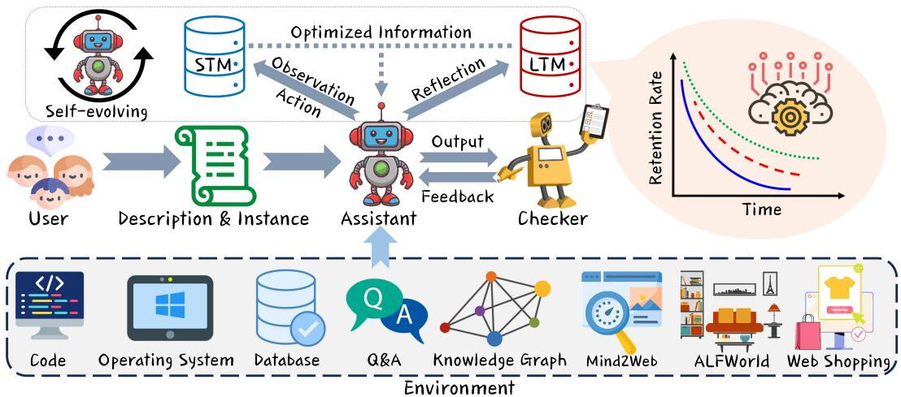
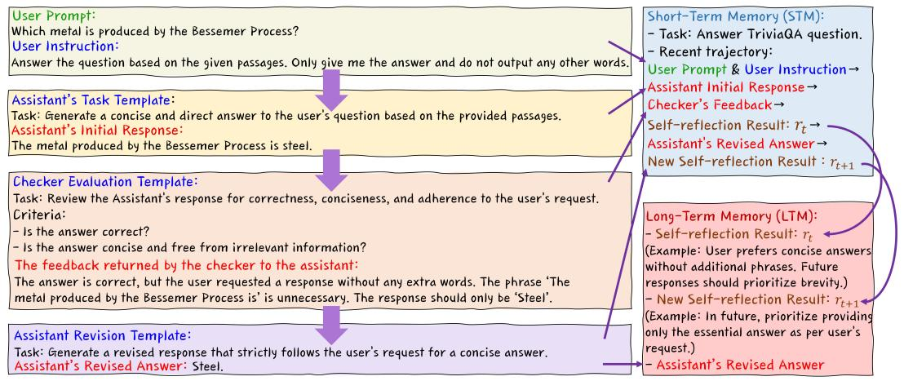
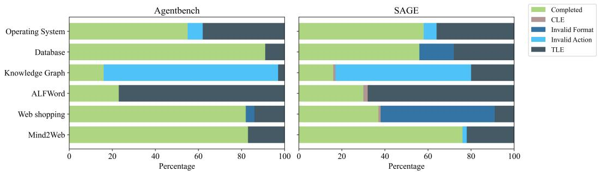

# SAGE：具有反思与记忆增强能力的自进化智能体

Xuechen Liang $^{1*}$ , Yangfan He $^{2*}$ , Yinghui Xia $^{3*}$ , Xinyuan Song $^{4}$ , Jianhui Wang $^{5}$ , Meiling Tao $^{6}$ , Li Sun $^{7}$ , Xinhang Yuan $^{8}$ , Jiayi Su $^{9}$ , Keqin Li $^{10}$ , Jiaqi Chen $^{10}$ , Jinsong Yang $^{3*}$ , Siyuan Chen $^{10}$ , Tianyu Shi $^{11\dagger}$

1 华东交通大学，2 明尼苏达大学双城分校，3 AutoAgents.ai，4 埃默里大学，
5 电子科技大学，6 广东工业大学，
$^{7}$ 亚马逊，$^{8}$ 华盛顿大学，$^{9}$ 厦门大学，
$^{10}$ 独立研究员，$^{11}$ 布里斯托大学，$^{12}$ 多伦多大学
项目页面：https://jianhuiwemi.github.io/SAGE

# 摘要

大语言模型（LLMs）在自然语言处理领域取得了重大进展，但在动态环境中仍面临持续决策、缺乏长期记忆和上下文窗口有限等挑战。为解决这些问题，本文提出一个创新框架——具有反思与记忆增强能力的自进化智能体（SAGE）。SAGE框架包含三个智能体：用户、助手和检查器。通过集成迭代反馈、反思机制以及基于艾宾浩斯遗忘曲线的记忆优化机制，它显著增强了智能体处理多任务和长跨度信息的能力。智能体通过自进化能够自适应调整策略、优化信息存储与传输，并有效降低认知负荷。我们在多个基准测试和长文本任务上评估SAGE框架的性能。实验结果表明，SAGE显著提升了模型性能，在闭源模型上实现了2.26倍的改进，在开源模型上实现了 $57.7\%$ 到 $100\%$ 的改进，在较小模型上的效果尤为显著。

# 1 引言

近年来，大语言模型（LLMs）在自然语言处理领域取得了重大进展，在对话和文本生成等任务中展示了强大的性能 Brown et al. (2020); He et al. (2025; 2024)。最近，将LLMs作为自主智能体（LLM智能体）应用的兴趣日益增长，这些智能体不仅使用语言进行理解和生成，还在交互环境中用于规划和行动 Yao et al. (2023b); Shinn et al. (2023); Liang et al. (2024); Li et al. (2024); Zhou et al. (2024)。然而，这些模型仍面临若干挑战：（1）LLM智能体需要在变化的环境中持续做出决策，并适应新情境和任务。（2）LLM智能体缺乏长期记忆机制，这在需要与环境持续交互的情境中日益明显 Graves et al. (2016)。有限的上下文窗口也阻碍了模型处理长时间跨度信息的能力 Rae et al. (2019)。

为应对这些挑战，研究人员提出了元学习和多任务学习来增强LLM智能体的可迁移性和适应性。针对记忆限制，先前的工作如MemGPT Packer et al. (2024)使用FIFO队列来管理遗忘，而MemoryBank则采用基于插入时间的遗忘曲线。然而，这些方法通常是任务特定的，缺乏一个通用框架来系统性地改进复杂环境中的LLM智能体。最近的创新，如AutoGPT Yang et al. (2023)和BabyAGI Nakajima (2024)，利用LLMs作为核心控制器，旨在解决现实世界的挑战。然而，多智能体框架仍面临通信过载等问题，严重依赖记忆来维持上下文。随着交互历史的增长，资源需求和延迟增加，限制了在实际场景中的高效部署。

本文中，我们提出一个创新框架——具有反思与记忆增强能力的自进化智能体（SAGE）。通过反思增强智能体的自我调整能力，它们能更有效地利用历史信息，在面对复杂动态任务时做出高效决策。从自进化的角度，我们引入了一个基于艾宾浩斯遗忘曲线的记忆优化机制 Ebbinghaus (1885)。该机制帮助智能体选择性保留关键信息，优化信息存储与传输，减少不必要的认知负荷，并增强智能体在环境交互任务中的能力。实验结果表明，我们的方法在广泛的基准测试中持续提升了专有和开源LLMs的性能。改进在较小模型上尤为显著，增益更为明显。在多源问答和代码生成等任务上，我们的方法设立了新标准，超越了现有技术，并达到了领先的基准 Etezadi & Shamsfard (2023)，包括AgentBench Liu et al. (2023b)。

我们工作的主要贡献如下：

- 我们提出了一个新框架SAGE，它引入了反思机制以增强智能体的自我调整能力。无需任何额外训练，这使得智能体能更有效地利用历史信息，并在面对复杂动态任务时做出更好的决策。
- 我们引入了基于艾宾浩斯遗忘曲线的记忆优化机制。这帮助智能体选择性保留关键信息，减少多智能体系统中的信息过载问题。
- SAGE在多个具有挑战性的现实世界任务中实现了对强基线的改进，并在基准测试中达到了最先进的结果。该框架可应用于其他LLMs，在较小模型上的改进尤为强劲。

# 2 相关工作

# 2.1 推理与决策的自我改进

深度学习已经改变了包括NLP、时间序列分析和计算机视觉在内的多个领域 Qiu et al. (2025a;b; 2024)。许多研究专注于使大语言模型（LLMs）更好地自我改进。一些研究人员致力于使用精心设计的提示来帮助模型学习如何改进，尽管这通常仅适用于一次性任务。其他人在调整模型在任务中获得反馈的方式，这有助于它们更好地进行推理 Huang et al. (2022)。还有关于使用随机束搜索等策略来帮助模型做出更明智的决策并评估自身工作的工作。大多数当前方法依赖于快速、一次性的调整和需要大量资源和手动技术帮助的学习策略 Tian et al. (2024)。本文引入了自我反思机制，表明LLMs可以在不需要额外训练的情况下，在不同任务中持续改进并产生更高质量的工作。

# 2.2 LLM智能体的记忆机制

在基于LLM的智能体中，记忆模块存储、处理和检索与任务相关的信息，支持知识积累、经验处理和决策制定。为增强这些智能体的自进化能力，研究人员专注于设计和优化这些记忆模块 Raffel et al. (2020)。过去的研究涵盖了记忆模块的各种设计和实现。这包括整合来自不同试验的信息以提升推理能力，或以自然语言存储信息以增强模块的可解释性和用户友好性 Wada et al. (2019)。尽管有进展，自我调整和记忆管理仍需改进，以更有效地处理复杂的现实世界问题。

  
图1：SAGE示意图：用户向具有短期记忆（STM）和长期记忆（LTM）的助手提供描述和实例。助手执行观察、行动、反思和输出，由检查器审查。右侧的保留率曲线说明了记忆随时间衰减，自进化循环指导持续更新。

# 3 方法

本节我们介绍SAGE框架，该框架旨在通过利用三个核心机制来提升智能体性能：迭代反馈、反思和MemorySyntax（如图1所示）。助手智能体 $A$ 根据检查器智能体 $C$ 提供的反馈 $f_{t}$ 迭代更新其策略 $\pi_{\theta}$，在连续迭代中优化以最大化期望奖励 $R$。反思机制允许 $A$ 整合历史观察 $\mathcal{O}_t$ 和行动 $\mathbf{a}_t$，形成自我反思 $r_t$，该反思存储在记忆 $\mathcal{M}_L$ 中供未来决策使用。最后，MemorySyntax将艾宾浩斯遗忘曲线与语言原则结合来管理记忆衰减，通过基于信息保留强度 $S(I_t)$ 优先处理信息，动态更新智能体的短期记忆 $\mathcal{M}_S$ 和长期记忆 $\mathcal{M}_L$，从而提升智能体保留关键信息同时丢弃较不相关数据的能力。后续小节详述这些组件。

# 3.1 迭代反馈

SAGE框架中的迭代反馈机制使助手智能体 $A$ 能够通过与检查器智能体 $C$ 的重复交互来优化其策略 $\pi_{\theta}$。在每次迭代 $t$，助手根据其当前输出 $\mathbf{o}_{t}$ 接收反馈 $f_{t}$，并相应调整其策略。此过程持续直到检查器验证输出或达到迭代上限 $N$，确保 $A$ 在连续迭代中逐步优化其决策以提升任务性能。

# 3.1.1 初始化阶段

角色分配。在SAGE框架中，引入了三个智能体：用户 $U$、助手 $A$ 和检查器 $C$。用户接收到提示 $P_U$ 后，承担任务提出者的角色，指定任务 $\mathcal{T}_U$ 和相关约束 $\mathcal{C}_U$。助手接收到提示 $P_A$ 后，基于观察 $\mathcal{O}_t$ 和环境 $\mathcal{E}$ 生成一系列行动 $\mathbf{a}_t$。检查器 $C$ 评估助手产生的输出 $\mathbf{o}_A$，基于 $\mathbf{o}_A$ 与期望结果之间的差异提供反馈 $f_C$，迭代更新其策略 $\pi_\theta$ 以最小化此差距。

任务分配。用户提供的任务 $\mathcal{T}_U$ 包括初始任务描述 $\mathbf{d}_U$ 和作为正确输出参考的实例 $\mathbf{i}_U$。这形成了助手的输入集 $\mathcal{I}_A = (\mathbf{d}_U, \mathbf{i}_U)$ 以启动其生成过程。助手随后在每个时间步 $t$ 选择行动 $\mathbf{a}_t$，由 $\pi_{\theta}$ 指导，目标是为完成 $\mathcal{T}_U$ 最大化奖励 $R_t$。

  
图2：助手迭代工作流程示例，包括检查器评估、反馈的提示模板以及整合短期和长期记忆的反思过程。

# 3.1.2 实际交互阶段

继初始化阶段中的角色分配和任务定义后，助手 $A$ 进入实际交互阶段，以生成旨在完成任务 $\mathcal{T}_U$ 的输出。在此阶段，$A$ 基于输入集 $\mathcal{I}_A = (\mathbf{d}_U, \mathbf{i}_U)$ 中提供的任务描述 $\mathbf{d}_U$ 和实例 $\mathbf{i}_U$，在每个时间步 $t$ 迭代产生输出 $\mathbf{o}_t$。在每个时间步 $t$，助手通过遵循其策略 $\pi_\theta$ 选择行动 $\mathbf{a}_t$，该策略以当前状态 $s_t$、奖励信号 $R_t$（任务性能的奖励分数）以及检查器 $C$ 的反馈 $f_t^i$ 为条件。此决策过程形式化为：

$$
\mathbf {o} _ {t} \sim \pi_ {\theta} \left(\mathbf {o} _ {t} \mid s _ {t}, R _ {t}, f _ {t} ^ {i}\right), \tag {1}
$$

其中 $\pi_{\theta}$ 代表助手的策略，$R_{t}$ 反映基于时间 $t$ 任务性能的奖励信号，$f_{t}^{i}$ 是检查器在第 $i$ 次迭代中提供的反馈。

随着交互进行，检查器 $C$ 评估 $A$ 生成的每个输出 $\mathbf{o}_t$，将其与从 $\mathbf{i}_U$ 导出的期望结果进行比较。基于此比较，检查器提供迭代反馈 $f_t^i$ 以指导 $A$ 优化其行动 $\mathbf{a}_t$ 和输出 $\mathbf{o}_t$。迭代优化持续直到检查器验证输出正确或达到迭代限制 $N$。

迭代反馈机制的理论最优性。在SAGE框架中，助手通过此检查器反馈反复更新其策略，使得输出能够逐步优化，直到结果被验证或达到指定的迭代限制。助手的效用 $R_{A}$ 反映任务性能，检查器的效用 $R_{C}$ 取决于其反馈。以下定理表明，这种迭代反馈机制在纳什均衡的意义上导致策略稳定性 Fudenberg & Tirole (1991)。

定理3.1（多智能体迭代反馈系统的理论）。令 $\mathcal{U},\mathcal{A},\mathcal{C}$ 分别表示用户 $(U)$、助手 $(A)$ 和检查器 $(C)$ 的紧致凸策略空间。假设效用函数

$$
R _ {U}: \mathcal {U} \times \mathcal {A} \times \mathcal {C} \rightarrow \mathbb {R}, \quad R _ {A}: \mathcal {U} \times \mathcal {A} \times \mathcal {C} \rightarrow \mathbb {R}, \quad a n d \quad R _ {C}: \mathcal {U} \times \mathcal {A} \times \mathcal {C} \rightarrow \mathbb {R} \tag {2}
$$

在每个参与者的策略中是连续的。那么，根据Debreu-Glicksberg-Fan不动点定理，存在一个纳什均衡

$$
\left(s _ {U} ^ {*}, s _ {A} ^ {*}, s _ {C} ^ {*}\right) \in \mathcal {U} \times \mathcal {A} \times \mathcal {C}. \tag {3}
$$

此外，假设助手的策略 $\pi_{\theta}$ 通过策略梯度方法更新，并且检查器的策略通过凸优化进行优化。那么，迭代更新过程产生序列

$$
\left\{\pi_ {\theta} ^ {(k)} \right\} _ {k \geq 0} \quad a n d \quad \left\{f ^ {(k)} \right\} _ {k \geq 0}, \tag {4}
$$

其收敛到一个稳定策略剖面 $(\pi_{\theta}^{*},f^{*})$，且有：

$$
R _ {A} \left(\pi_ {\theta} ^ {*}, f ^ {*}\right) \geq R _ {A} \left(\pi_ {\theta}, f ^ {*}\right), \quad R _ {C} \left(\pi_ {\theta} ^ {*}, f ^ {*}\right) \geq R _ {C} \left(\pi_ {\theta} ^ {*}, f\right). \tag {5}
$$

该结果表明，迭代反馈机制通过收敛到三参与者博弈中的纳什均衡来增强模型的策略稳定性。它为此三智能体系统相对于更简单的替代方案（如两智能体系统）提供了更强的理论依据。详细的理论解释和证明见附录A.2。

# 3.1.3 进化目标与方向

利用每次迭代 $t$ 获得的反馈 $f_{t}^{i}$，助手 $A$ 制定新的进化目标：

$$
\mathcal {G} ^ {t + 1} = \left(\mathcal {A} ^ {t + 1}, \mathcal {D} ^ {t + 1}\right), \quad \mathcal {D} ^ {t + 1} = \arg \min  _ {\mathcal {D} _ {t} \in \Delta} \sum_ {i \in I _ {t}} L _ {D} \left(\mathcal {D} _ {t}; f _ {t} ^ {i}, \pi_ {\theta} ^ {t}\right), \tag {6}
$$

其中 $\mathcal{A}^{t + 1}$ 代表更新的记忆优化机制，$\mathcal{D}^{t + 1} \in \Delta$ 指模型的自调整以使RL算法收敛。这些进化目标指导助手为后续迭代更新其策略 $\pi_{\theta}$。策略更新由函数 $\psi$ 控制，该函数整合了当前策略 $\pi_{\theta}^{t}$ 与新的进化目标 $\mathcal{G}^{t + 1}$：

$$
\theta^ {t + 1} = \phi (\theta^ {t}, \mathcal {G} ^ {t + 1}) = \theta^ {t} + \alpha \nabla_ {\theta} [ \lambda_ {A} L _ {A} (\theta^ {t}, \mathcal {A} ^ {t + 1}) + \lambda_ {D} L _ {D} (\theta^ {t}, \mathcal {D} ^ {t + 1}) ]. \tag {7}
$$

此处 $L_{A}(\theta, \mathcal{A})$ 和 $L_{D}(\theta, \mathcal{D})$ 分别是与记忆优化和自调整方面对应的MSE损失函数，$\lambda_{A}, \lambda_{D} \geq 0$ 是权重系数。迭代策略优化使助手 $A$ 能够基于累积反馈和不断变化的任务要求持续调整其策略，从而提升其在动态环境中的整体性能。

# 3.2 记忆管理

SAGE框架实现了一个双记忆系统，包括短期记忆（STM）和长期记忆（LTM），以管理与任务相关的信息并增强智能体的推理和决策能力（该过程的视觉表示见图2）。

$$

Here  $L_{A}(\theta, \mathcal{A})$  and  $L_{D}(\theta, \mathcal{D})$  are MSE loss functions corresponding to the memory-optimization and self-adjustment aspects, respectively, and  $\lambda_{A}, \lambda_{D} \geq 0$  are weighting coefficients. The iterative policy refinement enables the assistant  $A$  to continuously adapt its strategies based on cumulative feedback and evolving task requirements, thereby improving its overall performance in dynamic environments.

# 3.2 Memory Management

The SAGE framework implements a dual-memory system, consisting of Short-Term Memory (STM) and Long-Term Memory (LTM), to manage task-relevant information and enhance the agent's reasoning and decision-making capabilities (see Figure 2 for a visual representation of this process).

Short-Term Memory (STM). STM is responsible for storing immediate, task-specific data with limited capacity. It updates rapidly with new observations  $(\mathcal{O}_t)$  and actions  $(\mathbf{a}_t)$ , maintaining a recent trajectory history  $\mathcal{T}_t = (\mathcal{O}_t,\mathbf{a}_t)$ . This allows the agent to make real-time decisions and respond quickly to dynamic changes in the environment Mnih et al. (2015).

Long-Term Memory (LTM). LTM retains critical information and self-reflections  $(r_t)$  over extended periods, enabling the agent to accumulate knowledge from past interactions and apply it to future tasks. Stored as  $\mathcal{M}_L = \{r_t \mid t \in T\}$ , this memory mechanism allows the agent to use prior experiences to improve task performance, particularly in complex environments that require long-span information Graves et al. (2016).

By integrating STM and LTM, the SAGE framework allows the agent to balance immediate task demands with the ability to draw from accumulated knowledge, thereby enhancing its overall decision-making efficiency.

# 3.2.1 Reflection

Figure 4 illustrates an example of the reflection mechanism applied to a HotpotQA task Yang et al. (2018b). The reflection mechanism equips the assistant  $A$  with sparse reward signals, such as binary success/failure states, trajectory  $\mathcal{T}_t$ , and its stored memory  $\mathcal{M}_L$ . The assistant processes these inputs, deriving insights from past performance and storing self-reflections  $\mathbf{r}_t$  for future decision-making. These self-reflections, richer than scalar rewards, enhance the assistant's learning capacity and are incorporated into long-term memory:

$$
\mathbf {r} _ {t} = \operatorname {r e f} \left(\mathbf {o} _ {1: t}, \mathbf {R} _ {1: t}\right), \tag {8}
$$

where  $\operatorname{ref}(\cdot)$  denotes the reflection function based on the output sequence  $\mathbf{o}_{1:t}$  and rewards  $\mathbf{R}_{1:t}$ . The derived reflection  $\mathbf{r}_t$  is then added to  $\mathcal{M}_L$ :

$$
\mathcal {M} _ {L} \leftarrow \mathcal {M} _ {L} \cup \left\{\mathbf {r} _ {t} \right\}. \tag {9}
$$

The process gradually enhances the agent's decision-making, allowing it to adapt effectively through accumulated experience.

# 3.2.2 MemorySyntax

Building upon the reflection mechanism, the MemorySyntax method integrates the Ebbinghaus forgetting curve with linguistic principles to emulate human-like memory processes within the agent's memory management system. Let  $I_{t}$  denote the information received at time  $t$ , and let  $R(I_{t},\tau)$  represent its retention rate after a time interval  $\tau$ . According to the Ebbinghaus forgetting curve, the retention rate is modeled as:

$$
R \left(I _ {t}, \tau\right) = e ^ {- \frac {\tau}{S}}, \tag {10}
$$

where  $S$  is the strength of the information, reflecting its importance and complexity.

To enhance retention, MemorySyntax applies linguistic optimization to  $I_{t}$ , producing an optimized version  $I_{t}^{*}$  with increased strength  $S^{*} > S$ . The retention rate for  $I_{t}^{*}$  is defined as:

$$
R \left(I _ {t} ^ {*}, \tau\right) = \left\{ \begin{array}{l l} e ^ {- \frac {\tau}{S ^ {*}}}, & \text {i f} I _ {t} ^ {*} \in \mathcal {M} _ {S}, \\ e ^ {- \frac {\tau}{S}}, & \text {i f} I _ {t} ^ {*} \in \mathcal {M} _ {L}, \end{array} \right. \tag {11}
$$

where  $\mathcal{M}_S$  and  $\mathcal{M}_L$  represent short-term memory and long-term memory, respectively.

The agent updates its memory state  $\mathcal{M}_t$  based on the retention rate of  $I_t^*$  using predefined thresholds  $\theta_1$  and  $\theta_2$ , with  $\theta_1 > \theta_2$ . The memory update rule is formalized as:

$$
\mathcal {M} _ {t + 1} = \left\{ \begin{array}{l l} \mathcal {M} _ {t} \cup \left\{I _ {t} ^ {*} \right\}, & \text {i f} R \left(I _ {t} ^ {*}, \tau\right) \geq \theta_ {1}, \\ \mathcal {M} _ {t} \backslash \left\{I _ {t} ^ {*} \right\}, & \text {i f} R \left(I _ {t} ^ {*}, \tau\right) <   \theta_ {2}, \\ \mathcal {M} _ {t}, & \text {o t h e r w i s e .} \end{array} \right. \tag {12}
$$

This update rule operates under the following conditions:

- Retention in Short-Term Memory  $(\mathcal{M}_S)$ : If  $R(I_t^*, \tau) \geq \theta_1$ , the information  $I_t^*$  is retained in short-term memory  $\mathcal{M}_S$ .  
- Discarding Information: If  $R(I_t^*, \tau) < \theta_2$ , the information  $I_t^*$  is considered insignificant and is discarded.  
- Transfer to Long-Term Memory  $(\mathcal{M}_L)$ : If  $\theta_2 \leq R(I_t^*, \tau) < \theta_1$ , the information  $I_t^*$  is transferred to long-term memory  $\mathcal{M}_L$ .

The above MemorySyntax method is optimal and ensures maximal information utility. For theoretical background and detailed proof, see Appendix A.1.

By simulating human memory dynamics, MemorySyntax enables the agent to prioritize essential information, retain critical data in short-term memory  $\mathcal{M}_S$ , store important but less frequently used information in long-term memory  $\mathcal{M}_L$ , and discard irrelevant data. The mechanism addresses memory capacity limitations and enhances the agent's ability to perform complex tasks requiring efficient memory management.

# 4 Experiment

To demonstrate the capabilities and performance of SAGE in coordinating autonomous agent groups to work together on tasks, we conduct extensive quantitative experiments on benchmark tasks. We use a public benchmark, AgentBench Liu et al. (2023b), which is a multidimensional evolutionary benchmark from which we select six tasks. These tasks test the reasoning and decision-making abilities of LLMs acting as agents in multi-turn open-ended generation settings. To further assess the agents' long-context understanding, we select four widely adopted tasks related to long-text processing. These tasks reflect the agents' programming abilities(LCCGuo et al. (2023), RepoBench-P Liu et al. (2023a)) and reasoning abilities(HotpotQA Yang et al. (2018b), TriviaQA Joshi et al. (2017b)).

# 4.1 Evaluation on AgentBench

Task Description AgentBench includes scenarios from CODE (Knowledge Graph, OS, DB), GAME (ALFWorld) Shridhar et al. (2021), and WEB (WebShop Yao et al. (2023a), Mind2Web Deng et al. (2023)). For more details for the datasets and benchmarks, see Appendix B.

Baselines We evaluate commercial models GPT-3.5 Brown et al. (2020) and GPT-4 OpenAI et al. (2024), and open-source models Llama2 Touvron et al. (2023), Codellama Roziere et al. (2024), Qwen Bai et al. (2023), and ChatGLM2 GLM et al. (2024). Dialogue history exceeding the model length limit is truncated, using greedy decoding.

Results As shown in Table 1, our method significantly improves model performance on AgentBench, especially for smaller models. GPT-3.5 and GPT-4, despite already high scores, also show notable improvements with SAGE, up to  $2.26\mathrm{x}$  in the Database task. Llama2-7b is notably enhanced, showing the method's impact on weaker models. CodeLlama-7b and Qwen-1.8B also see substantial gains. Qwen-1.8B, after applying our method, performs close to GPT-3.5, highlighting its potential as a general agent. Llama2, previously error-prone, shows a significant reduction in basic errors through feedback and memory optimization, proving that our method not only enhances agent capabilities but also reduces fundamental errors in complex tasks.

Table 1: Baseline and SAGE Framework Performance on AgentBench  

<table><tr><td rowspan="2">LLM Type</td><td rowspan="2">Model</td><td colspan="2">VER</td><td colspan="2">OS</td><td colspan="2">DB</td><td colspan="2">KG</td><td colspan="2">ALF</td><td colspan="2">WS</td><td colspan="2">M2W</td></tr><tr><td>Base</td><td>SAGE</td><td>Base</td><td>SAGE</td><td>Base</td><td>SAGE</td><td>Base</td><td>SAGE</td><td>Base</td><td>SAGE</td><td>Base</td><td>SAGE</td><td>Base</td><td>SAGE</td></tr><tr><td rowspan="2">API</td><td>GPT-4</td><td>42.4</td><td>49.7</td><td>32.0</td><td>39.8</td><td>57.4</td><td>63.1</td><td>78.0</td><td>82.0</td><td>67.1</td><td>67.8</td><td>27.0</td><td>32.0</td><td>27.0</td><td>32.0</td></tr><tr><td>GPT-3.5</td><td>31.6</td><td>38.3</td><td>15.7</td><td>35.6</td><td>25.9</td><td>37.6</td><td>17.0</td><td>23.0</td><td>64.1</td><td>72.1</td><td>16.0</td><td>28.0</td><td>16.0</td><td>28.0</td></tr><tr><td rowspan="5">OSS</td><td>Llama2-7B Chat</td><td>0.0</td><td>8.4</td><td>0.0</td><td>10.2</td><td>0.0</td><td>25.0</td><td>0.0</td><td>5.0</td><td>4.4</td><td>10.4</td><td>0.0</td><td>15.0</td><td>0.0</td><td>15.0</td></tr><tr><td>CodeLlama-7B Instruct</td><td>5.7</td><td>18.4</td><td>2.6</td><td>19.2</td><td>0.0</td><td>27.0</td><td>0.0</td><td>12.5</td><td>16.3</td><td>40.2</td><td>0.0</td><td>15.0</td><td>15.0</td><td>15.0</td></tr><tr><td>Qwen1.8B Chat</td><td>2.7</td><td>18.7</td><td>1.4</td><td>15.1</td><td>6.8</td><td>45.3</td><td>0.0</td><td>10.5</td><td>6.6</td><td>11.4</td><td>0.6</td><td>13.6</td><td>13.6</td><td>13.6</td></tr><tr><td>Qwen-7B Chat</td><td>5.6</td><td>22.2</td><td>4.8</td><td>18.0</td><td>0.0</td><td>48.0</td><td>34.0</td><td>38.5</td><td>0.0</td><td>13.6</td><td>0.0</td><td>15.0</td><td>15.0</td><td>15.0</td></tr><tr><td>ChatGLM2-6B v1.1</td><td>0.0</td><td>15.2</td><td>0.0</td><td>16.3</td><td>0.0</td><td>17.0</td><td>0.0</td><td>5.0</td><td>0.3</td><td>10.3</td><td>4.9</td><td>14.9</td><td>14.9</td><td>14.9</td></tr></table>

# 4.2 Complex Problem-Solving Tasks Evaluation

We evaluated SAGE against baseline models on three tasks: long-form QA Akash et al. (2023), multi-turn dialog Cui et al. (2020), and sequential task completion Stephens et al. (2012). As shown in Table 2, SAGE outperforms all baselines with significant gains, such as a  $20.8\%$  increase in answer accuracy for GPT-3.5 on HotpotQA Yang et al. (2018b) and a  $17.3\%$  improvement in task completion for Mistral-7b on ALFWorld Shridhar et al. (2021). Across all tasks, SAGE notably enhances answer accuracy, dialog coherence, and step completion.

# 4.3 Evaluation of Long-Context Tasks

We evaluated the agent's code generation and reasoning on four long-text tasks: LCC Dataset Mohler et al. (2016) focuses on predicting the next line of code from a few initial lines, with Precision, Recall, and F1 as metrics. RepoBench-P Liu et al. (2024) tests retrieval of relevant code snippets from cross-file and within-file contexts to predict the next line, also evaluated with Precision, Recall, and F1. HotPotQA Yang et al. (2018a), a Wikipedia-based

Table 2: Evaluation of SAGE and Baseline Models on Three Different Tasks  

<table><tr><td>Agent</td><td>Task Completion Time (min)</td><td>Answer Accuracy (QA)(%)</td><td>Dialog Coherence (%)</td><td>Step Completion Accuracy (%)</td></tr><tr><td>GPT-3.5 (Baseline)</td><td>Long-form QA (HotpotQA)</td><td>54.1%</td><td>48.5%</td><td>62.7%</td></tr><tr><td>GPT-4 (Baseline)</td><td>Long-form QA (HotpotQA)</td><td>61.2%</td><td>53.8%</td><td>68.2%</td></tr><tr><td>Llama2-7b (Baseline)</td><td>Multi-turn Dialog (MultiWOZ)</td><td>55.9%</td><td>50.1%</td><td>64.8%</td></tr><tr><td>Codellama-13b (Baseline)</td><td>Multi-turn Dialog (MultiWOZ)</td><td>58.4%</td><td>52.3%</td><td>66.7%</td></tr><tr><td>Mistral-7b (Baseline)</td><td>Sequential Task (ALFWorld)</td><td>56.5%</td><td>51.5%</td><td>65.1%</td></tr><tr><td>SAGE-GPT-3.5</td><td>Long-form QA (HotpotQA)</td><td>74.9% (+20.8%)</td><td>68.3% (+19.8%)</td><td>80.6% (+17.9%)</td></tr><tr><td>SAGE-GPT-4</td><td>Long-form QA (HotpotQA)</td><td>78.4% (+17.2%)</td><td>73.4% (+19.6%)</td><td>83.9% (+15.7%)</td></tr><tr><td>SAGE-Llama2-7b</td><td>Multi-turn Dialog (MultiWOZ)</td><td>72.2% (+16.1%)</td><td>67.9% (+17.8%)</td><td>78.5% (+13.7%)</td></tr><tr><td>SAGE-Codellama-13b</td><td>Multi-turn Dialog (MultiWOZ)</td><td>74.7% (+16.3%)</td><td>71.2% (+18.9%)</td><td>81.2% (+14.5%)</td></tr><tr><td>SAGE-Mistral-7b</td><td>Sequential Task (ALFWorld)</td><td>73.8% (+17.3%)</td><td>70.5% (+19.0%)</td><td>79.9% (+14.8%)</td></tr></table>

dataset with 113k question-answer pairs, challenges the agent to reason across multiple documents, evaluated by answer F1. TriviaQA Joshi et al. (2017a) is a reading comprehension dataset with question-answer pairs and evidence paragraphs (filtered to over 1,000 words), also using answer F1 for evaluation.

We compared two self-refinement methods: Beam Search Kool et al. (2019), which integrates self-assessment through stochastic beam search, and Reflexion Shinn et al. (2023), which uses past trial experience in a verbal form.

# 4.4 Evaluation Results:

Code Completion Task: On the LCC dataset (Table 3), SAGE shows a slight improvement in F1 score (79.29) compared to Beam Search and Reflexion. Its memory mechanisms help refine code predictions, but the performance difference is not substantial in simpler tasks like code completion.

Reasoning Tasks: SAGE significantly outperforms Reflexion and Beam Search on HotPotQA and TriviaQA, with F1 scores of 22.06 and 22.76 (Table 3). SAGE's ability to effectively integrate multi-document information through reflection leads to better reasoning accuracy, while Reflexion and Beam Search face challenges in handling complex reasoning tasks.

Table 3: Comparison of Performance Across Different Methods  

<table><tr><td rowspan="2">Models</td><td colspan="3">LCC</td><td colspan="3">RepoBench-P</td><td>HotpotQA</td><td>TriviaQA</td></tr><tr><td>Precision</td><td>Recall</td><td>F1</td><td>Precision</td><td>Recall</td><td>F1</td><td>F1</td><td>F1</td></tr><tr><td>Reflexion</td><td>77.72</td><td>81.00</td><td>79.28</td><td>78.73</td><td>81.86</td><td>80.25</td><td>11.26</td><td>11.23</td></tr><tr><td>Beam search</td><td>78.98</td><td>79.32</td><td>79.12</td><td>78.75</td><td>81.02</td><td>79.87</td><td>10.26</td><td>12.13</td></tr><tr><td>SAGE</td><td>78.76</td><td>79.88</td><td>79.29</td><td>79.27</td><td>83.28</td><td>81.22</td><td>22.06</td><td>22.76</td></tr></table>

# 4.5 Evaluation of RAG Agents

Table 4 compares classical lexical retrieval (RAG with BM25) Robertson & Zaragoza (2009), dense passage retrieval (RAG with DPR) Reichman & Heck (2024), a commercial retrieval solution (RAG with OpenAI Retrieval) OpenAI (2023), the TART Eisenschlos et al. (2022) sequence-to-sequence retrieval model, and the FiD (Fusion-in-Decoder) method Izacard & Grave (2021), all tested on multi-document and open-domain QA tasks (HotpotQA, Natural Questions Kwiatkowski et al. (2019), and TriviaQA). RAG with BM25 relies on term-based matching, while RAG with DPR uses learned dense embeddings. TART adopts a transformer-based approach to produce relevant contexts, and FiD fuses multiple retrieved passages through an encoder-decoder design. In contrast, ChatGPT-4 (SAGE) employs a structured reasoning workflow for retrieval and generation, which leads to steady accuracy improvements of  $3.6\%$  to  $4.7\%$  and cuts memory consumption nearly  $50\%$  on some tasks, all without increasing latency.

Table 4: Evaluation of different RAG Agents on Different Tasks and Datasets  

<table><tr><td>Agent</td><td>Accuracy (QA) (%)</td><td>Latency (ms)</td><td>Memory Usage (MB)</td></tr><tr><td colspan="4">Task 1: Multi-Document QA (HotpotQA)</td></tr><tr><td>RAG (BM25)</td><td>60.8</td><td>121</td><td>613</td></tr><tr><td>RAG (DPR)</td><td>66.3</td><td>129</td><td>542</td></tr><tr><td>RAG (OpenAI Retrieval)</td><td>67.4</td><td>108</td><td>494</td></tr><tr><td>TART</td><td>63.2</td><td>144</td><td>477</td></tr><tr><td>FiD (Fusion-in-Decoder)</td><td>70.1</td><td>153</td><td>456</td></tr><tr><td>ChatGPT-4 - Sage</td><td>74.8 (+4.7)</td><td>128</td><td>231 (-50%)</td></tr><tr><td colspan="4">Task 2: Document Retrieval for Contextual Answering (Natural Questions)</td></tr><tr><td>RAG (BM25)</td><td>59.9</td><td>125</td><td>605</td></tr><tr><td>RAG (DPR)</td><td>65.5</td><td>131</td><td>561</td></tr><tr><td>RAG (OpenAI Retrieval)</td><td>66.8</td><td>113</td><td>484</td></tr><tr><td>TART</td><td>62.4</td><td>146</td><td>455</td></tr><tr><td>FiD (Fusion-in-Decoder)</td><td>69.8</td><td>156</td><td>443</td></tr><tr><td>ChatGPT-4 - Sage</td><td>73.6 (+3.8)</td><td>131</td><td>227 (-49%)</td></tr><tr><td colspan="4">Task 3: Open-Domain QA with Multiple Contexts (TriviaQA)</td></tr><tr><td>RAG (BM25)</td><td>62.1</td><td>124</td><td>615</td></tr><tr><td>RAG (DPR)</td><td>67.8</td><td>129</td><td>530</td></tr><tr><td>RAG (OpenAI Retrieval)</td><td>68.9</td><td>117</td><td>494</td></tr><tr><td>TART</td><td>64.7</td><td>148</td><td>462</td></tr><tr><td>FiD (Fusion-in-Decoder)</td><td>71.9</td><td>155</td><td>456</td></tr><tr><td>ChatGPT-4 - Sage</td><td>75.5 (+3.6)</td><td>134</td><td>243 (-47%)</td></tr></table>

# 4.6 Error analysis

As shown in Figure 3, the SAGE framework significantly enhances agent performance across tasks, especially in the WS task for AgentBench, due to its iterative feedback mechanism, which refines outputs through continuous assistant-checker interaction. In OS and DB tasks, Context Limit Exceeded and invalid format errors are nearly eliminated, with a notable reduction in invalid action errors, attributed to the reflection mechanism that helps the assistant learn and reduce logical mistakes.

  
Figure 3: Execution results across six tasks (CLE: Context Limit Exceeded, TLE: Task Limit Exceeded). Task limits are the main cause of incomplete tasks, highlighting LLM agents' limitations under time constraints.

# 4.7 Ablation Study

We conducted ablation experiments on Qwen-1.8B and CodeLlama-7B to evaluate memory optimization (Table 5). Without memory optimization, both models perform weakly, especially Qwen-1.8B, which improves from 6.8 to 48.0 in KG and from 0.0 to 10.5 in ALF after optimization. Similarly, CodeLlama-7B shows substantial gains, particularly in DB (2.7 to 41.3) and WS (14.3 to 58.7). Overall, CodeLlama-7B performs better than Qwen-1.8B,

highlighting the stronger adaptability of models with more parameters in handling complex tasks.

Table 5: Ablation study for memory optimization on the task of AgentBench  

<table><tr><td>Models</td><td>OS</td><td>DB</td><td>KG</td><td>ALF</td><td>WS</td><td>M2W</td></tr><tr><td>Qwen-1.8B (w/o memo)</td><td>10.4</td><td>22.6</td><td>6.8</td><td>0.0</td><td>26.6</td><td>5.0</td></tr><tr><td>Qwen-1.8B (w memo)</td><td>18.7</td><td>28.3</td><td>45.3</td><td>10.5</td><td>31.4</td><td>25.1</td></tr><tr><td>Codellama-7B (w/o memo)</td><td>9.7</td><td>2.7</td><td>0.0</td><td>0.0</td><td>14.3</td><td>5.0</td></tr><tr><td>Codellama-7B (w memo)</td><td>23.4</td><td>41.3</td><td>48.0</td><td>12.5</td><td>58.7</td><td>15.0</td></tr></table>

# 5 Conclusion

In this paper, we propose the SAGE framework, which enhances agents' self-adjustment and memory management in complex tasks through reflective mechanisms and memory optimization. Experimental results show significant performance improvements across benchmarks, especially in smaller models. In the AgentBench test, SAGE boosts the performance of strong baselines like GPT-3.5 and GPT-4, while also significantly improving open-source models. It effectively reduces basic errors and logical mistakes, particularly enabling smaller models to handle complex tasks.

# References

Pritom Saha Akash, Kashob Kumar Roy, Lucian Popa, and Kevin Chen-Chuan Chang. Long-form question answering: An iterative planning-retrieval-generation approach, 2023. URL https://arxiv.org/abs/2311.09383.  
Jinze Bai, Shuai Bai, Yunfei Chu, Zeyu Cui, Kai Dang, Xiaodong Deng, Yang Fan, Wenbin Ge, Yu Han, Fei Huang, Binyuan Hui, Luo Ji, Mei Li, Junyang Lin, Runji Lin, Dayiheng Liu, Gao Liu, Chengqiang Lu, Keming Lu, Jianxin Ma, Rui Men, Xingzhang Ren, Xuancheng Ren, Chuanqi Tan, Sinan Tan, Jianhong Tu, Peng Wang, Shijie Wang, Wei Wang, Shengguang Wu, Benfeng Xu, Jin Xu, An Yang, Hao Yang, Jian Yang, Shusheng Yang, Yang Yao, Bowen Yu, Hongyi Yuan, Zheng Yuan, Jianwei Zhang, Xingxuan Zhang, Yichang Zhang, Zhenru Zhang, Chang Zhou, Jingren Zhou, Xiaohuan Zhou, and Tianhang Zhu. Qwen technical report, 2023.  
Tom B. Brown, Benjamin Mann, Nick Ryder, Melanie Subbiah, Jared Kaplan, Prafulla Dhariwal, Arvind Neelakantan, Pranav Shyam, Girish Sastry, Amanda Askell, Sandhini Agarwal, Ariel Herbert-Voss, Gretchen Krueger, Tom Henighan, Rewon Child, Aditya Ramesh, Daniel M. Ziegler, Jeffrey Wu, Clemens Winter, Christopher Hesse, Mark Chen, Eric Sigler, Mateusz Litwin, Scott Gray, Benjamin Chess, Jack Clark, Christopher Berner, Sam McCandlish, Alec Radford, Ilya Sutskever, and Dario Amodei. Language models are few-shot learners, 2020.  
Thomas M. Cover and Joy A. Thomas. Elements of Information Theory (Wiley Series in Telecommunications and Signal Processing). Wiley-Interscience, USA, 2006. ISBN 0471241954.  
Leyang Cui, Yu Wu, Shujie Liu, Yue Zhang, and Ming Zhou. MuTual: A dataset for multi-turn dialogue reasoning. In Dan Jurafsky, Joyce Chai, Natalie Schluter, and Joel Tetreault (eds.), Proceedings of the 58th Annual Meeting of the Association for Computational Linguistics, pp. 1406-1416, Online, July 2020. Association for Computational Linguistics. doi: 10. 18653/v1/2020.acl-main.130. URL https://aclanthology.org/2020.acl-main.130/.  
Xiang Deng, Yu Gu, Boyuan Zheng, Shijie Chen, Samuel Stevens, Boshi Wang, Huan Sun, and Yu Su. Mind2web: Towards a generalist agent for the web, 2023.  
Hermann Ebbinghaus. Über das gedächtnis: untersuchungen zur experimentellen psychologie. Duncker & Humblot, 1885.  
Julian Eisenschlos, Yury Zemlyanskiy, Jason Phang, Bhuwan Dhingra, and William W. Cohen. TART: Retrieval-augmented generation for task-oriented dialog. In Proceedings of

the 60th Annual Meeting of the Association for Computational Linguistics (ACL), pp. 1866-1881, 2022. URL https://aclanthology.org/2022.acl-long.131.  
Romina Etezadi and Mehrnoush Shamsfard. The state of the art in open domain complex question answering: a survey. Applied Intelligence, 53(4):4124-4144, 2023.  
Drew Fudenberg and Jean Tirole. Game Theory. MIT Press, Cambridge, MA, 1991.  
Team GLM, Aohan Zeng, Bin Xu, Bowen Wang, Chenhui Zhang, Da Yin, Diego Rojas, Guanyu Feng, Hanlin Zhao, Hanyu Lai, Hao Yu, Hongning Wang, Jiadai Sun, Jiajie Zhang, Jiale Cheng, Jiayi Gui, Jie Tang, Jing Zhang, Juanzi Li, Lei Zhao, Lindong Wu, Lucen Zhong, Mingdao Liu, Minlie Huang, Peng Zhang, Qinkai Zheng, Rui Lu, Shuaiqi Duan, Shudan Zhang, Shulin Cao, Shuxun Yang, Weng Lam Tam, Wenyi Zhao, Xiao Liu, Xiao Xia, Xiaohan Zhang, Xiaotao Gu, Xin Lv, Xinghan Liu, Xinyi Liu, Xinyue Yang, Xixuan Song, Xunkai Zhang, Yifan An, Yifan Xu, Yilin Niu, Yuantao Yang, Yueyan Li, Yushi Bai, Yuxiao Dong, Zehan Qi, Zhaoyu Wang, Zhen Yang, Zhengxiao Du, Zhenyu Hou, and Zihan Wang. Chatglm: A family of large language models from glm-130b to glm-4 all tools, 2024.  
Alex Graves, Greg Wayne, Malcolm Reynolds, Tim Harley, Ivo Danihelka, Agnieszka Grabska-Barwinska, Sergio Gomez Colmenarejo, Edward Grefenstette, Tiago Ramalho, John Agapiou, et al. Hybrid computing using a neural network with dynamic external memory. Nature, 538(7626):471-476, 2016.  
Daya Guo, Canwen Xu, Nan Duan, Jian Yin, and Julian McAuley. Longcoder: A long-range pre-trained language model for code completion, 2023.  
Yangfan He, Jianhui Wang, Kun Li, Yijin Wang, Li Sun, Jun Yin, Miao Zhang, and Xueqian Wang. Enhancing intent understanding for ambiguous prompt: A human-machine co-adaption strategy. Available at SSRN 5119629, 2024.  
Yangfan He, Jianhui Wang, Kun Li, Yijin Wang, Li Sun, Jun Yin, Miao Zhang, and Xueqian Wang. Enhancing intent understanding for ambiguous prompts through human-machine co-adaptation. arXiv preprint arXiv:2501.15167, 2025.  
Jiaxin Huang, Shixiang Shane Gu, Le Hou, Yuexin Wu, Xuezhi Wang, Hongkun Yu, and Jiawei Han. Large language models can self-improve, 2022.  
Gautier Izacard and Edouard Grave. Leveraging passage retrieval with generative models for open domain question answering. In Proceedings of the 16th Conference of the European Chapter of the Association for Computational Linguistics: Main Volume (EACL), pp. 874-880, 2021. URL https://aclanthology.org/2021.eacl-main.24.  
Mandar Joshi, Eunsol Choi, Daniel Weld, and Luke Zettlemoyer. TriviaQA: A large scale distantly supervised challenge dataset for reading comprehension. In Regina Barzilay and Min-Yen Kan (eds.), Proceedings of the 55th Annual Meeting of the Association for Computational Linguistics (Volume 1: Long Papers), pp. 1601-1611, Vancouver, Canada, July 2017a. Association for Computational Linguistics. doi: 10.18653/v1/P17-1147. URL https://aclanthology.org/P17-1147.  
Mandar Joshi, Eunsol Choi, Daniel S. Weld, and Luke Zettlemoyer. Triviaqa: A large scale distantly supervised challenge dataset for reading comprehension, 2017b.  
Wouter Kool, Herke van Hoof, and Max Welling. Stochastic beams and where to find them: The gumbel-top-k trick for sampling sequences without replacement, 2019. URL https://arxiv.org/abs/1903.06059.  
Tom Kwiatkowski, Jennimaria Palomaki, Olivia Redfield, Michael Collins, Ankur Parikh, Chris Alberti, Danielle Epstein, Illia Polosukhin, Jacob Devlin, Kenton Lee, Kristina Toutanova, Llion Jones, Matthew Kelcey, Ming-Wei Chang, Andrew M. Dai, Jakob Uszkoreit, Quoc Le, and Slav Petrov. Natural questions: A benchmark for question answering research. Transactions of the Association for Computational Linguistics, 7:452-466, 2019. doi: 10.1162/tacl_a_00276. URL https://aclanthology.org/Q19-1026/.

Zeyuan Li, Yangfan He, Lewei He, Jianhui Wang, Tianyu Shi, Bin Lei, Yuchen Li, and Qiuwu Chen. Falcon: Feedback-driven adaptive long/short-term memory reinforced coding optimization system. arXiv preprint arXiv:2410.21349, 2024.  
Xuechen Liang, Meiling Tao, Yinghui Xia, Tianyu Shi, Jun Wang, and JingSong Yang. Cmat: A multi-agent collaboration tuning framework for enhancing small language models. arXiv preprint arXiv:2404.01663, 2024.  
Tianyang Liu, Canwen Xu, and Julian McAuley. Repobench: Benchmarking repository-level code auto-completion systems, 2023a.  
Tianyang Liu, Canwen Xu, and Julian McAuley. Repobench: Benchmarking repository-level code auto-completion systems. In The Twelfth International Conference on Learning Representations, 2024. URL https://openreview.net/forum?id=pPjZIouQuF.  
Xiao Liu, Hao Yu, Hanchen Zhang, Yifan Xu, Xuanyu Lei, Hanyu Lai, Yu Gu, Hangliang Ding, Kaiwen Men, Kejuan Yang, Shudan Zhang, Xiang Deng, Aohan Zeng, Zhengxiao Du, Chenhui Zhang, Sheng Shen, Tianjun Zhang, Yu Su, Huan Sun, Minlie Huang, Yuxiao Dong, and Jie Tang. Agentbench: Evaluating llms as agents. arXiv preprint arXiv: 2308.03688, 2023b.  
Volodymyr Mnih, Koray Kavukcuoglu, David Silver, Andrei A Rusu, Joel Veness, Marc G Bellemare, Alex Graves, Martin Riedmiller, Andreas K Fidjeland, Georg Ostrovski, et al. Human-level control through deep reinforcement learning. nature, 518(7540):529-533, 2015.  
Michael Mohler, Mary Brunson, Bryan Rink, and Marc Tomlinson. Introducing the LCC metaphor datasets. In Nicoletta Calzolari, Khalid Choukri, Thierry Declerck, Sara Goggi, Marko Grobelnik, Bente Maegaard, Joseph Mariani, Helene Mazo, Asuncion Moreno, Jan Odijk, and Stelios Piperidis (eds.), Proceedings of the Tenth International Conference on Language Resources and Evaluation (LREC'16), pp. 4221-4227, Portoroz, Slovenia, May 2016. European Language Resources Association (ELRA). URL https://aclanthology.org/L16-1668.  
Yohei Nakajima. Babyagi: An ai agent that can achieve goals and execute tasks, 2024.  
OpenAI. Openai cookbook. https://github.com/openai/openai-cookbook, 2023. Accessed: 2025-03-27.  
OpenAI, Josh Achiam, Steven Adler, Sandhini Agarwal, Lama Ahmad, Ilge Akkaya, Florencia Leoni Aleman, Diogo Almeida, Janko Altenschmidt, Sam Altman, Shyamal Anadkat, Red Avila, Igor Babuschkin, Suchir Balaji, Valerie Balcom, Paul Baltescu, Haiming Bao, Mohammad Bavarian, Jeff Belgium, Irwan Bello, Jake Berdine, Gabriel Bernadett-Shapiro, Christopher Berner, Lenny Bogdonoff, Oleg Boiko, Madelaine Boyd, Anna-Luisa Brakman, Greg Brockman, Tim Brooks, Miles Brundage, Kevin Button, Trevor Cai, Rosie Campbell, Andrew Cann, Brittany Carey, Chelsea Carlson, Rory Carmichael, Brooke Chan, Che Chang, Fotis Chantzis, Derek Chen, Sully Chen, Ruby Chen, Jason Chen, Mark Chen, Ben Chess, Chester Cho, Casey Chu, Hyung Won Chung, Dave Cummings, Jeremiah Currier, Yunxing Dai, Cory Decareaux, Thomas Degry, Noah Deutsch, Damien Deville, Arka Dhar, David Dohan, Steve Dowling, Sheila Dunning, Adrien Ecoffet, Atty Eleti, Tyna Eloundou, David Farhi, Liam Fedus, Niko Felix, Simón Posada Fishman, Juston Forte, Isabella Fulford, Leo Gao, Elie Georges, Christian Gibson, Vik Goel, Tarun Gogineni, Gabriel Goh, Rapha Gontijo-Lopes, Jonathan Gordon, Morgan Grafstein, Scott Gray, Ryan Greene, Joshua Gross, Shixiang Shane Gu, Yufei Guo, Chris Hallacy, Jesse Han, Jeff Harris, Yuchen He, Mike Heating, Johannes Heidecke, Chris Hesse, Alan Hickey, Wade Hickey, Peter Hoeschele, Brandon Houghton, Kenny Hsu, Shengli Hu, Xin Hu, Joost Huizinga, Shantanu Jain, Shawn Jain, Joanne Jang, Angela Jiang, Roger Jiang, Haozhun Jin, Denny Jin, Shino Jomoto, Billie Jonn, Heewoo Jun, Tomer Kaftan, Lukasz Kaiser, Ali Kamali, Ingmar Kanitscheider, Nitish Shirish Keskar, Tabarak Khan, Logan Kilpatrick, Jong Wook Kim, Christina Kim, Yongjik Kim, Jan Hendrik Kirchner, Jamie Kiros, Matt Knight, Daniel Kokotajlo, Lukasz Kondraciuk, Andrew Kondrich, Aris Konstantinidis, Kyle Kosic, Gretchen Krueger, Vishal Kuo, Michael Lampe, Ikai Lan, Teddy Lee, Jan Leike

Jade Leung, Daniel Levy, Chak Ming Li, Rachel Lim, Molly Lin, Stephanie Lin, Mateusz Litwin, Theresa Lopez, Ryan Lowe, Patricia Lue, Anna Makanju, Kim Malfacini, Sam Manning, Todor Markov, Yaniv Markovski, Bianca Martin, Katie Mayer, Andrew Mayne, Bob McGrew, Scott Mayer McKinney, Christine McLeavey, Paul McMillan, Jake McNeil, David Medina, Aalok Mehta, Jacob Menick, Luke Metz, Andrey Mishchenko, Pamela Mishkin, Vinnie Monaco, Evan Morikawa, Daniel Mossing, Tong Mu, Mira Murati, Oleg Murk, David Mély, Ashvin Nair, Reiichiro Nakano, Rajeev Nayak, Arvind Neelakantan, Richard Ngo, Hyeonwoo Noh, Long Ouyang, Cullen O'Keefe, Jakub Pachocki, Alex Paino, Joe Palermo, Ashley Pantuliano, Giambattista Parascandolo, Joel Parish, Emy Parparita, Alex Passos, Mikhail Pavlov, Andrew Peng, Adam Perelman, Filipe de Avila Belbute Peres, Michael Petrov, Henrique Ponde de Oliveira Pinto, Michael, Pokorny, Michelle Pokrass, Vitchyr H. Pong, Tolly Powell, Alethea Power, Boris Power, Elizabeth Proehl, Raul Puri, Alec Radford, Jack Rae, Aditya Ramesh, Cameron Raymond, Francis Real, Kendra Rimbach, Carl Ross, Bob Rotsted, Henri Roussez, Nick Ryder, Mario Saltarelli, Ted Sanders, Shibani Santurkar, Girish Sastry, Heather Schmidt, David Schnurr, John Schulman, Daniel Selsam, Kyla Sheppard, Toki Sherbakov, Jessica Shieh, Sarah Shoker, Pranav Shyam, Szymon Sidor, Eric Sigler, Maddie Simens, Jordan Sitkin, Katarina Slama, Ian Sohl, Benjamin Sokolowsky, Yang Song, Natalie Staudacher, Felipe Petroski Such, Natalie Summers, Ilya Sutskever, Jie Tang, Nikolas Tezak, Madeleine B. Thompson, Phil Tillet, Amin Tootoonchian, Elizabeth Tseng, Preston Tuggle, Nick Turley, Jerry Tworek, Juan Felipe Cerón Uribe, Andrea Vallone, Arun Vijayvergiya, Chelsea Voss, Carroll Wainwright, Justin Jay Wang, Alvin Wang, Ben Wang, Jonathan Ward, Jason Wei CJ Weinmann Akila Welihinda Peter Welinder Jiayi Weng Lilian Weng Matt Wiethoff Dave Willner,Clemens Winter,Samuel Wolrich,Hannah WongLauren Workman Sherwin WuJeff WuMichael WuKai Xiao,Tao XuSarah YooKevin YuQiming Yuan Wojciech Zaremba Rowan ZellersChong Zhang Marvin Zhang Shengjia ZhaoTianhao Zheng,Juntang ZhuangWilliam Zhuk,and Barret Zoph.Gpt-4 technical report 2024. URL https://arxiv.org/abs/2303.08774.

Charles Packer, Sarah Wooders, Kevin Lin, Vivian Fang, Shishir G. Patil, Ion Stoica, and Joseph E. Gonzalez. Memgpt: Towards llms as operating systems, 2024.  
Xiangfei Qiu, Jilin Hu, Lekui Zhou, Xingjian Wu, Junyang Du, Buang Zhang, Chenjuan Guo, Aoying Zhou, Christian S. Jensen, Zhenli Sheng, and Bin Yang. Tfb: Towards comprehensive and fair benchmarking of time series forecasting methods. In Proc. VLDB Endow., pp. 2363-2377, 2024.  
Xiangfei Qiu, Xiuwen Li, Ruiyang Pang, Zhicheng Pan, Xingjian Wu, Liu Yang, Jilin Hu, Yang Shu, Xuesong Lu, Chengcheng Yang, Chenjuan Guo, Aoying Zhou, Christian S. Jensen, and Bin Yang. Easytime: Time series forecasting made easy. In ICDE, 2025a.  
Xiangfei Qiu, Xingjian Wu, Yan Lin, Chenjuan Guo, Jilin Hu, and Bin Yang. Duet: Dual clustering enhanced multivariate time series forecasting. In SIGKDD, pp. 1185-1196, 2025b.  
Jack W Rae, Anna Potapenko, Siddhant M Jayakumar, and Timothy P Lillicrap. Compressive transformers for long-range sequence modelling. arXiv preprint arXiv:1911.05507, 2019.  
Colin Raffel, Noam Shazeer, Adam Roberts, Katherine Lee, Sharan Narang, Michael Matena, Yanqi Zhou, Wei Li, and Peter J Liu. Exploring the limits of transfer learning with a unified text-to-text transformer. Journal of machine learning research, 21(140):1-67, 2020.  
Benjamin Reichman and Larry Heck. Dense passage retrieval: Is it retrieving?, 2024. URL https://arxiv.org/abs/2402.11035.  
Stephen Robertson and Hugo Zaragoza. The probabilistic relevance framework: Bm25 and beyond. Foundations and Trends® in Information Retrieval, 3(4):333-389, 2009. ISSN 1554-0669. doi: 10.1561/1500000019. URL http://dx.doi.org/10.1561/1500000019.  
Baptiste Rozière, Jonas Gehring, Fabian Gloeckle, Sten Sootla, Itai Gat, Xiaqing Ellen Tan, Yossi Adi, Jingyu Liu, Romain Sauvestre, Tal Remez, Jérémy Rapin, Artyom Kozhevnikov, Ivan Evtimov, Joanna Bitton, Manish Bhatt, Cristian Canton Ferrer, Aaron Grattaftori,

Wenhan Xiong, Alexandre Défossez, Jade Copet, Faisal Azhar, Hugo Touvron, Louis Martin, Nicolas Usunier, Thomas Scialom, and Gabriel Synnaeve. Code llama: Open foundation models for code, 2024. URL https://arxiv.org/abs/2308.12950.  
Noah Shinn, Federico Cassano, Edward Berman, Ashwin Gopinath, Karthik Narasimhan, and Shunyu Yao. Reflection: Language agents with verbal reinforcement learning, 2023.  
Mohit Shridhar, Xingdi Yuan, Marc-Alexandre Côté, Yonatan Bisk, Adam Trischler, and Matthew Hausknecht. ALFWorld: Aligning Text and Embodied Environments for Interactive Learning. In Proceedings of the International Conference on Learning Representations (ICLR), 2021. URL https://arxiv.org/abs/2010.03768.  
Keri K Stephens, Jaehee K Cho, and Dawnna I Ballard. Simultaneity, sequentiality, and speed: Organizational messages about multiple-task completion. Human Communication Research, 38(1):23-47, 2012.  
Richard S. Sutton and Andrew G. Barto. Reinforcement Learning: An Introduction. MIT Press, Cambridge, MA, 2 edition, 2018.  
Ye Tian, Baolin Peng, Linfeng Song, Lifeng Jin, Dian Yu, Haitao Mi, and Dong Yu. Toward self-improvement of llms via imagination, searching, and criticizing, 2024.  
Hugo Touvron, Louis Martin, Kevin Stone, Peter Albert, Amjad Almahairi, Yasmine Babaei, Nikolay Bashlykov, Soumya Batra, Prajwal Bhargava, Shruti Bhosale, Dan Bikel, Lukas Blecher, Cristian Canton Ferrer, Moya Chen, Guillem Cucurull, David Esiobu, Jude Fernandes, Jeremy Fu, Wenyin Fu, Brian Fuller, Cynthia Gao, Vedanuj Goswami, Naman Goyal, Anthony Hartshorn, Saghar Hosseini, Rui Hou, Hakan Inan, Marcin Kardas, Viktor Kerkez, Madian Khabsa, Isabel Kloumann, Artem Korenev, Punit Singh Koura, Marie-Anne Lachaux, Thibaut Lavril, Jenya Lee, Diana Liskovich, Yinghai Lu, Yuning Mao, Xavier Martinet, Todor Mihaylov, Pushkar Mishra, Igor Molybog, Yixin Nie, Andrew Poulton, Jeremy Reizenstein, Rashi Rungta, Kalyan Saladi, Alan Schelten, Ruan Silva, Eric Michael Smith, Ranjan Subramanian, Xiaqing Ellen Tan, Binh Tang, Ross Taylor, Adina Williams, Jian Xiang Kuan, Puxin Xu, Zheng Yan, Iliyan Zarov, Yuchen Zhang, Angela Fan, Melanie Kambadur, Sharan Narang, Aurelien Rodriguez, Robert Stojnic, Sergey Edunov, and Thomas Scialom. Llama 2: Open foundation and fine-tuned chat models, 2023.  
Takashi Wada, Tomoharu Iwata, and Yuji Matsumoto. Unsupervised multilingual word embedding with limited resources using neural language models. In Proceedings of the 57th Annual Meeting of the Association for Computational Linguistics, pp. 3113-3124, 2019.  
Hui Yang, Sifu Yue, and Yunzhong He. Auto-gpt for online decision making: Benchmarks and additional opinions, 2023. URL https://arxiv.org/abs/2306.02224.  
Zhilin Yang, Peng Qi, Saizheng Zhang, Yoshua Bengio, William Cohen, Ruslan Salakhutdinov, and Christopher D. Manning. HotpotQA: A dataset for diverse, explainable multi-hop question answering. In Ellen Riloff, David Chiang, Julia Hockenmaier, and Jun'ichi Tsujii (eds.), Proceedings of the 2018 Conference on Empirical Methods in Natural Language Processing, pp. 2369-2380, Brussels, Belgium, October-November 2018a. Association for Computational Linguistics. doi: 10.18653/v1/D18-1259. URL https://aclanthology.org/D18-1259.  
Zhilin Yang, Peng Qi, Saizheng Zhang, Yoshua Bengio, William W. Cohen, Ruslan Salakhutdinov, and Christopher D. Manning. Hotpotqa: A dataset for diverse, explainable multihop question answering, 2018b. URL https://arxiv.org/abs/1809.09600.  
Shunyu Yao, Howard Chen, John Yang, and Karthik Narasimhan. Webshop: Towards scalable real-world web interaction with grounded language agents, 2023a.  
Shunyu Yao, Jeffrey Zhao, Dian Yu, Nan Du, Izhak Shafran, Karthik Narasimhan, and Yuan Cao. React: Synergizing reasoning and acting in language models, 2023b. URL https://arxiv.org/abs/2210.03629.

Ziqi Zhou, Jingyue Zhang, Jingyuan Zhang, Yangfan He, Boyue Wang, Tianyu Shi, and Alaa Khamis. Human-centric reward optimization for reinforcement learning-based automated driving using large language models. arXiv preprint arXiv:2405.04135, 2024.

User: Answer the question based on the given passages. Only give me the answer and do not output any other words. The following are given passages: The "trust system" (sometimes incorrectly called "trustee system") was a penitentiary system of discipline and security enforced in parts of the United States until the 1980s ....

Answer the question based on the given passages. Only give me the answer and do not output any other words.

Question: Which case was brought to court first Miller v. California or Gates v. Collier?

Answer:

Assistant: Gates v. Collier

# Checker:

Incorrect answer: Neglecting specific years: Assistant did not accurately confirm the specific years of each case, leading to an incorrect judgment of the chronological order.

Insufficient understanding of the question: When answering the question, Assistant may not have fully understood or carefully analyzed the provided information, resulting in a misjudgment.

# Reflection:

When answering the question about which case, "Miller v. California" or "Gates v. Collier," was brought up first, I mistakenly thought "Gates v. Collier" preceded "Miller v. California." In reality, "Miller v. California" came first. This indicates that I made an error in judging the chronological order of events.

Improvement measures: Carefully verify information: When answering questions involving time sequences, it is essential to carefully check the specific timing of each event to ensure accuracy.

Timeline tools: When dealing with multiple events or cases, use timeline tools to help clarify the chronological order and avoid oversights.

Review mechanism: Before submitting the final answer, establish a self-review mechanism to recheck all relevant information and details to ensure the accuracy of the response.

Conclusion: This mistake serves as a reminder for me to be more careful and cautious when handling questions related to time and sequence. Through reflection and improvement, I hope to provide more accurate and reliable answers in the future and prevent similar errors from occurring.

Assistant with SAGE response:

Miller v. California

Figure 4: The illustration of an example HotpotQA with SAGE.

# A Theoretical Analysis

# A.1 An Information-Theoretic Perspective on Memory Optimization Based on the Ebbinghaus Forgetting Curve

The memory optimization mechanism proposed in this work is grounded in the Ebbinghaus forgetting curve. It dynamically manages short-term memory (STM) and long-term memory (LTM) by prioritizing the retention of essential information while discarding irrelevant data. This mechanism can be viewed as computing the retention strength  $S(I_{t})$  of each information unit based on its information entropy. Theoretically, one can interpret this as maximizing information entropy to show that the mechanism effectively mitigates the issue of information overload Cover & Thomas (2006). That is, by preferentially retaining high-entropy (i.e., high-uncertainty) information, the model improves its information processing efficiency.

First, the retention strength of information is defined as:

$$
S \left(I _ {t}\right) = \frac {H \left(I _ {t}\right)}{f (t)} \tag {13}
$$

where the numerator  $H(I_{t})$  represents the information entropy of the content at time  $t$ , and  $f(t)$  models the forgetting curve.

The objective of memory optimization is to maximize the utility of retained information under a memory capacity constraint:

$$
\max  \sum_ {t} M _ {t} \cdot S \left(I _ {t}\right), \quad \text {s . t .} \quad \sum_ {t} M _ {t} \leq C \tag {14}
$$

Here,  $C$  represents the total memory capacity, and  $M_{t} \in \{0,1\}$  denotes whether the information at time  $t$  is retained (1) or discarded (0).

Using the method of Lagrange multipliers, we construct the Lagrangian function:

$$
\mathcal {L} \left(M _ {t}, \lambda\right) = \sum_ {t} M _ {t} \cdot S \left(I _ {t}\right) - \lambda \left(\sum_ {t} M _ {t} - C\right) \tag {15}
$$

Taking the derivative of  $\mathcal{L}$ , which is the optimal memory retnetion, with respect to  $M_{t}$  and setting it to zero yields the optimality condition:

$$
\frac {\partial \mathcal {L}}{\partial M _ {t}} = S \left(I _ {t}\right) - \lambda = 0 \quad \Rightarrow \quad \left\{ \begin{array}{l l} \text {R e t a i n} I _ {t} & \text {i f} S \left(I _ {t}\right) \geq \lambda \\ \text {D i s c a r d} I _ {t} & \text {i f} S \left(I _ {t}\right) <   \lambda \end{array} \right. \tag {16}
$$

This rule is consistent with the threshold-based memory retention strategy used in the SAGE framework.

# A.2 Iterative Feedback and Game-Theoretic Model

Multi-agent systems often depend on reinforcement learning (RL) methods, making their theoretical basis essential for ensuring that algorithms converge to stable solutions, such as Nash equilibria Fudenberg & Tirole (1991). The subsequent theory provides a formal guarantee of convergence, showing that our proposed algorithm is not randomly designed. Instead, it surpasses standard approaches by establishing robust criteria that confirm both its stability and performance advantages.

# A.2.1 Players and Their Strategy Spaces Settings

User (U) : Provides a task description  $T_U$  and constraints  $C_U$ .

Assistant (A) : Chooses actions  $a_{t} \sim \pi_{\theta}(\cdot \mid s_{t})$ , where  $\pi_{\theta}$  is the policy. (17)

Checker (C) : Generates feedback  $f_{t}$  aimed at reducing the error  $\| o_{t} - o^{*}\|_{F}$ ,

where  $o_t$  is the output of the assistant and  $o^*$  is the expected (ground-truth) output,  $\| \cdot \|_F$  denotes the Frobenius norm.

For the Utility Functions, we have:

Assistant's Utility,  $R_A$ : Measures task performance (e.g., BLEU score, accuracy):  $R_A =$  Task Performance Metric of  $a_t$ .

Checker's Utility,  $R_C$  : Measures feedback accuracy by reduction of error:

$$
R _ {C} \propto \Delta \| o _ {t} - o ^ {*} \| _ {F}.
$$

(18)

The overall interaction can be viewed as a three-player game in which: The assistant (A) optimizes its policy  $\pi_{\theta}$  to maximize  $R_{A}$ , while the checker (C) aims to minimize  $\| o_t - o^*\|$  (i.e., maximize  $R_{C}$ ) The user U sets the task and constraints that guide both the assistant and checker's performances. Next we want to show that it can be shown that under a finite strategy space and continuous utility functions, a Nash equilibrium exists in this multi-agent game.

# A.2.2 Setup for the proof of theorem 3.1

First, we want to write a road map for this proof.

- It can be shown that under a finite strategy space and continuous utility functions, a Nash equilibrium exists in this multi-agent game.  
- According to the Debreu-Glicksberg-Fan Theorem (a generalization of Nash's existence theorem), if each player's strategy space is a compact convex set and the utility functions are continuous and quasi-concave (or concave) in their own strategies, then at least one Nash equilibrium exists.  
- Then, the assistant's policy  $\pi_{\theta}$  is updated using policy gradient methods. Since  $R_{A}$  is a continuous function of  $\pi_{\theta}$ , the assistant's utility is continuous.

- After that, the checker's feedback strategy can be obtained via convex optimization (e.g., least-squares regression), and thus  $R_{C}$  is a convex function.  
- Therefore, a Nash equilibrium  $(\pi_{\theta}^{*}, f^{*})$  exists, at which both the assistant and checker's strategies are stable with respect to each other:

$$
\pi_ {\theta} ^ {*} = \arg \max  _ {\pi} R _ {A} (\pi , f ^ {*}), \quad f ^ {*} = \arg \max  _ {f} R _ {C} \left(\pi_ {\theta} ^ {*}, f\right) \tag {19}
$$

Let's start the proof.

Lemma A.1. Let  $S_{1}, S_{2}, \ldots, S_{N}$  be finite strategy sets for each of  $N$  players, and let  $u_{i}: S_{1} \times \dots \times S_{N} \to \mathbb{R}$  be continuous for each  $i$ . Then, there exists a Nash equilibrium in the multi-agent game.

Proof. For each player  $i$ , define the set of mixed strategies as

$$
\Delta \left(\mathcal {S} _ {i}\right) = \left\{x _ {i} \in \mathbb {R} ^ {\left| \mathcal {S} _ {i} \right|} \mid x _ {i} (s) \geq 0 \text {f o r a l l} s \in \mathcal {S} _ {i}, \sum_ {s \in \mathcal {S} _ {i}} x _ {i} (s) = 1 \right\}. \tag {20}
$$

Each set  $\Delta(S_i)$  is a simplex in  $\mathbb{R}^{|S_i|}$ , and hence is nonempty, compact, and convex. Define the expected utility function for player  $i$ :

$$
U _ {i} \left(x _ {1}, \dots , x _ {N}\right) = \sum_ {\left(s _ {1}, \dots , s _ {N}\right) \in \mathcal {S} _ {1} \times \dots \times \mathcal {S} _ {N}} \left(\prod_ {j = 1} ^ {N} x _ {j} \left(s _ {j}\right)\right) u _ {i} \left(s _ {1}, \dots , s _ {N}\right). \tag {21}
$$

Since the strategy spaces are finite and  $u_{i}$  is continuous (and hence bounded on the finite set), the function  $U_{i}$  is continuous on the product space  $\prod_{j=1}^{N} \Delta(S_{j})$ .

For each player  $i$ , define the best response correspondence as:

$$
B R _ {i} \left(x _ {- i}\right) = \arg \max  _ {x _ {i} \in \Delta \left(\mathcal {S} _ {i}\right)} U _ {i} \left(x _ {i}, x _ {- i}\right), \tag {22}
$$

where  $x_{-i}$  denotes the mixed strategies of all players other than  $i$ . Because  $\Delta(S_i)$  is compact and  $U_i$  is continuous and linear in  $x_i$  (hence concave), the maximum exists and  $BR_i(x_{-i})$  is nonempty, convex, and compact. Now we define the overall best-response correspondence:

$$
B R (x) = B R _ {1} \left(x _ {- 1}\right) \times B R _ {2} \left(x _ {- 2}\right) \times \dots \times B R _ {N} \left(x _ {- N}\right), \tag {23}
$$

where  $x = (x_{1}, x_{2}, \ldots, x_{N})$ . The product space  $\prod_{i=1}^{N} \Delta(\mathcal{S}_{i})$  is compact and convex, and the correspondence  $BR$  has nonempty, convex, and compact values and is upper hemicontinuous (due to the continuity and linearity of the expected utilities). Hence, by Kakutani's fixed point theorem, there exists a fixed point

$$
x ^ {*} = \left(x _ {1} ^ {*}, x _ {2} ^ {*}, \dots , x _ {N} ^ {*}\right) \in \prod_ {i = 1} ^ {N} \Delta \left(\mathcal {S} _ {i}\right) \tag {24}
$$

such that

$$
x ^ {*} \in B R \left(x ^ {*}\right). \tag {25}
$$

This fixed point is a Nash equilibrium in mixed strategies.

Thus, under a finite strategy space and continuous utility functions, a Nash equilibrium exists. According to the Debreu-Glicksberg-Fan Theorem (a generalization of Nash's existence theorem), if each player's strategy space is a compact convex set and the utility functions are continuous and quasi-concave (or concave) in their own strategies, then at least one Nash equilibrium exists.

Lemma A.2. By Lemma A.1, Let  $I = \{1, 2, \dots, n\}$  be the set of players. For each player  $i$ , let  $X_{i} \subset \mathbb{R}^{d_{i}}$  be a compact, convex strategy set, and define  $X = \prod_{i=1}^{n} X_{i}$ . Suppose each player's utility function  $u_{i}: X \to \mathbb{R}$  is continuous on  $X$  and quasi-concave (or concave) in the coordinate  $x_{i}$  for fixed  $x_{-i}$ . Then, by the Debreu-Glicksberg-Fan theorem, there exists at least one Nash equilibrium  $x^{*} = (x_{1}^{*}, x_{2}^{*}, \ldots, x_{n}^{*}) \in X$ .

Proof. For each player  $i$ , define the best-response correspondence

$$
B R _ {i} \left(x _ {- i}\right) = \left\{x _ {i} \in X _ {i}: u _ {i} \left(x _ {i}, x _ {- i}\right) = \max  _ {y _ {i} \in X _ {i}} u _ {i} \left(y _ {i}, x _ {- i}\right) \right\}. \tag {26}
$$

Since  $u_{i}$  is continuous and  $X_{i}$  is compact, the maximum is attained; hence,  $BR_{i}(x_{-i}) \neq \emptyset$ . The quasi-concavity (or concavity) of  $u_{i}$  in  $x_{i}$  ensures that the set

$$
\left\{x _ {i} \in X _ {i}: u _ {i} \left(x _ {i}, x _ {- i}\right) \geq \alpha \right\} \tag {27}
$$

is convex for any  $\alpha \in \mathbb{R}$ . In particular, the set  $BR_{i}(x_{-i})$  is convex for every fixed  $x_{-i}$ .

The continuity of  $u_{i}$  implies that the best-response correspondence  $BR_{i}$  is upper hemicontinuous. This means that for any sequence  $\{x_{-i}^{(k)}\}$  converging to  $x_{-i}$  and any corresponding sequence  $\{x_{i}^{(k)}\}$  with  $x_{i}^{(k)} \in BR_{i}(x_{-i}^{(k)})$ , every limit point  $x_{i}$  of  $\{x_{i}^{(k)}\}$  belongs to  $BR_{i}(x_{-i})$ .

Now we define the aggregate best-response correspondence:

$$
B R (x) = B R _ {1} \left(x _ {- 1}\right) \times B R _ {2} \left(x _ {- 2}\right) \times \dots \times B R _ {n} \left(x _ {- n}\right), \tag {28}
$$

where  $x = (x_{1}, x_{2}, \ldots, x_{n}) \in X$ . Note that: (1)  $X$  is a nonempty, compact, convex subset of  $\mathbb{R}^{d_1 + d_2 + \dots + d_n}$ . (2) For each  $i$ ,  $BR_{i}(x_{-i})$  is nonempty and convex. (3) The correspondence  $BR$  is upper hemicontinuous.

By the Debreu-Glicksberg-Fan fixed point theorem, there exists a fixed point  $x^{*} \in X$  such that  $x^{*} \in BR(x^{*})$ . That is, for every  $i \in I, x_{i}^{*} \in BR_{i}(x_{-i}^{*})$ . This means that no player can unilaterally deviate from  $x^{*}$  and increase their utility, which is precisely the definition of a Nash equilibrium.

Next, based on the above Lemmas, we want to prove that the assistant's policy  $\pi_{\theta}$  is updated using policy gradient methods Sutton & Barto (2018). Since  $R_{A}$  is a continuous function of  $\pi_{\theta}$ , the assistant's utility is continuous.

Lemma A.3. Let  $\Theta$  denote the parameter space for the assistant's policy  $\pi_{\theta}$ , and let the assistant's utility be given by

$$
R _ {A} \left(\pi_ {\theta}\right) = f \left(\pi_ {\theta}\right), \tag {29}
$$

where  $f: \Pi \to \mathbb{R}$  is a continuous function on the space  $\Pi$  of policies. Assume that the mapping  $\theta \mapsto \pi_{\theta}$  is continuous. Then the composite function

$$
F (\theta) = f \left(\pi_ {\theta}\right) \tag {30}
$$

is continuous in  $\theta$ . Moreover, since the assistant's policy is updated using policy gradient methods, the update rule

$$
\theta_ {k + 1} = \theta_ {k} + \alpha_ {k} \nabla_ {\theta} F (\theta_ {k}) \tag {31}
$$

employs the gradient of a continuous function.

Proof. We divide the proof into two parts:

Step 1: Continuity of the Utility Function. Since the mapping  $\theta \mapsto \pi_{\theta}$  is continuous and the function  $f:\Pi \to \mathbb{R}$  is continuous by hypothesis, their composition  $F(\theta) = f\bigl (\pi_{\theta}\bigr)$  is continuous in  $\theta$ . Formally, for any  $\epsilon >0$ , there exists a  $\delta >0$  such that for all  $\theta ,\theta^{\prime}\in \Theta$  satisfying  $\| \theta -\theta^{\prime}\| < \delta$ ,

$$
\left| F (\theta) - F \left(\theta^ {\prime}\right) \right| = \left| f \left(\pi_ {\theta}\right) - f \left(\pi_ {\theta^ {\prime}}\right) \right| <   \epsilon . \tag {32}
$$

Step 2: Policy Gradient Updates. In the policy gradient framework, the assistant updates its parameters according to the rule:

$$
\theta_ {k + 1} = \theta_ {k} + \alpha_ {k} \nabla_ {\theta} F (\theta_ {k}), \tag {33}
$$

where  $\alpha_{k} > 0$  is a (possibly diminishing) step size and  $\nabla_{\theta}F(\theta_k)$  denotes the gradient of  $F$  evaluated at  $\theta_{k}$ . Since  $F$  is continuous (and under typical smoothness assumptions,

differentiable with continuous gradient), the gradient  $\nabla_{\theta}F$  is well-defined. The policy gradient update is thus a continuous map from  $\theta_{k}$  to  $\theta_{k + 1}$ .

Because the update at each iteration is based on the gradient (which is continuous) of the assistant's utility  $F(\theta)$ , any small perturbation in  $\theta$  results in only a small variation in both the gradient and the updated parameter. This demonstrates that the update procedure is stable in the sense that the assistant's utility,  $R_A(\pi_\theta) = F(\theta)$ , continuously varies under the sequence of policy gradient updates Sutton & Barto (2018).

Thus, since  $R_A$  is a continuous function of  $\pi_{\theta}$  and  $\pi_{\theta}$  depends continuously on  $\theta$ , the assistant's utility is continuous, and the policy gradient update is well-defined.

Then we want to prove that, the checker's feedback strategy can be obtained via convex optimization (e.g., least-squares regression), and thus  $R_{C}$  is a convex function.

Lemma A.4. Let  $\mathcal{F}$  be a convex subset of a vector space, and suppose the checker's feedback strategy is given by a function  $f\in \mathcal{F}$  obtained as a solution to the convex optimization problem

$$
\min  _ {f \in \mathcal {F}} J (f) = \sum_ {i = 1} ^ {n} \left(y _ {i} - f \left(x _ {i}\right)\right) ^ {2}, \tag {34}
$$

where  $x_{i}$  are given inputs and  $y_{i}$  are target outputs. Define the checker's utility function

$$
R _ {C} (f) = J (f). \tag {35}
$$

Then  $R_C$  is a convex function on  $\mathcal{F}$ ; that is, for any  $f_1, f_2 \in \mathcal{F}$  and any  $\lambda \in [0,1]$  it holds that

$$
R _ {C} (\lambda f _ {1} + (1 - \lambda) f _ {2}) \leq \lambda R _ {C} (f _ {1}) + (1 - \lambda) R _ {C} (f _ {2}). \tag {36}
$$

Proof. We prove the convexity of  $R_C$  by verifying that the squared-error loss is a convex function and that convex combinations preserve convexity.

For each data point  $i$ , consider the function

$$
\ell_ {i} (f) = \left(y _ {i} - f \left(x _ {i}\right)\right) ^ {2}. \tag {37}
$$

Since for any real number  $t$ , the function  $t^2$  is convex, and the mapping  $f \mapsto y_i - f(x_i)$  is affine (and hence convex), the composition  $f \mapsto (y_i - f(x_i))^2$  is convex. In particular, for any  $f_1, f_2 \in \mathcal{F}$  and  $\lambda \in [0,1]$ ,

$$
\ell_ {i} (\lambda f _ {1} + (1 - \lambda) f _ {2}) \leq \lambda \ell_ {i} (f _ {1}) + (1 - \lambda) \ell_ {i} (f _ {2}). \tag {38}
$$

Since the checker's overall loss (and hence utility function)

$$
R _ {C} (f) = \sum_ {i = 1} ^ {n} \ell_ {i} (f) \tag {39}
$$

is a finite sum of convex functions, it follows that  $R_C$  is convex on  $\mathcal{F}$ ; that is, for any  $f_1, f_2 \in \mathcal{F}$  and  $\lambda \in [0,1]$ ,

$$
\begin{array}{l} R _ {C} \left(\lambda f _ {1} + (1 - \lambda) f _ {2}\right) = \sum_ {i = 1} ^ {n} \ell_ {i} \left(\lambda f _ {1} + (1 - \lambda) f _ {2}\right) \\ \leq \lambda \sum_ {i = 1} ^ {n} \ell_ {i} \left(f _ {1}\right) + (1 - \lambda) \sum_ {i = 1} ^ {n} \ell_ {i} \left(f _ {2}\right) \tag {40} \\ = \lambda R _ {C} (f _ {1}) + (1 - \lambda) R _ {C} (f _ {2}). \\ \end{array}
$$

Thus:

$$
R _ {C} (f) = \sum_ {i = 1} ^ {n} \left(y _ {i} - f \left(x _ {i}\right)\right) ^ {2} \text {i s c o n v e x o n} \mathcal {F}. \tag {41}
$$

□

Thus, the checker's feedback strategy derived via convex optimization (e.g., least-squares regression) ensures that the corresponding utility function  $R_{C}$  is convex.

# A.2.3 The formal proof of theorem 3.1

We want to rewrite the theorem 3.1 into the following lemma based on the former lemmas:

Lemma A.5 (theorem 3.1). Suppose the assistant's strategy space  $\Pi$  and the checker's strategy space  $\mathcal{F}$  are nonempty, compact, and convex sets. Assume that:  $R_A:\Pi \times \mathcal{F}\to \mathbb{R}$  is continuous in  $\pi$  for fixed  $f$ ,  $R_C:\Pi \times \mathcal{F}\rightarrow \mathbb{R}$  is convex in  $f$  for fixed  $\pi$ . Then there exists a Nash equilibrium  $\pi_{\theta}^{*},f^{*}$  defined by

$$
\pi_ {\theta} ^ {*} = \underset {\pi \in \Pi} {\arg \max } R _ {A} (\pi , f ^ {*}) \quad a n d \quad f ^ {*} = \underset {f \in \mathcal {F}} {\arg \max } R _ {C} \left(\pi_ {\theta} ^ {*}, f\right). \tag {42}
$$

Proof. For each fixed  $f \in \mathcal{F}$  define the assistant's best-response set:

$$
B R _ {A} (f) = \left\{\pi \in \Pi : R _ {A} (\pi , f) = \max  _ {\pi^ {\prime} \in \Pi} R _ {A} \left(\pi^ {\prime}, f\right) \right\}. \tag {43}
$$

By hypothesis (i) and the compactness of  $\Pi$ , the maximum is attained and  $BR_{A}(f)$  is nonempty. (Continuity of  $R_{A}$  assures that small changes in  $f$  lead to small changes in  $R_{A}(\cdot, f)$ .)

Similarly, for each fixed  $\pi \in \Pi$  define the checker's best-response set:

$$
B R _ {C} (\pi) = \left\{f \in \mathcal {F}: R _ {C} (\pi , f) = \max  _ {f ^ {\prime} \in \mathcal {F}} R _ {C} \left(\pi , f ^ {\prime}\right) \right\}. \tag {44}
$$

Since hypothesis (ii) implies that  $R_C$  is convex in  $f$  and  $\mathcal{F}$  is convex and compact, we conclude that  $BR_C(\pi)$  is nonempty, convex, and closed.

Consider the correspondence

$$
H: \Pi \times \mathcal {F} \rightarrow \Pi \times \mathcal {F}, \quad H (\pi , f) = B R _ {A} (f) \times B R _ {C} (\pi). \tag {45}
$$

By the arguments above: For every  $(\pi, f) \in \Pi \times \mathcal{F}$ , the set  $H(\pi, f)$  is nonempty.  $BR_A(f)$  is closed (by continuity and compactness) and  $BR_C(\pi)$  is convex (and closed) by hypothesis (ii). Hence,  $H(\pi, f)$  is convex and closed.

Since the domain  $\Pi \times \mathcal{F}$  is nonempty, compact, and convex, and since the correspondence  $H$  has nonempty, convex, and closed values and is upper hemicontinuous (this follows from the continuity of  $R_{A}$  in  $\pi$  and convexity of  $R_{C}$  in  $f$ ), Kakutani's fixed point theorem guarantees the existence of a fixed point

$$
\left(\pi^ {*}, f ^ {*}\right) \in \Pi \times \mathcal {F} \quad \text {s u c h t h a t} \quad \left(\pi^ {*}, f ^ {*}\right) \in H \left(\pi^ {*}, f ^ {*}\right). \tag {46}
$$

By the definition of  $H$ , the fixed point satisfies

$$
\pi^ {*} \in B R _ {A} \left(f ^ {*}\right) \quad \text {a n d} \quad f ^ {*} \in B R _ {C} \left(\pi^ {*}\right), \tag {47}
$$

which is equivalent to

$$
\pi^ {*} = \underset {\pi \in \Pi} {\arg \max } R _ {A} (\pi , f ^ {*}) \quad \text {a n d} \quad f ^ {*} = \underset {f \in \mathcal {F}} {\arg \max } R _ {C} (\pi^ {*}, f). \tag {48}
$$

Thus, no unilateral deviation by either the assistant or the checker increases the respective utility; in other words, the strategy pair  $(\pi^{*},f^{*})$  is a Nash equilibrium.

# B Detailed Dataset Information

(1) Operating systems (OS) Integrating LLMs into operating systems has immense potential for automating and optimizing tasks. This integration requires a secure, user-friendly interface to ensure effective LLM-OS interaction. LLMs must accurately understand the OS context for informed operations, prioritizing safety to prevent misuse. Additionally, the system should effectively handle errors and provide clear feedback to users, enhancing overall interaction and control. Addressing these aspects can transform computer interaction and efficiency across various industries.

(2) Database (DB) The ability of LLMs to operate on real databases via SQL is critical due to the importance and complexity of database analysis in everyday activities. Previous research has highlighted the effectiveness of LLMs in automating database access, such as with T5QL, a new SQL generation method. Furthermore, fine-tuned LLMs (like GPT-3.5) have demonstrated the ability to extract and link complex scientific information from texts, obtaining structured knowledge from unstructured text and building extensive databases.  
(3) WebShop (WS) WebShop is an innovative simulation of an e-commerce website environment, featuring 1.18 million real-world products and 12,087 crowd-sourced text instructions. It challenges agents to navigate various types of webpages and perform diverse actions to find, customize, and purchase products based on given instructions. WebShop's challenges include understanding compositional instructions, query (re-)formulation, dealing with noisy text on webpages, and strategic exploration.  
(4) Knowledge Graphs (KG) LLMs' utilization in constructing and interacting with knowledge graphs (KG) presents a promising opportunity to enhance semantic understanding and information retrieval. This involves assessing the models' ability to generate and interpret complex interrelations within data, facilitating more intuitive and context-aware responses. Effective LLM performance in this domain could significantly improve AI's reasoning and decision-making capabilities based on structured knowledge.  
(5) Mind2Web (M2W) Mind2Web (M2W) is a dataset designed for developing web agents capable of performing complex tasks on real websites via language instructions. It features over 2,000 tasks across 137 sites from 31 domains. M2W's real web environments and diverse user interactions make it a crucial platform for advancing AI navigation capabilities.  
(6) ALFWorld (ALF) ALFWorld bridges interactive TextWorld environments with embodied tasks from the ALFRED dataset, enabling agents to learn abstract strategies and apply them to real-world tasks. It supports abstract reasoning and concrete execution, allowing agents to plan actions in a text-based simulator and execute these tasks in a visual environment. This approach enhances agent generalization and problem-solving skills across various domains, such as language understanding and visual navigation, by leveraging a modular design that simplifies research improvements.

# C Comparison with Task-Splitting Agents

To compare the SAGE framework with existing agents across various task types and datasets, we conducted a comprehensive evaluation. The results are detailed in Table 6. SAGE demonstrates superior performance in task completion time, answer accuracy, dialog coherence, and step completion accuracy, highlighting its effectiveness in managing complex, multifaceted tasks.

Table 6: Evaluation of Task-Splitting SOTA Agents on Different Task Types and Datasets  

<table><tr><td>Agent</td><td>Task Completion Time (min)</td><td>Answer Accuracy (QA)(%)</td><td>Dialog Coherence (%)</td><td>Step Completion Accuracy (%)</td></tr></table>

Task 1: Long-form Question Answering (HotpotQA)  

<table><tr><td>BabyAGI</td><td>7.8</td><td>74.1</td><td>-</td><td>-</td></tr><tr><td>AutoGPT</td><td>8.1</td><td>76.3</td><td>-</td><td>-</td></tr><tr><td>HuggingGPT</td><td>6.7</td><td>79.2</td><td>-</td><td>-</td></tr><tr><td>LangChain Agent</td><td>7.9</td><td>77.0</td><td>-</td><td>-</td></tr><tr><td>TaskMatrix.AI</td><td>6.5</td><td>80.3</td><td>-</td><td>-</td></tr><tr><td>SAGE - ChatGPT-4</td><td>10.6</td><td>82.5 (+6.0)</td><td>-</td><td>-</td></tr></table>

Task 2: Multi-turn Dialog Completion (MultiWOZ)  

<table><tr><td>BabyAGI</td><td>8.2</td><td>-</td><td>73.5</td><td>-</td></tr><tr><td>AutoGPT</td><td>8.5</td><td>-</td><td>75.6</td><td>-</td></tr><tr><td>HuggingGPT</td><td>7.1</td><td>-</td><td>78.1</td><td>-</td></tr><tr><td>LangChain Agent</td><td>8.3</td><td>-</td><td>76.5</td><td>-</td></tr><tr><td>TaskMatrix.AI</td><td>6.8</td><td>-</td><td>79.9</td><td>-</td></tr><tr><td>SAGE - ChatGPT-4</td><td>10.9</td><td>-</td><td>81.6 (+5.8)</td><td>-</td></tr></table>

Task 3: Sequential Task with Dependencies (ALFWorld)  

<table><tr><td>BabyAGI</td><td>8.7</td><td>-</td><td>-</td><td>71.5</td></tr><tr><td>AutoGPT</td><td>8.3</td><td>-</td><td>-</td><td>73.1</td></tr><tr><td>HuggingGPT</td><td>7.5</td><td>-</td><td>-</td><td>75.2</td></tr><tr><td>LangChain Agent</td><td>7.8</td><td>-</td><td>-</td><td>72.8</td></tr><tr><td>TaskMatrix.AI</td><td>6.6</td><td>-</td><td>-</td><td>76.4</td></tr><tr><td>SAGE - ChatGPT-4</td><td>10.7</td><td>-</td><td>-</td><td>82.3 (+5.9)</td></tr></table>

# D Examples

# Cases study on TriviaQA in using GPT with SAGE.

# User:

Answer the question based on the given passages. Only give me the answer and do not output any other words. The following are given passages:

History of canals in Great Britain - London Canal Museum History of canals in Great Britain Home  $>$  History  $>$  Canals in Britain In the history of canals, Britain was not a pioneer. The Chinese can claim that the Grand Canal of China was one of the first, in the tenth century, a....

Answer the question based on the given passages. Only give me the answer and do not output any other words.

Question: Which metal is produced by the Bessemer Process?

Answer:

# Assistant:

The content of the file seems to be an HTML document related to the administrative division of Turkey, including population statistics, charts, and maps. This file contains scripts, metadata, and structured data typical for a web page.

# Checker:

Clear Objectives: When answering user questions, the focus should be on directly addressing the question without introducing irrelevant information. Document Handling: Before confirming whether the document content is relevant to the question, detailed aspects of the document should not be directly addressed.

# Reflection:

Issue Description: The user wants to understand why the system outputs irrelevant HTML document content based on user input and seeks detailed feedback and reflection. Reasons for the Error: Misinterpretation of Input: The system mistakenly assumed that the user uploaded a file and attempted to read its content, whereas the user only provided text input. Processing Logic Error: Without clearly determining the user's intent, the system directly parsed and outputted file content. User Experience Problems: Irrelevant Output: The user expects concise, relevant answers, but the system provided lengthy and irrelevant HTML content, affecting the user experience. Poor Communication: Failure to accurately understand and respond to the user's real needs resulted in off-topic responses In-depth Reflection and Improvement Suggestions: Clarify User Intent: Accurate Parsing of User Input: Enhance the system's natural language processing capabilities to accurately distinguish whether the user uploaded a file or simply provided text input. User Feedback Mechanism: Implement a user feedback mechanism to promptly adjust the understanding of user intent. For example, confirm the issue to verify if the user uploaded a file. Optimize Processing Logic: Layered Processing Flow: In system design, separate file processing logic from text response logic to avoid misjudgments. For instance, when a user uploads a file, process the file content separately; when a user inputs text, provide relevant answers directly. Pre-processing Check: Prior to handling files, perform pre-processing checks to confirm if the file content meets expectations. ....

LLMs with SAGE response: Steel.

# Ground truth

Steel.

# Cases study on LCC in using GPT with SAGE.

# User:

import networkx as nx import pickle from Queue import PriorityQueue import copy  
import random import string import sys class MultiDiGraphEdgeKey(nx.MultiDiGraph):

# Assistant:

You will be given the history of a past experience where you were given a task and failed to complete it. Reflect on the strategy and actions taken. Devise a concise, new plan of action that accounts for your previous mistakes. Here are two examples: Example 1: If you failed to remember to lock the door, plan to double-check the door each time. Example2: If you missed a deadline, plan to set reminders earlier....

# Checker:

The given code is a part of the Camerini algorithm, which is used for ranking edges in a directed graph. This algorithm is particularly useful for problems involving the identification of optimal or near-optimal substructures, like arborescences or spanning trees, in complex networks. The algorithm has two main phases:

Collapsing Phase: This phase identifies and collapses cycles in the graph, creating supernodes. This simplification helps in managing cycles more efficiently and prepares the graph for the expansion phase.

Expanding Phase: After collapsing cycles into supernodes, this phase expands the supernodes back into their original structure, resulting in a ranked arborescence, where the edges are sorted or prioritized based on certain criteria.

# LLMs with SAGE response:

Z.addedge(eu, ev, **data.copy())) self.init/graph, Y, Z) A = best(root) self.init(graph) e, d = self.next(A, Y, Z) w = self.getgraphscore(A) - d if d != float('inf') else float('inf') P.put((-w, e, A, Y, Z)) solutions.append(A) return solutions  
def bestbranching(self, root): return self.best(root)

def bestarborescencenorooted(self, root): return self.best(root)

def bestarborescencerooted(self, root): return self.best(root)

def getgraphscore(self, graph): return sum(data[self attr] for u, v, data in graphEdges(data=True))

def findroots(self, graph): roots = [node for node, degree in graph.indegree() if degree == 0] return roots .......

# Cases study on Repobench-P in using GPT with SAGE.

# User:

Please complete the code given below. {src//kademlia//operation//KadRefreshOperation.java   
public class KadRefreshOperation implements Operation   
private final KadServer server;   
private final KademliaNode localNode;   
private final KademliaDHT dht;   
private final KadConfiguration config;   
public KadRefreshOperation.....

# Assistant:

To devise a new plan of action, let's analyze the previous mistakes and come up with a solution: Mistake 1: In the KadRefreshOperation class, the execute() method calls the BucketRefreshOperation and ContentRefreshOperation without any error handling or exception handling. This can lead to unexpected errors and failures. Solution: Add proper error handling and exception handling in the execute() method of the KadRefreshOperation class. This will ensure that any errors or exceptions are properly handled and the execution can continue smoothly....

# Checker:

In the 'KadRefreshOperation' class, there is no error handling when the 'execute()' method calls 'BucketRefreshOperation' and 'ContentRefreshOperation'. Analysis: If 'BucketRefreshOperation' or 'ContentRefreshOperation' throws an exception, the entire 'execute()' method will fail, potentially causing the interruption of the entire system's refresh operation. In the 'StoreOperation' class, the 'execute()' method does not handle the case of existing content in the DHT. Analysis: The 'execute()' method always returns 1 as the number of storage nodes, which is clearly incorrect. The correct number of nodes should be returned based on whether the content already exists in the DHT. Solution: Before storing the content, check if it already exists. If it does, return 0; otherwise, store the content and return the actual number of storage nodes.

# LLMs with SAGE response:

private final transient KademliaRoutingTable routingTable; private final transient Kad-Configuration config; private final transient MessageFactory messageFactory;

/* Scheduled refresh operation */ private final Timer refreshTimer;  
/* * Initialize the Kademlia system */ @param ownerId The ID for this owner * @param nodeId The ID for this node * @param InetAddress The address for this node * @param port The port for this node * @param config Configuration for the Kad system */ @throws java.io.IOException */ public JKademliaNode(String ownerId, KademliaId nodeId, InetAddress InetAddress, int port, KadConfiguration config) throws IOException { this ownerId = ownerId; this.config = config;

/* Initialize the Node */ this.localNode = new Node(nodeId, InetAddress, port);  
/* Initialize the Server */ this.server = new KadServer(localNode.getNodeId(), config);