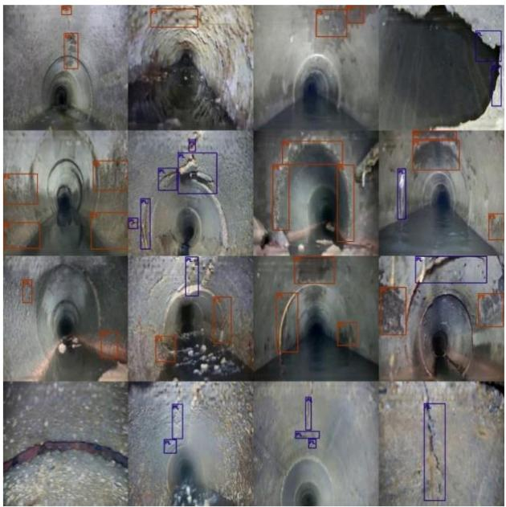
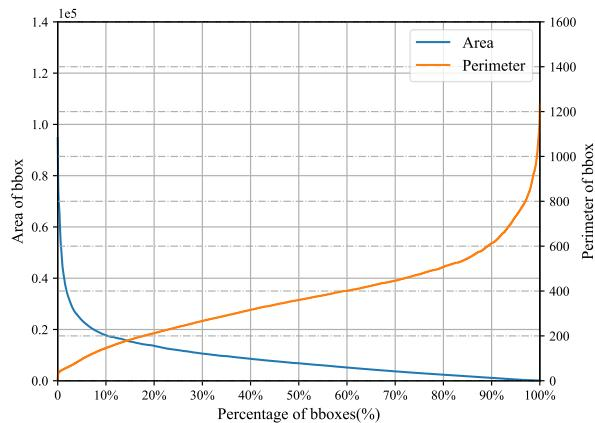
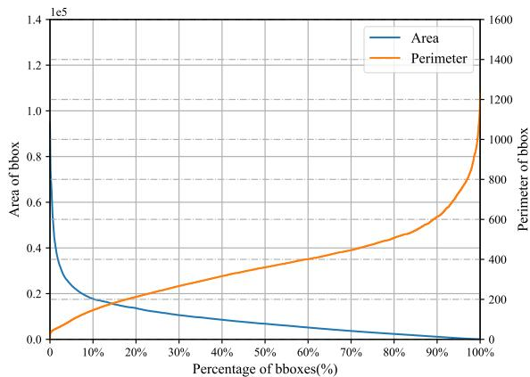
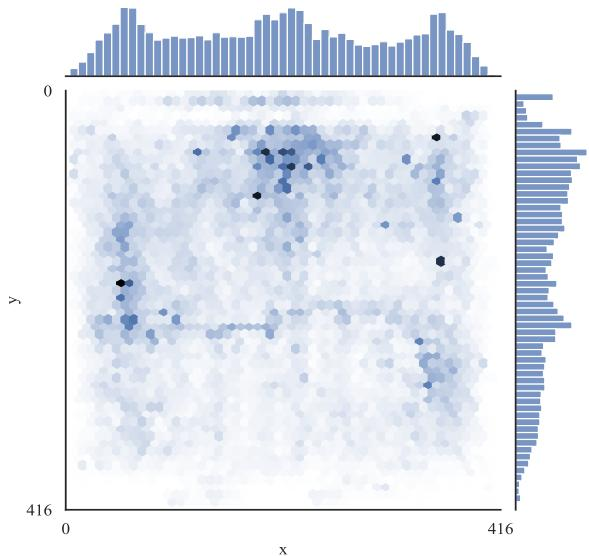

PAPER • OPEN ACCESS

# SewerOD：用于机器学习的视觉化下水道病害检测数据集

引用本文：Wei Wei 等人 2023 J. Phys.: Conf. Ser. 2646 012011

在线查看文章以获取更新和增强内容。

# 您可能还喜欢

- 基于熵权理论的下水道病害分级方法
Shuai Chen, Ce Li, Qin Han 等人。  
圆形下水道管道与非圆形下水道横截面的比较 Alend Wirya Abdulrazaq 和 Mohamed M. Arbili  
- 漏水下水道管道引发的局部砂质土壤侵蚀的维度分析 Basim Kh. Nile, Jabbar H. Al-Baidhani 和 Ali N. Ghulam

# SewerOD：用于机器学习的视觉化下水道病害检测数据集

魏伟 $^{1}$，李策 $^{1,2,3}$，李硕 $^{1}$，陈政 $^{1}$，杨峰 $^{1}$

1 中国矿业大学，机电与信息工程学院，计算机科学与技术系，海淀区学院路，北京，中国，100089

$^{2}$ 北京大学，电子工程与计算机科学学院，计算机科学与技术系，海淀区颐和园路，北京，中国，100871

3 celi@cumbtb.edu.cn

**摘要。** 地下下水道管道是重要的城市基础设施，承担着排放污水的重要责任。管道中病害的位置和类型通常需要检查人员手动检查，由于人工成本和时间要求，无法高效完成。随着计算机视觉的发展，利用检测技术维护下水道管道具有极高的研究价值。然而，管道图像数据通常被视为商业机密，由于开源管道病害数据集的稀缺，这些研究受到很大限制。为解决此问题，我们在本工作中提出了一个用于下水道病害检测的公开大规模目标检测数据集，命名为SewerOD。该数据集包含约47K张图像，由专业研究人员标注，包括两种最广泛存在的结构病害类型：腐蚀和裂缝。我们的数据集可在 https://github.com/SewerOD 获取。

**关键词：** 数据集，病害检测，大规模，下水道监测，机器学习。

# 1. 引言

近年来，中国城市地下空间灾害频发，同时城市地下空间开发进一步增加，如综合管廊、地铁、地下商场等的建设。城市地下下水道管道是排放生活污水和雨水的主要通道，位于道路下方其他管道的底部。随着使用年限的增加，长期服役的管道容易受潮湿环境腐蚀，大部分严重老化和损坏。因此，城市地下空间灾害的发生与下水道管道的损坏密切相关，为确保城市地下空间安全和人民生命财产安全，下水道病害检测是现代城市道路安全监测和路网结构检测的基础工作，也是确保城市道路地下空间安全的关键。因此，如何高效准确地完成这项工作具有重要的研究价值。

基于闭路电视的病害检测是目前的主流方法。通过配备CCTV的管道机器人可以轻松采集管道内部视频，定位灾害并更直接地分析病害类型[1-3]。计算能力的进步促进了深度学习技术的发展，将卷积神经网络应用于检测CCTV视频中的病害已成为研究热点[4-8]。Haurume等人对过去二十五年基于CCTV和SSET技术的下水道检测技术进行了综述[9]。他们将其分类为检测与分割、特征描述、分类和时间滤波。Wang等人提出了一个基于深度学习的通用检测框架，集成了病害分类检测和语义分割模块，然后以Faster-RCNN作为离线视频检测模型，获得了显著的病害分级检测结果[10]。Yin等人设计了一个基于CCTV的病害检测系统，以原始视频作为输入，可以输出标记视频和病害信息用于检查和评估[11]。该系统具有可移植性，其他算法可以替代检测模块。2020年，Pan等人提出了一种名为PipeUnet的管道病害语义分割网络，可以对典型病害如接头偏移、裂缝、渗漏、侵入侧管等进行语义分割[12]。虽然精度不尽如人意，但基本实现了实时可用性。Kumar等人研究了三种经典算法在病害检测上的性能，SSD、Faster-RCNN和YOLOv3，并通过考虑效率和准确性给出了算法应用建议[13]。但研究主要集中在两种功能缺陷，根部侵入和沉积物，而不支持结构缺陷的检测。深度学习技术已在管道健康检查的分类、检测和分割任务中得到广泛研究和应用。

深度学习模型的训练通常需要大量图像数据，但用于下水道病害检测的优秀开源数据集很少。一方面，城市地下管道数据通常被视为机密信息或商业数据，对开源持保守态度。另一方面，标注公共视频需要专业知识密集且耗时。因此，我们发布了病害检测领域的首个开源数据集SewerOD。

该数据集包含47,112张由专业研究人员标注的图像，管道中最常见的两种病害，腐蚀和裂缝，已被标注，同时避免了标签的不平衡分布。该数据集采集自中国南方某城市，历时半年。真实管道场景中的病害分布如图1所示，这表明基于视频帧的病害检测也面临一些挑战：病害尺度变化大、上下文模糊、背景复杂、无意义的杂乱等。

  
**图1.** 数据集概览。裂缝(PL)和腐蚀(FS)的病害分别用蓝色和红色标记。

# 2. 下水道数据集

# 2.1. 图像采集与标注

所有下水道管道的视频均采集自中国南方某沿海城市。该城市高度城市化，人类聚居活动频繁，因此该城市的地下下水道管道负担重，存在老化风险。这些视频是通过使用中国矿业大学（北京）开发的具有自主知识产权的管道机器人获得的。该机器人配备多种传感器，如三通道雷达、视频传感器、陀螺仪和测距编码器。基于同步信息采集和远程传输技术，可以克服传统单独采集设备无法实现各种信息同步传输的困难。

如何用边界框准确标注病害对数据集的质量至关重要。我们的数据集均由相关领域的研究人员标注。在完成他们的初级培训后，我们将所有图像分成多轮进行标注。我们在每轮标注后检查他们的工作以确保类别的准确性。对于有争议的区域，我们专门制定了标准，重新关联所有不符合标准的图像，最后将所有标注工作提交给专业管道检查员进行审核。

我们邀请了一位专业下水道检查员重新标注了数据集中 $1\%$ 的图像，边界框质量的统计如表1所示。不精确的标注主要来自腐蚀缺陷，由于腐蚀区域的重叠。检查员对于是用一个整体边界框还是分开标注存在不一致的理解，导致几何不精确。当管道严重腐蚀时，腐蚀区域常出现裂缝，从而引起少量标注错误。不同的病害分类标准会导致不同的标注，因此引入分级信息非常必要。

**表1.** 边界框质量统计。

<table><tr><td colspan="2">精确率：96.4%</td><td>召回率：97.3%</td></tr><tr><td>不精确：2.7%</td><td>错误类别：0.9%</td><td>-</td></tr></table>

# 2.2. 边界框统计

SewerOD是一个专注于下水道病害检测的数据集。并非所有病害都具有相同的大小和位置，因此边界框在图像上的分布并不相似。为研究边界框的分布，我们从这两个方面分析了统计数据，以指导领域相关设计。

  
(a)  
**图2.** 数据集中不同大小边界框的分布。

  
(b)

图2显示了数据集中不同大小边界框的分布。左侧图表显示了边界框的面积和周长分布。其左纵轴显示边界框的面积，以科学计数法表示。右纵轴显示边界框的周长。为直观比较，所有边界框的面积按降序排列，周长按升序排列。约 $8\%$ 的边界框面积超过2000像素，约 $30\%$ 的边界框面积小于200像素。对于周长，$90\%$ 的边界框周长小于600像素位置。右侧图表显示了不同大小边界框的数量分布。横轴显示边界框面积或周长占整个图像的比例。约有1500个边界框的面积占图像比例小于 $1\%$。由于这两个指标的量级不同，约有1200个边界框的周长占图像比例小于 $10\%$。边界框的分布表明SewerOD在小目标检测方面存在挑战，可应用于管道轻微损坏的场景。

  
**图3.** 边界框中心点坐标的联合分布。

另一种衡量边界框密度和多样性的方法是研究其中心点的分布。图3显示了中心点的联合分布。以边界框中心点的x坐标和y坐标为自变量考察它们的联合分布，可以衡量边界框在图像上的位置分布。为符合计算机视觉的习惯，以左上角为坐标原点。由于管道内视频采集设备的视角固定，边界框的中心点主要位于图像的上方和两侧，图像的下部为污水区域。显然，管道顶部由于水蒸气作用容易产生结构缺陷，容易导致管道上方土壤被侵蚀，造成上方道路塌陷。两侧区域受管道内水位变化影响，潮湿后暴露在空气中容易受损。

# 3. 结论

下水道管道病害会导致排水不畅、道路塌陷、覆土管道破裂、覆土地铁渗漏等，是地下空间灾害的重要来源，一旦发生灾害，将造成城市环境污染，影响民生。因此，市政部门和管道公司每年消耗大量资源检查管道，检测技术的应用可以有效解决此问题。由于缺乏高质量的开源管道数据集，计算机视觉研究人员只能在自行收集的数据集上设计模型，这些模型往往缺乏泛化性且不可相互比较。因此，我们开源了一个专注于下水道病害检测的数据集SewerOD，而目前尚无其他类似数据集开源。该数据集采集自多个地下污水管段，病害由专业研究人员标注，包括两种广泛存在且对管道危害更大的结构病害类型：腐蚀和裂缝。我们提供了数据集的详细统计以指导领域相关模型设计，这表明引入病害聚类作为监督信息的检测模型可能具有更好的性能。基于对病害区域面积分布的研究，病害检测模型需要具备检测小目标的能力。我们希望该数据集能推动管道病害检测研究领域的发展，同时，根据政府部门和行业领先公司制定的病害分级标准，我们将发布一个包含病害分级信息的更大数据集。

# 参考文献

[1] Y. Mano, R. Ishikawa, Y. Yamada 和 T. Nakamura 2018 用于下水道管道检查的蠕动爬行机器人收缩力控制系统的开发 IEEE/ASME先进智能机电一体化国际会议 pp 936-941  
[2] D. Alejo, F. Caballero 和 L. Merino 2019 下水道网络中检查机器人的鲁棒定位系统 Sensors vol. 19, no. 22  
[3] J. Lu 和 D. Zhu 2018 变径城市下水道清淤机器人设计 Journal of Physics: Conference Series vol. 1074, pp. 26-28  
[4] S. I. Hassan, L. M. Dang, I. Mehmood 等人 2019 基于卷积神经网络的地下下水道管道状况评估 Automation in Construction vol. 106  
[5] D. Li, A. Cong 和 S. Guo 2019 使用具有分层分类的深度卷积神经网络从不平衡的CCTV检测数据中检测下水道损伤 Automation in Construction vol. 101, pp. 199-208  
[6] Y. Tan, R. Cai, J. Li, P. Chen 和 M. Wang 2021 基于改进的You Only Look Once算法的下水道缺陷自动检测 Automation in Construction vol. 131  
[7] A. Hawari, M. Alamin, F. Alkadour, M. Elmasry 和 T. Zayed 2018 用于闭路电视（CCTV）检查的下水道管道的自动缺陷检测工具 Automation in Construction vol. 89, pp. 99-109  
[8] X. FANG, W. GUO, Q. LI 等人 2020 使用异常检测算法在视频序列上进行下水道管道故障识别 IEEE Access vol. 8, pp. 39574-39586  
[9] J. B. Haurum 和 T. B. Moeslund 2020 基于图像的CCTV和SSET下水道检查自动化综述 Automation in Construction vol. 111  
[10] M. Wang, H. Luo 和 J. C. Cheng 2021 基于闭路电视（CCTV）图像的地下下水道管道自动化状况评估框架 Tunnelling and Underground Space Technology vol. 110  
[11] X. Yin, Y. Chen, A. Bouferguene, H. Zaman, M. Al-Hussein 和 L. Kurach 2020 基于深度学习的下水道管道自动缺陷检测系统框架 Automation in Construction vol. 109  
[12] G. Pan, Y. Zheng, S. Guo 和 Y. Lv 2020 基于改进U-Net的自动下水道管道缺陷语义分割 Automation in Construction vol. 119  
[13] S. S. Kumar, M. Wang, P. Dulcy M. Abraham, M. R. Jahanshahi, T. Iseley 和 a. J. C. P. Cheng 2020 基于深度学习的CCTV视频中下水道缺陷自动检测 Journal of Computing in Civil Engineering vol. 34

# 致谢

本工作得到北京市自然科学基金（4202065）、北京科技新星计划（Z191100001119106, Z211100002121147）、国家重点研发计划（2021YFC3090304）、国家自然科学基金（62076016, 61972016, 62176260）以及中央高校基本科研业务费（J210409）的支持。本工作在由北京大学继续教育学院支持的国内访问学者项目（2022-2023）期间完成。
