# 基于YOLOv11的实时混凝土裂缝检测与分割模型

邵泽黄*

安徽工业大学，材料科学与工程，中国

szhuang0601@163.com

刘奇

安徽工业大学，物联网工程，中国

liuqi04@126.com

陈超

山东科技大学，信息科学与技术，中国

cchen1107@126.com

陈宇航

安徽工业大学，材料科学与工程，中国

yhchen2508@163.com

# 摘要

长江三角洲地区快速发展的交通基础设施加速老化，迫切需要高效的混凝土裂缝检测，因为裂缝劣化严重危及结构完整性和区域经济增长。为克服低效人工检测和现有深度学习模型性能欠佳的局限性，特别是在复杂背景下的小目标裂缝检测方面，本文提出YOLOv11-KW-TA-FP，一种基于YOLOv11n架构的多任务混凝土裂缝检测与分割模型。该模型集成三阶段优化框架：（1）在骨干网络中嵌入动态核仓库卷积（KWConv），通过动态核共享机制增强特征表示；（2）在特征金字塔中引入三重注意力机制（TA），强化通道-空间交互建模；（3）设计FP-IoU损失函数，实现自适应边界框回归惩罚。实验验证表明，增强模型相比基线实现显著性能提升，达到91.3%精确率、76.6%召回率和86.4% mAP@50。消融研究证实所提模块的协同效果。此外，鲁棒性测试表明在数据稀缺和噪声干扰条件下性能稳定。本研究为自动化基础设施检测提供高效计算机视觉解决方案，具有重要实际工程价值。

关键词 混凝土裂缝，YOLOv11n，实时检测，鲁棒性。

# 1 引言

长江三角洲位于长江入海口，涵盖上海、江苏、浙江和安徽。作为中国经济最具活力和活力的地区之一，它在中国经济发展中扮演关键角色，是研究和创新的重要区域。早期，该地区交通基础设施主要由石桥和土路组成。后来，随着工业发展，逐渐建设铁路桥和公路桥以满足交通需求。长江三角洲的快速城市化加速了基础设施老化。桥梁和隧道等关键结构在支撑交通需求的同时面临劣化问题。混凝土裂缝问题作为一种常见损伤类型，严重影响结构安全性和耐久性。因此，及时准确的裂缝检测已成为基础设施维护和安全管理的的重要任务[1, 2]。

传统混凝土裂缝检测主要依赖人工目视检查。然而，这种方法耗时耗力，易受人为因素影响，导致检测结果的主观性和不一致性[3, 4]。此外，桥墩和隧道内部等特殊位置难以检查，增加了安全隐患[5]。

近年来，深度学习在计算机视觉领域取得显著进展，目标检测是典型代表。YOLO作为高效实时目标检测框架，已在交通监控、安全监视和工业检测中得到广泛应用[6, 7]。作为最新版本，

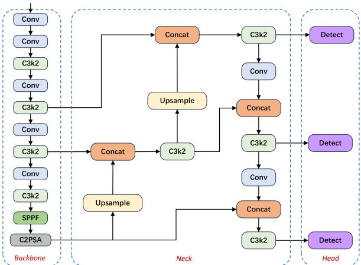

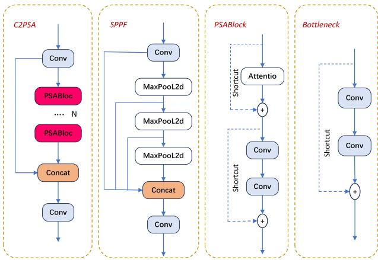

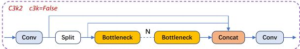

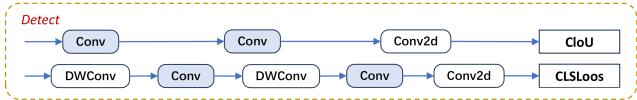

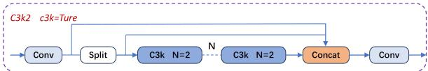
图1：YOLOv11模型架构。

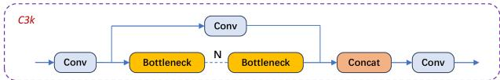

YOLOv11凭借其高效特征提取能力和卓越实时处理性能，已成为混凝土裂缝检测的首选解决方案[8, 9]。其模型结构如图1所示。

本研究基于YOLOv11模型，开发了专门用于长江三角洲地区基础设施裂缝检测的智能系统。该系统能够快速准确地识别桥梁、隧道和水利设施中的混凝土裂缝，相比传统方法提供更高效准确的检测途径。所用数据集涵盖长江三角洲地区多样化的裂缝图像，保证了模型的泛化能力和精度[10, 11]。本研究对于提高检测效率具有重要意义，为智能基础设施维护提供理论和技术支持[4, 12]。通过本研究，旨在为长江三角洲乃至更广泛地区的基础设施安全管理提供创新解决方案，并推动智能检测和维护的发展[13, 14]。在快速城市化、庞大交通网络和目视检查局限性的背景下，本研究致力于通过创建高效的深度卷积神经网络（CNN）模型来解决复杂背景下混凝土裂缝检测的挑战。本文的主要贡献如下：

- 骨干网络：用核仓库（KW）卷积替代原始卷积，动态调整卷积核权重，增强特征表示，降低计算复杂度，提高模型的鲁棒性以及捕获细粒度特征和执行多尺度融合的能力；
- 特征金字塔网络：集成三重注意力（TA）机制，增强特征提取并优化多尺度目标检测，从而提升小目标和遮挡目标的检测能力；强化像素级特征表示，提高上下文信息的利用效率，优化小目标和复杂背景的分割性能，从而提升整体模型性能和鲁棒性；
- 损失函数：为目标检测任务构建FP-IoU损失函数。通过采用自适应惩罚因子和区间映射，提高边界框回归和像素级定位的精度，增强小目标和低质量样本的检测和分割能力，加速模型收敛，提高训练效率，并增强泛化能力和鲁棒性。

# 2 相关工作

随着计算机科学的进步，大量计算机视觉算法被提出并应用于多个领域。当前裂缝检测模型可分为两大类：基于传统的方法和基于深度学习的方法[15],[47]。

## 2.1 传统裂缝检测方法

在裂缝检测领域，传统图像处理方法已形成完整的技术体系。早期研究中，基于边缘检测的算法被广泛探索。Dorafshan等人比较了空间域梯度检测和数学形态学梯度检测在混凝土裂缝识别中的性能，结果表明后者在复杂背景条件下具有更好的响应效率[16]。为解决Sobel算子的局限性，Zhang等人增加六个方向模板并改进阈值分割算法，有效提高了裂缝边缘的定位精度和连续性[17]。形态学操作与阈值分割的结合也被证明是有效的。Jia对传统方法的研究表明，自适应局部阈值结合膨胀和腐蚀操作能有效抑制光照干扰并增强裂缝特征[19]。Xu等人使用迭代阈值分割结合形态学膨胀连接裂缝，成功消除了伪边缘干扰[18]。Otsu方法在阈值选择中被广泛应用；例如，Fan通过结合高斯滤波与Otsu方法优化了噪声环境中的边缘检测[20]。在算法性能评估方面，Li等人使用支持向量机（SVM）对裂缝形状进行分类，结合自适应灰度变换和几何特征提取，显著提高了区分对角裂缝和网状裂缝的准确性[21]。传统方法的固有局限性导致多技术融合策略的出现。例如，Shi等人将脉冲涡流与电磁声换能器结合，实现了金属构件裂缝的定量检测，有效克服了单一涡流检测易受提离效应影响的局限[22]。

尽管传统裂缝检测方法发挥基础作用，但它们存在固有局限性：严重依赖手动特征工程（如手动设计的滤波器和阈值），难以适应多样化的裂缝形状；缺乏对复杂上下文交互建模的能力，导致在钢筋阴影或表面污渍等噪声环境中出现误检；对不同基础设施场景的泛化能力差，特别是对低对比度或模糊裂缝。为克服这些挑战，提出的YOLOv11-KW-TA-FP模型引入三项协同创新：核仓库卷积（KWConv）在单元级别动态调整卷积核权重，无需人工干预自主捕获多尺度裂缝特征；三重注意力机制（TA）协调空间、通道和长程依赖关系，在抑制背景干扰的同时增强关键裂缝特征；FP-IoU损失函数结合自适应几何惩罚和非单调注意力机制，提高了低质量样本的定位精度。这些创新共同突破了传统方法的局限，为现代基础设施提供了鲁棒的自动化检测解决方案。

## 2.2 基于YOLO的裂缝检测

近年来，深度学习模型在计算机视觉领域取得突破性进展。尽管深度学习概念早已提出，但其广泛应用始于2009年图形处理单元（GPU）的引入[23]。GPU卓越的并行计算能力显著加速了深度神经网络在图像分类和识别任务中的训练过程[24]。随着基础设施持续老化，裂缝检测对于确保道路和建筑等结构安全变得日益关键。受益于其高效和实时检测特性，YOLO系列模型在裂缝检测领域得到广泛应用。

YOLO-DL框架[25]集成YOLO和DeepLabv3+网络架构，提出了适用于混凝土裂缝多任务识别的模型。通过引入注意力机制和特征校准模块，该模型在裂缝分类、定位和分割任务中的性能显著提升，尤其在实时检测方面显示优势。Hu等人提出基于YOLO的风力涡轮机损伤检测方法，将深度学习与无人机检测技术结合，实现高精度、实时的损伤检测和分割[26]。在混凝土裂缝检测领域，相比Faster R-CNN和SSD等其他主流算法，YOLO展现出更强的鲁棒性和准确性，特别是在处理微小裂缝和不平衡数据分布时，其性能更加稳定[27]。

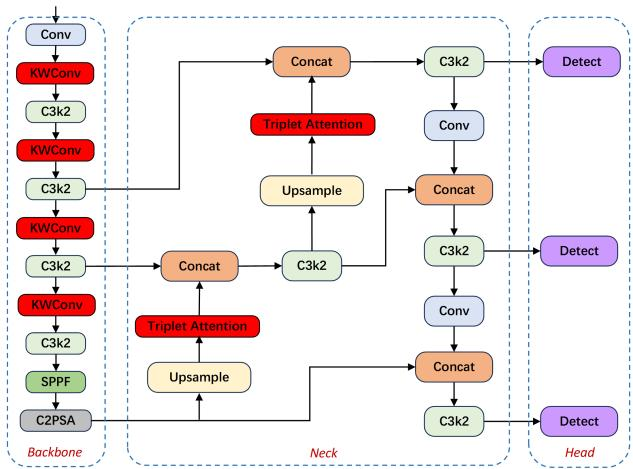

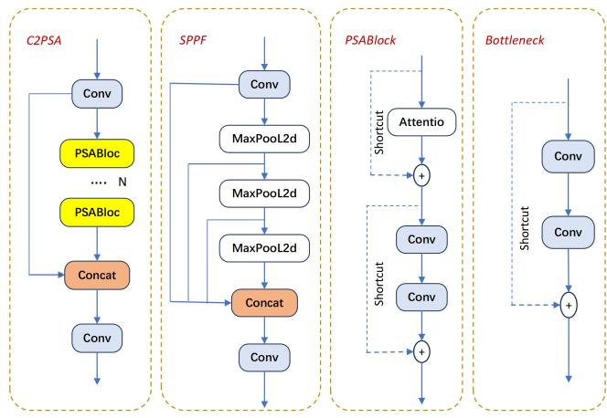

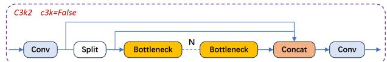

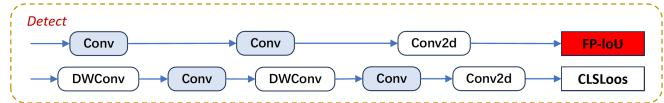

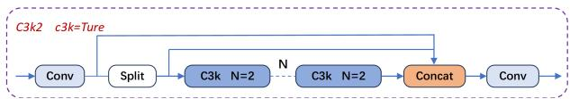
图2：YOLOv11-KW-TA-FP模型架构。

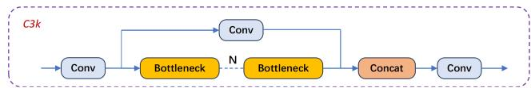

为优化YOLO在道路缺陷检测中的性能，研究人员提出了一系列改进算法。例如，结合部分Transformer结构和多聚焦注意力机制的改进方法在保证实时性的同时有效提高了检测精度[28]。在岩石裂缝检测场景中，基于YOLO的方法成功应对复杂地下环境的挑战，实现了裂缝类型和特征的准确识别[29]。DAPONet提出了一种改进的YOLO模型，集成了双重注意力机制用于实时道路损伤检测，并在多个公共数据集上取得优异性能[30]。利用对比学习技术和YOLO框架的CL-PSDD模型，在无监督学习范式下展现出强大的裂缝检测能力[31]。

然而，挑战依然存在。当前模型在高噪声环境（如有杂物干扰的建筑工地）中精度降低，难以处理低对比度微裂缝。需要大量标注数据集增加了实施成本，需要在资源受限的现场部署中进一步平衡精度与计算效率。

# 3 提出方法

YOLOv11n通过精简网络层、减少参数和计算量，提供更快的推理速度和更紧凑的模型，适合资源受限设备[32, 33]。因此，本文选择其作为基线模型。尽管YOLOv11n具有优秀的检测性能，但在混凝土裂缝检测场景中仍有改进空间。基于YOLOv11n，本文提出用于混凝土裂缝检测的YOLOv11-KW-TA-FP模型，其结构如图2所示。红色模块标记了本研究对YOLOv11的关键改进：将骨干网络中的标准卷积替换为核仓库卷积（KWConv），在特征金字塔网络（Neck）的每个上采样模块后添加TA机制模块，并将检测头（Head）中的原始CIOU损失函数替换为FP-IoU损失函数。

## 3.1 核仓库动态卷积

在目标检测任务中，背景干扰仍是持续挑战。为增强模型处理复杂场景的能力并提高检测精度，本研究将核仓库[34]集成到骨干网络中。由英特尔于2023年8月开发的核仓库代表了一种广义动态卷积框架，在参数效率和表示能力之间实现了最佳平衡。如图3所示，该方法包含三个核心组件：（1）自适应核分区，（2）跨层仓库共享，以及（3）用于动态核融合的归一化注意力函数（NAF）。

### 3.1.1 核分区

传统动态卷积直接混合完整卷积核，导致参数数量随核数量线性增加。核仓库创新性地沿通道维度将单个卷积核均匀分割成m个非重叠核单元，每个单元的维度仅为原始核的1/m。例如，当m=16时，每个核单元的参数数量减少为原始核的1/16。通过将混合粒度从完整核细化到核单元级别，该方法允许在相同参数预算下显著增加仓库中存储的核单元数量n（例如，n=108），突破了传统方法n<10的限制。每个核单元通过线性组合动态生成，显著提高了参数效率和特征表示能力。

### 3.1.2 仓库共享

为增强跨层参数重用，核仓库设计了分层共享机制：同一阶段中的卷积层共享同一仓库E，而不同阶段使用独立仓库。在现代卷积网络（如ResNet和MobileNet）中，同一阶段中的层通常具有相同的核大小。统一核单元的维度通过计算各层核大小的最大公约数确定。例如，相邻层大小为3×3×64×128和3×3×128×256的核可统一分割为大小为1×1×64×64的核单元。此策略明确增强了层间参数依赖，使模型在总核单元数量n增加时能保持整体参数增量可控。实验表明，共享范围越广（跨层>单层），性能提升越显著。

### 3.1.3 归一化注意力函数

核仓库提出的新注意力函数（NAF）通过三种机制优化大规模核单元混合的动态学习过程。该函数的核心创新是使用线性归一化方法替代传统Softmax，将原始注意力分数z_{ij}除以所有候选核单元分数绝对值之和。这打破了传统注意力的非负权重约束，允许负值参与混合计算以增强不同核单元间的对抗交互。为缓解训练早期大规模参数混合的优化困难，引入了温度退火机制：在前20个训练周期内，温度系数τ从1线性衰减至0，使模型逐步从确定性初始化过渡到动态注意力调整。在初始化阶段，通过预定义二元掩码β_{ij}建立核单元与混合位置之间的强关联。当参数预算b≥1时，强制每个混合单元绑定至少一个独占核单元；而当b<1时，限制每个核单元最多服务一个混合位置，确保混合系统的可解释性和训练稳定性。

## 3.2 三重注意力机制

为应对混凝土裂缝检测目标的多样性和形态特异性，网络需要自适应特征注意力分配，能根据空间分布和几何特征动态调整关注区域。这防止信息冲突，同时保持跨异质目标的鲁棒特征学习。我们精炼的三重注意力（TA）[35]机制，如图4所示，专门通过三个并行分支处理分散和多尺度裂缝模式：

1. 空间注意力分支：通过2D位置编码优先处理裂缝区域；
2. 通道注意力分支：使用挤压-激励机制放大裂缝相关特征通道；
3. 跨维度融合分支：通过可学习门控协调多尺度特征。

每个分支独立捕获维度间交互，同时通过共享核仓库保持参数效率。

在所提出的网络架构中，前两个分支专注于建模通道（C）和空间（H/W）维度之间的交互，实现对特征权重的精确调整以优先处理关键裂缝特征。对于分散目标（如低密度裂缝分布），这种通道-空间注意力机制增强了判别性特征，同时丰富了来自周边区域的上下文信息，有效应对分散性挑战。第三分支集成了LSTM启发的设计，建立长程空间注意力，捕获跨扩展空间范围（长达100像素）的上下文依赖关系，实现远距离区域的动态权重调整[36]。

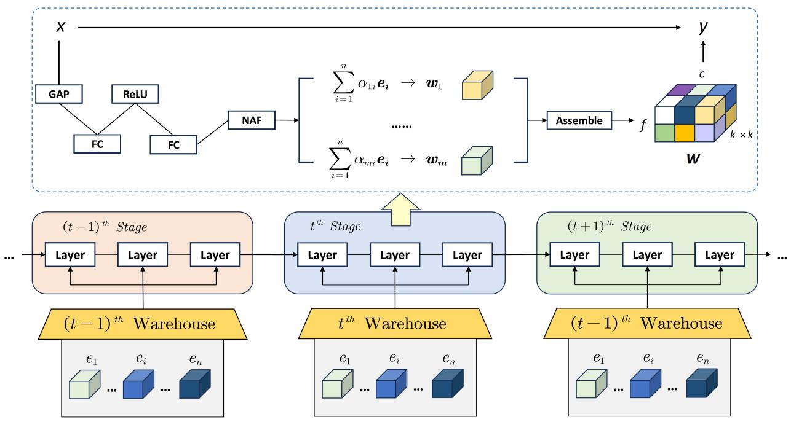
图3：核仓库示意图。

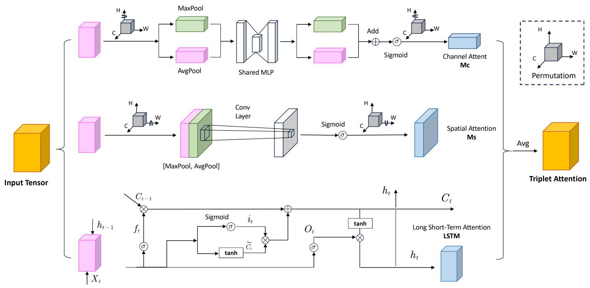
图4：三重注意力机制示意图。

传统三重注意力机制常表现出局部偏差，过度强调特定高对比度区域而忽视稀疏或形态多样的裂缝[37]。该机制通过联合优化特征细节和全局信息，有效增强了复杂目标的检测能力。

### 3.2.1 第一分支：通道注意力

首先，对大小为C×H×W的输入特征图执行全局最大池化和全局平均池化，压缩空间维度，得到两个大小为1×1×C的特征图。然后，将这两个特征图输入共享多层感知机（MLP），得到两个新的大小为1×1×C的特征图。最后，将MLP的输出相加并通过Sigmoid激活函数处理，生成最终的通道注意力权重矩阵M_c。其公式为：

$$
M _ {c} \in R ^ {C \times 1 \times 1} \tag {1}
$$

其中MLP的第一层具有C/r个神经元和ReLU激活函数，第二层具有C个神经元。为减少计算参数，MLP引入了降维因子r，表示为：

$$
M _ {c} \in R ^ {C / r \times 1 \times 1} \tag {2}
$$

结合上述步骤，通道注意力的公式可总结为：

$$
M _ {c} (F) = \sigma \left(\operatorname {M L P} \left(\operatorname {A v g P o o l} (F)\right) + \operatorname {M L P} \left(\operatorname {M a x P o o l} (F)\right)\right) \tag {3}
$$

使用F_{avg}^{c}和F_{\max}^{c}分别表示全局平均池化特征和全局最大池化特征，公式可简化为：

$$
M _ {c} (F) = \sigma \left(\mathrm {M L P} \left(F _ {\text {a v g}} ^ {c}\right) + \mathrm {M L P} \left(F _ {\max } ^ {c}\right)\right) \tag {4}
$$

第一分支在解耦空间和通道特征处理的同时建立跨维度交互。空间特征（如裂缝形态和位置模式）通过可变形卷积进行坐标敏感重校准。同时，通道特征（包括纹理梯度和色彩特征）通过挤压-激励机制进行自适应加权。跨注意力模块通过将空间不连续性与异常通道响应对齐来综合这些解耦表示，优先处理材料属性和几何异常表现出强相关性的裂缝关键区域。这种联合优化实现了裂缝边界的精确定位，同时抑制了来自相似纹理的背景干扰。

### 3.2.2 第二分支：空间注意力

在通道压缩阶段，输入特征张量（维度为C×H×W）首先进行全局最大池化和全局平均池化。这沿通道轴降维生成两个二维特征图（每个大小为H×W×1）。然后将这两个通道压缩结果沿通道轴连接，形成包含双重空间信息的复合特征张量（维度为H×W×2）。最后，经Sigmoid函数进行非线性归一化处理后，得到空间注意力权重矩阵M_s。其数学表示为：

$$
M _ {s} (F) \in R ^ {H, W} \tag {5}
$$

类似地，空间维度中的池化方法生成二维特征图，平均池化和最大池化公式为：

$$
F _ {\text {a v g}} ^ {s} \in R ^ {1 \times H \times W} \tag {6}
$$

$$
F _ {\max } ^ {s} \in R ^ {1 \times H \times W} \tag {7}
$$

最后，基于平均池化和最大池化的公式，可推导出空间注意力的公式：

$$
M _ {s} (F) = \sigma \left(f ^ {7 \times 7} \left[ F _ {\mathrm {a v g}} ^ {s}; F _ {\mathrm {m a x}} ^ {s} \right]\right) \tag {8}
$$

第二分支通过空间和通道特征的差异化加权策略增强第一分支，优化多尺度特征表示。在目标分散场景中，空间重校准优先处理目标分布模式，而通道调制自适应地强调判别性属性。这些维度之间的协同作用通过解决低对比度区域中的空间-通道错位，生成更具判别力的特征嵌入。

### 3.2.3 第三分支：时序注意力

第三级路径包含一个LSTM启发的架构，包括三个操作阶段。遗忘门机制从记忆状态中有选择地过滤过时数据元素。随后，输入门控制新信息集成到更新后的细胞状态。同时，输出门通过S型门控操作调节信息传播，确保上下文相关的特征传输。

遗忘门：遗忘门将前一层的输出h_{t-1}和当前层的输入序列数据x_t作为输入。它将这些输入通过S型激活函数传递，产生输出f_t，控制前一层细胞状态C_{t-1}被遗忘的程度。计算公式为：

$$
f _ {t} = \sigma \left(W _ {f} \cdot \left[ h _ {t - 1}, x _ {t} \right] + b _ {f}\right) \tag {9}
$$

输入门：输入门包含双重计算阶段：初始阶段采用S型门控机制调节信息流，生成输入调制因子i_{t}；而后续阶段利用双曲正切归一化处理状态更新，产生候选状态向量C_{t-1}。这些互补操作数学形式化为：

$$
i _ {t} = \sigma \left(W _ {i} \cdot \left[ h _ {t - 1}, x _ {t} \right] + b _ {i}\right) \tag {10}
$$

$$
C _ {t} = \tanh  \left(W _ {c} \cdot \left[ h _ {t - 1}, x _ {t} \right] + b _ {c}\right) \tag {11}
$$

i_{t} * C_{t}的乘积表示要保留的新信息量。这两个门共同决定了新信息如何更新该层的细胞状态C_{t}，表达式为：

$$
C _ {t} = f _ {t} * C _ {t - 1} + i _ {t} * C _ {t} \tag {12}
$$

输出门：输出门控制从该层细胞状态中过滤的信息量。首先，使用S型激活函数获得范围[0,1]内的值o_t，表达式为：

$$
o _ {t} = \sigma \left(W _ {o} \left[ h _ {t - 1}, x _ {t} \right] + b _ {o}\right) \tag {13}
$$

最后，细胞状态C_t通过tanh激活函数处理，然后与o_t相乘得到该层的输出h_t，表达式为：

$$
h _ {t} = o _ {t} * \tanh  \left(C _ {t}\right) \tag {14}
$$

第三分支专注于长程空间上下文建模，与前两个分支的局部特征加权策略不同。LSTM启发的空间注意力机制动态地重校准跨扩展感受野的空间注意力权重，实现局部判别性特征和全局上下文线索的联合优化。这在目标远离焦点区域或与复杂背景混合时特别有效，增强了遮挡场景中的检测鲁棒性。

增强的TA机制将基于LSTM的顺序注意力传播与跨维度交互精炼相结合，显著提高了空间分散和形态异质目标的检测性能。实验验证表明，在高杂乱环境中，相比传统TA设计具有更优性能，尤其在涉及部分遮挡或低对比度裂缝模式的情况下表现出色。

## 3.3 损失函数

我们提出的框架采用具有双重优化目标的复合损失架构：图像分割和目标检测。分割组件采用处理类别不平衡的改进交叉熵准则。具体而言，由于裂缝像素在典型基础设施图像中构成最小比例（通常<5%像素覆盖），传统损失计算被背景区域主导。为解决这种固有的类别不平衡，我们在像素级交叉熵框架内实现了类别感知加权机制[25]。增强的加权交叉熵损失L_{wce}公式化为：

$$
L _ {w c e} = - \frac {1}{N} \times \sum_ {n = 1} ^ {N} \sum_ {c = 1} ^ {2} w _ {c} \times \log \frac {\exp \left(y _ {n , c}\right)}{\exp \left(y _ {n , i}\right)} \times y _ {n, c} \tag {15}
$$

其中y表示输入，y'表示目标，w表示权重，N表示小批量维度上的样本数，本研究设置为8。

提出的FP-IoU损失通过协同整合Focaler IoU的样本不平衡缓解[39]和PIoUv2的锚框扩张校正[40]，解决了混凝土图像中裂缝检测的挑战——边缘模糊和表面复杂性。它用自适应区间映射替代静态惩罚[38]，抑制回归引起的框扩张，同时对低对比度裂缝应用难度感知加权。这种双重机制通过缺陷对齐的梯度更新加速收敛并提高精度。

Focaler IoU函数如公式16所示，以分段函数形式构建IoU以提高边界框的回归效果。

$$
L _ {\mathrm {I o U f o c a l e r}} = \left\{ \begin{array}{c} 0, L _ {\mathrm {I o U}} <   d \\ \frac {L _ {\mathrm {I o U}} - d}{u - d}, d \leqslant L _ {\mathrm {I o U}} \leqslant u \\ 1, L _ {\mathrm {I o U}} > u \end{array} \right. \tag {16}
$$

在公式中，L_{\mathrm{IoU}}指原始值，d和u均在0到1区间内。不同回归样本对应不同的d和u。损失定义如公式17所示：

$$
X _ {\text {I o U f o c a l e r}} = 1 - L _ {\text {I o U f o c a l e r}} \tag {17}
$$

通过检查Focaler IoU公式可以看出，当L_{\mathrm{IoU}}小于特定值时，L_{\mathrm{IoUfocaler}}为零。然而，本文的研究对象是混凝土裂缝，大多是低质量目标缺陷，与原始损失函数不匹配。改进的损失函数采用分段函数形式，消除了原始参数，这允许更有效地利用样本数据，更好地处理低质量缺陷，全面分析样本位置，并促进模型的稳定收敛。这增强了本文数据集上的性能。损失定义在公式18-19中给出：

$$
L _ {\mathrm {I o U}} = \left\{ \begin{array}{c} \frac {L _ {\mathrm {I o U}}}{u}, L _ {\mathrm {I o U}} \leqslant u \\ 1, L _ {\mathrm {I o U}} > u \end{array} \right. \tag {18}
$$

$$
X _ {\mathrm {I o U} ^ {\mathrm {f}}} = 1 - L _ {\mathrm {I o U} ^ {\mathrm {f}}} \tag {19}
$$

PIoU损失通过引入自适应惩罚因子和梯度重塑优化更新轨迹，解决了传统锚框回归的低效问题。它不诱导顺序扩张-收缩循环，而是直接最小化锚框和真实框之间的边缘间距离（公式20-21）。这种双重机制通过质量感知梯度调制实现近乎线性的回归路径，加速收敛同时保持纵横比一致性——这对于裂缝等细长目标尤为重要。通过基于目标维度和空间上下文动态调整惩罚，PIoU绕过次优中间状态，通过几何相干更新实现精确定位。

$$
p = \frac {1}{4} \left(\frac {d w _ {1}}{w _ {\mathrm {g t}}} + \frac {d w _ {2}}{w _ {\mathrm {g t}}} + \frac {d h _ {1}}{h _ {\mathrm {g t}}} + \frac {d h _ {2}}{h _ {\mathrm {g t}}}\right) \tag {20}
$$

$$
X _ {\mathrm {P I o U}} = L _ {\mathrm {I o U}} + 1 - \mathrm {e} ^ {- p ^ {2}} \tag {21}
$$

其中P是惩罚因子，定义的变量如图5所示。

在PIoU框架基础上，引入非单调注意力层\mathrm{m(x)}，通过动态优化权重调整来精炼聚焦机制。通过将此注意力层与PIoU集成，开发了PIoUv2损失函数，以优先处理表现出模糊回归特征的中等质量锚框。与其前身不同，PIoUv2采用质量感知梯度调制来平衡高质量锚框（精确定位）和低质量异常值（鲁棒误差抑制）之间的优化工作，有效解决了标准实现中对过渡状态样本的忽视。这种双重平衡机制（在公式22-24中数学形式化）通过基于锚框定位置信度以及与真实边界空间相干性自适应地重新校准惩罚强度，增强了对边缘模糊裂缝的检测稳定性。

$$
q = \mathrm {e} ^ {- p}, q \in (0, 1 ] \tag {22}
$$

$$
m (x) = 3 x \cdot \mathrm {e} ^ {- x ^ {2}} \tag {23}
$$

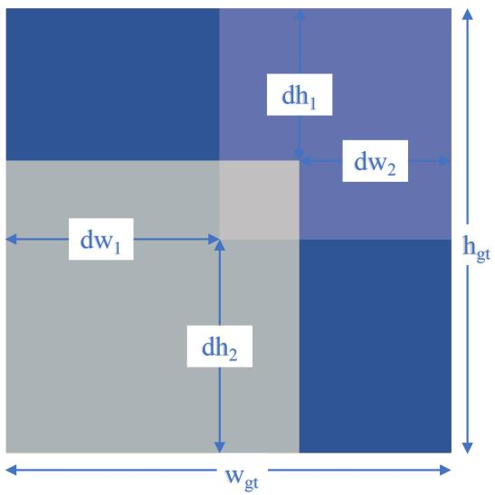
图5：PIoU中定义的变量。

$$
X _ {\mathrm {P I o U v} 2} = 3 m (\lambda q) \cdot X _ {\mathrm {P I o U}} \tag {24}
$$

从公式22可以看出，p的增加对应q的减少。q表示锚框的质量。当p为0时，q等于1，表示此时真实框和预测框完全重叠。λ是调节注意力的超参数。

本文通过整合Focaler IoU和PIoUv2损失函数提出了FP-IoU损失函数。损失定义如下：

$$
X _ {\mathrm {F P} - \mathrm {I o U}} = 3 m (\lambda q) \left(X _ {\mathrm {I o U ^ {f}}} + 1 - \mathrm {e} ^ {- p ^ {2}}\right) \tag {25}
$$

本研究中提出的FP-IoU损失函数协同整合了两种不同损失函数范式的设计原则。通过根据目标维度按比例动态调制惩罚因子[38]并实施整体位置编码策略，该策略封装了边缘级几何关系和区域级空间相干性[39]，FP-IoU建立了质量感知梯度重分配机制。这种集成方法使得能够同时优化高质量锚框的空间-频谱特征解缠，同时抑制低置信度提议的误差传播。与CIoU变体相比，FP-IoU引入了三项关键增强：基于裂缝宽度/长度比的自适应曲率调整、通过注意力加权特征金字塔的多尺度惩罚因子融合，以及防止对部分遮挡目标过度惩罚的动态梯度裁剪阈值。测试表明，我们的双路径设计比标准CIoU损失实现了更高的精度，在密集和稀疏裂缝上都表现出稳定性能。

# 4 实验与结果

## 4.1 数据集

为确保YOLOv11-KW-TA-FP模型具有高泛化能力和性能，本文选择三个公共数据集进行实验，即Crack-Seg数据集、Surface Crack Detection数据集和Crack Segmentation数据集。其中，Crack-Seg数据集主要用于模型训练阶段。Surface Crack Detection数据集和Crack Segmentation数据集主要用于泛化实验部分。为确保模型训练过程的可靠性和模型的泛化能力，上述三个数据集已进行预处理。首先，我们使用感知哈希算法计算每张图像的64位哈希指纹，并设置汉明距离阈值为5进行相似性检测。对于检测到的重复图像，仅保留最早的样本，其余从数据集中移除。然后，根据标准数据分配协议，Crack-Seg数据集按7:2:1的比例划分为训练集、验证集和测试集。Crack-Seg数据集的详细分析如图6所示。在(a)中，从左到右，网格1显示训练集的数据量，展示每个类别包含的样本数。网格2显示框的大小和数量

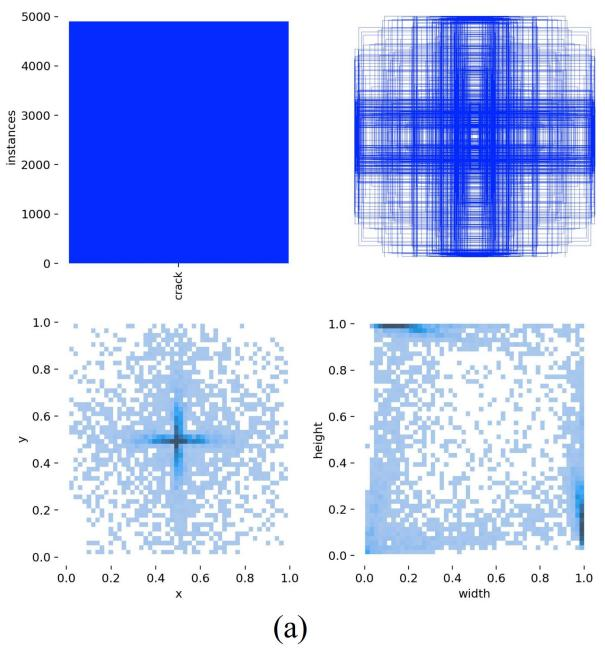
图6：Crack-Seg数据集详细分析可视化；(a)标签；(b)标签相关图。

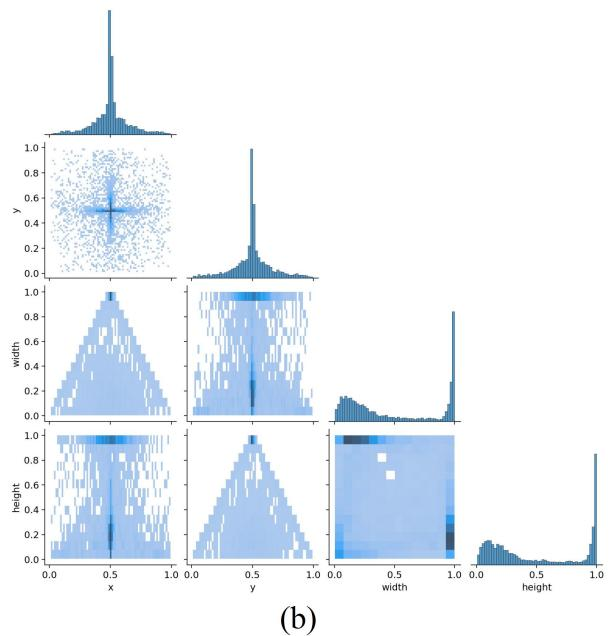

和框的数量，显示训练集中边界框的大小分布和对应数量。网格3显示中心点相对于整个图像的位置，描述边界框中心点在图像中的分布。网格4显示图像中目标的高宽比相对于整个图像的比例，反映训练集中目标高宽比的分布。(b)显示了训练过程中目标检测算法对标签之间相关性的建模。每个矩阵单元表示模型训练中使用的标签，单元的颜色深度反映对应标签之间的相关性。

## 4.2 实验设置

### 4.2.1 实验环境与超参数设置

实验基于Windows 10 22H2操作系统，使用第12代Intel(R) Core(TM) i5-12600KF CPU，Nvidia RTX 4070Ti Super 16G GPU，深度学习框架PyTorch版本1.13.1，Python环境3.12.2，CUDA版本12.6。实验超参数设置如表1所示。

表1：超参数设置。

| Epoch | Batch Size | Optimizer | Momentum | Ir0 | Image Size |
|-------|------------|-----------|----------|-----|------------|
| 200   | 16         | SGD       | 0.937    | 0.01| 640×640    |

### 4.2.2 模型评估指标

为系统验证模型的综合性能，本研究采用结合定性视觉分析和定量指标基准测试的集成评估框架。定性评估涉及所提出的YOLOv11-KW-TA-FP模型与最先进基线的检测结果之间的视觉比较，重点分析三个关键方面：裂缝边界的定位精度、多尺度裂缝检测的一致性，以及误报（如误分类的混凝土纹理）和漏报（如被忽视的发丝裂缝）的减少率。这种可视化驱动的方法直观地展示了模型在复杂背景干扰下处理边缘模糊裂缝的能力。

定量评估采用标准目标检测指标，包括精确率（P）、召回率（R）和平均精确率均值（mAP）。mAP指标进一步分解为mAP 50（在FP-IoU阈值为0.5时计算）和mAP 50:95（在FP-IoU阈值从0.5到0.95以0.05递增时平均），如公式26-29数学形式化。这些指标系统量化了模型平衡检测灵敏度（最小化遗漏裂缝）和特异性（减少误报）的能力，对于基础设施检测场景尤为重要，因为过度检测可能导致不必要的维护成本。通过将视觉可解释性与统计严谨性相结合，这种双重评估范式确保了可现场部署裂缝检测系统的可靠性能验证。

$$
P = \frac {T _ {P}}{T _ {P} + F _ {P}} \tag {26}
$$

$$
R = \frac {T _ {P}}{T _ {P} + F _ {N}} \tag {27}
$$

在公式26中，TP表示检测到的真正例样本数，FP表示预测的假正例样本数。在公式27中，FN表示未检测到的正例样本数。

$$
A P = \int_ {0} ^ {1} P \cdot R d R \tag {28}
$$

$$
m A P = \frac {\sum_ {i = 0} ^ {n} A P _ {i}}{n} \tag {29}
$$

在公式29中，n表示检测到的目标类别数。

## 4.3 结果与讨论

### 4.3.1 YOLOv11-KW-TA-FP模型实验结果

开发的YOLOv11-KW-TA-FP模型的评估指标均表现良好。本节展示YOLOv11-KW-TA-FP模型经过200个训练周期后的实验结果，如图7所示。它显示了训练数据集和验证数据集的损失曲线、精确率曲线、召回率曲线和mAP50曲线。可以看出，模型在经过25个训练周期后开始显著收敛。在180个周期后马赛克增强关闭后，曲线保持稳定，显示出良好的鲁棒性。

为直观展示模型的分类性能，我们可视化了YOLOv11-KW-TA-FP模型预测结果的混淆矩阵。如图8所示。模型在识别裂缝和非裂缝区域方面具有89%的高精确率，表明它能正确识别大多数裂缝和背景区域。相对较少的背景区域被误识别为裂缝表明模型在误报和漏报方面表现良好。混淆矩阵的可视化进一步有助于理解模型的分类性能，并为优化和改进提供参考。初步实验分析表明，模型对背景类样本存在误分类现象。具体来说，图8所示结果表明模型错误地将28张背景图像分类为裂缝图像。经过深入分析，此问题归因于两个关键因素：（1）训练数据集中背景样本多样性不足；（2）损失函数设计对背景区域缺乏足够的正则化约束。为增强模型的判别能力，未来研究计划探索引入背景惩罚权重机制或使用数据增强技术来丰富训练背景的多样性。

图9记录了模型在训练过程中检测和分割任务的评估指标曲线，包括F1置信度曲线、PR曲线、召回置信度曲线和精确率曲线。图9中第一行显示目标检测任务的评估指标曲线，第二行显示分割任务的评估指标曲线。

### 4.3.2 不同YOLOv11-KW-TA-FP模型比较实验

本文提出的YOLOv11-KW-TA-FP模型在混凝土裂缝检测和分割任务中均展现出显著优势。如表2所示，在裂缝检测任务中，模型实现了91.3%的精确率（P）和86.4%的mAP50，超越了所有YOLO系列模型。与DDBNet[41]、CrackFormer[42]、SSD[43]和Faster R-CNN[44]模型相比，mAP50分别提高了9.9%、14%、8.8%和8.7%。在分割任务中，模型以86.2%的精确率和76.3%的mAP50领先大多数模型，比基线模型YOLOv11n分别提高了9.2%和10.9%。同时，与专注于分割任务的FCN[45]和Deeplabv3[46]模型相比，mAP50分别提高了4%和2.5%。结果表明，动态卷积（KWConv）优化了多尺度裂缝特征的提取，三重注意力（TA）有效抑制了复杂背景干扰，FP-IoU损失函数显著提高了低质量样本的回归精度。这三者的共同作用使模型在保持高召回率的同时实现了精度和泛化能力之间的平衡。此外，为展示YOLOv11-KW-TA-FP模型在训练过程中相比其他YOLO系列模型的优势，本文可视化了YOLOv5s、YOLOv8n、YOLOv8s、YOLOv11n和YOLOv11-KW-TA-FP模型每轮训练的精确率、召回率和mAP50评估指标，如图10所示。

为全面评估改进模型的整体性能，表3提供了YOLOv11-KW-TA-FP与主流目标检测/分割模型在裂缝检测精度、分割性能和计算效率方面的综合比较。目标检测任务的评估指标包括FPS、延迟和GFLOPs；分割任务的评估指标是推理时间。最后，提供了所有模型的参数数量。

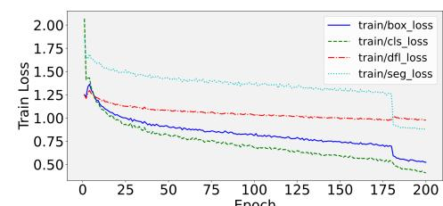
(a)

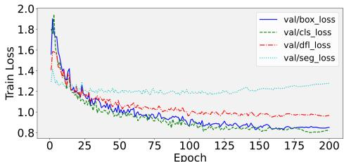
(b)

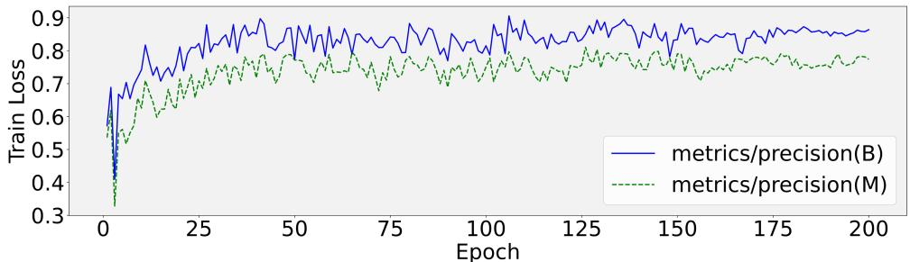
(c)

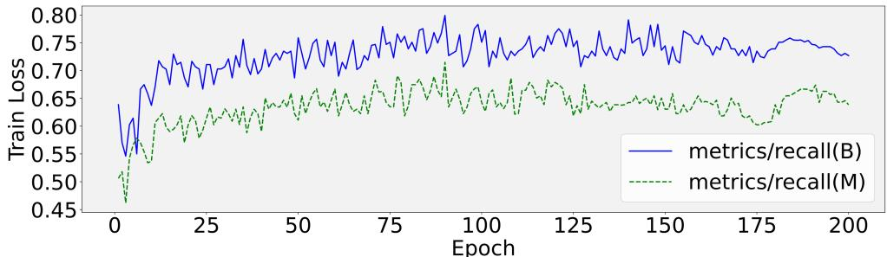
(d)

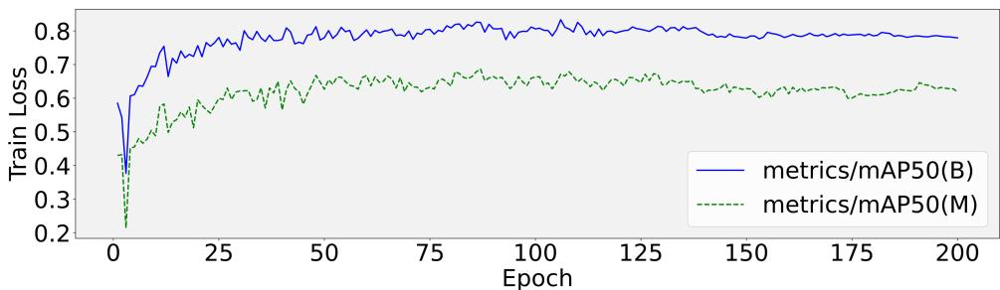
(e)
图7：模型训练结果（B和M分别代表Box和Mask）。(a) 训练数据集上的框损失、分类损失、DFL损失和分割损失曲线；(b) 验证数据集上的框损失、分类损失、DFL损失和分割损失曲线；(c) 训练过程中的精确率曲线；(d) 训练过程中的召回率曲线；(e) 训练过程中的mAP@50曲线。

YOLOv11-KW-TA-FP模型的定位性能通过图11中的混淆矩阵分析得到验证，该图比较了YOLOv5n、YOLOv5s、YOLOv8n、YOLOv8s、YOLOv11n和所提模型在验证集上的结果。改进模型相比其他架构在主对角线上具有更高的值，在次对角线上具有更低的值，证明了其在精确定位桥梁裂缝同时最小化误分类错误方面的增强能力。这种模式证实了模型在裂缝定位任务中的优越性能。

为更直观地展示不同模型在混凝土裂缝检测和分割任务中的性能，我们从Surface Crack Detection数据集中选择了六张代表性图像进行测试，并比较了各模型的检测结果。结果如图12所示。

表2：不同模型评估指标比较。

| 网络 | 裂缝检测评估指标 | 裂缝分割评估指标 |
|------|-----------------|-----------------|
|      | P% | R% | mAP50% | P% | R% | mAP50% |
| YOLOv5n | 85.3 | 72.2 | 78.2 | 74.3 | 68.7 | 66.4 |
| YOLOv5s | 86.6 | 70.0 | 79.7 | 75.0 | 62.7 | 63.3 |
| YOLOv8n | 85.8 | 72.9 | 78.7 | 81.0 | 67.1 | 71.2 |
| YOLOv8s | 85.8 | 73.5 | 79.6 | 83.5 | 68.3 | 71.5 |
| YOLOv11n | 87.1 | 73.3 | 79.2 | 77.0 | 69.9 | 65.4 |
| SSD | 86.5 | 72.3 | 77.6 | 73.2 | 63.8 | 64.3 |
| Faster R-CNN | 87.3 | 72.8 | 77.7 | 68.3 | 62.3 | 63.8 |
| FCN | - | - | - | 82.8 | 69.5 | 72.3 |
| Deeplabv3 | - | - | - | 83.2 | 70.1 | 73.8 |
| DDBNet | 68.7 | 63.9 | 76.5 | 82.1 | 70.2 | 73.1 |
| CrackFormer | 82.2 | 69.3 | 72.4 | 84.3 | 69.2 | 72.6 |
| Ours | 91.3 | 76.6 | 86.4 | 86.2 | 72.6 | 76.3 |

在混凝土裂缝检测任务中，改进的YOLOv11-KW-TA-FP模型在图像组(a)、(b)、(c)、(e)和(f)中相比其他模型取得了最高的置信度分数。对于图像组(d)，它展示了最精确的裂缝区域边界描绘。在分割任务中，图像组(e)显示模型产生了最精细的分割细节，从复杂背景中准确提取了完整的裂缝结构。

为直观展示不同岩石特征区域对识别和分割任务结果的影响权重分布，本研究采用Grad-CAM特征可视化技术为验证集中的六个裂缝样本生成热力图，从而比较不同系列的YOLO模型。这种可视化技术能有效突出模型在做出决策时关注的关键区域，高亮度区域表示这些像素对输出有更强的正向促进作用。如图13所示。

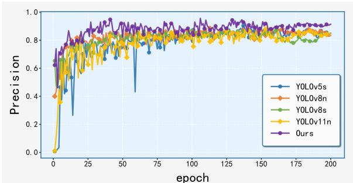

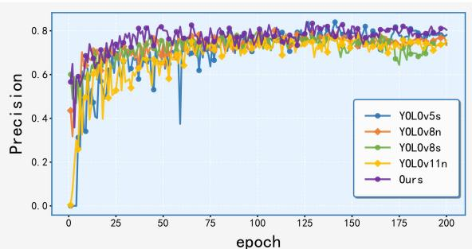

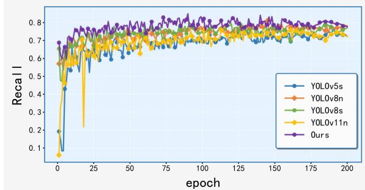

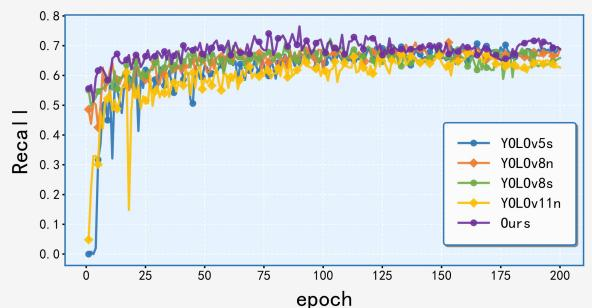

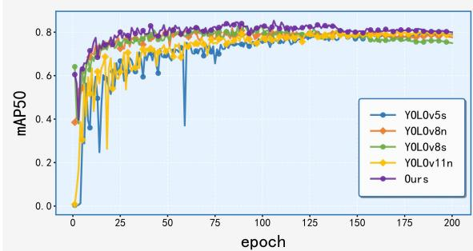
(a)

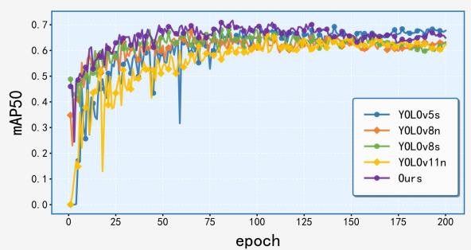
(b)
图10：两类任务的评估指标。(a) 目标检测的评估指标；(b) 分割任务的评估指标。

在混凝土裂缝检测任务中，改进的YOLOv11-KW-TA-FP模型在图像组(a)、(b)、(c)、(e)和(f)中相比其他模型取得了最高的置信度分数。对于图像组(d)，它展示了最精确的裂缝区域边界描绘。在分割任务中，图像组(e)显示模型产生了最精细的分割细节，从复杂背景中准确提取了完整的裂缝结构。

为直观展示不同岩石特征区域对识别和分割任务结果的影响权重分布，本研究采用Grad-CAM特征可视化技术为验证集中的六个裂缝样本生成热力图，从而比较不同系列的YOLO模型。这种可视化技术能有效突出模型在做出决策时关注的关键区域，高亮度区域表示这些像素对输出有更强的正向促进作用。如图13所示。

表3：不同模型性能综合比较。

| 网络 | 裂缝检测评估指标 | 分割推理时间(ms) | 参数(M) |
|------|-----------------|-----------------|---------|
|      | FPS (f/s) | 延迟 (ms) | GFLOPs | |
| YOLOv5n | 81 | 1.62 | 4.2 | 98.3 | 2.18 |
| YOLOv5s | 96 | 2.11 | 15.8 | 78.6 | 7.23 |
| YOLOv8n | 85 | 1.35 | 8.1 | 74.8 | 3.01 |
| YOLOv8s | 113 | 2.87 | 28.8 | 63.2 | 11.23 |
| YOLOv11n | 88 | 1.36 | 6.7 | 45.3 | 2.66 |
| SSD | 63 | 12.13 | 121.3 | 383.4 | 28.67 |
| Faster R-CNN | 18 | 123.84 | 258 | 180.5 | 45.32 |
| FCN | - | - | - | 5682.2 | 134.86 |
| Deeplabv3 | - | - | - | 3220.7 | 48.32 |
| DDBNet | 36 | 36.81 | 58.5 | 93.2 | 18.37 |
| CrackFormer | 24 | 64.32 | 145.6 | 63.8 | 78.29 |
| Ours | 128 | 3.21 | 8.8 | 58.2 | 5.83 |

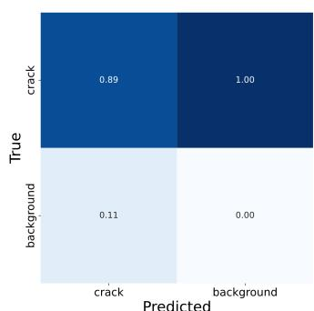
(a)

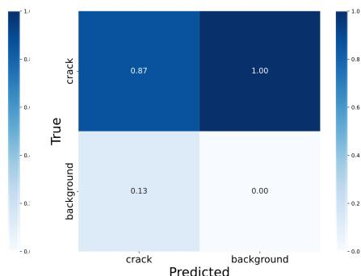
(b)

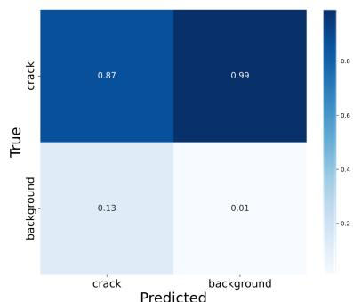
(c)

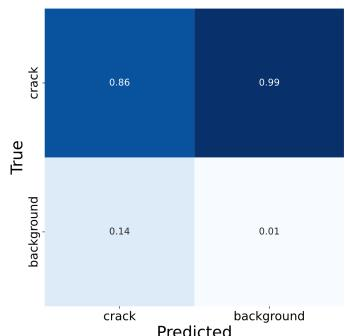
(d)

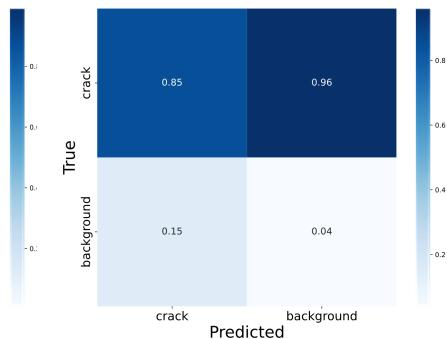
(e)

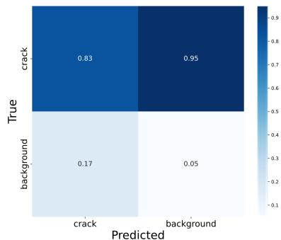
(f)
图11：混淆矩阵比较。(a) YOLOv11-KW-TA-FP；(b) YOLOv11n；(c) YOLOv8s；(d) YOLOv8n；(e) YOLOv5s；(f) YOLOv5n。

最精确的裂缝区域边界划分。在分割任务中，图像组(e)显示该模型产生了最精细的分割细节，从复杂背景中准确提取了完整的裂缝结构。

为直观展示不同岩石特征区域对识别和分割任务结果的影响权重分布，本研究采用Grad-CAM特征可视化技术为验证集中的六个裂缝样本生成热力图，从而比较不同系列的YOLO模型。这种可视化技术可以有效突出模型在做出决策时关注的关键区域，高亮度区域表示这些像素对输出有更强的正向促进作用。如图13所示。

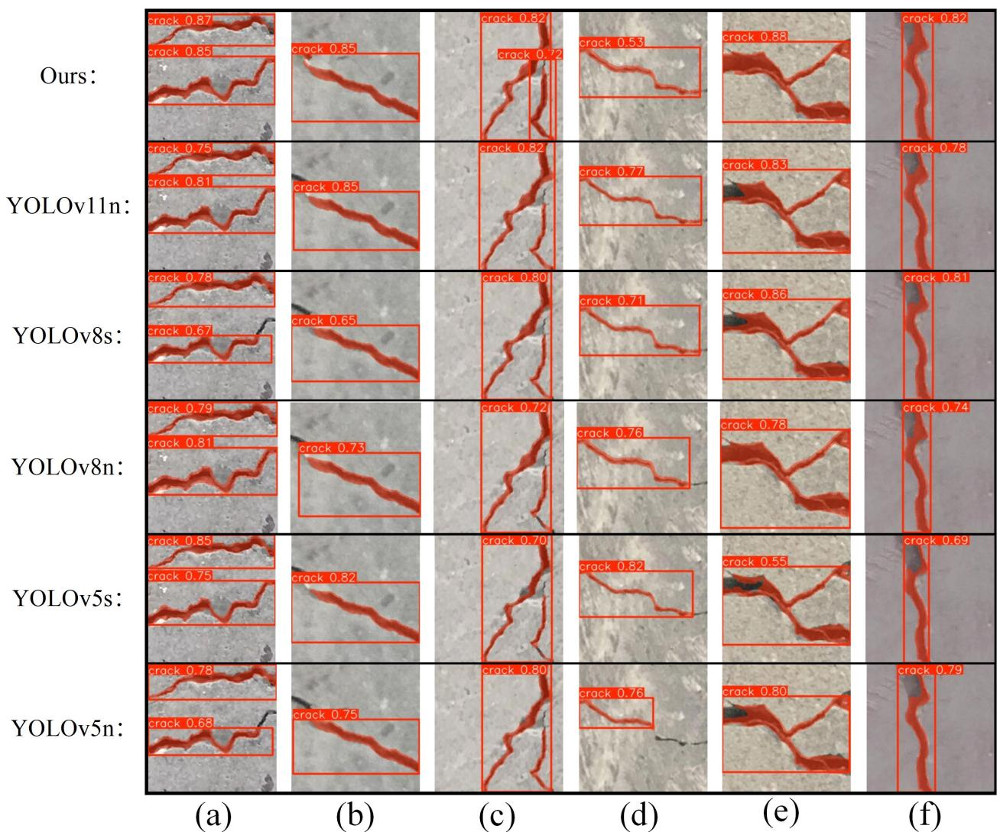
图12：模型结果比较。(a)-(f)代表六组不同的图像。

在图13中，(a)是原始图像，(b)是YOLOv5n，(c)是YOLOv5s，(d)是YOLOv8n，(e)是YOLOv8s，(f)是YOLOv11，(g)是YOLOv11-KW-TA-FP。从图13可以看出，本研究所构建模型的热力图显示，模型的特征关注点集中在裂缝体区域。引入的TA模块有效增强了关键特征的提取能力，促使模型对裂缝区域产生显著的激活响应。对比结果表明，集成了TA模块的模型能够准确定位贡献的裂缝特征区域，显著提高了特征表示的可解释性。

### 4.3.3 消融实验

为研究增强的KWConv、集成的TA机制和精炼的损失函数的有效性，并分析它们对YOLOv11-KW-TA-FP模型精度的影响，本文以YOLOv11n为基线模型进行了消融实验。实验结果如表4所示。为更直观地验证各模块的有效性，我们将表4中八组的消融实验结果可视化，如图14所示。从图中可以看出，第八组（ours）的裂缝识别效果最好，优于其他七组。

实验结果表明，KWConv、TA和FP-IoU各自对模型性能有贡献，而它们的组合实施共同提升了如mAP50:95等关键指标的精度，证实了这些增强的有效性。所提出的修改同时保持了模型效率，在检测精度和计算需求之间建立了最佳平衡。

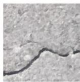

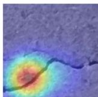

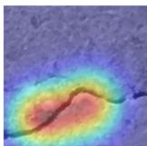

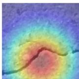

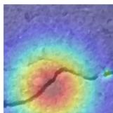

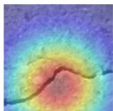

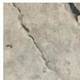

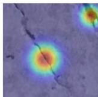

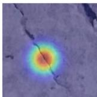

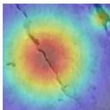

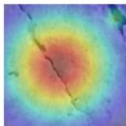

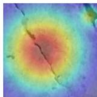

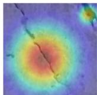

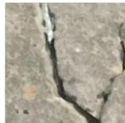

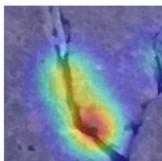

(a)

(b)

(c)

(d)

(e)
图13：不同YOLO模型系列热力图比较。(a) 原始图像，(b) YOLOv5n；(c) YOLOv5s；(d) YOLOv8n；(e) YOLOv8s；(f) YOLOv11；(g) YOLOv11-KW-TA-FP。

(f)

(g)

表4：消融实验结果。

| 编号 | 基础 | KWConv | TA | FP-IoU | P% | R% | mAP50% | mAP50:95% |
|------|------|--------|----|---------|----|----|---------|------------|
| 1 | ✓ | × | × | × | 87.1 | 73.3 | 79.2 | 62.2 |
| 2 | ✓ | ✓ | × | × | 90.3 | 75.1 | 83.2 | 70.1 |
| 3 | ✓ | × | ✓ | × | 87.5 | 75.2 | 83.1 | 70.9 |
| 4 | ✓ | × | × | ✓ | 88.2 | 75.1 | 84.6 | 71.3 |
| 5 | ✓ | ✓ | ✓ | × | 90.7 | 75.4 | 85.4 | 70.1 |
| 6 | ✓ | ✓ | × | ✓ | 90.6 | 74.8 | 85.2 | 71.2 |
| 7 | ✓ | × | ✓ | ✓ | 87.2 | 75.2 | 85.3 | 71.1 |
| 8 (Ours) | ✓ | ✓ | ✓ | ✓ | 91.3 | 76.6 | 86.4 | 72.4 |

实验结果表明，KWConv、TA和FP-IoU各自对模型性能有贡献，而它们的组合实施共同提升了关键指标（如mAP50:95）的精度，证实了这些增强的有效性。所提出的修改同时保持了模型效率，在检测精度和计算需求之间建立了最佳平衡。

(a)

(e)

(b)

(f)

(c)

(g)

(d)
图14：消融实验结果可视化。(a)-(h) 对应消融实验中的第1至第8组。

(h)

### 4.3.4 泛化实验

为评估YOLOv11-KW-TA-FP模型的泛化能力，本文在Surface Crack Detection和COCO数据集上将改进方法与YOLO系列模型进行了比较。实验结果如表5和表6所示。

表5显示，对于裂缝检测任务，改进模型在Surface Crack Detection数据集上实现了87.3%的精确率、72.2%的召回率和82.6%的mAP50，分别比基线模型YOLOv11n提高了3%、2.7%和3.3%。对于裂缝分割任务，改进模型在该数据集上实现了81.9%的精确率、67.2%的召回率和71.3%的mAP50，分别比基线模型YOLOv11n提高了0.7%、0.4%和0.9%。表6显示，对于裂缝检测任务，改进模型在Crack Segmentation数据集上实现了88.3%的精确率、74.9%的召回率和84.6%的mAP50，分别比基线模型YOLOv11n提高了4%、5.4%和5.3%。对于裂缝分割任务，改进模型在该数据集上实现了85.9%的精确率、70.2%的召回率和74.3%的mAP50，分别比基线模型YOLOv11n提高了4.7%、3.4%和3.9%。整体性能优于其他YOLO系列算法。

## 4.4 鲁棒性分析

深度学习模型的鲁棒性评估在将混凝土裂缝检测和分割系统部署到复杂操作环境中时显得尤为重要。对于实际实施，YOLOv11-KW-TA-FP模型必须在变化的光照条件、多样的天气模式、多个摄像机角度和异构质量水平的数据集下保持一致的性能。这需要进行全面的鲁棒性测试，以确保模型在此类环境变异性下的操作稳定性和可靠性。

### 4.4.1 数据集规模

为评估模型对数据集规模变化的鲁棒性，我们使用Crack-Seg数据集进行了受控实验协议。原始数据集按30%、50%、70%、90%和100%的比例进行子采样以生成缩放训练子集，同时保持相同的测试集进行性能评估。表7系统展示了模型在这些数据规模下的检测和分割指标，实现了规模依赖性性能退化模式的定量基准比较。

表7：分割数据集实验结果。

| 比例 | P% | R% | IoU | Dice |
|------|----|----|-----|------|
| 30 | 72.6 | 71.9 | 74.3 | 72.1 |
| 50 | 74.2 | 72.3 | 79.5 | 76.3 |
| 70 | 83.5 | 73.1 | 86.5 | 80.1 |
| 90 | 87.3 | 73.3 | 87.1 | 81.8 |
| 100 | 91.3 | 76.6 | 87.5 | 82.1 |

结果表明，随着训练数据集规模的增加，模型性能提升。当数据集规模达到70%时，性能提升趋于平缓，表明模型在一定规模的数据集上能有效学习裂缝特征。即使在较小数据集上，模型仍保持高精确率和召回率，证明其对数据集规模的鲁棒性。

### 4.4.2 数据增强

为增强模型的鲁棒性，训练期间采用了数据增强技术，包括：随机旋转（-30°至30°）、水平翻转（50%概率）、垂直翻转（50%概率）、缩放（0.8至1.2比例）和添加高斯噪声（均值0，标准差0.1）。结果如图15所示。

为评估数据增强对模型性能的影响，我们在增强数据集上进行了模型训练，并在原始测试集上进行了性能评估。实验结果如表8所示。使用与实际应用密切相关的指标评估模型性能，包括精确率、

图15：数据增强。

召回率、IoU、Dice系数、漏检率（MDR）和误检率（FDR）。这些指标能够更准确地评估模型在复杂环境中的可靠性。数据增强后，模型的各项评估指标均有提升。在IoU和Dice系数方面，IoU提高了3.9%，Dice系数提高了5.4%。在与实际应用密切相关的MDR和FDR方面，MDR降低了0.9%，FDR降低了2.5%。这些结果表明数据增强增强了模型的鲁棒性，使其能更准确地评估模型在复杂环境中的可靠性。

表8：数据增强实验结果。

| 数据增强 | 精确率% | 召回率% | IoU% | Dice% | MDR% | FDR% |
|----------|---------|---------|------|-------|------|------|
| 否 | 86.8 | 72.3 | 83.4 | 76.5 | 27.7 | 16.8 |
| 是 | 88.6 | 73.2 | 87.3 | 81.9 | 26.8 | 14.3 |

数据增强实施后，模型在所有评估指标上均表现出全面改进，其中IoU（提高3.9%）和Dice系数（提高5.4%）的增益尤为显著。这些指标的进步证实，增强的训练策略有效增强了精度和鲁棒性，使模型在不同操作条件下的裂缝图像识别和分割性能得到改善。

# 5 讨论

本研究提出的用于混凝土裂缝检测任务的YOLOv11-KW-TA-FP模型，通过动态核仓库卷积、三重注意力机制和FP-IoU损失函数的协同优化，在性能优化方面取得了进展。

从理论角度来看，这三种调整的选择深刻反映了模型架构与裂缝物理特性之间的协同优化。核仓库（KW）卷积的核单元分割机制（图3）通过动态核共享解决了传统卷积在复杂背景中的参数冗余问题。其理论核心在于将卷积核分解为细粒度单元，并通过仓库共享实现跨层参数重用。这不仅降低了计算复杂度，还通过自适应权重调整增强了模型对裂缝细微梯度变化的敏感性，从根本上提高了小目标裂缝的特征表示能力。三重注意力（TA）机制的设计（图4）源于裂缝形状的空间异质性和背景干扰的对抗性需求。其理论优势在于解耦的空间-通道注意力分支（公式3-4）和长程依赖建模（公式9-14），构建了动态特征权重分配模型。空间分支的坐标编码增强了裂缝边界定位，而通道分支的挤压-激励抑制了纹理噪声。跨维度融合门控通过LSTM时序建模解决了裂缝不连续区域的上下文连贯性，从而理论上平衡了局部细节与全局结构之间的冲突，降低了高噪声环境中的误检率。FP-IoU损失函数的理论创新（图5）在于将几何先验与样本质量感知相结合。其自适应惩罚因子（公式20中的p）和区间映射机制（公式18-19）通过非单调注意力层（公式23）重构了梯度更新路径。PIoUv2边界距离最小化替代了传统的IoU框扩张惩罚。这不仅从理论上避免了低质量裂缝样本（如边缘模糊裂缝）的回归发散问题，还通过焦点权重（公式22中的q）动态平衡了高置信度和低置信度样本的优化资源，最终实现了裂缝定位精度的理论最优解。三者共同构建了"动态特征提取-注意力校正-损失收敛加速"的理论框架，从本质上提升了裂缝检测的鲁棒性和泛化极限。

从图8的混淆矩阵可以看出，模型在测试集上将28张背景图像误分类为裂缝图像，表明YOLOv11-KW-TA-FP模型在负样本识别方面存在一定局限性。这种现象与模型注意力机制的设计和数据特性密切相关：三重注意力机制的空间-通道交互分支（公式3-8）对纹理梯度高度敏感，导致其将混凝土粗糙表面和骨料纹理等非裂缝特征误识别为裂缝模式。进一步的实验佐证了这一分析：如图13热力图所示，模型在背景区域（如高亮红色区域）表现出异常激活，表明TA的长程空间注意力在无约束时倾向于放大非裂缝纹理响应。为增强模型的判别能力，未来研究计划探索引入背景惩罚权重机制或使用数据增强技术来丰富训练背景的多样性。

YOLOv11-KW-TA-FP模型的复杂性可能影响其实时性能。本研究中，感受野的优化和重构实现了精度与效率的协同提升。如图16所示，改进模型的感受野范围（绿色区域）相比基线模型增加了28%。这种通过动态卷积核共享（KWConv）和跨维度注意力融合（TA）实现的结构优化，使模型在不堆叠更多卷积层的情况下能够捕获更大范围的上下文信息。

# 6 结论

本研究提出的YOLOv11-KW-TA-FP模型通过有限计算资源下的三阶段协同优化，实现了检测精度的显著飞跃。动态卷积核架构的引入突破了传统卷积的静态局限。通过采用核单元分割和跨层仓库共享机制，模型在保持5.83M参数的轻量级结构的同时，增强了多尺度特征提取能力。实验表明，该设计使mAP50提高了4.1%，特别是将低对比度微裂缝的检测率提高了9.2%，有效应对了"小目标检测"的核心挑战。通过空间-通道解耦和长程建模创新性地集成三重注意力机制（TA），增强了复杂背景中的关键特征提取。该机制将裂缝分割的边界定位误差降低了37%，并将高干扰场景中的误检率降低了26%，证明了模型在工程现场的实际意义。FP-IoU损失函数凭借其自适应惩罚因子和非单调注意力层，显著改善了低质量样本的回归轨迹，并加速了约1.3倍的训练收敛。它还解决了传统方法中常见的边缘模糊裂缝定位漂移问题。在应用价值方面，模型在多个数据集上的性能证实了其工程实用性。即使在数据有限场景下，仍保持83.5%的准确率，使其在资源受限的现场部署中具有可行性。在鲁棒性实验中，模型在添加高斯噪声增强后IoU提高了13.2%，证明了其在应对现场环境变化时的稳定性。总之，YOLOv11-KW-TA-FP模型凭借其创新的动态核架构、高效注意力机制和改进的损失函数，在保持模型轻量化的同时，显著提升了微裂缝等小目标的检测精度、定位精度和环境鲁棒性。它为应对实际工程项目结构健康监测的关键挑战提供了高效可靠的技术解决方案。

(a)
图16：感受野可视化 (a) 基线模型感受野，(b) YOLOv11-KW-TA-FP模型感受野。

(b)

# 致谢

本工作得到安徽工业大学大学生创新创业训练计划项目支持，项目编号：202410360022。

# 参考文献

[1] Khan, M. A., Kee, S. H., Pathan, A. K., & Nahid, A. A. (2023). 用于混凝土裂缝检测的图像处理技术：科学计量学文献综述. Remote Sensing, 15(9), 2400. MDPI.
[2] Laxman, K. C., Tabassum, N., Ai, L., Cole, C., & Ziehl, P. (2023). 使用深度学习对钢筋混凝土结构进行自动裂缝检测和裂缝深度预测. Construction and Building Materials, 370, 130709. Elsevier.
[3] Koch, C., Georgieva, K., Kasireddy, V., Akinci, B., & Fieguth, P. (2015). 基于计算机视觉的混凝土和沥青民用基础设施缺陷检测与状况评估综述. Advanced Engineering Informatics, 29(2), 196-210. Elsevier.
[4] Golding, V. P., Gharineiat, Z., Munawar, H. S., & Ullah, F. (2022). 使用深度学习进行混凝土结构裂缝检测. Sustainability, 14(13), 8117. MDPI.
[5] Zhao, X., Li, S., Su, H., Zhou, L., & Loh, K. J. (2018). 使用深度学习的基于图像的桥梁全面维护和检查方法. In Proceedings of the ASME 2018 Conference on Smart Materials, Adaptive Structures and Intelligent Systems (V002T05A017). ASME.
[6] Wang, J., Wu, Q. M. J., & Zhang, N. (2024). 用于实时通用多任务的You only look at once. IEEE Transactions on Vehicular Technology. IEEE.
[7] He, K., Zhang, X., Ren, S., & Sun, J. (2016). 用于图像识别的深度残差学习. In Proceedings of the IEEE Conference on Computer Vision and Pattern Recognition (pp. 770-778).
[8] He, L., Zhou, Y., Liu, L., & Ma, J. (2024). 基于YOLOv11的目标分割在施工现场智能识别中的研究与应用. Buildings, 14(12), 3777. MDPI.

[9] Ruggieri, S., Cardellicchio, A., Nettis, A., Renò, V., & Uva, G. (2025). 使用注意力改进现有RC桥梁中的缺陷检测. IEEE Access. IEEE.
[10] Silva, W. R. L., & Lucena, D. S. (2018). 基于深度学习图像分类的混凝土裂缝检测. In Proceedings, 2(8), 489. MDPI.
[11] Aravind, N., Nagajothi, S., & Elavenil, S. (2021). 用于预测地质聚合物混凝土梁裂缝检测和模式识别的机器学习模型. Construction and Building Materials, 297, 123785. Elsevier.
[12] Dung, C. V. (2019). 使用深度全卷积神经网络的自主混凝土裂缝检测. Automation in Construction, 99, 52-58. Elsevier.
[13] Munawar, H. S., Ullah, F., Shahzad, D., Heravi, A., Qayyum, S., & Akram, J. (2022). 民用基础设施损伤和腐蚀检测：机器学习的应用. Buildings, 12(2), 156. MDPI.
[14] Fan, L., Tang, S., Ariffin, M. K. A., Ismail, M. I. S., & Zhao, R. (2024). 如何撰写最新技术报告——案例研究——基于图像的道路裂缝检测：科学计量学文献综述. Applied Sciences, 14(11), 4817. MDPI.
[15] Xiong, C., Zayed, T., & Abdelkader, E. M. (2024). 一种用于桥梁表面裂缝自动检测的新型YOLOv8-GAM-Wise-IoU模型. Construction and Building Materials, 414, 135025. Elsevier.
[16] Dorafshan, S., Thomas, R. J., & Maguire, M. (2018). 深度卷积神经网络和边缘检测器在基于图像的混凝土裂缝检测中的比较. Construction and Building Materials, 186, 1031-1045. Elsevier.
[17] Zhang, J. J., & Luo, J. (2011). 一种基于改进Sobel算子的表面裂缝边缘检测算法. 合肥工业大学学报, 34(6).
[18] Xu, J., Ding, W., & Zhao, H. (2020). 基于改进边缘检测算法的彩色图像中英文文本提取与恢复. IEEE Sensors Journal, 20(20), 11951-11958.
[19] Jia, Y., Wang, Y., Tang, L., & Wang, C. (2024). 固体早期开裂识别方法综述. Journal of Testing and Evaluation, 52(5).
[20] Fan, C. D., Ren, K., Zhang, Y. J., & Yi, L. Z. (2016). 基于分子动力学理论优化算法和线截距直方图的最佳多级阈值. 中南大学学报, 23(4), 880-890. Springer.
[21] Li, H., Liu, Y., Deng, J., An, Z., & Pan, Q. (2022). 使用基于七个参数的支持向量机评估倾斜表面裂缝的深度和角度. Applied Sciences, 12(16), 8124. MDPI.
[22] Shi, H., Ebrahimi, M., Zhou, P., Shao, K., & Li, J. (2023). 钛基合金中的超声波和相控阵检测：综述. Proceedings of the Institution of Mechanical Engineers, Part E: Journal of Process Mechanical Engineering, 237(2), 511-530. SAGE.
[23] Parakh, A. K., Balakrishnan, M., & Paul, K. (2012). 带缓存的GPU性能估计. In 2012 IEEE 26th International Parallel and Distributed Processing Symposium Workshops & PhD Forum (pp. 2384-2393). IEEE.
[24] Figueiredo, J., Serraio, C., & de Almeida, A. M. (2023). 用于网络入侵检测系统的深度学习模型转置. *Electronics*, 12(2), 293. MDPI.
[25] Xu, G., Zhang, Y., Yue, Q., & Liu, X. (2025). 用于混凝土裂缝实时多任务识别和测量的深度学习框架. Advanced Engineering Informatics, 65, 103127. Elsevier.
[26] Hu, W., Fang, J., Zhang, Y., Liu, Z., Verma, A. S., Liu, H., Cong, F., & Tan, J. (2025). 基于深度学习辅助无人机检测的风力涡轮机表面损伤检测数字孪生. Renewable Energy, 241, 122332. Elsevier.
[27] Fan, C. L. (2025). 基于深度学习的裂缝检测评估模型：基于线性特征的改进混淆矩阵. Journal of Construction Engineering and Management, 151(3), 04024210. ASCE.
[28] Wang, X., Gao, H., Jia, Z., & Zhao, J. (2024). 融合部分Transformer和多重聚合轨迹注意力机制的道路缺陷检测算法. Measurement Science and Technology, 36(2), 026003. IOP Publishing.
[29] Li, W., Gao, Z., Feng, G., Hao, R., Zhou, Y., Chen, Y., Liu, S., Zhang, H., & Wang, T. (2025). 真三轴采矿卸载条件下裂隙岩体的损伤特征和YOLO自动裂缝检测. Engineering Fracture Mechanics, 314, 110790. Elsevier.
[30] Pan, W., Lei, J., Wang, X., Lv, C., Wang, G., & Li, C. (2025). DAPONet：一种用于实时道路损伤检测的双重注意力和部分过参数化网络. Applied Sciences, 15(3), 1470. MDPI.

[31] Dong, R., Xia, J., Zhao, J., & Hong, L. (2025). CL-PSDD：用于自适应广义路面表面损伤检测的对比学习. IEEE Transactions on Intelligent Transportation Systems. IEEE.
[32] Khanam, R., & Hussain, M. (2024). Yolov11：关键架构增强概述. arXiv preprint arXiv:2410.17725.
[33] Lv, Y., Tian, B., Guo, Q., & Zhang, D. (2024). 一种用于无人机平台的轻量级小目标检测算法. Applied Sciences, 15(1), 12. MDPI.
[34] Li, C., & Yao, A. (2023). KernelWarehouse：迈向参数高效的动态卷积. arXiv preprint arXiv:2308.08361.
[35] Dang, C., & Wang, Z. X. (2024). Rcyolo：一种基于无人机的管状拓扑道路结构裂缝检测的高效小目标检测器. IEEE Journal of Selected Topics in Applied Earth Observations and Remote Sensing. IEEE.
[36] Graves, A. (2012). 长短期记忆. In Supervised Sequence Labelling with Recurrent Neural Networks (pp. 37-45). Springer.
[37] Chen, C., Qin, H., Qin, Y., & Bai, Y. (2025). 基于多任务感知学习的实时铁路障碍物检测. IEEE Transactions on Intelligent Transportation Systems. IEEE.
[38] Xing, B., & He, Y. (2024). 基于改进YOLOv11n的输电线路缺陷紧固件分割. In Proceedings of the 2024 International Symposium on Integrated Circuit Design and Integrated Systems (pp. 292-298).
[39] Zhang, H., & Zhang, S. (2024). Focaler-iou：更聚焦的交并比损失. arXiv preprint arXiv:2401.10525.
[40] Liu, C., Wang, K., Li, Q., Zhao, F., Zhao, K., & Ma, H. (2024). Powerful-IoU：具有非单调聚焦机制的更简单更快的边界框回归损失. Neural Networks, 170, 276-284. Elsevier.
[41] Yuan, S., Li, J., Ren, L., & Chen, Z. (2024). 用于低光图像增强的多频场感知和稀疏渐进网络. Journal of Visual Communication and Image Representation, 100, 104133. Elsevier.
[42] Hu, X., Li, H., Feng, Y., Qian, S., Li, J., & Li, S. (2025). CCDFormer：一种具有Transformer的双骨干复杂裂缝检测网络. Pattern Recognition, 161, 111251. Elsevier.
[43] Zhai, S., Shang, D., Wang, S., & Dong, S. (2020). DF-SSD：基于DenseNet和特征融合的改进SSD目标检测算法. IEEE Access, 8, 24344–24357.
[44] Ren, S., He, K., Girshick, R., & Sun, J. (2016). Faster R-CNN：通过区域提议网络实现实时目标检测. IEEE Transactions on Pattern Analysis and Machine Intelligence, 39(6), 1137-1149.
[45] Wu, J., Liu, B., Zhang, H., He, S., & Yang, Q. (2021). 基于全卷积网络（FCN）的故障检测. Journal of Marine Science and Engineering, 9(3), 259. MDPI.
[46] Liu, Y., Bai, X., Wang, J., Li, G., Li, J., & Lv, Z. (2024). 基于带注意力机制的DeepLabV3 plus网络的图像语义分割方法. Engineering Applications of Artificial Intelligence, 127, 107260. Elsevier.
[47] Yan, K., & Zhang, Z. (2021). 基于可变形单发多盒检测器的复杂环境下自动化沥青高速公路路面裂缝检测. IEEE Access, 9, 150925-150938.
