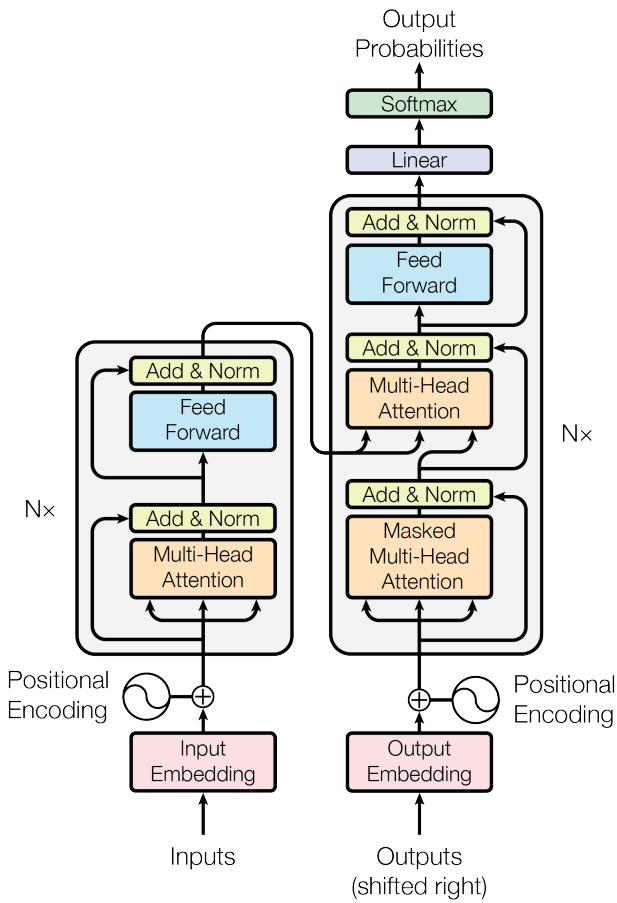
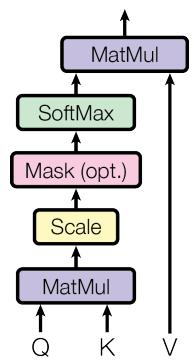
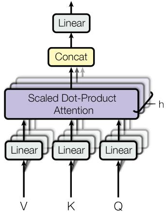
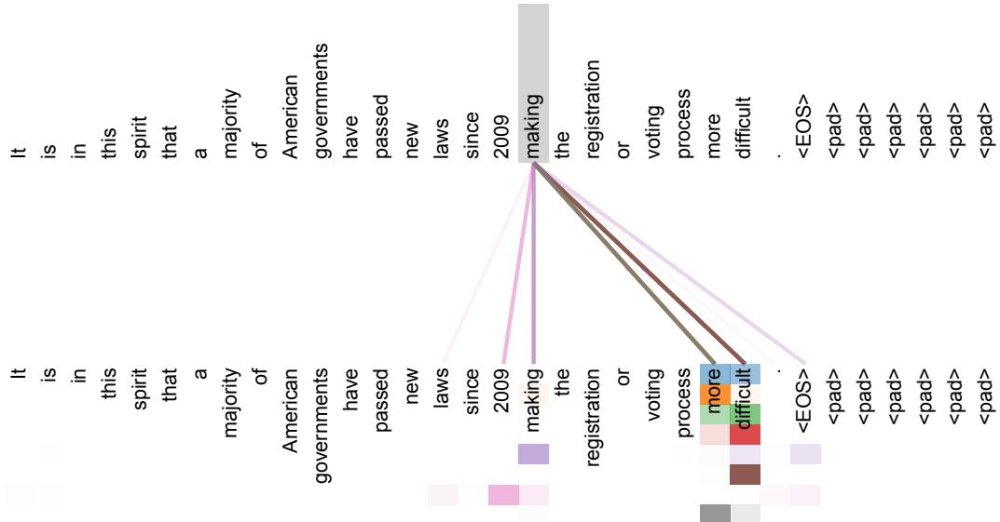
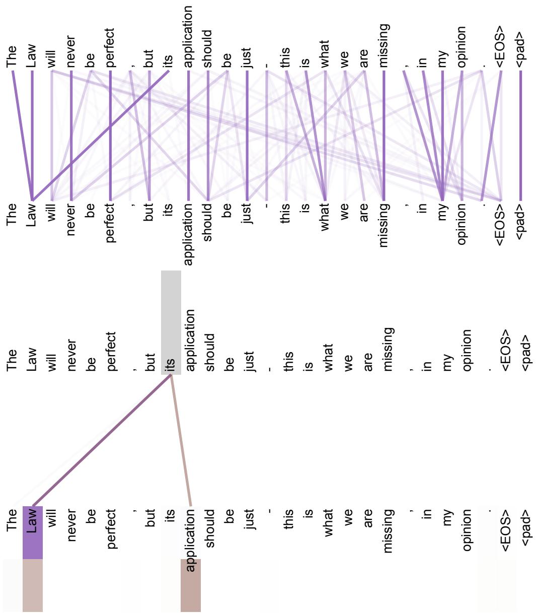
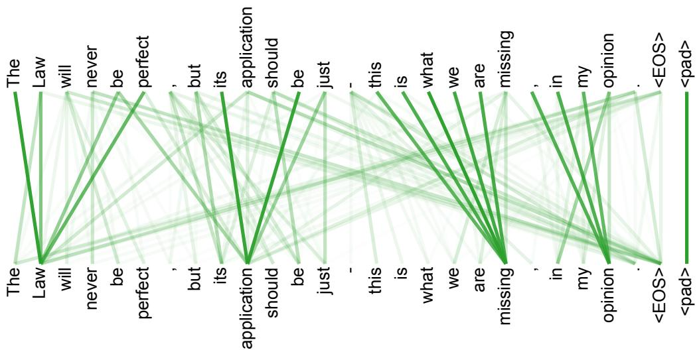
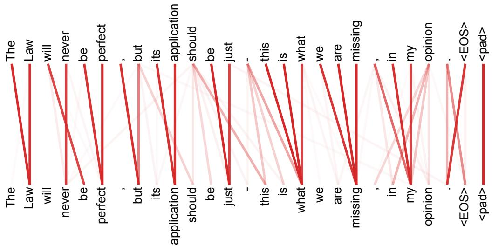

# Attention Is All You Need

Ashish Vaswani*

Google Brain

avaswani@google.com

Noam Shazeer*

Google Brain noam@google.com

Niki Parmar*

Google Research nikip@google.com

Jakob Uszkoreit*

Google Research usz@google.com

Llion Jones*

Google Research

llion@google.com

Aidan N. Gomez*†

University of Toronto. dan@cs.toronto.edu

Lukasz Kaiser*

Google Brain

lukaszkaiser@google.com

Illia Polosukhin* †

illia.polosukhin@gmail.com

# 摘要

主流的序列转导模型基于复杂的循环神经网络或卷积神经网络，这些网络包含编码器和解码器。性能最佳的模型还通过注意力机制连接编码器和解码器。我们提出一种新的简单网络架构——Transformer，它完全基于注意力机制，完全摒弃了循环和卷积。在两个机器翻译任务上的实验表明，这些模型在质量上更优，同时具有更高的并行性，并且训练时间显著减少。我们的模型在WMT 2014英德翻译任务上达到28.4 BLEU，比现有最佳结果（包括集成模型）提高了2 BLEU以上。在WMT 2014英法翻译任务上，我们的模型在8个GPU上训练3.5天后，建立了新的单模型最先进的BLEU分数41.8，仅为文献中最佳模型训练成本的一小部分。我们展示了Transformer能够很好地推广到其他任务，通过将其成功应用于英语成分句法分析，无论训练数据量大还是有限。

# 1 引言

循环神经网络，特别是长短期记忆网络[13]和门控循环神经网络[7]，已经在序列建模和转导问题（如语言建模和机器翻译[35, 2, 5]）中被牢固确立为最先进的方法。此后，众多努力继续推动循环语言模型和编码器-解码器架构的边界[38, 24, 15]。

循环模型通常沿着输入和输出序列的符号位置分解计算。将位置与计算时间步对齐，它们生成一系列隐藏状态 $h_t$，作为前一个隐藏状态 $h_{t-1}$ 和位置 $t$ 的输入的函数。这种固有的顺序性质阻碍了训练示例内的并行化，这在序列长度较长时变得至关重要，因为内存限制限制了示例间的批处理。最近的工作通过因子分解技巧[21]和条件计算[32]显著提高了计算效率，同时在后一种情况下提高了模型性能。然而，顺序计算的基本限制仍然存在。

注意力机制已成为各种任务中引人注目的序列建模和转导模型的重要组成部分，允许在不考虑输入或输出序列中距离的情况下对依赖关系进行建模[2, 19]。然而，除少数情况外[27]，这种注意力机制与循环网络结合使用。

在这项工作中，我们提出了Transformer，一种摒弃循环并完全依赖注意力机制来绘制输入和输出之间全局依赖关系的模型架构。Transformer允许显著更多的并行化，并且在8个P100 GPU上训练仅12小时后，可以在翻译质量上达到新的最先进水平。

# 2 背景

减少顺序计算的目标也构成了扩展神经GPU[16]、ByteNet[18]和ConvS2S[9]的基础，所有这些模型都使用卷积神经网络作为基本构建块，并行计算所有输入和输出位置的隐藏表示。在这些模型中，关联两个任意输入或输出位置的信号所需的操作数量随位置间距离的增长而增长，ConvS2S为线性增长，ByteNet为对数增长。这使得学习远距离位置之间的依赖关系变得更加困难[12]。在Transformer中，这减少到恒定数量的操作，尽管由于平均注意力加权位置而导致有效分辨率降低，我们通过第3.2节中描述的多头注意力来抵消这种影响。

自注意力（有时称为内部注意力）是一种关联单个序列中不同位置的注意力机制，以计算序列的表示。自注意力已成功应用于各种任务，包括阅读理解、抽象摘要、文本蕴含和学习与任务无关的句子表示[4, 27, 28, 22]。

端到端记忆网络基于循环注意力机制而非序列对齐的循环，已在简单语言问答和语言建模任务上表现良好[34]。

然而，据我们所知，Transformer是第一个完全依赖自注意力来计算其输入和输出表示，而不使用序列对齐的RNN或卷积的转导模型。在接下来的章节中，我们将描述Transformer，解释自注意力的动机，并讨论其相对于[17, 18]和[9]等模型的优势。

# 3 模型架构

大多数竞争性神经序列转导模型具有编码器-解码器结构[5, 2, 35]。这里，编码器将符号表示序列 $(x_{1},\dots,x_{n})$ 映射到连续表示序列 $\mathbf{z} = (z_1,\dots,z_n)$。给定 $\mathbf{z}$，解码器然后逐个元素地生成符号的输出序列 $(y_{1},\dots,y_{m})$。在每个步骤中，模型是自回归的[10]，在生成下一个符号时消耗先前生成的符号作为额外输入。

  
图1：Transformer - 模型架构。

Transformer遵循这种整体架构，对编码器和解码器都使用堆叠的自注意力和点式全连接层，如图1的左右两半部分所示。

# 3.1 编码器和解码器堆栈

编码器：编码器由 $N = 6$ 个相同层堆叠而成。每层有两个子层。第一个是多头自注意力机制，第二个是简单的、位置式的全连接前馈网络。我们在每个子层周围采用残差连接[11]，然后进行层归一化[1]。即，每个子层的输出是LayerNorm $(x + \mathrm{Sublayer}(x))$，其中Sublayer $(x)$ 是子层本身实现的函数。为了方便这些残差连接，模型中的所有子层以及嵌入层都产生维度 $d_{\mathrm{model}} = 512$ 的输出。

解码器：解码器也由 $N = 6$ 个相同层堆叠而成。除了每个编码器层中的两个子层外，解码器还插入第三个子层，该子层对编码器堆栈的输出执行多头注意力。与编码器类似，我们在每个子层周围采用残差连接，然后进行层归一化。我们还修改了解码器堆栈中的自注意力子层，以防止位置关注后续位置。这种掩码结合输出嵌入偏移一个位置的事实，确保位置 $i$ 的预测只能依赖于位置小于 $i$ 的已知输出。

# 3.2 注意力

注意力函数可以描述为将查询和一组键值对映射到输出，其中查询、键、值和输出都是向量。输出计算为值的加权和

  
缩放点积注意力

  
多头注意力  
图2：（左）缩放点积注意力。（右）多头注意力由几个并行运行的注意力层组成。

其中分配给每个值的权重由查询与相应键的兼容性函数计算。

# 3.2.1 缩放点积注意力

我们将我们的特定注意力称为"缩放点积注意力"（图2）。输入由维度为 $d_{k}$ 的查询和键，以及维度为 $d_{v}$ 的值组成。我们计算查询与所有键的点积，每个除以 $\sqrt{d_k}$，然后应用softmax函数以获得值的权重。

在实践中，我们同时计算一组查询的注意力函数，将它们打包成矩阵 $Q$。键和值也打包成矩阵 $K$ 和 $V$。我们计算输出矩阵为：

$$
\operatorname {A t t e n t i o n} (Q, K, V) = \operatorname {s o f t m a x} \left(\frac {Q K ^ {T}}{\sqrt {d _ {k}}}\right) V \tag {1}
$$

两个最常用的注意力函数是加性注意力[2]和点积（乘法）注意力。点积注意力与我们的算法相同，除了缩放因子 $\frac{1}{\sqrt{d_k}}$。加性注意力使用具有单个隐藏层的前馈网络计算兼容性函数。虽然两者在理论复杂度上相似，但点积注意力在实践中更快且更节省空间，因为它可以使用高度优化的矩阵乘法代码实现。

虽然对于较小的 $d_{k}$ 值，两种机制表现相似，但对于较大的 $d_{k}$ 值，不加缩放的加性注意力优于点积注意力[3]。我们怀疑对于较大的 $d_{k}$ 值，点积的幅度变大，将softmax函数推入梯度极小的区域4。为了抵消这种影响，我们将点积缩放 $\frac{1}{\sqrt{d_k}}$。

# 3.2.2 多头注意力

我们不使用 $d_{\mathrm{model}}$ 维度的键、值和查询执行单个注意力函数，而是发现将查询、键和值分别用不同的、学习的线性投影线性投影 $h$ 次到 $d_k$、$d_k$ 和 $d_v$ 维度是有益的。然后，我们在这些投影版本的查询、键和值上并行执行注意力函数，产生 $d_v$ 维度的

输出值。这些值被连接起来并再次投影，产生最终值，如图2所示。

多头注意力允许模型在不同位置联合关注来自不同表示子空间的信息。使用单个注意力头时，平均化会抑制这一点。

$$
\operatorname {M u l t i H e a d} (Q, K, V) = \operatorname {C o n c a t} \left(\operatorname {h e a d} _ {1},..., \operatorname {h e a d} _ {\mathrm {h}}\right) W ^ {O}
$$

$$
w h e r e \quad \text {h e a d} _ {\mathrm {i}} = \text {A t t e n t i o n} \left(Q W _ {i} ^ {Q}, K W _ {i} ^ {K}, V W _ {i} ^ {V}\right)
$$

其中投影是参数矩阵 $W_{i}^{Q}\in \mathbb{R}^{d_{\mathrm{model}}\times d_{k}}$、$W_{i}^{K}\in \mathbb{R}^{d_{\mathrm{model}}\times d_{k}}$、$W_{i}^{V}\in \mathbb{R}^{d_{\mathrm{model}}\times d_{v}}$ 和 $W^{O}\in \mathbb{R}^{hd_{v}\times d_{\mathrm{model}}}$。

在这项工作中，我们采用 $h = 8$ 个并行注意力层或头。对于每个头，我们使用 $d_{k} = d_{v} = d_{\mathrm{model}} / h = 64$。由于每个头的维度减少，总计算成本类似于具有全维度的单头注意力。

# 3.2.3 注意力在我们模型中的应用

Transformer在三种不同方式中使用多头注意力：

- 在"编码器-解码器注意力"层中，查询来自前一个解码器层，记忆键和值来自编码器的输出。这允许解码器中的每个位置关注输入序列中的所有位置。这模仿了序列到序列模型（如[38, 2, 9]）中典型的编码器-解码器注意力机制。  
- 编码器包含自注意力层。在自注意力层中，所有键、值和查询都来自同一个地方，在这种情况下，是编码器中前一层的输出。编码器中的每个位置可以关注编码器前一层的所有位置。  
- 类似地，解码器中的自注意力层允许解码器中的每个位置关注解码器中直到并包括该位置的所有位置。我们需要防止解码器中的向左信息流以保持自回归特性。我们通过在缩放点积注意力内部掩码（设置为 $-\infty$）softmax输入中对应于非法连接的所有值来实现这一点。参见图2。

# 3.3 位置式前馈网络

除了注意力子层外，我们的编码器和解码器中的每层都包含一个全连接的前馈网络，该网络分别且相同地应用于每个位置。这由两个线性变换组成，中间有一个ReLU激活。

$$
\operatorname {F F N} (x) = \max  \left(0, x W _ {1} + b _ {1}\right) W _ {2} + b _ {2} \tag {2}
$$

虽然线性变换在不同位置上是相同的，但它们在层与层之间使用不同的参数。另一种描述方式是使用核大小为1的两个卷积。输入和输出的维度为 $d_{\mathrm{model}} = 512$，内层维度为 $d_{ff} = 2048$。

# 3.4 嵌入和Softmax

与其他序列转导模型类似，我们使用学习的嵌入将输入标记和输出标记转换为维度 $d_{\mathrm{model}}$ 的向量。我们还使用通常的学习的线性变换和softmax函数将解码器输出转换为预测的下一个标记概率。在我们的模型中，我们在两个嵌入层和预softmax线性变换之间共享相同的权重矩阵，类似于[30]。在嵌入层中，我们将这些权重乘以 $\sqrt{d_{\mathrm{model}}}$。

表1：不同层类型的最大路径长度、每层复杂度和最小顺序操作数。$n$ 是序列长度，$d$ 是表示维度，$k$ 是卷积的核大小，$r$ 是受限自注意力中邻域的大小。  

<table><tr><td>层类型</td><td>每层复杂度</td><td>顺序操作</td><td>最大路径长度</td></tr><tr><td>自注意力</td><td>O(n2·d)</td><td>O(1)</td><td>O(1)</td></tr><tr><td>循环</td><td>O(n·d2)</td><td>O(n)</td><td>O(n)</td></tr><tr><td>卷积</td><td>O(k·n·d2)</td><td>O(1)</td><td>O(logk(n))</td></tr><tr><td>自注意力（受限）</td><td>O(r·n·d)</td><td>O(1)</td><td>O(n/r)</td></tr></table>

# 3.5 位置编码

由于我们的模型不包含循环和卷积，为了使模型能够利用序列的顺序，我们必须注入一些关于序列中标记的相对或绝对位置的信息。为此，我们在编码器和解码器堆栈的底部向输入嵌入添加"位置编码"。位置编码具有与嵌入相同的维度 $d_{\mathrm{model}}$，以便两者可以相加。位置编码有许多选择，学习的和固定的[9]。

在这项工作中，我们使用不同频率的正弦和余弦函数：

$$
P E _ {(p o s, 2 i)} = \sin (p o s / 1 0 0 0 0 ^ {2 i / d _ {\mathrm {m o d e l}}})
$$

$$
P E _ {(p o s, 2 i + 1)} = c o s (p o s / 1 0 0 0 0 ^ {2 i / d _ {\mathrm {m o d e l}}})
$$

其中 $pos$ 是位置，$i$ 是维度。即，位置编码的每个维度对应一个正弦曲线。波长从 $2\pi$ 到 $10000 \cdot 2\pi$ 形成几何级数。我们选择这个函数是因为我们假设它可以让模型轻松学习相对位置，因为对于任何固定偏移 $k$，$PE_{pos+k}$ 可以表示为 $PE_{pos}$ 的线性函数。

我们还尝试使用学习的位置嵌入[9]代替，发现两个版本产生几乎相同的结果（见表3行(E)）。我们选择正弦版本，因为它可能允许模型外推到训练期间遇到的更长的序列长度。

# 4 为什么使用自注意力

在本节中，我们将自注意力层的各个方面与常用于将一个可变长度符号表示序列 $(x_{1},\ldots ,x_{n})$ 映射到另一个等长序列 $(z_{1},\dots,z_{n})$ 的循环层和卷积层进行比较，其中 $x_{i},z_{i}\in \mathbb{R}^{d}$，例如典型序列转导编码器或解码器中的隐藏层。我们考虑三个期望来激发我们使用自注意力。

一个是每层的总计算复杂度。另一个是可以并行化的计算量，以所需的最小顺序操作数来衡量。

第三个是网络中长距离依赖之间的路径长度。学习长距离依赖是许多序列转导任务的关键挑战。影响学习这种依赖能力的一个关键因素是前向和后向信号在网络中必须遍历的路径长度。输入和输出序列中任意位置组合之间的这些路径越短，学习长距离依赖就越容易[12]。因此，我们还比较了由不同层类型组成的网络中任意两个输入和输出位置之间的最大路径长度。

如表1所示，自注意力层以恒定数量的顺序执行操作连接所有位置，而循环层需要 $O(n)$ 个顺序操作。在计算复杂度方面，当序列

长度 $n$ 小于表示维度 $d$ 时，自注意力层比循环层更快，这在机器翻译中最先进模型使用的句子表示中通常是这种情况，例如word-piece[38]和byte-pair[31]表示。为了提高涉及非常长序列的任务的计算性能，可以将自注意力限制为仅考虑输入序列中围绕相应输出位置大小为 $r$ 的邻域。这将使最大路径长度增加到 $O(n / r)$。我们计划在未来工作中进一步研究这种方法。

具有核宽度 $k < n$ 的单个卷积层不会连接所有输入和输出位置对。在连续核的情况下，这需要堆叠 $O(n / k)$ 个卷积层，或者在扩张卷积[18]的情况下需要 $O(\log_k(n))$，增加了网络中任意两个位置之间最长路径的长度。卷积层通常比循环层更昂贵，因子为 $k$。然而，可分离卷积[6]显著降低了复杂度，降至 $O(k \cdot n \cdot d + n \cdot d^2)$。然而，即使 $k = n$，可分离卷积的复杂度也等于自注意力层和点式前馈层的组合，这是我们在模型中采用的方法。

作为额外好处，自注意力可以产生更可解释的模型。我们检查模型的注意力分布，并在附录中展示和讨论示例。不仅单个注意力头清楚地学会执行不同的任务，许多头似乎表现出与句子的句法和语义结构相关的行为。

# 5 训练

本节描述我们模型的训练方案。

# 5.1 训练数据和批处理

我们在标准的WMT 2014英德数据集上训练，该数据集包含约450万句子对。句子使用byte-pair编码[3]进行编码，该编码具有约37000个标记的共享源-目标词汇表。对于英法翻译，我们使用更大的WMT 2014英法数据集，包含36M句子，并将标记分割为32000个word-piece词汇表[38]。句子对按近似序列长度分批在一起。每个训练批次包含一组句子对，包含约25000个源标记和25000个目标标记。

# 5.2 硬件和计划

我们在一台具有8个NVIDIA P100 GPU的机器上训练我们的模型。对于我们使用本文描述的超参数的基础模型，每个训练步骤大约需要0.4秒。我们训练基础模型总共100,000步或12小时。对于我们的大型模型（表3底行描述），步时间为1.0秒。大型模型训练了300,000步（3.5天）。

# 5.3 优化器

我们使用Adam优化器[20]，其中 $\beta_{1} = 0.9$，$\beta_{2} = 0.98$ 和 $\epsilon = 10^{-9}$。我们根据以下公式在训练过程中改变学习率：

$$
l r a t e = d _ {\text {m o d e l}} ^ {- 0. 5} \cdot \min  \left(\operatorname {s t e p} _ {-} \operatorname {n u m} ^ {- 0. 5}, \operatorname {s t e p} _ {-} \operatorname {n u m} \cdot \operatorname {w a r m u p} _ {-} \operatorname {s t e p s} ^ {- 1. 5}\right) \tag {3}
$$

这对应于在前warmup_steps个训练步骤中线性增加学习率，然后按步数的平方根倒数比例减少。我们使用warmup_steps = 4000。

# 5.4 正则化

我们在训练期间使用三种类型的正则化：

表2：Transformer在英德和英法newstest2014测试上比之前最先进的模型获得更好的BLEU分数，且训练成本仅为一小部分。  

<table><tr><td rowspan="2">模型</td><td colspan="2">BLEU</td><td colspan="2">训练成本（FLOPs）</td></tr><tr><td>英德</td><td>英法</td><td>英德</td><td>英法</td></tr><tr><td>ByteNet [18]</td><td>23.75</td><td></td><td></td><td></td></tr><tr><td>Deep-Att + PosUnk [39]</td><td></td><td>39.2</td><td></td><td>1.0 · 1020</td></tr><tr><td>GNMT + RL [38]</td><td>24.6</td><td>39.92</td><td>2.3 · 1019</td><td>1.4 · 1020</td></tr><tr><td>ConvS2S [9]</td><td>25.16</td><td>40.46</td><td>9.6 · 1018</td><td>1.5 · 1020</td></tr><tr><td>MoE [32]</td><td>26.03</td><td>40.56</td><td>2.0 · 1019</td><td>1.2 · 1020</td></tr><tr><td>Deep-Att + PosUnk Ensemble [39]</td><td></td><td>40.4</td><td></td><td>8.0 · 1020</td></tr><tr><td>GNMT + RL Ensemble [38]</td><td>26.30</td><td>41.16</td><td>1.8 · 1020</td><td>1.1 · 1021</td></tr><tr><td>ConvS2S Ensemble [9]</td><td>26.36</td><td>41.29</td><td>7.7 · 1019</td><td>1.2 · 1021</td></tr><tr><td>Transformer (基础模型)</td><td>27.3</td><td>38.1</td><td colspan="2">3.3 · 1018</td></tr><tr><td>Transformer (大型)</td><td>28.4</td><td>41.8</td><td colspan="2">2.3 · 1019</td></tr></table>

残差丢失 我们在每个子层的输出上应用dropout[33]，然后将其添加到子层输入并进行归一化。此外，我们在编码器和解码器堆栈中向嵌入和位置编码的和应用dropout。对于基础模型，我们使用丢失率 $P_{drop} = 0.1$。

标签平滑 在训练期间，我们使用值 $\epsilon_{ls} = 0.1$ 的标签平滑[36]。这会损害困惑度，因为模型学会更不确定，但提高了准确性和BLEU分数。

# 6 结果

# 6.1 机器翻译

在WMT 2014英德翻译任务上，大型Transformer模型（表2中的Transformer (big)）比之前报告的最佳模型（包括集成模型）高出2.0 BLEU以上，建立了新的最先进BLEU分数28.4。该模型的配置列在表3的底行。训练在8个P100 GPU上进行了3.5天。即使我们的基础模型也超过了所有先前发布的模型和集成模型，而训练成本仅为任何竞争模型的一小部分。

在WMT 2014英法翻译任务上，我们的大型模型获得了41.0的BLEU分数，优于所有先前发布的单模型，而训练成本不到之前最先进模型的 $1/4$。用于英法翻译的Transformer (big)模型使用丢失率 $P_{drop} = 0.1$，而不是0.3。

对于基础模型，我们使用通过对最后5个检查点取平均得到的单个模型，这些检查点以10分钟间隔写入。对于大型模型，我们平均最后20个检查点。我们使用beam search，beam大小为4，长度惩罚 $\alpha = 0.6$ [38]。这些超参数是在开发集上实验后选择的。我们在推理期间将最大输出长度设置为输入长度 $+50$，但尽可能提前终止[38]。

表2总结了我们的结果，并将我们的翻译质量和训练成本与文献中的其他模型架构进行了比较。我们通过乘以训练时间、使用的GPU数量以及每个GPU的持续单精度浮点容量估计值 $^{5}$ 来估计用于训练模型的浮点操作数。

# 6.2 模型变体

为了评估Transformer不同组件的重要性，我们以不同方式改变我们的基础模型，测量英德翻译性能的变化

表3：Transformer架构的变体。未列出的值与基础模型相同。所有指标都在英德翻译开发集newstest2013上。列出的困惑度是按wordpiece的，根据我们的byte-pair编码，不应与按词的困惑度比较。  

<table><tr><td></td><td>N</td><td>dmodel</td><td>df</td><td>h</td><td>dk</td><td>dv</td><td>Pdrop</td><td>εls</td><td>训练步数</td><td>PPL (开发)</td><td>BLEU (开发)</td><td>参数 ×106</td></tr><tr><td>基础</td><td>6</td><td>512</td><td>2048</td><td>8</td><td>64</td><td>64</td><td>0.1</td><td>0.1</td><td>100K</td><td>4.92</td><td>25.8</td><td>65</td></tr><tr><td rowspan="4">(A)</td><td></td><td></td><td></td><td>1</td><td>512</td><td>512</td><td></td><td></td><td></td><td>5.29</td><td>24.9</td><td></td></tr><tr><td></td><td></td><td></td><td>4</td><td>128</td><td>128</td><td></td><td></td><td></td><td>5.00</td><td>25.5</td><td></td></tr><tr><td></td><td></td><td></td><td>16</td><td>32</td><td>32</td><td></td><td></td><td></td><td>4.91</td><td>25.8</td><td></td></tr><tr><td></td><td></td><td></td><td>32</td><td>16</td><td>16</td><td></td><td></td><td></td><td>5.01</td><td>25.4</td><td></td></tr><tr><td rowspan="2">(B)</td><td></td><td></td><td></td><td></td><td>16</td><td></td><td></td><td></td><td></td><td>5.16</td><td>25.1</td><td>58</td></tr><tr><td></td><td></td><td></td><td></td><td>32</td><td></td><td></td><td></td><td></td><td>5.01</td><td>25.4</td><td>60</td></tr><tr><td rowspan="7">(C)</td><td>2</td><td></td><td></td><td></td><td></td><td></td><td></td><td></td><td></td><td>6.11</td><td>23.7</td><td>36</td></tr><tr><td>4</td><td></td><td></td><td></td><td></td><td></td><td></td><td></td><td></td><td>5.19</td><td>25.3</td><td>50</td></tr><tr><td>8</td><td></td><td></td><td></td><td></td><td></td><td></td><td></td><td></td><td>4.88</td><td>25.5</td><td>80</td></tr><tr><td></td><td>256</td><td></td><td></td><td>32</td><td>32</td><td></td><td></td><td></td><td>5.75</td><td>24.5</td><td>28</td></tr><tr><td></td><td>1024</td><td></td><td></td><td>128</td><td>128</td><td></td><td></td><td></td><td>4.66</td><td>26.0</td><td>168</td></tr><tr><td></td><td></td><td>1024</td><td></td><td></td><td></td><td></td><td></td><td></td><td>5.12</td><td>25.4</td><td>53</td></tr><tr><td></td><td></td><td>4096</td><td></td><td></td><td></td><td></td><td></td><td></td><td>4.75</td><td>26.2</td><td>90</td></tr><tr><td rowspan="4">(D)</td><td></td><td></td><td></td><td></td><td></td><td></td><td>0.0</td><td></td><td></td><td>5.77</td><td>24.6</td><td></td></tr><tr><td></td><td></td><td></td><td></td><td></td><td></td><td>0.2</td><td></td><td></td><td>4.95</td><td>25.5</td><td></td></tr><tr><td></td><td></td><td></td><td></td><td></td><td></td><td></td><td>0.0</td><td></td><td>4.67</td><td>25.3</td><td></td></tr><tr><td></td><td></td><td></td><td></td><td></td><td></td><td></td><td>0.2</td><td></td><td>5.47</td><td>25.7</td><td></td></tr><tr><td>(E)</td><td colspan="9">使用位置嵌入代替正弦曲线</td><td>4.92</td><td>25.7</td><td></td></tr><tr><td>大型</td><td>6</td><td>1024</td><td>4096</td><td>16</td><td></td><td></td><td>0.3</td><td></td><td>300K</td><td>4.33</td><td>26.4</td><td>213</td></tr></table>

开发集newtest2013上。我们使用上一节描述的beam search，但不进行检查点平均。我们在表3中呈现这些结果。

在表3行(A)中，我们改变注意力头的数量和注意力键和值的维度，保持计算量不变，如第3.2.2节所述。虽然单头注意力比最佳设置差0.9 BLEU，但头数过多时质量也会下降。

在表3行(B)中，我们观察到减少注意力键大小 $d_{k}$ 会损害模型质量。这表明确定兼容性并不容易，并且比点积更复杂的兼容性函数可能有益。我们进一步在行(C)和(D)中观察到，正如预期的那样，更大的模型更好，并且dropout在避免过拟合方面非常有帮助。在行(E)中，我们用学习的位置嵌入[9]替换正弦位置编码，观察到与基础模型几乎相同的结果。

# 6.3 英语成分句法分析

为了评估Transformer是否可以推广到其他任务，我们在英语成分句法分析上进行了实验。该任务提出了特定的挑战：输出受到强烈的结构约束，并且明显长于输入。此外，RNN序列到序列模型在小数据体制中未能达到最先进的结果[37]。

我们训练了一个4层Transformer，$d_{model} = 1024$，在Penn Treebank[25]的华尔街日报（WSJ）部分上，约40K训练句子。我们还在半监督设置下训练，使用来自[37]的更大的高置信度和BerkleyParser语料库，约17M句子。我们为仅WSJ设置使用16K标记的词汇表，为半监督设置使用32K标记的词汇表。

我们只进行了少量实验来选择第22节开发集上的dropout、注意力和残差（第5.4节）、学习率和beam大小，所有其他参数保持不变，与英德基础翻译模型相同。在推理期间，我们

表4：Transformer在英语成分句法分析上推广良好（结果在WSJ第23节）  

<table><tr><td>解析器</td><td>训练</td><td>WSJ 23 F1</td></tr><tr><td>Vinyals & Kaiser el al. (2014) [37]</td><td>仅WSJ，判别式</td><td>88.3</td></tr><tr><td>Petrov et al. (2006) [29]</td><td>仅WSJ，判别式</td><td>90.4</td></tr><tr><td>Zhu et al. (2013) [40]</td><td>仅WSJ，判别式</td><td>90.4</td></tr><tr><td>Dyer et al. (2016) [8]</td><td>仅WSJ，判别式</td><td>91.7</td></tr><tr><td>Transformer (4层)</td><td>仅WSJ，判别式</td><td>91.3</td></tr><tr><td>Zhu et al. (2013) [40]</td><td>半监督</td><td>91.3</td></tr><tr><td>Huang & Harper (2009) [14]</td><td>半监督</td><td>91.3</td></tr><tr><td>McClosky et al. (2006) [26]</td><td>半监督</td><td>92.1</td></tr><tr><td>Vinyals & Kaiser el al. (2014) [37]</td><td>半监督</td><td>92.1</td></tr><tr><td>Transformer (4层)</td><td>半监督</td><td>92.7</td></tr><tr><td>Luong et al. (2015) [23]</td><td>多任务</td><td>93.0</td></tr><tr><td>Dyer et al. (2016) [8]</td><td>生成式</td><td>93.3</td></tr></table>

将最大输出长度增加到输入长度 $+300$。我们为仅WSJ和半监督设置都使用beam大小为21和 $\alpha = 0.3$。

我们在表4中的结果表明，尽管缺乏任务特定的调优，我们的模型表现惊人地好，产生了比所有先前报告的模型更好的结果，除了循环神经网络语法[8]。

与RNN序列到序列模型[37]相比，Transformer甚至仅在40K句子的WSJ训练集上训练时也优于Berkeley-Parser[29]。

# 7 结论

在这项工作中，我们提出了Transformer，第一个完全基于注意力的序列转导模型，用多头自注意力替换了编码器-解码器架构中最常用的循环层。

对于翻译任务，Transformer可以比基于循环或卷积层的架构训练得更快。在WMT 2014英德和WMT 2014英法翻译任务上，我们都达到了新的最先进水平。在前一个任务中，我们的最佳模型甚至优于所有先前报告的集成模型。

我们对基于注意力的模型的未来感到兴奋，并计划将它们应用于其他任务。我们计划将Transformer扩展到涉及除文本之外的输入和输出模态的问题，并研究局部、受限的注意力机制，以高效处理大输入和输出，如图像、音频和视频。减少生成的顺序性是我们的另一个研究目标。

我们用于训练和评估模型的代码可在https://github.com/tensorflow/tensor2tensor获取。

致谢 我们感谢Nal Kalchbrenner和Stephan Gouws富有成果的评论、更正和灵感。

# 参考文献

[1] Jimmy Lei Ba, Jamie Ryan Kiros, and Geoffrey E Hinton. Layer normalization. arXiv preprint arXiv:1607.06450, 2016.  
[2] Dzmitry Bahdanau, Kyunghyun Cho, and Yoshua Bengio. Neural machine translation by jointly learning to align and translate. CoRR, abs/1409.0473, 2014.  
[3] Denny Britz, Anna Goldie, Minh-Thang Luong, and Quoc V. Le. Massive exploration of neural machine translation architectures. CoRR, abs/1703.03906, 2017.  
[4] Jianpeng Cheng, Li Dong, and Mirella Lapata. Long short-term memory-networks for machine reading. arXiv preprint arXiv:1601.06733, 2016.

[5] Kyunghyun Cho, Bart van Merrienboer, Caglar Gulcehre, Fethi Bougares, Holger Schwenk, and Yoshua Bengio. Learning phrase representations using rnn encoder-decoder for statistical machine translation. CoRR, abs/1406.1078, 2014.  
[6] Francois Chollet. Xception: Deep learning with depthwise separable convolutions. arXiv preprint arXiv:1610.02357, 2016.  
[7] Junyoung Chung, Caglar Gülçehre, Kyunghyun Cho, and Yoshua Bengio. Empirical evaluation of gated recurrent neural networks on sequence modeling. CoRR, abs/1412.3555, 2014.  
[8] Chris Dyer, Adhiguna Kuncoro, Miguel Ballesteros, and Noah A. Smith. Recurrent neural network grammars. In Proc. of NAACL, 2016.  
[9] Jonas Gehring, Michael Auli, David Grangier, Denis Yarats, and Yann N. Dauphin. Convolutional sequence to sequence learning. arXiv preprint arXiv:1705.03122v2, 2017.  
[10] Alex Graves. Generating sequences with recurrent neural networks. arXiv preprint arXiv:1308.0850, 2013.  
[11] Kaiming He, Xiangyu Zhang, Shaoqing Ren, and Jian Sun. Deep residual learning for image recognition. In Proceedings of the IEEE Conference on Computer Vision and Pattern Recognition, pages 770-778, 2016.  
[12] Sepp Hochreiter, Yoshua Bengio, Paolo Frasconi, and Jürgen Schmidhuber. Gradient flow in recurrent nets: the difficulty of learning long-term dependencies, 2001.  
[13] Sepp Hochreiter and Jürgen Schmidhuber. Long short-term memory. Neural computation, 9(8):1735-1780, 1997.  
[14] Zhongqiang Huang and Mary Harper. Self-training PCFG grammars with latent annotations across languages. In Proceedings of the 2009 Conference on Empirical Methods in Natural Language Processing, pages 832-841. ACL, August 2009.  
[15] Rafal Jozefowicz, Oriol Vinyals, Mike Schuster, Noam Shazeer, and Yonghui Wu. Exploring the limits of language modeling. arXiv preprint arXiv:1602.02410, 2016.  
[16] Łukasz Kaiser and Samy Bengio. Can active memory replace attention? In Advances in Neural Information Processing Systems, (NIPS), 2016.  
[17] Łukasz Kaiser and Ilya Sutskever. Neural GPUs learn algorithms. In International Conference on Learning Representations (ICLR), 2016.  
[18] Nal Kalchbrenner, Lasse Espeholt, Karen Simonyan, Aaron van den Oord, Alex Graves, and Koray Kavukcuoglu. Neural machine translation in linear time. arXiv preprint arXiv:1610.10099v2, 2017.  
[19] Yoon Kim, Carl Denton, Luong Hoang, and Alexander M. Rush. Structured attention networks. In International Conference on Learning Representations, 2017.  
[20] Diederik Kingma and Jimmy Ba. Adam: A method for stochastic optimization. In ICLR, 2015.  
[21] Oleksii Kuchaiev and Boris Ginsburg. Factorization tricks for LSTM networks. arXiv preprint arXiv:1703.10722, 2017.  
[22] Zhouhan Lin, Minwei Feng, Cicero Nogueira dos Santos, Mo Yu, Bing Xiang, Bowen Zhou, and Yoshua Bengio. A structured self-attentive sentence embedding. arXiv preprint arXiv:1703.03130, 2017.  
[23] Minh-Thang Luong, Quoc V. Le, Ilya Sutskever, Oriol Vinyals, and Lukasz Kaiser. Multi-task sequence to sequence learning. arXiv preprint arXiv:1511.06114, 2015.  
[24] Minh-Thang Luong, Hieu Pham, and Christopher D Manning. Effective approaches to attention-based neural machine translation. arXiv preprint arXiv:1508.04025, 2015.

[25] Mitchell P Marcus, Mary Ann Marcinkiewicz, and Beatrice Santorini. Building a large annotated corpus of english: The penn treebank. Computational linguistics, 19(2):313-330, 1993.  
[26] David McClosky, Eugene Charniak, and Mark Johnson. Effective self-training for parsing. In Proceedings of the Human Language Technology Conference of the NAACL, Main Conference, pages 152-159. ACL, June 2006.  
[27] Ankur Parikh, Oscar Täckström, Dipanjan Das, and Jakob Uszkoreit. A decomposable attention model. In Empirical Methods in Natural Language Processing, 2016.  
[28] Romain Paulus, Caiming Xiong, and Richard Socher. A deep reinforced model for abstractive summarization. arXiv preprint arXiv:1705.04304, 2017.  
[29] Slav Petrov, Leon Barrett, Romain Thibaux, and Dan Klein. Learning accurate, compact, and interpretable tree annotation. In Proceedings of the 21st International Conference on Computational Linguistics and 44th Annual Meeting of the ACL, pages 433-440. ACL, July 2006.  
[30] Ofir Press and Lior Wolf. Using the output embedding to improve language models. arXiv preprint arXiv:1608.05859, 2016.  
[31] Rico Sennrich, Barry Haddow, and Alexandra Birch. Neural machine translation of rare words with subword units. arXiv preprint arXiv:1508.07909, 2015.  
[32] Noam Shazeer, Azalia Mirhoseini, Krzysztof Maziarz, Andy Davis, Quoc Le, Geoffrey Hinton, and Jeff Dean. Outrageously large neural networks: The sparsely-gated mixture-of-experts layer. arXiv preprint arXiv:1701.06538, 2017.  
[33] Nitish Srivastava, Geoffrey E Hinton, Alex Krizhevsky, Ilya Sutskever, and Ruslan Salakhutdinov. Dropout: a simple way to prevent neural networks from overfitting. Journal of Machine Learning Research, 15(1):1929-1958, 2014.  
[34] Sainbayar Sukhbaatar, Arthur Szlam, Jason Weston, and Rob Fergus. End-to-end memory networks. In C. Cortes, N. D. Lawrence, D. D. Lee, M. Sugiyama, and R. Garnett, editors, Advances in Neural Information Processing Systems 28, pages 2440-2448. Curran Associates, Inc., 2015.  
[35] Ilya Sutskever, Oriol Vinyals, and Quoc VV Le. Sequence to sequence learning with neural networks. In Advances in Neural Information Processing Systems, pages 3104-3112, 2014.  
[36] Christian Szegedy, Vincent Vanhoucke, Sergey Ioffe, Jonathon Shlens, and Zbigniew Wojna. Rethinking the inception architecture for computer vision. CoRR, abs/1512.00567, 2015.  
[37] Vinyals & Kaiser, Koo, Petrov, Sutskever, and Hinton. Grammar as a foreign language. In Advances in Neural Information Processing Systems, 2015.  
[38] Yonghui Wu, Mike Schuster, Zhifeng Chen, Quoc V Le, Mohammad Norouzi, Wolfgang Macherey, Maxim Krikun, Yuan Cao, Qin Gao, Klaus Macherey, et al. Google's neural machine translation system: Bridging the gap between human and machine translation. arXiv preprint arXiv:1609.08144, 2016.  
[39] Jie Zhou, Ying Cao, Xuguang Wang, Peng Li, and Wei Xu. Deep recurrent models with fast-forward connections for neural machine translation. CoRR, abs/1606.04199, 2016.  
[40] Muhua Zhu, Yue Zhang, Wenliang Chen, Min Zhang, and Jingbo Zhu. Fast and accurate shift-reduce constituent parsing. In Proceedings of the 51st Annual Meeting of the ACL (Volume 1: Long Papers), pages 434-443. ACL, August 2013.

# 注意力可视化

  
图3：注意力机制遵循编码器自注意力第5层（共6层）中长距离依赖关系的示例。许多注意力头关注动词'making'的远距离依赖，完成短语'making...more difficult'。这里仅显示单词'making'的注意力。不同颜色代表不同的头。建议彩色查看。

  
图4：两个注意力头，同样在第5层（共6层），显然参与指代消解。上：头5的完整注意力。下：仅单词'its'的注意力，来自头5和6。注意对于这个单词注意力非常集中。

  
图5：许多注意力头表现出似乎与句子结构相关的行为。我们在上面给出两个这样的示例，来自编码器自注意力第5层（共6层）的两个不同头。这些头清楚地学会执行不同的任务。
